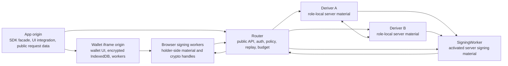

# Architecture

Seams is key, credential, and policy infrastructure for digital authority. It
lets an application prove who is acting, bind that proof to an approved intent,
enforce policy, and execute through a wallet, payment rail, marketplace,
merchant API, or agent tool.

The architecture has three jobs:

1. keep signing authority split across holder-side and server-side material;
2. keep policy decisions in front of execution;
3. keep recovery, export, delegation, and rotation explicit.

## Component Map



## Runtime Roles And Boundaries

| Role                    | Responsibility                                                                                             |
| ----------------------- | ---------------------------------------------------------------------------------------------------------- |
| App origin              | Integration UI and public SDK calls. It receives request data and public results.                          |
| Wallet iframe origin    | Wallet UI, encrypted wallet-origin records, auth-method flows, workers, and session state.                 |
| Browser signing workers | Holder-side signing material, compact lifecycle inputs, and operation-local signing state.                 |
| Router                  | Public API boundary for admission, policy, Wallet Session verification, replay, quota, and signing budget. |
| Deriver A               | A-side derivation role with A-side sealed material and A-side protocol state.                              |
| Deriver B               | B-side derivation role with B-side sealed material and B-side protocol state.                              |
| SigningWorker           | Hot normal-signing role with activated server signing material for admitted sessions.                      |

The app origin does not receive holder shares, PRF outputs, Email OTP secret
material, VoiceID templates, server shares, root shares, or exported keys unless
the user completes an explicit export flow.

## Product Layers

| Layer                    | Responsibility                                                                                                |
| ------------------------ | ------------------------------------------------------------------------------------------------------------- |
| Proof layer              | Passkeys, Email OTP, VoiceID, device proof, org proof, wallet proof, and configured external credentials.     |
| Policy and mandate layer | Signed mandates, typed intent digests, policy epochs, budgets, expiry, revocation, and audit state.           |
| Key infrastructure       | Holder shares, server shares, Router A/B, SigningWorker, recovery, export, delegation, and rotation.          |
| Enforcement gateway      | Allows, denies, escalates, or requires human approval before money, authority, inventory, or API state moves. |
| Execution adapters       | Wallet signatures, payments, merchant APIs, marketplaces, agent tools, and future device actions.             |

## Router A/B Architecture

Router A/B is the split-server boundary behind key derivation and signing
admission.

Ed25519 registration, recovery, export, share refresh, and SigningWorker
activation use protocol-specific Streaming Yao admission and execution routes.
ECDSA uses its protocol-specific strict Router A/B routes. Device linking uses
the applicable typed lifecycle when new signing shares must be provisioned:

```text
Client worker -> Router -> Deriver A + Deriver B -> Client or SigningWorker
```

Day-to-day signing uses the hot signing path:

```text
Client worker -> Router -> SigningWorker -> Router -> Client worker
```

Router is secret-light. It sees public routing metadata, policy decisions,
Wallet Session admission, replay state, quota state, and encrypted role
envelopes. Deriver A and Deriver B receive role-specific material. SigningWorker
receives activated server signing material for the selected signing root, key
version, lane, and session.

## Ed25519 And ECDSA Derivation

Ed25519 uses an actively secure, fixed-circuit Streaming Yao ceremony between
Deriver A and Deriver B. The circuit preserves the standard export-compatible
derivation:

```text
d -> SHA-512(d) -> clamp -> a
```

The multi-megabyte garbled-circuit stream travels only between the Derivers.
The client and Router exchange compact encrypted envelopes and output packages.

ECDSA stays on its curve-specific strict Router A/B path. Deriver A and Deriver
B use threshold-PRF derivation to produce additive secp256k1 scalar shares. It
does not use the Ed25519 Yao circuit.

Normal Ed25519 and ECDSA signing consume already-activated shares and
presignature state. Neither flow invokes the Derivers during ordinary signing.

## Custody Model

Seams is non-custodial because hosted infrastructure cannot sign or export a
user wallet key by itself. Valid signing requires all of these conditions:

1. the selected holder lane participates;
2. Router admits the operation under Wallet Session, policy, replay, quota, and
   budget checks;
3. SigningWorker participates with the activated server-side material for that
   lane and key version.

Export requires a separate, freshly authorized flow. Key rotation and lane
delegation create or transform bounded signing capabilities without handing the
wallet private key to an app, agent, or hosted Router.

## Rotation And Delegation

Rotation covers several operations with different security effects:

| Operation               | Typical result                                                                                |
| ----------------------- | --------------------------------------------------------------------------------------------- |
| Envelope rewrap         | The same plaintext share is protected under new encryption.                                   |
| Server custody rotation | The same effective server contribution moves to a new custody envelope or role configuration. |
| Lane share refresh      | Holder and server lane shares change while the wallet address stays stable.                   |
| Delegated lane creation | A device, agent, or service receives a bounded lane under policy.                             |
| Wallet rekey            | The wallet key changes, usually changing the address.                                         |

Delegated devices and agents receive lane-scoped signing authority. They do not
receive the wallet private key, recovery authority, export authority, or broad
account control. Revocation is enforced through lane status, policy epoch,
budget, expiry, and replay checks.

## Diagram Sources

Architecture diagrams are rendered in docs with Mermaid code blocks. Source
copies live under `/diagrams/` for reuse:

- `/diagrams/platform-layers.mmd`
- `/diagrams/runtime-architecture.mmd`
- `/diagrams/router-ab-flows.mmd`
- `/diagrams/custody-boundaries.mmd`
- `/diagrams/delegated-lanes.mmd`

SVG exports can be added when a target surface cannot render Mermaid directly.
