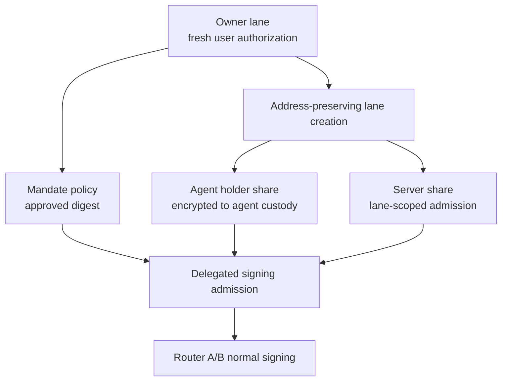

# Delegated Agents

Delegated agents receive bounded signing lanes. The lane is tied to mandate
policy, typed intent checks, budget, expiry, revocation state, and audit
requirements.

## Flow

Every agent signing request must pass lane status, mandate, intent digest,
budget, expiry, idempotency, and replay checks.

## Invariants

1. Agents do not receive wallet private keys.
2. Agents cannot change recovery factors.
3. Agents cannot export wallet keys.
4. Agents cannot sign outside their mandate.
5. Agent revocation does not change the wallet address.
