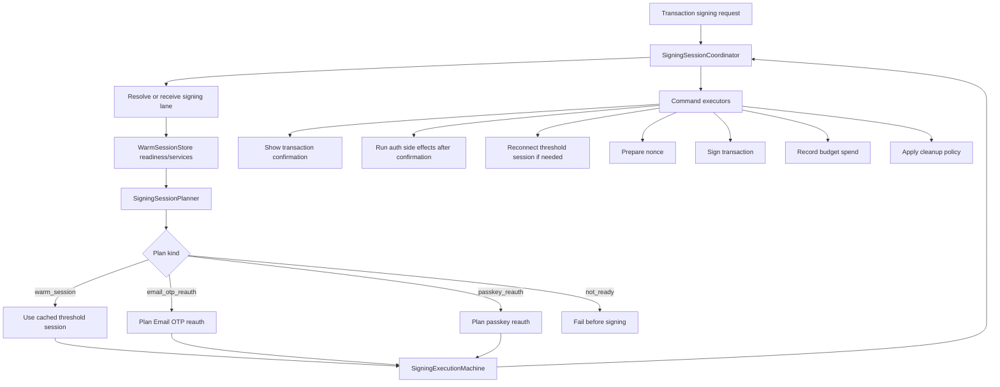
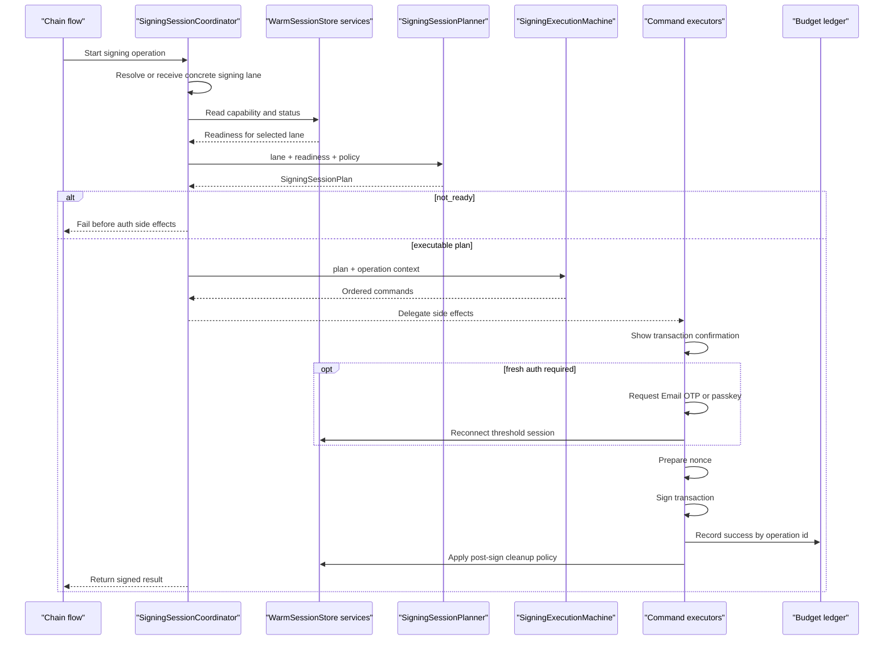

# SecureConfirm Sessions

SecureConfirm sessions are short-lived signing capabilities. They let the wallet
reuse previously confirmed signing state for a bounded TTL and remaining-use
budget, without turning transaction signing into a global "unlocked wallet"
state.

The signing flow treats a session as one selected lane from readiness through
auth, signing, budget accounting, and cleanup.

At the worker boundary:

- The SecureConfirm worker owns the live session capability and enforces TTL and
  remaining uses.
- Signer workers remain one-shot. Each signing request gets a fresh internal
  channel, receives only the session key material it needs, signs, then exits.
- App code never receives PRF output, SecureConfirm secret material, signer
  private keys, or raw session keys.

## Cold And Warm Paths

There are two ways a signing lane becomes usable:

- **Cold path**: the wallet needs fresh auth. The user confirms the transaction,
  then the command executor requests Email OTP or passkey/WebAuthn, reconnects
  the threshold session if needed, and continues signing.
- **Warm path**: the selected lane is already ready. The planner returns
  `warm_session`, the execution machine skips auth side effects, and signing
  uses the cached threshold session.

Both paths still use the same lane identity, operation id, execution ordering,
budget accounting, and cleanup model.

## Mental Model

A transaction signing request is normalized into four separate concepts:

- **Signing lane**: the stable identity of what will sign. It includes the
  account, auth method, curve, chain family, wallet signing-session id,
  threshold session id, storage source, retention, and optional signer scope.
- **Readiness**: the current status of that lane. A lane can be ready, expired,
  exhausted, missing session material, unavailable, or blocked by policy.
- **Signing plan**: the planner's pure decision for what should happen next:
  use a warm session, request Email OTP reauth, request passkey reauth, or fail
  as not ready.
- **Operation identity**: the confirmed transaction signing operation. This is
  separate from the lane and is used for budget accounting and idempotency.

Keeping those concepts separate is the core design choice. The lane says "which
capability", readiness says "can it sign now", the plan says "what auth path is
needed", and the operation id says "which transaction attempt spent budget".

## Coordinator, Planner, And Store

`SigningSessionCoordinator` is the transaction-signing facade. Chain-specific
coordinators resolve or receive the selected lane, read warm-session readiness,
call `SigningSessionPlanner`, drive `SigningExecutionMachine`, delegate side
effects to executors, and finalize budget plus cleanup.

`SigningSessionPlanner` answers one question:

> Given a concrete signing lane, its readiness, and the operation policy, what
> signing plan should this operation use?

It does not read storage, send Email OTP challenges, trigger passkey prompts,
reconnect threshold sessions, spend budget, or clean up signing material.

`WarmSessionStore` is the warm-session storage/readiness side of the system. It
answers different questions:

- What warm signing material exists for this account?
- Is the selected wallet signing session still active?
- Does it have enough remaining uses?
- Can sealed session material be restored?
- Does an ECDSA lane need reconnecting before signing?
- What cleanup should run after a successful signing operation?

Implementation-wise, the store role is split into focused services: capability
reader, status reader, provisioner/restorer, and post-sign policy. The important
boundary is that the store reports and prepares warm-session capability, while
the coordinator owns the operation flow.

## Architecture

The execution machine is intentionally an ordering machine. It emits the legal
sequence of commands and trace events. Command executors perform side effects.
Finalization builds the budget spend from the confirmed operation id and the
selected lane.

## Signing Flow

The important boundary is "no auth side effect before confirmation". The planner
may decide that Email OTP or passkey reauth is required, but the actual challenge
or prompt is a command executor side effect after the transaction confirmer owns
the flow.

## Plan Kinds

| Plan | Meaning | Side effects |
| --- | --- | --- |
| `warm_session` | The selected lane is ready and fresh auth is not required. | No auth side effect. Use the cached threshold session. |
| `email_otp_reauth` | The selected lane uses Email OTP and needs fresh auth. | Send/complete Email OTP after confirmation, then reconnect signing material. |
| `passkey_reauth` | The selected lane uses passkey auth and needs fresh auth. | Run passkey/WebAuthn after confirmation, then reconnect signing material. |
| `not_ready` | The selected lane cannot sign. | Fail before signing. |

## Budget Accounting

Budget accounting is tied to the confirmed operation id, not to the planner
output. This matters for retries and cleanup:

- The lane stays stable across planning, auth, signing, and cleanup.
- The operation id is attached when the transaction confirmation flow owns the
  operation.
- The spend record is built after signing from the operation id plus the selected
  lane.
- Successful spends are idempotent by operation id.
- Failed or cancelled operations record zero-spend outcomes instead of consuming
  a use.

The planner does not return a budget spend plan. That keeps planning pure and
prevents pre-confirmation artifacts from becoming accounting authority.

## Security Invariants

SecureConfirm sessions preserve these invariants:

- One selected lane is carried from readiness through cleanup.
- Auth method selection is centralized in the planner.
- Warm-session services read, restore, reconnect, and clean up signing material.
- Command executors own side effects.
- The execution machine owns command order and transition tracing.
- Operation identity stays separate from lane identity.
- Budget spending happens after signing and is idempotent by operation id.
- SecureConfirm and signer material stay inside worker boundaries; session keys
  move only through internal worker channels.

## Why This Shape

This design keeps the hard parts small:

- The planner is a pure function over lane, readiness, and policy.
- Warm-session services are ordinary IO services.
- The execution machine can be inspected as a command ordering table.
- Chain-specific transaction code stays focused on nonce, signing, broadcast,
  and chain-specific policy.
- Adding another auth method or chain lane does not require duplicating
  wrapper-side freshness checks.

## Related Concepts

- [SecureConfirm WebAuthn](./secureconfirm-webauthn)
- [Threshold Signing](./threshold-signing)
- [Security Model](./security-model)
- [Architecture](./architecture)
