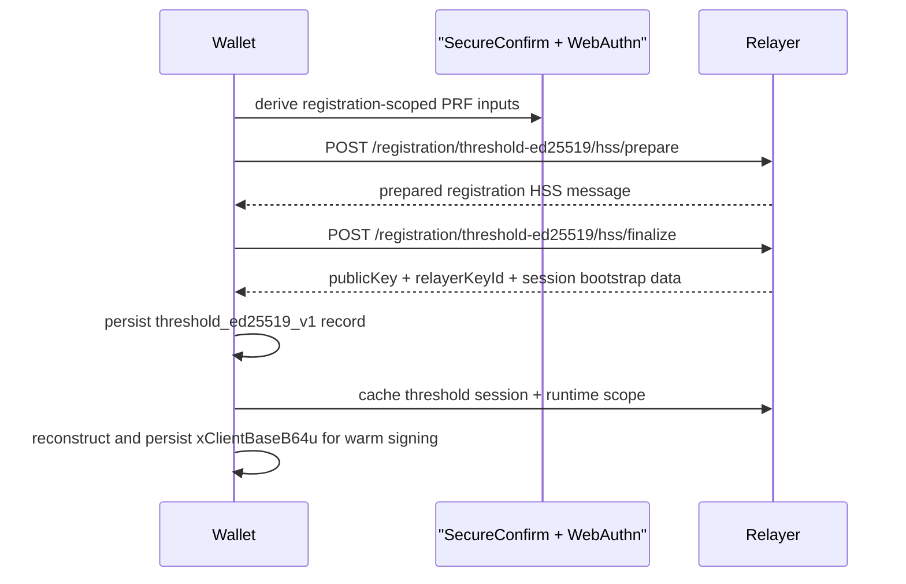
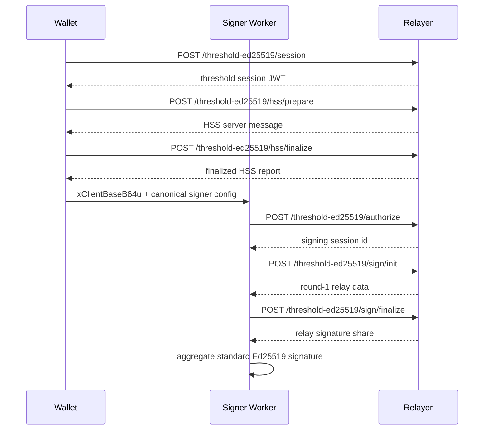

# Threshold Signing

Seams uses a single-key threshold-ed25519 model for NEAR.

There is one canonical Ed25519 lifecycle per account:

- the client derives hidden inputs from passkey PRF output
- the relay derives hidden inputs from its server root material
- the `ed25519-hss` ceremony reconstructs signing-share base material on demand
- signing and export stay bound to the same canonical public key

The active path no longer depends on a second Ed25519 recovery key, local wrap-key
share derivation, or any separate keygen bootstrap flow.

## Canonical Key Lifecycle

The shared hidden root material defines one canonical seed `d`, one canonical
signing scalar `a`, and one canonical public key `A`.

At a high level:

- `y_client` comes from passkey PRF output plus canonical context
- `y_relayer` comes from relay root material plus the same context
- `d` is reconstructed from `y_client + y_relayer`
- `a` is the Ed25519 clamped scalar derived from `SHA-512(d)`
- `A = [a]B`

The HSS ceremony reconstructs base shares of `a` for signing without exposing
raw client or relay root material across the wire.

## Active Product Flow

The active threshold-ed25519 flow has three phases:

1. Registration or session mint establishes the canonical public key and a
   threshold session policy.
2. When the client needs live signing state, it runs the role-separated HSS
   ceremony to reconstruct `xClientBaseB64u`.
3. The signer worker uses only `xClientBaseB64u` plus relay cosigning to
   produce a standard Ed25519 signature for the canonical key.

The relay holds the matching relay signing material and binds all continuation
steps to the same session scope, relayer key id, participant set, and public
key.

## Registration And Warm Session Flow

Registration uses the sessionless single-key HSS seam. The relay derives and
stores canonical threshold-ed25519 registration material from the finalized HSS
report, and the client immediately reconstructs live signing state for warm
session use.

The persisted client record is a single-key `threshold_ed25519_v1` entry. It
stores the canonical public key, relayer metadata, participant ids, and warm
session context. It does not store a second recovery key.

## Threshold Session And HSS Reconstruction

The active warm-session path uses:

- `POST /threshold-ed25519/session`
- `POST /threshold-ed25519/hss/prepare`
- `POST /threshold-ed25519/hss/finalize`

The threshold session token binds:

- account id
- relying party id
- relayer key id
- participant ids
- canonical runtime scope
- ttl / remaining uses

If `xClientBaseB64u` is missing, the client reconstructs it through the HSS
routes before signing. Those requests stay segregated:

- the client does not send raw passkey PRF outputs or raw `xClientBaseB64u`
- the relay does not return raw relay base-share or server root material

## Signing Flow

Once the session is active and `xClientBaseB64u` is available, the signer path
uses the standard threshold-ed25519 authorize and continuation routes.

The active signer worker now consumes only single-key HSS signing material. It
no longer derives live signing shares from wrap-key inputs or bootstrap-share
inputs.

## Export Flow

Export is also bound to the same canonical key lifecycle.

- the product opens canonical seed output from the finalized HSS report
- it verifies that the derived public key matches the active threshold-ed25519
  public key
- it emits only `near-ed25519-seed-v1`

There is no separate recovery-key export identity.

## Security Boundary

The active design enforces:

- one canonical Ed25519 public key per account
- no second active recovery key in the default path
- no raw relay root or relay base-share output returned to the client
- no raw passkey PRF output forwarded to the relay
- no durable client wrap-key share derivation in the signing path

The relay and client each re-derive only their own hidden inputs and exchange
only the role-separated HSS wire messages needed for reconstruction and
signing.
