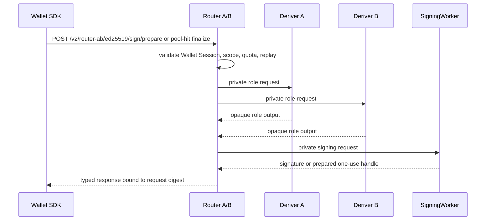

# Threshold Signing

Seams product signing uses Router A/B for Ed25519 and ECDSA-HSS signatures.
The SDK sends Wallet Session authorization to the public Router, and the Router
fans out to private Deriver and SigningWorker services after admission checks.

## Active Product Flow

The public signing boundary is:

- `POST /v2/router-ab/ed25519/sign/prepare`
- `POST /v2/router-ab/ed25519/sign`

The SDK sends bearer Wallet Session auth with browser credentials omitted. The
Router validates the request body, origin, policy, quota, expiry, replay state,
and operation fingerprint before private worker traffic begins.

## Ed25519

Ed25519 supports NEAR transactions, NEP-413 messages, and NEP-461 delegate
actions through Router A/B normal signing.

The Ed25519 presign pool keeps the prior latency model:

- pool hit: one public Router finalize request after local reservation
- pool miss: Router prepare plus finalize fallback
- handles are one-use, scoped, expiring, and bound to the exact signing request

## ECDSA-HSS

ECDSA-HSS supports EVM-family digest signing through the same Router A/B public
boundary.

The ECDSA-HSS presignature pool keeps the prior latency model:

- pool hit: consume one prepared presignature through Router A/B signing
- pool miss: fill through Router A/B ECDSA-HSS pool-fill, then sign
- missing pool-fill state is a hard failure for live refill

## Security Boundary

The current design enforces:

- Wallet Session auth at the public Router boundary
- private Deriver and SigningWorker routes outside the public SDK surface
- strict boundary parsers and unknown-field rejection
- Router ciphertext opacity for role outputs
- one-use nonce or presignature storage
- request-digest binding before SDK response acceptance

Deployment readiness requires local checks plus deployed Cloudflare browser
evidence for configured-origin success, rejected-origin rejection, preflight
behavior, and deleted-route absence.
