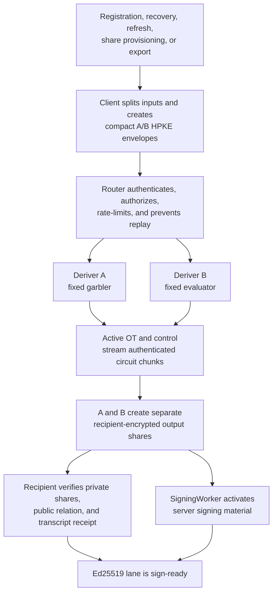
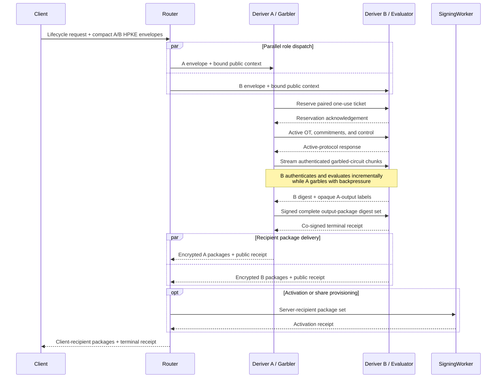
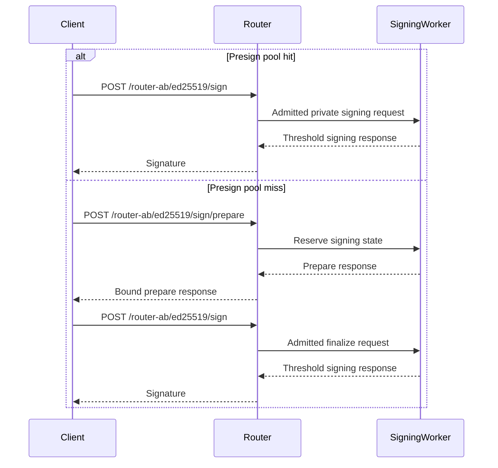

# Streaming Yao A/B

Streaming Yao is the approved Ed25519 lifecycle protocol for Router A/B.
Deriver A garbles one fixed circuit and Deriver B evaluates it. The circuit
computes the export-compatible Ed25519 derivation while neither Deriver learns
the joined seed, scalar, or signing outputs.

This is an implementation target under active development. Production remains
gated on a reviewed actively secure construction, malicious-secure OT, input
consistency, authenticated private outputs, separate-account deployment,
constant-time review, and independent security review. The passive
free-XOR/half-gates circuit is a benchmark artifact only.

## When Yao Runs

Yao runs during infrequent lifecycle ceremonies that create, reproduce,
redistribute, or export Ed25519 material:

| Operation | Uses Yao? | Reason |
| --- | --- | --- |
| Registration and initial activation | Yes | Creates client and SigningWorker shares for the canonical Ed25519 identity. |
| Recovery onto a new device or credential | Yes | Recreates recipient shares while preserving the registered public key. |
| Signing-share or SigningWorker refresh | Yes | Produces fresh recipient shares under a new activation epoch. |
| Explicit key export | Yes | Releases masked seed shares after fresh export authorization. |
| Device linking that provisions a new signing lane | Yes | Creates signing shares for the new recipient. |
| Device linking that only authorizes existing sealed material | No | No derivation or redistribution occurs. |
| Signing a transaction, message, or delegate action | No | Uses already-activated threshold shares. |
| ECDSA lifecycle or signing | No | Uses the separate strict Router A/B threshold-PRF and additive-share protocol. |

A delegation action is an ordinary signature. Provisioning a new delegated
signing lane is a lifecycle ceremony. This distinction determines whether Yao
runs.

## Lifecycle Flow



The large garbled-circuit stream travels directly between A and B. The client
and Router exchange compact requests and encrypted output packages measured in
KiB rather than MiB.

## Server-Side Sequence



The exact A/B request graph is frozen with the selected active-security suite.
The design target is one A/B round trip, with two to four sequential A/B round
trips accepted. Circuit chunks belong to one streaming request and do not each
create another round trip.

From the client's perspective, one Yao ceremony normally fits in one
client-to-Router request and response. An asynchronous deployment can return a
ceremony handle and use authenticated polling. A complete product operation may
also include separate authentication, recovery, or activation steps.

## Normal Signing Flow

Normal Ed25519 signing performs zero Yao work and makes zero Deriver calls.



| Flow | Client to Router | Router to SigningWorker | A/B | Yao |
| --- | ---: | ---: | ---: | ---: |
| Ed25519 lifecycle ceremony | 1 request/response normally | 1 for activation when needed | Target 1, accepted 2-4 | Yes |
| Ed25519 sign, pool hit | 1 request/response | 1 request/response | 0 | No |
| Ed25519 sign, pool miss | 2 request/response pairs | 2 request/response pairs | 0 | No |
| Background presign refill | No user-facing round trip | Background work | 0 | No |

## Compute And Embedded Clients

Streaming Yao is compute-intensive on A and B. Its dominant operations are
symmetric-key hashes, XORs, OT, transcript authentication, and active-security
checks over a fixed circuit. Streaming controls peak memory and overlaps
garbling, transfer, and evaluation. It does not reduce the total cryptographic
work.

The target wall time approaches:

```text
max(garbling CPU, transfer time, evaluation CPU) + protocol round trips
```

The client has a much smaller workload. It splits compact inputs, creates two
HPKE envelopes, opens small recipient packages, verifies commitments and the
public key, and stores the resulting signing material. It does not garble or
evaluate the circuit, run OT, transfer the multi-megabyte stream, or buffer
garbled tables.

This division suits mobile and embedded clients better than a client-side HSS
evaluation. Devices still need a secure random number generator, protected key
storage, ordinary curve and AEAD support, and network access to Router. Normal
signing uses the device's threshold-signing share and stays independent of Yao.

## Payload And Latency

The initial passive fixed-circuit estimate is `1.65-2.10 MiB` from A to B.
Garbled tables are pseudorandom, so compression is ineffective. The production
actively secure payload remains unknown until the compiler and input-provenance
scheme are selected and measured.

For a `2 MiB` stream, serialization alone takes approximately:

| Effective throughput | Payload time |
| ---: | ---: |
| `50 Mbps` | `336 ms` |
| `100 Mbps` | `168 ms` |
| `250 Mbps` | `67 ms` |
| `500 Mbps` | `34 ms` |
| `1 Gbps` | `17 ms` |

Routing, connection setup, RTT, authentication, cold starts, and tail latency
add to these floors. Streaming overlaps transfer with compute. Prepositioning a
one-use circuit can move the large stream out of the online ceremony after the
just-in-time protocol is correct and reviewed.

## Cloudflare Deployment

The client protocol is identical for both supported deployment profiles. The
profile is selected before startup and cannot be selected by a request.

| Profile | Intended use | A/B transport | Security property |
| --- | --- | --- | --- |
| One Cloudflare account | Local development, staging, and optimistic latency/cost benchmarks | Service Bindings | Separate Worker runtime and storage bindings while the shared control plane remains honest. |
| Two independent Cloudflare accounts | Production and production-parity development | Authenticated, pinned cross-account HTTPS | Independent administrators, deployment credentials, secrets, storage, logs, backups, and incident authority. |

Same-account deployment contains a compromise confined to one Worker runtime
while the account administration and deployment control plane remain honest.
An account administrator or shared deployment credential can replace both
Workers and create effective A+B collusion. It therefore cannot support the
strict production claim.

## Security Properties

With the production gates complete and A and B in independent administrative
domains, the target provides privacy and correctness-with-abort against Router
plus at most one malicious Deriver:

- Router sees public metadata, timing, ciphertexts, and signed receipts;
- Deriver A never receives B's plaintext input or joined output;
- Deriver B never receives A's plaintext input or joined output;
- output shares are generated inside the approved protocol and encrypted
  separately to the client and SigningWorker;
- malicious-secure OT, input consistency, selective-failure resistance, and
  authenticated private outputs detect active cheating before acceptance;
- one-use tickets prevent preprocessing, labels, masks, and transcript nonces
  from being reused;
- the client can reconstruct the seed only during a freshly authorized export;
- normal signing never reconstructs the private key.

The claim excludes A+B collusion, Cloudflare platform-wide compromise,
fairness, guaranteed output delivery, and availability when a Deriver aborts.

## Cost Model

The July 10, 2026 planning snapshot for Cloudflare Workers Standard assumes a
`$5` monthly minimum per paid account, included request and CPU allowances,
CPU overage at `$0.02` per million CPU-ms, and no added Workers data-transfer or
egress charge. Pricing and Enterprise contracts can change, so deployment
estimates must refresh these inputs.

Under that snapshot, the large A-to-B payload affects latency and optional
storage while contributing `$0` in Workers bandwidth fees. CPU, active-protocol
rounds, retries, Durable Objects, and any prepositioned circuit storage drive
variable cost.

For one million successful ceremonies, equal CPU on A and B, dedicated accounts,
and request counts within the included allowance:

| CPU per Deriver per ceremony | Two-account monthly total |
| ---: | ---: |
| `30 ms` | `$10.00` |
| `50 ms` | `$10.80` |
| `100 ms` | `$12.80` |
| `500 ms` | `$28.80` |
| `1 second` | `$48.80` |

A same-account development deployment has a `$5` base under the same planning
assumptions and shares one CPU allowance. Service Binding calls do not add
request fees. This is an optimistic benchmark under the shared-control-plane
security model.

The historical approximately `300 ms` repository HSS measurement covered a
simulator and wrapper path. It does not establish latency, cost, or security for
a genuine succinct-HSS construction. The closed succinct-HSS analysis predicted
group-heavy computation and left amplification, active security, and complete
wire volume unresolved. Streaming Yao is the selected Ed25519 path; deployed
active-Yao measurements determine its final latency and cost.

