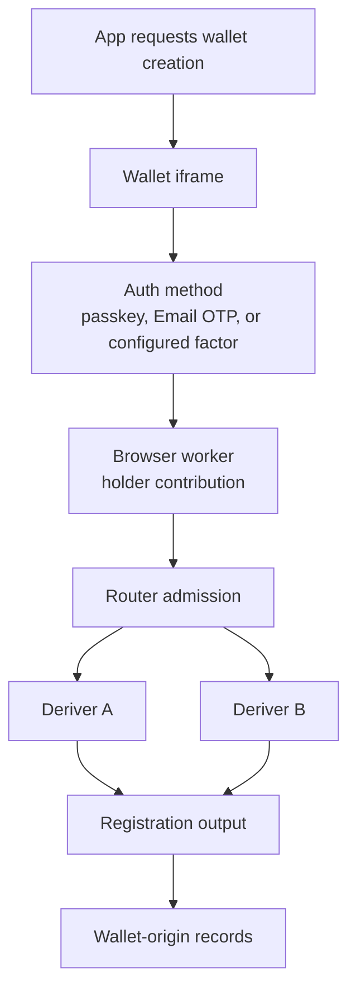

# Create A Wallet

Wallet creation registers a wallet key under a user-controlled auth method. The
app receives public wallet identity; holder-side and server-side material stay
inside their custody boundaries.

## Flow



## What To Decide

| Decision | Why it matters |
| --- | --- |
| Auth method | Determines how the user creates, unlocks, or recovers holder-side authority. |
| Wallet target | Selects the key family, public address shape, and signing lane shape. |
| Recovery policy | Defines how the user regains access and which factors can authorize export. |
| Hosting model | Determines whether Router A/B roles are hosted, self-hosted, or split across deployments. |

## Passkey Wallet Example

Use the React hook when you want to drive registration from your own UI.

```tsx
import { useSeams } from '@seams/sdk/react';

export function CreateWalletButton() {
  const { registerPasskey } = useSeams();

  async function createWallet() {
    const result = await registerPasskey('alice.testnet', {
      onEvent: (event) => {
        console.log(event.phase, event.status, event.message);
      },
    });

    if (!result.success) {
      throw new Error(result.error || 'Wallet registration failed');
    }

    console.log('wallet id', result.nearAccountId);
    console.log('transaction id', result.transactionId);
  }

  return <button onClick={createWallet}>Create wallet</button>;
}
```

For a lower-level integration, call the namespaced API directly.

```ts
const result = await seams.near.registerNearWallet({
  nearAccountId: 'alice.testnet',
  authMethod: { kind: 'passkey' },
  options: {
    onEvent: (event) => console.log(event.phase, event.status),
  },
});

if (!result.success) {
  throw new Error(result.error || 'Wallet registration failed');
}
```

## Result

The app receives a wallet id, public address, and non-secret flow state.
Holder-side material stays in wallet-origin workers or encrypted wallet-origin
records. Server-side material stays inside the Router A/B custody boundary.

Read next: [Sign With Policy](/getting-started/sign-with-policy).
