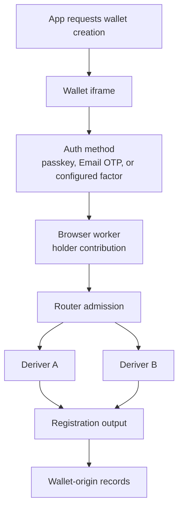

# Create a wallet

Wallet creation registers a wallet key under a user-controlled auth method. The
app receives public wallet identity; holder-side and server-side material stay
inside their custody boundaries.

## Flow

```mermaid
flowchart TD
  App["App requests wallet creation"] --> Wallet["Wallet iframe"]
  Wallet --> Auth["Auth method<br/>passkey, Email OTP, or configured factor"]
  Auth --> Worker["Browser worker<br/>holder contribution"]
  Worker --> Router["Router admission"]
  Router --> A["Deriver A"]
  Router --> B["Deriver B"]
  A --> Output["Registration output"]
  B --> Output
  Output --> WalletRecord["Wallet-origin records"]
```

## What to decide

| Decision        | Why it matters                                                                            |
| --------------- | ----------------------------------------------------------------------------------------- |
| Auth method     | Determines how the user creates, unlocks, or recovers holder-side authority.              |
| Wallet target   | Selects the key family, public address shape, and signing lane shape.                     |
| Recovery policy | Defines how the user regains access and which factors can authorize export.               |
| Hosting model   | Determines whether Router A/B roles are hosted, self-hosted, or split across deployments. |

## Passkey wallet example

Use the React hook when you want to drive registration from your own UI.

<<< ../examples/registration.tsx

`registerPasskey` takes an options object. It allocates the wallet identity and
uses the configured NEAR provisioning policy; it does not accept an account id.
The result is a discriminated union, so code should branch on `success` and
`kind` before reading branch-specific capabilities or provisioning state.

## Expected result

The app receives a wallet id and non-secret flow state. Ready capability
branches carry their chain-specific public identity; a pending NEAR branch must
reach its ready state before the app reads a NEAR account. Holder-side material
stays in wallet-origin workers or encrypted wallet-origin records. Server-side
material stays inside the Router A/B custody boundary.

## Recoverable failures

A cancelled passkey prompt ends the current registration attempt. A retryable
NEAR provisioning branch preserves the wallet identity and can resume through
the provisioning API. Authentication, origin, or publishable-key failures need
configuration correction before retrying.

Read next: [Sign With Policy](/getting-started/sign-with-policy).
