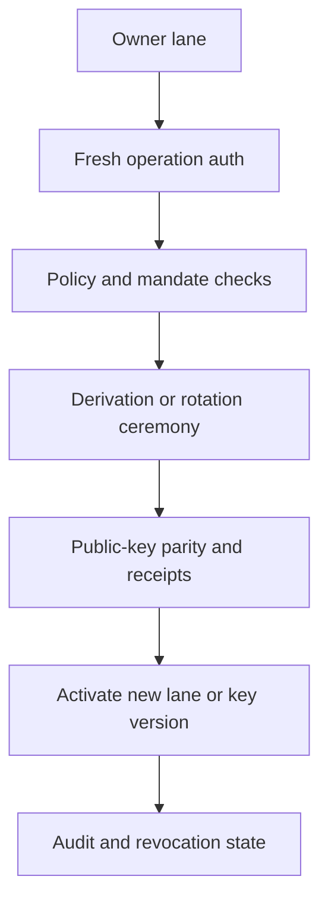

# Delegate Or Rotate

Wallet delegation and rotation change who can participate in signing, how
shares are protected, or which key version is active.

## Common Operations

| Operation | Result |
| --- | --- |
| Linked device | Adds a user-controlled device with its own wallet lane and audit history. |
| Delegated agent | Issues a policy-bound wallet lane for an agent or service. |
| Lane share refresh | Changes holder and server lane shares while preserving the wallet address. |
| Server custody rotation | Moves server-side custody to a new envelope or role configuration. |
| Export | Releases key material through a freshly authorized export flow. |
| Wallet rekey | Creates a new wallet key version and usually a new address. |

## Flow Shape



Delegated lanes and refreshed lanes must pass the same Router admission checks
as normal signing. Revoked lanes fail before SigningWorker participation.

## Wallet-First Rule

Treat wallet delegation as the first advanced capability. Once linked-device
and delegated-agent wallet lanes are understood, the same model can express
access passes and non-wallet credentials.

## Link A Device

Device 2 starts the link session and displays the QR code.

```tsx
import * as React from 'react';
import { useSeams } from '@seams/sdk/react';

export function NewDeviceLinkCode() {
  const { startDevice2LinkingFlow, stopDevice2LinkingFlow } = useSeams();
  const [qrCodeDataURL, setQrCodeDataURL] = React.useState<string | null>(null);

  async function start() {
    const link = await startDevice2LinkingFlow();
    setQrCodeDataURL(link.qrCodeDataURL);
  }

  React.useEffect(() => {
    return () => {
      void stopDevice2LinkingFlow();
    };
  }, [stopDevice2LinkingFlow]);

  return (
    <>
      <button onClick={start}>Show link code</button>
      {qrCodeDataURL ?  : null}
    </>
  );
}
```

Device 1 scans the QR code and approves the new lane.

```tsx
import { QRScanMode, useDeviceLinking } from '@seams/sdk/react';
import type { DeviceLinkingQRData } from '@seams/sdk/react';

export function ApproveLinkedDevice(props: { qrData: DeviceLinkingQRData }) {
  const { linkDevice } = useDeviceLinking({
    onDeviceLinked: (result) => console.log('linked device', result),
    onEvent: (event) => console.log(event.phase, event.status),
  });

  return (
    <button onClick={() => linkDevice(props.qrData, QRScanMode.CAMERA)}>
      Approve device
    </button>
  );
}
```

## Export A Wallet Key

Export is intentionally separate from normal signing. Use a fresh user action.

```ts
import { nearAccountRefFromAccountId } from '@seams/sdk/advanced';

await seams.keys.exportKeypairWithUI({
  kind: 'near',
  nearAccount: nearAccountRefFromAccountId('alice.testnet'),
  options: {
    chain: 'near',
    variant: 'drawer',
    onEvent: (event) => console.log(event.phase, event.status),
  },
});
```

For an EVM-family export, bind the request to the exact wallet session and
chain target.

```ts
import {
  thresholdEcdsaChainTargetFromConfig,
  walletSessionRefFromSession,
} from '@seams/sdk/advanced';

await seams.keys.exportKeypairWithUI({
  kind: 'ecdsa',
  walletSession: walletSessionRefFromSession({
    walletId: 'alice.testnet',
    userId: 'alice.testnet',
  }),
  chainTarget: thresholdEcdsaChainTargetFromConfig({
    network: 'tempo-testnet',
    rpcUrl: 'https://rpc.moderato.tempo.xyz',
    explorerUrl: 'https://explore.testnet.tempo.xyz',
    chainId: 42431,
  }),
  options: {
    variant: 'drawer',
    onEvent: (event) => console.log(event.phase, event.status),
  },
});
```

Read next: [Delegation](/concepts/delegation/) and
[Key Rotation](/concepts/delegation/key-rotation).
