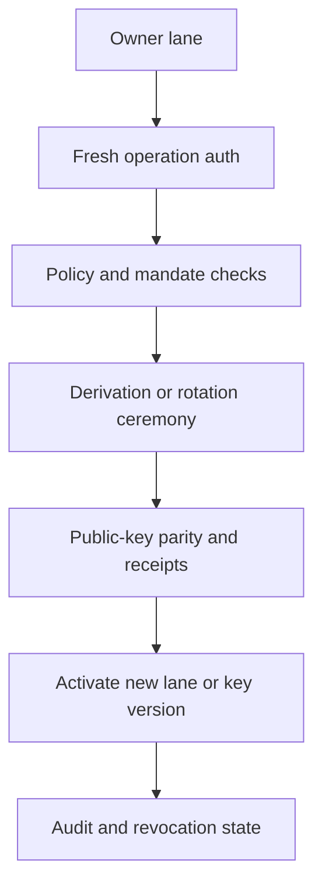

# Delegate or rotate

Wallet delegation and rotation change who can participate in signing, how
shares are protected, or which key version is active.

## Common operations

| Operation               | Result                                                                     |
| ----------------------- | -------------------------------------------------------------------------- |
| Linked device           | Adds a user-controlled device with its own wallet lane and audit history.  |
| Delegated agent         | Issues a policy-bound wallet lane for an agent or service.                 |
| Lane share refresh      | Changes holder and server lane shares while preserving the wallet address. |
| Server custody rotation | Moves server-side custody to a new envelope or role configuration.         |
| Export                  | Releases key material through a freshly authorized export flow.            |
| Wallet rekey            | Creates a new wallet key version and usually a new address.                |

## Flow shape

```mermaid
flowchart TD
  Owner["Owner lane"] --> FreshAuth["Fresh operation auth"]
  FreshAuth --> Policy["Policy and mandate checks"]
  Policy --> Ceremony["Derivation or rotation ceremony"]
  Ceremony --> Parity["Public-key parity and receipts"]
  Parity --> Activate["Activate new lane or key version"]
  Activate --> Audit["Audit and revocation state"]
```

Delegated lanes and refreshed lanes must pass the same Router admission checks
as normal signing. Revoked lanes fail before SigningWorker participation.

## Wallet-first rule

Treat wallet delegation as the first advanced capability. Once linked-device
and delegated-agent wallet lanes are understood, the same model can express
access passes and non-wallet credentials.

## Link a device

Device 2 starts the link session and displays the QR code.

<<< ../examples/device-linking.tsx

Device 1 scans the QR code and approves the new lane.

The same source includes the Device 1 scanner action. The linking hook reports
errors through `onError`; it does not expose an `onDeviceLinked` callback.

## Export a wallet key

Export is intentionally separate from normal signing. Use a fresh user action.

<<< ../examples/export-wallet.ts

The export example resolves the exact lane before opening the viewer. Both
curves use the wallet session, and Ed25519 additionally requires the NEAR
account and material activation returned by lane resolution.

## Recover a wallet account

Recovery synchronization is wallet-scoped. The result exposes the wallet and
resolved NEAR identity only on its successful branch.

<<< ../examples/recovery.ts

## Expected result and recovery

Device linking creates a distinct, revocable credential. Export opens a fresh
wallet-origin disclosure flow. Recovery synchronization returns the restored
wallet and account identity only from its successful branch. Expire abandoned
link sessions, request fresh authorization after cancellation, and never retry
an export or rotation through an older session.

Read next: [Delegation](/concepts/delegation/) and
[Key Rotation](/concepts/delegation/key-rotation).
