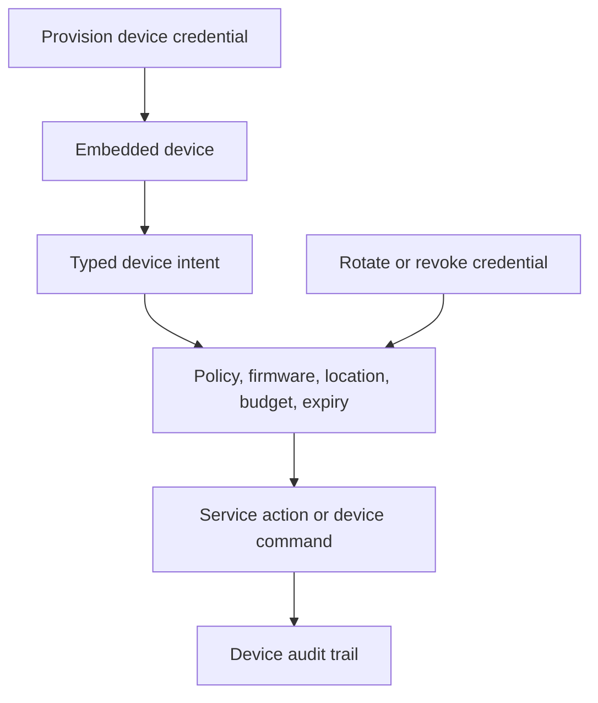

# Embedded Device Credentials

Embedded devices need credentials with narrow authority, rotation, and
revocation. The device should prove its identity, bind that proof to a typed
operation, and execute only when policy allows it.

## Model

```text
device credential -> typed device intent -> policy -> device or service action
```

## Device Examples

- point-of-sale terminal;
- vending machine;
- delivery locker;
- vehicle module;
- warehouse scanner;
- smart appliance;
- industrial sensor.

## Flow



## Boundaries

| Boundary | Why it matters |
| --- | --- |
| Device identity | Distinguishes one physical device from a model, fleet, or tenant. |
| Operation intent | Prevents a generic device token from becoming broad API authority. |
| Policy epoch | Lets operators revoke or update device authority quickly. |
| Rotation | Replaces credentials after compromise, repair, transfer, or firmware events. |
| Audit | Records which device acted, what it requested, and why it was allowed. |

For high-value devices, use delegated lanes or split signing authority so the
device alone cannot execute sensitive actions. For low-risk telemetry, the
credential can be a scoped proof that feeds the same policy engine.

## Application-Side Shape

```ts
type DeviceIntent = {
  kind: 'embedded_device.command';
  deviceId: string;
  command: 'unlock' | 'dispense' | 'settle_batch' | 'report_telemetry';
  requestId: string;
  observedAtMs: number;
};

async function authorizeDeviceIntent(intent: DeviceIntent) {
  // Device-specific proof, usually backed by a device key or secure element.
  const deviceProof = await signDeviceChallenge({
    deviceId: intent.deviceId,
    challenge: crypto.randomUUID(),
  });

  const decision = await fetch('/api/devices/authorize', {
    method: 'POST',
    headers: { 'content-type': 'application/json' },
    body: JSON.stringify({
      intent,
      deviceProof,
      // App-specific device inventory metadata.
      firmwareVersion: await readFirmwareVersion(),
    }),
  }).then((response) => response.json());

  if (decision.status !== 'allow') {
    throw new Error(decision.reason || 'Device command denied');
  }

  return decision;
}
```

Read next: [Auth Planes](/concepts/auth-planes) and
[Delegated Agents](/concepts/delegation/delegated-agents).
