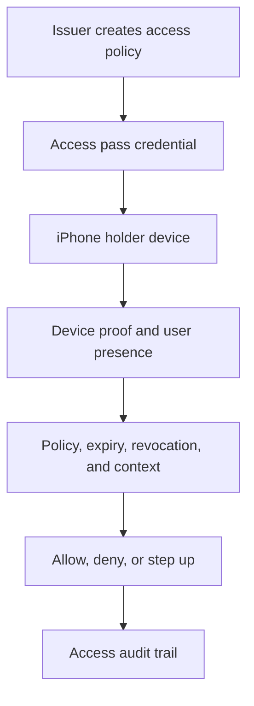

# iPhone Access Passes

Access passes use the same custody and policy model as wallets, with a
different execution adapter. Instead of signing a transaction, the credential
proves that a person or device may enter, unlock, claim, redeem, or use a
specific right.

## Model

```text
credential holder -> device proof -> policy -> access decision -> audit
```

## What The Pass Represents

An iPhone access pass can represent:

- event admission;
- room or building access;
- membership status;
- subscription entitlement;
- loyalty or redemption rights;
- employee, contractor, or visitor access.

## Flow



## What Changes From Wallets

| Wallet flow | Access-pass flow |
| --- | --- |
| Wallet id and public address | Pass id and issuer-scoped subject |
| Transaction or message intent | Access or redemption intent |
| Signing lane | Credential presentation lane |
| Signature execution | Access decision or proof presentation |
| Wallet recovery | Pass recovery or reissuance policy |

The pass should still bind proof, intent, policy epoch, expiry, revocation, and
audit facts. Sensitive pass actions can require passkey, VoiceID, device
presence, or another step-up method.

## Application-Side Shape

Access-pass APIs are app-specific. The important part is the same authority
shape: prove the holder, bind the access intent, check policy, and write an
audit record.

```ts
type AccessPassIntent = {
  kind: 'access_pass.present';
  passId: string;
  subjectId: string;
  venueId: string;
  gateId: string;
  issuedAtMs: number;
};

async function presentAccessPass(intent: AccessPassIntent) {
  // App-specific proof collection. Use passkey, device-bound key, VoiceID, or
  // another configured credential source.
  const proof = await requestDeviceBoundProof({
    subjectId: intent.subjectId,
    reason: 'access_pass.present',
  });

  const decision = await fetch('/api/access/decide', {
    method: 'POST',
    headers: { 'content-type': 'application/json' },
    body: JSON.stringify({
      intent,
      proof,
      // App policy state, stored server-side.
      policyEpoch: await readCurrentPolicyEpoch(intent.venueId),
    }),
  }).then((response) => response.json());

  if (decision.status !== 'allow') {
    throw new Error(decision.reason || 'Access denied');
  }

  return decision;
}
```

Read next: [Credentials And Proofs](/concepts/policy/credentials-and-proofs).
