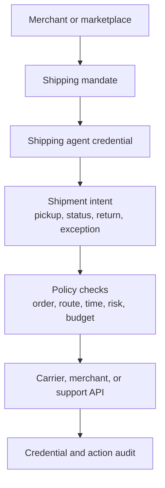

# Shipping Agent Credentials

Shipping agents need narrow authority. A credential should prove which agent is
acting, what shipment or order they may touch, and which actions are allowed
right now.

## Model

```text
shipper mandate -> agent credential -> shipment intent -> policy -> execution
```

## Example Authority

```text
This shipping agent may update delivery status, request pickup confirmation,
and initiate a return label for order 123 until 18:00 UTC, with customer refund
actions requiring human approval.
```

## Flow



## Policy Checks

| Check | Purpose |
| --- | --- |
| Subject | Confirms the agent, role, or carrier identity. |
| Shipment scope | Limits authority to one order, route, warehouse, region, or customer. |
| Action scope | Allows status updates, pickup proof, label creation, or exception handling. |
| Risk rules | Escalates refunds, address changes, high-value items, or suspicious substitutions. |
| Expiry and revocation | Stops stale credentials and revoked agent authority. |

The credential should authorize the shipping action rather than expose a broad
merchant API key. When a shipping action needs payment, refund, or wallet
execution, route it through the wallet signing path.

## Application-Side Shape

```ts
type ShippingIntent = {
  kind: 'shipping_agent.update_status';
  orderId: string;
  shipmentId: string;
  status: 'picked_up' | 'in_transit' | 'delivered' | 'exception';
  observedAtMs: number;
};

async function submitShippingIntent(intent: ShippingIntent) {
  // App-specific credential retrieval for the active shipping agent.
  const credential = await getAgentCredential({
    agentId: 'agent_123',
    shipmentId: intent.shipmentId,
  });

  const decision = await fetch('/api/shipping/authorize', {
    method: 'POST',
    headers: { 'content-type': 'application/json' },
    body: JSON.stringify({
      credential,
      intent,
      mandateId: 'mandate_shipper_123',
    }),
  }).then((response) => response.json());

  if (decision.status !== 'allow') {
    throw new Error(decision.reason || 'Shipping action denied');
  }

  return await fetch('/api/carrier/status', {
    method: 'POST',
    headers: { 'content-type': 'application/json' },
    body: JSON.stringify({
      shipmentId: intent.shipmentId,
      status: intent.status,
      authorizationId: decision.authorizationId,
    }),
  });
}
```

Read next: [Mandates](/concepts/policy/mandates).
