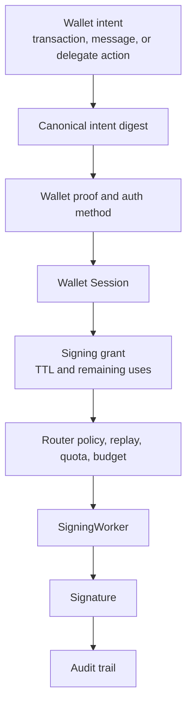

# Sign With Policy

Wallet signing starts with a typed intent. The intent is normalized, checked
against policy, admitted through the correct auth planes, and executed through
the selected signing lane.

## Flow



## Admission Checks

| Check | Purpose |
| --- | --- |
| Wallet Session | Confirms the wallet-user operation is admitted. |
| Signing lane | Selects the exact wallet capability for the operation. |
| Signing grant | Enforces TTL, remaining uses, and budget. |
| Policy | Checks mandate, constraints, revocation state, and risk rules. |
| Replay and idempotency | Prevents request reuse and ambiguous execution. |

Normal signing uses the signing shares produced during registration, refresh, or
activation. Ed25519 Streaming Yao and ECDSA threshold-PRF derivation stay
outside this normal-signing path.

## Wallet Examples

- Sign a NEAR transaction.
- Sign a NEP-413 message.
- Sign a NEP-461 delegate action.
- Sign an EVM transaction from the wallet's threshold ECDSA address.
- Sign a typed payment or checkout intent.

## NEAR Transaction Example

```tsx
import {
  ActionType,
  TxExecutionStatus,
  useSeams,
  type FunctionCallAction,
} from '@seams/sdk/react';
import { nearAccountRefFromAccountId } from '@seams/sdk/advanced';

export function SetGreetingButton() {
  const { seams, loginState } = useSeams();

  async function sign() {
    if (!loginState.nearAccountId) {
      throw new Error('Wallet is not unlocked');
    }

    const action: FunctionCallAction = {
      type: ActionType.FunctionCall,
      methodName: 'set_greeting',
      args: { greeting: 'Hello from Seams' },
      gas: '30000000000000',
      deposit: '0',
    };

    await seams.near.signAndSendTransaction({
      nearAccount: nearAccountRefFromAccountId(loginState.nearAccountId),
      receiverId: 'guest-book.testnet',
      actions: [action],
      options: {
        waitUntil: TxExecutionStatus.EXECUTED_OPTIMISTIC,
        onEvent: (event) => {
          console.log(event.phase, event.status, event.message);
        },
      },
    });
  }

  return <button onClick={sign}>Sign transaction</button>;
}
```

## NEP-413 Message Example

```ts
import { nearAccountRefFromAccountId } from '@seams/sdk/advanced';

const signed = await seams.near.signNEP413Message({
  nearAccount: nearAccountRefFromAccountId('alice.testnet'),
  params: {
    message: 'Approve checkout quote #quote_123',
    recipient: 'merchant.example',
    state: 'quote_123',
  },
  options: {
    onEvent: (event) => console.log(event.phase, event.status),
  },
});

if (!signed.success) {
  throw new Error(signed.error || 'Message signing failed');
}
```

## EVM-Family Transaction Example

Build the chain-specific transaction with your app's EVM utilities, then pass
the typed request through Seams.

```ts
import {
  thresholdEcdsaChainTargetFromConfig,
  walletSessionRefFromSession,
} from '@seams/sdk/advanced';

const walletSession = walletSessionRefFromSession({
  walletId: 'alice.testnet',
  userId: 'alice.testnet',
});

const execution = await seams.tempo.executeEvmFamilyTransaction({
  walletSession,
  chainTarget: thresholdEcdsaChainTargetFromConfig({
    network: 'tempo-testnet',
    rpcUrl: 'https://rpc.moderato.tempo.xyz',
    explorerUrl: 'https://explore.testnet.tempo.xyz',
    chainId: 42431,
  }),
  // Build this with your app's EVM transaction utilities.
  request: buildEip1559TransactionRequest({
    to: '0x1234567890abcdef1234567890abcdef12345678',
    data: '0x',
    value: '0',
  }),
  options: {
    onEvent: (event) => console.log(event.phase, event.status),
  },
});

console.log('tx hash', execution.txHash);
```

Read next: [Delegate Or Rotate](/getting-started/delegate-or-rotate).
