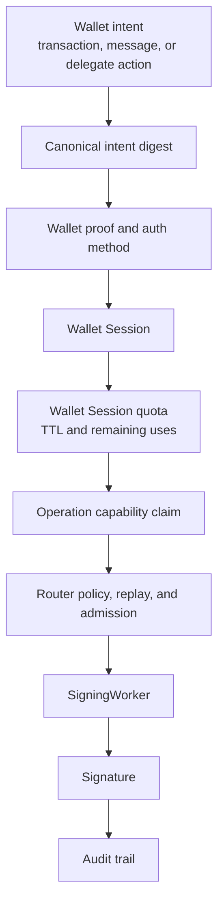

# Sign with policy

Wallet signing starts with a typed intent. The intent is normalized, checked
against policy, admitted through the correct auth planes, and executed through
the selected signing lane.

## Flow

```mermaid
flowchart TD
  Intent["Wallet intent<br/>transaction, message, or delegate action"] --> Digest["Canonical intent digest"]
  Digest --> Proof["Wallet proof and auth method"]
  Proof --> Session["Wallet Session"]
  Session --> Quota["Wallet Session quota<br/>TTL and remaining uses"]
  Quota --> Claim["Operation capability claim"]
  Claim --> Router["Router policy, replay, and admission"]
  Router --> SigningWorker["SigningWorker"]
  SigningWorker --> Signature["Signature"]
  Signature --> Audit["Audit trail"]
```

## Admission checks

| Check                  | Purpose                                                        |
| ---------------------- | -------------------------------------------------------------- |
| Wallet Session         | Confirms the wallet-user operation is admitted.                |
| Signing lane           | Selects the exact wallet capability for the operation.         |
| Wallet Session quota   | Enforces TTL and remaining uses for reusable signing.          |
| Capability claim       | Binds one operation to its exact capability and material.      |
| Policy                 | Checks mandate, constraints, revocation state, and risk rules. |
| Replay and idempotency | Prevents request reuse and ambiguous execution.                |

Normal signing uses the signing shares produced during registration, refresh, or
activation. Ed25519 Streaming Yao and ECDSA threshold-PRF derivation stay
outside this normal-signing path.

## Wallet examples

- Sign a NEAR transaction.
- Sign a NEP-413 message.
- Sign a NEP-461 delegate action.
- Sign an EVM transaction from the wallet's threshold ECDSA address.
- Sign a typed payment or checkout intent.

## Unlock before signing

Unlock creates the wallet session used by the signing capabilities. Handle its
NEAR and EVM-family success branches explicitly.

<<< ../examples/unlock.ts

## NEAR transaction example

<<< ../examples/near-signing.tsx

## NEP-413 message example

<<< ../examples/nep413-signing.ts

## EVM-family transaction example

Build the chain-specific transaction with your app's EVM utilities, then pass
the typed request through Seams.

<<< ../examples/evm-signing.ts

## Expected result and recovery

Successful results expose the signed or submitted operation identity for the
selected chain. Treat cancellation and policy denial as final for the current
request. Refresh an expired or depleted wallet session before retrying. When
broadcast status is uncertain, reconcile the transaction or nonce lane before
submitting another operation.

Read next: [Delegate Or Rotate](/getting-started/delegate-or-rotate).
