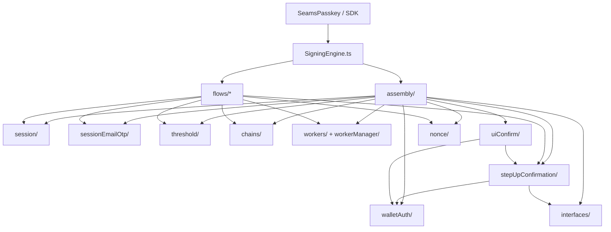
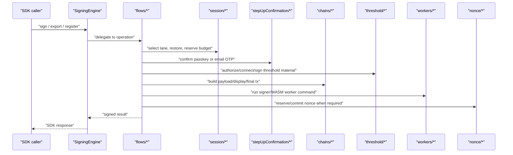
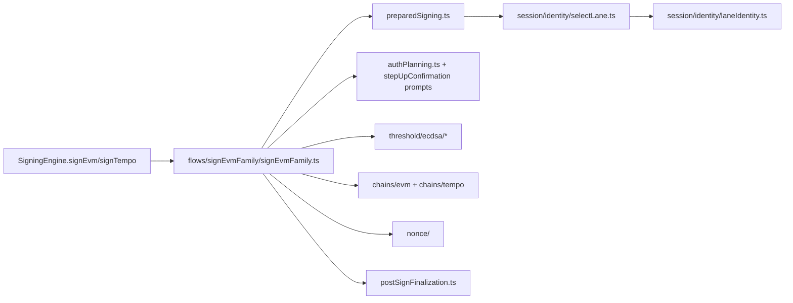
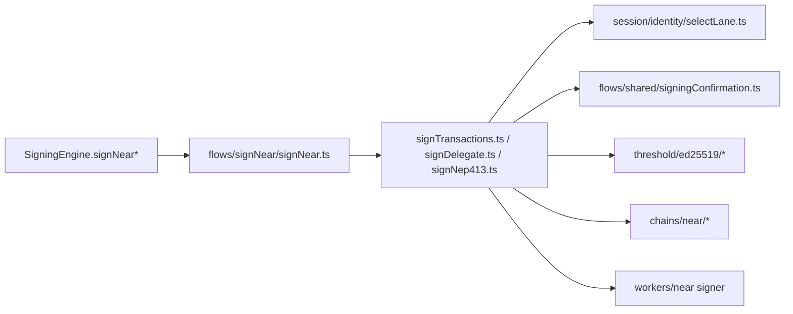

# Signing Architecture (`client/src/core/signingEngine`)

This folder is the SDK signing runtime for NEAR, EVM, and Tempo flows. The
Refactor 33 layout is organized by call direction: public engine methods enter a
single operation module, operation modules call state/session/confirmation/
chain/threshold/worker modules, and child modules do not call back into
flows or `SigningEngine`.

## Public Entrypoints

- `index.ts`: public SDK signing-engine export surface.
- `SigningEngine.ts`: product-level facade. Public methods should delegate to
  one operation module within one hop.
- `assembly/`: assembles runtime dependencies and operation ports for `SigningEngine`.

## Folder Roles

- `flows/`: vertical signing, registration, recovery, and email-OTP
  operation paths.
- `flows/shared/`: shared operation state machine, command ports, and
  confirmation command runner.
- `session/`: selected lane identity, available lanes, record normalization,
  restore, readiness, budget, sealed persistence, and warm-session state.
- `sessionEmailOtp/`: Email OTP threshold-session provisioning, restoration,
  and warm-session status coordination.
- `stepUpConfirmation/`: confirmation contracts, email-OTP/passkey prompts, intent
  digest preparation, and channel message contracts.
- `chains/`: chain-specific payload, display, nonce, and WASM adaptor code.
- `threshold/`: threshold protocol clients and protocol material handling.
- `workers/` and `workerManager/`: worker operation dispatch, worker types, and
  host-side worker transport.
- `nonce/`: nonce reservation and lifecycle coordination.
- `walletAuth/`: WebAuthn/passkey credential and auth-mode helpers.
- `interfaces/`: shared public/runtime contracts and primitive cross-domain
  signing identifiers such as ECDSA chain targets.

Auth methods are symmetric at the prompt/auth-plan boundary:
`stepUpConfirmation/passkeyPrompt` and `stepUpConfirmation/otpPrompt` own method
prompt construction. Method session folders are introduced only for durable
cross-operation lifecycle ownership, which is why Email OTP has
`sessionEmailOtp/` and passkey currently has no `sessionPasskey/`.

## Import Direction

Rules enforced by Refactor 33 guards:

- `flows/*` must not import `SigningEngine` or assembly construction.
- Child folders must not import `flows/*`.
- New broad internal `index.ts` barrels are blocked.
- Deleted `api/`, `orchestration/`, `chainAdaptors/`, and `signers/` paths stay
  deleted.

## Operation Pipeline

## Key State Shapes

- `SelectedLane` (`session/identity/laneIdentity.ts`): canonical selected
  signing lane. Its object construction is owned by
  `session/identity/laneIdentity.ts`.
- `LaneCandidate` (`session/identity/laneIdentity.ts`): concrete candidate derived from
  available lane or persisted session records before selection.
- `SelectedSigningSessionPlanningLane` (`session/signingSession/types.ts`):
  planning-layer extension for operation planning, storage source, retention,
  and backing material context.
- `ThresholdEcdsaSessionRecord` / `ThresholdEd25519SessionRecord`
  (`session/persistence/records.ts`): persistence records normalized at
  storage boundaries.
- `ThresholdEcdsaChainTarget` (`interfaces/ecdsaChainTarget.ts`): neutral EVM
  and Tempo chain target identity shared by session, prompt, threshold, and
  operation modules.
- `PreparedOperation`, `BudgetAdmittedOperation`, and `SignedOperation`
  (`flows/shared/operationState.ts`): monotonic operation state-machine
  states.

## EVM/Tempo Signing

EVM and Tempo share the ECDSA operation path. Chain differences are isolated in
`chains/evm`, `chains/tempo`, nonce lifecycle modules, and final transaction
encoding.

## NEAR Signing

NEAR uses the same operation state-machine approach as EVM/Tempo, with Ed25519
threshold material and NEAR-specific payload/display assembly.
