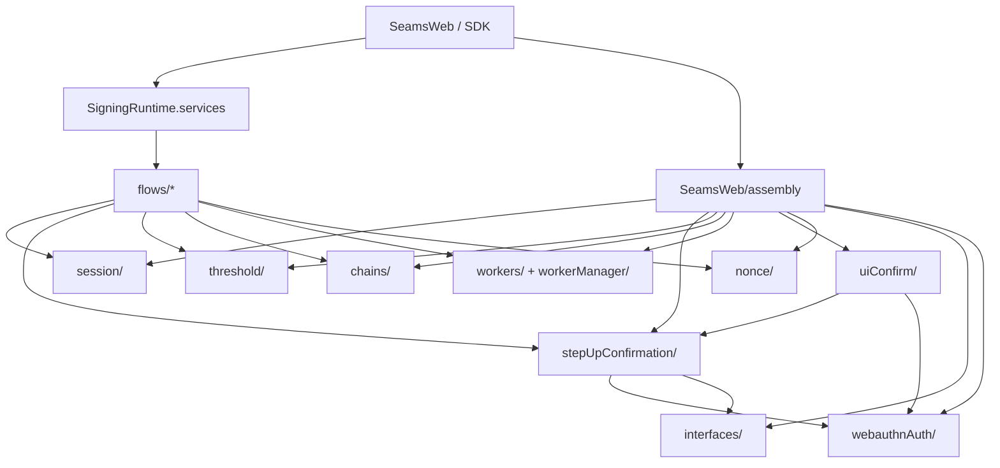
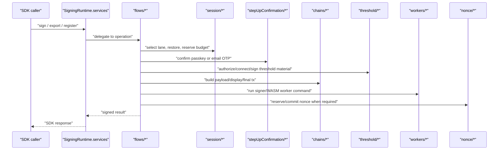
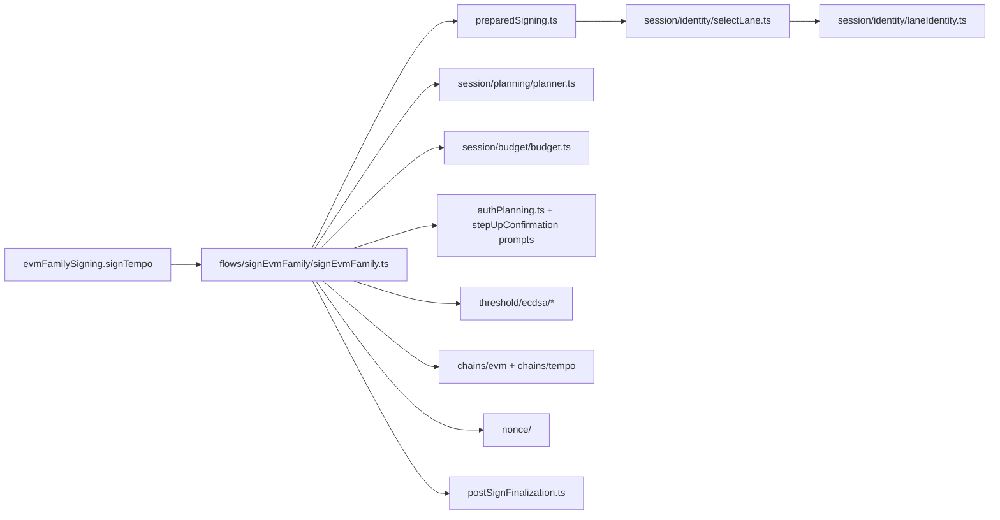
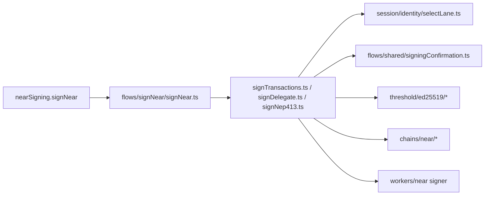

# Signing Architecture (`client/src/core/signingEngine`)

This folder is the SDK signing runtime for NEAR, EVM, and Tempo flows. The
current layout is organized by call direction: runtime services enter a
single operation module, operation modules call state/session/confirmation/
chain/threshold/worker modules, and child modules do not call back into
flows or browser assembly.

## Public Entrypoints

- `runtime/`: platform-neutral `SigningRuntime` construction and service surface.
- `flows/*`: feature entry modules for signing, registration, recovery, and
  Email OTP operations.
- `assembly/`: assembles runtime dependencies and operation ports for the
  browser signing surface under `SeamsWeb/assembly`.

## Folder Roles

- `flows/`: vertical signing, registration, recovery, and email-OTP
  operation paths.
- `flows/shared/`: shared operation state machine, command ports, and
  confirmation command runner.
- `session/`: selected lane identity, available lanes, readiness, record
  normalization, restore, planning, budget, sealed persistence, and
  warm-session state.
- `session/emailOtp/`: Email OTP threshold-session provisioning, restoration,
  export recovery, and warm-session status coordination.
- `session/planning/`: signing-operation planning, operation fingerprints, and
  operation-id binding.
- `session/budget/`: wallet signing-session budget reads, projection,
  reservation, and spend finalization.
- `stepUpConfirmation/`: confirmation contracts, email-OTP/passkey prompts,
  wallet-auth policy resolution, intent digest preparation, and channel message
  contracts.
- `chains/`: chain-specific payload, display, nonce, and WASM adaptor code.
- `threshold/`: threshold protocol clients and protocol material handling.
- `workers/` and `workerManager/`: worker operation dispatch, worker types, and
  host-side worker transport.
- `nonce/`: nonce reservation and lifecycle coordination.
- `webauthnAuth/`: low-level WebAuthn/passkey browser primitives.
- `interfaces/accountAuthMetadata.ts`: neutral account-auth metadata
  normalized for step-up method selection and operation planning.
- `interfaces/`: shared public/runtime contracts and primitive cross-domain
  signing identifiers such as ECDSA chain targets.

Auth methods are symmetric at the prompt/auth-plan boundary:
`stepUpConfirmation/passkeyPrompt` and `stepUpConfirmation/otpPrompt` own method
prompt construction. Method session folders are introduced only for durable
cross-operation lifecycle ownership, which is why Email OTP has
`session/emailOtp/` and passkey currently has no `sessionPasskey/`. The ongoing
step-up adaptor refactor has already moved neutral account-auth metadata into
`interfaces/accountAuthMetadata.ts`, moved low-level WebAuthn
primitives into `webauthnAuth/`, and moved wallet-auth policy resolution into
`stepUpConfirmation/`.

## Import Direction

Rules enforced by Refactor 33 guards:

- `flows/*` must not import browser assembly construction.
- Child folders must not import `flows/*`.
- New broad internal `index.ts` barrels are blocked.
- Deleted `api/`, `orchestration/`, `chainAdaptors/`, and `signers/` paths stay
  deleted.

## Operation Pipeline

## Key State Shapes

- `SelectedLane` (`session/identity/laneIdentity.ts`): canonical selected
  signing lane. Its object construction is owned by
  `session/identity/laneIdentity.ts`.
- `LaneCandidate` (`session/identity/laneIdentity.ts`): concrete candidate derived from
  available lane or persisted session records before selection.
- `SelectedSigningSessionPlanningLane` (`session/operationState/types.ts`):
  planning-layer extension for operation planning, storage source, retention,
  and backing material context.
- `SigningSessionPlan` (`session/planning/planner.ts`): planned operation
  identity bound to one selected lane before confirmation, signing, and budget
  stages execute.
- `WalletSigningBudgetReservation` (`session/budget/budget.ts`): budget
  reservation and spend identity that follows the selected lane through the
  finalization path.
- `ThresholdEcdsaSessionRecord` / `ThresholdEd25519SessionRecord`
  (`session/persistence/records.ts`): persistence records normalized at
  storage boundaries.
- `ThresholdEcdsaChainTarget` (`interfaces/ecdsaChainTarget.ts`): neutral EVM
  and Tempo chain target identity shared by session, prompt, threshold, and
  operation modules.
- `PreparedOperation`, `BudgetAdmittedOperation`, and `SignedOperation`
  (`flows/shared/operationState.ts`): monotonic operation state-machine
  states.

## Session Vocabulary

| Term                   | Axis                                                                                | Canonical owner                                 |
| ---------------------- | ----------------------------------------------------------------------------------- | ----------------------------------------------- |
| `warmSession`          | Secure-confirm worker PRF cache and volatile capability material.                   | `session/warmCapabilities/*`                    |
| `warmSigning`          | Runtime aggregate of warm-session readers, status readers, and ECDSA record access. | `assembly/ports/warmSigning.ts`                 |
| `warmCapabilities`     | Public capability/status surface derived from warm material and budget state.       | `session/warmCapabilities/public.ts`            |
| `signingSession`       | Operation lane, budget, and identity scope used while signing.                      | `session/planning/*`, `session/budget/*`        |
| `walletSigningSession` | Server-issued wallet-scoped budget session identifier.                              | `session/budget/*`                              |
| `thresholdSession`     | Cryptographic threshold-protocol authorization session.                             | `threshold/*`, `session/persistence/records.ts` |
| `emailOtpSession`      | Email OTP step-up session and warm-session coordination.                            | `session/emailOtp/*`                            |
| `appSession`           | Outer application JWT/policy used to authorize wallet operations.                   | `stepUpConfirmation/*`, relayer clients         |

## EVM/Tempo Signing

EVM and Tempo share the ECDSA operation path. Chain differences are isolated in
`chains/evm`, `chains/tempo`, nonce lifecycle modules, and final transaction
encoding.

## NEAR Signing

NEAR uses the same operation state-machine approach as EVM/Tempo, with Ed25519
threshold material and NEAR-specific payload/display assembly.
