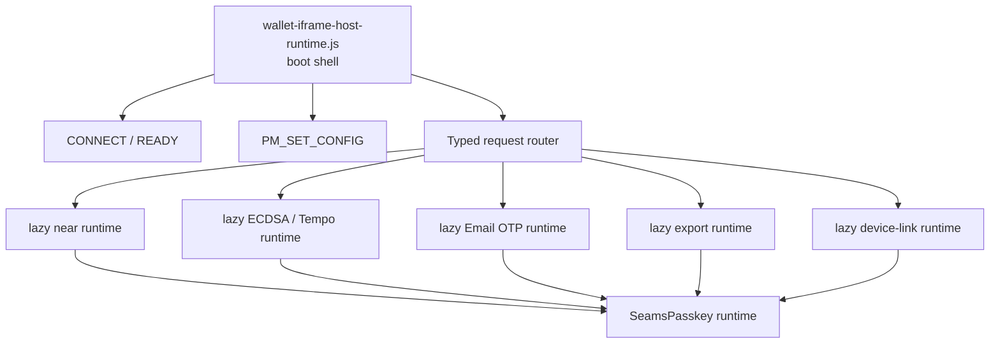

# Bundle Size Optimization Plan

Status: draft implementation plan.

This plan targets the wallet iframe and embedded SDK asset graph first. The
current bundle-size problem is concentrated in the wallet iframe host runtime:
`wallet-iframe-host-runtime.js` starts as the iframe boot script, then statically
pulls in the full wallet runtime, signing flows, restore logic, confirmation UI,
Email OTP, and ECDSA/Tempo support.

## Goals

1. Make wallet iframe `READY` fast and small.
2. Keep signing secrets and durable wallet-origin state inside the wallet origin.
3. Load curve, auth, export, and UI code only when a request needs that domain.
4. Keep request routing explicit and typed. Invalid request/runtime states should
   stay unrepresentable at module boundaries.
5. Add bundle-size budgets so future runtime imports cannot silently bloat the
   boot path.

## Baseline

Measured locally on the current tree:

| Asset | Build | Raw | Gzip |
| --- | --- | ---: | ---: |
| `sdk/dist/esm/sdk/wallet-iframe-host-runtime.js` | dev, no minify | 3,033,093 B | 529,454 B |
| temporary Bun minified host | production-like | 1,625,075 B | 376,104 B |
| temporary esbuild minified host | analysis-only | 1,592,307 B | 368,733 B |

Related first-use worker/WASM costs:

| Asset | Raw | Gzip |
| --- | ---: | ---: |
| `near-signer.worker.js` | 51,407 B | 9,823 B |
| `wasm_signer_worker_bg.wasm` | 657,950 B | 266,128 B |
| `eth-signer.worker.js` | 52,288 B | 10,503 B |
| `eth_signer.wasm` | 5,354,955 B | 1,469,853 B |
| `tempo-signer.worker.js` | 26,590 B | 6,583 B |
| `tempo_signer.wasm` | 854,295 B | 283,455 B |
| `hss-client.worker.js` | 38,268 B | 7,156 B |
| `hss_client_signer_bg.wasm` | 470,916 B | 213,715 B |

Top contributors in an esbuild host analysis by output bytes:

| Area | Approx output bytes |
| --- | ---: |
| `signingEngine/flows/signEvmFamily` | 139,996 |
| `signingEngine/uiConfirm/ui` | 122,334 |
| `signingEngine/session/emailOtp` | 96,298 |
| `signingEngine/flows/signNear` | 69,699 |
| `indexedDB` | 68,707 |
| `signingEngine/session/persistence` | 57,553 |
| `signingEngine/session/passkey` | 52,005 |
| `SeamsPasskey/near` | 47,348 |
| `signingEngine/threshold/ecdsa` | 46,282 |
| `signingEngine/flows/recovery` | 41,629 |
| `WalletIframe/client` | 41,235 |

## Cache Reality

The iframe host shifts heavy signing runtime out of the embedding app bundle.
This still helps page weight and CDN reuse. Modern browsers partition network
and storage caches by top-level site, so a wallet iframe warmed under one
unrelated merchant site should not be treated as a guaranteed browser-cache hit
under another merchant site.

Bundle-size work should assume:

1. Same top-level site repeat visits benefit from browser cache.
2. The wallet origin/CDN benefits globally from immutable assets.
3. First use on a new top-level site should stay small.

## Target Architecture



The boot shell should include only:

1. transparent host bootstrap and minimal browser shims
2. `CONNECT` / `READY` MessagePort setup
3. `PING`, `PM_SET_CONFIG`, cancellation, and error envelope handling
4. typed request dispatch to lazy domain modules
5. theme and asset-base setup needed before UI code loads

The boot shell should avoid static imports of:

1. `SeamsPasskey`
2. `SigningEngine`
3. EVM/Tempo adapters
4. NEAR transaction signing flows
5. Email OTP provisioning and restore
6. key export UI/viewers
7. QR/link-device UI
8. Lit confirmer component implementations

## Size Budgets

Initial target budgets:

| Asset graph | Budget |
| --- | ---: |
| wallet iframe boot shell initial JS | <= 80 KB gzip |
| boot shell plus config handling | <= 100 KB gzip |
| first NEAR sign domain chunk, excluding worker/WASM | <= 180 KB gzip |
| first ECDSA/Tempo sign domain chunk, excluding worker/WASM | <= 220 KB gzip |
| key export domain chunk, excluding viewer assets | <= 120 KB gzip |

These budgets are intentionally loose for the first implementation. Tighten them
after the boot/runtime split lands and real production artifacts are measured.

## Phase 1: Add Measurement Gates

Add a deterministic bundle-size report before refactoring behavior.

Implementation tasks:

1. Add `sdk/scripts/checks/report-wallet-iframe-bundle-size.mjs`.
2. Report raw and gzip sizes for:
   - `sdk/dist/esm/sdk/wallet-iframe-host-runtime.js`
   - all static chunks imported by the wallet host entry
   - wallet workers and WASM files
3. Add optional budget enforcement:
   - `--budget walletHostGzip=100000`
   - `--budget ecdsaWasmGzip=1500000`
4. Add `pnpm -C sdk check:bundle-size` and a root alias.
5. Keep the first gate report-only until the boot shell split lands.

Acceptance criteria:

1. CI can print a stable wallet bundle-size report after `pnpm build:sdk-prod`.
2. The report distinguishes boot path JS from lazy chunks and worker/WASM assets.
3. The script exits nonzero only when explicit budgets are provided.

## Phase 2: Create A Wallet Host Boot Shell

Split `client/src/core/WalletIframe/host/index.ts` into a lightweight host shell
and lazy runtime modules.

Proposed files:

| File | Responsibility |
| --- | --- |
| `host/index.ts` | boot shell and listener registration |
| `host/requestRouter.ts` | discriminated request dispatch |
| `host/runtimeLoader.ts` | lazy imports with cached module promises |
| `host/runtimeContext.ts` | wallet config and runtime instance state |
| `host/runtime.ts` | current heavy SeamsPasskey-backed behavior |

Request routing should use a discriminated union over `ParentToChildType`:

```ts
type WalletHostRoute =
  | { kind: 'boot'; type: 'PING' | 'PM_SET_CONFIG' | 'PM_CANCEL' }
  | { kind: 'near'; type: NearWalletRequestType }
  | { kind: 'ecdsa'; type: EcdsaWalletRequestType }
  | { kind: 'email_otp'; type: EmailOtpWalletRequestType }
  | { kind: 'export'; type: ExportWalletRequestType }
  | { kind: 'device_link'; type: DeviceLinkWalletRequestType };
```

Use exhaustive `switch` statements with `assertNever`. Raw message validation
stays at the MessagePort boundary, and internal runtime loaders should receive
narrow request variants.

Acceptance criteria:

1. `wallet-iframe-host-runtime.js` can send `READY` without loading `SeamsPasskey`.
2. `PING` and `PM_SET_CONFIG` complete before the heavy runtime chunk loads.
3. The first signing/auth/export request lazy-loads the required runtime.
4. No app-origin persistence fallback is introduced.

## Phase 3: Split Domain Handlers

Break `client/src/core/WalletIframe/host/wallet-iframe-handlers.ts` into domain
modules. The current single handler map makes every request type retain every
wallet feature.

Proposed handler modules:

| Module | Request types |
| --- | --- |
| `host/handlers/near.ts` | `PM_SIGN_TXS_WITH_ACTIONS`, `PM_SIGN_AND_SEND_TXS`, `PM_SEND_TRANSACTION`, `PM_EXECUTE_ACTION`, `PM_SIGN_DELEGATE_ACTION`, `PM_SIGN_NEP413` |
| `host/handlers/ecdsaTempo.ts` | `PM_BOOTSTRAP_THRESHOLD_ECDSA_SESSION`, `PM_SIGN_TEMPO`, Tempo nonce lifecycle reports, presign pool refill |
| `host/handlers/auth.ts` | `PM_UNLOCK`, `PM_LOCK`, `PM_GET_WALLET_SESSION`, recent unlocks |
| `host/handlers/emailOtp.ts` | Email OTP challenge, enrollment, login, refresh |
| `host/handlers/export.ts` | key export and HSS seed export |
| `host/handlers/deviceLink.ts` | view/delete device key, QR link flows |
| `host/handlers/recovery.ts` | recovery email and email recovery flows |
| `host/handlers/preferences.ts` | confirmation config, theme, preferences |

Each module should export a branch-specific builder:

```ts
export function createNearWalletIframeHandlers(
  deps: NearWalletIframeHandlerDeps,
): NearWalletIframeHandlerMap;
```

Acceptance criteria:

1. Importing the auth handler does not statically import ECDSA/Tempo signing.
2. Importing the preferences handler does not statically import signing flows.
3. Type fixtures reject a handler map that accepts a request outside its branch.

## Phase 4: Separate UI Mounting From Signing Actions

`iframe-lit-elem-mounter.ts` is generic UI infrastructure, but it currently imports
transaction conversion and NEAR signing action types. That pulls signing code into
the host path earlier than necessary.

Implementation tasks:

1. Keep generic component mounting in `iframe-lit-elem-mounter.ts`.
2. Move wallet action execution into a lazy `uiActionRuntime.ts`.
3. Represent UI actions as a discriminated union:

```ts
type WalletUiAction =
  | { kind: 'sign_near_transactions'; args: SignNearTransactionsUiArgs }
  | { kind: 'open_export_viewer'; args: ExportViewerUiArgs };
```

4. Load action runtime only when an event binding fires.
5. Keep component definitions declarative and serializable.

Acceptance criteria:

1. Mounting inert UI components does not load transaction signing code.
2. `WALLET_UI_MOUNT` can still mount built-in UI components.
3. Signing action event bindings load the action runtime on demand.

## Phase 5: Build Embedded Assets With Real Dynamic Splitting

Running a multi-entry build with `--splitting` can reduce individual file sizes,
yet static ESM imports still load before the host executes. The win comes from
dynamic imports in the source graph, then building those chunks as separate
immutable assets.

Implementation tasks:

1. Update `sdk/scripts/build/build-prod.sh` and `sdk/scripts/build/build-sdk.sh`
   to build the wallet host and its lazy runtime chunks together.
2. Emit chunk files under `sdk/` with content hashes.
3. Keep stable entrypoint names:
   - `wallet-iframe-host-runtime.js`
   - `tx-confirm-ui.js`
   - `w3a-tx-confirmer.js`
4. Ensure `wallet-service` can serve hashed runtime chunks with long-lived cache
   headers.
5. Keep CSS and WASM copied next to the chunks that reference them.

Acceptance criteria:

1. The boot host initial module graph excludes heavy runtime chunks.
2. Dynamic chunks resolve correctly from the wallet origin in local dev and
   deployed SDK paths.
3. Source maps remain available for runtime chunks in debug builds.

## Phase 6: Add Product-Specific Wallet Host Builds

Some deployments need only a subset of the wallet. Provide explicit builds so
they can choose a smaller service host.

Candidate entries:

| Entry | Included domains |
| --- | --- |
| `wallet-iframe-host-near.js` | auth, NEAR signing, NEAR recovery |
| `wallet-iframe-host-ecdsa.js` | auth, ECDSA/Tempo signing, ECDSA restore |
| `wallet-iframe-host-full.js` | all domains |

The default can remain the full host until consumers opt into smaller service
paths.

Acceptance criteria:

1. Each host entry uses the same protocol envelope.
2. Unsupported request types fail with typed `unsupported_request` errors.
3. Docs clearly map SDK config to the selected wallet service path.

## Phase 7: Optimize WASM Payloads

The ECDSA WASM payload is the largest first-use asset. JS splitting will improve
iframe boot, and WASM optimization should run as separate work.

ECDSA note: keep `threshold-signatures` as the source of truth for OT-based
threshold ECDSA. That library is NEAR chain-signatures oriented and pulls in
dependencies such as BLS and Ed25519 support that the browser ECDSA signer does
not use. Optimized release WASM builds with LTO, dead-code elimination, stripped
custom sections, and `wasm-opt` should remove unused dependency code from the
shipped artifact. Treat vendoring ECDSA OT code as a fallback only if measured
production WASM output proves that unused `threshold-signatures` dependencies
remain a material size problem.

Investigation tasks:

1. Run `wasm-opt -Oz` on `eth_signer.wasm`, `tempo_signer.wasm`, and NEAR signer
   WASM in a scratch build.
2. Compare Rust profile settings:
   - `opt-level = "z"`
   - `lto = true`
   - `codegen-units = 1`
   - `panic = "abort"`
3. Confirm production artifacts are built from optimized release WASM rather
   than dev/no-strip wasm-bindgen output.
4. Audit exported wasm-bindgen surface for unused exports.
5. Split EVM-family hashing/packing helpers from threshold ECDSA protocol code if
   they can be loaded independently.

Acceptance criteria:

1. WASM size changes are measured with functional signer parity tests.
2. Runtime performance regressions are reported for signing-critical operations.
3. `eth_signer.wasm` gzip size is budgeted against the optimized production
   artifact.
4. The ECDSA WASM budget is updated after measured optimization results.

## Verification Plan

Run focused checks as phases land:

```bash
pnpm -C sdk type-check
pnpm -C tests test:wallet-iframe
pnpm -C tests test:lit-components
pnpm build:sdk-prod
pnpm -C sdk check:bundle-size
```

Run broader checks when touching shared signing/session behavior:

```bash
pnpm test:unit
pnpm test:e2e
pnpm check:signing-architecture
pnpm check:signer-parity
```

Full `pnpm check` is justified when a phase changes shared public exports,
worker payload contracts, signing-session persistence, build config, or WASM
artifact generation.

## Risks

1. Dynamic import timing can delay the first real signing request if the runtime
   is loaded too late. Mitigation: prewarm likely domain chunks after `READY`
   based on configured chains and wallet mode.
2. Code splitting can break asset URL resolution under `/sdk/`. Mitigation:
   verify local wallet origin, cross-origin wallet origin, and deployed CDN
   paths.
3. Splitting request handlers can weaken type safety if route grouping is based
   on raw strings. Mitigation: branch-specific request unions and exhaustive
   dispatch.
4. Lazy UI action loading can break user activation if it happens after a click.
   Mitigation: prewarm UI action chunks when overlay intent becomes `show`, then
   keep the credential call inside the wallet iframe document.
5. Product-specific host builds can drift. Mitigation: shared protocol fixtures
   and request matrix tests for every host entry.

## Done Criteria

1. Wallet iframe boot shell initial JS is at or below the agreed gzip budget.
2. `READY` no longer requires loading `SeamsPasskey` or signing flows.
3. Signing, export, Email OTP, and device-link flows load branch-specific chunks.
4. Bundle-size checks run in CI with explicit budgets.
5. Wallet iframe tests cover boot-only, NEAR signing, ECDSA/Tempo signing, Email
   OTP, export, and unsupported request behavior.
