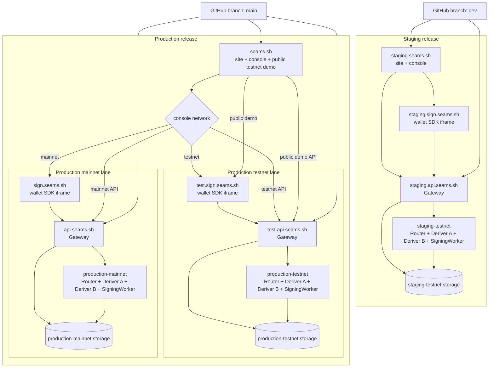

# Production Testnet and Mainnet Deployment Pipeline Plan

Date created: August 5, 2026

Status: implementation in progress

## Objective

Update the deployment system from two single-network lanes into three isolated
backend lanes and two site releases:

- staging testnet, deployed from `dev`;
- production testnet, deployed from `main`;
- production mainnet, deployed from `main`;
- the staging site, deployed from `dev`;
- the production site, deployed from `main`.

The staging site exposes testnet only. The production site serves the public
testnet demo and the customer console at `seams.sh`. Its console selects the
production testnet or production mainnet lane as one complete runtime context.

Each backend lane owns an independent Gateway, Router, Deriver A, Deriver B,
SigningWorker, storage, secrets, cryptographic identity, session authority, and
wallet iframe origin. The production frontend is shared across its two lanes;
the production wallet origins are separate.

## Decisions

1. `staging.seams.sh` remains a testnet-only site and console.
2. `seams.sh` is the only production site and console deployment.
3. The public demo on `seams.sh` always uses production testnet.
4. The production console has an explicit `testnet | mainnet` selector.
5. A network selection replaces the complete API and wallet SDK context. It
   never changes an RPC URL inside a live SDK instance.
6. Production testnet uses `test.api.seams.sh` and `test.sign.seams.sh`.
7. Production mainnet uses `api.seams.sh` and `sign.seams.sh`.
8. Staging uses `staging.api.seams.sh` and `staging.sign.seams.sh`.
9. All three backend lanes have independent data and custody boundaries.
10. The pipeline has no staging-mainnet lane.
11. Backend lane identity is explicit in every deployment command, artifact,
    GitHub Environment, Worker name, database name, smoke result, and summary.
12. The existing two-target deployment schema and commands are replaced. No
    compatibility aliases remain for the retired single-production-lane model.
13. `dev` remains the staging branch and `main` remains the production branch.
14. The existing top-level GitHub Environments remain named `staging` and
    `production`.

## Target topology



## Current pipeline gap

The current system has two deployment targets, `staging` and `production`.
Each target contains one Gateway configuration, one set of MPC resources, one
console database, one signer database, one site origin, and one wallet origin.

The current production target is a `testnet_live_demo` lane at `api.seams.sh`
and `sign.seams.sh`. The frontend deployment script injects one Gateway origin,
wallet origin, managed project environment, publishable key, NEAR network, and
SigningWorker ID into the build. `apps/seams-site/src/config.ts` then constructs
one immutable SDK configuration from those build values.

This creates four concrete gaps:

1. The target schema cannot describe two production backend lanes.
2. Backend commands cannot address one production network without addressing
   the other.
3. The production frontend cannot carry two complete SDK configurations.
4. The production Pages workflow deploys only one wallet origin.

The current production branch guard requires `main`, and the new production
workflows retain that guard. This change requires no branch creation, branch
renaming, or repository default-branch change.

## Deployment identity model

Use exact lane and site identities throughout the deployment code:

```ts
type BackendLaneId = 'staging-testnet' | 'production-testnet' | 'production-mainnet';

type FrontendSiteId = 'staging' | 'production';

type LaneProvisioning =
  | {
      kind: 'provisioned';
      gatewayDeploymentConfig: GatewayDeploymentConfig;
    }
  | {
      kind: 'pending';
      runtimeProfileKind: 'testnet_live_demo' | 'mainnet_service';
      requiredValues: readonly string[];
    };

type BackendLane =
  | {
      id: 'staging-testnet';
      release: 'staging';
      network: 'testnet';
      resources: BackendResources;
      origins: LaneOrigins;
      capabilities: LaneCapabilities;
      provisioning: LaneProvisioning;
    }
  | {
      id: 'production-testnet';
      release: 'production';
      network: 'testnet';
      resources: BackendResources;
      origins: LaneOrigins;
      capabilities: LaneCapabilities;
      provisioning: LaneProvisioning;
    }
  | {
      id: 'production-mainnet';
      release: 'production';
      network: 'mainnet';
      resources: BackendResources;
      origins: LaneOrigins;
      capabilities: LaneCapabilities;
      provisioning: LaneProvisioning;
    };
```

Commands accept these exact identities:

```text
pnpm deploy:backend <plan|build|preflight|migrate|deploy|smoke> \
  --lane <staging-testnet|production-testnet|production-mainnet>

pnpm deploy:frontend <plan|build|deploy|smoke> \
  --site <staging|production>
```

The parser must reject unknown lanes and invalid combinations before reading
credentials or mutating remote resources. There is no generic
`--release production --network value` combination that can accidentally
construct a staging-mainnet target.

## Deployment target schema

Replace the current `deployment/targets.json` shape with a release topology
that distinguishes site releases from backend lanes:

```json
{
  "staging": {
    "branch": "dev",
    "site": {
      "origin": "https://staging.seams.sh",
      "defaultNetwork": "testnet",
      "availableNetworks": ["testnet"],
      "pagesProjectEnv": "CF_PAGES_PROJECT_VITE"
    },
    "lanes": {
      "testnet": {
        "gatewayOrigin": "https://staging.api.seams.sh",
        "walletOrigin": "https://staging.sign.seams.sh",
        "walletPagesProjectEnv": "CF_PAGES_PROJECT_WALLET",
        "resources": {},
        "capabilities": {},
        "provisioning": {
          "kind": "provisioned",
          "gatewayDeploymentConfig": {}
        }
      }
    }
  },
  "production": {
    "branch": "main",
    "site": {
      "origin": "https://seams.sh",
      "defaultNetwork": "testnet",
      "availableNetworks": ["testnet", "mainnet"],
      "pagesProjectEnv": "CF_PAGES_PROJECT_VITE"
    },
    "lanes": {
      "testnet": {
        "gatewayOrigin": "https://test.api.seams.sh",
        "walletOrigin": "https://test.sign.seams.sh",
        "walletPagesProjectEnv": "CF_PAGES_PROJECT_WALLET_TESTNET",
        "resources": {},
        "capabilities": {},
        "provisioning": {
          "kind": "pending",
          "runtimeProfileKind": "testnet_live_demo",
          "requiredValues": ["fresh production-testnet resources and identities"]
        }
      },
      "mainnet": {
        "gatewayOrigin": "https://api.seams.sh",
        "walletOrigin": "https://sign.seams.sh",
        "walletPagesProjectEnv": "CF_PAGES_PROJECT_WALLET_MAINNET",
        "resources": {},
        "capabilities": {},
        "provisioning": {
          "kind": "pending",
          "runtimeProfileKind": "mainnet_service",
          "requiredValues": ["fresh production-mainnet resources and identities"]
        }
      }
    }
  }
}
```

The real schema continues to store the full Gateway configuration and exact
resource names. The parser must additionally enforce:

- staging contains exactly one `testnet` lane;
- production contains exactly `testnet` and `mainnet` lanes;
- every Gateway, wallet, and site origin is HTTPS and globally unique;
- a lane's Gateway CORS list contains only its site and wallet origins;
- production testnet selects `testnet_live_demo`;
- production mainnet selects `mainnet_service`;
- mainnet has no demo OTP, implicit test funding, testnet relayer, or testnet
  RPC configuration;
- Worker names, D1 IDs, namespaces, session issuers, seal key versions, Router
  identities, and signer-set identities are unique across lanes;
- every lane carries its planned resources, origins, capabilities, and exactly
  one provisioning branch;
- a `provisioned` branch contains the complete Gateway deployment config, while
  a `pending` branch contains its runtime profile kind and required values;
- each frontend site lists only networks backed by lanes in the same release.

`scripts/deployment-targets.mjs` should parse the document once and expose
branch-specific builders:

- `readBackendLane(laneId)`;
- `readFrontendSite(siteId)`;
- `backendLaneIds()`;
- `frontendSiteIds()`.

Delete the retired `TARGET_NAMES`, `readDeploymentTarget`, and any call path
that treats all of production as one backend target.

### Current provisioning state

The identity-aware target document is usable before every lane has been
provisioned. `staging-testnet` is `provisioned` and retains its current Gateway,
Router A/B, SigningWorker, storage, secrets, and cryptographic identity.
`production-testnet` and `production-mainnet` are `pending` until fresh
resources, storage, secrets, and lane-specific identities are generated and
recorded in their provisioning branches.

Every lane remains visible in `plan` output, including the pending runtime
profile and required values. Backend `build`, `preflight`, `migrate`, `deploy`,
and `smoke`, plus frontend `build`, `deploy`, and `smoke`, reject a site or lane
with pending provisioning before branch validation, credential use, or remote
mutation. This makes production workflow files reviewable and runnable as dry
runs while keeping their deployment path intentionally gated.

The lane/site parser, five workflow entrypoints, lane-aware environment
tooling, and Wrangler lane configurations are implemented. The production site
also carries complete testnet/mainnet frontend configuration and exposes the
console network selector; production build and deployment remain gated until
both backend lanes are provisioned. Staging remains the deployable testnet
release from `dev`, while production stays on `main`.

## Cloudflare resource naming

Give every production-testnet resource an explicit `-testnet` suffix. Keep the
mainnet apex names concise and unambiguous. A representative inventory is:

| Lane               | Component     | Resource name                      |
| ------------------ | ------------- | ---------------------------------- |
| Staging testnet    | Gateway       | `seams-sdk-d1-gateway-staging`     |
| Staging testnet    | Router        | `router-ab-mpc-router-staging`     |
| Staging testnet    | Deriver A     | `router-ab-deriver-a-staging`      |
| Staging testnet    | Deriver B     | `router-ab-deriver-b-staging`      |
| Staging testnet    | SigningWorker | `router-ab-signing-worker-staging` |
| Production testnet | Gateway       | `seams-sdk-d1-gateway-testnet`     |
| Production testnet | Router        | `router-ab-mpc-router-testnet`     |
| Production testnet | Deriver A     | `router-ab-deriver-a-testnet`      |
| Production testnet | Deriver B     | `router-ab-deriver-b-testnet`      |
| Production testnet | SigningWorker | `router-ab-signing-worker-testnet` |
| Production mainnet | Gateway       | `seams-sdk-d1-gateway`             |
| Production mainnet | Router        | `router-ab-mpc-router`             |
| Production mainnet | Deriver A     | `router-ab-deriver-a`              |
| Production mainnet | Deriver B     | `router-ab-deriver-b`              |
| Production mainnet | SigningWorker | `router-ab-signing-worker`         |

Use the same convention for console D1, signer D1, Durable Object namespaces,
R2 backup prefixes, session issuers, ceremony key IDs, signer-set IDs, and
deployment evidence.

No production-testnet resource may reuse a production-mainnet database,
Durable Object namespace, secret, root share, signing key, seal key, session
issuer, or internal service-auth credential.

## GitHub Environments

Keep the existing top-level `staging` and `production` GitHub Environments.
They remain the frontend release boundaries and hold the public deployment
configuration for their sites.

The backend workflow YAML already references the following custody
environments for the staging-testnet lane. The bootstrap step must verify or
provision them without changing their names:

```text
staging-signing-worker
staging-deriver-a
staging-deriver-b
staging-mpc-router
staging-gateway
```

The production backend workflow already references the following custody
environment names. They become the production-mainnet lane after the cutover:

```text
production-signing-worker
production-deriver-a
production-deriver-b
production-mpc-router
production-gateway
```

Add one new custody set for the production-testnet lane:

```text
production-testnet-signing-worker
production-testnet-deriver-a
production-testnet-deriver-b
production-testnet-mpc-router
production-testnet-gateway
```

The complete GitHub Environment inventory is therefore:

```text
staging
staging-signing-worker
staging-deriver-a
staging-deriver-b
staging-mpc-router
staging-gateway

production
production-signing-worker
production-deriver-a
production-deriver-b
production-mpc-router
production-gateway

production-testnet-signing-worker
production-testnet-deriver-a
production-testnet-deriver-b
production-testnet-mpc-router
production-testnet-gateway
```

Deployment identities map to those environment names as follows:

| Deployment identity | Top-level environment | Custody environment prefix |
| ------------------- | --------------------- | -------------------------- |
| Staging site        | `staging`             | —                          |
| Staging testnet     | —                     | `staging-*`                |
| Production site     | `production`          | —                          |
| Production testnet  | —                     | `production-testnet-*`     |
| Production mainnet  | —                     | `production-*`             |

`production` owns the production site Pages credential, both wallet Pages
project names, and the public configuration for both production lanes. It
receives no Gateway, Deriver, or SigningWorker private material. `staging`
retains the equivalent frontend values for the staging site and wallet.

Apply stronger reviewers and wait rules to `production` and every existing
`production-*` custody environment used by mainnet. Production testnet remains
independently deployable and cannot approve or release mainnet components.
Deriver A and Deriver B continue to use different jobs and different GitHub
Environments.

The environment bootstrap tooling must preserve the two current release
environments, verify or provision the ten custody environments already named
by the workflow YAML, create the five `production-testnet-*` environments, and
validate the resulting seventeen-environment inventory. It must prepare three
independent wallet-core identity generations and two frontend manifests. A
prepare run operates on one lane or one site at a time; it never receives
private material for multiple backend lanes.

## Workflow files

Replace the four current deployment workflows with five explicit entrypoints:

```text
.github/workflows/deploy-staging-backend.yml
.github/workflows/deploy-production-testnet-backend.yml
.github/workflows/deploy-production-mainnet-backend.yml
.github/workflows/deploy-staging-frontend.yml
.github/workflows/deploy-production-frontend.yml
```

Branch rules:

| Workflow                   | Required branch | Deployment identity  |
| -------------------------- | --------------- | -------------------- |
| Staging backend            | `dev`           | `staging-testnet`    |
| Production testnet backend | `main`          | `production-testnet` |
| Production mainnet backend | `main`          | `production-mainnet` |
| Staging frontend           | `dev`           | `staging`            |
| Production frontend        | `main`          | `production`         |

Each workflow checks out `${{ github.sha }}` and rejects any other branch
before building. The production backend workflows are separate so mainnet can
have stricter approval, independent failure recovery, and an independent smoke
gate. Do not add a free-form network workflow input.

The production-testnet and production-mainnet workflow files are present as
explicit lane entrypoints even while both production lanes are pending. Their
lane plans remain available for review. Lane provisioning guards stop
`build`, `preflight`, migration, deploy, and smoke work before credentials are
used or remote resources are changed. The workflows become deployable after
fresh production-testnet and production-mainnet resources and identities are
generated and their provisioning branches are changed to `provisioned`.

The three backend workflows keep the current visible order:

1. build the lane's backend artifact;
2. run five custody-scoped preflight legs;
3. migrate the lane's console and signer databases;
4. deploy SigningWorker, Deriver A, and Deriver B concurrently;
5. deploy Router after the three private workers pass;
6. deploy Gateway last;
7. smoke the lane's API and dependency graph.

Artifacts remain same-run and lane-scoped. Name them with the lane ID, for
example `backend-build-production-testnet`, so summaries and reruns cannot
confuse the two production backends.

## Backend deployment script

Update `scripts/deploy-backend.mjs` to accept `--lane`. Every operation resolves
one exact lane before doing work.

Required changes:

- include the lane ID in build metadata and deployed revision evidence;
- render the lane's Gateway configuration into a lane-specific temporary
  Wrangler configuration;
- resolve the lane's named Wrangler environment or default environment without
  deriving it from `production` alone;
- migrate only the lane's D1 databases;
- upload only the selected component's lane-scoped secrets;
- bind Router services only to Workers from the same lane;
- reject Worker and D1 bindings whose names belong to another lane;
- emit the lane, release, network, runtime profile, API origin, wallet origin,
  Worker names, and database names in `plan` output;
- preserve the rule that one process never receives both Deriver custody sets.

Backend builds may reuse the same source entrypoints. Deployed Worker names,
bindings, secrets, configuration, and storage make each lane independent.

## Frontend build and deployment

### Staging

The staging frontend build produces:

- one site artifact for `staging.seams.sh`;
- one wallet artifact for `staging.sign.seams.sh`;
- one exact SDK deployment configuration for staging testnet.

The staging UI has no network selector because only one network is available.

### Production

The production frontend build produces:

- one site artifact for `seams.sh`;
- one testnet wallet artifact for `test.sign.seams.sh`;
- one mainnet wallet artifact for `sign.seams.sh`;
- two complete SDK deployment configurations embedded in the site build.

Model the production configuration as a discriminated union:

```ts
type ProductionNetworkDeployment =
  | {
      network: 'testnet';
      apiOrigin: 'https://test.api.seams.sh';
      walletOrigin: 'https://test.sign.seams.sh';
      projectEnvironmentId: string;
      publishableKey: string;
      signingWorkerId: string;
      chains: readonly TestnetChainConfig[];
    }
  | {
      network: 'mainnet';
      apiOrigin: 'https://api.seams.sh';
      walletOrigin: 'https://sign.seams.sh';
      projectEnvironmentId: string;
      publishableKey: string;
      signingWorkerId: string;
      chains: readonly MainnetChainConfig[];
    };
```

The production site defaults to testnet for the public demo. The dashboard may
restore the user's last console selection after authentication. The public
demo never reads that preference.

During the provisioning phase, the production site can produce a complete plan
that reports both pending lanes, while production `build`, `deploy`, and
`smoke` are intentionally gated until both lane configurations are
provisioned. The staging site remains buildable with its preserved testnet
identity. The site Pages project continues to use the existing
`CF_PAGES_PROJECT_VITE` environment name.

On network change, the application must:

1. close the current wallet iframe and SDK runtime;
2. clear in-memory wallet and signing-session state;
3. select the complete target union branch;
4. mount the corresponding wallet iframe origin;
5. establish or restore a session with the selected API;
6. reload console data from that API.

The toggle is a lane selector. It does not combine, copy, or replicate testnet
and mainnet console records. API keys, wallets, policies, sessions, usage,
audit records, and organization data remain in their selected lane unless a
separate shared-account design is approved later.

Update `scripts/deploy-frontend.mjs` so `plan`, `build`, `deploy`, and `smoke`
operate on a site definition:

- staging deploys one site Pages project and one wallet Pages project;
- production deploys one site Pages project and two wallet Pages projects;
- production smoke checks the site plus representative assets on both wallet
  origins;
- frontend build validation requires complete configuration for every network
  declared by the site;
- generated output and logs identify the destination network for each wallet
  artifact.

## Console and authentication behavior

The production console is one frontend shell with two backend authorities.
Each API origin has its own session issuer, cookie, WebAuthn registry, wallet
records, API keys, policies, billing usage, and audit history.

Do not use a domain-wide `.seams.sh` authentication cookie. Host-only API
cookies preserve isolation between `api.seams.sh` and `test.api.seams.sh`.
Network switching keeps the authenticated console shell mounted while the
network-scoped dashboard data and SDK runtime are replaced in place. It must
not reload the page or redirect to the login route. Each selected API still
uses its own host-only cookie; a missing lane session is reported within that
lane without clearing the current console-shell session. Authentication may be
established once per production network.

The two wallet origins also create distinct WebAuthn RP IDs and browser storage
partitions:

- testnet credentials belong to `test.sign.seams.sh`;
- mainnet credentials belong to `sign.seams.sh`.

This is an intended isolation boundary. A credential or IndexedDB record from
one wallet origin cannot be used by the other lane.

## Runtime profiles and capability guards

Use the existing runtime-profile union as the deployment boundary:

| Lane               | Runtime profile     | Test funding | Email OTP                  |
| ------------------ | ------------------- | ------------ | -------------------------- |
| Staging testnet    | `testnet_live_demo` | Enabled      | Exact-origin demo response |
| Production testnet | `testnet_live_demo` | Enabled      | Exact-origin demo response |
| Production mainnet | `mainnet_service`   | Disabled     | Provider required          |

The mainnet workflow must fail during preflight when any of these are present:

- a testnet RPC or explorer;
- a `.testnet` relayer account;
- implicit test-account funding;
- demo OTP delivery;
- a testnet chain target in the mainnet browser catalog;
- a testnet Worker binding or signer identity;
- a site or wallet origin outside `https://seams.sh` and
  `https://sign.seams.sh`.

Production testnet preflight similarly rejects mainnet RPCs, mainnet chain
targets, and mainnet Worker bindings.

## Environment generation and external-value tooling

The lane generator prepares a paired wallet-core and product manifest in one
audited operation. Wallet-core preparation and updates are lane-scoped:

```text
pnpm wallet-core:deploy:env-prepare -- --lane production-testnet ...
pnpm wallet-core:deploy:env-apply -- --lane production-testnet ...
pnpm wallet-core:deploy:env-update -- --lane production-testnet ...
```

Product apply and update operations are site-scoped. Product apply consumes the
paired product manifest produced by lane preparation:

```text
pnpm product:deploy:env-apply -- --site production ...
pnpm product:deploy:env-update -- --site production ...
```

The production product manifest contains public origins, wallet Pages project
environments, and SigningWorker IDs for both production lanes. It carries
neither lane's private material. Lane-generation identifiers in the product
handoff remain protected manual inputs; review them against each lane's saved
wallet-core manifest before applying the shared site configuration. Rotate and
apply `production-testnet` first, then apply the `production-mainnet` wallet-core
manifest and its product manifest once to the shared `production` site.

Preserve the existing protected local files and add one file for the new
production-testnet custody lane:

```text
~/.seams/staging-deployment.env
~/.seams/production-deployment.env
~/.seams/production-testnet-deployment.env
```

`staging-deployment.env` continues to supply the staging site and staging
custody environments. After cutover, `production-deployment.env` supplies the
top-level production site environment and the existing `production-*` custody
environments used by mainnet. The new file supplies only
`production-testnet-*`. The shared product apply uses the production-mainnet
product manifest after both lane rotations, with the public handoff reviewed
against both saved wallet-core manifests before updating the top-level
`production` environment.

Every prepare invocation generates a new cryptographic identity for exactly one
backend lane. It refuses an initialized lane without an explicit rotation
request. Preparing or rotating testnet never changes mainnet identities.

## DNS and Cloudflare Pages

Provision five Pages custom-domain attachments:

| Pages project role        | Custom domain           |
| ------------------------- | ----------------------- |
| Staging site              | `staging.seams.sh`      |
| Staging wallet            | `staging.sign.seams.sh` |
| Production site           | `seams.sh`              |
| Production testnet wallet | `test.sign.seams.sh`    |
| Production mainnet wallet | `sign.seams.sh`         |

Provision three Gateway routes:

```text
staging.api.seams.sh/*  -> staging-testnet Gateway
test.api.seams.sh/*     -> production-testnet Gateway
api.seams.sh/*          -> production-mainnet Gateway
```

Each Gateway allowlists its own site and wallet pair:

| Lane               | Allowed browser origins                     |
| ------------------ | ------------------------------------------- |
| Staging testnet    | `staging.seams.sh`, `staging.sign.seams.sh` |
| Production testnet | `seams.sh`, `test.sign.seams.sh`            |
| Production mainnet | `seams.sh`, `sign.seams.sh`                 |

Cross-lane wallet origins must fail CORS and origin validation.

## First production cutover

The current `api.seams.sh` and `sign.seams.sh` deployment is testnet. The target
topology assigns those origins to mainnet. Use an explicit cutover:

1. Create fresh production-testnet Workers, databases, secrets, Router
   identities, and wallet Pages project.
2. Attach `test.api.seams.sh` and `test.sign.seams.sh`.
3. Deploy and smoke the complete production-testnet lane.
4. Deploy a transitional production frontend that sends the public demo and
   testnet console to `test.api.seams.sh` and `test.sign.seams.sh`.
5. Verify that no current frontend requests depend on the old testnet
   `api.seams.sh` or `sign.seams.sh` origins.
6. Create fresh production-mainnet Workers, databases, secrets, Router
   identities, and Gateway configuration. Replace the values in the retained
   `production-*` custody environments with this fresh mainnet material.
7. Replace the `api.seams.sh` route and `sign.seams.sh` Pages attachment with
   the mainnet lane.
8. Deploy and smoke the complete production-mainnet lane.
9. Deploy the final production frontend with the console network selector.
10. Remove the retired single-production-lane resources after their backup and
    retention period completes.

Moving testnet from `sign.seams.sh` to `test.sign.seams.sh` changes its WebAuthn
RP ID. Existing public-demo testnet passkeys cannot authenticate at the new
origin. This plan treats those demo wallets as disposable and starts production
testnet with fresh wallet state. If existing testnet wallet continuity becomes
a requirement, stop before step 4 and define a separate passkey-domain migration
project.

Do not relabel the current production testnet storage as mainnet. Mainnet starts
with fresh storage and fresh cryptographic identities.

## Smoke and validation matrix

### Static and parser validation

- the target document contains exactly three backend lanes and two sites;
- all resource identities and origins are unique where isolation requires it;
- staging has no mainnet configuration;
- production site configuration contains exactly testnet and mainnet;
- mainnet profile validation rejects every demo capability;
- lane-specific frontend configuration is complete;
- invalid branch, site, lane, or component combinations fail before mutation.

### Backend smoke

Run against each lane independently:

- Gateway `/healthz` and `/readyz`;
- deployed revision and lane identity;
- Router, Deriver A, Deriver B, and SigningWorker reachability;
- exact D1 and Durable Object bindings;
- ceremony public keyset and signer-set identity;
- registration and signing on the lane's configured network;
- origin acceptance for the lane's site and wallet;
- origin rejection for the other two wallet origins;
- session and API-key rejection across lanes.

Mainnet smoke also proves:

- no demo OTP appears in any response;
- implicit test funding is unavailable;
- configured RPCs report mainnet;
- a testnet chain request is rejected;
- all mainnet signing resources differ from production testnet.

### Frontend smoke

Staging:

- staging site loads;
- staging wallet service and representative SDK assets load;
- the site has one testnet configuration and no network selector;
- registration and signing use only staging origins.

Production:

- `seams.sh` loads and the public demo uses production testnet;
- testnet selection mounts `test.sign.seams.sh` and calls
  `test.api.seams.sh`;
- mainnet selection mounts `sign.seams.sh` and calls `api.seams.sh`;
- switching networks destroys the prior SDK and iframe instance;
- cached console data from one network is absent after switching;
- both wallet origins serve the exact frontend release SHA;
- browser CSP and frame-ancestor policy admit only the intended site.

## Implementation phases

### Phase 1: Replace target identity

- Replace the target schema and parser with three backend lanes and two sites.
- Change backend commands from `--target` to `--lane`.
- Change frontend commands from `--target` to `--site`.
- Update plan output and focused parser tests.
- Delete the retired two-target helpers and fixtures.

Acceptance: all five deployment identities produce complete local plans with
no credentials; pending production plans report their runtime profile and
required values; invalid identities and pending mutating operations fail before
branch validation, credential use, or remote mutation.

### Phase 2: Make backend deployment lane-aware

- Render lane-specific Wrangler configurations and build metadata.
- Add production-testnet resource names and D1 databases.
- Add production-mainnet configuration using `mainnet_service`.
- Enforce cross-lane identity and binding rejection.
- Update migration and smoke operations to use the lane identity.

Acceptance: the staging lane passes dry-run build, preflight, migration plan,
and local smoke construction independently. The two production lanes remain
explicitly pending until fresh resources and identities are provisioned, while
their plans and provisioning failures remain independently testable.

### Phase 3: Extend GitHub Environments and replace workflows

- Preserve the existing `staging` and `production` release environments.
- Verify or provision the `staging-*` and `production-*` custody environments
  already referenced by the backend workflow YAML.
- Provision the five new `production-testnet-*` custody environments.
- Retain separate production-testnet and production-mainnet backend workflows;
  their lane provisioning guards intentionally gate deployment until fresh
  resources and identities exist.
- Keep `main` as the required branch for every production workflow.
- Update environment prepare/apply/update tooling.
- Apply mainnet-specific approval requirements.

Acceptance: each workflow resolves exactly one lane or site and receives only
its declared environment values.

### Phase 4: Add multi-network production frontend configuration

- Model staging and production frontend configurations as exact unions.
- Make the production SDK provider replaceable by selected network.
- Add the console network selector.
- Pin the homepage demo to production testnet.
- Build and deploy two production wallet artifacts.

Acceptance: local production mode switches between complete testnet and
mainnet SDK contexts without retaining iframe, session, or console state.

### Phase 5: Provision and prove production testnet

- Generate fresh production-testnet identities and storage.
- Deploy all production-testnet backend components.
- Deploy `test.sign.seams.sh`.
- Complete the testnet backend and frontend smoke matrix.

Acceptance: the public demo works entirely through the new testnet origins.

### Phase 6: Provision and prove production mainnet

- Generate fresh production-mainnet identities and storage.
- Configure provider-backed Email OTP and mainnet RPCs.
- Deploy the mainnet backend and `sign.seams.sh` wallet artifact.
- Complete the mainnet smoke matrix and security review.

Acceptance: mainnet registration and signing succeed once, while every demo
capability and testnet request is rejected.

### Phase 7: Cut over and delete the retired lane

- Follow the first-production-cutover sequence.
- Deploy the final dual-network production site.
- Capture backups and final evidence for the old production testnet lane.
- Remove obsolete secrets from the retained environments, plus retired Pages
  attachments, Workers, D1 resources, workflow files, target fields, scripts,
  tests, and docs.
- Update `docs/deployment/README.md`, `infra.md`, `release.md`, and `tooling.md`
  to describe only the new operating model.

Acceptance: searches find no single-production-lane command, target shape,
resource name, workflow, or compatibility path.

## Likely files

- `deployment/targets.json`
- `scripts/deployment-targets.mjs`
- `scripts/deploy-backend.mjs`
- `scripts/deploy-frontend.mjs`
- `.github/workflows/deploy-staging-backend.yml`
- `.github/workflows/deploy-production-testnet-backend.yml`
- `.github/workflows/deploy-production-mainnet-backend.yml`
- `.github/workflows/deploy-production-backend.yml` (retired after replacement)
- `.github/workflows/deploy-staging-frontend.yml`
- `.github/workflows/deploy-production-frontend.yml`
- `crates/router-ab-cloudflare/scripts/generate-github-env-values.mjs`
- `crates/router-ab-cloudflare/scripts/apply-github-environment-values.mjs`
- `crates/router-ab-cloudflare/scripts/apply-github-external-values.mjs`
- `packages/console-server-ts/scripts/gateway-deployment-config.mjs`
- `packages/console-server-ts/scripts/render-d1-gateway-config.mjs`
- `apps/seams-site/src/config.ts`
- `apps/seams-site/src/app/App.tsx`
- `apps/seams-site/src/pages/dashboard/page.tsx`
- `apps/seams-site/src/pages/dashboard/selectedContext.tsx`
- deployment parser, frontend configuration, workflow, smoke, typecheck, and
  intended-behaviour tests under `tests/`
- `docs/deployment/README.md`
- `docs/deployment/infra.md`
- `docs/deployment/release.md`
- `docs/deployment/tooling.md`

When implementation reaches `tests/`, read `tests/AGENTS.md` before changing
any test, fixture, or deployment guard.

## Completion criteria

The pipeline change is complete when:

1. `dev` can deploy only the staging-testnet backend and staging frontend.
2. `main` can deploy production testnet, production mainnet, and the
   production frontend through independent workflows.
3. Production testnet and mainnet have distinct wallet origins, API origins,
   Workers, storage, secrets, cryptographic identities, and sessions.
4. `seams.sh` serves the public demo through production testnet.
5. The console selector replaces the complete SDK and console context.
6. Mainnet startup and preflight reject every testnet and demo-only capability.
7. A production-mainnet deployment requires no production-testnet private
   secret, and the inverse also holds.
8. Each lane can be deployed, smoked, rerun, and corrected independently.
9. The old single-production-lane target, workflow, and resources have been
   removed after cutover; retained `production-*` environments contain only
   mainnet values.
10. The operational deployment documentation describes one coherent model with
    three backend lanes and two site releases.
