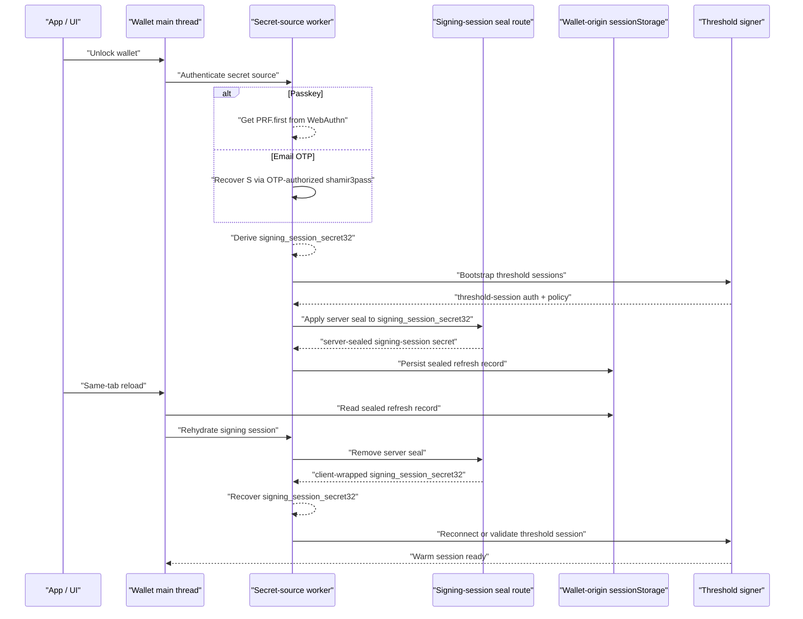

# Email OTP Signing Sessions

Last updated: 2026-04-18

## Goal

Make Email OTP signing sessions behave consistently with passkey signing sessions across same-tab page reloads.

Target behavior:

1. `passkey` session mode can survive same-tab reload through sealed refresh.
2. `email_otp` session mode should also survive same-tab reload through sealed refresh.
3. `per_operation` sessions must never survive reload or operation completion.
4. private-key export and link-device/add-signer still require fresh sensitive-operation authorization.
5. Email OTP must remain lower assurance than passkey in product copy and policy.

This plan uses `shamir3pass` for signing-session persistence, not for offline Email OTP login.

## Master TODO

1. [ ] Freeze the auth-method-neutral sealed refresh model.
2. [ ] Rename PRF-specific sealed-refresh APIs, storage, route names, and docs to signing-session terminology.
3. [ ] Define and implement canonical `signing_session_secret32` derivation for passkey and Email OTP.
4. [ ] Persist Email OTP session-mode sealed refresh records after successful OTP unlock and threshold bootstrap.
5. [ ] Ensure `per_operation` Email OTP never writes or rehydrates a sealed refresh record.
6. [ ] Rehydrate Email OTP session-mode material inside the Email OTP worker after same-tab reload.
7. [ ] Rebuild Ed25519 and ECDSA warm signing state from the rehydrated worker-owned secret.
8. [ ] Delete sealed refresh records and worker material on logout, lock, account switch, revocation, expiry, and exhaustion.
9. [ ] Keep sensitive operations explicit: private-key export and link-device/add-signer still require fresh auth.
10. [ ] Add unit and E2E coverage for passkey parity, Email OTP reload, sensitive-operation step-up, and fail-closed cases.
11. [ ] Re-run local smoke tests for Email OTP login, reload, Ed25519 sign, ECDSA sign, key export, and link-device/add-signer.

## Current State

Passkey session mode already has a sealed-refresh path:

1. passkey assertion yields `PRF.first`
2. `PRF.first` warms threshold Ed25519 and ECDSA signing sessions
3. the warm secret source can be sealed with server-assisted `shamir3pass`
4. the sealed refresh record is stored in wallet-origin `sessionStorage`
5. same-tab reload can rehydrate the worker cache without another Touch ID prompt

Email OTP session mode currently works only while the page runtime stays alive:

1. Google SSO authenticates the app session
2. Email OTP authorizes unseal
3. the Email OTP worker recovers `S` with server-assisted `shamir3pass`
4. the worker derives signing material and keeps it in memory
5. full page reload kills the worker and clears the secret-bearing cache
6. metadata can survive reload, but secret-bearing material cannot yet rehydrate

## Product Semantics

After this refactor, the user-facing semantics should be:

1. `session`
   - authenticate once for wallet unlock
   - keep signing capability active until TTL, logout, revocation, or remaining-use exhaustion
   - same-tab reload should preserve the session when sealed refresh is enabled
2. `per_operation`
   - authenticate for each operation
   - use secret-derived material once
   - discard immediately
   - never write a sealed refresh record

The semantics are auth-method neutral:

```ts
type SigningSessionPolicy = 'session' | 'per_operation';

type AuthMethod = 'passkey' | 'email_otp';

type SensitiveOperationPolicy =
  | 'inherit_session_policy'
  | 'require_fresh_same_method'
  | 'require_passkey'
  | 'deny_email_otp';
```

## Security Boundary

Do not make Email OTP offline-capable.

Rules:

1. the client still must not store the Email OTP escrow blob `E_ks(S)`
2. the client still must not store plaintext `S`
3. the server-stored Email OTP escrow remains authoritative
4. initial Email OTP login/unlock still requires Google SSO app-session auth and a fresh 6-digit OTP
5. same-tab refresh may rehydrate only a server-sealed signing-session secret that was created after successful OTP unlock
6. sealed refresh must be bounded by server-issued threshold-session TTL and remaining-use counters
7. logout, lock, revocation, expiration, and exhaustion must delete both in-memory and persisted sealed refresh material

The sealed refresh artifact is not `E_ks(S)`.

It should be modeled as:

```text
sealed_signing_session_secret = E_session_seal(secret_source_for_threshold_session)
```

where `secret_source_for_threshold_session` is:

1. passkey account: `PRF.first` or the canonical derived signing-session secret
2. Email OTP account: recovered `S` or the canonical derived signing-session secret from `S`

Preferred long-term target:

```text
client_secret_source -> derive signing_session_secret32 -> sealed refresh
```

That avoids naming the persisted material as passkey-specific `PRF.first` and makes the same code path work for passkey, password, and Email OTP accounts.

## Architecture



## Target Storage Model

Create one auth-method-neutral sealed session record.

Suggested name:

```ts
type SealedSigningSessionRecord = {
  v: 1;
  alg: 'shamir3pass-v1';
  authMethod: 'passkey' | 'email_otp';
  secretKind: 'signing_session_secret32';
  thresholdSessionId: string;
  sealedSecretB64u: string;
  curve?: 'ed25519' | 'ecdsa';
  relayerUrl?: string;
  thresholdSessionJwt?: string;
  keyVersion?: string;
  shamirPrimeB64u?: string;
  expiresAtMs: number;
  remainingUses: number;
  updatedAtMs: number;
};
```

Storage rules:

1. store only in wallet-origin `sessionStorage`
2. do not store in app-origin storage
3. do not store in `localStorage`
4. do not store `E_ks(S)`
5. do not store plaintext `S`
6. delete on logout, lock, revocation, expiry, exhaustion, or account switch
7. do not write records for `per_operation`

## Route Model

Rename the current passkey-specific seal surface to signing-session terminology.

Target routes:

```text
POST /threshold/signing-session-seal/apply-server-seal
POST /threshold/signing-session-seal/remove-server-seal
```

Request body:

```ts
type SigningSessionSealRequest = {
  thresholdSessionId: string;
  ciphertext: string;
  keyVersion?: string;
  authMethod: 'passkey' | 'email_otp';
  secretKind: 'signing_session_secret32';
};
```

Auth:

1. threshold-session auth is required
2. app-session auth is not sufficient for seal apply/remove
3. server must validate threshold-session ownership, wallet, signing root, TTL, remaining uses, and revocation state
4. server response TTL and remaining-use limits are upper bounds; client must use the stricter value

Breaking rename target:

1. replace `prf-seal` route names with `signing-session-seal`
2. replace `PrfSessionSeal*` types with `SigningSessionSeal*`
3. replace `sealedPrfFirstB64u` with `sealedSecretB64u`
4. replace `prfSessionSealedStore` with `signingSessionSealedStore`

Do not keep duplicate old APIs.

## Worker Ownership

Passkey and Email OTP should use separate authentication workers but one sealed-session persistence abstraction.

Target boundary:

```ts
type SecretSourceWorker =
  | { kind: 'passkey'; owns: 'webauthn_prf' }
  | { kind: 'email_otp'; owns: 'email_otp_secret_source' };
```

Worker rules:

1. passkey worker owns PRF-derived material
2. Email OTP worker owns recovered `S` and `S`-derived material
3. main thread never receives plaintext `S`
4. main thread never receives plaintext `signing_session_secret32` except where current compatibility paths still require a temporary handoff
5. ECDSA Email OTP signing material remains behind worker-owned opaque handles
6. Ed25519 Email OTP should move toward worker-owned opaque handles where it still uses `xClientBaseB64u` compatibility fields

## Rehydrate Behavior

On page reload:

1. wallet iframe starts
2. local account/session metadata is restored
3. `WarmSessionManager` sees a persisted threshold session record
4. if in-memory worker material is missing, `WarmSessionManager` asks the sealed-session persistence layer to rehydrate
5. the correct worker receives the rehydrated secret source based on `authMethod`
6. the worker reconstructs only the required warm signing state
7. `WarmSessionManager` reports the session as active only after worker material and threshold-session auth are both valid

Fail-closed cases:

1. sealed record missing
2. sealed record expired
3. remaining uses exhausted
4. threshold-session JWT missing for JWT sessions
5. threshold-session JWT expired or revoked
6. signing-root mismatch
7. auth-method mismatch
8. malformed sealed payload
9. seal route unavailable
10. storage unavailable

## Policy Rules

Session-mode Email OTP:

1. write sealed refresh record only after successful OTP unlock and threshold bootstrap
2. rehydrate on same-tab reload without sending another OTP
3. use the same TTL and remaining-use model as passkey
4. delete record when the server or client invalidates the signing session

Per-operation Email OTP:

1. never write sealed refresh record
2. never rehydrate
3. claim signing material once
4. zero and delete immediately after the operation

Sensitive operations:

1. private-key export requires `require_fresh_same_method` or stricter project policy
2. link-device/add-signer requires `require_fresh_same_method` or stricter project policy
3. normal transaction signing uses `inherit_session_policy`
4. `require_passkey` and `deny_email_otp` must fail before rehydrate attempts for Email OTP accounts

## Implementation Plan

### Phase 1: Rename and Generalize Sealed Refresh

1. [ ] Rename `prfSessionSealedStore` to `signingSessionSealedStore`.
2. [ ] Rename storage keys from `tatchi:threshold-prf-sealed:v1` to a signing-session key.
3. [ ] Rename `sealedPrfFirstB64u` to `sealedSecretB64u`.
4. [ ] Rename PRF-specific route/client/server types to signing-session-seal types.
5. [ ] Rename route paths from `/threshold-ecdsa/prf-seal/*` to `/threshold/signing-session-seal/*`.
6. [ ] Remove old route aliases after tests migrate.
7. [ ] Update docs and env examples to use signing-session-seal terminology.

### Phase 2: Define Canonical Secret Source

1. [ ] Add a canonical `signing_session_secret32` derivation helper.
2. [ ] Map passkey `PRF.first` to `signing_session_secret32`.
3. [ ] Map Email OTP recovered `S` to `signing_session_secret32`.
4. [ ] Freeze byte-level derivation inputs and domain separators.
5. [ ] Zero derivation intermediates in workers.
6. [ ] Add parity tests proving passkey and Email OTP feed the same downstream threshold derivation interface.

### Phase 3: Persist Email OTP Session-Mode Secrets

1. [ ] After successful Email OTP session-mode unlock, ask the Email OTP worker to seal `signing_session_secret32`.
2. [ ] Persist a `SealedSigningSessionRecord` with `authMethod = email_otp`.
3. [ ] Store record only if policy is `session`.
4. [ ] Refuse to persist if policy is `per_operation`.
5. [ ] Include threshold-session ID, signing root, TTL, remaining uses, curve, and key version.
6. [ ] Ensure ECDSA worker-owned share handles can be rebuilt from the rehydrated secret.
7. [ ] Ensure Ed25519 warm-session state can be rebuilt without exposing `S` to the main thread.

### Phase 4: Rehydrate Email OTP After Reload

1. [ ] On warm-session status read, detect missing worker material for Email OTP session records.
2. [ ] Load the sealed signing-session record from wallet-origin `sessionStorage`.
3. [ ] Verify `authMethod = email_otp`.
4. [ ] Call the signing-session seal remove route with threshold-session auth.
5. [ ] Rehydrate inside the Email OTP worker.
6. [ ] Rebuild ECDSA worker-owned signing-share handles.
7. [ ] Rebuild Ed25519 HSS client-base state.
8. [ ] Return active warm-session status only after rehydrate completes.
9. [ ] Fail closed and prompt normal Email OTP login if rehydrate fails.

### Phase 5: Invalidation and Cleanup

1. [ ] Delete sealed records on logout.
2. [ ] Delete sealed records on explicit wallet lock.
3. [ ] Delete sealed records on account switch.
4. [ ] Delete sealed records on revocation.
5. [ ] Delete sealed records on threshold-session expiry.
6. [ ] Delete sealed records when remaining uses reach zero.
7. [ ] Delete sealed records when a sensitive operation consumes a single-use session.
8. [ ] Clear worker-owned Email OTP material on the same invalidation paths.

### Phase 6: UI Behavior

1. [ ] After reload, show a small "Restoring signing session..." state while rehydrate runs.
2. [ ] Do not show Email OTP input unless rehydrate fails or policy requires fresh auth.
3. [ ] Do not show WebAuthn prompt for Email OTP rehydrate.
4. [ ] Keep Tx Confirmer confirm button loading until the signer is active.
5. [ ] Use the same warm-session readiness copy for passkey and Email OTP where possible.

### Phase 7: Tests

1. [ ] Unit test sealed session record validation for `authMethod = email_otp`.
2. [ ] Unit test that `per_operation` never writes a sealed record.
3. [ ] Unit test same-tab Email OTP reload rehydrates without OTP challenge.
4. [ ] Unit test expired Email OTP sealed record deletes itself and requires OTP login.
5. [ ] Unit test remaining-use exhaustion deletes sealed record.
6. [ ] Unit test auth-method mismatch fails closed.
7. [ ] Unit test signing-root mismatch fails closed.
8. [ ] E2E test Google SSO + Email OTP login, reload, NEAR sign without new OTP.
9. [ ] E2E test Google SSO + Email OTP login, reload, Tempo/EVM sign without new OTP.
10. [ ] E2E test private-key export after reload still requires fresh Email OTP.
11. [ ] E2E test link-device/add-signer after reload still requires fresh auth.
12. [ ] Passkey parity E2E test still passes after route/type renames.

## Acceptance Criteria

1. Email OTP `session` policy survives same-tab reload when sealed refresh is enabled.
2. Email OTP `per_operation` policy never survives reload.
3. Reloaded Email OTP sessions can sign Ed25519 and ECDSA transactions without another OTP.
4. private-key export still asks for a fresh Email OTP.
5. link-device/add-signer still asks for fresh same-method auth or stricter configured policy.
6. no plaintext `S` is stored in browser storage.
7. no `E_ks(S)` is stored in browser storage.
8. secret-bearing Email OTP material stays worker-owned.
9. route auth keeps app-session and threshold-session lanes separate.
10. no duplicate PRF-only sealed-refresh APIs remain after migration.
