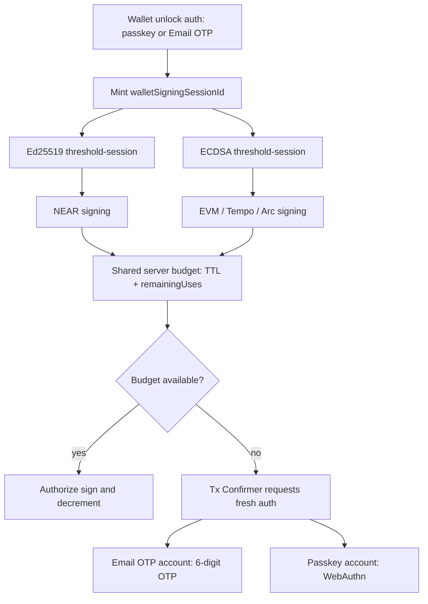
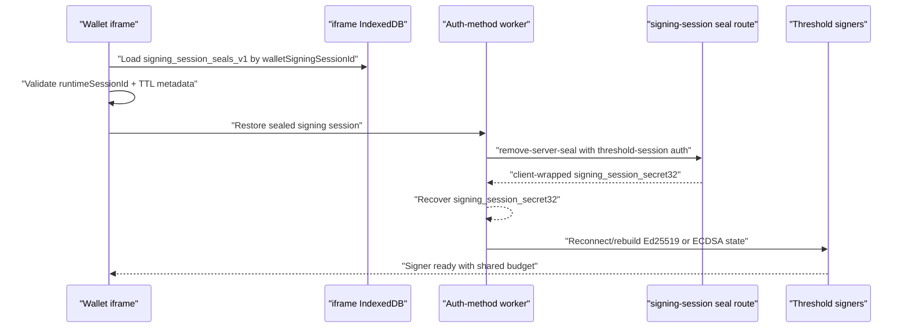

# Email OTP Signing Sessions

Last updated: 2026-04-21

## Goal

Document the current Email OTP signing-session behavior and its parity target with passkey signing sessions.

Current design:

1. Google SSO authenticates the app/user session.
2. Email OTP authorizes the first unseal of the Email OTP secret source for wallet unlock, transaction reauth, export, or another operation-scoped flow.
3. The Email OTP worker owns recovered `S`, derives `signing_session_secret32`, and keeps secret-bearing material out of the JS main thread.
4. `WarmSessionManager` owns the client-side in-memory lifecycle and policy decisions for active warm sessions.
5. Server policy, TTL, revocation, and remaining-use counters are authoritative upper bounds.
6. Session-mode Email OTP can use the generic sealed-refresh path to survive accidental iframe/page reload without another OTP while the same browser session and server budget remain valid.
7. `per_operation` Email OTP never writes or consumes sealed-refresh artifacts.
8. Private-key export and link-device/add-signer remain operation-scoped sensitive flows and require fresh auth; they must not consume, replace, or invalidate the transaction signing session.

Email OTP remains a lower-assurance convenience method than passkey. The implementation should preserve UX parity where policy allows it, but product copy and defaults should still recommend passkey.

## Auth-Method-Neutral Policy

Signing-session policy is independent of the auth method:

```ts
type SigningSessionPolicy = 'session' | 'per_operation';

type AuthMethod = 'passkey' | 'email_otp';

type SensitiveOperationPolicy =
  | 'inherit_session_policy'
  | 'require_fresh_same_method'
  | 'require_passkey'
  | 'deny_email_otp';
```

Rules:

1. `session` means one wallet unlock creates a reusable signing session until TTL, revocation, logout, lock, account switch, or remaining-use exhaustion.
2. `per_operation` means each operation receives fresh auth, signs once, and immediately discards operation material.
3. Normal transaction signing is not a step-up flow. If a valid session-mode signing session exists, NEAR and EVM signing should not prompt again.
4. When a session-mode signing session expires or exhausts, the next transaction should route through the registered auth method: Email OTP accounts show an OTP Tx Confirmer; passkey accounts show WebAuthn/passkey confirmation.
5. Sensitive flows can override normal signing policy with `require_fresh_same_method`, `require_passkey`, or `deny_email_otp`.

## Token And Session Boundaries

Email OTP flows intentionally use two authority lanes. They are not interchangeable.

### App Session

`app_session_v1` proves the browser/app is authenticated as a user for an app/wallet context.

Use app-session authority for:

1. Google SSO / OIDC exchange.
2. initial Email OTP challenge issuance and verification.
3. app-session state, refresh, lock, revoke, and metadata routes.
4. operation-challenge issuance when the app session is still live.

A valid app session does not prove that threshold signing material is warm or authorized to sign.

### Threshold Session

Threshold-session authority proves a specific threshold signing session is active and authorized for threshold routes.

Use threshold-session authority for:

1. Ed25519 threshold signing and continuation routes.
2. ECDSA threshold signing, presign, HSS, and export continuation routes.
3. signing-session seal apply/remove routes.
4. operation-challenge issuance after sealed refresh when the app-session JWT is no longer available but the restored wallet signing session is still valid.

A valid threshold session must not be accepted as a generic app login token.

### Route Auth Shape

Client/server boundaries should preserve the distinction explicitly:

```ts
type RouteAuth =
  | { kind: 'app_session'; jwt: string }
  | { kind: 'threshold_session'; jwt: string }
  | { kind: 'cookie' };
```

Wrong-token use must fail closed. Do not reintroduce generic `authorizationJwt` fields for active Email OTP or ECDSA HSS paths.

## Wallet Signing Session Budget

`walletSigningSessionId` is the wallet-level transaction signing budget for both Ed25519 and ECDSA.

Required behavior:

1. wallet unlock creates one `walletSigningSessionId`.
2. Ed25519 and ECDSA threshold sessions minted during that unlock reference the same `walletSigningSessionId`.
3. NEAR Ed25519 signing and EVM/Tempo/Arc ECDSA signing decrement the same server-authoritative `remainingUses` budget.
4. TTL expiry or remaining-use exhaustion invalidates both curve capabilities.
5. Export, link-device, and add-signer flows use operation-scoped auth and must not mutate the transaction signing budget.
6. The client may clear worker material earlier than the server, but it must never extend server TTL or remaining uses.



## Email OTP Unlock And Signing Flow

```mermaid
sequenceDiagram
  participant UI as "App / UI"
  participant Server as "Relay server"
  participant OTP as "Email OTP delivery"
  participant Worker as "Email OTP worker"
  participant S3P as "shamir3pass worker"
  participant Threshold as "Threshold signers"

  UI->>Server: "Google SSO / OIDC exchange"
  Server-->>UI: "app_session_v1 or cookie"

  UI->>Server: "Request wallet_unlock OTP challenge"
  Server->>OTP: "Send or dev-log 6-digit code"
  Server-->>UI: "challengeId + emailHint"

  UI->>Server: "Verify OTP"
  Server-->>UI: "OTP grant / unseal authorization"

  UI->>Worker: "Bootstrap Email OTP signing session"
  Worker->>S3P: "OTP-authorized server-assisted unseal"
  S3P-->>Worker: "recovered S bytes"
  Worker-->>Worker: "derive signing_session_secret32"
  Worker->>Threshold: "Bootstrap Ed25519 + ECDSA"
  Threshold-->>Worker: "threshold-session auth + walletSigningSessionId"
  Worker-->>UI: "wallet unlocked; signers ready or finalizing"
```

## Sealed Refresh

The sealed-refresh path is now a generic signing-session feature, not a passkey-only feature.

Purpose:

1. restore an already-authenticated `session` signing session after accidental iframe/page reload;
2. avoid prompting the user again while the same browser session and server signing-session budget remain valid;
3. keep the persisted artifact session-scoped and server-revocable.

The client must not persist the long-lived enrollment escrow or plaintext Email OTP secret.

Allowed persisted artifact:

```text
E_session_s(signing_session_secret32)
```

Disallowed artifacts:

```text
S
E_enrollment_s(S)
raw threshold-session JWTs in the sealed-refresh record
```

Storage model:

1. store sealed refresh records in iframe-origin IndexedDB store `signing_session_seals_v1`.
2. primary key is `walletSigningSessionId`.
3. record indexes include `walletId`, `userId`, `authMethod`, `signingRootId`, and `expiresAtMs`.
4. bind records to a browser-session `runtimeSessionId` held in iframe-origin `sessionStorage`.
5. if `runtimeSessionId` is missing or mismatched after browser restart, delete the IndexedDB records before restore.
6. keep at most one active record per wallet/signing root/auth method; delete older records on write.
7. do not store raw app-session JWTs or threshold-session JWTs in the sealed-refresh record.

Rehydrate behavior:

1. wallet iframe starts and loads nonsecret account/session metadata.
2. `WarmSessionManager` sees a session-mode wallet signing session whose worker material is missing.
3. the sealed-refresh layer validates the IndexedDB record and browser-session marker.
4. the correct worker calls the signing-session seal route with threshold-session authority.
5. the worker recovers `signing_session_secret32` and rebuilds only the required signing capability.
6. normal transaction signing continues without another OTP while server TTL and remaining uses permit it.
7. if restore fails, route through normal auth-method reauth: Email OTP for Email OTP accounts, WebAuthn for passkey accounts.



Detailed implementation and remaining work live in [otp-persist-session.md](./otp-persist-session.md).

## Curve Restore Rules

Restore should be lazy where practical:

1. restore only the curve needed for the pending operation when this reduces login/reload latency;
2. restore both curves when the UI needs a full wallet-ready state;
3. keep both curves tied to the same `walletSigningSessionId` budget either way.

Ed25519 restore:

1. reconstruct the worker-held Ed25519 signing handle from `signing_session_secret32` and persisted nonsecret session metadata;
2. reconnect or validate HSS state as required by the active Ed25519 threshold implementation;
3. do not expose Ed25519 seed/base material to the JS main thread.

ECDSA restore:

1. reconstruct the worker-held ECDSA root/share handle from `signing_session_secret32` and persisted nonsecret metadata;
2. reconnect or bootstrap the ECDSA HSS/presign state as required;
3. do not persist or re-expose `clientAdditiveShare32B64u` to session storage or main-thread durable state.

## Sensitive Operations

Sensitive operations are intentionally separate from transaction signing sessions.

Private-key export:

1. requires fresh same-method auth by default;
2. Email OTP accounts receive an `export_key` OTP challenge and verification;
3. passkey accounts perform fresh WebAuthn/passkey auth;
4. export must not consume, replace, clear, or renew the transaction `walletSigningSessionId`;
5. export material is discarded after the export viewer closes.

Link-device/add-signer:

1. requires fresh same-method auth or stricter project policy;
2. must not be silently authorized by a warm transaction signing session;
3. must not mutate unrelated transaction signing session state.

## Invalidation

Delete in-memory worker material and sealed-refresh records on:

1. logout;
2. explicit wallet lock;
3. account switch;
4. server revocation;
5. threshold-session expiry;
6. `remainingUses` exhaustion;
7. browser-session marker loss;
8. signing-root mismatch;
9. auth-method mismatch;
10. malformed sealed payload;
11. server seal route refusal.

`per_operation` flows additionally clear recovered operation material immediately after the operation, regardless of success or failure.

## Current Implementation Checklist

1. [x] Email OTP secret-bearing login, enrollment, unlock, bootstrap, and ECDSA export work through the dedicated Email OTP worker.
2. [x] Recovered `S` stays worker-owned and byte-oriented.
3. [x] `signing_session_secret32` is the sealed-refresh secret source; the client does not mirror `E_enrollment_s(S)`.
4. [x] Sealed refresh uses iframe-origin IndexedDB plus a `sessionStorage` browser-session marker.
5. [x] App-session and threshold-session lanes are represented by explicit route-auth variants.
6. [x] Transaction signing shares one `walletSigningSessionId` across Ed25519 and ECDSA.
7. [x] Export uses fresh operation auth and does not clobber transaction signing sessions.
8. [x] Email OTP resend exists for unlock, transaction signing, export, and registration prompts.
9. [x] Hosted Email OTP account IDs use privacy-preserving HMAC-readable slugs instead of raw email-derived names.

## Remaining Work

1. [ ] Finish the remaining Phase 11 cleanup in [otp-persist-session.md](./otp-persist-session.md): delete obsolete export-as-login/bootstrap terminology and add permanent guards for those names.
2. [ ] Add the remaining transaction-signing resend E2E coverage in `per_operation` mode.
3. [ ] Add broader E2E coverage for shared signing-session budget exhaustion across NEAR + Tempo + Arc for Email OTP and passkey accounts.
4. [ ] Add E2E coverage proving Ed25519/ECDSA export does not clobber an active transaction signing session.
5. [ ] Keep passkey and Email OTP sealed-refresh behavior covered by parity tests after any signer-slot or route-auth refactor.
