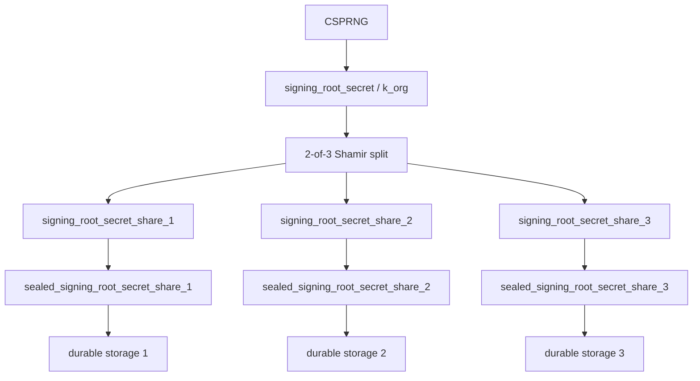
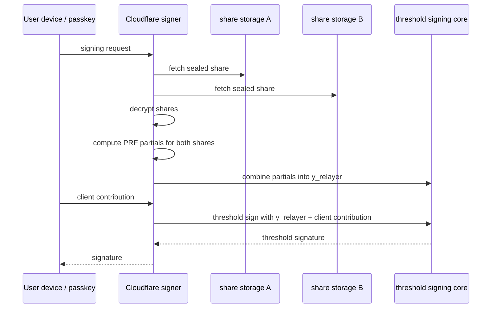
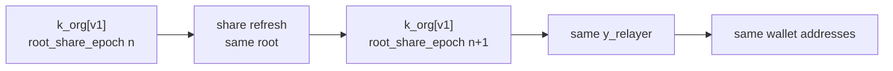
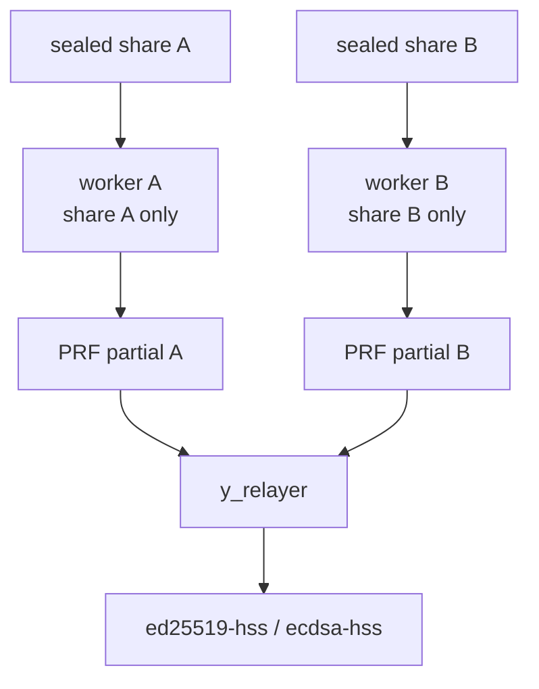

# Availability-First MPC Custody: Signing Root Secrets Plan

Date updated: 2026-04-17

## Objective

Design the server-side signing-root custody model for availability-first MPC
custody.

The goals are:

- avoid durable plaintext signing-root storage
- avoid per-wallet durable server secret storage
- avoid a deterministic platform `master_secret` that can rederive customer
  roots after self-host migration
- preserve wallet addresses when custody shares are refreshed
- keep normal signing simple enough for a single Cloudflare Worker in Phase 1
- leave a clean upgrade path to a two-server threshold-PRF model later

This is a forward-looking design plan. Breaking package and API changes are
allowed where they cleanly replace the current model.

## Decision

Use randomly generated signing roots.

For each project:

1. Generate a random `signing_root_secret`, also called `k_org` in crypto
   notation.
2. Split it into 2-of-3 threshold shares.
3. Discard the plaintext root after share creation and backup/export
   ceremonies complete.
4. Encrypt each root share as a `sealed_signing_root_secret_share`.
5. Persist the sealed shares in a durable database such as Google Cloud SQL
   for PostgreSQL, with metadata that can later split shares across stronger
   failure domains.
6. Let the Phase 1 Cloudflare signer request any two sealed shares, decrypt
   them in memory, compute two threshold-PRF partials, combine them into
   `y_relayer`, and sign.
7. Later, upgrade to a two-server model where separate workers hold or unwrap
   distinct root shares and use threshold-PRF partial evaluation.

The canonical durable recovery material is the set of encrypted signing-root
shares plus any customer backup package. There is no central platform
`master_secret -> k_org` derivation step. If all recoverable root shares and
customer backups are lost, the signing root is lost.

Phase 1 does not claim that Cloudflare runtime compromise cannot expose
`k_org`. The claim is narrower:

- plaintext `k_org` is not durably stored
- a Cloudflare admin who can only read durable storage should see sealed shares,
  not plaintext roots
- the signer runtime may decrypt two root shares while performing an authorized
  signing operation, which is enough material to reconstruct `k_org` even if the
  canonical derivation path does not explicitly reconstruct it

## Naming

Use product-oriented names at API and storage boundaries. Use short crypto
names only in specs and protocol internals.

| Concept                      | Preferred Name              | Crypto/Internal Name |
| ---------------------------- | --------------------------- | -------------------- |
| Random signing root          | `signing_root_secret`       | `k_org`              |
| Signing root version         | `signing_root_version`      | `k_org_version`      |
| Shamir share of the root     | `signing_root_secret_share`        | `k_org_share_i`      |
| Encrypted stored root share  | `sealed_signing_root_secret_share` | `enc(k_org_share_i)` |
| Root share refresh counter   | `root_share_epoch`          | share epoch          |
| Share wrapping key           | `share_wrapping_key`        | KEK                  |
| Per-wallet server root input | `server_wallet_root_input`  | `y_relayer`          |
| Per-wallet client root input | `client_wallet_root_input`  | `y_client`           |
| Actual server signing share  | `server_signing_share`      | `x_relayer`          |
| Actual client signing share  | `client_signing_share`      | `x_client`           |

The important distinction:

- `signing_root_secret` / `k_org` is the project-level root.
- `server_wallet_root_input` / `y_relayer` is derived per wallet from `k_org`.
- `server_signing_share` / `x_relayer` is the final server-side threshold
  signing share or backend share material.

## Threat Model

The signing system uses threshold signing with:

- a server-side contribution derived from `k_org`
- a client-side contribution derived from passkey PRF material

Compromise of `k_org` is serious, but it is not by itself a complete wallet
compromise. An attacker still needs the user's passkey-derived client
contribution to sign.

The Phase 1 design is primarily protecting against:

- accidental durable plaintext root exposure
- company insiders reading plaintext roots through Cloudflare admin/storage
  access
- catastrophic loss of one root-share storage location
- accidental loss of one encrypted root share
- self-host migration that preserves wallet addresses

The Phase 1 design does not fully protect against:

- malicious code deployed to the Cloudflare signer
- Cloudflare runtime compromise during an authorized signing operation
- a party that can unwrap or decrypt any two root shares and execute the signer

Those risks are addressed later by stricter deployment controls, the two-server
threshold-PRF model, and optional TEE hardening.

## Secret Hierarchy

```text
signing_root_secret / k_org
  -> server_wallet_root_input / y_relayer
    -> server_signing_share / x_relayer
      -> threshold signing with client contribution
```

The durable storage hierarchy is:

```text
k_org
  -> 2-of-3 signing_root_secret_shares
    -> sealed_signing_root_secret_shares
      -> durable storage locations
```



## Signing Root Creation

Project creation uses an audited root ceremony.

1. Generate `signing_root_secret` using a CSPRNG.
2. Assign `signing_root_version = 1`.
3. Assign `root_share_epoch = 1`.
4. Split the root with 2-of-3 Shamir secret sharing.
5. Encrypt each root share under its configured `share_wrapping_key`.
6. Persist the three sealed shares and metadata.
7. Export the three root shares or a customer backup package to the customer.
8. Require backup confirmation before the project can become production-active.
9. Zeroize plaintext `signing_root_secret` and plaintext root shares from the
   provisioning process.

The customer backup requirement is part of the tradeoff. Without a deterministic
platform root, there is no platform-only rederive path if all root shares and
customer backups are lost.

This is intentional. Availability comes from redundant encrypted root shares,
backup confirmation, storage isolation, and recovery drills, not from a central
master secret that can recreate customer roots.

## Phase 1 Storage Model

Phase 1 uses one Cloudflare signer, but avoids durable plaintext `k_org`.

Each project stores:

- three `sealed_signing_root_secret_share` records
- root metadata
- wallet metadata
- storage locator metadata
- wrapping-key locator metadata

The default durable store can be Google Cloud SQL for PostgreSQL. This keeps
the recovery source explicit and backed up without introducing a separate
per-wallet secret database. The stored values are encrypted root shares, never
plaintext `k_org`.

Do not store or depend on:

- durable plaintext `signing_root_secret`
- durable plaintext signing-root shares
- a platform `master_secret` that can deterministically rederive `k_org`
- per-wallet server signing secrets

The sealed shares are the source of recovery. Wrapping keys and storage
providers can be rotated, but rotation must preserve the underlying
`signing_root_secret` unless an explicit wallet-key migration is intended.

The initial storage layout can be:

```text
share 1: encrypted row or record in durable database
share 2: encrypted row or record in durable database
share 3: encrypted row or record in durable database plus customer/offline backup
```

For real isolation, the three shares should not all depend on one admin plane,
one wrapping key, or one provider account.

The minimum useful Phase 1 version can start with one durable database if
operational simplicity matters, but the security claim must be narrower:

- it reduces accidental plaintext storage exposure
- it reduces catastrophic data-loss risk through database backups and customer
  backup packages
- it does not create strong independent custody domains until the shares,
  wrapping keys, and admin planes are split

## Phase 1 Signing Flow

The single Cloudflare signer computes both threshold-PRF partials in one
runtime.

```text
1. Receive an authorized signing request.
2. Resolve wallet metadata.
3. Fetch any two sealed signing-root shares.
4. Unwrap or decrypt those shares.
5. Compute one threshold-PRF partial per plaintext root share.
6. Combine both partials into `server_wallet_root_input` / `y_relayer`.
7. Run the existing threshold signing flow with the client contribution.
8. Zeroize plaintext root shares, PRF partials, `y_relayer`, and derived server
   material.
```

This is Option A: single-worker threshold-PRF. It uses the same derivation
protocol as Option B, but both share partials are computed in one runtime. That
runtime still sees enough plaintext share material to reconstruct `k_org`, so
the security posture is close to reconstructing even though the canonical code
path is partial evaluation and combine.

It is intentionally simple. It does not split PRF partial evaluation across two
workers in Phase 1 because a single runtime seeing two root shares can
reconstruct `k_org` anyway. Splitting computation inside that same runtime would
not materially change the runtime compromise boundary.



## Core Derivation Model

Use `y_relayer` for the per-wallet server root input.

Conceptually:

```text
P = HashToGroup("signing-root-prf:v1", wallet_context)
partial_i = [k_org_share_i] P
partial_j = [k_org_share_j] P
Z = lambda_i * partial_i + lambda_j * partial_j
y_relayer = HashToBytes("y_relayer:v1", encode(Z), wallet_context)
```

The exact encoding must be canonical, versioned, and byte-stable across Rust,
TypeScript, Workers, Node, and future TEE runtimes.

The client side remains independent:

```text
y_client = derive_from_passkey_prf(...)
```

Then the protocol-specific HSS or threshold-key path combines the client and
server root inputs into signing material.

Use `y_relayer` in docs and APIs because that term is already aligned with the
HSS codebase.

### Threshold-PRF Equivalence

Do not use additive child derivation from root shares. A construction that lets
servers locally derive additive child shares from `k_org_share_i` is tempting,
but it is the wrong primitive if disclosure of one derived wallet input can
reveal information about the signing root or make root-share compromise
analysis harder.

Use threshold-PRF partial evaluation for both Option A and Option B.

```text
Option A:
  one worker computes partial_i and partial_j, then combines them

Option B:
  worker A computes partial_i
  worker B computes partial_j
  a combiner combines them

Both:
  y_relayer = HashToBytes("y_relayer:v1", encode(sum(lambda_i * partial_i)), wallet_context)
```

The direct `k_org -> y_relayer` path is only a reference test path. Production
signing should use share partials even in Option A so switching from one worker
to two workers does not change derivation behavior or wallet identity.

Threshold-PRF is the canonical derivation for this plan. `signing_root_secret`
and `signing_root_secret_share` generation are defined over the PRF group's scalar
field, not as opaque 32-byte strings.

## Versioning Model

Every wallet must identify the root and derivation context that produced its
server-side input.

Project metadata:

- `project_id`
- `signing_root_version`
- `root_share_epoch`
- `derivation_version`
- `threshold_scheme`
- `share_threshold = 2`
- `share_count = 3`
- storage locator for each sealed root share
- wrapping-key locator for each sealed root share
- created and updated timestamps

Wallet metadata:

- `project_id`
- `wallet_id`
- `user_id`
- `rp_id`
- `scheme_id`
- `key_purpose`
- `wallet_key_version`
- `signing_root_version`
- `derivation_version`
- threshold public key
- address or chain-specific public identity
- active or retired status
- created and updated timestamps

Meaning:

- `signing_root_version` changes only when the underlying root changes.
- `root_share_epoch` changes when shares are proactively refreshed.
- wrapping-key metadata changes when sealed shares are rewrapped.
- `wallet_key_version` changes when a wallet key identity changes.

## Rotation Semantics

There are three different operations. They must not be conflated.

### Rewrap Root Shares

Rewrap means encrypting the same root shares under new wrapping keys.

Result:

- same `signing_root_secret`
- same root shares, unless refresh also happens
- same `y_relayer`
- same wallet addresses
- no user migration

### Refresh Root Shares

Refresh means replacing the 2-of-3 shares while preserving the same underlying
`signing_root_secret`.

Result:

- same `signing_root_secret`
- new `signing_root_secret_share_i` values
- incremented `root_share_epoch`
- same `y_relayer`
- same wallet addresses
- no passkey re-registration

This is the address-preserving "rotation" operation.



### Replace Signing Root

Replacing the signing root means creating `signing_root_secret[v+1]`.

Result:

- new `signing_root_secret`
- new `y_relayer`
- new threshold public key
- usually new wallet address
- wallet-key migration required

Use this for root compromise or intentional full rekeying, not normal
operational rotation.

## Share Refresh

For Shamir sharing, proactive refresh creates a new sharing of the same secret.

The protocol should:

1. authenticate the refresh operation
2. reconstruct or reshare the same `signing_root_secret`
3. generate a fresh 2-of-3 sharing
4. seal each new root share under the active share wrapping key
5. write all shares under a new `root_share_epoch`
6. verify at least two new shares reconstruct the same root
7. verify known wallet addresses still match
8. delete old sealed shares after the new epoch is committed

In Phase 1, the single signer or provisioning service may reconstruct `k_org`
during refresh. In later two-server or TEE models, refresh should become a
distributed resharing protocol.

## Recovery Model

Recovery requires any two usable root shares, or the customer's backup.

Recovery paths:

- memory cache miss: fetch and decrypt two sealed shares
- one storage location lost: recover from the other two shares
- one wrapping key unavailable: recover from two other shares if their wrapping
  keys are available
- all hosted storage lost: recover from customer backup
- customer self-host migration: export or reshare root shares to customer
  infrastructure

There is no deterministic platform `master_secret` recovery path.

That is intentional. It improves post-migration trust semantics but requires
customer backup and recovery drills.

## Security Boundary In Phase 1

Phase 1 protects durable storage better than the old plaintext-root model.

If an employee only obtains Cloudflare storage/admin read access, they should
not get plaintext `k_org`; they should get sealed shares.

However, the Cloudflare signer is still custody-critical:

- it can fetch two shares
- it can decrypt or request unwrap for two shares
- it can compute and combine threshold-PRF partials for those shares
- it has enough plaintext share material to reconstruct `k_org`
- malicious runtime code can exfiltrate `k_org`

Therefore Phase 1 needs operational controls:

- separate permissions for storage read, Worker deploy, and wrapping-key use
- deploy approvals for signer code
- audit logs for share reads and unwraps
- rate limits and anomaly alerts for share reconstruction
- no logging of root shares, `k_org`, `y_relayer`, or signing shares
- short-lived in-memory plaintext with zeroization
- customer backup confirmation before production activation

## Phase 2 Two-Server Threshold-PRF Upgrade Path

The next security upgrade is a two-server threshold-PRF model, pending
prototype benchmarks.

Target shape:

```text
Cloudflare worker A reads and decrypts encrypted root share A
Cloudflare worker B reads and decrypts encrypted root share B
worker A computes threshold-PRF partial A
worker B computes threshold-PRF partial B
combiner computes y_relayer from partial A and partial B
existing ed25519-hss or ecdsa-hss flow consumes y_relayer
```

This avoids reconstructing `k_org` in one runtime. It does not, by itself,
make current HSS flows consume `y_relayer` shares. Current HSS flows consume a
full `y_relayer`. If we want no single process to observe `y_relayer`, that is
a later HSS/MPC integration change.



The Phase 1 data model must be compatible with this:

- root shares are already separate objects
- share wrapping keys can become node-specific
- `root_share_epoch` already supports refresh
- self-host migration can use share refresh or resharing

TEE deployment can be added later as a stricter implementation of the same
share boundaries.

## Self-Host Migration

Same-wallet self-host migration transfers custody of the same
`signing_root_secret`.

Recommended flow:

1. freeze new wallet enrollment for the project
2. pin `signing_root_version`
3. refresh or export root shares into a migration bundle
4. customer imports the shares into self-host infrastructure
5. customer verifies known wallet addresses
6. hosted signer is disabled
7. hosted root shares are deleted or retired
8. deletion and disablement evidence is exported

Result:

- same `signing_root_secret`
- same `y_relayer`
- same threshold public keys
- same wallet addresses

If the customer wants a fresh root, that is wallet-key migration, not
same-wallet self-host migration.

## Customer Backup

Customer backup is mandatory in the random-root model.

The backup package should include:

- the three signing root shares, or a customer-specific backup sharing
- `project_id`
- `signing_root_version`
- `root_share_epoch`
- derivation metadata
- wallet inventory or address verification data
- checksum or manifest digest
- restore instructions

The package must explain:

- any two shares can reconstruct the signing root
- losing all hosted shares and customer backup can make wallets unavailable
- refreshing shares preserves addresses only because the underlying root stays
  the same

## Compromise Response

### One Sealed Share Exposed

Impact:

- no plaintext `k_org` exposure by itself
- rotate or rewrap the exposed share
- consider root-share refresh

Response:

1. disable the affected storage or wrapping-key path
2. refresh root shares if integrity is uncertain
3. rewrap shares under new wrapping keys
4. verify known wallet addresses still match

### Two Root Shares Exposed

Impact:

- `k_org` can be reconstructed
- all wallets under that project are at elevated server-side risk
- attacker still needs the client passkey contribution to sign

Response:

1. stop new wallet enrollment under the affected root
2. increase signing monitoring and rate limits
3. decide whether to migrate wallets to a new signing root
4. for EVM smart accounts, use owner rotation where address continuity is
   required

### Signer Runtime Compromise

Impact:

- plaintext `k_org` may be exposed during signing or refresh
- derived `y_relayer` values may be exposed

Response:

1. disable the signer deployment
2. rotate deployment credentials and wrapping-key permissions
3. inspect audit logs for share fetch and unwrap events
4. decide whether signing-root replacement is required
5. move affected projects to stricter TEE-backed custody if available

### Customer Backup Loss

Impact:

- no immediate signing impact if hosted shares remain available
- disaster recovery margin is reduced

Response:

1. require customer to regenerate or download a new backup package
2. optionally refresh root shares before issuing the new backup
3. do not mark the project fully recoverable until backup confirmation is
   complete

## Passkey Interaction

Passkey registration is independent from root-share custody.

Operations that do not require passkey re-registration:

- share rewrap
- share refresh
- self-host transfer of the same signing root
- moving to a two-server or TEE custody model with the same root

Replacing `signing_root_secret` can reuse the same passkey-derived client input
where protocol support exists, but it usually changes the threshold public key
and wallet address.

## EVM Implication

For EVM, a new threshold key usually means a new owner identity.

Therefore:

- share refresh preserves EOA addresses
- signing-root replacement usually changes EOA addresses
- smart accounts can preserve account identity through owner rotation

## Implementation Phases

### Phase 1. Single Cloudflare Worker With Encrypted Root Shares

1. Generate random `signing_root_secret` at project creation.
2. Split it into 2-of-3 signing root shares.
3. Seal each share under a configured share wrapping key.
4. Store sealed shares and metadata durably in a database such as Google Cloud
   SQL for PostgreSQL.
5. Require customer backup before production activation.
6. Let one Cloudflare signer decrypt two shares in memory for signing.
7. Compute and combine two threshold-PRF partials locally to derive
   `y_relayer`.
8. Feed `y_relayer` into the existing `ed25519-hss` or `ecdsa-hss` flow.
9. Keep per-wallet server secrets out of durable storage.
10. Add audit logs for share reads, unwraps, reconstruction, refresh, and
    export.

This is Option A: single-worker threshold-PRF. It is more performant and
operationally simpler than a two-server distributed path. It is also less
secure because one signer runtime observes two plaintext root shares, which is
enough material to reconstruct `k_org`.

Exit criteria:

- no plaintext `k_org` durable storage
- any two shares recover the same root
- one lost share does not break signing
- customer backup restore is tested
- known wallet addresses remain stable after share refresh

### Phase 2. Two Cloudflare Worker Threshold-PRF Model

This is Option B: distributed threshold-PRF derivation.

1. Complete the `threshold-prf` prototype.
2. Benchmark direct reference evaluation, partial evaluation, and partial
   combine.
3. Continue only if latency and compute are low enough for signing-scale use.
4. Give worker A access to one encrypted signing-root share.
5. Give worker B access to another encrypted signing-root share.
6. Each worker decrypts only its own share in memory.
7. Each worker computes a threshold-PRF partial for the requested wallet
   context.
8. Combine the partials to derive the same `y_relayer` as Phase 1
   single-worker threshold-PRF evaluation.
9. Feed `y_relayer` into the existing `ed25519-hss` or `ecdsa-hss` flow.

Important boundary:

- current HSS flows consume full `y_relayer`
- threshold-PRF partials avoid reconstructing `k_org`
- they do not by themselves make `ed25519-hss` or `ecdsa-hss` consume
  `y_relayer` shares
- if we want no single process to observe `y_relayer`, that is a later HSS/MPC
  integration change

Exit criteria:

- Phase 2 output is byte-identical to Phase 1 output
- wallet addresses do not change
- benchmark results are recorded and acceptable
- share partials are bound to context and purpose
- DLEQ proofs or TEE attestation are specified before treating this as
  malicious-server safe

### Phase 3. Share Refresh And Self-Host Export

1. Implement proactive root-share refresh.
2. Implement share rewrap.
3. Implement customer backup export.
4. Implement self-host migration export.
5. Add address verification before and after refresh/export.
6. Add hosted-signing disablement and share deletion flows.

### Phase 4. Independent Storage And Wrapping Boundaries

1. Move shares into separate provider or account boundaries where practical.
2. Use independent share wrapping keys.
3. Separate permissions for signer deploy, storage read, and share unwrap.
4. Add alerting for unusual share access patterns.

### Phase 5. Two-TEE Server Model

1. Provision two TEE signing nodes.
2. Give each TEE node a distinct root-share custody path.
3. Add remote attestation before share release.
4. Move reconstruction into the attested boundary.
5. Later evaluate distributed derivation or HSS/MPC signing so no single
   non-TEE runtime observes `k_org`.

### Phase 6. Project-Root Replacement

1. Add explicit wallet-key migration to a new signing root.
2. Reuse passkey-derived client input where supported.
3. For EVM, use smart-account owner rotation where stable account identity is
   required.

Project-root replacement is not normal rotation. It is compromise response or
intentional rekeying.

## Phased Todo List

### Phase 1A. Data Model

- Define `SigningRootRecord`.
- Define `SigningRootSecretShareRecord`.
- Define `SealedSigningRootSecretShare`.
- Define `root_share_epoch`.
- Define share wrapping-key locator metadata.
- Define durable database storage for encrypted signing-root shares, initially
  Google Cloud SQL for PostgreSQL or equivalent.
- Define wallet metadata that includes `signing_root_version` and
  `derivation_version`.
- Remove public docs that present deterministic `master_secret -> k_org` as the
  target model.
- Treat `sealed_signing_root_secret_share` records and customer backups as the only
  durable recovery sources for `k_org`.

### Phase 1B. Root Ceremony

- Implement random root generation.
- Implement 2-of-3 Shamir splitting.
- Implement share sealing.
- Implement customer backup package generation.
- Implement root zeroization after provisioning.
- Add tests proving any two shares reconstruct and one share does not.
- Add recovery drills proving project creation, backup restore, and signing do
  not depend on platform master-secret rederivation.

### Phase 1C. Cloudflare Signer Partial Evaluation

- Implement share resolution for a project through `SigningRootSecretResolver`
  adapters.
- Refactor the signing service to depend on a single
  `SigningRootShareResolver.resolveSigningRootSharePair` abstraction:

  ```ts
  interface SigningRootShareResolver {
    resolveSigningRootSharePair(input: {
      signingRootId: string;
      signingRootVersion?: string;
      preferredShareIds?: readonly [1 | 2 | 3, 1 | 2 | 3];
    }): Promise<readonly [Uint8Array, Uint8Array]>;
  }
  ```

- Support durable storage adapters for Cloudflare Durable Objects, Postgres,
  and custom AWS/GCP Secret Manager record sources.
- Support decrypt adapters for local AES-GCM KEK resolution, AWS KMS, GCP KMS,
  and TEE-backed unwrap/decrypt flows.
- Compute threshold-PRF partials from two plaintext root shares in one worker.
- Combine partials into full `y_relayer`.
- Feed `y_relayer` into the existing HSS/threshold signing path.
- Zeroize root material after use.
- Add redaction guards for logs and errors.

### Phase 1C.0. Context Propagation Invariants

Tenant-root lookup is project-scoped. HSS signing context may still be
org-scoped.

This distinction must be explicit at every boundary:

- `runtimeSnapshotScope.orgId` identifies the organization and binds HSS policy.
- `runtimeSnapshotScope.projectId` identifies the signing-root custody scope.
- `SigningRootShareResolver.resolveSigningRootSharePair({ projectId, ... })` must
  receive a project id, not `context.orgId`.
- Bootstrap-token and session principals must preserve `projectId` whenever the
  route can reach signing-root derivation.
- Fixed self-host resolvers may use their configured project id when the request
  does not carry one, but hosted multi-customer resolvers must reject missing
  project scope.
- Omitted `rootVersion` means "use the fixed resolver root version" only for a
  fixed self-host resolver; hosted resolvers should resolve the requested active
  root version from authenticated project scope or explicit metadata.

Refactor guardrails:

- `check-signing-root-refactor-boundaries` must fail if signing-root derivation
  passes `context.orgId` as resolver `projectId`.
- Tests must include at least one managed-registration path where
  `orgId !== projectId`.
- Tests must include fixed self-host paths where omitted `rootVersion` resolves
  to the fixed root and explicit wrong `rootVersion` fails.
- Public code must not reintroduce legacy root naming, legacy self-host root
  routes, or threshold master-secret env-var surfaces.

### Phase 1C.1. Hosted And Self-Hosted Resolver Modes

- [x] Implement hosted multi-customer resolver composition:
      `createHostedSigningRootShareResolver({ storageAdapter, decryptAdapter })`.
- [x] Implement direct self-host resolver composition:
      `createSelfHostedSigningRootShareResolver({ projectId, rootVersion, shares
})`.
- [x] Implement sealed self-host resolver composition:
      `createSealedSelfHostedSigningRootShareResolver({ storageAdapter,
decryptAdapter })`.
- [x] Ensure hosted mode resolves `projectId` and `rootVersion` from
      authenticated runtime/session scope.
- [x] Ensure direct self-host mode validates a fixed `projectId`,
      `rootVersion`, share ids, and canonical share-wire shape.
- [x] Ensure sealed self-host mode lets the customer choose their own storage
      and decrypt adapters.
- [x] Add parity tests proving hosted mode, direct self-host mode, and sealed
      self-host mode produce the same `y_relayer` for the same root shares and
      wallet context.
- [ ] Add failure tests for missing project scope, missing shares, duplicate
      shares, invalid share ids, decrypt failures, and wrong root version.
- [x] Document that direct self-host mode does not require a KEK env var.
- [x] Document that local AES-GCM sealed-share mode uses
      `SIGNING_ROOT_SECRET_SHARE_KEK_B64U`, while KMS/TEE modes should not expose
      a raw KEK env var.

### Phase 1C.2. Tenant-Root Secret Naming Cleanup

- [x] Rename the public share wire/id surface to `SigningRootSecretShare`,
      `SigningRootSecretShareWireV1`, and `SigningRootSecretShareId`.
- [x] Rename sealed-share records to `SealedSigningRootSecretShare`.
- [x] Rename source/decrypt/adapter types to `SigningRootSecretShareSource`,
      `SigningRootSecretDecryptAdapter`, and `SigningRootSecretResolverAdapters`.
- [x] Rename the adapter-backed sealed-share resolver to
      `SigningRootSecretResolver`.
- [x] Rename durable storage to `SigningRootSecretStore`.
- [x] Rename share KEK plumbing to `SigningRootSecretShareKekResolver`.
- [x] Rename built-in stores to `CloudflareDurableObjectSigningRootSecretStore`,
      `PostgresSigningRootSecretStore`, and `InMemorySigningRootSecretStore`.
- [x] Rename the local AES-GCM decrypt helper to
      `createSigningRootSecretAesGcmDecryptAdapter`.
- [x] Rename config fields to signing-root equivalents and remove legacy
      root-share aliases in the same breaking cleanup.
- [x] Use `SIGNING_ROOT_SECRET_SHARE_KEK_B64U` for local AES-GCM sealed-share
      mode.
- [x] Keep `master_secret` out of the new public API names.

### Phase 1D. Recovery Drills

- Test memory cache miss.
- Test loss of one sealed share.
- Test loss of one storage location.
- Test loss of one share wrapping key.
- Test customer backup restore.
- Test project activation blocked until backup confirmation.

### Phase 2A. Threshold-PRF Prototype Gate

- [x] Implement the `crates/threshold-prf` prototype.
- [x] Prove one-worker 2-of-3 partial evaluation and two-worker 2-of-3 partial
      evaluation produce the same `y_relayer`.
- [x] Keep direct `k_org` evaluation as a reference test path only.
- [x] Benchmark direct reference evaluation.
- [x] Benchmark partial evaluation.
- [x] Benchmark partial combine.
- [x] Benchmark full 2-of-3 threshold evaluation.
- [x] Decide whether native and local WASM proxy performance are good enough
      for signing-scale use.
- [x] Do not wire Phase 2 into signing until vectors and benchmark reports are
      committed.

### Phase 2B. Two-Worker Threshold-PRF Derivation

- Give worker A access to one encrypted signing-root share.
- Give worker B access to another encrypted signing-root share.
- Decrypt each share only in the owning worker memory.
- Compute threshold-PRF partials for the requested wallet context.
- Combine partials into full `y_relayer`.
- Feed full `y_relayer` into the existing HSS flow.
- Add tests proving Phase 1 one-worker partial mode and Phase 2 two-worker
  partial mode preserve the same wallet addresses.
- Defer HSS changes for shared `y_relayer` consumption unless we explicitly
  choose a stronger no-single-`y_relayer` model later.

### Phase 3A. Share Refresh

- Implement root-share refresh for the same signing root.
- Increment `root_share_epoch`.
- Verify known wallet addresses after refresh.
- Delete or retire old share epochs after commit.
- Add rollback behavior for failed refresh.

### Phase 3B. Self-Host Migration

- Export root shares and metadata to customer.
- Support share refresh into customer custody.
- Verify self-host worker derives the same wallet addresses.
- Disable hosted signing.
- Delete or retire hosted shares.
- Export audit evidence.

### Phase 4. Hardening

- Move shares to independent storage boundaries.
- Move share wrapping keys to independent custody boundaries.
- Add stricter deploy controls around the signer.
- Add anomaly detection for share access.
- Add break-glass recovery runbooks.

### Phase 5. Two-TEE Upgrade

- Define TEE attestation requirements.
- Bind share release to attested code identity.
- Move reconstruction into TEE nodes.
- Evaluate distributed derivation or HSS/MPC upgrade after the attested
  reconstruction model is stable.

## Non-Goals

- durable plaintext `k_org` storage
- deterministic platform rederivation of customer roots
- per-wallet durable server secret storage
- pretending single-worker reconstruction protects against malicious signer code
- distributed HSS derivation in Phase 1
- transparent wallet identity preservation when the signing root is replaced

## Open Questions

- Should the initial three sealed shares start in Google Cloud SQL for
  PostgreSQL, or split across provider/account boundaries from day one?
- Which share wrapping keys are acceptable for Phase 1?
- Should the customer backup contain the hosted three shares or a distinct
  customer backup sharing?
- What backup confirmation UX is required before production activation?
- What real Cloudflare Worker runtime overhead should we record before the
  Worker integration target ships?
- Which TEE provider and attestation model should Phase 5 target?
- Do we want self-host migration to export raw shares, reshare into customer
  nodes, or support both?

## Summary

The target model is:

- random `signing_root_secret` / `k_org`
- 2-of-3 sealed signing-root shares
- no durable plaintext `k_org`
- no deterministic platform `master_secret`
- customer backup required
- Phase 1 single Cloudflare signer computes and combines two threshold-PRF
  partials in one runtime
- per-wallet server input is `y_relayer`, derived from `k_org`
- Phase 2 two-worker threshold-PRF can derive the same `y_relayer` without
  reconstructing `k_org` in one runtime, pending benchmark results
- share refresh preserves wallet addresses
- signing-root replacement changes wallet identity unless the product layer
  absorbs it
- later TEE deployment can reduce runtime exposure without changing the
  root/share metadata model
