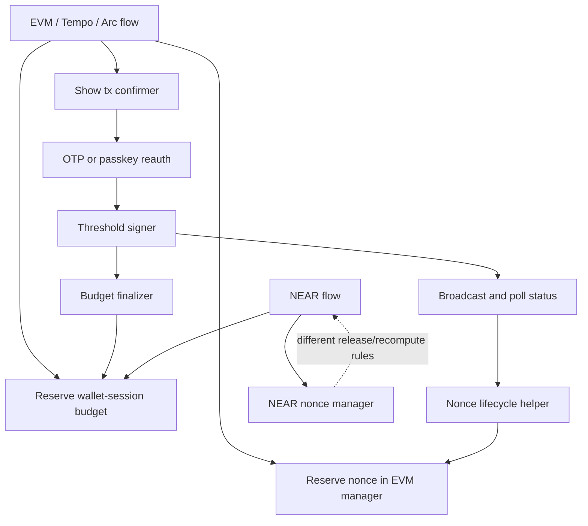
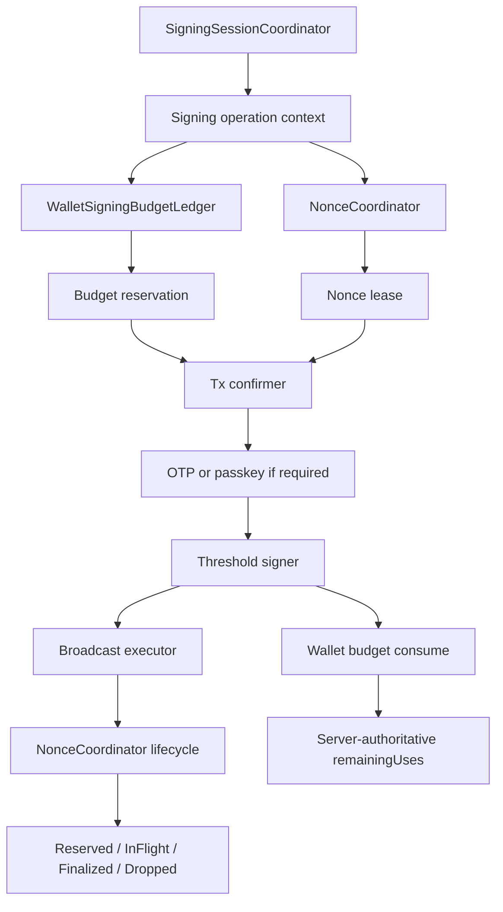
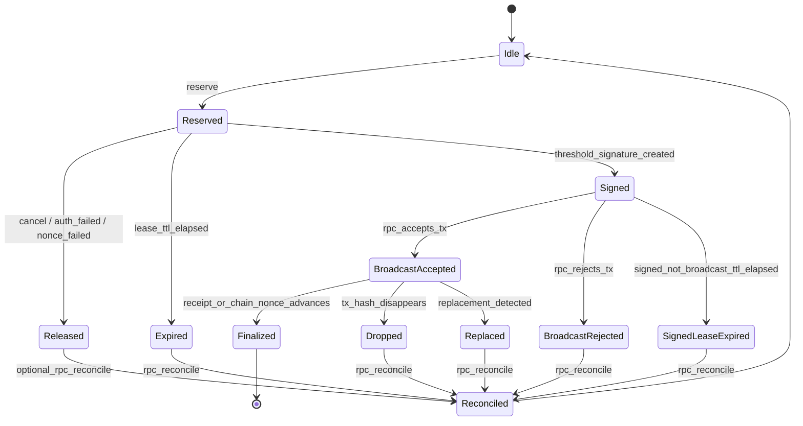
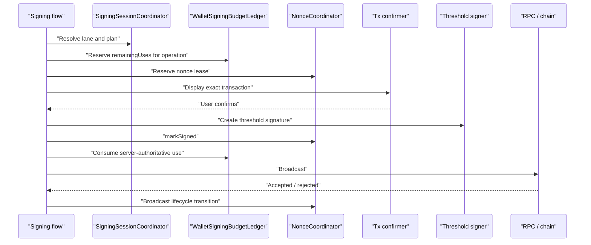

# Nonce Coordinator Plan

Date created: 2026-04-26

## Objective

Move nonce ownership out of chain-specific helper code and into one
`NonceCoordinator` state machine.

The coordinator should make nonce behavior explicit, auditable, and consistent
across NEAR, Tempo, Arc EVM, and generic EVM signing. It should also compose
cleanly with the signing-session budget model so session exhaustion, concurrent
signing, cancellation, and broadcast failures do not create split-brain state.

## Current Problem

Nonce state is currently distributed across several places:

1. EVM-family signing reserves managed nonces in the EVM nonce manager.
2. EVM-family broadcast/finalization code reports lifecycle events later through
   nonce lifecycle helpers.
3. NEAR has its own reservation model and separate release/fetch behavior.
4. Signing-session budget reservations live in `WalletSigningBudgetLedger`.
5. Tx confirmation, OTP/passkey reauth, threshold signing, broadcast, and status
   polling are driven by flow-specific orchestration.

That split means every flow has to remember the same cleanup rules. When any path
misses a release, reconciliation, or budget update, the UI can show a valid
signing session while the nonce lane is stuck, or the nonce lane can skip ahead
while the chain still expects an earlier nonce.



The failure mode is not that any one helper is inherently wrong. The failure
mode is that nonce state, auth state, signing-session budget state, and broadcast
state are coupled by convention instead of by a single operation state machine.

## Target Design

Introduce a `NonceCoordinator` that owns nonce lanes and nonce leases.

The coordinator is not an auth system and does not consume signing-session
budget. It owns only nonce allocation and nonce lifecycle. Signing-session budget
remains owned by the wallet signing-session coordinator and the server
authoritative budget consume path.



The key change is that a transaction signing operation gets two explicit local
resources:

1. a wallet signing-session budget reservation;
2. a nonce lease.

Those resources are siblings under the same `operationId`. Neither resource is
allowed to infer or synthesize the other.

## Core Invariants

1. Every signed transaction has exactly one nonce lease.
2. A nonce lease is bound to one `operationId`, one operation fingerprint, one
   account, one chain lane, and one nonce value.
3. A nonce lease must expire or be explicitly released before signature
   creation if the operation is cancelled or auth fails.
4. After a threshold signature is produced, wallet signing-session budget is
   spent even if broadcast or finality later fails. The signature exists.
5. Broadcast rejection, dropped transactions, and replacement affect nonce state,
   not whether a signature consumed wallet-session budget.
6. Missing or malformed managed nonce metadata is an invariant violation for
   managed EVM-family signing. It must fail closed.
7. All mutations for one nonce lane run through one serialized state-machine
   transition path.
8. Chain/RPC state remains authoritative for confirmed nonce progress. Local
   coordinator state is only a lease and reconciliation layer.
9. Cross-tab and cross-device wallet budget atomicity belongs server-side.
   Cross-tab nonce coordination should use same-origin browser coordination, but
   it is still subordinate to chain/RPC reconciliation.

## Lane Identity

Nonce lanes should be explicit and chain-specific without duplicating lifecycle
logic.

```ts
type NonceLane =
  | {
      family: 'evm';
      chain: 'evm' | 'tempo';
      networkKey: string;
      chainId: number;
      sender: `0x${string}`;
      nonceKey?: bigint;
      accountId?: string;
    }
  | {
      family: 'near';
      networkKey: string;
      accountId: string;
      publicKey: string;
    };
```

For EVM-family lanes, `nonceKey` remains available for account-abstraction or
chain-specific nonce domains. For NEAR lanes, the lane is the account/public-key
pair because NEAR nonces are access-key scoped.

## Operation Identity

The coordinator should share operation identity with signing-session budget
accounting.

```ts
type NonceOperationContext = {
  operationId: SigningOperationId;
  operationFingerprint: string;
  accountId: string;
  walletSigningSessionId?: string;
  chainFamily: 'near' | 'evm' | 'tempo';
};
```

`operationFingerprint` must bind enough transaction identity to reject accidental
reuse of the same caller operation id for a different transaction. It should not
include plaintext secrets.

## State Machine



Required semantics:

1. `Reserved` means the transaction has not produced a signature yet. It is safe
   to release this lease without spending wallet-session budget.
2. `Signed` means a threshold signature exists. Budget must be consumed exactly
   once for the operation. The nonce should remain protected briefly for
   broadcast retry, then reconcile if no broadcast succeeds.
3. `BroadcastAccepted` means the RPC accepted or returned a tx hash. The
   coordinator treats the nonce as in flight until finalized, dropped, replaced,
   or reconciled.
4. `Dropped` means the local tx hash is no longer a reliable pending/finalized
   candidate. The coordinator must reconcile before issuing another nonce for the
   lane when the dropped nonce could create a gap.
5. `Replaced` means the nonce was used by another tx. The lane must reconcile
   before choosing the next nonce.

## Public API Sketch

```ts
type NonceLease = {
  leaseId: string;
  lane: NonceLane;
  operationId: SigningOperationId;
  operationFingerprint: string;
  nonce: bigint | string;
  nonces: readonly (bigint | string)[];
  reservedAtMs: number;
  expiresAtMs: number;
};

type NonceCoordinator = {
  reserve(input: {
    lane: NonceLane;
    operation: NonceOperationContext;
    count?: number;
  }): Promise<NonceLease>;

  markSigned(input: {
    leaseId: string;
    operationId: SigningOperationId;
    signedTxHash?: string;
  }): Promise<void>;

  markBroadcastAccepted(input: {
    leaseId: string;
    operationId: SigningOperationId;
    txHash?: string;
  }): Promise<void>;

  markBroadcastRejected(input: {
    leaseId: string;
    operationId: SigningOperationId;
    error: unknown;
  }): Promise<void>;

  markFinalized(input: {
    leaseId: string;
    operationId: SigningOperationId;
    txHash?: string;
  }): Promise<void>;

  markDroppedOrReplaced(input: {
    leaseId: string;
    operationId: SigningOperationId;
    reason: 'dropped' | 'replaced';
    txHash?: string;
  }): Promise<void>;

  release(input: {
    leaseId: string;
    operationId: SigningOperationId;
    reason: 'cancelled' | 'auth_failed' | 'signing_failed' | 'nonce_failed';
  }): Promise<void>;

  reconcile(input: { lane: NonceLane }): Promise<NonceLaneStatus>;
};
```

The implementation can initially be in-runtime memory plus browser coordination.
The API should still be written as if the coordinator is the only writer for a
nonce lane.

## Signing Session Integration

`NonceCoordinator` and signing-session budget accounting should meet at the
transaction operation boundary.

Recommended operation order for a warm session:



Recommended operation order for an exhausted session:

1. Planner sees no available local budget after subtracting in-flight
   reservations.
2. Tx confirmer owns the flow and shows the registered reauth method.
3. Email OTP or passkey reauth mints or refreshes exactly the requested
   `remainingUses` for this operation.
4. The flow reserves the new wallet-session budget and nonce lease under the
   same `operationId`.
5. The signer produces one signature.
6. Budget is consumed once and nonce lifecycle proceeds independently.

For EVM-family transactions, the nonce may need to be known before the exact
transaction digest is confirmed. That is allowed only as a short-lived nonce
lease. If the user cancels, OTP fails, passkey fails, or threshold reconnect
fails before signature creation, the nonce lease is released and the budget
reservation is released or recorded as zero-spend.

### Concurrent Remaining Uses

If `remainingUses = 2` and two transactions are already in flight, the third
transaction must plan as exhausted even before the first two finalize.

That behavior comes from budget reservations, not from nonce state:

1. Operation A reserves one wallet-session use.
2. Operation B reserves one wallet-session use.
3. `WalletSigningBudgetLedger.getAvailableStatus` returns zero local available
   uses for the shared `walletSigningSessionId`.
4. Operation C routes through OTP/passkey reauth.
5. If A or B is cancelled before signature creation, its reservation is released
   and future operations can use that budget again.

The `NonceCoordinator` should expose enough trace context to correlate nonce
leases with those budget reservations, but it must not decrement or refill
`remainingUses` itself.

### Budget And Nonce Failure Matrix

| Phase | Signature exists? | Budget action | Nonce action |
| --- | --- | --- | --- |
| User cancels confirmation | No | Release or zero-spend | Release lease |
| OTP/passkey fails | No | Release or zero-spend | Release lease |
| Nonce reservation fails | No | Release or zero-spend | No lease |
| Threshold reconnect fails | No | Release or zero-spend | Release lease |
| Threshold signing fails before signature | No | Release or zero-spend | Release lease |
| Signature succeeds, broadcast not attempted | Yes | Consume once | Mark signed, retry or expire and reconcile |
| Broadcast rejected | Yes | Consume once | Mark rejected and reconcile |
| Broadcast accepted | Yes | Consume once | Mark in flight |
| Tx finalized | Yes | Already consumed | Mark finalized |
| Tx dropped or replaced | Yes | Already consumed | Mark dropped/replaced and reconcile |

## Phased TODO

### Phase 0. Freeze Invariants And Regression Tests

1. [x] Add tests for the five known nonce review findings:
   reserved EVM nonce expiry, locked rejection cleanup, fail-closed chain
   parsing, mandatory managed nonce metadata, and NEAR reservation recompute.
   - [x] EVM reserved nonce expiry is covered in
     `tests/unit/evmNonceManager.unit.test.ts`.
   - [x] EVM rejection cleanup is async and runs through the lane lock.
   - [x] Managed nonce chain parsing fails closed for non-`evm`/`tempo`
     snapshots.
   - [x] Missing managed nonce metadata fails closed in EVM-family lifecycle
     tests.
   - [x] NEAR release recomputes highest reserved nonce in
     `tests/unit/nonceManager.test.ts`.
2. [ ] Add tests that signing-session budget reservations and nonce leases are
   both released on cancellation before signature creation.
3. [ ] Add tests that a signature-created-but-broadcast-failed operation consumes
   budget exactly once and reconciles nonce state.
4. [ ] Add tests that two in-flight wallet-session reservations exhaust local
   availability for the third transaction.
5. [ ] Add trace assertions that every transaction operation emits one
   `operationId`, one budget reservation, and one nonce lease id.

### Phase 1. Define Coordinator Types And State Machine

1. [x] Add `NonceLane`, `NonceOperationContext`, `NonceLease`, and
   `NonceCoordinator` types.
2. [x] Implement a pure transition reducer for nonce lease states.
3. [x] Make illegal transitions fail closed with typed errors.
4. [x] Bind every transition to `operationId` and operation fingerprint.
5. [x] Add redacted trace events for reserve, release, signed, accepted,
   rejected, finalized, dropped, replaced, expired, and reconciled.
   - [x] Added trace events for reserve, release, signed, accepted, rejected,
     finalized, dropped, replaced, and lane reconciliation.
   - [x] Add explicit lease expiry transitions and trace events.

### Phase 2. Implement EVM-Family Coordinator Backend

Progress:

1. [x] Route EVM-family nonce reservation and lifecycle calls through
   `NonceCoordinator`.
2. [x] Keep the current EVM nonce manager as the coordinator backend while the
   transaction-facing boundary migrates.
3. [x] Carry nonce lease metadata through managed nonce snapshots.
4. [x] Fail closed when managed signing results are missing nonce lease metadata.

Remaining TODO:

1. [ ] Move current EVM nonce lane state fully into the coordinator backend.
2. [x] Keep one serialized lock per EVM-family nonce lane.
3. [x] Store reserved nonces with `reservedAtMs` and `expiresAtMs`.
4. [x] Validate managed nonce snapshots strictly; accept only `evm` and
   `tempo`.
5. [x] Treat missing managed nonce metadata as an invariant failure in managed
   signing results.
6. [x] Reconcile on dropped, replaced, stale in-flight, and rejected nonce
   errors.
7. [x] Remove direct lifecycle mutation calls from EVM/Tempo/Arc flows once they
   route through the coordinator.

### Phase 3. Integrate NEAR Access-Key Nonces

Progress:

1. [x] Model NEAR account/public-key as a nonce lane.
2. [x] Support multi-nonce leases for NEAR batches.
3. [x] Wire TouchConfirm NEAR reservation/cancel cleanup through
   `NonceCoordinator`.
4. [x] Recompute the highest reserved NEAR nonce after every release in the
   existing NEAR nonce manager backend.
5. [x] Carry TouchConfirm NEAR nonce lease handles into the signing worker and
   mark the lease signed after threshold signature creation.

Remaining TODO:

1. [ ] Refresh block hash, block height, and access-key nonce through the same
   lane lock.
2. [ ] Route NEAR signing cleanup through coordinator release/finalize
   transitions.

### Phase 4. Wire Transaction Signing Through One Boundary

1. [x] Make EVM-family and TouchConfirm NEAR transaction flows request nonce
   leases through the `NonceCoordinator` instead of chain-specific helpers.
2. [ ] Make all remaining `SigningSessionCoordinator` paths request nonce
   leases through the
   `NonceCoordinator` instead of chain-specific helpers.
3. [ ] Use the same `SigningOperationContext` for budget reservation and nonce
   lease creation.
4. [ ] Reserve wallet-session budget before threshold signing and release it on
   every no-signature outcome.
5. [x] Mark nonce leases signed immediately after threshold signature creation.
   - [x] NEAR transaction signing marks the TouchConfirm lease signed after the
     threshold signer returns.
   - [x] EVM-family signing records the same explicit signed transition instead
     of jumping directly from reserved to broadcast lifecycle events.
6. [ ] Ensure post-sign finalization consumes wallet-session budget before
   broadcast status polling can hide errors.
7. [ ] Make retry paths reuse the same operation id only when the operation
   fingerprint matches.

### Phase 5. Browser Runtime Coordination

1. [ ] Use a same-origin coordination primitive for multi-tab nonce lanes
   (`navigator.locks`, SharedWorker, or IndexedDB lease records).
2. [ ] Persist only redacted lease metadata required for recovery and
   reconciliation. Do not persist signed transaction bytes unless a deliberate
   retry queue is added.
3. [x] Expire abandoned reserved leases after a short TTL.
4. [ ] Expire signed-but-not-broadcast leases after a separate short TTL and
   force lane reconciliation.
5. [ ] Clear all lane leases for an account on wallet lock, account switch, or
   signer reset.

### Phase 6. Remove Old Nonce Paths

1. [ ] Delete direct calls to EVM and NEAR nonce managers from transaction
   signing flows.
2. [ ] Keep chain-specific RPC fetchers as coordinator ports, not independent
   nonce owners.
3. [ ] Remove duplicate lifecycle helpers once coordinator transitions cover
   accepted, rejected, finalized, dropped, and replaced outcomes.
4. [ ] Add static guards that transaction signing code cannot bypass
   `NonceCoordinator` for managed nonce lanes.
5. [ ] Update tests and docs to use "nonce coordinator" terminology.

### Phase 7. Observability And Runbooks

1. [ ] Add redacted metrics for lease age, stale in-flight lanes, dropped txs,
   replacement detection, reconcile results, and release reasons.
2. [ ] Add a developer diagnostic view that shows nonce lane state beside wallet
   signing-session budget state.
3. [ ] Document recovery steps for a stuck nonce lane:
   reconcile lane, clear expired reserved leases, and retry signing.
4. [ ] Add alerts for repeated dropped/replaced outcomes by chain and sender.

## Acceptance Checks

1. A cancelled transaction cannot leak a nonce reservation indefinitely.
2. A malformed managed nonce snapshot cannot clean up the wrong chain lane.
3. NEAR, Tempo, Arc EVM, and generic EVM all use one nonce lifecycle model.
4. Two concurrent transactions with two remaining wallet-session uses make the
   third transaction require fresh auth.
5. A transaction that produced a threshold signature consumes budget exactly once
   regardless of broadcast/finality result.
6. A transaction that did not produce a threshold signature never consumes
   wallet-session budget.
7. Stuck "Checking transaction status" states have a traceable nonce-lane reason
   and an explicit reconcile path.
8. Old nonce-manager ownership paths are removed instead of kept as parallel
   legacy systems.

## Related Docs

1. [Signing Session Architecture](./signing-session-architecture.md)
2. [Signing Session Coordinator Tests](./signing-session-coordinator-tests.md)
3. [Email OTP Signing Sessions](./email-otp-sessions.md)
