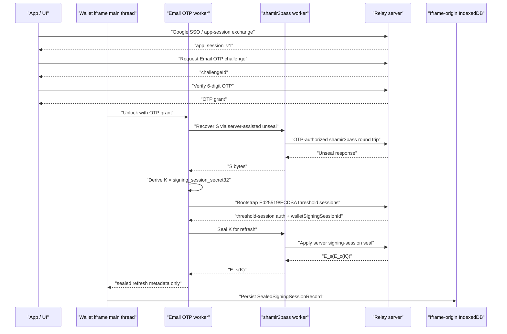
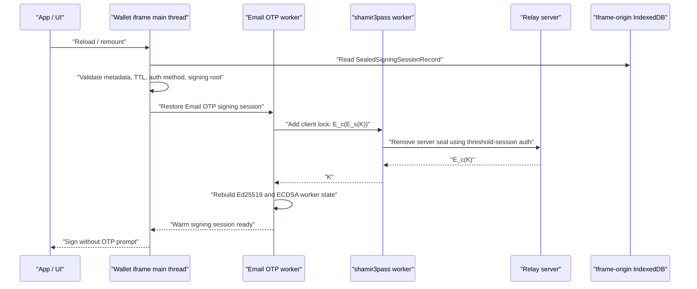

# Email OTP Sealed Refresh Persistence

Last updated: 2026-04-21

## Goal

Implement a sealed-refresh path for Email OTP accounts so a same-browser accidental page refresh can restore the active wallet signing session without requiring a new Google SSO, Email OTP, or passkey prompt.

This plan generalizes the existing passkey sealed-refresh system so session persistence is auth-method neutral:

1. passkey accounts restore from a sealed passkey-derived signing-session secret
2. Email OTP accounts restore from a sealed Email OTP-derived signing-session secret
3. both auth methods rehydrate the same `walletSigningSessionId` budget semantics
4. Ed25519 and ECDSA remain separate threshold capabilities, but share one wallet-level TTL and `remainingUses` budget
5. private-key export and link-device/add-signer flows still require fresh operation-scoped auth and must not reuse or clobber the transaction signing session

## Resolved Design Decisions

These decisions close the main ambiguity before implementation starts.

1. `K = signing_session_secret32` is session-scoped, not account-scoped.
2. The persisted artifact is `E_session_s(K)`, not `E_session_s(S)` and not `E_enrollment_s(S)`.
3. Ed25519 restore derives an Ed25519 restore seed from `K` and reconnects the recorded Ed25519 threshold session; the worker owns the seed and resulting signing handle.
4. Restore should default to all curves recorded in the sealed record, with room to lazy-restore optional curves later only after the all-curves path is stable.
5. Iframe-origin IndexedDB store name is `signing_session_seals_v1`.
6. IndexedDB primary key is `walletSigningSessionId`.
7. The sealed record stores threshold session ids only. It must not store raw threshold-session JWTs or ambiguous JWT refs.
8. Server routes derive authoritative binding metadata from threshold-session server state and treat client-supplied metadata only as assertions.
9. The route names are:
   - `POST /threshold/signing-session-seal/apply-server-seal`
   - `POST /threshold/signing-session-seal/remove-server-seal`
10. The env/config names are:
    - `SIGNING_SESSION_SEAL_KEY_VERSION`
    - `SIGNING_SESSION_SHAMIR_P_B64U`
    - `SIGNING_SESSION_SEAL_E_S_B64U`
    - `SIGNING_SESSION_SEAL_D_S_B64U`
    - `VITE_SIGNING_SESSION_PERSISTENCE_MODE`
    - `VITE_SIGNING_SESSION_SEAL_KEY_VERSION`
    - `VITE_SIGNING_SESSION_SHAMIR_P_B64U`
11. Rate-limit defaults are:
    - apply: 5 per threshold session per 5 minutes
    - remove: 10 per threshold session per 5 minutes
    - per-user combined apply/remove cap: 30 per 5 minutes
12. IndexedDB persistence is still an accidental-refresh feature, not browser-restart persistence. A `runtimeSessionId` in `sessionStorage` binds the IndexedDB record to the current browser session.
13. Multi-tab behavior uses a storage lease around restore. Multiple tabs may eventually restore while server budget remains valid, but only one restore attempt per wallet signing session should run at a time.
14. Logout, lock, account switch, revocation, TTL expiry, and use exhaustion must delete the IndexedDB store records, not just `sessionStorage`.
15. Migration order is generic passkey first, PRF cleanup second, Email OTP enablement third. Do not build Email OTP persistence on names we already plan to delete.
16. Email OTP and signing-session persistence must fail closed instead of using backfills, fallbacks, compatibility aliases, or alternate secret/auth routes.

## Current Passkey Sealed-Refresh Note

The existing passkey implementation already uses `shamir3pass` to persist enough client signing material to survive a same-tab page refresh.

Current flow:

1. passkey auth yields `PRF.first` in the passkey confirmation worker
2. the worker keeps `PRF.first` in memory under a threshold session id
3. when `signingSessionPersistenceMode = sealed_refresh_v1`, `TouchConfirmManager` asks the worker to seal that warm-session material
4. the worker creates an ephemeral `shamir3pass` client lock over `PRF.first`
5. the server applies its signing-session seal through `/threshold/signing-session-seal/apply-server-seal`
6. the worker removes its client lock and returns `E_session_s(PRF.first)`
7. the main thread stores a `signingSessionSealedStore` record in wallet-origin IndexedDB
8. after a page refresh, `TouchConfirmManager` sees the worker warm session is missing, reads the sealed record, and asks the worker to rehydrate
9. the worker adds a fresh client lock to `E_session_s(PRF.first)`, calls `/threshold/signing-session-seal/remove-server-seal`, removes the client lock, and restores `PRF.first` into memory
10. threshold signing can continue without a new WebAuthn prompt while the threshold-session TTL and `remainingUses` budget remain valid

Important current boundaries:

1. this path exists for passkey-based accounts only
2. it seals the passkey secret source `PRF.first`, not an auth-method-neutral `signing_session_secret32`
3. the sealed-refresh file, record field, route, and env/config names have been migrated to signing-session names without compatibility aliases
4. it stores the sealed record in iframe-origin IndexedDB, bound to the current browser session by a `sessionStorage` `runtimeSessionId`
5. it relies on threshold-session auth and server policy to remove the server seal
6. it does not persist plaintext `PRF.first`

The Email OTP work should reuse the same `shamir3pass` commutative-lock shape, but the persisted secret should be the canonical `signing_session_secret32` derived from Email OTP secret `S`, not the long-lived enrollment escrow and not a raw client signing share.

## Feasibility Judgment

The proposed flow is coherent and feasible if we tighten the persistence boundary.

Cleaner model:

```text
enrollment escrow:
  server stores E_enrollment_s(S)
  client does not store it

Email OTP unlock:
  1. User authenticates with Google SSO.
  2. User verifies 6-digit Email OTP.
  3. Server authorizes one unseal of the enrollment escrow.
  4. Email OTP worker performs shamir3pass unseal.
  5. Worker recovers S in memory.
  6. Worker derives signing_session_secret32 from S.
  7. Worker bootstraps Ed25519/ECDSA signing sessions.
  8. Worker creates a separate session-refresh artifact:
     E_session_s(signing_session_secret32)
  9. Client stores only E_session_s(signing_session_secret32) in iframe-origin IndexedDB.
```

The client must not request and persist `E_enrollment_s(S)` as the refresh artifact. The enrollment escrow is involved only during the real OTP unlock ceremony. After that, the refresh artifact is derived from the already-unlocked session secret and sealed under a separate signing-session seal namespace.

The reload path is:

```text
1. Client reads E_session_s(signing_session_secret32) from IndexedDB.
2. Worker computes E_c(E_session_s(signing_session_secret32)).
3. Server removes the session seal:
   D_session_s(E_c(E_session_s(K))) = E_c(K)
4. Worker removes client lock:
   D_c(E_c(K)) = K
5. Worker rebuilds signing material from K.
```

Where `K = signing_session_secret32`.

This keeps the server enrollment escrow out of browser storage and keeps sealed refresh scoped to the active signing session only.

Recommended tightened model:

```text
enrollment escrow, server-owned only:
  E_enrollment_s(S)

session refresh artifact, client persisted:
  E_session_s(signing_session_secret32)
```

The implementation target is to persist a sealed `signing_session_secret32`, not a sealed raw `S`. That keeps passkey and Email OTP on the same downstream interface and avoids storing an artifact that directly unwraps the root Email OTP secret.

## Security Position

This feature improves UX and is reasonable for `email_otp_auth_policy = session`, but it weakens the current memory-only Email OTP posture.

Security rules:

1. do not persist plaintext `S`
2. do not persist plaintext `signing_session_secret32`
3. do not mirror the long-lived server enrollment escrow `E_enrollment_s(S)` into browser storage
4. persist only a session-scoped sealed refresh artifact
5. require live server participation to remove the server seal
6. require a valid threshold-session authority for sealed refresh removal
7. bind the artifact to `walletSigningSessionId`, wallet id, user id, signing root, auth method, TTL, remaining uses, and seal key version
8. delete the artifact on logout, lock, account switch, revocation, TTL expiry, remaining-use exhaustion, or threshold-session invalidation
9. never use sealed refresh for `per_operation`
10. never use sealed refresh for export private key, link-device, or add-signer operation auth

Threat-model impact:

1. stolen IndexedDB alone must not recover `S` or signing material
2. stolen IndexedDB plus a still-valid threshold session may restore the active signing session until TTL or use limits expire
3. XSS or malicious browser extensions can still attack an active session, so TTL and remaining-use limits must stay tight
4. server compromise remains in the Email OTP custody path because the server controls the seal key and enrollment escrow
5. passkey remains the recommended stronger default because it does not escrow the passkey PRF output through Email OTP infrastructure

## Storage Decision

Use iframe-origin IndexedDB for the Email OTP sealed refresh record.

Rationale:

1. the wallet iframe origin already owns wallet-local durable metadata
2. app-origin storage must not receive secret-bearing refresh artifacts
3. IndexedDB is more robust than `sessionStorage` across iframe reload and app remount behavior
4. the record is still logically session-scoped, even if IndexedDB is durable
5. server-enforced TTL, remaining uses, and revocation are mandatory because IndexedDB may outlive the page runtime

Required storage cleanup:

1. delete on explicit wallet lock
2. delete on logout
3. delete on account switch
4. delete on server revocation
5. delete on TTL expiry
6. delete on remaining-use exhaustion
7. delete on schema mismatch
8. delete on auth-method mismatch
9. delete on signing-root mismatch
10. delete on failed unseal

## Target Record

Replace the passkey-specific sealed refresh record with an auth-method-neutral record.

```ts
type SealedSigningSessionRecord = {
  v: 1;
  alg: 'shamir3pass-v1';
  storageScope: 'iframe_origin_indexeddb';
  runtimeSessionId: string;
  authMethod: 'passkey' | 'email_otp';
  secretKind: 'signing_session_secret32';
  walletId: string;
  userId: string;
  signingRootId: string;
  signingRootVersion?: string;
  walletSigningSessionId: string;
  thresholdSessionIds: {
    ed25519?: string;
    ecdsa?: string;
  };
  sealedSecretB64u: string;
  sealKeyVersion: string;
  shamirPrimeB64u: string;
  issuedAtMs: number;
  expiresAtMs: number;
  remainingUses: number;
  updatedAtMs: number;
};
```

IndexedDB keying:

1. database: existing wallet iframe client database, or `tatchi_wallet_v1` if a new database is required
2. object store: `signing_session_seals_v1`
3. primary key: `walletSigningSessionId`
4. indexes: `walletId`, `userId`, `authMethod`, `signingRootId`, `expiresAtMs`
5. uniqueness rule: keep at most one active record per `(walletId, signingRootId, authMethod)`
6. write rule: writing a new active record for the same `(walletId, signingRootId, authMethod)` deletes older records first
7. restart rule: if `runtimeSessionId` is missing from `sessionStorage` or does not match, delete the IndexedDB record before attempting restore

Threshold session auth:

1. the sealed record stores threshold session ids only
2. raw threshold-session JWTs remain in the canonical threshold-session stores
3. restore resolves threshold-session auth through `WarmSessionManager`
4. if canonical threshold-session auth is missing, expired, revoked, or mismatched, restore fails closed
5. do not add `thresholdSessionJwtRefs` unless a concrete ref mechanism exists; the current target is no refs

App-session auth for fresh-auth operations:

1. export/link-device/add-signer still require fresh operation-scoped auth after reload
2. Email OTP export challenge issuance after sealed refresh uses restored signing-session authority, not a JS-readable persisted `app_session_v1` JWT
3. app-session JWTs may be kept in memory during the active page lifetime, but are not written to `sessionStorage` or IndexedDB as a reload continuity primitive
4. restored signing-session authority can only request a fresh OTP challenge; it cannot directly authorize export/link-device/add-signer
5. app-session JWTs must never be substituted for threshold-session JWTs, or vice versa

Fresh-auth challenge target:

The target is to stop treating a JS-readable `app_session_v1` JWT as the reload continuity primitive for sensitive-operation challenge issuance.

For Email OTP accounts, a restored signing session may authorize only the request to send a fresh sensitive-operation OTP challenge to the server-known verified email. The restored signing session must not authorize the sensitive operation itself.

Target flow:

```text
1. Reload restores K from the sealed signing-session refresh artifact.
2. Worker restores threshold signing state.
3. Client requests an export/link-device/add-signer OTP challenge using restored signing-session authority.
4. Server validates the restored signing-session lane and sends OTP to the account email from server-side state.
5. User verifies the fresh OTP.
6. OTP verification creates a short-lived operation-scoped authorization.
7. The sensitive operation executes with that operation authorization.
```

This avoids storing app-session JWTs in browser storage and fits "bring your own auth" integrations where the customer may not want relay-owned HttpOnly cookies.

Security boundary:

1. restored signing-session authority may initiate a fresh Email OTP challenge only
2. restored signing-session authority must never directly authorize key export, link-device, add-signer, or other sensitive operations
3. the OTP destination must be derived from server-side account state, never from client input
4. OTP challenge issuance through this lane must be separately rate-limited and audited
5. OTP verification must mint a narrow single-purpose operation grant, not a general app session and not a renewed transaction signing session
6. passkey accounts continue to use WebAuthn/passkey fresh auth for sensitive operations and must not use Email OTP challenge issuance

## Server-Owned Email OTP Enrollment Identity

The session-persistence work exposed a pre-existing bad invariant: an active Email OTP enrollment can currently exist without a server-owned verified email. That was tolerable while sensitive-operation export flows could lean on app-session email, but signing-session-authorized challenge issuance needs a canonical enrollment email that is independent of app-session continuity.

Target invariant:

```text
active Email OTP enrollment => server-owned verified email exists
```

The Email OTP enrollment record should be the canonical source of the mailbox used for login, export, link-device, and add-signer OTP challenges. Login OTP verification must not repair enrollment identity as a normal side effect. A successful login OTP proves control of the challenge mailbox for that login ceremony; it must not silently mutate the long-lived enrollment binding.

Target enrollment shape:

```ts
type EmailOtpEnrollment = {
  walletId: string;
  authSubjectId: string;
  verifiedEmailNormalized: string;
  verifiedEmailHash: string;
  emailVerifiedAtMs: number;
  enrollmentVersion: number;
  enrollmentStatus: 'active';
  enrollmentEscrowRefs: unknown;
  thresholdVerifierRefs: unknown;
  createdAtMs: number;
  updatedAtMs: number;
};
```

Rules:

1. active Email OTP enrollment creation must require a server-verified email
2. Email OTP challenge routes must resolve the destination email from active enrollment state, never from client input
3. app-session email may help select or validate an enrollment during fresh login, but it must not replace the enrolled mailbox
4. signing-session-authorized operation challenges must use the same enrolled mailbox resolution as app-session-authorized login challenges
5. OTP verify routes may mint operation grants or login grants, but must not repair missing enrollment email
6. invalid active enrollments without a verified email must fail closed with a re-enrollment-required error
7. any repair of existing invalid data must be an explicit one-time migration or local data reset, not request-path behavior

No backfills or fallbacks rule:

1. no request path may repair missing Email OTP enrollment identity
2. no Email OTP challenge path may fall back to app-session email, client-provided email, or login challenge email
3. no signing-session seal path may fall back to a default seal key version or generic Redis/Postgres/Upstash environment variables
4. no sealed-refresh path may accept legacy route names, config names, storage names, or secret artifacts
5. invalid, missing, or ambiguous state must return an explicit error and require re-enrollment, reauth, or operator migration outside the request path

Do not use these names in the new steady-state API:

1. `prfSessionSealedStore`
2. `sealedPrfFirstB64u`
3. `prfFirstB64u` for generic session persistence
4. `PRF session seal` for route names

Breaking rename target:

1. `prfSessionSealedStore` -> `signingSessionSealedStore`
2. `sealedPrfFirstB64u` -> `sealedSecretB64u`
3. `prfFirstB64u` at generic boundaries -> `signingSessionSecretB64u` or `secretSourceB64u`
4. `/threshold-ecdsa/prf-seal/*` -> `/threshold/signing-session-seal/*`

Do not keep legacy aliases after migration.

## Canonical Secret Model

Use one downstream secret type:

```ts
type SigningSessionSecretKind = 'signing_session_secret32';
```

Passkey derivation:

```text
PRF.first
  -> HKDF(
       domain = "tatchi/passkey/signing-session-secret/v1",
       fields = [
         wallet_id,
         user_id,
         signing_root_id,
         signing_root_version,
         wallet_signing_session_id,
         auth_method
       ]
     )
  -> signing_session_secret32
```

Email OTP derivation:

```text
S
  -> HKDF(
       domain = "tatchi/email-otp/signing-session-secret/v1",
       fields = [
         wallet_id,
         user_id,
         signing_root_id,
         signing_root_version,
         wallet_signing_session_id,
         auth_method
       ]
     )
  -> signing_session_secret32
```

`walletSigningSessionId` must participate in deriving `K`. This prevents a sealed refresh artifact from becoming a reusable account-level derivative.

Then:

```text
signing_session_secret32
  -> Ed25519 threshold client material
  -> ECDSA threshold client material
```

This keeps passkey and Email OTP behavior parallel while preserving domain separation.

## Restore Material Reconstruction

Reload restore reconstructs worker state from `K = signing_session_secret32`. It must not recover `S`, fetch `E_enrollment_s(S)`, or call Email OTP challenge/verify routes.

Inputs available to the worker during restore:

1. `K`, recovered inside the worker by removing the session seal
2. `SealedSigningSessionRecord` metadata, validated by the main thread before worker restore
3. threshold-session auth and threshold-session records resolved by `WarmSessionManager` from canonical session stores
4. server-side threshold session state, validated again by the signing-session seal route

K-derived restore branches:

These derivations use the canonical `encode_tuple` field encoding from the Email OTP specs.

```text
session_restore_root =
  HKDF-SHA-256(
    ikm=K,
    salt="tatchi/signing-session/restore-root/v1",
    info=encode_tuple([
      auth_method,
      wallet_id,
      user_id,
      signing_root_id,
      signing_root_version,
      wallet_signing_session_id
    ])
  )

ed25519_restore_seed32 =
  HKDF-SHA-256(
    ikm=session_restore_root,
    salt="tatchi/signing-session/threshold-ed25519/v1",
    info=encode_tuple([
      ed25519_threshold_session_id,
      sorted_participant_ids,
      relayer_key_id
    ])
  )

ecdsa_restore_client_root_share32 =
  HKDF-SHA-256(
    ikm=session_restore_root,
    salt="tatchi/signing-session/threshold-ecdsa-client-root/v1",
    info=encode_tuple([
      ecdsa_threshold_session_id,
      ecdsa_threshold_key_id,
      chain,
      derivation_path,
      sorted_participant_ids,
      relayer_key_id
    ])
  )
```

Restore steps:

1. The main thread reads the sealed record and resolves threshold-session auth through `WarmSessionManager`; the sealed record must not contain raw threshold-session JWTs.
2. The Email OTP worker unseals `K` through the signing-session seal remove route.
3. The worker derives `session_restore_root`.
4. For Ed25519, the worker derives `ed25519_restore_seed32`, rehydrates the Ed25519 warm signing material for the recorded Ed25519 threshold session, and marks it ready only if the threshold-session record and server policy still match.
5. For ECDSA, the worker derives `ecdsa_restore_client_root_share32`, reruns the ECDSA HSS reconnect/bootstrap path for the recorded ECDSA threshold session and `walletSigningSessionId`, receives the refreshed worker-held `clientAdditiveShare32` material, stores it behind an opaque Email OTP worker session handle, and zeroizes transient root-share/additive-share buffers after handoff.
6. `WarmSessionManager` marks the wallet signing session ready only after every required curve for the account is ready under the same `walletSigningSessionId`.

Ed25519 restore meaning:

1. `ed25519_restore_seed32` is the Email OTP/passkey-neutral replacement for the current `thresholdEd25519PrfFirstB64u` style input.
2. It is not a NEAR private key and must not be exported or persisted.
3. Ed25519 restore must run the same reconnect/bootstrap validation needed to reattach to the recorded threshold Ed25519 session.
4. The worker should expose an opaque Ed25519 signing handle, not raw seed bytes, after restore.
5. Any compatibility field that still carries Ed25519 secret-derived bytes across the main thread is temporary and must be removed in the same refactor if possible.

Curve restore rule:

1. restore all curves recorded in `thresholdSessionIds` for the initial implementation
2. mark wallet signing session ready only after every recorded curve required by the account capability set is ready
3. lazy per-operation restore may be added later for latency, but only after all-curves restore is covered by tests
4. never restore a curve that is not present in the account signer metadata or threshold-session server state

Rules:

1. `K` never leaves the worker after unseal.
2. `ed25519_restore_seed32`, `ecdsa_restore_client_root_share32`, and ECDSA additive-share bytes never persist to IndexedDB.
3. The main thread may receive only sanitized threshold-session metadata and opaque worker handles.
4. If any required threshold-session record, auth material, signing root, participant set, or server policy check is missing or mismatched, restore fails closed and the sealed record is deleted.
5. Operation-scoped flows such as export and link-device/add-signer must not use this reconstruction path.

## Server Validation Specs

The signing-session seal routes are separate from the Email OTP enrollment escrow routes. They operate only on `E_session_s(signing_session_secret32)` artifacts and must never accept, fetch, or return `E_enrollment_s(S)`.

Both `apply-server-seal` and `remove-server-seal` must validate:

1. the request uses threshold-session auth, not app-session auth
2. the threshold session exists, belongs to the authenticated user, and is not expired, revoked, or exhausted
3. the threshold session is `session` retention, not `per_operation`
4. the threshold session is authorized for the requested wallet id, `walletSigningSessionId`, signing root id/version, auth method, participant set, and curve
5. the requested seal key version belongs to the signing-session seal namespace and is active or explicitly accepted for rotation
6. the ciphertext is valid base64url, in the configured `shamir3pass` field, non-empty, and non-degenerate
7. idempotency keys, if supplied or derived, are scoped by operation, user id, threshold session id, seal key version, and ciphertext hash
8. rate limits pass for the operation, user id, and threshold session id

Client request metadata:

1. requests may include `walletSigningSessionId`, `walletId`, `authMethod`, `signingRootId`, `signingRootVersion`, `thresholdSessionId`, `secretKind`, `sealKeyVersion`, and ciphertext
2. the server must derive authoritative values from threshold-session state wherever possible
3. client-supplied metadata is an assertion and must match server state
4. mismatches fail closed before seal application or removal
5. server state wins over IndexedDB record contents

Additional route rules:

1. `apply-server-seal` is allowed only after successful OTP unlock and threshold-session bootstrap; it must not create or extend a threshold session.
2. `remove-server-seal` is allowed only for an existing signing-session sealed-refresh artifact; it must not consume or replace Email OTP enrollment escrow.
3. neither route may return plaintext `K`, plaintext `S`, threshold-session JWTs, raw enrollment escrow, or raw server seal key material
4. responses may include sanitized policy metadata such as `expiresAtMs`, `remainingUses`, and `sealKeyVersion`
5. audit logs must include operation, user id, threshold session id, wallet signing session id when known, key version, result code, and duration; they must not log OTP codes, plaintext secrets, raw ciphertexts, JWTs, or enrollment escrow blobs

## Budget Decision

Sealed refresh apply/remove is transaction-use neutral and separately rate-limited.

Rules:

1. transaction signing consumes the shared wallet-level `remainingUses` budget
2. sealed refresh apply/remove does not decrement transaction signing `remainingUses`
3. sealed refresh apply/remove must enforce separate per-user, per-threshold-session, and per-operation rate limits
4. sealed refresh apply/remove must be idempotent for duplicate retries with the same operation, session, key version, and ciphertext hash
5. sealed refresh apply/remove must never extend server-side TTL or increase transaction signing `remainingUses`
6. restore must fail closed if the underlying threshold session is expired, revoked, exhausted, missing, or no longer bound to the sealed record metadata

Concrete rate-limit defaults:

1. `apply-server-seal`: 5 requests per threshold session per 5 minutes
2. `remove-server-seal`: 10 requests per threshold session per 5 minutes
3. combined per-user apply/remove cap: 30 requests per 5 minutes
4. combined per-wallet apply/remove cap: 30 requests per 5 minutes
5. malformed ciphertext failures count against the limit
6. authorization failures count against the limit
7. retryable network failures that do not reach the server do not count
8. duplicate idempotent retries with the same idempotency key and ciphertext hash should not multiply side effects, but may still count toward abuse limits after a small retry allowance

## Browser Restart And Multi-Tab Semantics

IndexedDB durability must not silently turn sealed refresh into long-lived persistence.

Browser-session marker:

1. generate `runtimeSessionId` when the wallet iframe starts and no marker exists
2. store `runtimeSessionId` in wallet iframe `sessionStorage`
3. copy `runtimeSessionId` into each `SealedSigningSessionRecord`
4. on startup, if `sessionStorage.runtimeSessionId` is missing, delete all `signing_session_seals_v1` records before restore
5. on startup, if a record `runtimeSessionId` does not match the current marker, delete that record before restore

This preserves refresh/remount robustness while avoiding a product promise that Email OTP sessions survive browser restart.

Multi-tab restore:

1. use an IndexedDB lease record keyed by `walletSigningSessionId`
2. lease fields: `ownerId`, `startedAtMs`, `expiresAtMs`, and `attemptId`
3. only the lease holder may run restore for that wallet signing session
4. expired leases may be stolen after a short timeout
5. successful restore updates the sealed record policy metadata and releases the lease
6. failed restore deletes the sealed record only if the failure is terminal; transient network failures release the lease and allow retry
7. transaction signing still consumes the shared server-side budget, so multiple tabs cannot extend uses by racing

## Cleanup Propagation

Because sealed records move to IndexedDB, every existing cleanup path must be updated.

Delete `signing_session_seals_v1` records on:

1. explicit wallet lock
2. logout
3. account switch
4. active signer switch
5. auth method switch
6. server revocation event
7. threshold-session expiry
8. threshold-session exhaustion
9. threshold-session `not_found`
10. signing-root mismatch
11. seal key version rejection
12. failed unseal with terminal error
13. user clears wallet state

Do not rely on `sessionStorage.clear()` or old PRF-store cleanup paths after this migration.

## Protocol

Notation:

1. `S`: Email OTP secret recovered through OTP-authorized `shamir3pass`
2. `K`: canonical `signing_session_secret32`
3. `E_s(x)`: server commutative seal for signing-session refresh
4. `E_c(x)`: worker-ephemeral client commutative lock
5. `D_s(x)`: server removes its seal
6. `D_c(x)`: worker removes its lock

### Initial Email OTP Unlock



### Same-Browser Reload Restore



## Auth Rules

Keep app-session and threshold-session lanes separate.

Use app-session auth for:

1. Google SSO exchange
2. Email OTP challenge issuance
3. Email OTP verification
4. initial OTP-authorized unseal
5. sensitive-operation OTP challenges for export and link-device/add-signer

Use threshold-session auth for:

1. signing-session sealed refresh apply-server-seal
2. signing-session sealed refresh remove-server-seal
3. threshold Ed25519 signing
4. threshold ECDSA signing
5. threshold HSS continuation after bootstrap

Do not use app-session auth to restore a threshold signing session from a sealed refresh artifact. App-session auth answers "is the user logged in"; threshold-session auth answers "is this signing capability still valid."

### Threshold-Session JWT Identity

Threshold-session JWTs must carry an explicit `walletId` claim:

```ts
{
  kind: 'threshold_ecdsa_session_v1',
  sub: walletId,
  walletId,
  sessionId,
  walletSigningSessionId,
  relayerKeyId,
  rpId,
  thresholdExpiresAtMs,
  participantIds,
}
```

`sub` remains only as the standard JWT subject alias. Parsers must require `walletId === sub`, but route and business logic must read `walletId` when authorizing threshold-session scope. This avoids colliding with app-session `sub`, which can be a Google/OIDC provider subject.

## Auth-Lane Plumbing Refactor

The implementation centralizes `appSessionJwt`, generic `routeAuth`, cookie sessions, and stored threshold-session JWTs into one typed Email OTP auth lane before worker payloads or route choices are built.

Target shape:

```ts
type EmailOtpAuthLane =
  | { kind: 'app_session'; jwt: string }
  | {
      kind: 'signing_session';
      jwt: string;
      thresholdSessionId: string;
      walletSigningSessionId?: string;
      curve?: 'ed25519' | 'ecdsa';
    }
  | { kind: 'cookie' };

type EmailOtpRoutePlan = {
  routeFamily: 'login' | 'registration' | 'signing_session';
  authLane: EmailOtpAuthLane;
  operation: WalletEmailOtpLoginOperation;
};
```

Design rules:

1. public SDK and iframe message boundaries may accept `appSessionJwt` for fresh Google SSO/Email OTP unlock and registration flows
2. deeper Email OTP coordinator, signing, and worker APIs should receive an `EmailOtpRoutePlan` or resolved `EmailOtpAuthLane`, not raw `appSessionJwt`
3. stored threshold-session JWTs must be read only from canonical threshold-session records, never from sealed refresh records
4. normal unlock and registration must resolve to `app_session` or `cookie`, never `signing_session`
5. transaction signing and sensitive-operation OTP challenge issuance after sealed refresh should resolve to `signing_session`
6. app-session JWTs and threshold-session JWTs must never be silently substituted for each other
7. route selection should be a result of the plan, not a local worker heuristic spread across call sites

Todo:

1. [x] Add shared `EmailOtpAuthLane` and `EmailOtpRoutePlan` types near the Email OTP coordinator or shared Email OTP domain module.
2. [x] Add `resolveEmailOtpAuthLane(...)` for converting edge inputs into one lane:
   - `appSessionJwt` -> `{ kind: 'app_session', jwt }` for JWT fresh unlock/registration
   - `sessionKind: 'cookie'` -> `{ kind: 'cookie' }`
   - Email OTP warm-session record with threshold-session JWT -> `{ kind: 'signing_session', jwt, thresholdSessionId, walletSigningSessionId, curve }`
3. [x] Add `buildEmailOtpRoutePlan(...)` for choosing `login`, `registration`, or `signing_session` route family from ceremony type, operation, and resolved auth lane.
4. [x] Refactor `EmailOtpThresholdSessionCoordinator` so `loginWithEcdsaCapabilityInternal`, `enrollAndLoginWithEcdsaCapabilityInternal`, `requestChallengeForSigning`, `loginWithEd25519CapabilityForSigning`, and `loginWithEcdsaCapabilityForSigning` call the resolver instead of hand-normalizing auth.
5. [x] Refactor NEAR and EVM transaction signing adapters to call one shared helper for deriving signing-session auth from Email OTP warm-session records.
6. [x] Refactor `createOrchestrationDependencyBundle` to forward resolved auth lanes for transaction-signing Email OTP challenge/verify instead of partially normalized `routeAuth` plus optional `appSessionJwt`.
7. [x] Refactor the Email OTP worker to receive an explicit route plan and remove local route-family inference except for validation assertions.
8. [x] Keep lower-level threshold HSS bootstrap auth separate. If renamed, use a precise name such as `thresholdBootstrapAuth` or `hssRouteAuth`, not generic `routeAuth`.
9. [x] Add tests for the resolver matrix:
   - fresh unlock with `appSessionJwt`
   - fresh unlock with cookie session
   - registration with `appSessionJwt`
   - transaction signing after sealed refresh with Ed25519 threshold-session auth
   - transaction signing after sealed refresh with ECDSA threshold-session auth
   - sensitive-operation challenge after sealed refresh with signing-session auth
   - mismatched or missing auth lane fails closed
10. [x] Add static guards that prevent raw `appSessionJwt` from crossing below the public SDK/iframe boundary into worker payload builders, except where the route plan explicitly serializes an app-session lane.
11. [x] Add static guards that prevent Email OTP public/worker payload surfaces from reintroducing `thresholdRouteAuth`.
12. [x] Update docs and tests to describe "auth lanes" and "route plans" consistently, while keeping server-side validation authoritative.

## WarmSessionManager Responsibilities

`WarmSessionManager` should own policy and lifecycle, but secret bytes should stay in workers.

Responsibilities:

1. track `walletSigningSessionId`
2. track auth method for the active wallet signer
3. track session policy: `session` or `per_operation`
4. track sensitive-operation policy
5. decide whether sealed refresh is allowed
6. request worker rehydrate when local worker material is missing
7. treat server TTL and remaining uses as upper bounds
8. clear sealed records when the wallet session is invalidated
9. report "restoring signing session" instead of surfacing a generic signer-not-ready error while rehydrate is in flight

Worker responsibilities:

1. own `S`
2. own `signing_session_secret32`
3. own Ed25519 and ECDSA derived signing material
4. perform `shamir3pass` lock/unlock operations
5. zero intermediates after final use
6. expose only opaque handles or sanitized metadata to the main thread

## Policy Matrix

| Flow                             | Sealed refresh allowed? | Fresh auth required?                      | Notes                                                   |
| -------------------------------- | ----------------------- | ----------------------------------------- | ------------------------------------------------------- |
| Email OTP login, `session`       | Yes                     | Initial OTP only                          | Restores after reload while server budget remains valid |
| Email OTP login, `per_operation` | No                      | OTP per operation                         | Always discard after one sign                           |
| Passkey login, `session`         | Yes                     | Initial passkey only                      | Existing behavior, generalized naming                   |
| Passkey login, `per_operation`   | No                      | Passkey per operation                     | Always discard after one sign                           |
| Normal transaction signing       | Uses active session     | Only if session expired/exhausted         | Reauth method follows registered signer                 |
| Private-key export               | No                      | Fresh same-method auth                    | Must not clobber transaction session                    |
| Link-device/add-signer           | No                      | Fresh same-method auth or stricter policy | Must not clobber transaction session                    |
| Account lock/logout              | Deletes record          | Next unlock requires auth                 | Applies to both auth methods                            |

## Implementation Plan

### Phase 1: Freeze The Generalized Model

1. [x] Persist only `E_session_s(signing_session_secret32)`; do not add an `E_session_s(S)` fallback.
2. [x] Make `walletSigningSessionId` part of `K = signing_session_secret32` derivation.
3. [x] Freeze Ed25519 restore semantics as worker-owned `ed25519_restore_seed32` plus threshold reconnect/bootstrap.
4. [x] Freeze restore strategy as all recorded curves first, optional lazy restore later.
5. [x] Freeze IndexedDB object store name, primary key, indexes, and one-active-record rule.
6. [x] Remove `thresholdSessionJwtRefs` from the target record shape.
7. [x] Freeze route/config names with no legacy aliases.
8. [x] Freeze byte-level HKDF inputs for passkey and Email OTP session secret derivation in shared code.
9. [x] Freeze the final `SealedSigningSessionRecord` schema in shared TypeScript types.
10. [x] Freeze invalidation semantics for TTL, remaining uses, account switch, lock, logout, and revocation.
11. [x] Freeze browser restart semantics with `runtimeSessionId`.
12. [x] Freeze multi-tab restore semantics with an IndexedDB lease.
13. [x] Close sealed refresh apply/remove budget semantics: transaction-use neutral and separately rate-limited.
14. [x] Convert suggested migration guards into concrete unit/static tests before the rename work starts.

### Phase 2: Generic Passkey Migration

1. [x] Rename `prfSessionSealedStore` to `signingSessionSealedStore`.
2. [x] Move storage from passkey-only `sessionStorage` adapter to iframe-origin IndexedDB.
3. [x] Rename `sealedPrfFirstB64u` to `sealedSecretB64u`.
4. [x] Rename PRF-specific worker messages to signing-session-secret messages.
5. [x] Rename PRF-specific server routes to signing-session-seal routes.
6. [x] Rename env/config from PRF seal names to signing-session seal names.
7. [x] Update passkey code to use the new auth-method-neutral store without behavior regression.
8. [x] Add passkey parity tests before removing old code.

### Phase 3: Remove PRF-Specific Legacy Surface

1. [x] Remove old PRF route aliases and duplicate types after migration.
2. [x] Remove PRF-specific worker message names.
3. [x] Remove `prfSessionSealedStore` file and imports.
4. [x] Remove `sealedPrfFirstB64u` from active records and tests.
5. [x] Add a static guard that fails if PRF-specific generic persistence names return.
6. [x] Update specs and env examples to use signing-session-seal names only.

### Phase 4: Add Email OTP Seal-On-Unlock

1. [x] After successful Email OTP `session` unlock, derive `signing_session_secret32` inside the Email OTP worker.
2. [x] Bootstrap or reconnect Ed25519 and ECDSA threshold sessions from that secret.
3. [x] Ask the worker to create a `shamir3pass` client lock for the signing-session secret.
4. [x] Call the signing-session seal apply route with threshold-session auth.
5. [x] Persist only the resulting `SealedSigningSessionRecord` in iframe-origin IndexedDB.
6. [x] Do not persist anything for `per_operation`.
7. [x] Do not persist anything for export or link-device/add-signer operation-scoped auth.
8. [x] Ensure the main thread never receives plaintext `S` or plaintext `signing_session_secret32`.

### Phase 5: Add Email OTP Rehydrate-On-Reload

1. [x] During wallet iframe startup, load active account and threshold-session metadata.
2. [x] If worker material is missing, look for a matching `SealedSigningSessionRecord`.
3. [x] Validate auth method, wallet id, user id, signing root, threshold session ids, TTL, and remaining uses.
4. [x] Ask the Email OTP worker to rehydrate from `sealedSecretB64u`.
5. [x] Worker applies a client lock and calls remove-server-seal with threshold-session auth.
6. [x] Worker recovers `signing_session_secret32`.
7. [x] Worker rebuilds Ed25519 signing material.
8. [x] Worker rebuilds ECDSA signing material and opaque handles.
9. [x] `WarmSessionManager` marks the wallet signing session ready only after both required signers are ready.
10. [x] If restore fails, delete the sealed record and route the user to normal Email OTP reauth.

### Phase 6: Shared Budget Enforcement

1. [x] Ensure restored Ed25519 and ECDSA capabilities reference the same `walletSigningSessionId`.
2. [x] Ensure both curves consume the same server-authoritative `remainingUses` counter.
3. [x] Update IndexedDB record `remainingUses` after each successful sign.
4. [x] Delete the record when `remainingUses` reaches zero.
5. [x] Delete the record when server reports expired, revoked, exhausted, or not found.
6. [x] Ensure export/link-device/add-signer auth does not consume or replace the transaction signing-session budget.

### Phase 7: UI Behavior

1. [x] On reload, show "Restoring signing session..." while sealed refresh is in flight.
2. [x] Disable transaction confirm until restored signer readiness is known.
3. [x] If restore succeeds, proceed without OTP prompt.
4. [x] If restore fails for an Email OTP account, show Email OTP prompt, not WebAuthn.
5. [x] If restore fails for a passkey account, show WebAuthn prompt.
6. [x] Do not show scary internal errors such as "threshold signingSession auth is unavailable" when a reauth path exists.

### Phase 8: Tests

1. [x] Unit test Email OTP sealed record schema validation.
2. [x] Unit test passkey sealed record schema validation after rename.
3. [x] Unit test `per_operation` never writes a sealed refresh record.
4. [x] Unit test export never writes or consumes a transaction sealed refresh record.
5. [x] Unit test link-device/add-signer never writes or consumes a transaction sealed refresh record.
6. [x] Unit test auth-method mismatch fails closed.
7. [x] Unit test signing-root mismatch fails closed.
8. [x] Unit test expired sealed records are deleted.
9. [x] Unit test exhausted sealed records are deleted.
10. [x] Unit test stolen sealed record without valid threshold-session auth cannot unseal.
11. [x] E2E: Email OTP login, reload, NEAR sign without another OTP.
12. [x] E2E: Email OTP login, reload, Tempo sign without another OTP.
13. [x] E2E: Email OTP login, reload, Arc sign without another OTP.
14. [x] E2E: passkey login, reload, NEAR and EVM behavior unchanged.
15. [x] E2E: Email OTP session exhaustion after reload prompts OTP in Tx Confirmer.
16. [x] E2E: passkey session exhaustion after reload prompts WebAuthn.
17. [x] E2E: Email OTP export after reload requires fresh OTP and does not clobber transaction signing session.
18. [x] Storage test: no plaintext `S`, plaintext `signing_session_secret32`, or enrollment escrow mirror appears in IndexedDB.
19. [x] Unit test browser restart marker loss deletes IndexedDB sealed records.
20. [x] Unit test multi-tab lease single-flights restore.
21. [x] Unit test route metadata mismatches fail closed against server-derived threshold-session state.
22. [x] Unit test apply/remove rate-limit status mapping.

### Phase 9: Remove App-Session JWT Continuity For Sensitive-Operation Challenges

Long-term target: after sealed refresh restores an Email OTP signing session, use restored signing-session authority to request a fresh sensitive-operation OTP challenge. Do not rely on a JS-readable `app_session_v1` JWT as the same-tab reload continuity primitive.

1. [x] Add server routes for requesting and verifying sensitive-operation OTP challenges with threshold-session auth:
   `/wallet/email-otp/signing-session/challenge`,
   `/wallet/email-otp/signing-session/verify`, and
   `/wallet/email-otp/signing-session/unseal`.
2. [x] Validate restored threshold-session claims and server auth-session status are complete, unexpired, not exhausted, and bound to the same user and `walletSigningSessionId` before challenge issuance. Keep this check budget-neutral; do not consume transaction signing use count while only requesting a fresh OTP challenge.
3. [x] Restrict the signing-session challenge lane to Email OTP enrollment state and `export_key`.
4. [x] Derive the challenge destination email only from server-side enrollment state.
5. [x] Reject account identifier mismatch and ignore client-supplied email destination.
6. [x] Ensure the route only sends a fresh OTP challenge and does not mint export/link-device/add-signer authorization by itself.
7. [x] Ensure OTP verification mints a short-lived operation-scoped grant for exactly `export_key`.
8. [x] Keep transaction signing `remainingUses` unchanged by challenge issuance and enforce separate challenge rate limits.
9. [x] Add audit events for signing-session-authorized sensitive-operation challenge requests without logging OTP codes, JWTs, ciphertexts, or secrets.
10. [x] Update the Email OTP coordinator to prefer signing-session-authorized challenge issuance after reload.
11. [x] Remove the same-tab `sessionStorage` app-session JWT cache after the new challenge path is covered by tests.
12. [x] Add tests proving restored signing-session authority cannot directly export keys or mint a general app session.
13. [x] Add tests proving passkey accounts continue to use WebAuthn/passkey fresh auth and cannot use the Email OTP challenge route.
14. [x] Add tests proving expired, mismatched, exhausted, and cross-wallet threshold sessions cannot request sensitive-operation OTP challenges.
15. [x] Add budget-neutral threshold auth-session status reads for the signing-session challenge, verify, and unseal routes. These checks validate both the curve session and wallet-signing budget without calling `consumeUseCount`.

### Phase 10: Enforce Server-Owned Email OTP Enrollment Identity

Remove login-time enrollment email repair from the normal flow. Session persistence should restore signing-session authority only; it must not compensate for incomplete Email OTP enrollment identity data.

1. [x] Make active Email OTP enrollment validation require the server-owned enrolled email.
2. [x] Ensure Email OTP enrollment verify is the only normal route that creates or updates the enrolled verified email.
3. [x] Remove login OTP verify behavior that fills missing enrollment email from the verified login challenge.
4. [x] Update login challenge issuance to fail closed with `reenrollment_required` when the active enrollment is missing a verified email.
5. [x] Update signing-session operation challenge issuance to fail closed with `reenrollment_required` when the active enrollment is missing a verified email.
6. [x] Ensure app-session email can validate enrollment selection but cannot overwrite the enrolled mailbox.
7. [x] Ensure signing-session-authorized challenges and app-session-authorized login challenges use one shared server-side enrollment email resolver.
8. [x] Add unit tests proving login OTP verify never mutates enrollment email.
9. [x] Add route tests proving missing verified enrollment email fails for login challenge and signing-session operation challenge.
10. [x] Add route tests proving client-supplied email and app-session email mismatch do not change the enrolled mailbox.
11. [x] Add a static or unit guard that forbids request-path "backfill", "repair", or "fill missing email" logic in Email OTP login verify handlers.
12. [x] For development data, document re-enrollment or local store reset as the cleanup path instead of keeping compatibility code.
13. [x] If production data ever needs migration, implement it as an explicit audited migration script that only writes a verified email from historical enrollment verification evidence, not from login challenges.
14. [x] Add a static guard that forbids backfill/fallback/legacy/compatibility terms in scoped Email OTP and signing-session persistence source surfaces.

### Post-Phase 9/10 Code Review

Current code review status: Phase 9 and Phase 10 are implemented in the active code paths.

Evidence:

1. [x] `emailOtpRouteHandlers.ts` includes signing-session-authorized Email OTP challenge and verify handlers.
2. [x] Signing-session-authorized Email OTP challenges are restricted to `export_key`.
3. [x] Signing-session-authorized Email OTP challenge delivery uses the server-owned Email OTP enrollment email, not a client-supplied email.
4. [x] `emailOtpSessionRouteHelpers.ts` and session routes bind the signing-session challenge lane to threshold-session claims, `walletSigningSessionId`, expiry, and session policy status.
5. [x] `EmailOtpThresholdSessionCoordinator.ts` can issue Email OTP challenge/verify requests through an explicit `signing_session` route family after sealed refresh.
6. [x] Static and unit guards cover app-session removal, no login-time enrollment email backfill, no legacy/fallback repair terms, and worker route-plan boundaries.

Remaining hardening tasks:

1. [ ] Tighten `normalizeEmailOtpRoutePlan` so `operation` is parsed through shared Email OTP operation validation instead of accepting any non-empty string and casting it.
2. [ ] Require a non-empty `thresholdSessionId` for `signing_session` route plans before constructing worker payloads.
3. [ ] Add focused unit tests for malformed route-plan operation rejection and missing `thresholdSessionId` rejection.
4. [ ] Re-run the focused route/auth matrix after those hardening edits:
   `emailOtpAuthLane.unit.test.ts`,
   `emailOtpRouteAuthRefactor.guard.unit.test.ts`,
   `emailOtpEnrollmentIdentity.guard.unit.test.ts`,
   `emailOtpSigningSession.noBackfillFallback.guard.unit.test.ts`,
   and `email-otp.routes.test.ts`.

## Acceptance Criteria

1. Email OTP `session` policy survives accidental page refresh without a new OTP while the server budget remains valid.
2. Email OTP `per_operation` never survives refresh.
3. Passkey sealed refresh behavior is unchanged except for generalized naming.
4. Ed25519 and ECDSA restored sessions share one `walletSigningSessionId`.
5. Export and link-device/add-signer still require fresh auth and do not clobber the transaction signing session.
6. No plaintext `S` is persisted.
7. No plaintext `signing_session_secret32` is persisted.
8. No long-lived enrollment escrow mirror is persisted client-side.
9. Server-side TTL, remaining uses, revocation, and signing-root checks are authoritative.
10. No PRF-only sealed-refresh APIs remain after the migration.
11. Sealed refresh apply/remove does not consume transaction signing `remainingUses` and is enforced by separate rate limits.
12. Active Email OTP enrollments always have a server-owned verified email, and login OTP verify never repairs enrollment identity as a request-path side effect.

## Static Guard

`tests/unit/signingSessionSealedRefresh.noPrfSurface.guard.unit.test.ts` is now a permanent migration guard after Phase 3.

The guard should fail if these PRF-specific names survive in steady-state generic sealed-refresh boundaries:

1. `prfSessionSealedStore`
2. `sealedPrfFirstB64u`
3. `/threshold-ecdsa/prf-seal/`
4. user-facing "PRF session seal" text
5. generic worker messages named around `PRF_FIRST`

Allowed exceptions:

1. historical docs that explicitly describe the old implementation
2. migration notes in this plan
3. tests that assert the legacy names are absent
