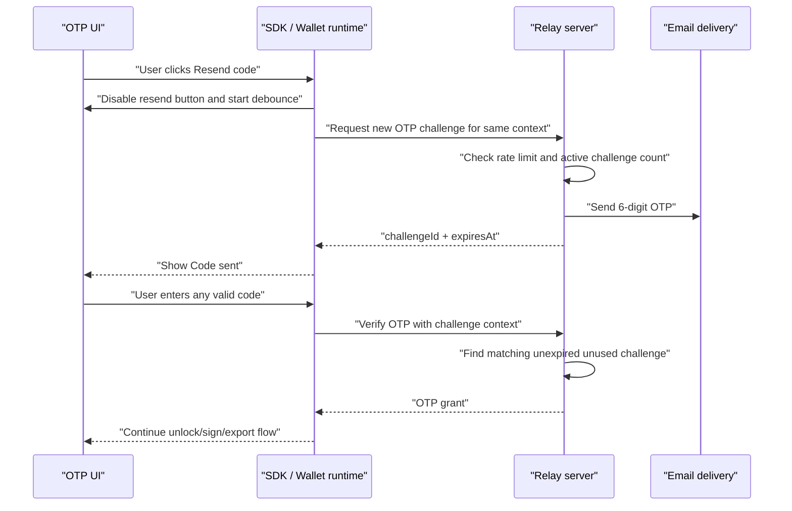

# OTP Resend Code

Last updated: 2026-04-18

## Goal

Add a first-class "Resend OTP code" action to Email OTP UI flows.

Users need a resend option when the original Email OTP email is delayed, filtered, or never delivered.

Target behavior:

1. Email OTP input screens show a `Resend code` button or link.
2. Clicking resend requests a new OTP challenge for the same wallet, user, channel, and operation.
3. The UI debounces resend clicks so the user cannot spam requests.
4. Server-side rate limiting remains authoritative.
5. Previously issued OTP codes remain valid until their own TTL expires, unless the server has explicitly invalidated them for abuse or policy reasons.
6. Any valid, unexpired, unused OTP code for the same wallet, user, channel, operation, and app-session context can complete the flow.

## Product UX

Recommended UI copy:

```text
Didn't get the email?
Resend code
```

Button states:

1. default: `Resend code`
2. after click: `Code sent`
3. debounce countdown: `Resend in 10s`
4. server rate-limited: `Too many requests. Try again shortly.`
5. delivery failure: `Could not send code. Try again.`

Rules:

1. keep the current OTP input value intact after resend
2. do not reset the whole screen
3. update `challengeId` to the newest challenge returned by the server
4. keep older challenge IDs usable if the user enters an older valid code and the UI/server supports verifying by code against active challenges
5. do not auto-submit after resend
6. do not show resend for flows where OTP is not the active auth method

## Debounce and Rate Limiting

Client debounce:

1. default debounce: 10 seconds
2. debounce starts after a resend click regardless of success or failure
3. button is disabled during the in-flight request
4. button is disabled while countdown is active
5. countdown should be per OTP screen instance, not global across the app

Server rate limiting:

1. server remains authoritative
2. rate limits should apply per wallet, user, channel, operation, app session, IP, and provider account where available
3. server should return structured `rate_limited` errors with a retry hint when possible
4. client debounce is only UX protection; it is not a security control

Recommended defaults:

```ts
type OtpResendPolicy = {
  clientDebounceMs: 10_000;
  serverChallengeTtlMs: 5 * 60_000;
  maxActiveChallengesPerContext: 5;
};
```

## Multiple-Code Semantics

All issued OTP codes should work until they expire, as long as they match the same authorization context.

Valid context fields:

1. `walletId`
2. `userId`
3. `otpChannel = email_otp`
4. operation, for example `wallet_unlock`, `transaction_sign`, `export_key`, or `registration`
5. app-session subject
6. app-session id or equivalent session binding
7. challenge purpose/action
8. recovery or registration attempt id where applicable

Rules:

1. a code is single-use
2. successful verification consumes only the matching challenge/code
3. unexpired sibling challenges may remain valid until TTL unless policy says to revoke them after success
4. expired challenges must be ignored and cleaned up opportunistically
5. malformed or wrong codes should increment failure counters for the relevant context
6. resend must not silently change operation scope
7. resend must not create a challenge for a different wallet id

Recommended server behavior:

1. allow multiple active challenges for the same context up to `maxActiveChallengesPerContext`
2. prune expired challenges before creating a new one
3. if active challenge count exceeds the limit, delete the oldest active challenge or reject with `rate_limited`
4. keep challenge IDs opaque and unique
5. store code hash, TTL, attempt counters, operation, and context binding per challenge

## Flow



## Implementation Plan

### Phase 1: Shared Resend API

1. [x] Reuse existing challenge helpers for resend instead of adding a parallel legacy route.
2. [x] Require resend callers to pass the same operation context as the original challenge.
3. [x] Return `challengeId`, `expiresAtMs`, optional `emailHint`, and optional `retryAfterMs`.
4. [x] Ensure all Email OTP UI flows can update their active challenge ID after resend.
5. [x] Preserve the app-session auth lane for resend challenge requests.

### Phase 2: UI Integration

1. [x] Add `Resend code` to wallet unlock Email OTP UI.
2. [x] Add `Resend code` to transaction-signing Email OTP UI.
3. [x] Add `Resend code` to private-key export Email OTP UI.
4. [x] Add `Resend code` to registration Email OTP UI.
5. [x] Add 10-second client debounce.
6. [x] Show countdown text while debounce is active.
7. [x] Keep OTP input contents when resend is clicked.
8. [x] Handle `rate_limited` with clear copy and retry hint.

### Phase 3: Server Challenge Semantics

1. [x] Verify the server permits multiple active OTP challenges for the same context.
2. [x] Ensure each challenge has independent TTL and single-use state.
3. [x] Ensure verification can succeed for any active matching challenge/code.
4. [x] Prune expired challenges during challenge creation and verification.
5. [x] Enforce max active challenge count per context.
6. [x] Add structured `retryAfterMs` for rate-limited responses where practical.
7. [x] Ensure resend does not bypass abuse counters.

### Phase 4: Tests

1. [x] Unit test resend button debounce.
2. [x] Unit test resend preserves OTP input state.
3. [x] Unit test resend updates current prompt metadata.
4. [x] Unit test rate-limit errors show the right UI copy.
5. [x] Server test two issued codes both verify before TTL.
6. [x] Server test a used code cannot verify again.
7. [x] Server test expired code fails while newer unexpired code succeeds.
8. [x] Server test resend keeps wallet/user/operation/app-session binding.
9. [x] Server test active challenge cap prunes the oldest matching challenge.
10. [x] E2E test Email OTP unlock with resend.
11. [x] Unit regression test Email OTP export resend completes the resent challenge.
12. [x] Unit regression test transaction-signing resend completes the resent
    challenge in `per_operation` mode.
13. [ ] E2E test Email OTP export with resend.
14. [ ] E2E test transaction-signing OTP with resend in `per_operation` mode.

## Master TODO

1. [x] Freeze resend semantics: multiple active codes are valid until TTL and single-use consumption.
2. [x] Add client-side 10-second resend debounce.
3. [x] Add `Resend code` UI to all Email OTP screens.
4. [x] Ensure resend reuses the exact original wallet/user/channel/operation/session context.
5. [x] Ensure server rate limiting remains authoritative and returns useful errors.
6. [x] Ensure all active unexpired codes can verify.
7. [x] Add cleanup for expired active challenges.
8. [x] Add unit tests for UI debounce and challenge replacement.
9. [x] Add server tests for multi-code validity, single-use, TTL, context binding, and active-count pruning.
10. [x] Add unit regression coverage for export and `per_operation` signing
   resend challenge handoff.
11. [ ] Add E2E coverage for unlock, export, and per-operation signing resend flows.

## Acceptance Criteria

1. User can resend an Email OTP code from every Email OTP input screen.
2. Resend button cannot be spammed from the UI.
3. Server still rate-limits abuse even if the client debounce is bypassed.
4. Old unexpired codes and new codes both work until their individual TTLs expire.
5. Used codes cannot be replayed.
6. Resend cannot change wallet, user, operation, channel, or session context.
7. Expired codes fail cleanly and are pruned.
8. The UI copy is clear for sent, countdown, rate-limited, and delivery-failure states.
