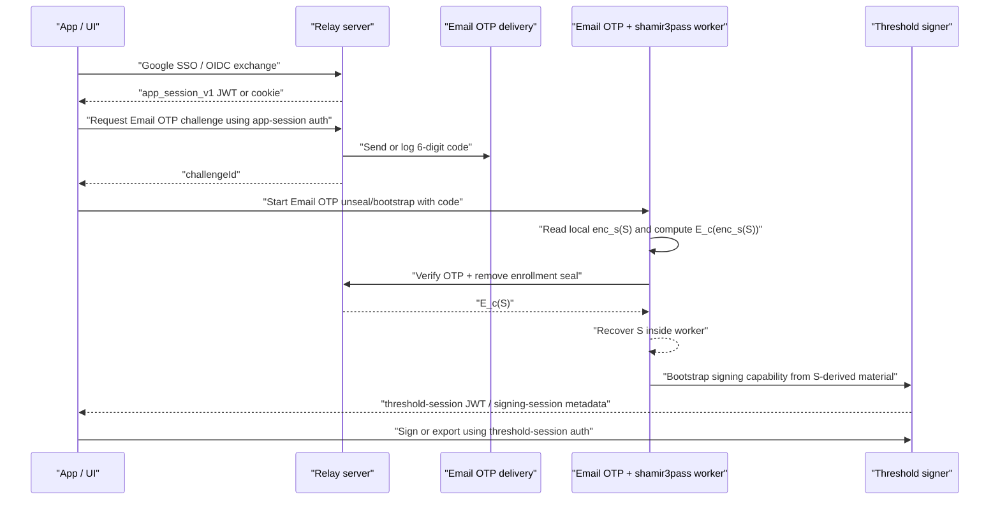
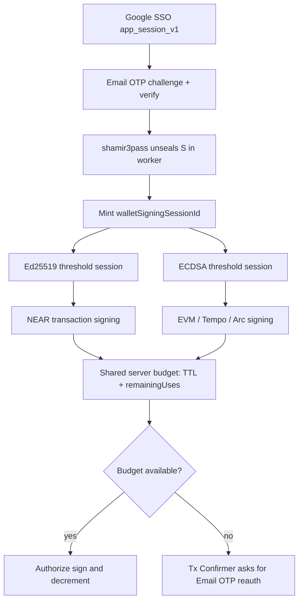

# SSO + Email OTP + `shamir3pass` Wallet Signing Spec

Date updated: April 24, 2026

## Objective

Define the canonical Email OTP signing system.

This spec describes a wallet-signing model where:

1. Google SSO authenticates the app user
2. Email OTP authorizes unseal of the enrolled client secret `S`
3. `shamir3pass` performs server-assisted unseal without the server returning plaintext `S`
4. the client derives threshold signing material from recovered `S`
5. `WarmSessionManager` decides how long recovered signing material stays in memory

First-release scope:

1. `passkey` remains the default and strongest signing method
2. `email_otp` is a lower-security convenience signing method
3. `email_otp` uses exactly 6 decimal digits
4. threshold signing scope is threshold ECDSA only
5. `S = randombytes(32)`
6. Email OTP supports both `session` and `per_operation` signing-session policies

## Product Decision

We support two canonical first-release account families:

1. `passkey`
   - non-custodial account option
   - deterministic secret source from WebAuthn PRF
   - default and recommended signing method
2. `email_otp`
   - Google-SSO-backed signing option
   - client-side `shamir3pass` unseal of enrolled secret `S`
   - cross-device signing supported
   - weaker than `passkey` because mailbox security, recovery keys, and server-assisted unseal are in the auth path

Recommended product policy:

1. `passkey` is the default option
2. `email_otp` is available as a convenience option
3. product copy must never present `email_otp` as equally secure with `passkey`

## Canonical Model

Email OTP does not derive the wallet secret.

Email OTP authorizes client-side unseal of the enrolled secret `S`.

Canonical shape:

```text
Google SSO app session + 6-digit Email OTP + device-local enc_s(S) -> verify-and-unseal
client recovers S
S -> threshold derivation branches
S -> wallet unlock proof
S -> WarmSessionManager signing-session policy
S -> resumed ECDSA bootstrap
```

Session-token boundaries:

1. `app_session_v1` authenticates the app/user session and authorizes Email OTP challenge, verification, and bootstrap authorization.
2. threshold-session JWTs authenticate an already-bootstrapped threshold signing capability and authorize threshold signing/export routes.
3. Email OTP verification alone is not a threshold session. It is an intermediate authorization step that lets the worker unseal `S` and bootstrap a signing capability.
4. the client may use one discriminated route-auth type, but each route must require the correct variant:

```ts
type RouteAuth = { kind: 'app_session'; jwt: string } | { kind: 'threshold_session'; jwt: string };
```

Email OTP flow:



This system is intentionally parallel to the passkey signing path:

1. `passkey`
   - WebAuthn PRF yields the secret source material
   - PRF-derived material is used to derive threshold signing inputs
2. `email_otp`
   - `shamir3pass` unwrap yields secret `S`
   - recovered `S` is used to derive threshold signing inputs

In both modes, the output of the secret-source stage feeds the same threshold ECDSA derivation path.

## Security Posture

`email_otp` is a convenience signing method, not the strongest security mode.

Compared with `passkey`, it is weaker because:

1. mailbox compromise is in the auth path
2. recovery keys can restore device-local enrollment escrow on a new device
3. the server participates in seal removal during unseal
4. OTP delivery and phishing risks are materially higher than passkey risks

Therefore:

1. `passkey` is the recommended default
2. `email_otp` must be labeled as lower-security convenience signing in product copy
3. private-key export and link-device/add-signer actions must require explicit step-up policy, either fresh `per_operation` Email OTP or passkey depending on project policy
4. passkey and `email_otp` must not be described as equivalent trust models

## Secret Source Model

All account modes fit one internal abstraction:

```text
client_secret_source -> threshold derivation branches
```

The source differs by mode:

1. `passkey`
   - `client_secret_source = PRF.first`
2. `email_otp`
   - `client_secret_source = recovered Email-OTP secret S`

Secret shape:

```text
S = random 32-byte secret generated on the client at enrollment
```

Rules:

1. `S` is high-entropy client-generated secret material
2. `S` is used directly as the Email-OTP secret source after unseal
3. do not add any second `PIN + OPRF` step or any secondary low-entropy wrapper around `S`

## Storage Model

### Device-local enrollment escrow plus recovery wrappers

The canonical long-lived enrollment artifacts are:

```text
S:
  32-byte Email OTP client secret generated by the client

enc_s(S):
  device-local enrollment escrow
  same value older specs write as E_enrollment_s(S)

C_i:
  recovery-wrapped enrollment escrow
  C_i = ChaCha20-Poly1305_Encrypt(K_recovery_i, enc_s(S), aad = enrollment metadata)
```

Storage ownership:

1. the client stores `enc_s(S)` in wallet iframe-origin IndexedDB
2. the server stores only recovery-wrapped escrow records `C_i` and recovery metadata
3. the server must not store `enc_s(S)`
4. the server must not store plaintext `S`
5. the server must not store recovery keys or derived recovery KEKs

Same-device Email OTP login reads `enc_s(S)` locally and sends a client-locked form of `enc_s(S)` to the server-assisted unseal route after OTP verification. New-device setup or browser-storage loss requires a recovery key to unwrap one server-stored `C_i` record back into local `enc_s(S)`.

### Threshold security invariant

Production Email OTP must satisfy:

```text
server storage must not contain a server-decryptable or server-usable copy of enc_s(S)
```

If the server stores `E_enrollment_s(S)` directly and also controls the enrollment seal removal key, then server compromise can recover `S`. Since the same server also has the server threshold share, that collapses the threshold security property into unilateral server signing.

Therefore:

1. server-side direct enrollment escrow storage is not allowed in the target model
2. Email OTP may claim the threshold security property only when the server stores recovery-wrapped `C_i` records instead of direct `enc_s(S)`
3. passkey remains the strongest and recommended mode because it avoids Email OTP recovery-key handling entirely
4. an active malicious server that can ship modified frontend code can still attack future live sessions; this model restores protection against server storage/config compromise, not active malicious frontend compromise

### Recovery key posture

Email OTP enrollment creates exactly 10 single-use recovery keys.

Recovery key format:

```text
XXXX-XXXX-XXXX-XXXX-XXXX-XXXX-XXXX-XXXX
```

Rules:

1. each recovery key is 32 random Crockford Base32 characters, rendered as 8 groups of 4
2. each recovery key carries 160 bits of entropy
3. each recovery key independently wraps the same device-local `enc_s(S)`
4. successful recovery consumes exactly one recovery key
5. recovery-key rotation replaces the full active set with a new set of 10 single-use recovery keys
6. the server stores only recovery-key ids, status, metadata, and `C_i`
7. shorter MFA-style backup codes are not valid recovery KEKs for this flow

## `shamir3pass` Protocol

### Enrollment seal

1. client generates client secret `S`
2. client computes `a = E_kc1(S)`
3. server returns `b = E_enrollment_s(a)`
4. client computes `enc_s(S) = D_kc1(b)`
5. client stores `enc_s(S)` as device-local enrollment escrow in wallet iframe-origin IndexedDB
6. client generates 10 single-use recovery keys
7. client uploads only `C_i = ChaCha20-Poly1305_Encrypt(K_recovery_i, enc_s(S), aad)` records plus recovery metadata

Persisted artifacts:

```text
client device:
  enc_s(S)

server:
  C_i = ChaCha20-Poly1305_Encrypt(K_recovery_i, enc_s(S), aad)
```

### Login or signing unseal

1. client requests Email OTP challenge under a valid Google-SSO-backed `app_session_v1`
2. user completes 6-digit Email OTP verification
3. client reads local `enc_s(S)` from wallet iframe-origin IndexedDB
4. client computes `d = E_kc2(enc_s(S))`
5. client submits the OTP code, challenge id, and `d` in one action-specific request
6. server verifies the OTP before applying the enrollment seal removal
7. server returns `e = D_enrollment_s(d) = E_kc2(S)`
8. client computes `S = D_kc2(e)`

Rules:

1. the server must never return plaintext `S`
2. the server must not sign on behalf of the user using `S`
3. the client must recover `S` locally and derive signing material locally
4. Email OTP must not have an offline path
5. secret-bearing login, unseal, and bootstrap calls must accept the `challengeId` from the already-issued OTP challenge; they must not require creating a second challenge after the user has entered a code
6. if local `enc_s(S)` is missing, the client must enter explicit recovery instead of asking the server for direct `enc_s(S)`

## Signing-Session Policies

Email OTP supports two signing-session policies. Both use the same Google SSO + Email OTP + `shamir3pass` unseal flow. The only difference is how long recovered signing material is retained in memory.

Canonical policy field:

```text
email_otp_auth_policy = "session" | "per_operation"
```

### `email_otp_auth_policy = session`

1. Google SSO succeeds
2. Email OTP is verified once for the login/session
3. client recovers `S`
4. client derives signing material
5. `WarmSessionManager` keeps the warm capability in memory
6. the client signs multiple transactions until expiry, logout, revocation, or invalidation

This is the default Email OTP UX mode.

### `email_otp_auth_policy = per_operation`

1. Google SSO succeeds
2. each sign operation requires a fresh Email OTP verification
3. client recovers `S` on demand
4. client derives signing material
5. client signs once
6. `WarmSessionManager` discards recovered secret-derived material immediately after the operation

This is the higher-friction, higher-security Email OTP mode.

### Shared wallet signing-session budget

In `session` mode, Email OTP creates one wallet-level signing-session budget for the wallet unlock.

The budget is identified by `walletSigningSessionId` and is shared by every transaction-signing threshold capability minted for that unlock.

Rules:

1. one Email OTP wallet unlock creates one `walletSigningSessionId`
2. Ed25519 and ECDSA threshold sessions created from the same recovered `S` must reference that same `walletSigningSessionId`
3. NEAR Ed25519 signing and EVM/Tempo/Arc ECDSA signing decrement the same server-authoritative `remainingUses` counter
4. TTL expiry invalidates both Ed25519 and ECDSA transaction-signing capabilities
5. use-count exhaustion invalidates both Ed25519 and ECDSA transaction-signing capabilities
6. key export and link-device/add-signer flows use operation-scoped authorization and must not replace, decrement, or invalidate the transaction-signing `walletSigningSessionId`
7. the client may clear local worker material earlier than the server budget, but it must not extend the server TTL or `remainingUses`

Prompt routing when the shared budget is expired or exhausted:

1. Email OTP accounts show the transaction confirmer with a 6-digit Email OTP input and dispatch a transaction-sign OTP challenge
2. passkey accounts show the passkey/WebAuthn prompt
3. mixed accounts default to passkey unless project policy explicitly allows Email OTP fallback
4. ordinary transaction signing must not fail with a generic session-not-ready error if a valid reauthorization path exists



### Policy ownership

The following layers may participate in policy selection:

1. SDK config
2. application policy
3. wallet policy

The effective policy must be explicit and inspectable.

### Authority split

The implementation must use this authority model:

1. the server is authoritative for security policy and abuse controls
2. the client is authoritative for the in-memory warm-session lifecycle
3. the client must treat server policy as upper bounds, not as optional hints

In practice this means:

1. the server owns OTP challenge TTL, login-grant TTL, failure counters, lockout timestamps, last Email OTP login time, strong-auth timestamps, and revocation state
2. the client owns live warm-capability state, in-memory expiry timers, remaining-use depletion, and local discard of recovered secret-derived material
3. client-side warm-session TTL or use counters must never extend beyond the limits imposed by the server
4. switching device, storage, or runtime must not bypass server-side lockouts or strong-auth policy

### Required discard semantics

If the policy says to discard, that means:

1. clear the warm capability
2. clear recovered `S`
3. clear derived signers or signer handles
4. zero worker memory as far as practical

### Session-mode requirements

When `email_otp_auth_policy = session`, the system must define:

1. warm-capability TTL
2. expiry semantics
3. logout invalidation
4. revocation invalidation

### Sensitive-operation overrides

The system must support forcing fresh authorization for sensitive operations even when default policy is `session`.

At minimum, the specs must allow:

1. private-key export step-up
2. link-device or add-signer step-up
3. forced `per_operation` retention for projects that require every sign operation to re-authenticate
4. passkey requirement for especially sensitive actions when project policy does not allow Email OTP fallback

Normal transaction signing must not treat Email OTP as requiring implicit step-up after wallet unlock. If the unlocked signing session is valid, Email OTP and passkey sessions follow the same signing-session policy.

### Warm-session modeling requirements

`WarmSessionManager` must not model this only as “cached vs not cached.”

It should model explicit policy and context, for example:

```text
type SigningSessionPolicy = 'session' | 'per_operation'

type AuthMethod = 'passkey' | 'email_otp'

type SensitiveOperationPolicy =
  | 'inherit_session_policy'
  | 'require_fresh_same_method'
  | 'require_passkey'
  | 'deny_email_otp'
```

`SigningSessionPolicy` is auth-method neutral. It applies the same way to passkey and Email OTP sessions:

1. `session` means unlock once, keep the warm signing capability in memory until TTL, logout, revocation, or invalidation.
2. `per_operation` means authenticate for each operation, use the recovered signing material once, then discard it.

`SensitiveOperationPolicy` is separate from ordinary signing-session policy:

1. `inherit_session_policy` means the operation follows the active signing session.
2. `require_fresh_same_method` means the user must re-authenticate with the same account method for this operation.
3. `require_passkey` means Email OTP is not sufficient and a passkey-authenticated signer must authorize the operation.
4. `deny_email_otp` means Email OTP-authenticated sessions cannot perform the operation.

This keeps policy readable and prevents accidental drift.

## Derivation Model

All derivations in this spec are normative and use:

1. RFC 5869 HKDF-SHA-256
2. explicit extract plus expand for every derivation step
3. UTF-8 encoding for string inputs
4. canonical ordered field encoding for every multi-field `info` value

Canonical field encoding:

```text
encode_field(x) = u16be(len(x)) || x
encode_tuple([a, b, c]) = encode_field(a) || encode_field(b) || encode_field(c)
```

Rules:

1. all identifiers such as `wallet_id`, `org_id`, `user_id`, `key_purpose`, `key_version`, and `derivation_version` are encoded as exact persisted UTF-8 string values
2. `participant_ids` must be deduplicated and sorted ascending by raw UTF-8 byte order before encoding
3. `derivation_path` must be encoded as canonical ASCII string form
4. output length is 32 bytes unless a later section explicitly says otherwise

### Threshold root

```text
threshold_root =
  HKDF-SHA-256(
    ikm=S,
    salt="tatchi/email-otp/root/v1",
    info=encode_tuple([wallet_id])
  )
```

### Threshold ECDSA branch

First release:

1. `derivation_path = "evm-signing"`
2. `ecdsa_client_share_seed` is the 32-byte client root share consumed by the threshold ECDSA runtime
3. do not add a second client-side scalar-reduction step before calling the existing ECDSA runtime
4. Email OTP payload surfaces must not expose this value as `clientRootShare32B64u`; any base64url field name with that spelling is a legacy threshold bootstrap adapter detail outside the Email OTP public flow

```text
ecdsa_client_share_seed =
  HKDF-SHA-256(
    ikm=threshold_root,
    salt="tatchi/email-otp/threshold-client-share/v1",
    info=encode_tuple([user_id, derivation_path])
  )
```

### Unlock proof branch

```text
unlock_auth_seed =
  HKDF-SHA-256(
    ikm=threshold_root,
    salt="tatchi/email-otp/unlock-auth/v1",
    info=encode_tuple([wallet_id])
  )
unlock_signing_key = DeterministicKey(unlock_auth_seed)
unlock_public_key = PublicKey(unlock_signing_key)
```

This key is not used for threshold signing. It exists only to prove possession of the recovered client secret in the current runtime.

## Registration Flow

Canonical Email OTP registration:

1. user signs in with Google SSO
2. server verifies the Google ID token against `GOOGLE_OIDC_CLIENT_ID` or `GOOGLE_OIDC_CLIENT_IDS`
3. server issues `app_session_v1` with:
   - `sub` as the app identity / Google OIDC subject mapping
   - `walletId` as the server-resolved signing wallet id for this Google subject
4. account key material is created for the Email OTP signing path
5. Email OTP enrollment is completed
6. client generates strong random secret `S`
7. client seals `S` into device-local enrollment escrow `enc_s(S)` via `shamir3pass`
8. client derives:
   - threshold ECDSA client verifying share when ECDSA threshold is enabled
   - unlock public key
9. client generates 10 single-use recovery keys and uploads:
   - recovery-wrapped escrow records `C_i = ChaCha20-Poly1305_Encrypt(K_recovery_i, enc_s(S), aad)`
   - enrolled derived threshold material
   - enrolled unlock public key
   - Email OTP metadata
10. client stores `enc_s(S)` in wallet iframe-origin IndexedDB
11. server stores recovery-wrapped escrow records only; it must not store direct `enc_s(S)`

Registration therefore becomes:

```text
Google SSO -> account creation -> Email OTP enrollment -> client-secret generation -> device-local escrow + server recovery wrappers
```

During registration, the client marks the OIDC exchange as `account_mode = register`. The server then creates a NEAR-valid hosted wallet id from a keyed HMAC readable slug. The HMAC context binds the slug to the project, environment, auth provider, and provider subject, so the public wallet id is deterministic for the same identity but does not encode the raw email address:

```text
brisk-maple-k7q9yh.testnet
```

The server persists a mapping from the Google provider subject to that wallet id only after successful account provisioning and signer activation. Later logins mark the exchange as `account_mode = login` and must reuse the persisted wallet id.

If an OIDC exchange is not a Google Email OTP registration flow, the server still derives the hosted wallet id with the same keyed HMAC readable slug generator. Plain hashes and raw email-derived wallet ids are not supported.

## Login Flow

### High-level flow

1. user logs in with Google SSO
2. app holds valid Google-SSO-backed `app_session_v1`
3. client requests Email OTP challenge
4. server sends 6-digit Email OTP
5. user enters the 6-digit Email OTP
6. client reads local `enc_s(S)` from wallet iframe-origin IndexedDB
7. client computes `d = E_kc2(enc_s(S))`
8. client submits the user-entered OTP, original `challengeId`, and `d`
9. server verifies the OTP and applies the enrollment seal removal in the same action-specific request
10. the dedicated Email OTP worker completes the `shamir3pass` unseal round-trip
11. the worker recovers `S`
12. the worker derives the threshold ECDSA client root share bytes and the unlock proof key
13. the worker signs a fresh wallet unlock challenge
14. server verifies the unlock proof and establishes wallet-unlocked state
15. the worker completes the ECDSA bootstrap ceremony and returns sanitized bootstrap metadata
16. the main thread provisions an ECDSA warm capability through `WarmSessionManager` using:
    - the worker-returned bootstrap result
    - validated `app_session_v1`
    - explicit `ecdsaThresholdKeyId`
    - exact `sessionPolicy.participantIds` match against the active integrated ECDSA signer set
17. the warm ECDSA capability must reach `ready`
18. `WarmSessionManager` applies either `session` or `per_operation` according to signing-session policy

If local `enc_s(S)` is missing because this is a new device or IndexedDB was wiped, the client must enter the explicit recovery flow. The server must not return direct `enc_s(S)` as a login fallback.

### Authorization lanes

| Step                                           | Auth lane                                                         | Why                                                                                                                           |
| ---------------------------------------------- | ----------------------------------------------------------------- | ----------------------------------------------------------------------------------------------------------------------------- |
| Google SSO exchange                            | Google OIDC assertion                                             | proves app identity and Google subject                                                                                        |
| Initial Email OTP challenge                    | `app_session_v1`                                                  | binds OTP challenge to the current logged-in app user, wallet, session, and operation                                         |
| Email OTP challenge after sealed refresh       | restored signing-session route authority                          | lets an already-restored wallet signing session request fresh operation auth without persisting a JS-readable app-session JWT |
| Email OTP verify-and-unseal                    | same lane that requested the challenge plus local `E_c(enc_s(S))` | verifies the code and removes the enrollment seal in one action-specific request                                              |
| `shamir3pass` unseal authorization             | successful OTP verification plus validated route authority        | proves the user is allowed to recover `S` or operation material for this operation                                            |
| threshold ECDSA bootstrap from Email OTP       | fresh OTP authorization plus validated route authority            | bootstrap is authorized by OTP verification and the route's app-session or restored signing-session binding                   |
| threshold ECDSA signing/export after bootstrap | threshold-session JWT                                             | proves an active threshold signing capability exists                                                                          |

Rules:

1. never substitute a threshold-session JWT where app-session auth is required for initial Email OTP challenge, verification, or bootstrap authorization
2. never substitute an app-session JWT where a threshold-session JWT is required for threshold signing or threshold HSS export
3. `authorizationJwt` is not an acceptable generic field name for new Email OTP or ECDSA HSS boundaries; use explicit `RouteAuth` variants or lane-specific names
4. after sealed refresh, restored signing-session authority may request a fresh sensitive-operation OTP challenge, but it must not directly authorize export, link-device, add-signer, or transaction signing without the correct follow-up policy check

### Why there is still a wallet unlock proof

OTP verification authorizes unseal.

The unlock proof confirms fresh possession of the recovered client secret in the current browser/runtime and keeps wallet unlock semantics aligned with the passkey path.

## Transaction Signing Flow

Transaction signing is policy-driven by `WarmSessionManager`.

### Session-retained signing

1. Google SSO login completes
2. Email OTP verification completes
3. `shamir3pass` unseal recovers `S`
4. `WarmSessionManager` retains the warm ECDSA capability in memory
5. subsequent transactions reuse the ready warm capability until expiry or invalidation

### Per-operation signing

1. a sign request is initiated
2. if no reusable Email OTP warm capability is allowed, the app requires a fresh Email OTP
3. `shamir3pass` unseal recovers `S`
4. the client derives the same ECDSA client share and signs once
5. recovered secret-derived material is discarded immediately

This dual-policy model is intentional. The system supports both OTP-once-per-session and OTP-per-transaction via one secret-source and derivation model.

## Challenge And Grant Model

### Email OTP challenge

Recommended payload:

```json
{
  "challengeId": "oc_123",
  "issuedAt": "2026-04-14T12:00:00Z",
  "expiresAt": "2026-04-14T12:05:00Z",
  "orgId": "org_123",
  "userId": "user_123",
  "walletId": "wallet_123",
  "sessionHash": "base64url-hash",
  "appSessionVersion": "v7",
  "channel": "email_otp",
  "action": "wallet_email_otp_login"
}
```

Policy:

1. challenge TTL defaults to 5 minutes
2. maximum OTP attempts default to 5
3. lockout TTL defaults to 15 minutes after the configured maximum failed attempts for an enrolled wallet
4. there is no resend route in v1; the client requests a fresh challenge instead
5. `userId` and `walletId` are intentionally distinct for Google SSO:
   - `userId` is the app-session subject / Google OIDC subject mapping
   - `walletId` is the persisted signing identity stored in `app_session_v1.walletId`
   - Email OTP routes authorize requested `walletId` against the session `walletId` claim, falling back to `sub` only for non-OIDC/passkey sessions

### Email OTP auth grant

For normal same-device login, OTP verification and enrollment-seal removal should be combined in one action-specific `verify-and-unseal` request. The server may still model a short-lived authorization grant internally, but it should not require an extra client-visible network hop between OTP verification and unseal.

For operation-scoped flows that cannot combine verify and use in one request, this is a server-minted, single-use, short-lived authorization artifact for exactly one operation.

Required claims:

1. `orgId` when present in the current app session claims
2. `userId`
3. `walletId`
4. `challengeId`
5. `channel = email_otp`
6. `sessionHash`
7. `appSessionVersion`
8. `issuedAt`
9. `expiresAt`
10. `action = wallet_email_otp_unseal`

Policy:

1. grant TTL defaults to 30 seconds
2. grants are single-use and consumed on first successful validation
3. grants become invalid if the underlying app session changes or expires

## Enrollment Model

Email OTP enrollment happens only after Google SSO app session issuance.

Enrollment authorization:

1. Google SSO Email OTP registration and re-enrollment are authorized by:
   - a valid Google-SSO-backed `app_session_v1`
   - `walletId` bound to the session `walletId` claim
   - a fresh 6-digit Email OTP challenge for `action = wallet_email_otp_registration`
2. Google SSO Email OTP registration does not require passkey authentication.
3. Google SSO Email OTP re-enrollment does not require passkey authentication, because Email OTP-only accounts may not have a passkey yet.
4. passkey or Email OTP step-up applies only when the operation is an explicit sensitive flow such as private-key export or link-device/add-signer.

Persisted server-side data:

1. recovery-wrapped escrow records `C_i = ChaCha20-Poly1305_Encrypt(K_recovery_i, enc_s(S), aad)`
2. recovery-key id, label, status, and metadata for each `C_i`
3. `enrollmentSealKeyVersion`
4. `unlockPublicKey`
5. `unlockKeyVersion`
6. `thresholdEcdsaClientVerifyingShareB64u` when applicable
7. `createdAtMs`
8. `updatedAtMs`
9. `lastEmailOtpLoginAtMs`
10. `lastStrongAuthAtMs`
11. OTP failure and lockout counters

Persisted client-side data:

1. device-local `enc_s(S)` in wallet iframe-origin IndexedDB

The server does not store direct `enc_s(S)`. The client does not persist plaintext `S`.

## API Shape

Keep the canonical route planes:

1. session plane: existing `session/*`
2. wallet plane: existing `wallet/*`

Minimum route set:

1. `POST /wallet/email-otp/registration/challenge`
2. `POST /wallet/email-otp/registration/seal`
3. `POST /wallet/email-otp/registration/finalize`
4. `POST /wallet/email-otp/login/challenge`
5. `POST /wallet/email-otp/login/verify-and-unseal`
6. `POST /wallet/email-otp/recovery/challenge`
7. `POST /wallet/email-otp/recovery/wrapped-escrows`
8. `POST /wallet/email-otp/recovery-key/consume`
9. `POST /wallet/email-otp/recovery-key/rotate`
10. `POST /wallet/unlock/challenge`
11. `POST /wallet/unlock/verify`

Do not keep a steady-state route that returns direct server-stored `E_enrollment_s(S)`.

## Product Rules

### Positioning

1. `passkey` is the strongest and recommended signing method
2. `email_otp` is a lower-security convenience signing method
3. product copy must say Email OTP is less secure than passkey

### Sensitive actions

Require explicit step-up policy only for:

1. key export with fresh export-scoped `per_operation` Email OTP, unless project policy requires passkey
2. link-device/add-signer flows with the project-selected fresh-auth method

Normal transaction signing is not a step-up flow. It follows the unlocked signing-session policy.

### Policy defaults

Recommended defaults:

1. default Email OTP policy: `session`
2. optional high-security apps: `per_operation`
3. sensitive actions: passkey by default for mixed accounts, with Email OTP fallback only when project policy allows it
4. Email OTP-only key export: fresh export-scoped `per_operation` OTP plus server-side `export_key` authorization

## Observability

Add structured events for:

1. Email OTP enrollment success
2. Email OTP login failure
3. Email OTP lockout
4. Email OTP login success
5. Email OTP login from a new device
6. Email OTP sign request in `per_operation` mode
7. Email OTP warm-capability establishment in `session` mode
8. Email OTP warm-capability discard after single-use signing

Do not log:

1. OTP code
2. plaintext Email OTP client secret
3. raw wrapped ciphertext inputs
4. unlock private key

## Implementation Requirements

The implementation must preserve these invariants:

1. the server never returns plaintext `S`
2. the server never signs on behalf of the user using `S`
3. the client derives signing material locally after unseal
4. `session` and `per_operation` share the same derivation path from recovered `S`
5. `per_operation` clears recovered secret-derived material after single-use signing
6. `session` defines explicit TTL, logout, and invalidation behavior
7. passkey remains the strongest and recommended mode
8. server-side security policy and abuse controls are authoritative over any client-side warm-session policy
9. server persistence contains no direct `enc_s(S)` for active Email OTP enrollments
10. the client stores device-local `enc_s(S)` separately from short-lived signing-session sealed-refresh records
11. recovery keys are single-use 8x4 Crockford Base32 values and are never sent to the server

## Recommended First Release Scope

1. offer `passkey` as the default and strongest signing method
2. offer `email_otp` as a convenience signing method
3. use 6-digit `email_otp` as the only OTP channel in first release
4. support threshold Ed25519 and threshold ECDSA signing capabilities
5. fix `S` to 32 random bytes in first release
6. support both `session` and `per_operation` Email OTP signing-session policies through `WarmSessionManager`
7. do not add any `PIN + OPRF` layer to this flow
8. store `enc_s(S)` only as device-local enrollment escrow in wallet iframe-origin IndexedDB
9. do not enable any offline Email OTP path
10. store only recovery-wrapped `C_i` records on the server

## Definition of Done

1. login surfaces clearly offer `passkey` and `email_otp`, with `passkey` presented as the stronger default
2. Email OTP is explicitly documented and labeled as lower-security convenience signing
3. users can sign on a new device with Google SSO plus a 6-digit Email OTP
4. the Email OTP client secret is never persisted in plaintext at rest
5. the server stores only recovery-wrapped enrollment escrow records `C_i`
6. the client stores device-local `enc_s(S)` and never stores plaintext `S`
7. threshold Ed25519 and threshold ECDSA derivation are deterministic from the recovered client secret
8. `wallet/unlock/verify` accepts only public unlock proof material
9. Email OTP signing reaches a `ready` ECDSA warm capability through the canonical warm-session runtime
10. `WarmSessionManager` supports both `session` and `per_operation` signing-session policies for Email OTP
11. OTP challenges and grants are rate-limited, expiring, and single-use
12. passkey and Email OTP coexist without duplicate legacy route or symbol pollution

## Current Implementation Status

### Completed

1. canonical Email OTP route plane exists under `wallet/email-otp/*`
2. device-local enrollment escrow exists and the server stores only recovery-wrapped escrow records
3. client-side `shamir3pass` unseal of `S` exists
4. threshold ECDSA derivation from recovered `S` exists
5. wallet unlock proof from recovered `S` exists
6. resumed ECDSA bootstrap from recovered `S` exists
7. `email_otp` is already a first-class internal source in the threshold session store
8. rate limits, lockouts, single-use grants, and stronger-auth gates already exist
9. Express and Cloudflare parity already exist
10. the SDK now has a canonical Email OTP policy surface via `emailOtpAuthPolicy = session | per_operation`
11. Email OTP bootstrap now persists explicit warm-session auth context:

- `policy`
- `retention`
- `reason`
- `authMethod`

12. Email OTP bootstrap now threads explicit policy metadata through the client runtime and ECDSA session store
13. the current Email OTP login bridge defaults `per_operation` to a one-use ECDSA session budget when the caller does not override `remainingUses`
14. the shared EVM and Tempo signing path now delegates single-use Email OTP post-sign discard to `WarmSessionManager`
15. `WarmSessionManager` now actively enforces Email OTP signing-session semantics instead of only surfacing metadata:

- `single_use` Email OTP capabilities are discarded after successful ECDSA signing
- Email OTP capabilities are invalidated when warm-session status becomes `missing`, `expired`, or `exhausted`

16. Email OTP session TTL and invalidation semantics now clear stale local lane state and worker warm material when the client-side warm session is no longer valid
17. sensitive-operation overrides are now generalized through `WarmSessionManager` policy checks:

- stronger operations can require fresh passkey authentication
- stronger operations can require fresh Email OTP with `per_operation` policy

18. `PasskeyAuthMenu` now exposes `emailOtpAuthPolicy` and treats Google SSO as the Email OTP entrypoint instead of showing a separate OTP CTA
19. the former Email OTP bootstrap wrapper stopped returning `clientRootShare32B64u` before that wrapper was deleted
20. best-effort local cleanup now zeroizes secret-derived byte buffers in the Email OTP unlock, enrollment, and threshold bootstrap paths when those buffers are materialized client-side
21. transient Email OTP secret-source references were shortened before the dedicated-worker cutover:

- the unsealed client secret was blanked locally after the unlock handoff completed
- the former bootstrap wrapper decoded its transient `clientRootShare32B64u` once, cleared the string immediately, and zeroized the byte buffer after bootstrap completed
- decoded unlock challenge bytes are zeroized after unlock proof signing completes

22. Email OTP discard/invalidation now clears lane-scoped threshold-ECDSA presignature pools so single-use or expired sessions do not retain reusable presign material after warm-session teardown
23. background threshold-ECDSA presign refill now respects lane invalidation generation guards, preventing stale refill work from repopulating a cleared Email OTP lane after discard
24. `ethSigner` worker handlers now zeroize owned secret-derived byte buffers after use where the worker owns them:

- unlock/signing private keys and PRF-derived inputs
- threshold additive shares and signature-share inputs
- presignature buffers after cloning them for transfer back to the runtime

25. `wasm/eth_signer` now zeroizes owned secret-bearing `Vec<u8>` inputs after cryptographic operations return:

- secp256k1 sign inputs
- PRF-derived key derivation input
- threshold share and signature computation inputs
- threshold presign constructor private share input

26. threshold-ECDSA coordinator cleanup now zeroizes decoded presign and signature-share buffers after they are serialized or handed off to the relayer finalize step
27. threshold-ECDSA client presignature pool state no longer stores `kShare` and `sigmaShare` as long-lived base64url strings:

- private presign material now uses owned byte buffers
- pooled entries are zeroized on pop, lane invalidation, and global teardown

28. sign and login-prefill paths now enforce explicit ownership for decoded `clientSigningShare32` buffers:

- callers clone before handing secret bytes to async refill or sign work
- caller-owned buffers are zeroized in `finally` after the final consumer returns

29. the temporary JS Email OTP derivation helpers were hardened before being moved to test-only parity support:

- recovered `S` is decoded once and reused as bytes
- HKDF intermediates such as `prk`, `thresholdRoot`, and tuple-encoding buffers are zeroized after final use

30. focused lifecycle validation now covers stale-buffer rejection and post-discard cleanup:

- direct refill, scheduled refill, and foreground sign all zeroize their owned signing-share buffers
- stale zeroized signing-share buffers are rejected on attempted reuse

31. the deleted main-thread Email OTP compatibility runtime was hardened to keep recovered secret `S` byte-owned before removal:

- unseal decoded the recovered secret once into `Uint8Array`
- unlock and bootstrap handoff consumed byte-owned secret input instead of re-passing base64url secret strings
- enrollment kept caller-owned secret bytes live only until verifier derivation and escrow upload completed

32. the `shamir3pass` worker/runtime boundary now exposes byte-oriented entrypoints for the Email OTP flow:

- enrollment can send caller-owned secret bytes into the worker without first base64url-encoding them
- unseal can return recovered secret bytes from the worker without requiring an extra base64url decode step
- Email OTP worker code requires the byte-oriented entrypoints

33. the `shamir3pass` WASM export surface now has matching byte-oriented lock helpers for the Email OTP worker path:

- the worker no longer has to re-encode caller-owned secret bytes into base64url before invoking the WASM add-lock path
- the worker can receive recovered secret bytes directly from the WASM remove-lock path before handing them back to the runtime
- older string-based WASM exports are not used by the Email OTP worker path

34. `shamir3pass` client lock exponents no longer need to cross into the main thread for the Email OTP flow:

- the runtime can create opaque worker-held key handles
- the app-facing runtime surface is now handle-based instead of exposing explicit client lock keypairs
- Email OTP seal/unseal paths use those handles and destroy them in `finally`
- focused unit coverage asserts the handle path and byte-returning unseal path are used

35. Signing-session seal apply/remove in the passkey confirm worker now also uses opaque worker-held `shamir3pass` key handles only:

- sealed refresh no longer materializes client encrypt/decrypt exponents in the worker flow
- focused single-flight sealed-mode worker tests still pass after the handle migration

36. wallet-iframe EVM `per_operation` parity is now closed:

- the first EVM sign consumes the originating single-use Email OTP auth
- the second EVM sign is rejected until the user completes a fresh Email OTP verification
- the focused EVM `per_operation` replay case now passes against the rebuilt prepared SDK bundle

37. the dedicated `emailOtp` worker now owns the default login-plus-unlock path end to end:

- challenge and verify already dispatch through the worker
- the worker now performs `shamir3pass` unseal for the standard login path
- the worker now derives the unlock auth seed and threshold-ECDSA client root share for that path
- the worker now fetches and signs `/wallet/unlock/challenge` and submits `/wallet/unlock/verify`
- the default runtime path no longer returns recovered `S` to the main thread during Email OTP login

38. the dedicated `emailOtp` worker now also owns the default enrollment path end to end:

- the worker now requests the enrollment challenge and submits the seal and verify routes for the standard enrollment path
- the worker now performs the `shamir3pass` enrollment seal flow for that path
- the worker now derives the unlock public key and threshold-ECDSA client verifying share for that path
- the default runtime path no longer walks the enrollment secret through main-thread JS

39. the former residual Email OTP bootstrap handoff was made byte-owned before the full worker-owned bootstrap cutover:

- the login-plus-bootstrap wrapper stopped passing `clientRootShare32B64u` onward into ECDSA bootstrap
- the wrapper decoded the client root share once, cleared the transient base64url string, and zeroized the byte buffer after bootstrap
- the threshold-ECDSA HSS bootstrap worker/WASM path now accepts raw `clientRootShare32` bytes instead of requiring a base64url-only handoff

40. the former Email OTP login-plus-bootstrap preparation path was moved through the dedicated `emailOtp` worker before being removed from the public runtime surface:

- the worker returned transferred `clientRootShare32` bytes rather than a base64url bootstrap-share string
- the default runtime no longer reuses the older string-result unlock bridge as the bootstrap-prep path
- focused unit coverage asserted the dedicated worker operation and caller-owned bootstrap-share zeroization before the final worker-owned bootstrap surface replaced it

41. the public Email OTP runtime surface no longer exposes caller-facing string-secret compatibility entrypoints:

- `completeEmailOtpUnlock(...)` has been deleted
- deterministic enrollment override now accepts byte-owned `clientSecret32` instead of `clientSecretB64u`
- focused unit, relayer integration, and first-class E2E coverage still pass after the cleanup

42. the default internal Email OTP login path now completes ECDSA authorization bootstrap inside the dedicated `emailOtp` worker:

- the worker performs login, verify, `shamir3pass` unseal, unlock proof generation, ECDSA HSS prepare/respond/finalize, and bootstrap finalization for the default path
- the main thread receives only sanitized recovery metadata and the final `ThresholdEcdsaSessionBootstrapResult`
- the main thread remains authoritative for persistence, session-store upsert, Email OTP policy metadata, and `WarmSessionManager` lifecycle checks

43. the dedicated `emailOtp` worker now uses `wasm/email_otp_runtime` for Email OTP derivation:

- threshold root, ECDSA client root share, and unlock auth seed derivation moved out of shared JS helper code for the default worker path
- the new WASM runtime zeroizes owned secret inputs, PRK, threshold root, tuple buffers, and HKDF block buffers
- SDK build scripts now generate, bundle, and copy `email_otp_runtime_bg.wasm` beside the worker bundle

44. direct `email_otp_runtime` regression coverage now exists:

- WASM threshold-root, ECDSA-share, and unlock-seed outputs are checked against the canonical byte-oriented JS derivation helpers
- malformed non-32-byte secrets fail closed at the WASM boundary
- returned WASM buffers are treated as caller-owned and can be zeroized without corrupting later derivations

45. the client and worker Email OTP login/enrollment/bootstrap APIs now support preissued OTP challenges:

- callers can pass the `challengeId` from the explicit challenge request into the later OTP submit/unseal/bootstrap call
- the default worker path forwards `challengeId` instead of forcing a new challenge after the user has entered the OTP
- focused unit coverage asserts a preissued login challenge is consumed without requesting another challenge

46. the production main-thread Email OTP secret-bearing compatibility paths have been deleted:

- `emailOtp.ts` no longer exports main-thread login/unlock/bootstrap helpers
- Email OTP login plus ECDSA bootstrap now requires the dedicated `emailOtp` worker
- `SigningEngine` no longer falls back to a main-thread bootstrap-prep path

47. Email OTP enrollment and worker result surfaces no longer return `clientRootShare32B64u`:

- enrollment returns only public verifier and unlock public-key material
- login bootstrap returns sanitized recovery metadata plus final threshold bootstrap state

48. the Email OTP worker now requires byte-oriented `shamir3pass` seal/unseal entrypoints:

- worker-owned Email OTP seal/unseal no longer falls back to string-backed `shamir3pass` methods
- recovered secret bytes stay in worker-owned byte buffers until final zeroization

49. the duplicate JS Email OTP derivation implementation has been removed from production shared code:

- production Email OTP derivation uses `wasm/email_otp_runtime`
- the JS derivation helper now lives under `tests/helpers` for WASM parity tests and harness setup only

50. focused tests have been updated to assert the new public surface:

- `TatchiPasskey/emailOtp.ts` covers public challenge/verify helpers and worker-dispatched enrollment
- `SigningEngine` covers worker-only login plus bootstrap
- relayer integration covers the worker-owned bootstrap route shape without production main-thread helper exports

51. React wallet-session readiness now treats active threshold-ECDSA Email OTP warm sessions as wallet-unlocked state:

- UI readiness is no longer Ed25519/passkey-session-only
- active Tempo or EVM threshold-ECDSA warm sessions can drive `loginState.isLoggedIn`
- focused coverage asserts an Email OTP ECDSA session can unlock UI without an Ed25519 operational public key

52. `PasskeyAuthMenu` and the demo carousel now avoid the post-OTP blank protected page:

- prompt-backed Google SSO flows refresh SDK login state after successful OTP submit, not before OTP unlock completes
- the demo carousel advances to Transactions only from SDK `loginState.isLoggedIn`, not from an optimistic `onLoggedIn` shortcut
- the demo Email OTP submit path refreshes and verifies local wallet-session readiness before completing the unlock handoff

### Remaining Alignment Work

1. review whether additional app-facing UI surfaces should expose `emailOtpAuthPolicy` directly beyond the current `PasskeyAuthMenu` prop and API path
2. keep the focused unit, relayer, E2E, type-check, and prepared-SDK build matrix as standing release-gate coverage
3. continue broader codebase cleanup only where non-Email-OTP threshold adapters still use legacy string-shaped field names

#### Current audit notes

The latest focused audit leaves these concrete residuals:

1. [emailOtp.ts](/Users/pta/Dev/rust/simple-threshold-signer/client/src/core/TatchiPasskey/emailOtp.ts) is now a facade and dispatch boundary:
   - non-secret challenge and verify helpers remain public
   - secret-bearing enrollment requires the dedicated `emailOtp` worker
   - login plus ECDSA bootstrap is worker-only through `SigningEngine`
2. [emailOtpDerivation.ts](/Users/pta/Dev/rust/simple-threshold-signer/tests/helpers/emailOtpDerivation.ts) is test-only parity support:
   - production code no longer imports it
   - production shared exports no longer expose it

### PasskeyAuthMenu UX redesign

The current `PasskeyAuthMenu` UX is functionally wired but still confusing for first-time Google SSO registration.

Observed confusion:

1. the component can prefill an existing passkey account id
2. the menu can land on `Login` first
3. the prefilled passkey account id visually dominates the flow even when the user intends to register with Google SSO
4. Google SSO registration is a different account-discovery path, but the current UI can make it look like it depends on the passkey account-id input
5. Email OTP is an unlock/signing factor for Google SSO accounts, not a recovery-only path, so the UI should not frame it as account recovery in the main login/register flow

The clean UX model should separate the user action from the auth method:

1. action: `Register`, `Login`, `Sync`
2. method: `Passkey`, `Google SSO + Email OTP`
3. account-id input ownership: passkey-only unless the user explicitly selects a passkey flow
4. Google SSO account identity: resolved from Google SSO and the server-side Google-subject-to-wallet mapping, not from the passkey account-id field

Recommended first-pass redesign:

1. Register mode
   - primary CTA: `Create with Passkey`
   - secondary CTA: `Register with Google SSO`
   - hide or visually de-emphasize the passkey account-id input until the passkey method is active
   - when Google SSO is selected, explain that the wallet account is created from the Google account and then unlocked with a 6-digit email code
2. Login mode
   - primary CTA: `Continue with Passkey`
   - secondary CTA: `Sign in with Google SSO`
   - any prefilled account id should be clearly scoped to the passkey CTA only
   - Google SSO login should not appear to use or require the passkey account-id field
   - if no Email OTP wallet is enrolled for the Google account, show a direct `Register with Google SSO` switch instead of a generic error-only state
3. Sync mode
   - keep device-linking and sync actions separate from Email OTP login/register copy
   - do not show Email OTP as `Recover Account` in the primary login/register method set

Product copy requirements:

1. passkey remains recommended and stronger
2. Google SSO plus Email OTP is lower-security convenience login/signing
3. Email OTP copy should say `6-digit email code unlocks wallet signing`, not `recovery`, unless the user is in an explicit recovery surface
4. the menu should never imply that a Google SSO registration will reuse the currently prefilled passkey account id

#### PasskeyAuthMenu UX TODO

1. audit current `PasskeyAuthMenu` state transitions for default mode, remembered account id, remembered auth method, and initial focus
2. split UI state into explicit `actionMode` and `authMethod` concepts instead of allowing the account-id field and segmented control to imply method selection
3. scope the account-id input to passkey flows only
4. ensure Google SSO registration can be reached from `Register` mode without first interacting with a prefilled passkey account id
5. ensure Google SSO login can be reached from `Login` mode without reading or submitting the passkey account-id field
6. add a `Register with Google SSO` affordance when Google SSO login returns `Email OTP enrollment not found`
7. remove `Recover Account with Email OTP` copy from the primary Email OTP login/register path; keep recovery wording only for explicit recovery flows
8. update skeleton/loading states so they do not flash a passkey-prefilled login form before Google SSO registration UI is available
9. add focused component tests for:
   - first-load register mode shows both passkey creation and Google SSO registration clearly
   - prefilled passkey account id does not affect Google SSO registration payloads
   - Google SSO login-not-enrolled state offers a direct register switch
   - Email OTP copy describes unlock/signing rather than recovery in the normal login path
10. run the existing `PasskeyAuthMenu` FOUC and Email OTP bootstrap tests after the redesign
11. after all other core, worker, and UI-readiness tasks are complete, keep Google SSO wallet-id privacy behavior covered:
    - detect an existing Google-subject-to-wallet mapping during Google SSO registration attempts
    - automatically switch the user to the Google SSO login path instead of creating another Email OTP wallet for the same Google account
    - keep hosted Google SSO wallet ids generated from keyed HMAC readable slugs, not raw email or timestamps
    - add tests proving repeated Google SSO registration attempts do not create duplicate Email OTP accounts by default

### Core status

The core Email OTP signing system is implemented and hardened enough that the remaining work is validation and release-gate maintenance, not core lifecycle design.

Current status:

1. the canonical SSO + Email OTP + `shamir3pass` + warm-session model is implemented
2. Email OTP login, unlock, enrollment, derivation, and ECDSA bootstrap are worker-owned for secret-bearing flow
3. the main thread commits final non-secret state and policy lifecycle only
4. no production main-thread Email OTP secret-bearing compatibility path remains
5. the dedicated OTP WASM-worker refactor production slice is complete for the current core system

### Validation Status

The current core OTP lifecycle work is complete enough that the remaining effort is standing validation and broader integration confidence, not another major lifecycle redesign.

#### Completed validation

1. focused Email OTP derivation and lifecycle tests pass:
   - `tests/unit/emailOtpDerivation.unit.test.ts`
   - `tests/unit/tatchiPasskey.emailOtp.unit.test.ts`
   - `tests/unit/thresholdEcdsa.presignPoolRefill.unit.test.ts`
2. broader OTP-adjacent unit coverage passes:
   - `tests/unit/warmSessionManager.emailOtpPolicy.unit.test.ts`
   - `tests/unit/configs.emailOtpAuthPolicy.test.ts`
   - `tests/unit/signingEngine.emailOtpBootstrap.unit.test.ts`
   - `tests/unit/tatchiPasskey.loginThresholdWarm.unit.test.ts`
3. indirect OTP-adjacent UI and capability-resolution coverage passes:
   - `tests/unit/warmSessionManager.capabilityResolution.unit.test.ts`
   - `tests/unit/passkeyAuthMenu.fouc.unit.test.ts`
4. relayer Email OTP integration coverage passes for both adapters:
   - `tests/relayer/email-otp.authservice.test.ts`
   - `tests/relayer/email-otp.bootstrap-integration.test.ts`
   - `tests/relayer/email-otp.routes.test.ts`
   - `tests/relayer/email-otp.shamir3pass.test.ts`
5. first-class Email OTP end-to-end coverage now extends beyond the original Tempo-only path:
   - `pnpm -C tests exec playwright test e2e/emailOtp.thresholdEcdsa.tempoSigning.test.ts --reporter=line --workers=1`
   - session-mode Tempo signing passes
   - `per_operation` Tempo signing passes
   - session-mode EVM signing passes
   - wallet-iframe EVM `per_operation` signing passes and blocks second-sign replay after the first sign consumes the originating Email OTP auth
6. the ECDSA authorization-bootstrap shape is now aligned with the live integrated-key verifier model:
   - app-session bootstrap no longer sends an explicit `expectedClientVerifyingShareB64u` hint
   - prepare/finalize validation relies on the persisted integrated ECDSA key binding instead of a redundant client-supplied verifier hint
7. the focused post-change validation was rerun after the dedicated-worker full-bootstrap shift, the public string-secret runtime cleanup, the `email_otp_runtime` derivation move, the final production compatibility-path deletion, and the test-only JS derivation quarantine, and still passes:
   - `pnpm -C sdk exec tsc --noEmit -p tsconfig.build.json`
   - `pnpm -C tests exec playwright test unit/emailOtpDerivation.unit.test.ts unit/tatchiPasskey.emailOtp.unit.test.ts unit/signingEngine.emailOtpBootstrap.unit.test.ts --reporter=line --workers=1`
   - `pnpm -C tests exec playwright test -c playwright.relayer.config.ts ./relayer/email-otp.bootstrap-integration.test.ts --reporter=line --workers=1`
   - `tests/e2e/emailOtp.thresholdEcdsa.tempoSigning.test.ts`
   - `pnpm -C sdk run build:prepare`
8. focused direct WASM derivation coverage passes:
   - `tests/unit/emailOtpDerivation.unit.test.ts`

#### Next validation steps

1. keep the current first-class Email OTP signing matrix as standing release-gate coverage:
   - Tempo session-mode signing
   - Tempo `per_operation` signing
   - EVM session-mode signing
   - EVM `per_operation` signing
2. keep broader non-core threshold-adapter cleanup separate from the Email OTP core slice:
   - any remaining `clientRootShare32B64u` names outside Email OTP should be treated as threshold bootstrap adapter cleanup, not as Email OTP runtime state
   - do not reintroduce Email OTP public APIs that expose recovered `S` or client-root-share material
3. keep the relayer Email OTP suites in the standing release gate alongside the first-class E2E matrix:
   - `tests/relayer/email-otp.authservice.test.ts`
   - `tests/relayer/email-otp.routes.test.ts`
   - `tests/relayer/email-otp.bootstrap-integration.test.ts`
   - `tests/relayer/email-otp.shamir3pass.test.ts`
4. treat repo-wide type-check cleanup as a separate track because current non-OTP failures are outside the Email OTP core slice

### Production hardening TODO

The local/dev Email OTP signing flow is wired, but the following issues must be closed before treating the feature as production-ready.

1. implement production Email OTP delivery:
   - replace the current `email_provider` stub with a real provider-backed adapter
   - keep `memory` and `log` delivery restricted to local development and tests
   - add relayer-route and provider-adapter tests for successful send, provider failure, retry-safe error handling, and production-mode rejection of dev delivery modes
2. enforce production server-seal-key posture:
   - fail production startup if Email OTP server seal material is sourced only from plaintext `SIGNING_SESSION_SEAL_E_S_B64U` or `SIGNING_SESSION_SEAL_D_S_B64U` environment variables
   - introduce a KMS/HSM/equivalent resolver for production Email OTP server seal material
   - keep plaintext seal-key config available only for local development, tests, and temporary bootstrap environments
   - add config tests proving production rejects plaintext seal-key-only configuration
3. freeze first-release OTP format to exactly six decimal digits:
   - remove configurable 6-8 digit `EMAIL_OTP_CODE_LENGTH` behavior from production code
   - validate `otpCode` as `^[0-9]{6}$` at every server route and service verification boundary
   - update tests so non-six-digit, non-decimal, empty, and whitespace-padded codes fail consistently
4. stop storing plaintext OTP codes:
   - store a verifier instead of `otpCode` in challenge records
   - derive the verifier with a server-side pepper or equivalent keyed construction
   - compare fixed-length verifier bytes with constant-time equality
   - ensure failed-attempt accounting, lockout, challenge deletion, and dev outbox behavior still work without persisting plaintext OTP in the primary challenge store
5. tighten OTP code generation:
   - replace `byte % 10` generation with rejection sampling to avoid modulo bias
   - keep the output as exactly six decimal digits
   - add deterministic tests around format and statistical smoke tests around digit generation boundaries
6. bind Email OTP records to the signing-root identity model:
   - extend challenge, grant, enrollment, and unlock-challenge records with the final signing-root scope from `docs/tenant-id-refactor.md`
   - bind verification and grant consumption to that scope in addition to `userId`, `walletId`, `orgId`, session hash, and app-session version
   - add mismatch tests for cross-environment, cross-project, and stale-session attempts
7. close or explicitly document worker-boundary secret-derived material exceptions:
   - current worker-owned ECDSA sessions persist only opaque handles, which is correct
   - remaining `clientRootShare32` or `prfFirstB64u` handoffs for Ed25519 paths must either move behind worker-owned opaque signing handles or be documented as temporary compatibility exceptions
   - remaining transferred `clientSigningShare32` ECDSA handoffs to main thread must either move behind worker-owned signing or remain tightly scoped with transfer-list ownership, single-use policy enforcement, and immediate zeroization tests
8. narrow the public Email OTP helper surface:
   - avoid exposing device-local `enc_s(S)`, recovery keys, recovery KEKs, or recovered `S` to app/main-thread callers
   - keep direct challenge helpers limited to non-secret test or internal route usage where possible
   - add tests proving the default SDK login/register flow does not expose recovered `S`, client-root-share material, or ECDSA additive share bytes to app-origin code
9. validate enrollment material more strictly:
   - enforce exactly 10 recovery-wrapped enrollment escrow records
   - validate recovery wrapper metadata, nonce size, AAD hash size, and wrapped ciphertext encoding before persistence
   - validate `enrollmentSealKeyVersion`, `unlockPublicKey`, and optional ECDSA verifying share formats before persistence
   - reject malformed `C_i` material before it reaches recovery-wrapped escrow storage
10. add lifecycle cleanup for persisted Email OTP artifacts:
    - add periodic or request-path cleanup for expired challenges, expired grants, and expired unlock challenges
    - add store tests proving expired artifacts cannot accumulate into reusable authorization state
    - keep cleanup independent of successful verification so abandoned flows are handled safely

## Future Directions

### Email OTP to Passkey upgrade path

Email OTP can be used as a low-friction onboarding path, with passkey presented as the stronger long-term upgrade.

The intended safety model is:

1. Google SSO plus Email OTP may authenticate the user and establish signing capability
2. an Email OTP-authenticated session may initiate passkey enrollment
3. the new passkey must be created and proven successfully before any downgrade or removal of the Email OTP path
4. removal of the old Email OTP path must never happen blindly in the same step as unproven passkey enrollment

### Proposed upgrade surface

The upgrade flow should be modeled as four distinct steps:

1. `beginPasskeyUpgrade`
   - allowed from an Email OTP-authenticated session
   - starts passkey enrollment intent
   - does not modify or remove the Email OTP path
2. `completePasskeyUpgradeRegistration`
   - creates the new passkey credential
   - attaches the new passkey-backed auth or signing path to the account
   - records the account as `passkey_pending_verification` until a real passkey-authenticated step succeeds
3. `verifyPasskeyUpgrade`
   - requires fresh passkey auth with the newly enrolled passkey
   - marks the passkey upgrade as complete
   - marks the passkey path as verified
4. `disableEmailOtpAfterPasskeyUpgrade`
   - requires fresh passkey auth
   - may remove or disable the Email OTP path only after the passkey is already verified

This separation is required so `addKey(new_passkey)` and `removeKey(old_email_otp_path)` cannot collapse into one blind mailbox-compromise path.

### Completed design steps

1. define the upgrade mutation surface as separate begin, complete, verify, and disable steps
2. freeze the rule that passkey proof must happen before any Email OTP removal or downgrade
3. freeze the rule that fresh passkey auth is required before any Email OTP removal or downgrade

### TODO

1. add a first-class `Upgrade to Passkey` product flow for accounts that currently use Email OTP
2. allow an Email OTP-authenticated session to invoke `beginPasskeyUpgrade` without treating normal signing sessions as needing step-up
3. implement `completePasskeyUpgradeRegistration` so it adds the passkey-backed path without immediately removing Email OTP
4. implement `verifyPasskeyUpgrade` so fresh passkey proof marks the upgrade complete
5. implement `disableEmailOtpAfterPasskeyUpgrade` with a hard requirement for fresh passkey auth
6. ensure the account model can represent `passkey_pending_verification` without ambiguity
7. add UI copy that positions Email OTP as the low-friction onboarding method and passkey as the stronger recommended upgrade
8. add audit events for:
   - passkey upgrade started from Email OTP
   - passkey upgrade completed
   - Email OTP path removed after successful passkey verification
9. add tests for:
   - Email OTP account can add a passkey
   - unverified passkey cannot replace the Email OTP path
   - fresh passkey auth clears stronger-auth restrictions
   - Email OTP-only session cannot remove all stronger auth methods
