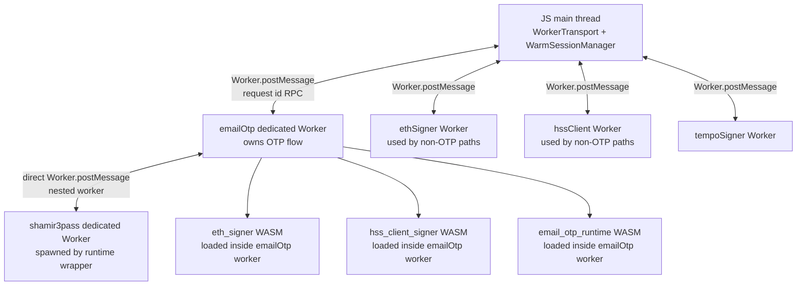
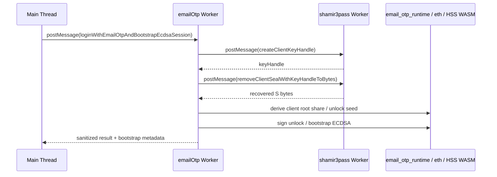

# OTP WASM Worker Refactor Plan

Date updated: April 16, 2026

## Objective

Move the Email OTP runtime out of JS main-thread orchestration and into a dedicated WASM-backed worker runtime.

After this refactor:

1. the JS main thread keeps only superficial product orchestration concerns
2. the worker owns all secret-bearing Email OTP logic
3. recovered secret `S` is unsealed and consumed inside worker-owned runtime state
4. `WarmSessionManager` remains on the JS main thread for policy decisions and warm-session lifecycle
5. legacy main-thread OTP secret plumbing is removed rather than retained behind compatibility layers

## Current Status

This refactor has started implementation.

What is already complete:

1. the refactor plan exists
2. the current core OTP system has already completed a separate hardening pass:
   - byte-owned recovered-secret handling
   - byte-oriented `shamir3pass` worker and WASM entrypoints
   - opaque worker-held `shamir3pass` key handles
   - stronger `WarmSessionManager` policy handling for Email OTP
3. that hardening work is a prerequisite and design input for this refactor, but it is not the refactor itself
4. the prerequisite core release-gate validation has been rerun successfully after the latest dedicated-worker bootstrap-prep shift
5. phase 1 worker scaffold is now in place:
   - a dedicated `emailOtp` worker kind exists
   - worker transport and request/response typing now recognize Email OTP operations
   - a worker-owned Email OTP fetch helper exists with shared auth and error normalization
   - the default runtime path now dispatches challenge and verify calls through the `emailOtp` worker
   - SDK build outputs now bundle `email-otp.worker.js`
6. the default Email OTP login-plus-unlock path now also runs inside the dedicated worker:
   - the worker owns `shamir3pass` unseal for the standard login path
   - the worker derives the unlock auth seed and client root share for the standard login path
   - the worker fetches and signs `/wallet/unlock/challenge` and submits `/wallet/unlock/verify`
   - the main thread no longer receives recovered `S` for the default login-plus-unlock flow
7. the default Email OTP enrollment path now also runs inside the dedicated worker:
   - the worker owns enrollment challenge, seal, and verify route composition for the standard enrollment path
   - the worker derives the unlock public key and threshold verifying share for that path
   - the worker performs the `shamir3pass` enrollment seal flow for that path
   - the main thread no longer walks the enrollment secret through JS when the default runtime path is used
8. the default Email OTP login-plus-bootstrap preparation path now also dispatches through the dedicated worker:
   - the worker owns login, verify, `shamir3pass` unseal, client-root-share derivation, and unlock proof generation for the default bootstrap-prep path
   - the worker returns sanitized bootstrap-prep metadata plus transferred `clientRootShare32` bytes
   - the default runtime no longer routes bootstrap preparation through the older string-result unlock bridge
9. the residual login-plus-bootstrap handoff is now byte-owned instead of string-backed:
   - the main-thread bootstrap wrapper now consumes a transient `clientRootShare32` byte buffer once and zeroizes it in `finally`
   - the HSS bootstrap worker/WASM boundary now accepts raw `clientRootShare32` bytes
   - transient bootstrap-share buffers are zeroized after the bootstrap call returns
10. the default internal Email OTP login bridge now runs the final ECDSA authorization-bootstrap ceremony inside the dedicated `emailOtp` worker:
   - the worker performs login, verify, `shamir3pass` unseal, unlock proof generation, HSS prepare/respond/finalize, and bootstrap finalization for the default internal path
   - the main thread receives sanitized recovery metadata plus final `ThresholdEcdsaSessionBootstrapResult`
   - the main thread only commits persistence, session-store upsert, policy metadata, and warm-session lifecycle state
11. `wasm/email_otp_runtime` now exists and owns the Email OTP HKDF derivation for the dedicated worker path:
   - threshold root, ECDSA client root share, and unlock auth seed derivation are implemented in WASM
   - worker-owned derivation no longer calls the shared JS HKDF helper for the default worker path
   - owned WASM inputs and HKDF intermediates are zeroized before returning
12. focused WASM derivation regression coverage now exists:
   - the unit suite compares `email_otp_runtime` outputs against the canonical byte-oriented JS derivation helpers
   - the suite rejects non-32-byte secrets at the WASM boundary
   - the suite asserts WASM outputs are caller-owned buffers that can be zeroized without corrupting later derivations
13. the default worker flow now supports the product-correct OTP challenge boundary:
   - enrollment, login-plus-unlock, login-plus-bootstrap-prep, and full login-plus-bootstrap operations accept an already-issued `challengeId`
   - the worker can verify the OTP against the challenge the user actually received instead of requiring a second freshly-created challenge
   - focused unit coverage asserts preissued challenge consumption without a duplicate challenge request
14. the production main-thread Email OTP secret-bearing compatibility paths have been deleted:
   - `emailOtp.ts` is now a public facade for challenge, verify, and enrollment dispatch
   - Email OTP login plus ECDSA bootstrap requires the dedicated `emailOtp` worker
   - the previous main-thread login/unlock/bootstrap helpers are no longer exported
15. public worker operations no longer return or accept caller-facing `clientRootShare32B64u` for Email OTP enrollment or login bootstrap:
   - enrollment returns public verifier material only
   - login bootstrap returns sanitized recovery metadata plus final bootstrap state
16. `shamir3pass` byte-oriented seal/unseal entrypoints are now required by the Email OTP worker path
17. the duplicate JS Email OTP derivation implementation has been moved out of production `shared/src` and into `tests/helpers` for parity tests only

Concrete residuals confirmed by the latest audit:

1. [emailOtp.ts](/Users/pta/Dev/rust/simple-threshold-signer/client/src/core/TatchiPasskey/emailOtp.ts) no longer owns a production Email OTP secret-bearing login/unlock/bootstrap path:
   - non-secret challenge and verify helpers may use direct fetch overrides for tests and simple public route calls
   - enrollment dispatches secret-bearing work through the dedicated `emailOtp` worker
   - login plus ECDSA bootstrap is worker-only
2. the runtime public Email OTP helper surface no longer accepts or returns caller-facing secret strings:
   - `completeEmailOtpUnlock(...clientSecretB64u)` has been deleted
   - deterministic enrollment override now accepts byte-owned `clientSecret32` instead of `clientSecretB64u`
3. [emailOtpDerivation.ts](/Users/pta/Dev/rust/simple-threshold-signer/tests/helpers/emailOtpDerivation.ts) now exists only as test/parity support:
   - production code uses `wasm/email_otp_runtime` for Email OTP derivation
   - `shared/src` no longer exports or contains the duplicate JS derivation helper

## Scope Split

### Keep on JS main thread

These are allowed to remain in JS main-thread code:

1. UI state and OTP input handling
2. app/session routing
3. public SDK method entrypoints and argument validation
4. `WarmSessionManager` policy decisions
5. high-level auth flow composition
6. non-secret result handling for UI and app state

### Move into dedicated worker-owned runtime

These should move behind a dedicated OTP worker boundary:

1. relayer networking for Email OTP flows
2. `shamir3pass` key generation, wrap, and unwrap calls
3. recovered secret `S` handling
4. Email OTP HKDF derivation from `S`
5. unlock key derivation
6. unlock proof generation
7. enrollment sealing flow
8. login plus unseal flow
9. login plus unlock flow
10. login plus ECDSA bootstrap preparation flow
11. secret zeroization and ownership enforcement

## Security Goal

The refactor is not about performance first. It is about reducing the number of JS main-thread locations that ever observe or retain secret-bearing material.

The target security model is:

1. `S` is decrypted only inside a worker-owned runtime
2. `S` is represented as bytes, not long-lived strings, wherever practical
3. HKDF intermediates and derived secret branches are zeroized inside the worker after final use
4. the main thread receives only the minimum result data required to continue the product flow

This is stronger than the current model because it reduces accidental main-thread retention, logging risk, string-backed secret propagation, and secret round-trips across multiple runtime layers.

## Target Architecture

### Worker communication model

The WASM modules do not communicate directly with each other. They are loaded by JS worker wrappers, and those wrappers communicate with `postMessage`.

Current communication topology:

OTP secret-bearing sequence:

Current rules:

1. main thread to top-level workers uses `Worker.postMessage`
2. `emailOtp` worker to `shamir3pass` worker uses direct nested `Worker.postMessage`
3. `MessagePort` and `MessageChannel` are not used in the current OTP worker graph
4. main thread does not relay `emailOtp` to `shamir3pass` traffic
5. `eth_signer`, `hss_client_signer`, and `email_otp_runtime` are WASM modules loaded directly inside `emailOtp` worker for the OTP path, not separate worker hops
6. recovered `S` crosses from `shamir3pass.worker` to `emailOtp.worker` as bytes, then derivation and bootstrap continue inside `emailOtp.worker`
7. a future hardening step could collapse `shamir3pass` WASM directly into `emailOtp.worker` so recovered `S` does not cross even a worker-to-worker `postMessage` boundary

### New worker

Add a dedicated worker kind:

1. `emailOtp`

This worker should initialize and own:

1. `shamir3pass_runtime`
2. `eth_signer`
3. a new `email_otp_runtime` WASM module for byte-oriented derivation

### Worker-owned modules

The intended module split is:

1. `shamir3pass_runtime`
   - client seal key generation
   - wrap and unwrap math
2. `email_otp_runtime`
   - decode `S`
   - derive threshold root
   - derive client root share
   - derive unlock auth seed
   - zeroize OTP-specific intermediates
3. `eth_signer`
   - secp256k1 public key derivation
   - unlock challenge signing
   - any other secp256k1 helper already used by OTP paths

### Main-thread shape after refactor

Main-thread OTP entrypoints should become thin facades:

1. validate public arguments
2. invoke one worker operation
3. receive sanitized result
4. hand non-secret outputs into `WarmSessionManager` or session bootstrap orchestration

The main thread should no longer directly:

1. call `getShamir3PassRuntime()` for Email OTP runtime flows
2. derive Email OTP secrets from recovered `S`
3. assemble secret-bearing Email OTP HTTP payloads
4. create unlock proofs from secret-derived material
5. receive raw `clientSecretB64u`

## Worker-owned Networking

Email OTP networking should move into the worker so the secret-bearing flow stays in the same runtime that owns unseal and derivation.

### Routes owned by worker

The worker should directly call:

1. `/wallet/email-otp/login/challenge`
2. `/wallet/email-otp/login/verify`
3. `/wallet/email-otp/unseal`
4. `/wallet/email-otp/registration/challenge`
5. `/wallet/email-otp/registration/seal`
6. `/wallet/email-otp/registration/finalize`
7. `/wallet/unlock/challenge`
8. `/wallet/unlock/verify`

### Networking rules

1. support both cookie and bearer-token auth where the current runtime does
2. normalize relayer errors in the worker before returning them to main thread
3. keep request-body assembly for secret-bearing routes inside the worker
4. do not bounce relayer payloads through main-thread helpers if the worker can submit them directly

## Worker API Shape

Prefer high-level operation APIs rather than exposing primitive worker RPC methods.

### Required worker operations

1. `emailOtpEnroll`
   - request enrollment challenge
   - generate or accept enrollment secret source
   - perform client seal flow
   - derive unlock public key
   - derive threshold verifying share
   - submit enrollment verify
   - return sanitized enrollment result
2. `emailOtpLoginAndUnlock`
   - request challenge
   - verify OTP
   - request unseal
   - unwrap secret inside worker
   - derive unlock proof
   - fetch unlock challenge
   - sign challenge
   - submit unlock verify
   - return sanitized unlock result
3. `emailOtpLoginAndBootstrapEcdsa`
   - perform full login plus unlock sequence
   - derive ECDSA bootstrap inputs inside worker
   - return final bootstrap-ready result with minimum necessary fields
4. `emailOtpRequestChallenge`
   - optional helper only if product flow needs a separate challenge step at UI layer

### API design rule

Do not expose worker operations that return raw recovered `S` to the main thread.

## Byte Ownership Model

### Core rules

1. secret-bearing data should use `Uint8Array` or worker-owned WASM memory while in runtime
2. base64url strings are allowed only at external boundaries
3. every secret-bearing owned buffer must have one clear owner and one clear zeroization point
4. worker outputs should be public or minimally necessary derived values only

### External-boundary exceptions

Base64url is still acceptable for:

1. HTTP payloads required by current relayer routes
2. persisted public metadata
3. transitional outputs where a downstream consumer still requires base64url

These exceptions should be treated as migration boundaries, not internal runtime storage strategy.

## Proposed WASM Additions

Create a new crate:

1. `wasm/email_otp_runtime`

### Responsibilities

1. decode `clientSecretB64u` into secret bytes
2. implement canonical HKDF-SHA-256 derivation for OTP branches
3. expose byte-oriented APIs for:
   - threshold root
   - threshold ECDSA client root share
   - unlock auth seed
4. zeroize:
   - decoded secret
   - PRK
   - threshold root
   - temporary tuple/info buffers where owned
   - any other owned secret intermediates

### Reason for separate module

This keeps OTP-specific derivation logic out of shared JS helpers and makes the worker runtime the only place where recovered `S` is consumed.

## Refactor Phases

### Phase 0: Planning and prerequisite hardening

Completed:

1. write the worker-refactor plan
2. harden the current core Email OTP implementation so the later worker split has a cleaner baseline
3. remove the app-facing legacy `shamir3pass` keypair path in favor of worker-held key handles

### Phase 1: Add worker transport and runtime scaffold

Completed:

1. add new `emailOtp` worker kind
2. add worker transport and request/response types
3. add worker lifecycle, initialization, timeout, and error handling
4. add worker-side fetch helper with consistent auth and error normalization
5. route default-runtime challenge and verify calls through the new worker

Done criteria:

1. main thread can dispatch Email OTP operations through the new worker
2. no OTP-specific worker transport code is embedded ad hoc in unrelated workers

### Phase 2: Move `shamir3pass` ownership into OTP worker

Completed for the default login-plus-unlock flow:

1. initialize `shamir3pass_runtime` inside the OTP worker
2. perform wrap and unwrap entirely in worker-owned flow for the standard login path
3. keep wrapped and unwrapped intermediate values inside the worker for that path
4. stop returning recovered `S` from the worker to the main thread in the standard login path

No remaining Phase 2 implementation work.

Done criteria:

1. default Email OTP login flow no longer unwraps secret `S` through main-thread helper code
2. recovered `S` is not returned from worker to main thread for the default login flow

### Phase 3: Move OTP derivation into WASM

Completed for the default worker path:

1. add `email_otp_runtime` crate
2. port tuple encoding and HKDF derivation logic from JS helper code
3. expose byte-oriented derivation APIs
4. add zeroization on success and error paths
5. make worker use WASM derivation instead of JS shared derivation helpers
6. add focused direct WASM parity and owned-buffer regression coverage

Completed cleanup:

1. the shared JS derivation helper has been quarantined into `tests/helpers` for parity tests only

Done criteria:

1. default Email OTP worker runtime no longer performs derivation through main-thread JS helper code
2. worker owns derivation of unlock auth seed and client root share

### Phase 4: Move unlock proof generation fully into worker

Completed for the default login-plus-unlock flow:

1. derive unlock private key in worker-owned runtime
2. call secp256k1 pubkey derivation in worker
3. fetch unlock challenge in worker
4. sign challenge in worker
5. submit unlock verify in worker
6. return only sanitized unlock result

No remaining Phase 4 implementation work.

Done criteria:

1. default login flow no longer assembles unlock proof flow on the main thread
2. default login flow keeps unlock key material inside worker-owned runtime

### Phase 5: Move enrollment flow fully into worker

Completed for the default enrollment flow:

1. move enrollment challenge request into worker
2. move seal request into worker
3. move enrollment secret generation or acceptance into worker-owned flow
4. derive unlock and verifying material in worker
5. submit enrollment verify in worker
6. return only final enrollment result

No remaining Phase 5 implementation work.

Done criteria:

1. default `enrollEmailOtpWallet` is reduced to a thin facade
2. default enrollment secret handling no longer occurs on the main thread

### Phase 6: Move login plus bootstrap flow behind worker boundary

Completed:

1. the default runtime now dispatches login plus bootstrap preparation through the dedicated `emailOtp` worker
2. the worker returns transferred `clientRootShare32` bytes and sanitized recovery metadata rather than reusing the older string-backed login result
3. the default internal Email OTP login bridge now dispatches the full authorization-bootstrap ceremony through the dedicated `emailOtp` worker when no test/compatibility overrides are present
4. the worker now performs the ECDSA HSS prepare/respond/finalize sequence for the default internal Email OTP path
5. the main thread commits only the final worker-returned bootstrap result into persistence, session-store state, policy metadata, and warm-session lifecycle checks

Completed cleanup:

1. the compatibility bootstrap-prep path has been deleted from the production runtime surface
2. the main-thread facade now handles policy, routing, enrollment dispatch, and final non-secret commit logic

Preferred target:

1. login
2. verify OTP
3. unseal
4. derive client root share or equivalent bootstrap input in worker
5. hand bootstrap-ready data into session/bootstrap logic with minimal leakage

Two acceptable sub-phases:

1. intermediate step
   - completed: worker returns derived bootstrap material if existing bootstrap path still requires it
2. target step
   - completed for the default internal bridge: worker directly drives the OTP-specific bootstrap path so main thread receives only final bootstrap outputs

Done criteria:

1. default internal path no longer orchestrates login plus unlock plus bootstrap with secret-bearing intermediates on the main thread
2. any temporary compatibility surface is explicitly marked and scheduled for removal

### Phase 7: Delete legacy main-thread OTP secret plumbing

Completed:

1. remove direct main-thread `shamir3pass` Email OTP runtime usage
2. remove direct main-thread Email OTP derivation calls from runtime path
3. remove direct main-thread secret-bearing fetch assembly for OTP routes
4. collapse duplicate helper layers introduced only to bridge old and new designs
5. keep only public facades and non-secret orchestration on main thread

Done criteria:

1. no duplicate old/new OTP runtime paths remain
2. runtime path no longer depends on legacy string-backed secret plumbing

## Main-thread code that should shrink or disappear

The following current responsibilities should move out of main-thread OTP runtime code:

1. relayer fetch helper ownership for secret-bearing OTP routes
2. `shamir3pass` runtime ownership in Email OTP flow
3. `clientSecretB64u` handling after unseal
4. Email OTP HKDF derivation from recovered `S`
5. unlock challenge signing flow composition
6. enrollment sealing flow composition

The intended end state is that `client/src/core/TatchiPasskey/emailOtp.ts` becomes a facade file instead of the place where secret-bearing orchestration happens.

## WarmSessionManager boundary

`WarmSessionManager` should stay on the JS main thread.

### Reason

1. it is already the place where app-facing policy decisions live
2. it controls warm-session lifecycle and retention policy
3. its state is product/runtime coordination state, not cryptographic primitive state

### Rule

`WarmSessionManager` decides policy, but the worker runtime must enforce the cryptographic and secret-lifecycle side of the chosen policy.

That means:

1. main thread selects `session` vs `per_operation`
2. worker decides whether to retain or discard worker-owned secret-bearing runtime state according to the selected policy and server bounds

## Iframe-Origin Ownership Follow-up

The current app-origin Email OTP path is acceptable as a temporary bridge, but the target wallet-iframe architecture should move Email OTP ownership into the wallet iframe origin.

### Target ownership boundary

The app origin should own only:

1. product UI state
2. Google SSO button rendering and visible auth-method selection
3. OTP input collection
4. app-level route transitions and status rendering
5. sanitized success, failure, and wallet metadata display

The wallet iframe origin should own:

1. the `TatchiPasskey` runtime used for Email OTP
2. the dedicated `emailOtp` worker and nested `shamir3pass` worker
3. Email OTP challenge, verify, enrollment, unseal, and bootstrap route calls
4. nonsecret wallet profile and account-projection persistence
5. threshold-ECDSA session metadata and opaque worker-session handles
6. `WarmSessionManager` lifecycle state for wallet signing capability when running in iframe mode
7. all secret-bearing Email OTP runtime state

### Rationale

This removes the need for app-origin IndexedDB access in wallet-iframe mode.

The app origin may still pass user-entered OTP values and public flow inputs to the wallet iframe, but it should not create a parallel SDK runtime that owns wallet metadata stores or Email OTP bootstrap state.

### Todo list

1. [x] Add wallet-iframe RPC methods for the current canonical SDK Email OTP operations: challenge request, enrollment challenge request, enrollment, login plus threshold-ECDSA bootstrap, and enrollment plus threshold-ECDSA bootstrap.
2. [x] Route `tatchi.auth.*EmailOtp*` SDK calls through the wallet iframe client when wallet-iframe mode is enabled.
3. [x] Keep OTP input in app-origin UI, but send the code only as a transient request payload to the wallet iframe.
4. [x] Add focused iframe RPC regression coverage proving Email OTP auth calls cross the wallet-iframe boundary and do not include app-origin generated `clientSecret32` in the normal flow.
5. [x] Route `PasskeyAuthMenu` Google SSO and Email OTP actions through only wallet-iframe-owned SDK calls when wallet-iframe mode is enabled.
6. [x] Move Google OIDC session exchange for Email OTP into the wallet iframe boundary, or define a minimal signed OIDC-token handoff from app origin to iframe origin with no wallet-store ownership on the app side.
7. [x] Store nonsecret Email OTP wallet metadata, account projections, and threshold session metadata only under the wallet iframe origin.
8. [x] Ensure all worker-owned Email OTP sessions and opaque threshold handles are scoped to the wallet iframe runtime, not app-origin runtime instances.
9. [x] Remove app-origin Email OTP uses of `PasskeyClientDB` and any app-origin threshold session persistence once iframe RPC coverage exists.
10. [x] Delete the temporary app-origin metadata IndexedDB mode after no wallet-iframe Email OTP flow depends on app-origin profile/account metadata persistence.
11. [x] Add tests proving wallet-iframe Email OTP registration, login, session-mode signing, and `per_operation` signing work with app-origin IndexedDB disabled.
12. [x] Add a regression test proving the app origin never receives recovered `S`, `clientRootShare32`, `clientAdditiveShare32B64u`, or Email OTP-derived signing share material.
13. [x] Add a reload test proving iframe-origin metadata can restore the nonsecret account view while requiring fresh OTP for any missing in-memory worker signing capability.
14. [x] Remove the current app-origin bridge for wallet-iframe mode; direct non-iframe SDK Email OTP worker paths remain the direct-mode runtime, not a wallet-iframe fallback.

### Done criteria

1. wallet-iframe mode can complete Google SSO plus Email OTP registration without app-origin IndexedDB
2. wallet-iframe mode can complete Google SSO plus Email OTP login without app-origin IndexedDB
3. wallet-iframe mode can sign through Email OTP `session` and `per_operation` policies
4. app-origin runtime never owns Email OTP wallet metadata stores or threshold session stores
5. app-origin runtime never sees Email OTP secret-source material or secret-derived signing shares
6. app-origin metadata IndexedDB mode is deleted

## Testing Plan

### Unit tests

1. worker request/response normalization
2. worker-owned fetch request formation
3. `email_otp_runtime` derivation vectors
4. zeroization of secret-bearing worker-owned buffers on success and error paths
5. OTP worker result surfaces do not expose raw recovered `S`

### Integration tests

1. Email OTP login plus ECDSA bootstrap succeeds through `loginWithEmailOtpAndBootstrapEcdsaSession`
2. worker-owned login/unlock/bootstrap result surfaces do not expose recovered `S` or caller-facing `clientRootShare32B64u`
3. `enrollEmailOtpWallet` still uploads canonical public verifier material
4. cookie and JWT session modes both work from worker-owned networking

### Cleanup and regression tests

1. no direct main-thread Email OTP runtime path still calls `getShamir3PassRuntime()`
2. no direct main-thread runtime path still calls Email OTP derivation helpers with recovered `S`
3. no worker result includes raw `clientSecretB64u`
4. stale worker-owned secret buffers are not reused across operations
5. `per_operation` mode discards worker-owned secret material immediately after final use

## Breaking Cleanup Requirements

This is a breaking refactor. We should remove old paths as we go.

Required cleanup rules:

1. do not keep a legacy main-thread OTP secret path around after worker path lands
2. do not keep duplicate helper layers that perform the same OTP runtime step in two places
3. do not preserve string-backed secret representations if byte-owned worker APIs are available
4. do not add feature flags for old vs new OTP runtime behavior

## Risks

1. worker-owned networking must be validated in all browser runtime environments we support
2. bootstrap integration may temporarily require an intermediate compatibility boundary
3. if downstream bootstrap code still requires base64url-derived secret material, we must treat that as temporary and close it promptly
4. error normalization must not accidentally surface sensitive internals from worker exceptions

## Acceptance Criteria

The refactor is complete when all of the following are true:

1. JS main thread only handles UI, routing, public API façade work, and `WarmSessionManager` policy decisions
2. Email OTP secret-bearing runtime flow executes inside a dedicated worker-owned runtime
3. `S` is decrypted only inside worker-owned runtime
4. Email OTP derivation no longer runs in main-thread JS runtime path
5. Email OTP networking for secret-bearing routes is worker-owned
6. direct main-thread `shamir3pass` runtime usage is removed from Email OTP flow
7. legacy main-thread OTP secret plumbing is deleted
8. tests cover zeroization, result-surface constraints, and worker-owned flow correctness

## Implementation Todo List

Completed:

1. write the OTP WASM-worker refactor plan
2. finish the prerequisite core Email OTP hardening that this refactor will build on
3. move the default Email OTP login-plus-bootstrap preparation subphase into the dedicated worker
4. delete the remaining public string-secret Email OTP runtime entrypoints from the current JS runtime layer
5. move the default internal Email OTP ECDSA authorization-bootstrap ceremony into the dedicated worker
6. add focused unit coverage for the default worker-owned full-bootstrap dispatch and final main-thread commit boundary
7. add `wasm/email_otp_runtime` and route default worker-owned Email OTP derivation through it
8. add focused worker/WASM regression tests for direct derivation parity and caller-owned zeroization boundaries
9. add preissued `challengeId` support to the worker-owned Email OTP login/enrollment/bootstrap APIs
10. delete production main-thread Email OTP login/unlock/bootstrap compatibility helpers
11. remove public Email OTP worker operations that returned transient bootstrap-share material
12. require byte-oriented `shamir3pass` seal/unseal entrypoints for Email OTP worker flows
13. move duplicate JS Email OTP derivation helpers out of production `shared/src` and into test-only parity support
14. rerun focused unit, relayer, E2E, type-check, and prepared-SDK build validation after the cleanup
15. close the UI login-state handoff for worker-owned Email OTP sessions:
    - React wallet-session readiness accepts active threshold-ECDSA Email OTP warm sessions
    - `PasskeyAuthMenu` refreshes SDK login state only after OTP submit succeeds
    - the demo carousel no longer advances to protected transaction UI before SDK login state is authoritative
16. begin iframe-origin Email OTP ownership:
    - add wallet-iframe RPC messages, router methods, and host handlers for current Email OTP auth operations
    - route app-origin `TatchiPasskey` Email OTP auth methods through the wallet iframe when enabled
    - add focused iframe routing regression coverage
17. move Google Email OTP session exchange behind the wallet-iframe SDK boundary:
    - add wallet-iframe RPC for Google Email OTP `/session/exchange`
    - expose `tatchi.auth.exchangeGoogleEmailOtpSession`
    - update the demo `PasskeyAuthMenu` Google SSO flow to hand the Google id token to the SDK instead of calling `/session/exchange` directly from app-origin code
18. delete app-origin IndexedDB persistence for wallet-iframe mode:
    - app-origin `TatchiPasskey` configures IndexedDB as disabled in iframe mode
    - nonsecret Email OTP account metadata and threshold-session metadata stay in the wallet-origin runtime
    - app-origin no longer keeps a metadata-only IndexedDB bridge
19. add focused wallet-iframe Email OTP ownership regression coverage:
    - registration/enrollment, login, session-mode signing, and `per_operation` signing route through the wallet iframe with app-origin IndexedDB disabled
    - app-origin iframe results strip recovered `S`, `clientRootShare32`, `clientAdditiveShare32B64u`, and other Email OTP-derived share material
20. add wallet-iframe reload regression coverage:
    - wallet-origin metadata restores the nonsecret account view
    - in-memory Email OTP signing capability is not restored across reload without fresh OTP

Remaining:

1. keep the focused Email OTP unit, relayer, E2E, and prepared-SDK build matrix as a standing release gate
2. close the remaining worker-boundary exceptions for secret-derived signing material:
   - decide whether Ed25519 `clientRootShare32` or `prfFirstB64u` handoffs are temporary compatibility exceptions or must move behind worker-owned opaque signing handles
   - decide whether transferred ECDSA `clientSigningShare32` handoffs to main thread are temporary compatibility exceptions or must move behind worker-owned signing
   - if any exception remains, document the exact owner, transfer, single-use, and zeroization semantics in the Email OTP signing specs
   - add tests proving app-origin iframe flows never receive recovered `S`, `clientRootShare32`, `clientAdditiveShare32B64u`, or equivalent secret-derived share strings
