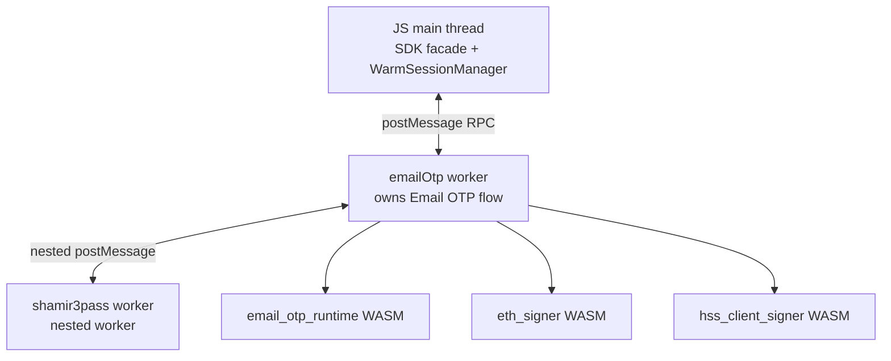

# Email OTP Architecture

Status: active source of truth for Email OTP identity, privacy, secret
ownership, worker runtime, registration reroll behavior, resend behavior,
sealed restore, signing, and key export.

This document consolidates the previous split Email OTP docs and
Email OTP-specific signing-session notes. Future refactors should edit this
document instead of reintroducing parallel Email OTP plans.

## Current Architecture Summary

Email OTP has four independent boundaries:

1. Authentication boundary: the user proves control of an email challenge.
2. Secret boundary: Email OTP secret material is reconstructed inside the
   dedicated Email OTP worker.
3. Lane boundary: transaction signing and export use one exact selected lane.
4. Session boundary: server state is authoritative for wallet signing-session
   validity and remaining budget.

Core rules:

1. Email OTP secrets are distinct from passkey PRF material.
2. Secret-bearing material stays worker-owned or encrypted at rest.
3. Status, snapshot, and wallet-session reads are side-effect-free.
4. Transaction signing restores only the exact selected lane.
5. Key export uses operation-specific authorization and exact export lanes.
6. ECDSA identity uses wallet id plus `ThresholdEcdsaChainTarget`, never a NEAR
   account id as its principal.
7. HSS prepare/finalize uses `walletSessionUserId` for session/audit scope and
   wallet id for ECDSA key identity.

## Implementation Status

Current production direction:

1. Hosted Email OTP account IDs use privacy-preserving HMAC-readable slugs.
2. The dedicated `emailOtp` worker is the production secret-bearing runtime.
3. Email OTP HKDF derivation runs through `wasm/email_otp_runtime`.
4. The default Email OTP enrollment, login, unlock, and ECDSA bootstrap paths are
   worker-owned.
5. Main-thread Email OTP secret-bearing compatibility paths are deleted.
6. Wallet-iframe mode owns Email OTP metadata, workers, sealed refresh state, and
   threshold-session state inside the wallet iframe origin.
7. Email OTP transaction signing and key export use exact selected lanes.
8. Resend is available on Email OTP unlock, transaction signing, registration,
   recovery, and key export screens.
9. The standing release gate is the manual and automated matrix at the bottom of
   this document.

## Identity Model

Email OTP participates in two different identity planes.

| Plane | Field | Meaning |
| --- | --- | --- |
| Wallet/session scope | `walletId` or `walletSessionUserId` | Authenticated wallet session, audit scope, server policy scope |
| NEAR account scope | `NearAccountRef` or `nearAccountId` | NEAR Ed25519 account identity |
| ECDSA lane scope | `walletId` plus exact lane identity | Threshold ECDSA wallet principal |
| ECDSA chain scope | `chainTarget: ThresholdEcdsaChainTarget` | Concrete EVM-family or Tempo target |

Funds-safety invariant: EVM SIGNERS MUST ALL SHARE THE SAME ADDRESS for the
same wallet, RP, signing root, and key version. Email OTP and passkey
ECDSA flows must converge on the same EVM-family `ecdsaThresholdKeyId` and owner
address. `chainTarget` scopes sessions, budgets, nonce lanes, sealed records,
and signing requests.

ECDSA lane identity includes:

```ts
type EcdsaLaneIdentity = {
  walletId: string;
  authMethod: 'email_otp' | 'passkey';
  curve: 'ecdsa';
  chainTarget: ThresholdEcdsaChainTarget;
  ecdsaThresholdKeyId: string;
  signingRootId: string;
  signingRootVersion: string;
  walletSigningSessionId: string;
  thresholdSessionId: string;
};
```

All exact ECDSA comparisons use the canonical lane key derived from this full
identity. Raw `evm` or `tempo` labels are accepted only at request/config
boundaries and are immediately normalized to `ThresholdEcdsaChainTarget`.

## Public Account ID Privacy

Hosted Email OTP registration must not create public NEAR account IDs that
encode the user's email address.

Unsafe examples:

```text
n6378056-gmail-com-1776502017920.w3a-relayer.testnet
u_<sha256(email)>.<relayer_root_account>
```

Hosted accounts use deterministic HMAC-generated readable slugs:

```text
brisk-maple-k7q9yh.w3a-relayer.testnet
```

Derivation:

```ts
context = [
  'near_account_slug_v1',
  projectId,
  envId,
  authProvider,
  providerSubject ?? verifiedEmail,
].join('\0');

seed = HMAC_SHA256(ACCOUNT_ID_DERIVATION_SECRET, context);
```

Recommended account-id format:

```ts
slug = `${adjective}-${noun}-${suffix}`;
accountId = `${slug}.${relayerRootAccount}`;
```

Rules:

1. Hosted account ID generation is owned by the server.
2. Client-provided hosted Email OTP account IDs are ignored or rejected.
3. The public account ID contains no raw email substring.
4. Plain email hashes are forbidden.
5. `ACCOUNT_ID_DERIVATION_SECRET` lives only in server-side secret storage.
6. Rotation is versioned with a new slug context, for example
   `near_account_slug_v2`.
7. Verified email remains private account metadata.

### Registration Rerolls

Google Email OTP registration account-name rerolls reuse the active registration
OTP challenge for the same provider subject, org, and app-session version. A
reroll only selects a new candidate wallet id and registration attempt. The
first code remains valid until it expires, and explicit resend remains the
operation that delivers a new code.

The durable identity mapping stores the relationship between verified identity
and public account:

```ts
type HostedAccountIdentityLink = {
  walletId: string;
  projectId: string;
  envId: string;
  authProvider: 'email_otp' | 'google_oidc' | string;
  providerSubject?: string;
  verifiedEmail?: string;
  nearAccountId: string;
  createdAt: string;
};
```

## Secret Model

Email OTP derives signing capability from Email OTP-specific secret material.

Stable flow:

1. Enrollment creates or binds Email OTP-specific secret material.
2. Login or step-up verifies a fresh Email OTP challenge.
3. The Email OTP worker reconstructs required signing material.
4. Transaction signing uses a threshold session tied to a
   `walletSigningSessionId`.
5. Durable sealed refresh records allow exact restore after page refresh while
   server budget remains valid.

Email OTP enrollment escrow uses split ownership:

```text
wallet iframe IndexedDB:
  enc_s(S)

server:
  C_i = ChaCha20-Poly1305_Encrypt(K_recovery_i, enc_s(S))
```

The server must not store direct `enc_s(S)`, plaintext `S`, recovery keys, or
derived recovery KEKs. App-origin code must not own `enc_s(S)`, `S`, recovery
keys, recovery KEKs, client root shares, or Email OTP-derived signing shares in
wallet-iframe mode.

## Storage Ownership

| Store | Owns |
| --- | --- |
| Email OTP worker memory | unsealed Email OTP secret material and hot signing material |
| iframe-origin IndexedDB | encrypted restore material plus non-secret lane identity |
| server | enrollment identity, challenge verification, session validity, wallet budget, recovery-wrapped escrow records |
| runtime session store | concrete current threshold-session records |
| JS memory | operation-local prepared identity |
| sessionStorage | optional UI/session marker only |

Durable sealed records are restore sources. They become current signing
authority only after the signing/export state machine selects and validates that
exact lane.

## Worker Runtime

Email OTP secret-bearing runtime executes inside a dedicated `emailOtp` worker.
The JS main thread remains a facade for UI, routing, public API argument
validation, `WarmSessionManager` policy decisions, and non-secret result
handling.

Worker communication topology:



The worker owns:

1. Email OTP challenge and verify requests for secret-bearing flows.
2. `shamir3pass` unwrap/seal operations.
3. recovered secret `S`.
4. Email OTP HKDF derivation.
5. unlock proof generation.
6. ECDSA HSS prepare/respond/finalize for Email OTP bootstrap.
7. zeroization of worker-owned secret buffers.

The main thread must not:

1. call `getShamir3PassRuntime()` for Email OTP runtime flows.
2. derive Email OTP secrets from recovered `S`.
3. assemble secret-bearing Email OTP HTTP payloads.
4. create unlock proofs from secret-derived material.
5. receive raw `clientSecretB64u`.
6. receive recovered `S`, `clientRootShare32`, `clientAdditiveShare32B64u`, or
   Email OTP-derived signing share material in wallet-iframe mode.

## Byte Ownership

Rules:

1. Secret-bearing values use `Uint8Array` or worker-owned WASM memory while in
   runtime.
2. Base64url strings are allowed at HTTP and persistence boundaries only.
3. Every owned secret buffer has one owner and one zeroization point.
4. Worker outputs are public values or minimally necessary non-secret metadata.
5. Test-only JS derivation helpers live under tests; production derivation uses
   `wasm/email_otp_runtime`.

## Wallet-Iframe Ownership

In wallet-iframe mode, the wallet iframe origin owns:

1. the `SeamsPasskey` runtime used for Email OTP.
2. the dedicated `emailOtp` worker and nested `shamir3pass` worker.
3. Email OTP challenge, verify, enrollment, unseal, bootstrap, and recovery
   route calls.
4. non-secret wallet profile and account-projection persistence.
5. threshold ECDSA session metadata and opaque worker-session handles.
6. `WarmSessionManager` lifecycle state.
7. all secret-bearing Email OTP runtime state.

The app origin owns:

1. UI state.
2. Google SSO button rendering and visible auth-method selection.
3. OTP input collection.
4. app-level route transitions and status rendering.
5. sanitized success, failure, and wallet metadata display.

## Transaction Signing

Email OTP transaction signing has two modes:

1. Session-retained signing uses the selected Email OTP lane while server budget
   is valid.
2. Per-operation step-up prompts for Email OTP and mints a single-operation
   replacement lane.

State machine:

```text
intent
  -> snapshot
  -> select exact lane
  -> exact restore
  -> readiness
  -> auth plan
  -> auth material
  -> budget admitted
  -> sign
  -> finalize selected lane
```

Rules:

1. Email OTP helpers verify challenges, mint sessions, restore exact material,
   and publish selected lane material.
2. Email OTP helpers may not choose another auth method.
3. Email OTP helpers may not publish another curve as the current transaction
   lane.
4. ECDSA step-up cannot make the next Ed25519 transaction skip Email OTP unless
   the Ed25519 state machine selected and validated that exact Ed25519 lane.
5. Transaction step-up mints `remainingUses = operationUsesNeeded`, normally
   `1`.

## Sealed Refresh

Sealed refresh lets a page reload preserve an already-authenticated signing
session when server budget remains valid.

The auth-method-neutral sealed-refresh spec lives in
[../signing-session-architecture/sealed-refresh.md](../signing-session-architecture/sealed-refresh.md).

Rules:

1. Refresh is normal runtime loss.
2. Missing worker memory is normal runtime loss.
3. Missing sessionStorage is normal runtime loss.
4. Budget exhaustion is the only reason a new Email OTP step-up is required for
   an otherwise valid session.
5. Restore is exact by selected lane identity.
6. Restore does not probe auth methods.
7. Restore does not change curve or chain target.
8. Status and snapshot reads do not unseal, restore, consume, delete, or prompt.

## Curve Boundaries

1. NEAR transaction signing uses Ed25519.
2. Tempo, Arc, and other EVM-family transaction signing use ECDSA.
3. One curve may persist durable companion material for another curve only as
   durable restorable state.
4. One curve may not publish the other curve as the current transaction lane.

## Key Export

Key export requires operation-specific fresh authorization. It must not:

1. mint or renew transaction signing sessions.
2. consume transaction signing budget.
3. clear transaction signing material.
4. overwrite current transaction records.
5. select from another chain target when the requested target has no exact lane.
6. reuse transaction challenge helpers.

Export flow:

```text
request
  -> normalize explicit export target
  -> read snapshot for that target
  -> resolve exactly one concrete export lane
  -> exact restore
  -> resolve material for the same lane
  -> authorize export
  -> export key
```

If multiple distinct export lanes exist, export returns `ambiguous_candidates`.
Duplicate records for the same exact lane identity are collapsed by canonical
lane identity before selection.

## Resend Code

All Email OTP screens expose a resend action when Email OTP is the active auth
method.

Product behavior:

1. The button label starts as `Resend code`.
2. After click, the UI shows `Code sent`.
3. During client debounce, the UI shows `Resend in 10s`.
4. Server rate-limit errors show `Too many requests. Try again shortly.`
5. Delivery failures show `Could not send code. Try again.`
6. The current OTP input value is preserved.
7. Resend does not auto-submit.
8. Resend updates the active `challengeId` when the server returns one.

Challenge semantics:

1. Multiple active challenges may exist for the same context.
2. Any unexpired unused code for the same context can verify.
3. A code is single-use.
4. Resend cannot change wallet, wallet-session user, channel, operation,
   app-session, ECDSA subject, ECDSA chain target, or challenge purpose.
5. Server-side rate limiting is authoritative.
6. Client debounce is UX protection only.

Recommended defaults:

```ts
type OtpResendPolicy = {
  clientDebounceMs: 10_000;
  serverChallengeTtlMs: 5 * 60_000;
  maxActiveChallengesPerContext: 5;
};
```

Valid resend context includes:

1. wallet id.
2. `walletSessionUserId`.
3. `otpChannel = 'email_otp'`.
4. operation, for example `wallet_unlock`, `transaction_sign`, `export_key`,
   `registration`, or `email_otp_device_recovery`.
5. app-session binding.
6. wallet id for ECDSA-authorizing challenges.
7. `chainTarget` for ECDSA-authorizing challenges.
8. registration or operation attempt id where applicable.

## Recovery Keys

Enrollment creates recovery-wrapped escrow records so a user can recover
device-local `enc_s(S)` if local storage is lost.

Rules:

1. Recovery resend only resends the recovery-scoped OTP challenge.
2. Recovery routes do not return recovery-wrapped escrow records until the user
   verifies a valid recovery challenge.
3. Successful recovery consumes one recovery key.
4. The product should prompt replacement rotation when the active recovery-key
   count drops below policy target.
5. Recovery-key lifecycle routes should cover status, consume, revoke, and
   rotate.

The user-facing backup UI plan lives in
[refactor-55-otp-recovery-codes-ui.md](refactor-55-otp-recovery-codes-ui.md).

## Logging And Observability

1. Production logs should avoid raw email except for explicit audit paths.
2. Development delivery modes may expose OTP code and raw email in local-only
   logs or in-memory outboxes.
3. Account IDs are public wallet identifiers and should not encode email.
4. Email OTP lifecycle audit payloads include wallet ids, challenge ids, policy
   decisions, and operation names.
5. Session/audit fields should use `walletSessionUserId`.
6. ECDSA lane fields should use exact lane identity and wallet id.

## Release Gates

Required validation:

1. New Email OTP registration creates a privacy-preserving public NEAR account
   id.
2. Email OTP unlock works in wallet-iframe mode with app-origin IndexedDB
   disabled.
3. Ed25519 and ECDSA transaction signing work before and after page refresh.
4. Session exhaustion prompts Email OTP and succeeds for Ed25519 and ECDSA.
5. Ed25519 and ECDSA key export use fresh operation authorization and succeed.
6. Resend works for wallet unlock, transaction signing, registration, recovery,
   and key export.
7. App-origin iframe results never contain recovered `S`, `clientRootShare32`,
   `clientAdditiveShare32B64u`, or equivalent signing share strings.
8. Production code has no Email OTP email-derived NEAR account id generation.
9. Production code has no main-thread Email OTP secret-bearing runtime path.
10. Production code has no ECDSA path deriving signer identity from `nearAccountId`.

## Related Specs

1. Signing-session architecture:
   [../signing-session-architecture/](../signing-session-architecture/).
2. Route auth planes:
   [../walletAuth-gating-routes.md](../walletAuth-gating-routes.md).
3. Threshold session token naming:
   [../signing-session-architecture/threshold-session-auth-token.md](../signing-session-architecture/threshold-session-auth-token.md).
4. Email OTP recovery codes UI:
   [refactor-55-otp-recovery-codes-ui.md](refactor-55-otp-recovery-codes-ui.md).
5. Future Email OTP/passkey add-key product plan:
   [addkey-otp-passkey-accounts.md](addkey-otp-passkey-accounts.md).
