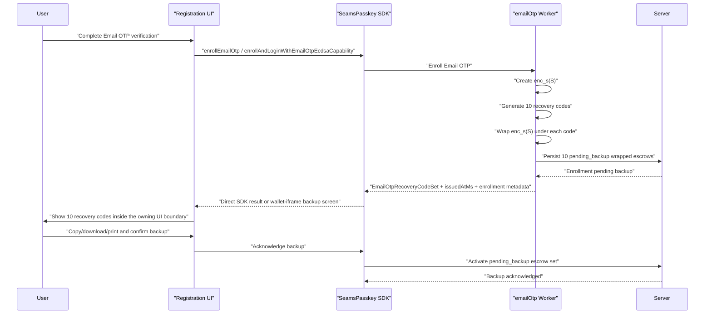

# Email OTP Recovery Codes UI Plan

Status: implementation plan.

This plan adds the product UI for backing up the 10 Email OTP recovery codes
generated during Email OTP enrollment. The cryptographic recovery mechanism
already exists in the worker/server model; this plan makes the backup step
visible, mandatory, and testable.

## Recovery Mechanism

Email OTP enrollment creates device-local enrollment escrow:

```text
enc_s(S)
```

`S` is the Email OTP client secret. `enc_s(S)` is stored in wallet-iframe
IndexedDB for same-device login. If local IndexedDB is lost, the user needs one
recovery code to restore `enc_s(S)`.

During enrollment, the Email OTP worker generates 10 one-time recovery keys:

```text
recovery_key_1 ... recovery_key_10
```

For each recovery key, the worker derives a recovery wrapping key and encrypts
the same device-local escrow:

```text
C_i = ChaCha20-Poly1305_Encrypt(K_recovery_i, enc_s(S))
```

With this UI lifecycle, the server stores 10 recovery-wrapped enrollment escrow
records:

```ts
type EmailOtpRecoveryWrappedEnrollmentEscrowRecord = {
  walletId: string;
  userId: string;
  authSubjectId: string;
  authMethod: 'google_sso_email_otp';
  enrollmentId: string;
  enrollmentVersion: string;
  enrollmentSealKeyVersion: string;
  signingRootId: string;
  signingRootVersion: string;
  recoveryKeyId: string;
  recoveryKeyStatus: 'pending_backup' | 'active' | 'consumed' | 'revoked';
  nonceB64u: string;
  wrappedDeviceEnrollmentEscrowB64u: string;
  aadHashB64u: string;
  issuedAtMs: number;
  updatedAtMs: number;
};
```

The server never stores the plaintext recovery keys, plaintext `enc_s(S)`,
plaintext `S`, recovery KEKs, or derived signing material.

Relevant implementation surfaces:

1. SDK enrollment result recovery-code field in
   `client/src/core/SeamsPasskey/interfaces.ts`.
2. recovery key generation and wrapping in
   `client/src/core/signingEngine/workerManager/workers/email-otp.worker.ts`.
3. formatting/normalization helpers in
   `shared/src/utils/emailOtpRecoveryKey.ts`.
4. server-side acknowledgement, consume, and failure routes:
   - `POST /wallet/email-otp/recovery-key/backup-acknowledge`
   - `POST /wallet/email-otp/recovery-key/consume`
   - `POST /wallet/email-otp/recovery-key/attempt-failed`
5. recovery unwrap prompt support in `PasskeyAuthMenu` for entering one recovery
   key on a new device or after local storage loss.

## Product Goal

After Email OTP enrollment succeeds, show the user the 10 recovery codes and make
them back up the codes before the setup flow can be treated as complete.

User-facing term:

```text
recovery code
```

Internal term:

```text
recovery key
```

The UI should never call them "secrets" in user-facing copy. "Recovery code" is
clearer and matches account-recovery expectations.

## Non-Goals

1. Do not store plaintext recovery codes in IndexedDB, localStorage,
   sessionStorage, analytics, logs, or server state.
2. Do not email recovery codes to the user.
3. Do not allow server-side recovery without one user-held recovery code.
4. Do not use recovery codes for transaction signing or key export.
5. Do not couple recovery-code backup to passkey recovery or NEAR account
   recovery.
6. Do not add a "temporary local recovery-code cache" to give the user more time
   to back up codes. Plaintext codes are memory-only.

## UX Flow



## Backup Screen Requirements

Create a dedicated recovery-code backup screen shown immediately after Email OTP
enrollment returns `recoveryKeys`.

Screen content:

1. Title: `Save your recovery codes`
2. Explanation: these codes restore Email OTP access if this browser/device is
   lost.
3. Warning: each code can be used once.
4. Warning: losing all codes may prevent restoring Email OTP on a new device.
5. The 10 codes in a scannable numbered list.
6. Primary `Download recovery codes` action.
7. Secondary `Copy all` action.
8. Secondary `Print` action where supported.
9. Checkbox: `I saved these recovery codes somewhere safe.`
10. Primary action: `Continue`.

Suggested copy:

```text
Save your recovery codes

These codes restore Email OTP access if this browser or device is lost.
Each code can be used once. Store them somewhere private, like a password
manager.
```

Recovery code display:

```text
01  008J-4CT4-ANK7-F24S-NAXW-SQFE-ZW83-4N3P
02  ...
...
10  ...
```

Use the existing formatting from `formatEmailOtpRecoveryKey(...)`. Codes are
8 groups of 4 Crockford Base32 characters.

## Confirmation Policy

First implementation:

1. `Download recovery codes` is the most prominent action on the screen.
2. Continue is disabled until the user completes at least one backup action:
   download, copy, or print.
3. Continue is also disabled until the user checks the backup acknowledgement.
4. The checkbox state is UI memory only until the owning UI boundary submits
   backup acknowledgement.
5. Server-side backup acknowledgement records non-secret lifecycle completion
   only. It provides no cryptographic proof of backup.
6. The plaintext recovery codes are cleared from React state after the user
   continues.
7. The plaintext recovery codes are also cleared if the user cancels, closes the
   modal, navigates away, reloads, or the registration UI unmounts.
8. If the backup step is abandoned before acknowledgement, the app must not rely
   on the generated codes. The generated server records remain `pending_backup`
   and excluded from recovery use. The next setup attempt must revoke, delete, or
   expire that pending set before generating a fresh set of 10 codes.

Backup action completion semantics:

1. Download counts after the component builds the file from current in-memory
   props, creates a Blob URL, dispatches the download click without throwing, and
   schedules URL revocation. A thrown browser error leaves the action incomplete.
2. Copy counts after `navigator.clipboard.writeText(...)` resolves. If the
   Clipboard API is unavailable or rejects, show a selectable manual-copy view
   and count completion only after the user activates `I copied these codes`.
3. Print counts after `window.print()` is invoked from a user gesture in a
   browser that supports it. The UI may record only `printDialogOpened`; browsers
   do not expose a reliable printed-page signal.
4. Backup-action completion state is memory-only and resets when the backup
   screen unmounts.

Optional stronger follow-up:

1. Ask the user to re-enter one randomly selected code before continuing.
2. Validate locally with `normalizeEmailOtpRecoveryKey(...)`.
3. Do not send the typed code to the server.
4. Clear the typed code immediately after local validation.

Do the checkbox-only flow first. Add re-entry only if product requires stronger
friction.

## State Ownership

Plaintext recovery codes may exist only in:

1. worker memory during generation.
2. the direct SDK enrollment result returned to a trusted same-origin
   registration UI.
3. wallet-iframe internal messages and wallet-iframe UI memory while the backup
   screen is displayed.
4. clipboard, downloaded file, printed page, or password manager after explicit
   user action.

Plaintext recovery codes must not exist in:

1. server storage.
2. IndexedDB.
3. localStorage or sessionStorage.
4. logs.
5. analytics or telemetry events.
6. SDK progress events.
7. crash reports.
8. wallet-iframe host RPC payloads.

Wallet-iframe mode has a stricter presentation boundary than direct SDK mode.
The wallet iframe owns the recovery-code backup screen and returns only
non-secret acknowledgement metadata to the host page. The host page must never
receive generated `recoveryKeys` through iframe RPC, logs, progress events, or
registration result payloads.

IndexedDB may store only non-secret backup state. It must never store the
plaintext recovery codes, recovery wrapping keys, recovery KEKs, `enc_s(S)` for
backup display, or a serialized backup-screen payload.

Allowed non-secret backup metadata:

```ts
type EmailOtpRecoveryCodeSetLifecycle =
  | {
      status: 'pending_backup';
      walletId: string;
      enrollmentId: string;
      recoveryCodeCount: 10;
      issuedAtMs: number;
    }
  | {
      status: 'active';
      walletId: string;
      enrollmentId: string;
      recoveryCodeCount: 10;
      issuedAtMs: number;
      acknowledgedAtMs: number;
      activeRecoveryCodeCountAtAcknowledgement: 10;
    }
  | {
      status: 'abandoned';
      walletId: string;
      enrollmentId: string;
      recoveryCodeCount: 10;
      issuedAtMs: number;
      abandonedAtMs: number;
      cleanupReason:
        | 'registration_cancelled'
        | 'registration_restarted'
        | 'rotation_restarted'
        | 'pending_backup_expired';
    };

type EmailOtpRecoveryCodeBackupStatus = Extract<
  EmailOtpRecoveryCodeSetLifecycle,
  { status: 'active' }
>;
```

This record proves only that the UI step was completed. It must not contain the
codes.

Pending backup UI state should remain in memory. The server may persist the
non-secret `pending_backup` lifecycle state for recovery-wrapped escrow records,
and those records are excluded from active recovery-code counts, status
responses, and recovery consumption until acknowledgement activates them.
Persisted pending state must never enable redisplaying the same plaintext codes
after reload.

## UI Integration Points

### SDK Result

Enrollment results must carry a normalized fixed-size recovery-code set and the
issuance timestamp used for the backup file:

```ts
declare const emailOtpRecoveryCodeBrand: unique symbol;

type EmailOtpRecoveryCode = string & {
  readonly [emailOtpRecoveryCodeBrand]: true;
};

type EmailOtpRecoveryCodeSet = readonly [
  EmailOtpRecoveryCode,
  EmailOtpRecoveryCode,
  EmailOtpRecoveryCode,
  EmailOtpRecoveryCode,
  EmailOtpRecoveryCode,
  EmailOtpRecoveryCode,
  EmailOtpRecoveryCode,
  EmailOtpRecoveryCode,
  EmailOtpRecoveryCode,
  EmailOtpRecoveryCode,
];

type EmailOtpEnrollmentResult = {
  recoveryKeys: EmailOtpRecoveryCodeSet;
  recoveryCodesIssuedAtMs: number;
  challengeId: string;
  otpChannel: WalletEmailOtpChannel;
  enrollmentSealKeyVersion: string;
  clientUnlockPublicKeyB64u: string;
  unlockKeyVersion: string;
  thresholdEcdsaClientVerifyingShareB64u: string;
};
```

Do not make `recoveryKeys` or `recoveryCodesIssuedAtMs` optional. Enrollment
either returns exactly 10 normalized recovery codes with an issuance timestamp or
fails. Validate and normalize raw worker output once at the worker/SDK boundary
with `normalizeEmailOtpRecoveryKey(...)`, then pass `EmailOtpRecoveryCodeSet`
through UI code.

### React Component

Add a component:

```text
client/src/react/components/EmailOtpRecoveryCodesBackup/
```

Suggested files:

```text
EmailOtpRecoveryCodesBackup.tsx
EmailOtpRecoveryCodesBackup.css
index.ts
```

Props:

```ts
type EmailOtpRecoveryCodesBackupBaseProps = {
  walletId: string;
  recoveryCodes: EmailOtpRecoveryCodeSet;
  recoveryCodesIssuedAtMs: number;
  onContinue(): void;
};

type EmailOtpRecoveryCodesBackupProps =
  | (EmailOtpRecoveryCodesBackupBaseProps & { mode: 'blocking' })
  | (EmailOtpRecoveryCodesBackupBaseProps & {
      mode: 'cancelable';
      onCancel(): void;
    });
```

Rules:

1. `recoveryCodes` is already a normalized `EmailOtpRecoveryCodeSet`.
2. The boundary normalizer enforces exactly 10 codes.
3. The component formats with `formatEmailOtpRecoveryKey(...)`.
4. Download is visually primary; copy and print are secondary.
5. The component does not persist codes.
6. The component clears any local copied/downloaded text buffer after action
   completion where the browser API permits it.
7. The component clears plaintext code state on unmount.
8. The component tracks `hasCompletedBackupAction` in memory only.
9. `Continue` requires `hasCompletedBackupAction && acknowledgementChecked`.

### Registration Flow

Wire the component after successful Email OTP enrollment:

1. `SeamsPasskey.auth.enrollEmailOtp(...)`
2. `SeamsPasskey.auth.enrollAndLoginWithEmailOtpEcdsaCapability(...)`
3. wallet-iframe registration flows inside the iframe UI boundary.

The UI should pause the registration completion path until backup is
acknowledged.

Direct SDK mode boundary:

```text
worker returns EmailOtpRecoveryCodeSet
  -> SDK validates and returns EmailOtpRecoveryCodeSet to trusted registration UI
  -> trusted registration UI displays and acknowledges
  -> SDK activates pending_backup escrow set
  -> UI drops EmailOtpRecoveryCodeSet from state
```

Wallet-iframe mode boundary:

```text
worker returns EmailOtpRecoveryCodeSet inside wallet iframe
  -> wallet iframe displays and acknowledges
  -> wallet iframe activates pending_backup escrow set
  -> wallet iframe returns non-secret backup acknowledgement metadata to host
  -> wallet iframe drops EmailOtpRecoveryCodeSet from state
```

Iframe RPC payloads to host code must carry only non-secret lifecycle metadata.
They must never carry generated `recoveryKeys`.

Server activation and abandoned-backup cleanup:

1. Enrollment persists the 10 recovery-wrapped escrows with
   `recoveryKeyStatus: 'pending_backup'`.
2. `pending_backup` records are excluded from
   `activeRecoveryWrappedEnrollmentEscrowCount`, recovery status responses, and
   recovery-key consumption.
3. After the user completes a backup action and checks the acknowledgement, the
   owning UI boundary calls
   `POST /wallet/email-otp/recovery-key/backup-acknowledge` with non-secret
   enrollment identifiers. The route atomically switches the matching
   `pending_backup` set to `active`, records `acknowledgedAtMs`, and returns
   `EmailOtpRecoveryCodeBackupStatus`.
4. If the user abandons backup, the owning UI boundary marks setup incomplete
   and drops the plaintext codes. The next setup attempt must revoke or delete
   the old `pending_backup` set before generating a replacement set.
5. The server may expire stale `pending_backup` sets and mark them `abandoned`
   with `cleanupReason: 'pending_backup_expired'`.

Do not recover this case by storing plaintext codes locally.

## Download Format

Downloaded file name:

```text
seams-email-otp-recovery-codes-<walletId>.txt
```

Build `<walletId>` from a filename-safe wallet label by allowing ASCII letters,
digits, `_`, `.`, and `-`, and replacing every other character with `_`.

File body:

```text
Seams Email OTP recovery codes

Wallet: <walletId>
Created: <ISO timestamp>

Store these codes somewhere private. Each code can be used once.

01  <code>
02  <code>
...
10  <code>
```

`Created` is derived from `recoveryCodesIssuedAtMs`, formatted as an ISO
timestamp at render/download time.

The file must not include `enc_s(S)`, `S`, recoveryKeyId values, session ids,
threshold key ids, or signing roots.

Download implementation rules:

1. Build the file contents from current in-memory props.
2. Use a Blob URL and revoke it immediately after triggering the download.
3. Do not store the generated text in component state after the click handler
   returns.
4. Record only the non-secret fact that a download action completed.
5. If download fails, keep the codes visible and show copy/print fallbacks.

## Account Settings Follow-Up

Add an account-settings section:

```text
Email OTP recovery codes
```

Display:

1. active recovery-code count.
2. consumed recovery-code count.
3. revoked recovery-code count.
4. last rotation time.
5. action to rotate/recreate a full set of 10 codes.

Required server routes for full lifecycle:

1. `POST /wallet/email-otp/recovery-key/backup-acknowledge`
2. `GET or POST /wallet/email-otp/device-escrow/status`
3. `POST /wallet/email-otp/recovery-key/revoke`
4. `POST /wallet/email-otp/recovery-key/rotate`

Rotation behavior:

1. Requires fresh Email OTP or equivalent account auth.
2. Rewraps current `enc_s(S)` under 10 newly generated recovery codes.
3. Atomically replaces the active server-side recovery-wrapped escrow set.
4. Displays the new 10 codes in the same backup UI.
5. Marks old active codes revoked or deletes them according to server policy.

Successful device recovery currently returns
`activeRecoveryWrappedEnrollmentEscrowCount`. If the count drops below 10, prompt
the user to rotate and restore the set to 10 active recovery codes.

## Error Handling

Backup screen errors:

1. Clipboard failure: show manual-copy fallback and keep the codes visible.
2. Download failure: show copy/print alternatives.
3. Print failure: show copy/download alternatives.
4. Backup acknowledgement route failure: keep the codes visible, keep
   `Continue` disabled, and allow retry.
5. User closes the modal: keep registration in a pending backup state or show an
   explicit confirmation that leaving discards the displayed codes and requires
   restarting or rotating recovery-code setup.

Recovery use errors:

1. Invalid format: validate locally before server interaction.
2. Wrong code: report failure through
   `/wallet/email-otp/recovery-key/attempt-failed`.
3. Consumed/revoked code: show a clear recovery-code error.
4. Active count below 10 after successful recovery: show rotation prompt.

## Security Requirements

1. Never log plaintext recovery codes.
2. Never include plaintext recovery codes in SDK events.
3. Never include plaintext recovery codes in server route payloads. A
   user-entered recovery code may travel only in the local worker unwrap request.
4. Never send generated recovery codes back to the server during enrollment.
5. Redact `recoveryKeys` in debug output and error serialization.
6. Add static/architecture tests that fail if `recoveryKeys` appears in
   telemetry, analytics, or progress event payloads.
7. Browser autocomplete should be disabled for recovery-code display and entry
   fields.
8. Recovery-code entry should accept paste and normalize spaces/dashes.
9. Never store generated recovery codes in IndexedDB to preserve them for later
   backup.
10. Wallet-iframe host RPC payloads must never include generated `recoveryKeys`.
11. `backup-acknowledge` route payloads must contain only non-secret enrollment
    identifiers and acknowledgement metadata.

## Implementation Steps

### Phase 1: Current Surface Audit

1. Confirm every Email OTP enrollment path returns an `EmailOtpRecoveryCodeSet`
   with exactly 10 normalized `recoveryKeys` and `recoveryCodesIssuedAtMs`.
2. Confirm direct SDK enrollment results expose `recoveryKeys` only to trusted
   same-origin registration UI.
3. Confirm wallet-iframe host RPC payloads never expose generated
   `recoveryKeys`; the iframe owns backup display and returns only non-secret
   acknowledgement metadata.
4. Confirm SDK progress events do not include `recoveryKeys`.
5. Confirm logs redact `recoveryKeys`.
6. Confirm no IndexedDB/localStorage/sessionStorage code persists
   `recoveryKeys` or generated recovery-code text.

Files:

1. `client/src/core/SeamsPasskey/interfaces.ts`
2. `client/src/core/SeamsPasskey/emailOtp.ts`
3. `client/src/core/SeamsPasskey/index.ts`
4. `client/src/core/WalletIframe/shared/messages.ts`
5. `client/src/core/WalletIframe/router.ts`
6. `client/src/core/WalletIframe/host/wallet-iframe-handlers.ts`
7. `client/src/core/signingEngine/workerManager/workers/email-otp.worker.ts`

### Phase 2: Backup Component

1. Add `EmailOtpRecoveryCodesBackup`.
2. Accept `EmailOtpRecoveryCodeSet` and `recoveryCodesIssuedAtMs` props.
3. Use existing recovery-key formatting helpers.
4. Add primary download action.
5. Add secondary copy and print actions.
6. Add acknowledgement checkbox.
7. Gate continue on one completed backup action plus acknowledgement.
8. Implement explicit completion semantics for download, copy, manual copy, and
   print.
9. Add redaction-safe component tests.

Files:

1. `client/src/react/components/EmailOtpRecoveryCodesBackup/**`
2. `shared/src/utils/emailOtpRecoveryKey.ts`
3. `tests/unit/emailOtpRecoveryCodesBackup.unit.test.ts`

### Phase 3: Registration UI Integration

1. Show backup UI after `enrollEmailOtp`.
2. Show backup UI after `enrollAndLoginWithEmailOtpEcdsaCapability`.
3. Render wallet-iframe backup UI inside the iframe boundary.
4. Pause completion until acknowledgement.
5. Add and call `POST /wallet/email-otp/recovery-key/backup-acknowledge` after
   local UI acknowledgement and activate the matching `pending_backup` set.
6. Clear codes from state after continuation.
7. Persist non-secret backup acknowledgement metadata if the product needs a
   setup-complete indicator.
8. Treat abandoned backup as unrecoverable plaintext-code loss. Revoke or delete
   the old `pending_backup` set before restart or authenticated recovery-code
   rotation can create a replacement set.

Likely integration points:

1. `client/src/react/components/PasskeyAuthMenu/**`
2. demo registration/login containers that call `seams.auth.enrollEmailOtp`
3. wallet-iframe registration UI surfaces
4. wallet-iframe host handlers that receive non-secret backup acknowledgement
   metadata

### Phase 4: Settings And Rotation

1. Add recovery-code status route.
2. Add revoke route.
3. Add rotate route.
4. Add account-settings recovery-code status UI.
5. Add rotate flow using the same backup component.
6. Prompt rotation after recovery when active count is below 10.

Server files:

1. `server/src/router/routeDefinitions.ts`
2. `server/src/router/express/routes/sessions.ts`
3. `server/src/router/cloudflare/routes/sessions.ts`
4. `server/src/core/AuthService.ts`
5. `server/src/core/EmailOtpStores.ts`

Client files:

1. `client/src/core/SeamsPasskey/emailOtp.ts`
2. `client/src/core/WalletIframe/shared/messages.ts`
3. account settings UI modules

### Phase 5: Tests

Add tests for:

1. enrollment result contains an `EmailOtpRecoveryCodeSet` with exactly 10
   formatted recovery codes.
2. backup screen renders all 10 codes.
3. Download recovery codes is the primary action.
4. Continue is disabled until a backup action completes according to explicit
   action semantics.
5. Continue is disabled until acknowledgement.
6. copy/download output contains only wallet id, timestamp, and recovery codes.
7. download timestamp comes from `recoveryCodesIssuedAtMs`.
8. Blob URL is revoked after download.
9. UI clears recovery codes from component state after continue.
10. SDK progress events never include `recoveryKeys`.
11. logs and error objects redact `recoveryKeys`.
12. wallet-iframe host RPC payloads never include generated `recoveryKeys`.
13. pending backup records are excluded from active counts and recovery
    consumption.
14. backup acknowledgement activates exactly the matching pending set.
15. abandoned backup revokes, deletes, or expires the old pending set before
    replacement.
16. recovery-code entry normalizes lowercase, spaces, and dashes.
17. used recovery code consumes exactly one active server record.
18. post-recovery active count below 10 triggers rotation prompt.
19. IndexedDB/localStorage/sessionStorage never receive generated recovery codes.
20. abandoned backup cannot redisplay the old plaintext recovery codes after
    reload.

## Acceptance Criteria

1. New Email OTP enrollment cannot complete silently without giving the user the
   10 recovery codes.
2. The user can download the 10 recovery codes with one prominent button.
3. The user can also copy or print the 10 codes.
4. Continue requires a completed backup action and acknowledgement.
5. The UI clearly says each code can be used once.
6. The app does not persist plaintext recovery codes after acknowledgement.
7. The app does not persist plaintext recovery codes before acknowledgement.
8. The server never receives generated plaintext recovery codes.
9. Wallet-iframe host code never receives generated recovery codes.
10. Pending backup escrows become active only after backup acknowledgement.
11. Abandoning the backup screen revokes, deletes, or expires the old pending set
    before restart or authenticated rotation creates replacement codes.
12. Existing device-recovery prompt still accepts one formatted recovery code.
13. Successful recovery consumes one code and surfaces the remaining active count.
14. Account settings can show recovery-code status and rotate back to 10 active
   codes.
15. Tests prove recovery codes are redacted from events, logs, and persistent
   stores.

## Related Docs

1. Email OTP architecture:
   [email-otp.md](email-otp.md).
2. Signing-session architecture:
   [../signing-session-architecture/](../signing-session-architecture/).
