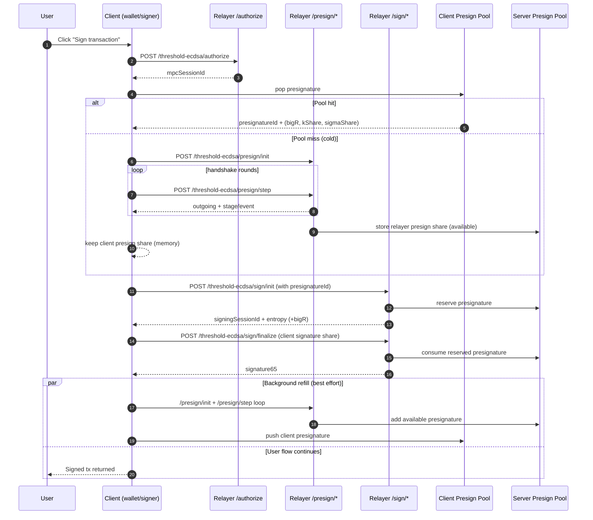
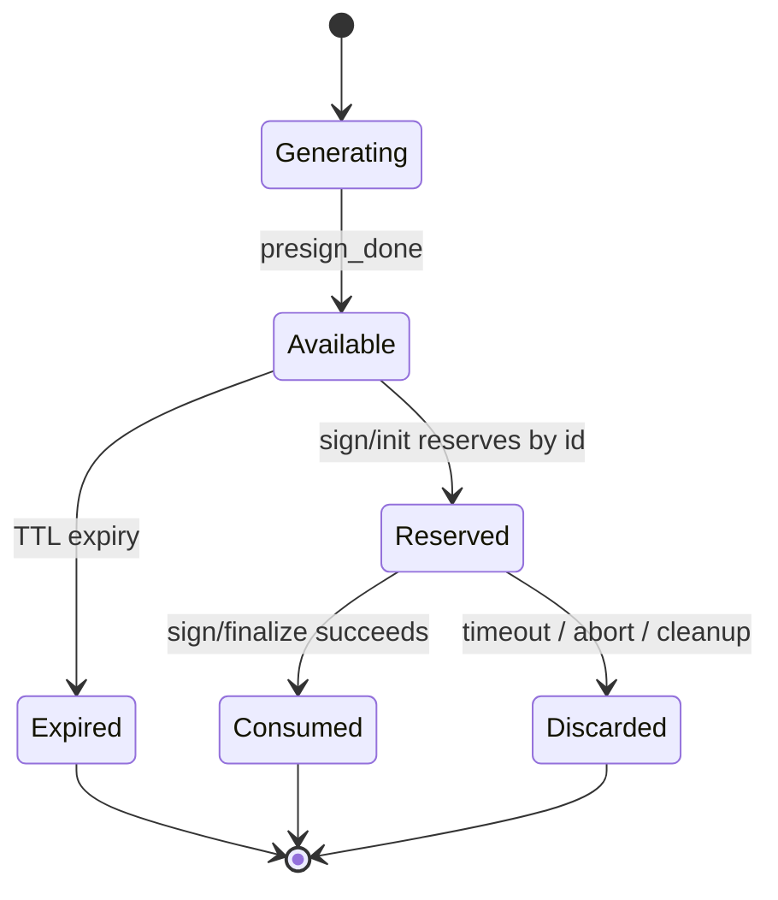

# Threshold ECDSA Presigning Pool and Signing Lifecycle

Last updated: 2026-02-25

## 1. Scope

This document covers the full lifecycle of threshold ECDSA signing in this repo:

1. Session/bootstrap and authorize
2. Foreground transaction signing (pool hit vs cold miss)
3. Background presign pool refill
4. Timing profile from observed logs
5. Security and secrecy requirements for presign artifacts

Terminology used below:

- Foreground sign: the user-initiated sign operation that must return a signature now.
- Presign pool refill: background generation of future presignatures.
- Presignature: one-time Cait-Sith preprocessing material identified by `presignatureId`.

## 2. End-to-End Lifecycle

## 3. Which Operations Are Presign vs Actual Tx Signing

| Operation | Class | Endpoint(s) | Purpose |
|---|---|---|---|
| Threshold session bootstrap | Session/Auth | `/threshold-ecdsa/bootstrap` | Create threshold session + token/cookie binding |
| Sign authorization | Session/Auth | `/threshold-ecdsa/authorize` | Mint/consume short-lived MPC session id (`mpcSessionId`) |
| Presign init | Presign (Cait-Sith preprocessing) | `/threshold-ecdsa/presign/init` | Start one presignature handshake |
| Presign step | Presign (Cait-Sith preprocessing) | `/threshold-ecdsa/presign/step` | Advance triples/presign rounds until `presign_done` |
| Sign init | Actual tx signing | `/threshold-ecdsa/sign/init` | Bind digest + presignature and get relayer round-1 data |
| Sign finalize | Actual tx signing | `/threshold-ecdsa/sign/finalize` | Combine shares and return final 65-byte signature |

Important: `/presign/*` is preprocessing, not the final transaction signature itself.

## 4. Timing Profile (Observed)

Measured from your recent server logs.

| Operation | Class | Typical server duration |
|---|---|---|
| `/threshold-ecdsa/bootstrap` | Session/Auth | ~18ms |
| `/threshold-ecdsa/authorize` | Session/Auth | ~4-10ms |
| `/threshold-ecdsa/presign/init` | Presign | ~20-35ms |
| `/threshold-ecdsa/presign/step` (normal) | Presign | ~740-1150ms per step |
| `/threshold-ecdsa/presign/step` (under contention) | Presign | ~1800-2300ms per step |
| `/threshold-ecdsa/sign/init` | Actual signing | ~7-10ms |
| `/threshold-ecdsa/sign/finalize` | Actual signing | ~24-35ms |

Cold foreground sign usually includes one full presign handshake:

- 1 x `presign/init`
- about 6 x `presign/step` in observed traces
- then `sign/init` + `sign/finalize`

So cold path is usually dominated by presign steps (often several seconds).

### 4.1 Benchmark Snapshot (CI SLO Gate)

Run metadata:

1. Date: 2026-02-25
2. Run ID: `20260225-091017Z`
3. Raw artifacts: `benchmarks/threshold-ecdsa-presign/out/20260225-091017Z`
4. Generated report: `docs/benchmarks/threshold-ecdsa-presign.md`

Key latency results from that run:

| Scenario | p95 end-to-end (ms) | Notes |
|---|---:|---|
| `cold_first_sign_no_pool` | 2226 | Cold first sign with empty pool |
| `warm_sign_pool_hit` | 24 | Warm sign with available presignature |
| `background_refill_contention` | 4205 | Foreground sign while refill is active |
| `multi_runtime_contention` | 6267 | Duplicate runtime pressure |
| `replay_fallback_path` | 7018 | Forced fallback path (availability safety path) |

Key presign-step and gate metrics:

| Metric | Value |
|---|---:|
| `/threshold-ecdsa/presign/step` p95 | 783ms |
| `/threshold-ecdsa/presign/step` p99 | 783ms |
| Non-fallback `liveCacheHitRatio` | 100% |
| Non-fallback `replayFallbackRatio` | 0% |
| Replay-fallback scenario `replayFallbackRatio` | 100% |

CI benchmark SLO gate thresholds and result:

| Gate | Threshold | Actual | Result |
|---|---:|---:|---|
| `first_sign_p95_ms` | <= 4000 | 2226 | pass |
| `warm_sign_p95_ms` | <= 1500 | 24 | pass |
| `presign_step_p95_ms` | <= 1400 | 783 | pass |
| `presign_step_p99_ms` | <= 2000 | 783 | pass |
| `replay_fallback_ratio_nonfallback_max` | <= 0.01 | 0.00 | pass |

### 4.2 Full CI Mirror Status (Same Validation Session)

This benchmark run passed its gate, but the full local CI mirror was not fully green in the same session.

| Command | Result | Notes |
|---|---|---|
| `pnpm check` | fail | Existing lint issues in current workspace |
| `pnpm build:sdk-prod` | pass | SDK prod build completed |
| `pnpm -C sdk smoke:eth-signer:runtimes` | pass | Runtime smoke tests passed |
| `pnpm test:threshold-core` | fail | Failing assertion at `tests/relayer/threshold-ecdsa.signature-harness.test.ts:396` |
| `pnpm test:signers:gates` | pass | Signer gate suite passed |

Interpretation: benchmark stability and CI SLO gating are confirmed for threshold ECDSA presign, while separate non-benchmark failures remain for full CI closure.

## 5. Why Logs Continue After Signature Is Returned

Yes, those post-sign `/presign/*` logs are typically background refill.

Current signer behavior:

1. On commit start: may schedule refill if pool depth and policy trigger it.
2. On sign success: schedules refill again toward target depth.
3. Refill runs asynchronously and can continue after the user already got the signature.

Current defaults:

- `targetDepth: 3`
- `lowWatermark: 1`
- `maxRefillInFlight: 1`

Scope of these settings:

1. `targetDepth` and `lowWatermark` are per presign pool key (effectively per account/credential scope), where pool key = `relayerUrl + relayerKeyId + clientVerifyingShareB64u + participantIds`.
2. `maxRefillInFlight` is a runtime-global limiter (per client runtime/tab/process), not per account.
3. Server presignature storage is partitioned by `relayerKeyId`, so the server is not using one undifferentiated global pool for all accounts.

With these defaults, some post-sign background presign traffic is expected, but contention is lower than prior aggressive defaults.

## 6. Log Labeling for Background Refill

Background refill requests now carry `requestTag: "background_presign_pool_refill"` from client refill code, and server request logs map that to:

- `label: "background presign pool refill"`

So when you see that label on `/threshold-ecdsa/presign/init` or `/threshold-ecdsa/presign/step`, it is refill traffic, not the foreground sign operation.

## 7. Presignature Lifecycle and Single-Use Rules

Required invariants:

1. Presignatures are one-time use.
2. A reserved presignature must be consumed or discarded; never returned to available state without strict protocol support.
3. Reuse of nonce-related presign material across messages is unsafe.

## 8. Security and Secret-Handling Notes

### 8.1 Highly sensitive (must stay private)

Do not log or expose:

1. `clientSigningShare32`
2. Presign private shares: `kShareB64u`, `sigmaShareB64u`
3. WebAuthn PRF output (`prfFirstB64u`)
4. Threshold session JWT/cookie secrets

Treat these like key material.

### 8.2 Sensitive but lower impact (still minimize logging)

1. `presignatureId`
2. `bigRB64u`

These are less sensitive than secret shares but can still aid correlation and traffic analysis.

### 8.3 Public output

1. Final ECDSA signature (`signature65`) is public by nature once broadcast.

### 8.4 Storage guidance

1. Client presign shares are intentionally memory-only by default (lower at-rest risk).
2. If persisting client presign shares in IndexedDB, require strong local encryption, strict TTL, single-use delete semantics, and crash-safe consume flow.
3. Server-side presign pool must enforce reservation and consume atomically.

### 8.5 Randomness requirements

1. Every presign session must use fresh randomness.
2. Never deterministically reuse presign nonce material across signatures.
3. Randomness quality directly affects ECDSA security.

## 9. Operational Footguns

1. Two independent client runtimes (for example, two tabs/hosts) can each run refill for the same account and increase duplicate background work.
2. In-memory server stores are unsafe for multi-instance deployments (state split and `pool_empty`/session mismatch behavior).
3. Mixed backend/prefix config across instances creates split-brain pool state.
4. High refill targets can consume substantial CPU because each presignature needs a full handshake.

## 10. Practical Tuning Suggestions

For better interactive latency:

1. Keep `maxRefillInFlight` low (often `1`).
2. Start with modest pool depth (`targetDepth` around `1-3`) unless throughput requires more.
3. Keep refill background and non-blocking for UX.
4. Track separate metrics for foreground sign latency vs refill latency.

## 11. Relevant Code Paths

Client:

1. Presign pool + handshake + refill scheduler:
   - `client/src/core/signingEngine/orchestration/walletOrigin/thresholdEcdsaCoordinator.ts`
2. ECDSA signing flow, authorize, and refill triggers:
   - `client/src/core/signingEngine/signers/algorithms/secp256k1.ts`
3. HTTP request wrappers for `/threshold-ecdsa/presign/*`:
   - `client/src/core/signingEngine/threshold/workflows/signEcdsa.ts`

Server:

1. ECDSA presign/sign handlers:
   - `server/src/core/ThresholdService/ecdsaSigningHandlers.ts`
2. Express route logging (`durationMs`, request metadata):
   - `server/src/router/express/routes/thresholdEcdsa.ts`

## 12. Benchmark-Driven Presign Config Loop

Use the benchmark report at:

- `docs/benchmarks/threshold-ecdsa-presign.md`

And raw artifacts at:

- `benchmarks/threshold-ecdsa-presign/out/<timestamp>/raw-summary.json`

to drive pool policy changes in:

- `client/src/core/config/defaultConfigs.ts`

### 12.1 Decision Table

| Condition from benchmark report | Suggested action |
|---|---|
| `pool_empty` events observed in interactive flows | Increase `targetDepth` by `+1` and `lowWatermark` by `+1` (cap conservatively) |
| `/presign/step` p95 > 1500ms | Keep `maxRefillInFlight=1`; do not increase depth until backend/store bottleneck is reduced |
| High background refill ratio during sign + elevated p95 | Lower refill pressure (`targetDepth<=3`, `lowWatermark=1`, `maxRefillInFlight=1`) |
| Warm-sign fast, no `pool_empty`, stable p95 | Keep current defaults (`targetDepth=3`, `lowWatermark=1`, `maxRefillInFlight=1`) |
| Tail latency high only under Postgres store | Prioritize Redis/Upstash migration for presign/session hot path before tuning depth up |

### 12.2 Change Control

1. Every presign policy change must cite a benchmark run ID.
2. Record before/after p50/p95/p99 in `docs/refactor19.md`.
3. Re-run at least cold, warm, and contention scenarios after each policy change.
