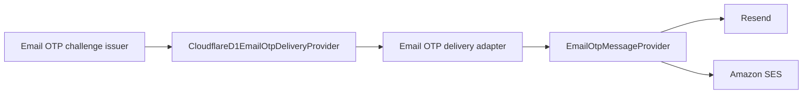

# Refactor 112: Email OTP Delivery Providers

Date updated: August 11, 2026
Status: implemented

## Decision

Email OTP delivery uses a provider-neutral adapter in `packages/console-server-ts`. Resend is the
active provider for production testnet and mainnet. Amazon SES remains available as a selectable
transport.

The authentication domain continues to own challenge generation, expiry, rate limits,
verification, and fail-closed behavior. Provider code receives a rendered message and returns the
existing typed delivery result.

## Architecture



The shared adapter:

- renders operation-specific HTML and plain text;
- maps the challenge ID to a provider delivery ID for idempotency;
- passes only delivery data to the selected transport;
- keeps provider configuration and SDK types out of the authentication domain.

## Provider selection

The deployment target owns the active provider as a discriminated configuration:

```json
{
  "emailOtpDelivery": {
    "kind": "email_provider",
    "provider": {
      "kind": "resend",
      "fromAddress": "confirm@seams.sh"
    }
  }
}
```

Amazon SES uses its provider-specific region:

```json
{
  "emailOtpDelivery": {
    "kind": "email_provider",
    "provider": {
      "kind": "amazon_ses",
      "region": "ap-southeast-2",
      "fromAddress": "confirm@seams.sh"
    }
  }
}
```

The deployment renderer produces the common `EMAIL_OTP_PROVIDER` and
`EMAIL_OTP_FROM_ADDRESS` variables. It emits `EMAIL_OTP_SES_REGION` only for Amazon SES.
Deployment preflight derives the required secret from the selected provider:

| Provider     | Required secret                                                  |
| ------------ | ---------------------------------------------------------------- |
| `resend`     | `RESEND_API_KEY`                                                 |
| `amazon_ses` | `EMAIL_OTP_SES_ACCESS_KEY_ID`, `EMAIL_OTP_SES_SECRET_ACCESS_KEY` |

## Runtime invariants

1. Provider delivery modes require an explicit provider selection.
2. Resend and Amazon SES implement the same `EmailOtpMessageProvider` interface.
3. Resend sends the challenge ID as an idempotency key through the existing Resend transport.
4. Provider errors return stable public failure codes without recipient addresses, OTP values, or
   credential details.
5. A send failure preserves the current fail-closed challenge cleanup behavior.
6. Development modes that return or capture demo codes do not require provider configuration.

## Console welcome email

The console sends an `ACCOUNT_WELCOME` transactional email after onboarding has a valid account,
organization, project, and development environment. The onboarding service writes the message to
the D1 email outbox with a stable per-user deduplication key, so a retried onboarding request does
not create another send.

The production Gateway dispatches the outbox through Resend once per minute. The message is a
short personal welcome with links to the console, getting-started guide, and architecture guide.
Amazon SES remains selectable for Email OTP; console transactional delivery continues to use the
existing Resend provider.

## Verification

Focused tests cover provider selection, provider-specific configuration, shared rendering,
Resend idempotency, error mapping, SES command construction, welcome-email deduplication and
dispatch, deployment secret derivation, and workflow secret wiring.
