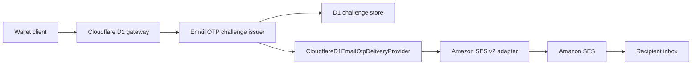

# Refactor 112: Amazon SES Email OTP Delivery

Date created: August 9, 2026
Status: active implementation plan

## Progress

- Phase 1: the `seams.sh` identity, Easy DKIM, and `confirm.seams.sh` custom MAIL FROM are verified in `ap-southeast-2`. Production access is under AWS review.
- Phase 2: complete. The SES v2 provider, operation-specific HTML/plain-text renderer, Worker boundary configuration, gateway wiring, and focused tests are implemented.
- Phase 3: mainnet is complete locally. Production testnet is configured for provider delivery plus demo-code disclosure and needs its environment-specific SES secrets before deployment.
- Phase 4: ready for the controlled production deployment and OTP rehearsal.
- Phase 5: waits for SES production access before general-recipient rollout.

## Decision summary

Use Amazon SES v2 to deliver Email OTP messages from `confirm@seams.sh` through the existing `CloudflareD1EmailOtpDeliveryProvider` port. The SES adapter belongs in `packages/console-server-ts` because AWS credentials and deployed-worker wiring are infrastructure concerns. The authentication domain continues to own challenge generation, expiry, rate limits, verification, and fail-closed behavior.

The first release has one production email provider, one verified sender, and one SES region. It uses SES shared IPs. Dedicated IPs, tenant management, engagement tracking, marketing mail, and a provider-selection framework are outside this refactor.

## Objective

Make the production Cloudflare gateway send registration, wallet-unlock, transaction-signing, and key-export OTP codes through Amazon SES with:

- verified DKIM and custom MAIL FROM alignment for `seams.sh`;
- styled HTML and equivalent plain-text bodies;
- narrowly scoped AWS credentials stored as deployment secrets;
- typed configuration validated once at the worker boundary;
- safe error mapping and logs that never contain OTP codes or recipient addresses;
- a controlled production rehearsal followed by a measurable rollout.

## Current state

The core delivery behavior already exists:

- `packages/sdk-server-ts/src/router/cloudflare/d1/auth/d1RouterApiAuthConfig.ts` defines `CloudflareD1EmailOtpDeliveryProvider` and its input/result contract.
- `packages/sdk-server-ts/src/router/cloudflare/d1/emailOtp/d1EmailOtpDeliveryRuntime.ts` dispatches `email_provider` delivery and fails closed when a provider is absent.
- `packages/sdk-server-ts/src/router/cloudflare/d1/emailOtp/d1EmailOtpChallengeIssuer.ts` creates and persists a six-digit challenge, sends it synchronously, and deletes the challenge when delivery fails.
- `packages/console-server-ts/src/router/cloudflare/d1RouterApiStagingWorker.ts` now constructs the SES provider when a provider delivery mode is selected and passes it to the authentication service.

The remaining implementation gap is deployment configuration and secret plumbing. The existing console email outbox in `packages/console-server-ts/src/email/` serves invitations and other console messages. It remains unchanged in this refactor.

## Required invariants

1. The OTP is generated and verified only by the existing authentication domain.
2. The SES adapter receives an already-valid `CloudflareD1EmailOtpDeliveryProviderInput`; it does not create, persist, verify, or retry challenges.
3. Production mainnet uses `EMAIL_OTP_DELIVERY_MODE=email_provider` and `EMAIL_OTP_RUNTIME_PROFILE=mainnet_service`. Production testnet uses `provider_and_demo_code` with `testnet_live_demo` so the same challenge is emailed and shown in the demo toast.
4. A send failure deletes the newly created challenge through the current issuer behavior. No unusable challenge remains active.
5. Reusing an active challenge does not send another email. The existing rate-limit and reuse rules remain authoritative.
6. OTP codes, email addresses, challenge IDs, wallet IDs, user IDs, and AWS credentials never appear in logs, exceptions returned to clients, analytics, or email metadata.
7. All provider configuration is required when `email_provider` is selected and is parsed once from the worker environment.
8. Every OTP operation has explicit subject and body copy selected with an exhaustive switch.
9. HTML and plain-text content carry the same security meaning and expiry information.
10. The production path has no log, outbox, or demo-code fallback. Delivery fails closed.

## AWS setup

### 1. Choose the SES region

Select one SES region and use it for the identity, credentials policy, API client, monitoring, and production-access request. Prefer the region nearest the gateway's primary audience unless organizational requirements dictate another region. Record the choice as `EMAIL_OTP_SES_REGION`.

SES identities and sandbox status are regional. A verified identity in one region does not configure another region.

### 2. Verify the sending identity

Create a domain identity for `seams.sh` with Easy DKIM enabled. Publish every SES-provided CNAME record in the authoritative DNS zone and wait for the identity to become verified.

Configure:

- From address: `Seams <confirm@seams.sh>`
- Custom MAIL FROM domain: `confirm.seams.sh`
- MAIL FROM MX record: the region-specific SES feedback endpoint supplied by SES
- MAIL FROM SPF TXT record: the exact value supplied by SES
- MAIL FROM MX failure behavior: use the default SES MAIL FROM domain

Add `_dmarc.seams.sh` with a monitoring policy such as `p=none` during the initial rollout. Review aggregate reports before tightening the policy in a separate operational change.

Verification is complete only when SES shows the identity, DKIM, and custom MAIL FROM domain as healthy in the selected region.

### 3. Configure account behavior

- Keep the shared IP pool.
- Disable engagement tracking for OTP messages.
- Enable the SES account-level suppression list for bounce and complaint reasons.
- Leave dedicated IP pools and tenant management disabled.
- Use the Essentials plan initially unless an explicit cost review selects SES a-la-carte pricing.

### 4. Request production access

While the account is in the SES sandbox, send only to controlled verified recipients. Submit a production-access request describing:

- transactional authentication codes only;
- expected initial and peak daily volume;
- the existing per-email and per-IP rate limits;
- the five-minute challenge lifetime;
- bounce and complaint suppression;
- the absence of purchased lists, subscriptions, and marketing content.

General-user rollout waits for production access in the selected region.

### 5. Create a least-privilege sender identity

Create a dedicated IAM principal for the Cloudflare gateway. Allow `ses:SendEmail` for the verified `seams.sh` identity in the selected account and region. Restrict the permitted From address to `confirm@seams.sh` where the IAM condition model allows it. Do not grant SES administration, raw email sending, or access to other AWS services.

Create one access key for this principal. Store the key ID and secret access key only in the protected deployment secret store.

## Target architecture

The adapter implements the existing provider contract. It renders the operation-specific message, sends one SES v2 `SendEmail` request, requires a non-empty SES message ID, and converts provider failures into the existing typed result. It does not add persistence or a delivery queue.

## Configuration contract

Add these gateway values:

| Name                              | Classification           | Requirement                                                             |
| --------------------------------- | ------------------------ | ----------------------------------------------------------------------- |
| `EMAIL_OTP_SES_REGION`            | non-secret configuration | Required for `email_provider`; must match the verified identity region. |
| `EMAIL_OTP_SES_FROM_ADDRESS`      | non-secret configuration | Required for `email_provider`; initially fixed to `confirm@seams.sh`.   |
| `EMAIL_OTP_SES_ACCESS_KEY_ID`     | secret                   | Required for `email_provider`.                                          |
| `EMAIL_OTP_SES_SECRET_ACCESS_KEY` | secret                   | Required for `email_provider`.                                          |

Keep the existing runtime values:

| Lane                | `EMAIL_OTP_DELIVERY_MODE` | `EMAIL_OTP_RUNTIME_PROFILE` |
| ------------------- | ------------------------- | --------------------------- |
| Production testnet  | `provider_and_demo_code`  | `testnet_live_demo`         |
| Production mainnet  | `email_provider`          | `mainnet_service`           |

Do not add an email-provider selector. SES is the sole provider for this path. A boundary parser must validate raw environment values and return a fully populated internal config before provider construction. Missing or malformed values must stop worker startup or deployment preflight with a field-specific error.

The GitHub `production-testnet-gateway` and `production-gateway` environments should each own the two secrets. Their deployment workflows forward them as Cloudflare Worker secrets. Region and From address may live in the checked-in deployment target when the target schema validates both values.

## Email contract

Create a small OTP renderer independent of the existing console-outbox templates. It returns required `subject`, `html`, and `text` fields.

Use an exhaustive switch over the supported operation:

| Operation          | Purpose conveyed to the recipient                                     |
| ------------------ | --------------------------------------------------------------------- |
| `registration`     | Confirm creating a Seams wallet.                                      |
| `wallet_unlock`    | Confirm unlocking a Seams wallet.                                     |
| `transaction_sign` | Confirm signing a transaction.                                        |
| `export_key`       | Confirm exporting wallet key material, with stronger cautionary copy. |

Each message must include:

- the six-digit code as selectable text;
- the remaining validity period derived from `expiresAtMs`;
- a statement that Seams staff will never ask for the code;
- instructions to ignore the message when the recipient did not initiate the action;
- a concise security warning appropriate to the operation.

HTML styling should use a compact, single-column layout with inline CSS, a clear code block, accessible contrast, and no remote assets. Exclude JavaScript, forms, tracking pixels, external stylesheets, shortened URLs, and unnecessary links. The plain-text body remains fully usable when HTML is blocked.

The renderer must HTML-escape every interpolated value. Copy selection derives from the validated operation enum, and no user-controlled prose enters the template.

## SES adapter behavior

Add `@aws-sdk/client-sesv2` to `packages/console-server-ts` and keep AWS-specific types inside that package.

The provider performs one `SendEmailCommand` with:

- `FromEmailAddress`: the configured Seams sender;
- `Destination.ToAddresses`: the validated recipient email;
- `Content.Simple.Subject`: the rendered subject;
- `Content.Simple.Body.Html`: the rendered HTML;
- `Content.Simple.Body.Text`: the rendered plain text.

Use the SDK's default retry behavior for transient transport failures. Do not add application-level retries during challenge issuance because duplicate OTP messages would create ambiguity. If the SES call ultimately fails, return one stable low-cardinality provider code and allow the existing challenge issuer to delete the challenge.

Map failures into a small set such as:

- `email_otp_ses_throttled`;
- `email_otp_ses_rejected`;
- `email_otp_ses_transport_failed`;
- `email_otp_ses_missing_message_id`.

Client-facing responses retain the current generic delivery failure. Server logs may contain the stable code, SES request/message identifier when available, operation, and region. Logs must exclude the message body, subject, destination, and raw AWS error payload.

## Implementation phases

### Phase 1: Provision and prove the SES identity

1. Select the SES region.
2. Verify `seams.sh`, Easy DKIM, and `confirm.seams.sh` custom MAIL FROM.
3. Configure suppression and disable engagement tracking.
4. Create the least-privilege IAM principal and protected secrets.
5. Send one SES-console test to a controlled verified inbox while the account remains in the sandbox.
6. Request production access.

Exit criteria: SES reports a healthy identity and aligned MAIL FROM domain, and a controlled test message arrives with passing SPF and DKIM results.

### Phase 2: Implement the provider

1. Add the SES v2 dependency to `packages/console-server-ts`.
2. Add the operation-exhaustive HTML/plain-text renderer under `packages/console-server-ts/src/email/otp/`.
3. Add the SES provider under the same directory and implement the existing `CloudflareD1EmailOtpDeliveryProvider` contract.
4. Add a boundary parser for the four SES environment values.
5. Construct the provider in `d1RouterApiStagingWorker.ts` when `email_provider` is selected and pass it to `createCloudflareD1RouterApiAuthService`.

Exit criteria: a unit test proves the exact SES request shape, all four operations render, and mapped failures return without exposing secrets or OTP content.

### Phase 3: Wire deployment configuration

1. Extend the gateway deployment target schema and renderer with SES region and From address.
2. Extend deployment preflight so production cannot deploy `email_provider` without all SES values.
3. Add the two credential values to the `production-gateway` GitHub Environment secrets.
4. Forward the secrets through the production gateway workflow into Cloudflare Worker secrets.
5. Update checked-in environment examples with names and descriptions only.

Exit criteria: deployment rendering contains the two non-secret values, secret values remain absent from generated files and logs, and preflight rejects an incomplete production configuration.

### Phase 4: Rehearse the real OTP flow

1. Deploy the production gateway with SES still restricted to controlled verified recipients.
2. Request each supported OTP operation from a controlled account.
3. Confirm the email arrives, displays correctly in HTML and plain text, and contains the expected operation copy.
4. Complete each action with the received code.
5. Confirm an expired code and an incorrect code fail through existing behavior.
6. Inspect Cloudflare and SES logs to confirm the code and destination never appear.

Exit criteria: one observed end-to-end send and verification succeeds for every operation, and the failure checks preserve the existing challenge semantics.

### Phase 5: Enable and monitor general delivery

1. Confirm SES production access is active in the selected region.
2. Enable the user-facing Email OTP path.
3. Watch provider failure count, SES sends, bounces, complaints, and account reputation during the initial rollout.
4. Establish alerts for sustained delivery failures and SES reputation thresholds.

Exit criteria: general recipients can complete OTP flows, provider failures remain within the agreed threshold, and bounce/complaint metrics remain healthy.

## Verification plan

Add focused tests under the top-level `tests/` workspace after reading `tests/AGENTS.md`:

- provider request construction with a fake SES client;
- HTML and text rendering for every OTP operation;
- HTML escaping and absence of remote resources;
- stable mapping for throttling, rejection, transport failure, and missing message ID;
- worker configuration rejection when any required SES value is absent;
- deployed gateway wiring passes the provider into the existing auth service;
- deployment output contains no secret values;
- the existing `cloudflareD1RouterApiEmailOtp.unit.test.ts` provider-delivery cases remain green.

Run the narrow provider and deployment tests first. Run `pnpm test:intended` because the production authentication delivery path changes. Run `pnpm check` after the focused tests pass.

## Failure and rollback behavior

The authentication service already fails closed when delivery is unavailable. Preserve that behavior during SES throttling, credential failure, AWS outage, and account suspension. Do not expose demo codes or switch production to log delivery.

If rollout fails:

1. disable the affected user-facing OTP entry point or restore the last known-good gateway deployment;
2. inspect only sanitized provider codes and SES operational metrics;
3. rotate credentials immediately if compromise is suspected;
4. correct SES identity, quota, policy, or worker configuration;
5. repeat the controlled end-to-end rehearsal before reopening delivery.

## Documentation cleanup

`docs/otp/email-service-integrations.md` contains an older Resend-first recommendation and stale repository references. When implementation begins, migrate any still-valid general email guidance and delete that obsolete document. This plan is authoritative for Email OTP delivery.

Document the final SES region, DNS ownership, secret owner, access-key rotation process, production-access status, alarm destinations, and controlled smoke-test account in the deployment runbook. Never record credential values.

## Definition of done

- SES identity, DKIM, SPF/custom MAIL FROM, and DMARC monitoring are configured for `seams.sh`.
- SES production access is active in the selected region.
- The dedicated IAM principal can call only the required SES send action for the intended identity.
- The Cloudflare production gateway constructs and uses the SES provider.
- All four OTP operations send styled HTML and equivalent plain text.
- Provider and configuration tests pass, followed by `pnpm test:intended` and `pnpm check`.
- A controlled end-to-end OTP request and verification succeeds for every operation.
- Logs and deployment artifacts contain no OTP codes, recipient addresses, or AWS secrets.
- Bounce, complaint, reputation, and provider-failure monitoring are active.
- The obsolete OTP provider recommendation has been removed.

## AWS references

- [Creating Amazon SES identities](https://docs.aws.amazon.com/ses/latest/dg/creating-identities.html)
- [Using a custom MAIL FROM domain](https://docs.aws.amazon.com/ses/latest/dg/mail-from.html)
- [Moving out of the Amazon SES sandbox](https://docs.aws.amazon.com/ses/latest/dg/request-production-access.html)
- [Amazon SES v2 SendEmail API](https://docs.aws.amazon.com/ses/latest/APIReference-V2/API_SendEmail.html)
- [Controlling access to Amazon SES](https://docs.aws.amazon.com/ses/latest/dg/control-user-access.html)
- [Amazon SES pricing](https://aws.amazon.com/ses/pricing/)
