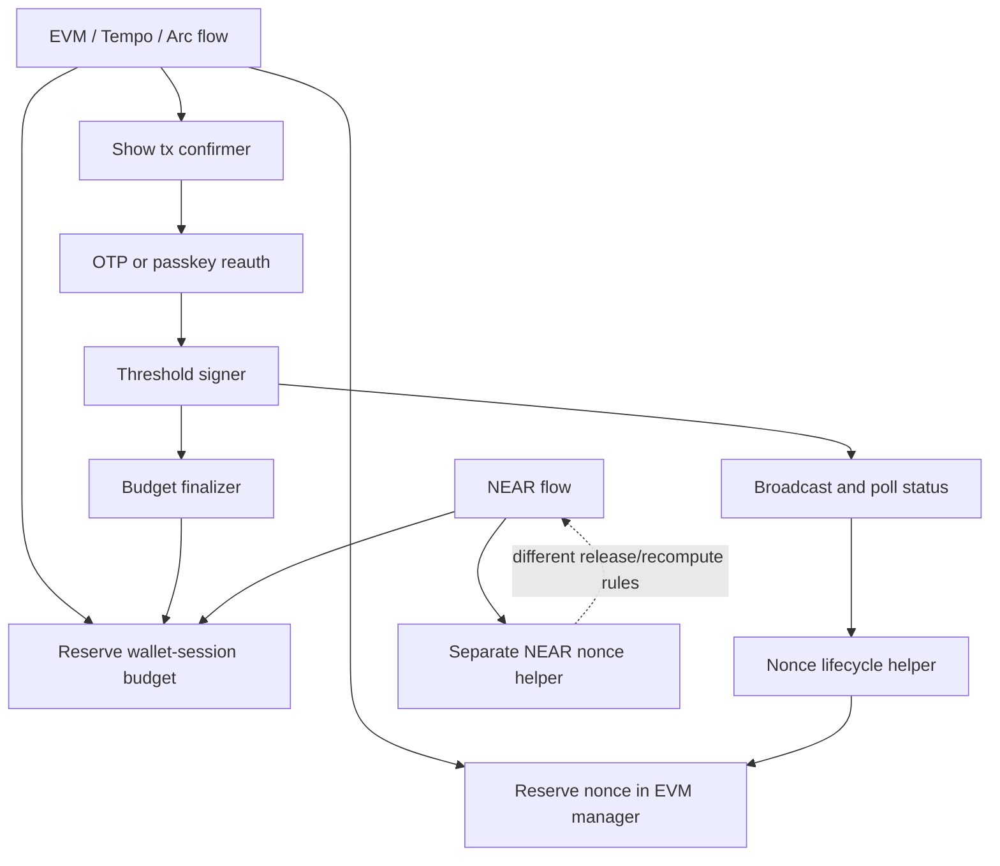
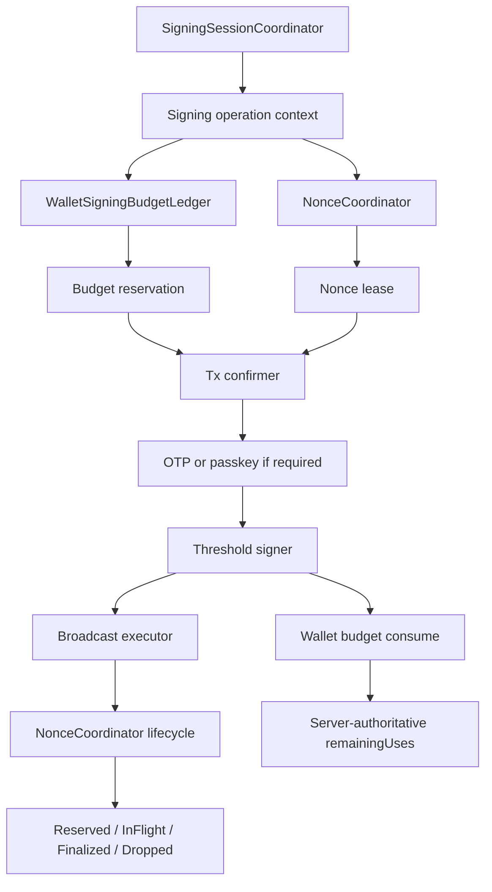
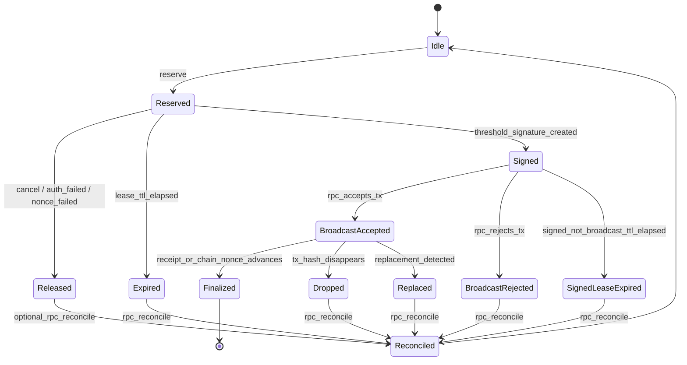
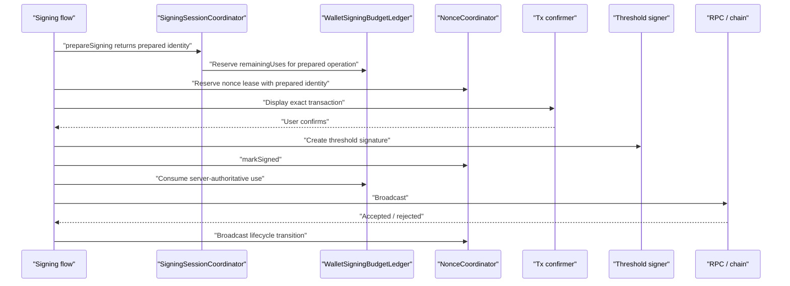

# Nonce Coordinator Plan

Date created: 2026-04-26

Status: active nonce plan. EVM-family nonce identity must follow the concrete
ECDSA lane model from
[signing-session-architecture/](signing-session-architecture/): protocol-neutral
`WalletId` plus concrete `ThresholdEcdsaChainTarget`. NEAR nonce lanes
remain access-key scoped by NEAR account and public key.

## Objective

Move nonce ownership out of chain-specific helper code and into one
`NonceCoordinator` state machine.

The coordinator should make nonce behavior explicit, auditable, and consistent
across NEAR, Tempo, Arc EVM, and generic EVM signing. It should also compose
cleanly with the signing-session budget model so session exhaustion, concurrent
signing, cancellation, and broadcast failures do not create split-brain state.

## Current Problem

Nonce state is currently distributed across several places:

1. EVM-family signing used to reserve managed nonces in a chain-specific helper.
2. EVM-family broadcast/finalization code reports lifecycle events later through
   nonce lifecycle helpers.
3. NEAR has its own reservation model and separate release/fetch behavior.
4. Signing-session budget reservations live in the signing-session budget
   boundary.
5. Tx confirmation, OTP/passkey reauth, threshold signing, broadcast, and status
   polling are driven by flow-specific orchestration.

That split means every flow has to remember the same cleanup rules. When any path
misses a release, reconciliation, or budget update, the UI can show a valid
signing session while the nonce lane is stuck, or the nonce lane can skip ahead
while the chain still expects an earlier nonce.



The failure mode is that nonce state, auth state, signing-session budget state,
and broadcast state are coupled by convention instead of by a single operation
state machine.

## Target Design

Introduce a `NonceCoordinator` that owns nonce lanes and nonce leases.

The coordinator is not an auth system and does not consume signing-session
budget. It owns only nonce allocation and nonce lifecycle. Signing-session budget
remains owned by the wallet signing-session coordinator and the server
authoritative budget consume path.



The key change is that a transaction signing operation gets two explicit local
resources:

1. a wallet signing-session budget reservation;
2. a nonce lease.

Those resources are siblings under the same `operationId`. Neither resource is
allowed to infer or synthesize the other.

## Core Invariants

1. Every signed transaction has exactly one nonce lease.
2. A nonce lease is bound to one `operationId`, one operation fingerprint, one
   account, one chain lane, and one nonce value.
3. A nonce lease must expire or be explicitly released before signature
   creation if the operation is cancelled or auth fails.
4. After a threshold signature is produced, wallet signing-session budget is
   spent even if broadcast or finality later fails. The signature exists.
5. Broadcast rejection, dropped transactions, and replacement affect nonce state,
   not whether a signature consumed wallet-session budget.
6. Missing or malformed managed nonce metadata is an invariant violation for
   managed EVM-family signing. It must fail closed.
7. All mutations for one nonce lane run through one serialized state-machine
   transition path.
8. Chain/RPC state remains authoritative for confirmed nonce progress. Local
   coordinator state is only a lease and reconciliation layer.
9. Cross-tab and cross-device wallet budget atomicity belongs server-side.
   Cross-tab nonce coordination should use same-origin browser coordination, but
   it is still subordinate to chain/RPC reconciliation.

## Lane Identity

Nonce lanes should be explicit and chain-specific without duplicating lifecycle
logic.

```ts
type WalletId = string & { readonly __brand: 'WalletId' };

type ThresholdEcdsaChainTarget =
  | { kind: 'evm'; namespace: 'eip155'; chainId: number; networkSlug: string }
  | { kind: 'tempo'; chainId: number; networkSlug: string };

type NonceLane =
  | {
      family: 'evm';
      chainTarget: ThresholdEcdsaChainTarget;
      networkKey: string;
      sender: `0x${string}`;
      nonceKey?: bigint;
      subjectId: WalletId;
    }
  | {
      family: 'near';
      networkKey: string;
      accountId: string;
      publicKey: string;
    };
```

For EVM-family lanes, `chainTarget` is the concrete ECDSA chain identity and
`subjectId` is the protocol-neutral wallet. Raw collapsed
`chain: 'evm' | 'tempo'` strings are request/config boundary data only; they
must be normalized to `ThresholdEcdsaChainTarget` before reaching nonce
internals. `nonceKey` remains available for account-abstraction or chain-specific
nonce domains. For NEAR lanes, the lane is the account/public-key pair because
NEAR nonces are access-key scoped.

All lane keys must be generated by one canonical collision-safe helper. Do not
build lane keys by joining raw fields with `:`; NEAR public keys commonly contain
`ed25519:...`, and future network/subject identifiers may contain delimiters.
The helper must encode each field or length-prefix components before joining.

## Operation Identity

The coordinator should share operation identity with signing-session budget
accounting.

```ts
type NonceBudgetSessionContext =
  | {
      kind: 'near_ed25519';
      nearAccount: NearAccountRef;
      authMethod: 'email_otp' | 'passkey';
      walletSigningSessionId: string;
      thresholdSessionId: string;
    }
  | {
      kind: 'threshold_ecdsa';
      subjectId: WalletId;
      chainTarget: ThresholdEcdsaChainTarget;
      authMethod: 'email_otp' | 'passkey';
      walletSigningSessionId: string;
      thresholdSessionId: string;
    };

type NonceOperationContext = SigningOperationContext & {
  operationFingerprint: SigningOperationFingerprint;
  budgetSession: NonceBudgetSessionContext;
};
```

`operationFingerprint` must bind enough transaction identity to reject accidental
reuse of the same caller operation id for a different transaction. It should not
include plaintext secrets.

Budget reservation and nonce leasing must receive the same
`SigningOperationContext` for a transaction. The nonce context only extends that
operation with explicit prepared budget/session identity; it must not mint a
separate operation id, infer a different fingerprint, or carry optional lifecycle
identity such as `walletSigningSessionId?: string`.

## State Machine



Required semantics:

1. `Reserved` means the transaction has not produced a signature yet. It is safe
   to release this lease without spending wallet-session budget.
2. `Signed` means a threshold signature exists. Budget must be consumed exactly
   once for the operation. The nonce should remain protected briefly for
   broadcast retry, then reconcile if no broadcast succeeds.
3. `BroadcastAccepted` means the RPC accepted or returned a tx hash. The
   coordinator treats the nonce as in flight until finalized, dropped, replaced,
   or reconciled.
4. `Dropped` means the local tx hash is no longer a reliable pending/finalized
   candidate. The coordinator must reconcile before issuing another nonce for the
   lane when the dropped nonce could create a gap.
5. `Replaced` means the nonce was used by another tx. The lane must reconcile
   before choosing the next nonce.
6. Broadcast lifecycle transitions require a `Signed` lease. If an implementation
   still permits `Reserved -> BroadcastAccepted` or `Reserved -> BroadcastRejected`,
   that is migration debt and must be removed once every signing flow calls
   `markSigned` immediately after threshold signature creation.

## Target Public API Sketch (Post-Phase 10)

The target public facade should include every operation the runtime depends on
today, while tightening operation binding so every lifecycle transition carries
both `operationId` and `operationFingerprint`. The current implementation still
checks only `operationId` on transition; Phase 10 below upgrades this to the
stronger invariant. Until the NEAR detector is implemented, `reconcile` remains
an EVM-family operation even if the current implementation accepts a generic lane
type and fails closed for NEAR.

```ts
type NonceLeaseRef = {
  leaseId: string;
  operationId: SigningOperationId | string;
  operationFingerprint: SigningOperationFingerprint | string;
  nonce: string;
  batchId?: string;
  txIndex?: number;
};

type NonceLease = {
  leaseId: string;
  lane: NonceLane;
  operationId: SigningOperationId;
  operationFingerprint: SigningOperationFingerprint;
  nonce: bigint | string;
  state: NonceLeaseState;
  batchId?: string;
  txIndex?: number;
  reservedAtMs: number;
  expiresAtMs: number;
};

type NonceLifecycleInput = {
  leaseId: string;
  operationId: SigningOperationId | string;
  operationFingerprint: SigningOperationFingerprint | string;
};

type NonceCoordinator = {
  reserve(input: { lane: NonceLane; operation: NonceOperationContext }): Promise<NonceLease>;

  reserveBatch(input: {
    lane: NearNonceLane;
    operation: NonceOperationContext;
    count: number;
  }): Promise<NonceLease[]>;

  reserveNearContext(input: {
    lane: NearNonceLane;
    operation: NonceOperationContext;
    count: number;
    fetchContext?: () => Promise<TransactionContext>;
    nearClient?: NearClient;
    force?: boolean;
  }): Promise<{ context: TransactionContext; leases: NonceLease[] }>;

  initializeNearAccessKey(input: { accountId: string; publicKey: string }): void;
  getActiveNearPublicKey(): string | null;
  fetchNearContext(input: {
    lane: NearNonceLane;
    nearClient?: NearClient;
    force?: boolean;
  }): Promise<TransactionContext>;
  prefetchNearContext(input?: {
    accountId?: string;
    publicKey?: string;
    nearClient?: NearClient;
  }): Promise<void>;
  clearNearAccessKey(): void;

  markSigned(input: NonceLifecycleInput & { signedTxHash?: string }): Promise<void>;

  markBroadcastAccepted(input: NonceLifecycleInput & {
    txHash?: string;
  }): Promise<void>;

  markBroadcastRejected(input: NonceLifecycleInput & {
    error?: unknown;
  }): Promise<void>;

  markFinalized(input: NonceLifecycleInput & {
    txHash?: string;
  }): Promise<void>;

  markDroppedOrReplaced(input: NonceLifecycleInput & {
    reason: 'dropped' | 'replaced';
    txHash?: string;
  }): Promise<void>;

  release(input: NonceLifecycleInput & {
    reason: 'cancelled' | 'auth_failed' | 'signing_failed' | 'nonce_failed';
  }): Promise<void>;

  expireLeases(input?: { accountId?: string }): Promise<NonceLease[]>;
  recoverDurableLeases(input?: { accountId?: string }): Promise<void>;
  reconcile(input: { lane: EvmNonceLane }): Promise<NonceLaneStatus>;
  clearForAccount(accountId: string): void;
  clearAll(): void;
  getDiagnostics(input?: NonceCoordinatorDiagnosticsOptions): NonceCoordinatorDiagnostics;
};
```

The implementation can initially be in-runtime memory plus browser coordination.
The API should still be written as if the coordinator is the only writer for a
nonce lane.

## Current Backend Role

During migration, `NonceCoordinator` is the transaction-facing nonce owner.
Chain-specific nonce classes are backend ports, not independent policy owners.

Current split:

1. `NonceCoordinator` owns lease identity, operation binding, state transitions,
   TTL expiry, cancellation release, signed/broadcast/finalized transitions, and
   fail-closed metadata validation. It also owns EVM-family lane arithmetic,
   in-flight nonce tracking, dropped/replaced reconciliation state, and
   same-origin lease coordination.
2. The EVM nonce backend is a fetch-only RPC port. It resolves the configured
   chain RPC and returns the chain-visible pending nonce. It does not reserve,
   release, reconcile, cache, or mutate lane state.
3. NEAR access-key nonce/block context, batch nonce arithmetic,
   release/recompute mechanics, prewarm, and account reset are now owned by
   `NonceCoordinator`.

The desired end state is not two parallel manager layers. The EVM side now uses
explicit backend terminology (`EvmNonceBackend`), and the NEAR side no longer
has a standalone nonce backend object.

Do not add new transaction signing paths that call nonce helpers directly. New
transaction paths must request coordinator leases and report coordinator
lifecycle transitions.

## Signing Session Integration

`NonceCoordinator` and signing-session budget accounting should meet at the
transaction operation boundary.

Recommended operation order for a warm session:



Recommended operation order for an exhausted session:

1. Planner sees no available local budget after subtracting in-flight
   reservations.
2. Tx confirmer owns the flow and shows the registered reauth method.
3. Email OTP or passkey reauth mints or refreshes exactly the requested
   `remainingUses` for this operation.
4. The flow reserves the new wallet-session budget and nonce lease under the
   same `operationId`.
5. The signer produces one signature.
6. Budget is consumed once and nonce lifecycle proceeds independently.

For EVM-family transactions, the nonce may need to be known before the exact
transaction digest is confirmed. That is allowed only as a short-lived nonce
lease. If the user cancels, OTP fails, passkey fails, or threshold reconnect
fails before signature creation, the nonce lease is released and the budget
reservation is released or recorded as zero-spend.

### Concurrent Remaining Uses

If `remainingUses = 2` and two transactions are already in flight, the third
transaction must plan as exhausted even before the first two finalize.

That behavior comes from budget reservations, not from nonce state:

1. Operation A reserves one wallet-session use.
2. Operation B reserves one wallet-session use.
3. `WalletSigningBudgetLedger.getAvailableStatus` returns zero local available
   uses for the shared `walletSigningSessionId`.
4. Operation C routes through OTP/passkey reauth.
5. If A or B is cancelled before signature creation, its reservation is released
   and future operations can use that budget again.

The `NonceCoordinator` should expose enough trace context to correlate nonce
leases with those budget reservations, but it must not decrement or refill
`remainingUses` itself.

### Budget And Nonce Failure Matrix

| Phase                                       | Signature exists? | Budget action         | Nonce action                               |
| ------------------------------------------- | ----------------- | --------------------- | ------------------------------------------ |
| User cancels confirmation                   | No                | Release or zero-spend | Release lease                              |
| OTP/passkey fails                           | No                | Release or zero-spend | Release lease                              |
| Nonce reservation fails                     | No                | Release or zero-spend | No lease                                   |
| Threshold reconnect fails                   | No                | Release or zero-spend | Release lease                              |
| Threshold signing fails before signature    | No                | Release or zero-spend | Release lease                              |
| Signature succeeds, broadcast not attempted | Yes               | Consume once          | Mark signed, retry or expire and reconcile |
| Broadcast rejected                          | Yes               | Consume once          | Mark rejected and reconcile                |
| Broadcast accepted                          | Yes               | Consume once          | Mark in flight                             |
| Tx finalized                                | Yes               | Already consumed      | Mark finalized                             |
| Tx dropped or replaced                      | Yes               | Already consumed      | Mark dropped/replaced and reconcile        |

## Phased TODO

### Phase 0. Freeze Invariants And Regression Tests

1. [x] Add tests for the five known nonce review findings:
       reserved EVM nonce expiry, locked rejection cleanup, fail-closed chain
       parsing, mandatory managed nonce metadata, and NEAR reservation recompute.
   - [x] EVM reserved nonce expiry is covered in
         `tests/unit/nonceCoordinator.unit.test.ts`.
   - [x] EVM rejection cleanup is async and runs through the lane lock.
   - [x] Managed nonce chain parsing fails closed for non-`evm`/`tempo`
         snapshots.
   - [x] Missing managed nonce metadata fails closed in EVM-family lifecycle
         tests.
   - [x] NEAR release recomputes highest reserved nonce in
         `tests/unit/nonceCoordinator.nearContext.test.ts`.
2. [x] Add tests that signing-session budget reservations and nonce leases are
       both released on cancellation before signature creation.
   - [x] TouchConfirm signing and registration cancellation tests assert nonce
         lease release through the coordinator.
   - [x] Add the paired wallet-session budget reservation assertions for
         signing-session-backed transaction paths.
3. [ ] Add tests that a signature-created-but-broadcast-failed operation consumes
       budget exactly once and reconciles nonce state.
   - Legacy signing-session budget finalizer tests were deleted during the
     concrete ECDSA lane-identity cleanup. Replace them with concrete
     `WalletId + ThresholdEcdsaChainTarget` budget/nonce tests rather
     than restoring collapsed `chainFamily` fixtures.
4. [ ] Add tests that two in-flight wallet-session reservations exhaust local
       availability for the third transaction.
   - Legacy signing-session budget tests were deleted because they depended on
     `SigningLaneContext` fixtures. Re-add this coverage only after budget state
     carries concrete ECDSA lane identity.
5. [ ] Add trace assertions that every transaction operation emits one
       `operationId`, one budget reservation, and one nonce lease id.
   - Replace the deleted legacy finalizer trace tests with concrete
     lane-identity trace tests tied to the same `operationId` and operation
     fingerprint.

### Phase 1. Define Coordinator Types And State Machine

1. [x] Add `NonceLane`, `NonceOperationContext`, `NonceLease`, and
       `NonceCoordinator` types.
   - [ ] Phase 10 replaces the current broad `NonceOperationContext` with the
         discriminated prepared budget/session context above.
2. [x] Implement a pure transition reducer for nonce lease states.
3. [x] Make illegal transitions fail closed with typed errors.
4. [ ] Bind every transition to `operationId` and operation fingerprint.
   - [x] Lease creation stores both `operationId` and `operationFingerprint`.
   - [ ] Lifecycle transition inputs still need `operationFingerprint`, and
         `assertOperationMatches(...)` must verify both fields. This is tracked
         in Phase 10.
5. [x] Add redacted trace events for reserve, release, signed, accepted,
       rejected, finalized, dropped, replaced, expired, and reconciled.
   - [x] Added trace events for reserve, release, signed, accepted, rejected,
         finalized, dropped, replaced, and lane reconciliation.
   - [x] Add explicit lease expiry transitions and trace events.
   - [x] Add lane-clear trace events for account-scoped and full coordinator
         reset paths.

### Phase 2. Implement EVM-Family Coordinator Backend

Progress:

1. [x] Route EVM-family nonce reservation and lifecycle calls through
       `NonceCoordinator`.
2. [x] Keep the current EVM nonce backend as the coordinator backend while the
       transaction-facing boundary migrates.
3. [x] Carry nonce lease metadata through managed nonce snapshots.
4. [x] Fail closed when managed signing results are missing nonce lease metadata.

Remaining TODO:

1. [x] Move current EVM nonce lane state fully into the coordinator backend.
   - [x] `NonceCoordinator` owns EVM-family `chainNonce`, `nextCandidate`,
         in-flight nonces, TTL refresh, stale in-flight blocking, and
         dropped/replaced alert windows.
   - [x] `EvmNonceBackend` is now a fetch-only RPC port with static guard
         coverage preventing stateful reserve/release/reconcile methods from
         returning.
2. [x] Keep one serialized lock per EVM-family nonce lane.
3. [x] Store reserved nonces with `reservedAtMs` and `expiresAtMs`.
4. [x] Validate current-boundary managed nonce snapshots strictly; accept only
       `evm` and `tempo` while the boundary still carries collapsed chain
       strings.
   - [ ] Phase 10 migrates snapshots to concrete `chainTarget` plus `subjectId`.
         Raw `evm` / `tempo` strings are accepted only at request boundaries
         after that migration.
5. [x] Treat missing managed nonce metadata as an invariant failure in managed
       signing results.
6. [x] Reconcile on dropped, replaced, stale in-flight, and rejected nonce
       errors.
7. [x] Remove direct lifecycle mutation calls from EVM/Tempo/Arc flows once they
       route through the coordinator.

### Phase 3. Integrate NEAR Access-Key Nonces

Progress:

1. [x] Model NEAR account/public-key as a nonce lane.
2. [x] Support atomic NEAR batch reservation that returns one lease per signed
       transaction.
3. [x] Wire TouchConfirm NEAR reservation/cancel cleanup through
       `NonceCoordinator`.
4. [x] Recompute the highest reserved NEAR nonce after every release in
       coordinator-owned NEAR nonce state.
5. [x] Carry TouchConfirm NEAR nonce lease handles into the signing worker and
       mark the lease signed after threshold signature creation.
6. [x] Attach per-transaction NEAR lease metadata to each
       `SignTransactionResult` and `SignedTransaction`.

Remaining TODO:

1. [x] Refresh block hash, block height, and access-key nonce through the same
       lane lock.
2. [x] Route NEAR signing cleanup through coordinator release/signed/finalized
       transitions for signed transactions carrying coordinator lease metadata.
3. [ ] Add NEAR dropped/replaced reconciliation once a chain-specific detector is
       available.
   - Status: blocked on a NEAR-specific detector. The coordinator already owns
     NEAR release, signed, finalized, expiry, and startup-recovery paths; there
     is not yet an equivalent to EVM pending-pool dropped/replaced detection for
     NEAR transaction hashes.

### Phase 4. Wire Transaction Signing Through One Boundary

1. [x] Make EVM-family and TouchConfirm NEAR transaction flows request nonce
       leases through the `NonceCoordinator` instead of chain-specific helpers.
2. [x] Keep signing-session coordinator and wallet-budget paths nonce-agnostic;
       nonce lease creation belongs only at transaction signing boundaries and in
       `NonceCoordinator`.
   - [x] NEAR transaction/delegate/NEP-413 orchestration no longer
         pre-initializes NEAR nonce state outside the coordinator before
         TouchConfirm.
   - [x] Delegate and NEP-413 confirmation contexts do not reserve NEAR
         access-key nonce leases, because those flows do not spend transaction
         nonces at confirmation time.
   - [x] Added a static guard that prevents session, threshold, and
         signing-session coordinator modules from importing or mutating nonce
         coordinator state directly.
3. [x] Use the same `SigningOperationContext` for budget reservation and nonce
       lease creation.
   - [x] `NonceOperationContext` now extends `SigningOperationContext` and
         requires the same canonical operation fingerprint used for budget
         accounting.
   - [x] EVM-family budget helpers accept a transaction operation context
         directly instead of separate `confirmationOperationId` and fingerprint
         arguments.
   - [x] Added a static guard that prevents the EVM-family budget helper from
         reintroducing separate operation-id arguments.
4. [x] Reserve wallet-session budget before threshold signing and release it on
       every no-signature outcome.
   - [x] NEAR transaction signing releases coordinator nonce leases and records
         zero spend when no threshold signature was created.
   - [x] NEAR transaction signing records successful wallet-session spend when a
         threshold signature exists, even if later cleanup fails.
   - [x] EVM-family touch-confirm flows reserve wallet-session budget before
         `executeSigningIntent` and release the reservation if no threshold
         signature was created.
   - [x] EVM-family cancellation tests cover the no-signature path for both
         Tempo and EVM Email OTP reauth without spending wallet budget.
5. [x] Mark nonce leases signed immediately after threshold signature creation.
   - [x] NEAR transaction signing marks the TouchConfirm lease signed after the
         threshold signer returns.
   - [x] EVM-family signing records the same explicit signed transition instead
         of jumping directly from reserved to broadcast lifecycle events.
6. [x] Update TouchConfirm success/defensive tests to attach `NonceCoordinator`
       explicitly and require `SigningAuthPlan` on signing confirmation requests.
7. [x] Ensure post-sign finalization consumes wallet-session budget before
       broadcast status polling can hide errors.
   - [x] EVM-family touch-confirm flows return signed raw transactions only;
         `transactionExecutor` consumes wallet-session budget before returning the
         signed result to dispatch/finality polling callers.
   - [x] Existing budget/nonce tests cover the post-sign broadcast-rejection
         case: once a signature exists, budget is consumed exactly once and nonce
         cleanup reconciles independently.
8. [x] Make retry paths reuse the same operation id only when the operation
       fingerprint matches.
   - [x] Caller-provided operation ids are bound to canonical operation
         fingerprints for NEAR and EVM-family signing requests.
   - [x] Added regression coverage for reusing the same operation id with the
         same fingerprint and rejecting reuse with a different transaction payload.

### Phase 5. Browser Runtime Coordination

1. [x] Use a same-origin coordination primitive for multi-tab nonce lanes
       (`navigator.locks`, SharedWorker, or IndexedDB lease records).
   - [x] `NonceCoordinator` uses `navigator.locks` when available and falls
         back to the in-runtime lane lock when same-origin locks are unavailable.
2. [x] Persist only redacted lease metadata required for recovery and
       reconciliation. Do not persist signed transaction bytes unless a deliberate
       retry queue is added.
   - [x] EVM-family lanes persist only lane key, lease id, nonce, active lease
         state, timestamps, and account id in same-origin storage. This lets a
         second tab skip active reserved/signed/broadcast nonces without persisting
         transaction bytes or secrets.
3. [x] Expire abandoned reserved leases after a short TTL.
4. [x] Expire signed-but-not-broadcast leases after a separate short TTL and
       force lane reconciliation.
   - [x] `markSigned` now switches a lease to the shorter post-sign TTL.
   - [x] Signed EVM-family leases release their backend reservation and force
         lane reconciliation when they expire before broadcast acceptance.
   - [x] Signed NEAR leases release local reservation state when they expire;
         NEAR dropped/replaced detection remains chain-detector dependent.
5. [x] Clear all lane leases for an account on wallet lock, account switch, or
       signer reset.
   - [x] Account-scoped reset clears EVM backend lanes, active NEAR access-key
         context, and coordinator leases for that account.
   - [x] Wallet lock and `SigningEngine.destroy()` now call coordinator
         `clearAll()` so EVM and NEAR lane state are reset together.

### Phase 6. Remove Old Nonce Paths

1. [x] Delete direct calls to EVM and NEAR nonce helpers from transaction
       signing flows.
   - [x] Removed direct NEAR nonce pre-initialization from transaction,
         delegate, and NEP-413 orchestration paths.
   - [x] Removed direct no-lease NEAR transaction lifecycle cleanup fallbacks
         from `sendTransaction`; coordinator-backed results now report coordinator
         lifecycle, and externally managed results do not mutate local reservations.
   - [x] TouchConfirm NEAR context fetch now goes through coordinator
         `fetchNearContext` / `reserveNearContext` methods.
   - [x] Resource prewarm, wallet lock/reset, and registration lifecycle now
         call coordinator NEAR access-key methods instead of the backend directly.
2. [x] Keep chain-specific RPC fetchers as coordinator ports, not independent
       nonce owners.
   - [x] Coordinator deps now treat EVM nonce code as a fetch-only backend
         port for chain-visible pending nonce reads.
   - [x] Rename the EVM coordinator port and implementation from manager
         terminology to `EvmNonceBackend`.
   - [x] Collapse the NEAR backend implementation into coordinator-local
         context fetch, prewarm, reservation, release, and finalized-refresh
         functions.
   - [x] Replace dedicated NEAR backend tests with coordinator behavior tests.
3. [x] Remove duplicate lifecycle helpers once coordinator transitions cover
       accepted, rejected, finalized, dropped, and replaced outcomes.
   - [x] EVM-family helper code now remains only as the event/metric adapter
         around coordinator transitions; transaction-facing nonce mutation is owned
         by `NonceCoordinator`.
   - [x] Renamed the EVM-family lifecycle boundary to
         `nonceLifecycleAdapter` and added a static guard that prevents EVM-family
         signing code from calling lifecycle transitions outside the adapter or
         coordinator.
4. [x] Add static guards that transaction signing code cannot bypass
       `NonceCoordinator` for managed nonce lanes.
5. [x] Update tests and docs to use "nonce coordinator" terminology.

### Phase 7. Observability And Runbooks

1. [x] Add redacted metrics for lease age, stale in-flight lanes, dropped txs,
       replacement detection, reconcile results, and release reasons.
   - [x] Coordinator traces now include signed-lease expiry, lane
         reconciliation, and lane-clear events.
   - [x] Add aggregate metric emission for lease age and stale in-flight lanes
         through `getDiagnostics({ emitMetrics: true })`.
   - [x] Add redacted outcome counters for dropped/replaced detections,
         reconcile reasons, release reasons, expiry reasons, and broadcast
         rejections.
2. [x] Add a developer diagnostic view that shows nonce lane state beside wallet
       signing-session budget state.
   - [x] `NonceCoordinator.getDiagnostics()` exposes redacted lease counts,
         lane counts, per-state counts, and active NEAR context state for a future
         UI/debug panel.
   - [x] Wire diagnostics into the developer panel beside wallet-session budget
         through `getWalletSession().nonceDiagnostics`.
3. [x] Document recovery steps for a stuck nonce lane:
       reconcile lane, clear expired reserved leases, and retry signing.
   - [x] Added the recovery runbook below.
4. [x] Add alerts for repeated dropped/replaced outcomes by chain and sender.
   - [x] `NonceCoordinator` emits a redacted `nonce_lane_alert` trace and a
         `console.warn` when repeated dropped/replaced outcomes cross the configured
         threshold for one EVM-family lane.

### Phase 8. Durable Same-Origin Coordination Hardening

Phase 5 introduced same-origin coordination, but the current EVM-family durable
lease mirror is still a `localStorage` implementation detail. Replace it with a
wallet-iframe IndexedDB-backed coordination layer and extend the same layer to
NEAR.

The storage invariant for this phase is strict:

1. Do not create a new IndexedDB database for nonce coordination.
2. Store nonce lane coordination records in the existing wallet iframe
   IndexedDB surface, behind `IndexedDBManager` / `UnifiedIndexedDBManager`.
3. In wallet-iframe mode, app-origin IndexedDB remains disabled; nonce leases
   are stored only in the wallet iframe origin.
4. Do not use `localStorage` as the durable nonce lease store after the
   migration.
5. Do not persist signed transaction bytes, raw transaction payloads, OTP
   material, PRF output, recovery keys, or threshold secret material.

#### Phase 8.1. IndexedDB Same-Origin Lock/Store Abstraction

1. [x] Add a coordinator storage port for same-origin nonce coordination:
       `NonceLaneCoordinationStore`.
   - Required operations:
     - read active leases by `laneKey`;
     - upsert a redacted lease record;
     - remove one lease;
     - clear leases by account;
     - clear all leases;
     - prune expired leases;
     - acquire/release a lane-scoped durable lock with a fencing token.
2. [x] Implement the port in the wallet iframe IndexedDB layer.
   - Add a store to `PasskeyClientDB` rather than creating another database.
   - Store names: `nonceLaneLeasesV1` and `nonceLaneLocksV1`.
   - Suggested key: `leaseId`.
   - Suggested indexes:
     - `laneKey`;
     - `accountId`;
     - `state`;
     - `expiresAtMs`;
     - `lane_state`, e.g. `[laneKey, state]`;
     - `account_expiresAt`, e.g. `[accountId, expiresAtMs]`.
3. [x] Store only redacted lease metadata:
   - `v`;
   - `leaseId`;
   - `laneKey`;
   - `family`;
   - `chain` for EVM-family lanes;
   - `networkKey`;
   - `chainId` for EVM-family lanes;
   - sender address for EVM-family lanes;
   - `nonceKey` when present;
   - `accountId`;
   - NEAR `publicKey` for NEAR lanes;
   - `nonce`;
   - `state`;
   - `operationId`;
   - `operationFingerprint`;
   - `reservedAtMs`;
   - `expiresAtMs`;
   - `updatedAtMs`;
   - `runtimeId`;
   - `fencingToken`.
4. [x] Keep `navigator.locks` as the preferred lock when available, but make
       IndexedDB the durable fallback. If both are unavailable, the coordinator may
       use the existing in-runtime lock, but it must emit a degradation warning.
5. [x] Replace `NonceCoordinatorSameOriginLeaseStorePort`'s `localStorage`
       implementation with the IndexedDB-backed store.
6. [x] Remove the old `localStorage` durable lease path entirely.
   - Development invariant: no legacy fallback, migration shim, or cleanup path
     remains in the coordinator or nonce coordination storage code.
7. [x] Add tests for:
   - IndexedDB unavailable -> in-runtime lock only + degradation warning;
   - Web Locks unavailable but IndexedDB available -> durable lock/store works;
   - two coordinator instances in the same origin reserve distinct EVM nonces;
   - expired IndexedDB records are pruned before reservation;
   - account clear removes durable lease records.
8. [x] Add static guard tests for the refactor:
   - no `localStorage` usage in `NonceCoordinator` or nonce coordination
     storage code;
   - no new IndexedDB database name for nonce coordination;
   - nonce durable store implementation must route through
     `IndexedDBManager` / `UnifiedIndexedDBManager` / `PasskeyClientDB`;
   - no transaction signing flow imports a durable nonce store directly;
   - no chain adapter mutates nonce lease state directly.
9. [x] Tighten those temporary static guards into stable ownership guards.
   - The guard now asserts the stable invariant: transaction code talks to
     `NonceCoordinator`; durable nonce persistence is hidden behind the
     coordinator storage port; no `localStorage` durable lease store remains.

#### Phase 8.2. Startup Recovery For EVM Signed/Broadcast Leases

1. [x] Add a startup recovery method:
       `NonceCoordinator.recoverDurableLeases({ accountId? })`.
2. [x] Run recovery during wallet iframe startup/unlock after IndexedDB is
       initialized and before the first transaction signing attempt.
3. [x] Recovery rules for EVM-family durable leases:
   - expired `reserved`: remove the lease and free the local lane;
   - expired `signed`: remove the lease, force lane reconciliation, and log a
     redacted recovery event;
   - active `signed`: keep it protected until its signed-lease TTL expires;
   - `broadcast_accepted`: reconcile the lane against pending nonce state;
   - finalized or chain-advanced nonces: mark recovered/finalized and remove
     active durable lease protection;
   - disappeared pending tx hash, when known: mark dropped/replaced and
     reconcile.
4. [x] Keep recovery idempotent. Running it repeatedly must not issue new
       nonces, spend wallet-session budget, or rebroadcast transactions.
5. [x] Do not persist raw signed tx bytes in this phase. Recovery is nonce-lane
       cleanup and reconciliation, not a rebroadcast queue.
6. [x] Add tests for startup recovery:
   - signed-but-not-broadcast lease expires and reconciles;
   - broadcast-accepted lease survives restart and blocks duplicate nonce
     reservation until reconcile;
   - chain nonce advancement clears stale in-flight leases;
   - recovery never mutates wallet-session budget.
7. [x] Add static guard tests for the refactor:
   - startup recovery is invoked only from wallet startup/unlock boundaries, not
     from transaction signing hot paths;
   - recovery code must not import wallet budget mutation APIs;
   - recovery code must not persist, read, or rebroadcast raw signed
     transactions.
8. [x] Tighten those temporary guards after EVM startup recovery has settled.
   - The stable guard now asserts the important invariant: recovery never spends
     wallet-session budget and never rebroadcasts transactions.

#### Phase 8.3. NEAR Same-Origin Durable Leases

1. [x] Extend the IndexedDB same-origin lease store to support NEAR lanes using
       the same record shape and lock abstraction.
2. [x] Persist NEAR lane identity from the conceptual fields `networkKey`,
       `accountId`, and `publicKey`.
   - No raw key-string format is authoritative in this spec.
   - Phase 10 replaces delimiter-sensitive key construction with a helper such
     as `nonceLaneKey({ family: 'near', fields: { networkKey, accountId,
     publicKey } })`, where each field is encoded or length-prefixed before
     joining or hashing.
3. [x] Persist NEAR per-transaction child leases for batch reservations.
   - One NEAR confirmation flow may reserve a batch.
   - Each transaction nonce in that batch has its own lease id, state, nonce,
     `batchId`, and `txIndex`.
4. [x] On `reserveNearContext`, read active durable NEAR leases and skip those
       nonces when computing the next batch.
5. [x] On release/finalize/expiry, update both the in-runtime NEAR reservation
       set and the durable IndexedDB lease record in one serialized lane operation.
6. [x] On startup recovery, refresh the NEAR access-key nonce and prune durable
       NEAR leases below or equal to the chain-visible access-key nonce.
7. [x] Add tests for:
   - two same-origin coordinators reserve non-overlapping NEAR batch nonces;
   - release recomputes highest reserved nonce across in-runtime and durable
     records;
   - startup recovery prunes finalized NEAR durable leases;
   - wallet/account clear removes NEAR durable records;
   - delegate and NEP-413 confirmation contexts still do not reserve
     transaction nonce leases.
8. [x] Add static guard tests for the refactor:
   - no NEAR transaction path writes durable lease records except through
     `NonceCoordinator`;
   - no separate NEAR nonce manager/helper owns reserved nonce sets outside the
     coordinator;
   - delegate and NEP-413 confirmation paths cannot call transaction nonce
     reservation APIs.
9. [x] Tighten those temporary guards after NEAR durable leases are fully
       integrated.
   - Keep only the stable ownership guard: NEAR transaction nonce allocation is
     coordinator-owned, and non-transaction confirmation flows do not reserve
     access-key transaction nonces.

#### Phase 8.4. Degraded Coordination Warnings

Do not add a vague diagnostics enum just to name implementation details. The
runtime only needs to surface degradation when it changes the safety properties
of nonce allocation.

1. [x] Add a redacted `nonce_coordination_degraded` trace/warning when the
       coordinator cannot acquire a same-origin lock or cannot access the durable
       IndexedDB lease store.
2. [x] Include only actionable fields:
   - `reason`: `web_locks_unavailable`, `indexeddb_unavailable`,
     `durable_lock_timeout`, or `durable_store_error`;
   - `laneFamily`;
   - `networkKey`;
   - `accountId`, when known;
   - whether the coordinator is falling back to in-runtime locking.
3. [x] Show the warning in developer diagnostics only when degraded mode is
       active or was observed during the current runtime.
4. [x] Do not show normal implementation mode names such as `"web_locks"` or
       `"indexeddb"` in user-facing status. Normal mode is not user-actionable.
5. [x] Add tests that degraded warnings are emitted once per runtime/lane reason
       and do not spam every reservation.

## Stuck Nonce Lane Recovery Runbook

Use this runbook when a signer appears stuck at transaction-status polling, when
the EVM-family lifecycle reports `tx_dropped_or_replaced`, or when a developer
diagnostic snapshot shows reserved/signed leases that are older than their
expected TTL.

1. Capture a redacted coordinator diagnostic snapshot:
   call `signingEngine.getNonceCoordinator().getDiagnostics({ accountId })` and
   record `leaseCount`, `leasesByState`, lane `family`, `networkKey`, `chain`,
   `chainId`, and per-lane state counts. Do not log signed transaction bytes,
   private keys, PRF output, recovery keys, or OTP material.
2. Expire local abandoned leases:
   call `signingEngine.getNonceCoordinator().expireLeases({ accountId })`.
   Reserved leases release the local nonce reservation. Signed-but-not-broadcast
   EVM-family leases release the reservation and force lane reconciliation.
3. Reconcile the affected EVM-family lane:
   call `signingEngine.getNonceCoordinator().reconcile({ lane })` with the same
   `networkKey`, `chainId`, sender, optional `nonceKey`, and account id used by
   the failed signing operation. If the lane reports `blocked: true`, avoid
   issuing another transaction for that lane until the blocked nonce finalizes,
   drops, or is replaced.
4. Retry signing with a fresh operation id:
   reuse an operation id only when the operation fingerprint is identical. A
   changed transaction payload must allocate a new operation id so wallet budget
   idempotency cannot hide a real spend or nonce transition.
5. If account state was switched or the runtime is clearly stale, clear local
   lane state:
   call `signingEngine.getNonceCoordinator().clearForAccount(accountId)` for an
   account-scoped reset, or `clearAll()` during wallet lock/signer teardown. The
   next signing attempt must fetch fresh chain-visible nonce state.
6. Escalate repeated dropped/replaced outcomes:
   collect chain, network key, sender, nonce key, transaction hash, finalization
   branch, and coordinator trace ids. Repeated drops for the same sender/lane
   should be treated as chain/RPC or transaction-fee policy issues, not as wallet
   budget failures.

## NEAR Dropped/Replaced Detector Design

NEAR does not have an EVM-style pending pool replacement model. There is no
account-local transaction nonce replacement rule where a later transaction with
the same nonce and higher fee clearly supersedes the earlier transaction. A
NEAR access-key nonce is consumed only when a transaction is accepted into a
block. Before that point, a missing transaction hash can mean RPC propagation
lag, block-finality lag, mempool eviction, invalid transaction rejection, or an
RPC node that never observed the transaction.

The coordinator should therefore avoid naming NEAR outcomes `dropped` or
`replaced` until a detector can prove the distinction. The stable NEAR detector
should classify outcomes as:

1. `finalized`: the transaction hash is found in a final block, and the access
   key nonce has advanced to at least the transaction nonce.
2. `accepted_nonfinal`: the transaction hash is visible but not final yet. Keep
   the durable lease protected and continue status polling.
3. `nonce_advanced_hash_missing`: the access-key nonce has advanced past the
   leased nonce, but the transaction hash is not found through the configured
   RPC. Treat the lease as resolved and reconcile the lane. Do not call it
   replaced; another transaction may have consumed the nonce, but NEAR does not
   expose the EVM replacement semantics needed to prove that.
4. `expired_hash_missing_nonce_not_advanced`: the lease TTL elapsed, the hash is
   not found, and the access-key nonce is still below or equal to the leased
   nonce. Treat this as a local lease expiry/release. The same nonce can be
   retried after fresh chain context is fetched.
5. `invalid_or_rejected`: RPC returns a deterministic transaction execution or
   validation error for this hash. Release or finalize the lease according to
   whether the access-key nonce advanced.
6. `unknown`: RPC is unavailable or contradictory. Keep the durable lease until
   TTL/recovery and surface a degraded diagnostic rather than allocating over
   the possibly active nonce.

Detector inputs:

1. `accountId`, `publicKey`, `networkKey`, leased `nonce`, `txHash`, `batchId`,
   `txIndex`, `reservedAtMs`, `signedAtMs`, and `broadcastAcceptedAtMs`.
2. Current access-key nonce from `viewAccessKey(accountId, publicKey)`.
3. Transaction status by hash and signer account from the configured NEAR RPC.
4. The coordinator's durable lease state and signed/broadcast TTL policy.

Coordinator transitions:

1. `finalized` -> `markFinalized`, refresh the access-key nonce, remove the
   durable lease.
2. `accepted_nonfinal` -> keep `broadcast_accepted`, extend only within a
   bounded polling window.
3. `nonce_advanced_hash_missing` -> new NEAR-specific resolved transition, or
   `markFinalized` with reason `near_nonce_advanced_hash_missing`; remove the
   durable lease and emit a warning metric.
4. `expired_hash_missing_nonce_not_advanced` -> release the lease with reason
   `near_hash_missing_nonce_not_advanced`; force fresh context before retry.
5. `invalid_or_rejected` -> release or finalize based on access-key nonce
   advancement, and emit the RPC error class as a redacted reason.
6. `unknown` -> no nonce allocation over the lease; emit
   `nonce_coordination_degraded` or a NEAR lane warning.

Implementation phases:

1. Add a NEAR transaction-status port to `NonceCoordinator` rather than letting
   signing flows query status and mutate leases directly.
2. Persist `txHash` and `broadcastAcceptedAtMs` in the durable NEAR lease
   record. Continue to avoid persisting signed transaction bytes.
3. Add `reconcileNearLane({ lane })` that examines every active durable NEAR
   lease for the lane under the lane lock.
4. Add status tests for the six detector outcomes above using a fake NEAR RPC.
5. Only after those semantics are covered, mark Phase 3 item 3 complete.

## Phase 9. Split The Coordinator File Without Splitting Ownership

`NonceCoordinator.ts` has become the single source of truth for nonce state, but
the file now mixes public types, state-machine transitions, EVM lane behavior,
NEAR lane behavior, durable storage, diagnostics, and alerting. Refactor the
file into smaller modules while preserving the architecture invariant:
transaction flows still talk to one `NonceCoordinator` boundary, and no
chain-specific helper owns nonce state independently.

This is a file-organization refactor, not a new nonce architecture. Do not
reintroduce `EvmNonceManager`, `NearNonceManager`, or parallel classes. Use
plain functions and small state structs owned by `createNonceCoordinator()`.
Implement Phase 9 after or alongside the prepared-identity work, and treat it as
a strict file split plus guard pass. Do not use Phase 9 to redesign the
nonce/session interaction.

The split must also stay compatible with the signing-session restore refactor.
Nonce code may consume pure prepared operation identity types such as
`SigningOperationContext`, `SigningOperationId`, and operation fingerprints, but
it must not restore signing sessions, resolve signing lanes, read available
signing lanes, or spend wallet-session budget. Once the signing-session plan's
`prepareSigning(...)` boundary lands, transaction flows reserve nonce leases
only after `prepareSigning(...)` has produced the prepared operation identity.
Nonce reservation must use that prepared identity and must not trigger lane
resolution, available-lane reads, sealed-session restore, or wallet-budget mutation.

Public imports remain through one nonce boundary. Keep `NonceCoordinator.ts` as
the public facade, or introduce a single `nonce/index.ts` facade, but do not make
transaction/app code import split implementation modules directly. Split files
are internal unless explicitly re-exported by that facade.

### Phase 9 TODO

1. [ ] Move public nonce types and high-impact `as const` objects into
       `nonceTypes.ts`.
   - Include lease states, durable lease states, trace event names,
     dropped/replaced reasons, release reasons, degradation reasons, fallback
     values, and NEAR detector outcome/reconcile reason names.
   - Keep exported names stable so existing callers can continue importing from
     the nonce package boundary.
   - Do not make `nonceTypes.ts` the default public import target for app or
     transaction code unless it is re-exported through the nonce facade.
2. [ ] Move the lease reducer and active-state predicates into
       `nonceLeaseState.ts`.
   - Include `reduceNonceLeaseState`.
   - Include predicates such as in-flight, active EVM lease, active NEAR lease,
     and active durable coordination record.
   - Keep illegal transitions fail-closed.
3. [ ] Move lane key, lease id, batch id, managed-reservation conversion, and
       lane normalization helpers into `nonceLaneKeys.ts`.
   - Include EVM `ReserveNonceInput` to lane conversion.
   - Include lease-to-managed-reservation conversion.
   - Keep operation-id and operation-fingerprint binding unchanged.
4. [ ] Move EVM-family lane behavior into `evmNonceLane.ts`.
   - Include reserve, release, broadcast accepted, finalized,
     dropped/replaced, reconcile, blocked-lane detection, and chain refresh
     helpers.
   - Keep `createNonceCoordinator()` as the owner of the EVM lane state map,
     lane locks, durable lease writes, and lifecycle policy.
   - Treat `evmNonceLane.ts` as reducer/port helpers that receive state and
     ports from the coordinator.
   - Do not let transaction flows import EVM lane helpers directly.
5. [ ] Move NEAR lane behavior into `nearNonceLane.ts`.
   - Include access-key context fetch/prefetch, batch reservation,
     release/finalize cleanup, startup recovery pruning, and active-key state
     helpers.
   - Keep `createNonceCoordinator()` as the owner of NEAR active-key state, lane
     locks, durable lease writes, and startup recovery state.
   - Treat `nearNonceLane.ts` as reducer/port helpers that receive state and
     ports from the coordinator.
   - Keep delegate and NEP-413 confirmation paths out of transaction nonce
     reservation APIs.
6. [ ] Move diagnostics, metrics, degradation warnings, and dropped/replaced
       alert helpers into `nonceDiagnostics.ts`.
   - Keep emitted trace names and diagnostic shape stable.
   - Keep normal implementation details out of user-facing diagnostics; surface
     only degraded safety properties.
7. [ ] Add or update static guards so transaction flows still cannot bypass
       `NonceCoordinator`.
   - Guards should reject transaction-flow imports of durable nonce storage,
     EVM/NEAR lane helper internals, or direct nonce lease mutation helpers.
   - Guards should reject app/transaction imports of split implementation
     modules such as `evmNonceLane.ts`, `nearNonceLane.ts`,
     `nonceLeaseState.ts`, and durable lease stores. Transaction code may use
     only the nonce facade.
   - Guards should reject nonce helper imports of signing-session restore,
     available-signing-lanes, sealed-session store, lane-resolution, or wallet-budget
     mutation modules. The nonce package may import pure operation identity
     types only.
   - Guards should explicitly fail if nonce internals import
     `session/restoreCoordinator`, `session/availableSigningLanes`,
     `session/budget/budget`, sealed-session store mutation APIs, or
     signing-session lane resolution helpers.
   - Guards should reject nonce reservation paths that perform signing-session
     restore, available-lane reads, lane resolution, or budget spending instead of
     using an already prepared operation identity.
   - Guards should allow `NonceCoordinator.ts` to compose the helper modules.
   - Remove temporary guard exceptions once the split is complete.

## Phase 10. Finalize Concrete Nonce Identity And Fingerprint Binding

This is the final nonce-identity cleanup phase. The coordinator ownership model
is broadly right, but EVM-family nonce identity must catch up with the concrete
ECDSA identity work in the signing-session state machine, and transition
fingerprint binding must be enforced by code rather than only described by the
state machine. Internally, nonce lanes should use concrete
`ThresholdEcdsaChainTarget` and protocol-neutral `WalletId`. Raw
`evm`/`tempo` strings should survive only at SDK, iframe, config, and RPC request
boundaries, where they are normalized before nonce code runs.

### Phase 10 Recommended Order

Prioritize the hardening in two tracks before the rest of the cleanup:

1. [ ] Fingerprint-bind every lease lifecycle transition.
   - Make this the first implementation change because it closes the highest-risk
     reuse gap while preserving the current lane shape.
   - Add `operationFingerprint` to `NonceLeaseRef`, `markSigned`,
     `markBroadcastAccepted`, `markBroadcastRejected`, `markFinalized`,
     `markDroppedOrReplaced`, and `release`.
   - Update `nonceLeaseToRef(...)`, managed nonce snapshot parsing, and lifecycle
     adapters so the stored fingerprint is carried from signed results into every
     transition.
   - Change `readLease(...)` and `assertOperationMatches(...)` to require and
     compare both `operationId` and `operationFingerprint`.
   - Add tests that same-operation-id/different-fingerprint calls fail for
     `markSigned`, broadcast accepted/rejected, finalized, dropped/replaced, and
     release.
   - Add a boundary test that a signed result missing `operationFingerprint` fails
     before it can mutate a lease.
2. [ ] Require signed state before broadcast lifecycle.
   - After all signing flows pass the fingerprinted lease ref, remove
     `Reserved -> BroadcastAccepted` and `Reserved -> BroadcastRejected` from the
     reducer.
   - Keep `markSigned` immediately after threshold signature creation in the
     transaction flow.
   - Add reducer and integration tests proving a reserved lease cannot enter any
     broadcast state.
3. [ ] Normalize EVM-family nonce identity at request boundaries.
   - Introduce a boundary parser/builder that converts SDK, iframe, config, and
     RPC request shapes into `{ subjectId: WalletId; chainTarget:
     ThresholdEcdsaChainTarget; sender; nonceKey? }`.
   - Make `ReserveNonceInput`, `ManagedNonceReservationSnapshot`,
     `ManagedNonceReservation`, and lifecycle adapter inputs carry concrete
     `chainTarget` plus `subjectId`.
   - Keep raw `chain: 'evm' | 'tempo'` in SDK/iframe/config request parsers and
     RPC routing only.
4. [ ] Replace internal EVM-family lane identity.
   - Change `EvmNonceLane` to store `chainTarget: ThresholdEcdsaChainTarget` and
     `subjectId: WalletId`.
   - Use `thresholdEcdsaChainTargetKey(...)` plus the subject id in every EVM
     nonce lane key, durable record, diagnostic lane summary, metric base, and
     backend fetch adapter.
   - Preserve NEAR lane identity as NEAR account id + public key.
5. [ ] Make lane keys collision-safe.
   - Add one helper that length-prefixes or encodes each component before joining.
   - Use it for both EVM-family and NEAR lane keys, lease ids, durable lock keys,
     and account/subject indexes.
   - Add a guard rejecting raw `parts.join(':')` lane-key construction in nonce
     internals.
6. [ ] Add migration and guard coverage.
   - Durable records with current raw chain fields should upgrade to concrete
     identity when all required fields are present.
   - Incomplete or ambiguous durable records should fail closed with a degraded
     recovery diagnostic and must never mutate another lane.
   - Add guard coverage forbidding collapsed `chain` authority, optional ECDSA
     `accountId`, and lifecycle transitions without `operationFingerprint` inside
     nonce internals.

### Phase 10 TODO

1. [ ] Fingerprint-bind every lease lifecycle transition.
   - Add `operationFingerprint` to `NonceLeaseRef`.
   - Add `operationFingerprint` to `markSigned`, broadcast lifecycle, finalized,
     dropped/replaced, release, and reconcile-by-lease inputs.
   - `assertOperationMatches(...)` must compare both `operationId` and
     `operationFingerprint` and fail closed on either mismatch.
   - Managed nonce snapshots and lifecycle adapters must propagate the stored
     fingerprint from signed results into every transition.
   - Add same-operation-id/different-fingerprint regression tests for every
     transition.
   - Add signed-result boundary coverage that fails when `managedNonce` is missing
     `operationFingerprint`.
2. [ ] Make broadcast lifecycle transitions require a signed lease.
   - Remove `Reserved -> BroadcastAccepted` and `Reserved -> BroadcastRejected`
     from the reducer once all signing flows call `markSigned` immediately after
     threshold signature creation.
   - Add reducer tests that prove reserved leases cannot enter broadcast states.
3. [ ] Replace EVM-family nonce lane identity with concrete
       `ThresholdEcdsaChainTarget`.
   - Use `thresholdEcdsaChainTargetKey(...)` or an equivalent canonical helper
     for equality and lane key material.
   - Keep raw `chain: 'evm' | 'tempo'` only at request/config boundaries.
4. [ ] Replace ECDSA nonce `accountId` / `nearAccountId` authority with
       `WalletId`.
   - Keep NEAR account ids where they are actually NEAR access-key lane
     identity.
   - Do not use account-primary or collapsed account strings as ECDSA nonce
     authority.
5. [ ] Replace `NonceOperationContext` with explicit prepared lifecycle state.
   - Use the discriminated `budgetSession` context from the Operation Identity
     section.
   - Remove `walletSigningSessionId?: string` and
     `chainFamily: 'near' | 'evm' | 'tempo'` from nonce internals.
6. [ ] Update `ManagedNonceReservationSnapshot`, `ReserveNonceInput`, lifecycle
       adapter args, backend reserve inputs, durable lease records, and nonce
       metrics to carry concrete chain target and subject identity.
   - Normalize raw chain inputs into concrete targets at request boundaries
     before nonce internals.
   - Keep durable records redacted and free of transaction payloads or secrets.
7. [ ] Use one collision-safe nonce lane key helper for EVM-family and NEAR
       lanes.
   - The helper must encode or length-prefix every component before joining.
   - Static guards should reject raw `parts.join(':')` style lane keys in nonce
     internals.
8. [ ] Add static guards forbidding internal raw collapsed chain strings in
       nonce code.
   - Internal nonce code should not branch on raw `chain === 'evm'` or
     `chain === 'tempo'` except at normalization boundaries.
   - Managed nonce snapshots, metrics, and durable lease code should use
     concrete chain-target fields after normalization.
9. [ ] Delete collapsed-chain support from nonce internals.
   - Boundary normalization may still accept raw SDK/iframe/config inputs.
   - Internal nonce lane state, snapshots, metrics, durable records, and backend
     inputs must not carry collapsed `evm` / `tempo` authority after this phase.
10. [ ] Add migration and boundary tests.
   - Existing durable lease records should be either upgraded to the concrete
     lane identity or fail closed with a clear degraded/recovery diagnostic.
   - Existing request-boundary flows for Tempo, Arc EVM, and generic EVM should
     still reserve distinct lanes after normalization.

## Acceptance Checks

1. A cancelled transaction cannot leak a nonce reservation indefinitely.
2. A malformed managed nonce snapshot cannot clean up the wrong chain lane.
3. NEAR, Tempo, Arc EVM, and generic EVM all use one nonce lifecycle model.
4. Two concurrent transactions with two remaining wallet-session uses make the
   third transaction require fresh auth.
5. A transaction that produced a threshold signature consumes budget exactly once
   regardless of broadcast/finality result.
6. A transaction that did not produce a threshold signature never consumes
   wallet-session budget.
7. Stuck "Checking transaction status" states have a traceable nonce-lane reason
   and an explicit reconcile path.
8. Old nonce-manager ownership paths are removed instead of kept as parallel
   legacy systems.
9. Nonce reservation cannot happen before a prepared operation identity exists,
   and nonce code cannot trigger signing-session restore, available-lane reads,
   signing-lane selection, or wallet-budget mutation.
10. Every nonce lifecycle transition verifies both `operationId` and
    `operationFingerprint`.
11. EVM-family nonce identity uses concrete `ThresholdEcdsaChainTarget` and
    `WalletId` internally; raw `evm`/`tempo` strings appear only at
    normalization boundaries.

## Related Docs

1. [Signing Session Architecture](./signing-session-architecture/)
