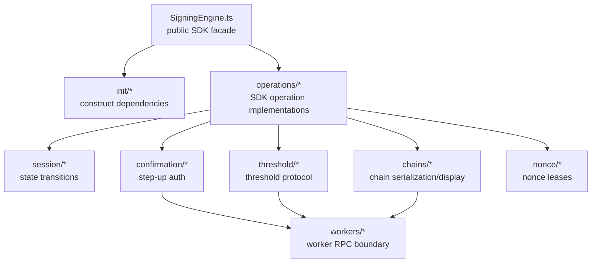
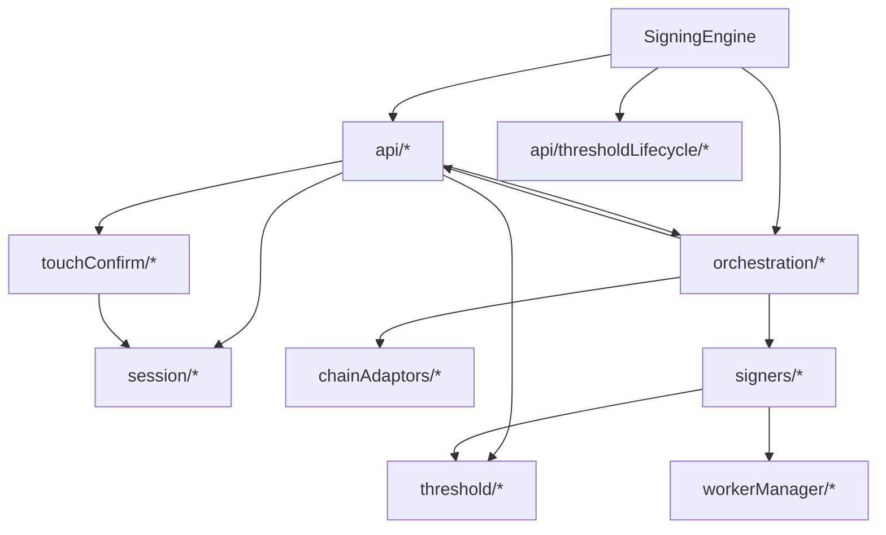
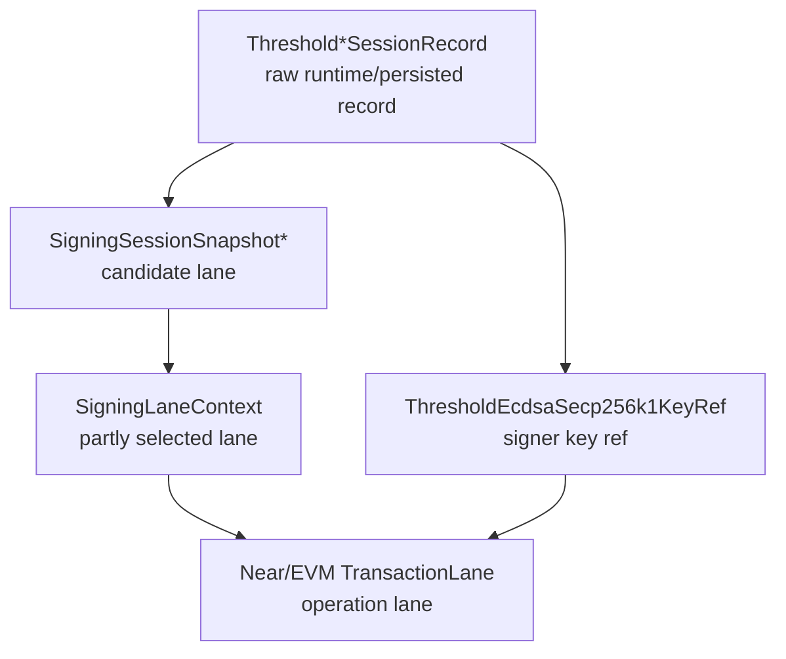
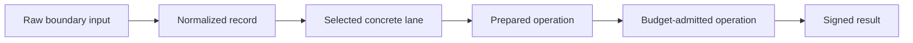
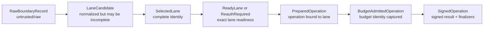
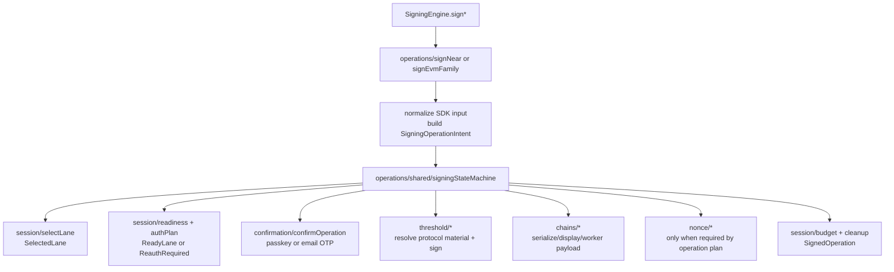
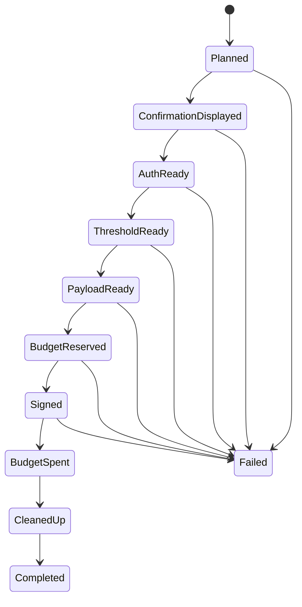

# Refactor 33: Signing Engine Call-Graph Linearization

Date created: 2026-05-04
Status: proposed

## Purpose

This refactor simplifies the SDK internals under
`client/src/core/signingEngine`. The main goal is to make the folder structure
read like the runtime call graph: high-level SDK entrypoints call operation
modules, operation modules call narrower state/confirmation/protocol/worker
boundaries, and boundary modules do not call back up into the operation layer.

This is not a compatibility refactor. Do not preserve old helper surfaces,
deprecated import paths, or legacy wrappers. Breaking internal imports is fine.
Delete obsolete modules, structs, and helper functions as each path is replaced.

## Goals

1. Simplify the SDK internals by deleting layers that do not own behavior.
2. Linearize the call graph so module hierarchy makes runtime execution obvious.
3. Remove wrapper classes, alias modules, one-method services, and callback bags
   that only pass calls through.
4. Remove duplicate structs and helper functions that exist only because two
   internal shapes overlap.
5. Make state transitions monotonic: raw input, normalized record, selected
   lane, prepared operation, budget-admitted operation, signed result.
6. Keep only abstractions that enforce real boundaries: SDK input,
   confirmation, threshold protocol, worker RPC, persistence, nonce management,
   or chain serialization.

## Call-Graph Organization Rule

The target structure should make ownership visible from imports.



Rules:

1. Parent modules may call child modules. Child modules must not call back into
   their parent.
2. Sibling modules should not communicate through `SigningEngine` wrapper
   methods.
3. A file should either be an operation flow or a boundary implementation. Avoid
   files that only rename or forward calls.
4. If two modules need the same data shape, promote one canonical type and
   delete the duplicate shape.
5. If a helper only normalizes or adapts data between two internal shapes, delete
   one of the shapes instead.

## Import Direction Contract

This contract is the main guardrail for linearizing the call graph. Folder moves
do not count as progress unless imports also move into this shape.

| From | May import | Must not import |
| --- | --- | --- |
| `SigningEngine.ts` | `init/*`, public operation entry modules under `operations/*` | `session/*`, `confirmation/*`, `threshold/*`, `chains/*`, `workers/*`, `nonce/*`, old `api/*`, old `orchestration/*` |
| `init/*` | constructors and types from `session/*`, `confirmation/*`, `threshold/*`, `chains/*`, `workers/*`, `nonce/*` | operation implementations, `SigningEngine.ts`, old `api/*`, old `orchestration/*` |
| `operations/signNear/*` | `operations/shared/*`, `session/*`, `confirmation/*`, `threshold/ed25519/*`, `chains/near/*`, `workers/*`, `nonce/*` | `SigningEngine.ts`, `init/*`, EVM/Tempo operation modules, old `api/*`, old `orchestration/*` |
| `operations/signEvmFamily/*` | `operations/shared/*`, `session/*`, `confirmation/*`, `threshold/ecdsa/*`, `chains/evm/*`, `chains/tempo/*`, `workers/*`, `nonce/*` | `SigningEngine.ts`, `init/*`, NEAR operation modules, old `api/*`, old `orchestration/*` |
| `operations/shared/*` | shared state types, command/port types, `session/identity.ts` type imports | concrete chain operation modules, `SigningEngine.ts`, `init/*`, old `api/*`, old `orchestration/*` |
| `session/*` | `workers/*` only from explicit worker/status boundaries; shared primitive types | `SigningEngine.ts`, `init/*`, `operations/*`, `confirmation/*`, `chains/*`, chain operation modules |
| `confirmation/*` | `workers/*`, confirmation UI/runtime internals | `SigningEngine.ts`, `init/*`, `operations/*`, `session/*` lifecycle modules, `threshold/*`, `chains/*`, `nonce/*` |
| `threshold/*` | `workers/*`, threshold crypto helpers, type-only imports from `session/identity.ts` | `SigningEngine.ts`, `init/*`, `operations/*`, `confirmation/*`, `chains/*`, `nonce/*`, session lifecycle modules |
| `chains/*` | `workers/*`, chain libraries, type-only imports from `session/identity.ts` where needed | `SigningEngine.ts`, `init/*`, `operations/*`, `confirmation/*`, `threshold/*`, session lifecycle modules |
| `nonce/*` | nonce persistence/RPC dependencies and primitive types | `SigningEngine.ts`, `init/*`, `operations/*`, `session/*`, `confirmation/*`, `threshold/*`, `chains/*` |
| `workers/*` | worker runtime code and primitive message types | `SigningEngine.ts`, `init/*`, `operations/*`, `session/*`, `confirmation/*`, `threshold/*`, `chains/*`, `nonce/*` |

Rules:

1. `operations/*` is the only layer that sequences a signing operation across
   session, confirmation, threshold, chain, worker, and nonce boundaries.
2. No child folder may import `operations/*`.
3. No operation module may import `SigningEngine.ts`.
4. Sibling boundary folders may share exact primitive or identity types, but
   must not call each other's lifecycle logic unless the table explicitly
   permits it.
5. Type-only imports are still dependencies and must follow this contract.

## No Internal Barrels

Do not add broad internal `index.ts` files under `client/src/core/signingEngine`.
They hide the call graph and make import-direction checks weaker.

Allowed:

1. A public SDK export outside the signing engine, if required by package API.
2. A tiny colocated type export file only when it has a named ownership reason
   in that folder's `README.md`.

Forbidden:

1. Compatibility barrels for old folders.
2. `operations/index.ts`, `session/index.ts`, `threshold/index.ts`,
   `chains/index.ts`, `confirmation/index.ts`, `workers/index.ts`, or
   `nonce/index.ts`.
3. Re-export files that let callers avoid importing the concrete module they
   actually depend on.

## Current Problem

The current top-level folders are noun groups:

```text
api/
orchestration/
chainAdaptors/
signers/
workerManager/
bootstrap/
session/
threshold/
touchConfirm/
emailOtp/
nonce/
```

That hides call order. `api/` and `orchestration/` both sound high-level, while
`chainAdaptors/` and `signers/` are sometimes operation-specific and sometimes
generic. `touchConfirm/` contains both generic confirmation contracts and the
concrete passkey/warm-material runtime. `threshold/session/` competes with
`session/` even though it mostly owns threshold relayer policy.

The result is a nonlinear call graph:



The same operation can pass through facade wrappers, dependency bundles,
adapter classes, engine classes, and helper functions before reaching the real
boundary. This makes the SDK harder to debug and makes refactors risky.

## Current Rescan Findings

Rescanned on 2026-05-06.

The plan still needs to be implemented; the current codebase is still largely
in the pre-refactor shape:

1. Old top-level folders still exist: `api/`, `orchestration/`,
   `chainAdaptors/`, `signers/`, `bootstrap/`, `threshold/session/`,
   `touchConfirm/shared/`, and `workerManager/`.
2. Broad internal barrel files still exist, including
   `signingEngine/index.ts`, `api/index.ts`, `chainAdaptors/index.ts`,
   `signers/index.ts`, `signers/wasm/index.ts`, `workerManager/index.ts`,
   and per-chain orchestration/index files.
3. `client/src/core/signingEngine/README.md` describes the old architecture
   around `api/`, `orchestration/executeSigningIntent`, `chainAdaptors/`, and
   `signers/algorithms`. It should be replaced or marked stale in Phase 0.
4. The existing architecture guard test is useful but encodes the old folder
   layout. It currently checks files under `api/*`, `orchestration/*`, and
   `session/signingSession/*`; it must be replaced with import-direction and
   deleted-path guards as slices move.
5. EVM/Tempo already have a partial execution-machine path. The command/state
   definitions live in `session/signingSession/execution.ts`, EVM-family command
   wrappers live in `api/evmFamily/signingFlowRuntime.ts`, post-sign execution
   uses `runSigningExecutionSteps` in `api/evmFamily/transactionExecutor.ts`,
   and actual transaction signing still runs through
   `orchestration/shared/evmFamilySigningFlow.ts`.
6. `api/tempoSigning.ts` is already a thin alias over `signEvmFamily`, so the
   first vertical slice should not be a cosmetic move of that file alone. The
   first slice must include the underlying EVM-family operation path it calls.
7. NEAR is not on the newer execution-machine path yet. It still uses
   `api/nearSigning.ts`, `orchestration/near/*`, transaction lane structs, and
   request-kind-specific flow files.
8. Duplicate lifecycle shapes are still live: `SigningLaneContext`,
   `EcdsaLaneIdentity`, `ThresholdEcdsaRuntimeLane`,
   `ThresholdEd25519SessionLane`, `NearEd25519TransactionLane`,
   `EvmFamilyEcdsaTransactionLane`, and
   `ConcreteThresholdEcdsaSessionRecord`.

## Recommended Folder Structure

Organize by call depth rather than noun category.

```text
client/src/core/signingEngine/
  SigningEngine.ts

  init/
    createSigningEngineRuntime.ts
    createManagers.ts
    createPorts.ts
    warmup.ts

  operations/
    shared/
      signingStateMachine.ts
      operationState.ts
      operationPorts.ts
    signNear/
      signNear.ts
      signTransactions.ts
      signDelegate.ts
      signNep413.ts
    signEvmFamily/
      signEvmFamily.ts
      signEvm.ts
      signTempo.ts
      nonceLifecycle.ts
      smartAccountDeployment.ts
    exportKey/
    registration/
    recovery/

  session/
    identity.ts
    records.ts
    snapshot.ts
    selectLane.ts
    readiness.ts
    authPlan.ts
    budget.ts
    restore.ts
    sealedStore.ts
    warm/
      readModel.ts
      provisionEd25519.ts
      provisionEcdsa.ts

  confirmation/
    confirmOperation.ts
    types.ts
    confirmers/
      passkey/
      emailOtp/
    ui/

  threshold/
    policy.ts
    ed25519/
      connect.ts
      hssLifecycle.ts
      export.ts
    ecdsa/
      bootstrap.ts
      keygen.ts
      authorize.ts
      sign.ts
      hssTransport.ts
      presignPool.ts

  chains/
    near/
      normalize.ts
      workerRequest.ts
      display.ts
    evm/
      adapter.ts
      display.ts
      wasm.ts
    tempo/
      adapter.ts
      display.ts
      wasm.ts

  workers/
    manager.ts
    transport.ts
    operations.ts
    runtimes/

  nonce/
```

This target keeps only real boundaries outside `operations/`:

1. `init/`: construction and startup only.
2. `operations/`: top-level SDK use cases.
3. `session/`: signing session lifecycle, readiness, budget, and
   persisted/runtime state.
4. `confirmation/`: human step-up auth boundary.
5. `threshold/`: threshold protocol and crypto boundary.
6. `chains/`: chain-specific serialization, display, and request assembly.
7. `workers/`: worker RPC boundary.
8. `nonce/`: nonce lease state and durable coordination.

Each new top-level folder must include a short `README.md` before the phase
that makes it non-trivial. The README must contain:

1. `Owns`: the lifecycle state or boundary the folder owns.
2. `May import`: the allowed imports copied from the import direction contract.
3. `Must not import`: the forbidden imports copied from the import direction
   contract.
4. `Entrypoints`: the files other folders are expected to call.

The README is not a design essay. It is an ownership note that lets reviewers
check whether a moved file belongs in that folder.

## What To Do With `orchestration/`

Do not nest `orchestration/` under `bootstrap/`. `bootstrap` should mean
construction/startup only. Most of current `orchestration/` is runtime signing
work, so putting it under `bootstrap/` would make the call graph less honest.

Split `orchestration/` by runtime owner:

| Current module | Target |
| --- | --- |
| `orchestration/executeSigningIntent.ts` | `operations/shared/signingStateMachine.ts` if it becomes the shared runner; otherwise delete it |
| `orchestration/near/*` | `operations/signNear/*` |
| `orchestration/evm/*` | `operations/signEvmFamily/*` or `chains/evm/*` depending on whether the code is operation flow or chain serialization |
| `orchestration/tempo/*` | `operations/signEvmFamily/*` or `chains/tempo/*` |
| `orchestration/shared/evmFamilySigningFlow.ts` | `operations/signEvmFamily/signEvmFamily.ts` or a local helper under that folder |
| `orchestration/thresholdActivation.ts` | `threshold/ecdsa/bootstrap.ts` if protocol-heavy; otherwise `operations/session/bootstrapEcdsa.ts` |
| `orchestration/walletOrigin/thresholdEcdsaCoordinator.ts` | `threshold/ecdsa/presignPool.ts` or `threshold/ecdsa/sign.ts` |
| `orchestration/ensureSmartAccountDeployed.ts` | `operations/signEvmFamily/smartAccountDeployment.ts` |
| `orchestration/smartAccountDeployment.ts` | `operations/signEvmFamily/smartAccountDeployment.ts` or `chains/evm/smartAccountDeployment.ts` |
| `orchestration/reportSmartAccountDeploymentObservation.ts` | same smart-account target as the writer/reader it supports |

Delete the `orchestration/` folder after its contents have moved. Do not leave a
compatibility barrel.

## Current To Target Mapping

### `bootstrap/`

Current role: manager assembly and dependency bundle creation.

Target: `init/`.

Move:

1. `bootstrap/managerAssembly.ts` -> `init/createManagers.ts`
2. `bootstrap/orchestrationDependencyFactory.ts` -> `init/createPorts.ts`
3. `bootstrap/runtimeBootstrap.ts` -> `init/createSigningEngineRuntime.ts`
4. `bootstrap/workerResourceWarmup.ts` -> `init/warmup.ts`

Delete callback wiring that only exists to route sibling modules through
`SigningEngine`.

### `api/`

Current role: a mix of public operation implementations, threshold lifecycle,
registration/recovery, and alias modules.

Target: mostly `operations/`.

Move:

1. `api/nearSigning.ts` -> `operations/signNear/signNear.ts`
2. `api/evmSigning.ts` -> `operations/signEvmFamily/signEvmFamily.ts`
3. `api/tempoSigning.ts` -> delete or reduce to public method glue; internal
   behavior belongs in `operations/signEvmFamily`.
4. `api/recovery/*` -> `operations/recovery/*` or `operations/exportKey/*`
5. `api/registration/*` -> `operations/registration/*`
6. `api/thresholdLifecycle/thresholdSessionStore.ts` ->
   `session/records.ts`
7. `api/thresholdLifecycle/thresholdSessionActivation.ts` ->
   `threshold/ecdsa/bootstrap.ts` or `operations/session/bootstrapEcdsa.ts`
8. `api/thresholdLifecycle/thresholdEd25519Lifecycle.ts` ->
   `threshold/ed25519/hssLifecycle.ts`
9. `api/thresholdLifecycle/*CommitQueue.ts` ->
   local operation queues under `operations/signNear` and
   `operations/signEvmFamily`, or one shared `session/commitQueue.ts` if both
   curves still need the same state owner.

### `chainAdaptors/` and `signers/`

Current role: generic signing intent adapters plus algorithm engines.

Target:

1. Chain serialization, digest construction, display, and worker request
   assembly move to `chains/<chain>`.
2. Algorithm engines remain only if they own real algorithm behavior. Delete
   engine classes that only redispatch to operation handlers.

Recommended moves:

1. `chainAdaptors/evm/*` -> `chains/evm/*`
2. `chainAdaptors/tempo/*` -> `chains/tempo/*`
3. `chainAdaptors/near/nearAdapter.ts` -> delete if NEAR uses concrete flows;
   otherwise move normalization to `chains/near/normalize.ts`
4. `signers/wasm/*` -> `chains/<chain>/wasm.ts` when the wrapper is
   chain-specific
5. `signers/algorithms/secp256k1.ts` -> `threshold/ecdsa/sign.ts` if runtime
   secp256k1 signing is only threshold-backed
6. `signers/algorithms/webauthnP256.ts` -> `confirmation/confirmers/passkey`
   or `chains/tempo` depending on whether it mostly packs WebAuthn signatures or
   handles passkey confirmation

### `touchConfirm/` and `emailOtp/`

Current role: concrete confirmation runtime, passkey collection, UI, warm
material bridge, Email OTP threshold lifecycle.

Target:

1. Generic confirmation contracts move to `confirmation/types.ts`.
2. Passkey step-up behavior moves to `confirmation/confirmers/passkey`.
3. Email OTP step-up behavior moves to `confirmation/confirmers/emailOtp`.
4. `TouchConfirmManager` remains a concrete secure confirmation runtime until it
   can be renamed or narrowed.
5. `EmailOtpThresholdSessionCoordinator` remains under `emailOtp/` only for
   threshold session provisioning/restoration. It should not own generic
   confirmation prompt contracts.

### `threshold/`

Current role: threshold policy, PRF helpers, relayer workflows, ECDSA signing,
Ed25519/ECDSA session connection.

Target:

1. `threshold/session/sessionPolicy.ts` -> `threshold/policy.ts` or
   `session/thresholdPolicy.ts`. Prefer `threshold/policy.ts` if it remains
   relayer-protocol policy construction.
2. `threshold/session/ed25519SessionTypes.ts` -> fold into `threshold/policy.ts`
   or `session/identity.ts`.
3. `threshold/workflows/*` -> `threshold/ed25519/*` or `threshold/ecdsa/*`.
4. `threshold/webauthn.ts` -> `threshold/crypto/webauthnPrf.ts`.
5. `threshold/prfSalts.ts` and `threshold/ed25519WrapKeySalt.ts` ->
   `threshold/crypto/*`.

## Key Data Structure Direction

The fix is not more converters. The fix is fewer valid internal shapes.

Current flow passes several overlapping shapes:



Target flow should narrow state once and pass it forward:



Rules:

1. Raw boundary and persistence reads may be malformed until normalized.
2. Selected lanes may not contain optional identity, auth, restore, budget, or
   signing fields.
3. Function inputs must require the narrowest valid state.
4. Helpers that accept broad records but require concrete fields should be
   deleted or changed to accept concrete lanes.

## Struct Consolidation Plan

### Canonical State Layers

Keep only these layers inside operation code:



Allowed broad shapes:

1. Raw SDK input.
2. Persistence reads.
3. Worker responses.
4. Relayer responses.
5. Config reads.

Everything past normalization must be a narrowed discriminated state.

### Canonical Types

Create `session/identity.ts` with the only concrete lane identity types:

```ts
type SigningCurve = 'ed25519' | 'ecdsa';
type SigningAuthMethod = 'passkey' | 'email_otp';

type BaseSelectedLane = {
  kind: 'selected_lane';
  walletSession: WalletSessionRef;
  authMethod: SigningAuthMethod;
  walletSigningSessionId: WalletSigningSessionId;
  thresholdSessionId: ThresholdSessionId;
  signingRootId: string;
  signingRootVersion: string;
};

type SelectedEd25519Lane = BaseSelectedLane & {
  curve: 'ed25519';
  nearAccount: NearAccountRef;
  chain: 'near';
  thresholdSessionId: ThresholdEd25519SessionId;
};

type SelectedEcdsaLane = BaseSelectedLane & {
  curve: 'ecdsa';
  subjectId: WalletSubjectId;
  thresholdSessionId: ThresholdEcdsaSessionId;
  chainTarget: ThresholdEcdsaChainTarget;
  ecdsaThresholdKeyId: EcdsaThresholdKeyId;
};

type SelectedLane = SelectedEd25519Lane | SelectedEcdsaLane;
```

Create `operations/shared/operationState.ts` with monotonic operation states:

```ts
type ReadyLane<TLane extends SelectedLane> = {
  kind: 'ready_lane';
  lane: TLane;
  readiness: SigningReadyState;
};

type ReauthRequired<TLane extends SelectedLane> = {
  kind: 'reauth_required';
  lane: TLane;
  plan: SigningAuthPlan;
};

type LaneReadiness<TLane extends SelectedLane> =
  | ReadyLane<TLane>
  | ReauthRequired<TLane>;

type ReadyEcdsaLane = ReadyLane<SelectedEcdsaLane> & {
  backingMaterialSessionId: BackingMaterialSessionId;
};

type PreparedOperation<TLane extends SelectedLane> = {
  kind: 'prepared_operation';
  intent: SigningOperationIntent;
  lane: TLane;
  readiness: LaneReadiness<TLane>;
  authPlan: SigningAuthPlan;
  snapshotGeneration: number;
};

type BudgetAdmittedOperation<TLane extends SelectedLane> =
  Omit<PreparedOperation<TLane>, 'kind'> & {
    kind: 'budget_admitted_operation';
    budgetAdmission: BudgetAdmission;
  };

type SignedOperation<TLane extends SelectedLane, TResult> =
  Omit<BudgetAdmittedOperation<TLane>, 'kind'> & {
    kind: 'signed_operation';
    result: TResult;
  };
```

Raw records stay raw:

1. `ThresholdEcdsaSessionRecord`
2. `ThresholdEd25519SessionRecord`
3. sealed session records
4. snapshot candidates
5. worker status responses

These raw shapes must not be operation inputs after lane selection.

### Delete Or Demote These Shapes

The following current shapes should be deleted, folded into canonical selected
lanes, or demoted to raw boundary candidates:

| Current shape | Target |
| --- | --- |
| `SigningLaneContext` | Replace with `SelectedLane` for concrete operation code. Keep a raw/candidate shape only if planner inputs need incompleteness. |
| `EcdsaLaneIdentity` | Fold into `SelectedEcdsaLane`. |
| `ThresholdEcdsaRuntimeLane` | Demote to a raw runtime candidate returned by record readers. Convert to `SelectedEcdsaLane` once. |
| `ThresholdEcdsaSessionLane` | Delete if it only keys records. Use canonical lane key helpers over `SelectedEcdsaLane` or raw record key helpers at the store boundary. |
| `ThresholdEd25519SessionLane` | Same as ECDSA: store-boundary key input only, not operation state. |
| `SigningSessionSnapshotEcdsaLane` | Candidate only. Missing lanes are represented by a separate discriminant; concrete candidates carry full identity. |
| `SigningSessionSnapshotEd25519Lane` | Candidate only. Missing lanes are represented by a separate discriminant; concrete candidates carry full identity. |
| `NearEd25519TransactionLane` | Replace with `SelectedEd25519Lane` plus transaction metadata. |
| `EvmFamilyEcdsaTransactionLane` | Replace with `SelectedEcdsaLane` plus transaction metadata. |
| `ConcreteThresholdEcdsaSessionRecord` | Replace with `SelectedEcdsaLane` plus raw `ThresholdEcdsaSessionRecord` where protocol material is needed. |

### Boundary Conversion Points

There should be only three conversion points:

1. `session/records.ts`
   - raw persistence/runtime record -> normalized record
   - normalized record -> `LaneCandidate`
2. `session/selectLane.ts`
   - candidates/snapshot/account policy -> `SelectedLane` or typed selection
     failure
3. `session/readiness.ts`
   - selected lane + runtime status -> readiness state for that exact lane

Everything else receives the selected lane or a later operation state.

### Key Ref Handling

`ThresholdEcdsaSecp256k1KeyRef` should not be used as identity after lane
selection. It is protocol material derived for signing/export.

Target:

```ts
type ThresholdProtocolMaterial =
  | {
      curve: 'ecdsa';
      lane: SelectedEcdsaLane;
      keyRef: ThresholdEcdsaSecp256k1KeyRef;
      record: ThresholdEcdsaSessionRecord;
    }
  | {
      curve: 'ed25519';
      lane: SelectedEd25519Lane;
      record: ThresholdEd25519SessionRecord;
    };
```

Rules:

1. ECDSA signing selects a lane first, then resolves protocol material for that
   lane.
2. Key-ref lookup must take `SelectedEcdsaLane`, not broad account/chain/source
   inputs, once an operation is selected.
3. Signing code must not reselect a different key ref if protocol material is
   missing. It returns a typed readiness or protocol-material failure for the
   selected lane.

### Type Narrowing Checklist

For every operation flow, enforce this checklist:

1. SDK input may be raw.
2. Normalize chain/account/session input once at the operation boundary.
3. Select exactly one lane.
4. From that point forward, do not pass snapshot lanes, raw session records, or
   key refs as identity.
5. Prepare auth and budget against the selected lane.
6. Resolve threshold protocol material for the selected lane only.
7. Finalize and spend budget against the selected lane only.

If a function cannot satisfy these rules, its input type is too broad.

### Implementation Order For Struct Consolidation

1. Add canonical lane identity types first, without changing behavior.
2. Change lane selection to return `SelectedLane` instead of snapshot lanes,
   transaction lanes, or partially concrete session records.
3. Change readiness/auth/budget functions to accept `SelectedLane` or
   `PreparedOperation`, not account ids plus raw records.
4. Change ECDSA protocol-material lookup to accept `SelectedEcdsaLane`.
5. Replace transaction lane structs with operation metadata plus selected lane.
6. Delete the old duplicate lane structs and all converters between them in the
   same patch that removes their last caller.

## Shared Signing State Machine

EVM, Tempo, and NEAR should all use the newer state-machine approach. The
state machine should be the single operation runner; chain-specific modules
should provide typed adapters for normalization, display, nonce/payload
preparation, threshold execution, and finalization.

Promote the current `session/signingSession/execution.ts` concept to
`operations/shared/signingStateMachine.ts`. The machine belongs under
`operations/` because it sequences operation-time work across `session`,
`confirmation`, `threshold`, `chains`, `workers`, and `nonce`.

Target call chain:



Shared states:



Shared commands:

1. `showConfirmation`
2. `requestOtp`
3. `requestPasskey`
4. `connectThreshold`
5. `preparePayload`
6. `reserveBudget`
7. `sign`
8. `spendBudget`
9. `cleanup`

Chain-specific differences must be expressed as typed operation plans, not as
separate orchestration stacks:

| Concern | NEAR | EVM | Tempo |
| --- | --- | --- | --- |
| selected lane | `SelectedEd25519Lane` | `SelectedEcdsaLane` | `SelectedEcdsaLane` |
| threshold material | Ed25519 HSS/session record | ECDSA key ref + HSS/presign material | ECDSA key ref + HSS/presign material |
| payload preparation | NEAR transaction/delegate/NEP-413 worker payload | EVM transaction/signature payload, smart-account deployment if needed | Tempo transaction/signature payload |
| nonce stage | NEAR transaction nonce/block context when required by the request | managed EVM nonce lease | Tempo nonce lifecycle |
| display | NEAR display plan | EVM display plan | Tempo display plan |
| finalization | budget spend, warm session cleanup | budget spend, nonce commit/release, deployment finalizers | budget spend, nonce commit/release |

Rules:

1. There is one state-machine runner for signing operations.
2. EVM/Tempo and NEAR may have different typed plans, but they must advance
   through the same state names and command executor contract.
3. Chain modules must not call confirmation, session budget, or threshold
   lifecycle directly. They provide adapters that the machine calls.
4. The machine receives `SelectedLane` or later operation state. It does not
   accept snapshot lanes, raw records, broad account ids, or key refs as
   identity.
5. A command may be omitted by the typed plan when not applicable; do not create
   no-op chain-specific runners.

## Redundancy Hotspots To Remove

### 1. `SigningEngine` Wrapper Surface

`SigningEngine` should expose public SDK methods and own init construction.
It should not be the communication bus between internal modules.

Delete internal pass-through methods once their callers receive the real service
or direct module dependency.

### 2. `api/tempoSigning.ts`

Tempo signing is EVM-family signing with Tempo-specific chain serialization and
nonce behavior. Delete the internal alias module. Keep `SigningEngine.signTempo`
as the public SDK method if needed.

### 3. NEAR Double Dispatch

NEAR currently has request-kind dispatch plus adapter/engine redispatch. Delete
the second dispatch path and run NEAR through the shared signing state machine.
NEAR-specific code should only normalize request kinds into typed operation
plans and provide chain adapters for display, payload preparation, threshold
execution, and finalization.

### 4. Duplicate Session Kind Types

Consolidate all local `type EcdsaSessionKind = 'jwt' | 'cookie'` aliases and
normalizers into one policy/session type.

### 5. Duplicate Lane Shapes

Collapse overlapping lane/session identity structs into one canonical selected
lane per curve, plus raw record and snapshot candidate types.

### 6. Dependency Callback Bags

Replace bags of one-method callbacks with cohesive boundary objects only where
those objects own state or enforce a boundary. Otherwise use direct function
imports.

## Success Metrics

These metrics must be checked at the end of every implementation phase:

1. Each migrated public signing method delegates to exactly one operation module
   within one hop from `SigningEngine.ts`.
2. No operation module imports `SigningEngine.ts`.
3. No child folder imports `operations/*`.
4. No moved operation leaves its old folder/file path behind.
5. Every deleted old import path is enforced by an architecture guard.
6. Every new top-level folder touched by the phase has an ownership `README.md`
   with `Owns`, `May import`, `Must not import`, and `Entrypoints`.
7. No broad internal `index.ts` or compatibility barrel is introduced.
8. The phase removes at least one redundant wrapper, duplicate struct, or
   obsolete helper unless the phase is explicitly only guardrail setup.

## Implementation Plan

This should be implemented as staged PRs. Each phase must leave the SDK
building and must delete the old path that it replaces. Do not create
compatibility barrels, deprecated aliases, or transition flags.

### Phase 0: Baseline, Inventory, And Guardrails

Purpose: make the current shape measurable before moving code.

Todo:

- [ ] Record the current signing entrypoints exposed by `SigningEngine`.
- [ ] Inventory every import from `api/*`, `orchestration/*`,
  `chainAdaptors/*`, `signers/*`, `touchConfirm/*`, `emailOtp/*`,
  `threshold/session/*`, and `session/signingSession/*`.
- [ ] Classify each file as one of: public facade, operation flow, boundary,
  state owner, pure chain serialization, worker RPC, test helper, or wrapper.
- [ ] Mark wrappers for deletion when they only rename, forward, or adapt
  between two internal shapes.
- [ ] Capture the minimum test set for each user-facing flow:
  NEAR transactions, NEAR delegate, NEP-413, EVM signing, Tempo signing, key
  export, registration, recovery, passkey confirmation, and email OTP
  confirmation.
- [ ] Add architecture guard checks only if they prevent new imports from old
  folders during the refactor.
- [ ] Add an import-direction guard matching the import direction contract.
- [ ] Replace or split the existing
  `tests/unit/signingSessionCoordinator.architecture.guard.unit.test.ts`
  checks that hard-code old `api/*`, `orchestration/*`, and
  `session/signingSession/*` locations.
- [ ] Add a folder ownership README template with `Owns`, `May import`,
  `Must not import`, and `Entrypoints`.
- [ ] Add a no-internal-barrels guard for broad `index.ts` files under
  `client/src/core/signingEngine`.
- [ ] Replace or clearly mark the root `client/src/core/signingEngine/README.md`
  as stale until the target ownership READMEs exist.
- [ ] Inventory existing internal `index.ts` files and classify them as public
  package API, UI component-local exports, or internal barrels to delete.

Exit criteria:

- [ ] There is a file-by-file inventory for the signing engine.
- [ ] Every remaining abstraction has a stated reason to exist.
- [ ] The refactor has a known build/test command set.
- [ ] The root signing-engine README no longer presents the old architecture as
  current target architecture.
- [ ] Import direction, deleted-path, and no-barrel guardrails are ready before
  canonical state types or the first vertical slice move.

### Phase 1: Promote Canonical Internal State Types

Purpose: define the narrow state model before moving operation flows. This
prevents the first vertical slice from preserving ambiguous lane/session shapes
under cleaner folder names.

Todo:

- [ ] Add `session/identity.ts`.
- [ ] Define `SigningCurve`, `SigningAuthMethod`, `SelectedEd25519Lane`,
  `SelectedEcdsaLane`, and `SelectedLane`.
- [ ] Add branded or exact id types for wallet signing session id, threshold
  session id, ECDSA key id, signing root id, and signing root version if they
  are not already exact enough.
- [ ] Add `operations/shared/operationState.ts`.
- [ ] Define `ReadyLane`, `ReauthRequired`, `LaneReadiness`,
  `PreparedOperation`, `BudgetAdmittedOperation`, and `SignedOperation`.
- [ ] Keep raw persistence and worker response structs in their boundary
  modules.
- [ ] Add compile-time guards or focused tests proving selected lanes do not
  expose optional identity, auth, restore, budget, or signing fields.
- [ ] Replace local duplicate auth/session-kind aliases with one canonical type
  where this can be done without moving a full operation path.
- [ ] Add a temporary mapping note that states which current shapes are allowed
  only as raw/candidate compatibility inputs during the first slice:
  `SigningLaneContext`, `EcdsaLaneIdentity`, `ThresholdEcdsaRuntimeLane`,
  transaction lanes, and snapshot lanes.

Exit criteria:

- [ ] New operation-state types compile.
- [ ] Internal operation-state types do not contain optional lifecycle fields.
- [ ] Duplicate local `EcdsaSessionKind` aliases are gone or scheduled with a
  single owning file.
- [ ] The first vertical slice has canonical target types to depend on before
  files move.

### Phase 2: First Complete Vertical Slice

Purpose: prove the target call graph with one real operation before broad folder
moves. Start with one EVM-family path, preferably Tempo if it has the smallest
surface area, or EVM if its tests are stronger.

Todo:

- [ ] Choose exactly one public method as the first slice:
  `SigningEngine.signTempo*` or one concrete `SigningEngine.signEvm*` path.
- [ ] Treat `api/tempoSigning.ts` as an alias only. If Tempo is chosen, the
  slice must include the underlying `api/evmSigning.ts` and `api/evmFamily/*`
  path that actually performs the work.
- [ ] Use the current partial state-machine code as the source of truth:
  `session/signingSession/execution.ts`,
  `api/evmFamily/signingFlowRuntime.ts`,
  `api/evmFamily/transactionExecutor.ts`, and
  `orchestration/shared/evmFamilySigningFlow.ts`.
- [ ] Create only the target folders needed by that slice.
- [ ] Add ownership `README.md` files for every new top-level folder touched by
  the slice.
- [ ] Move that public method's implementation to one operation entry module:
  `operations/signEvmFamily/signTempo.ts` or
  `operations/signEvmFamily/signEvm.ts`.
- [ ] Use `SelectedEcdsaLane` and shared operation-state types at the new
  operation boundary. Old lane/session shapes may enter only through explicit
  raw/candidate conversion points.
- [ ] Make the public `SigningEngine` method delegate to that operation module
  within one hop.
- [ ] Move only the chain-specific serialization/display/worker-payload code
  used by the slice to `chains/tempo/*` or `chains/evm/*`.
- [ ] Move only the session, confirmation, threshold, worker, and nonce helpers
  needed by the slice to their target folders.
- [ ] Extract the existing signing execution machine into
  `operations/shared/signingStateMachine.ts` only as far as needed for this
  slice to execute through it.
- [ ] Collapse EVM-family runtime command wrappers into the shared machine port
  contract instead of adding another wrapper layer.
- [ ] Delete the old internal path for the moved slice in the same PR.
- [ ] Add an architecture guard that rejects importing the deleted path.
- [ ] Do not move unrelated files just to populate the target folders.

Exit criteria:

- [ ] The selected public method delegates to one operation module within one
  hop.
- [ ] The operation module does not import `SigningEngine.ts`.
- [ ] No child module imports `operations/*`.
- [ ] The operation boundary accepts canonical selected lane or operation state,
  not broad `SigningLaneContext` or transaction lane identity.
- [ ] The selected slice uses `operations/shared/signingStateMachine.ts`, not
  `session/signingSession/execution.ts`.
- [ ] The old folder/file path for the moved slice is deleted.
- [ ] An architecture guard enforces the deleted import path.
- [ ] No broad internal `index.ts` file is introduced.

### Phase 3: Normalize Session Records At Explicit Boundaries

Purpose: stop carrying raw records, snapshots, and partial lanes through
operation code.

Todo:

- [ ] Move threshold session record ownership from
  `api/thresholdLifecycle/thresholdSessionStore.ts` to `session/records.ts`.
- [ ] Keep persistence-read normalization in `session/records.ts`.
- [ ] Add `session/snapshot.ts` as the only snapshot read model.
- [ ] Add `session/selectLane.ts` as the only selected-lane boundary.
- [ ] Add `session/readiness.ts` as the only selected-lane readiness boundary.
- [ ] Convert raw records and snapshots into `LaneCandidate` only inside
  `session/records.ts` or `session/snapshot.ts`.
- [ ] Convert candidates into `SelectedLane` only inside `session/selectLane.ts`.
- [ ] Update callers that currently accept `SigningLaneContext`,
  `EcdsaLaneIdentity`, `ThresholdEcdsaRuntimeLane`, transaction lanes, or
  snapshot lanes as identity.
- [ ] Delete converters that exist only to reshape one internal lane identity
  into another.

Exit criteria:

- [ ] Signing operation code receives `SelectedLane` or later operation state.
- [ ] Snapshot lanes cannot be passed into signing.
- [ ] Raw threshold session records are only accepted by boundary and protocol
  material functions.

### Phase 4: Move And Generalize The Signing State Machine

Purpose: make one runner sequence confirmation, threshold readiness, payload
preparation, budget, signing, spend, and cleanup.

Todo:

- [ ] Move `session/signingSession/execution.ts` to
  `operations/shared/signingStateMachine.ts`.
- [ ] Move or merge the EVM-family runtime command wrappers from
  `api/evmFamily/signingFlowRuntime.ts` into explicit machine command
  executors.
- [ ] Move post-sign execution from `api/evmFamily/transactionExecutor.ts`
  behind the shared machine finalization commands.
- [ ] Remove session-specific naming from the machine where it is operation
  sequencing rather than session state.
- [ ] Define `operationPorts.ts` for the machine executor contract.
- [ ] Make machine commands typed around `SelectedLane` and
  `PreparedOperation`, not raw records or broad account ids.
- [ ] Keep the command set shared: `showConfirmation`, `requestOtp`,
  `requestPasskey`, `connectThreshold`, `preparePayload`, `reserveBudget`,
  `sign`, `spendBudget`, and `cleanup`.
- [ ] Allow a typed operation plan to omit commands that are not applicable.
- [ ] Delete `orchestration/executeSigningIntent.ts` if it does not become the
  shared runner.
- [ ] Replace any bespoke execution trace/event types with the shared machine
  trace type.

Exit criteria:

- [ ] There is one state-machine runner for signing operations.
- [ ] The runner lives under `operations/shared`.
- [ ] No production file imports `session/signingSession/execution.ts`.
- [ ] It does not import chain-specific operation modules.
- [ ] It does not accept raw snapshot lanes, raw records, broad account ids, or
  key refs as identity.

### Phase 5: Port EVM And Tempo To The Shared Machine

Purpose: make EVM and Tempo share one ECDSA operation path while keeping
chain-specific behavior in typed adapters.

Todo:

- [ ] Move EVM-family operation code from `api/evmFamily/*` and
  `orchestration/shared/evmFamilySigningFlow.ts` into
  `operations/signEvmFamily/*`.
- [ ] Keep `SigningEngine.signEvm*` and `SigningEngine.signTempo*` as public
  facade methods only.
- [ ] Delete `api/tempoSigning.ts` as an internal alias once its callers enter
  `operations/signEvmFamily`.
- [ ] Delete the dynamic signer-loader dependency on
  `orchestration/evm/evmSigningFlow` and
  `orchestration/tempo/tempoSigningFlow`; load concrete chain adapters from the
  target folders or call them directly from the operation plan.
- [ ] Move EVM serialization, display, and worker payload assembly to
  `chains/evm/*`.
- [ ] Move Tempo serialization, display, and worker payload assembly to
  `chains/tempo/*`.
- [ ] Move EVM nonce lease logic to `nonce/*` or
  `operations/signEvmFamily/nonceLifecycle.ts` depending on whether it owns
  durable nonce state or operation sequencing.
- [ ] Move Tempo nonce lifecycle logic to the same boundary pattern as EVM.
- [ ] Represent EVM/Tempo differences as `SelectedEcdsaLane` plus a typed
  `chainTarget`.
- [ ] Make ECDSA protocol-material lookup accept `SelectedEcdsaLane`.
- [ ] Run EVM and Tempo through `operations/shared/signingStateMachine.ts`.
- [ ] Delete bespoke EVM-family orchestration loops after the shared machine
  owns sequencing.

Exit criteria:

- [ ] EVM and Tempo advance through the shared machine states.
- [ ] Tempo-specific code is only chain serialization, display, worker payload,
  nonce behavior, or public facade naming.
- [ ] No internal `tempoSigning` alias module remains.
- [ ] No EVM-family file imports from `orchestration/evm/*`,
  `orchestration/tempo/*`, or `orchestration/shared/evmFamilySigningFlow.ts`.
- [ ] ECDSA signing does not use key refs as operation identity.

### Phase 6: Port NEAR To The Shared Machine

Purpose: make NEAR conform to the same operation lifecycle without hiding NEAR
differences behind a second dispatch stack.

Todo:

- [ ] Move NEAR public-method implementation code from `api/nearSigning.ts` to
  `operations/signNear/*`.
- [ ] Split NEAR operation entrypoints into `signTransactions.ts`,
  `signDelegate.ts`, and `signNep413.ts` if those are distinct SDK behaviors.
- [ ] Keep request-kind normalization in one NEAR operation boundary.
- [ ] Move NEAR normalization, display, and worker payload assembly to
  `chains/near/*`.
- [ ] Replace `NearAdapter`, `NearEd25519Engine`, or equivalent redispatch
  layers with typed operation plans.
- [ ] Port `orchestration/near/transactionsFlow.ts`,
  `orchestration/near/delegateFlow.ts`, and
  `orchestration/near/nep413Flow.ts` to shared-machine command executors rather
  than moving them as a second runner.
- [ ] Move `orchestration/near/shared/workerRequestAssembly.ts` to
  `chains/near/workerRequest.ts` when the first NEAR operation uses it.
- [ ] Represent NEAR signing identity as `SelectedEd25519Lane`.
- [ ] Resolve Ed25519 threshold protocol material only after lane selection.
- [ ] Run NEAR through `operations/shared/signingStateMachine.ts`.
- [ ] Delete the unused `orchestration/near/*` path after its flows move.

Exit criteria:

- [ ] NEAR request-kind dispatch exists in one place.
- [ ] NEAR advances through the same machine states as EVM/Tempo.
- [ ] NEAR operation code does not pass snapshot lanes, raw records, or partial
  lane contexts into signing.
- [ ] Worker request assembly is below the selected operation plan.

### Phase 7: Split Confirmation From Concrete Confirmation Runtimes

Purpose: make step-up auth a real boundary with passkey and email OTP
confirmers beside each other.

Todo:

- [ ] Add `confirmation/types.ts`.
- [ ] Add `confirmation/confirmOperation.ts`.
- [ ] Move generic prompt/auth-plan contracts out of `touchConfirm/shared`.
- [ ] Add `confirmation/confirmers/passkey/*`.
- [ ] Add `confirmation/confirmers/emailOtp/*`.
- [ ] Keep `TouchConfirmManager` as the concrete passkey/secure UI runtime
  until its responsibilities can be narrowed further.
- [ ] Keep `EmailOtpThresholdSessionCoordinator` only for email OTP threshold
  provisioning/restoration/session lifecycle.
- [ ] Remove any duplicated email OTP prompt/challenge handling from NEAR and
  EVM-family operation flows.
- [ ] Make the shared state-machine confirmation commands call confirmers, not
  chain modules.

Exit criteria:

- [ ] Operation flows depend on `confirmation/*`, not `touchConfirm/*`
  internals.
- [ ] `touchConfirm/` no longer owns generic confirmation types.
- [ ] Email OTP and passkey are organized as sibling confirmers.

### Phase 8: Clarify Threshold Protocol Ownership

Purpose: make `threshold/` own cryptographic and relayer protocol mechanics,
not product session lifecycle.

Todo:

- [ ] Move threshold policy construction out of `threshold/session/*`.
- [ ] Delete `threshold/session/*` after moving the last real module.
- [ ] Move Ed25519 protocol workflows to `threshold/ed25519/*`.
- [ ] Move ECDSA protocol workflows to `threshold/ecdsa/*`.
- [ ] Move PRF, WebAuthn PRF, and wrap-key salt helpers to
  `threshold/crypto/*` if they are protocol material.
- [ ] Ensure ECDSA `sign`, `authorize`, `bootstrap`, `hssTransport`, and
  `presignPool` take selected lanes or protocol material, not broad session
  shapes.
- [ ] Ensure Ed25519 HSS lifecycle and export take selected lanes or protocol
  material, not snapshots.
- [ ] Delete duplicate threshold policy/session-kind structs.

Exit criteria:

- [ ] No imports from `signingEngine/threshold/session/*`.
- [ ] Threshold modules do not own lane selection, readiness, budget, restore,
  or product session lifecycle.
- [ ] Protocol material is resolved for a selected lane only.

### Phase 9: Shrink `SigningEngine` To Facade And Composition Root

Purpose: stop using `SigningEngine` as an internal message bus.

Todo:

- [ ] Keep public SDK methods on `SigningEngine`.
- [ ] Keep construction and owned manager instances on `SigningEngine`.
- [ ] Move operation implementations behind direct calls into
  `operations/*`.
- [ ] Replace internal calls to `SigningEngine` store/lookup/queue wrappers with
  direct dependencies passed from `init/createPorts.ts`.
- [ ] Delete wrapper methods once their last internal caller is removed.
- [ ] Delete internal queue/store methods that only forward to another owner.
- [ ] Keep public SDK compatibility only where it is part of the external API;
  do not preserve old internal import paths.

Exit criteria:

- [ ] `SigningEngine.ts` reads as public facade plus dependency ownership.
- [ ] Internal operation call paths do not bounce through `SigningEngine`.
- [ ] Wrapper deletion reduces `SigningEngine.ts` substantially.

### Phase 10: Delete Old Folders And Enforce Import Direction

Purpose: remove refactor leftovers before they become the new legacy layer.

Todo:

- [ ] Delete `api/*` modules whose behavior moved to `operations/*`.
- [ ] Delete `orchestration/*` after its last operation moves.
- [ ] Delete `chainAdaptors/*` after chain code moves to `chains/*`.
- [ ] Delete `signers/*` files that are now chain-specific or threshold
  protocol-specific.
- [ ] Delete `threshold/session/*`.
- [ ] Delete `touchConfirm/shared/*` if generic contracts moved to
  `confirmation/*`.
- [ ] Delete broad internal barrels after their callers import concrete files:
  `api/index.ts`, `chainAdaptors/index.ts`, `chainAdaptors/*/index.ts`,
  `signers/index.ts`, `signers/algorithms/index.ts`, `signers/wasm/index.ts`,
  `signers/webauthn/index.ts`, `orchestration/*/index.ts`,
  `touchConfirm/index.ts`, and `workerManager/index.ts`.
- [ ] Add or update architecture tests that reject imports from deleted
  folders.
- [ ] Run the full signing engine test set.

Exit criteria:

- [ ] Deleted folders are not recreated as compatibility barrels.
- [ ] Remaining `index.ts` files under `signingEngine/` are limited to public
  package API or UI component-local exports documented in an ownership README.
- [ ] Architecture tests enforce target import direction.
- [ ] The full targeted signing test set passes.

### Phase 11: Final Consolidation Pass

Purpose: remove duplicate types and helpers revealed by the move.

Todo:

- [ ] Search for remaining `SigningLaneContext`, `EcdsaLaneIdentity`,
  `ThresholdEcdsaRuntimeLane`, `ThresholdEcdsaSessionLane`,
  `ThresholdEd25519SessionLane`, `NearEd25519TransactionLane`,
  `EvmFamilyEcdsaTransactionLane`, and
  `ConcreteThresholdEcdsaSessionRecord` references.
- [ ] Delete each remaining duplicate shape or demote it to a raw boundary type
  with a boundary-only name.
- [ ] Search for helpers named `normalize*`, `to*`, `from*`, `build*Lane`, and
  `resolve*Identity`.
- [ ] Delete helpers that only convert between internal shapes.
- [ ] Confirm selected-lane construction happens in exactly one boundary.
- [ ] Confirm budget, auth, restore, signing, and export functions accept the
  narrowest state required.
- [ ] Update local docs and diagrams to match the final folder structure.

Exit criteria:

- [ ] There are fewer internal structs for the same lifecycle state.
- [ ] Remaining converters live only at explicit boundaries.
- [ ] The folder tree reflects the call graph without old compatibility paths.

### Suggested PR Order

1. Inventory, import-direction guardrails, deleted-path guardrails, and
   ownership README template.
2. Canonical identity and operation-state types.
3. First complete EVM-family vertical slice, preferably Tempo if smaller, using
   the canonical state types at the operation boundary.
4. Shared signing state machine under `operations/shared`.
5. Complete EVM/Tempo state-machine port.
6. NEAR state-machine port.
7. Session record, snapshot, selection, and readiness boundary cleanup.
8. Confirmation split into `confirmation/confirmers/{passkey,emailOtp}`.
9. Threshold protocol folder cleanup.
10. `bootstrap/` -> `init/` for construction code not already moved by slices.
11. `SigningEngine` shrink pass.
12. Delete old folders and enforce import direction.
13. Final duplicate-struct and converter deletion pass.

## Non-Goals

1. Changing threshold cryptography.
2. Changing relayer API semantics.
3. Preserving old internal import paths.
4. Adding compatibility barrels.
5. Rewriting every signing flow in one patch.
6. Moving UI components before generic confirmation contracts are separated.

## Guardrails

1. Delete obsolete paths in the same phase that replaces them.
2. Do not introduce optional lifecycle fields in internal operation types.
3. Keep normalization at explicit boundaries: SDK input, worker messages, RPC,
   config, persistence reads, relayer responses.
4. Use concrete state types for selected lanes, prepared operations,
   budget-admitted operations, and signed operations.
5. Do not add adapter, manager, coordinator, or service classes unless they own
   state or enforce an external boundary.
6. Prefer a direct linear function call over an abstraction that only renames the
   call.
7. When a helper exists only because two internal structs overlap, delete one
   struct and make the narrower type the internal API.
8. Do not add broad internal `index.ts` files or compatibility barrels.
9. Every new top-level folder must have an ownership `README.md`.
10. Every moved vertical slice must satisfy the success metrics before the next
    slice starts.
