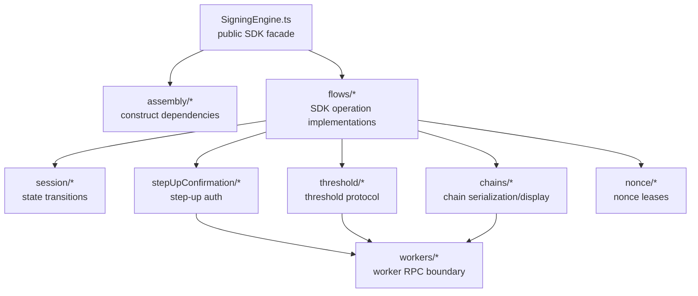
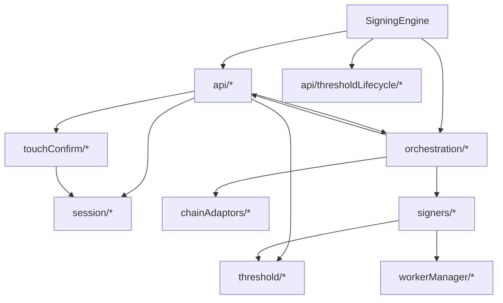
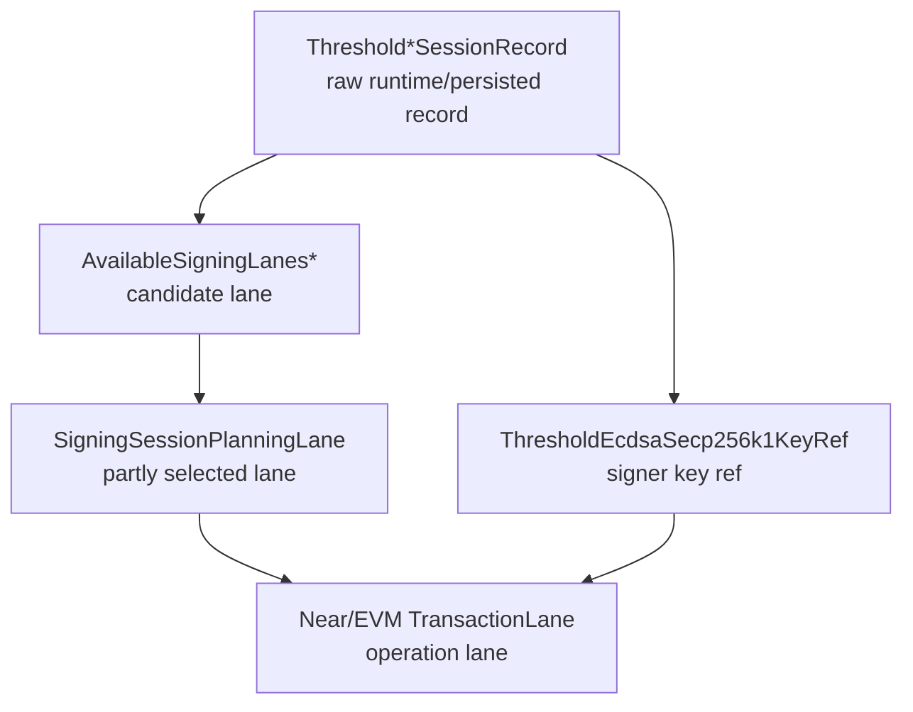
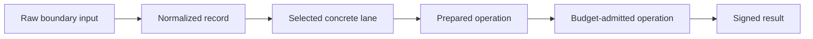
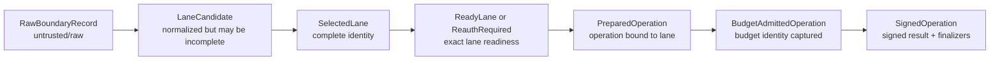
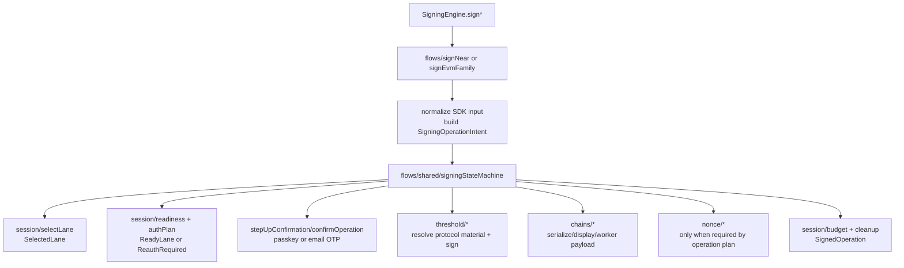
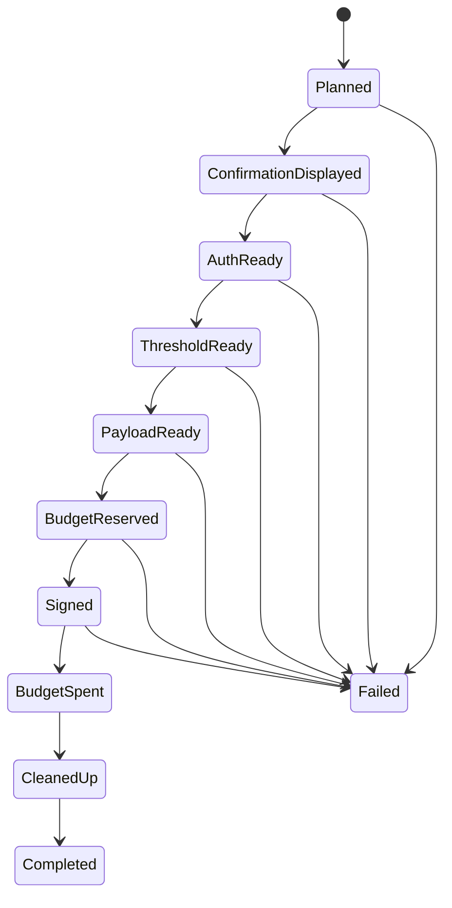
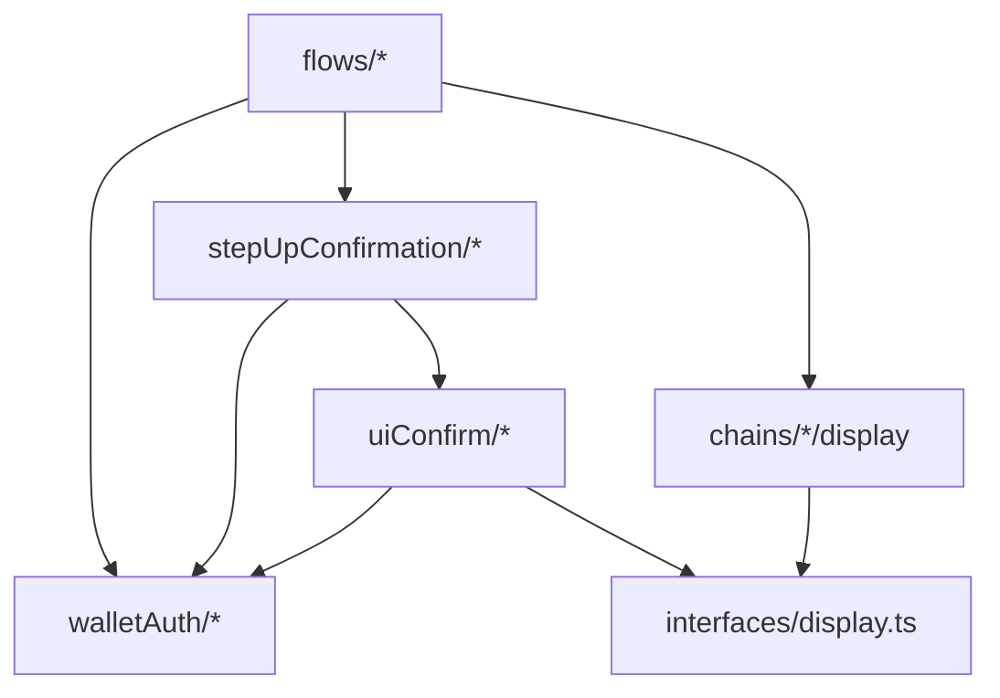
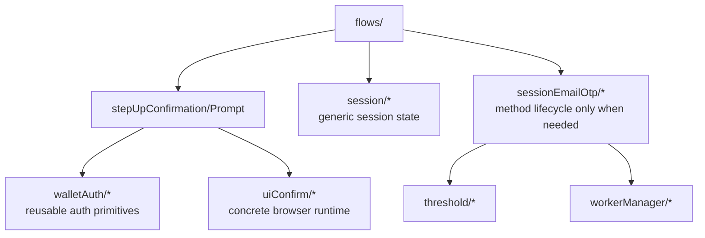

# Refactor 33: Signing Engine Call-Graph Linearization

Date created: 2026-05-04
Status: implemented through Phase 16; Phase 12 deep-cleanup follow-through completed except for future optional composition tightening

## Purpose

This refactor simplifies the SDK internals under
`client/src/core/signingEngine`. The main goal is to make the folder structure
read like the runtime call graph: high-level SDK entrypoints call operation
modules, operation modules call narrower state, step-up confirmation, protocol,
and worker boundaries, and boundary modules do not call back up into the
operation layer.

This is not a compatibility refactor. Do not preserve old helper surfaces,
deprecated import paths, or legacy wrappers. Breaking internal imports is fine.
Delete obsolete modules, structs, and helper functions as each path is replaced.

## Goals

1. Simplify the SDK internals by deleting layers that do not own behavior.
2. Linearize the call graph so module hierarchy makes runtime execution obvious.
3. Remove wrapper classes, alias modules, one-method services, and callback bags
   that only pass calls through.
4. Remove duplicate structs and helper functions that exist only because two
   internal shapes overlap.
5. Make state transitions monotonic: raw input, normalized record, selected
   lane, prepared operation, budget-admitted operation, signed result.
6. Keep only abstractions that enforce real boundaries: SDK input,
   confirmation, threshold protocol, worker RPC, persistence, nonce management,
   or chain serialization.

## Call-Graph Organization Rule

The target structure should make ownership visible from imports.



Rules:

1. Parent modules may call child modules. Child modules must not call back into
   their parent.
2. Sibling modules should not communicate through `SigningEngine` wrapper
   methods.
3. A file should either be an operation flow or a boundary implementation. Avoid
   files that only rename or forward calls.
4. If two modules need the same data shape, promote one canonical type and
   delete the duplicate shape.
5. If a helper only normalizes or adapts data between two internal shapes, delete
   one of the shapes instead.

## Import Direction Contract

This contract is the main guardrail for linearizing the call graph. Folder moves
do not count as progress unless imports also move into this shape.

| From                 | May import                                                                                              | Must not import                                                                                   |
| -------------------- | ------------------------------------------------------------------------------------------------------- | ------------------------------------------------------------------------------------------------- |
| `SigningEngine.ts`   | `assembly/*`, public operation entry modules under `flows/*`, and facade-owned public API/manager ports from current boundary folders | old `api/*`, old `orchestration/*`, compatibility barrels, or lifecycle work inside public signing methods |
| `index.ts`           | public package exports from `SigningEngine.ts`, `walletAuth/*`, and `interfaces/*`                            | operation internals, old folders, or broad internal barrels                                       |
| `assembly/*`             | `walletAuth/*`, `chains/*`, `stepUpConfirmation/*`, `interfaces/*`, `nonce/*`, `session/*`, `threshold/*`, `uiConfirm/*`, and `workerManager/*` | concrete operation implementations, `SigningEngine.ts`, old `api/*`, old `orchestration/*`       |
| `flows/*`       | `walletAuth/*`, `chains/*`, `stepUpConfirmation/*`, `interfaces/*`, `nonce/*`, `flows/shared/*`, `session/*`, `threshold/*`, documented `uiConfirm/*` runtime ports, and `workerManager/*` | `SigningEngine.ts`, `assembly/*`, old `api/*`, old `orchestration/*`, or sibling operation entrypoints as hidden redispatch |
| `session/*`          | `walletAuth/*`, `stepUpConfirmation/*`, `interfaces/*`, `threshold/*`, `uiConfirm/*`, and `workerManager/*`      | `SigningEngine.ts`, `assembly/*`, `flows/*`, old `api/*`, old `orchestration/*`                 |
| `stepUpConfirmation/*`     | `walletAuth/*`, `interfaces/*`, `session/*`, and documented `uiConfirm/*` runtime ports                                             | `SigningEngine.ts`, `assembly/*`, `flows/*`, session lifecycle modules, `threshold/*`, `chains/*`, `nonce/*` |
| `walletAuth/*`             | no signing-engine top-level folder imports                                                              | `SigningEngine.ts`, `assembly/*`, `flows/*`, `session/*`, `threshold/*`, `chains/*`, `nonce/*`, confirmation flows |
| `threshold/*`        | `walletAuth/*`, `chains/*`, `interfaces/*`, type-only selected identity imports from `session/*`, and `workerManager/*` | `SigningEngine.ts`, `assembly/*`, `flows/*`, confirmation flows, nonce lifecycle, or session persistence lifecycle |
| `chains/*`           | `interfaces/*` and `workerManager/*`                                                                    | `SigningEngine.ts`, `assembly/*`, `flows/*`, `stepUpConfirmation/*`, `threshold/*`, session lifecycle modules |
| `interfaces/*`       | `stepUpConfirmation/*`, `nonce/*`, `session/*`, type-only protocol result imports from `threshold/*`, `uiConfirm/*`, and `workerManager/*` | `SigningEngine.ts`, `assembly/*`, `flows/*`, concrete chain/protocol lifecycle modules          |
| `nonce/*`            | `interfaces/*` and primitive session identity/operation-id types from `session/*`                       | `SigningEngine.ts`, `assembly/*`, `flows/*`, `stepUpConfirmation/*`, `threshold/*`, `chains/*`        |
| `sessionEmailOtp/*`          | `stepUpConfirmation/*`, `interfaces/*`, `session/*`, `threshold/*`, `uiConfirm/*`, and `workerManager/*`   | `SigningEngine.ts`, `assembly/*`, `flows/*`, `chains/*`, `nonce/*`, old folders                 |
| `uiConfirm/*`     | `walletAuth/*`, `chains/*`, `stepUpConfirmation/*`, `interfaces/*`, `nonce/*`, `session/*`, `threshold/*`, and `workerManager/*` | `SigningEngine.ts`, `assembly/*`, `flows/*`, old folders                                        |
| `workerManager/*`    | `walletAuth/*`, `chains/*`, `stepUpConfirmation/*`, `interfaces/*`, `nonce/*`, `session/*`, `threshold/*`, and `uiConfirm/*` | `SigningEngine.ts`, `assembly/*`, `flows/*`, old folders                                        |
| `workers/*`          | worker runtime code and primitive message types                                                         | `SigningEngine.ts`, `assembly/*`, `flows/*`, `session/*`, `stepUpConfirmation/*`, `threshold/*`, `chains/*`, `nonce/*` |

Rules:

1. `flows/*` is the only layer that sequences a signing operation across
   session, confirmation, threshold, chain, worker, and nonce boundaries.
2. No child folder may import `flows/*`.
3. No operation module may import `SigningEngine.ts`.
4. Sibling boundary folders may share exact primitive or identity types, but
   must not call each other's lifecycle logic unless the table explicitly
   permits it.
5. Type-only imports are still dependencies and must follow this contract.

## No Internal Barrels

Do not add broad internal `index.ts` files under `client/src/core/signingEngine`.
They hide the call graph and make import-direction checks weaker.

Allowed:

1. A public SDK export outside the signing engine, if required by package API.
2. A tiny colocated type export file only when it has a named ownership reason
   in that folder's `README.md`.

Forbidden:

1. Compatibility barrels for old folders.
2. `flows/index.ts`, `session/index.ts`, `threshold/index.ts`,
   `chains/index.ts`, `stepUpConfirmation/index.ts`, `workers/index.ts`, or
   `nonce/index.ts`.
3. Re-export files that let callers avoid importing the concrete module they
   actually depend on.

## Current Problem

At the start of this refactor, the top-level folders were noun groups:

```text
api/
orchestration/
chainAdaptors/
signers/
workerManager/
bootstrap/
session/
threshold/
touchConfirm/
emailOtp/
nonce/
```

That hides call order. `api/` and `orchestration/` both sound high-level, while
`chainAdaptors/` and `signers/` are sometimes operation-specific and sometimes
generic. `touchConfirm/` contains both generic confirmation contracts and the
concrete passkey/warm-material runtime. `threshold/session/` competes with
`session/` even though it mostly owns threshold relayer policy.

The result is a nonlinear call graph:



The same operation can pass through facade wrappers, dependency bundles,
adapter classes, engine classes, and helper functions before reaching the real
boundary. This makes the SDK harder to debug and makes refactors risky.

## Current Refactor Support State

The refactor is mid-implementation. Guardrails now track the target layout
instead of the pre-refactor folder graph:

1. `tests/unit/signingEngine.refactor33.guard.unit.test.ts` is the source of
   truth for the refactor-33 folder contract, deleted paths, import direction,
   and selected-lane lifecycle typing.
2. Stale architecture tests that enforced the old folder layout have been
   deleted:
   `signingSessionCoordinator.architecture.guard.unit.test.ts`,
   `signingApiCycles.guard.unit.test.ts`,
   `workerRuntimeBoundaries.guard.unit.test.ts`, and
   `signerWorker.runtimeBoundary.unit.test.ts`.
3. The old node architecture checks for `api`/lower-layer cycles and
   worker-runtime boundaries have been removed from
   `check:signing-architecture`. Those checks duplicated stale path assumptions
   while the refactor-33 guard now owns the layout contract.
4. Behavior tests that read concrete production files should move with the
   production files in the same slice. Avoid updating those tests to future
   paths before the source file moves; that creates failures unrelated to
   behavior.
5. `flows/signNear/*`, `flows/signEvmFamily/*`, `chains/*`,
   `session/availability/availableSigningLanes.ts`, `session/persistence/records.ts`, and `threshold/*` now contain
   the main moved slices. Remaining work is cleanup of residual old roots,
   broad barrels, and tests/scripts that still name old files after their
   source moves.

## Recommended Folder Structure

Organize by call depth rather than noun category.

```text
client/src/core/signingEngine/
  SigningEngine.ts

  assembly/
    createSigningEngineRuntime.ts
    createManagers.ts
    createPorts.ts
    warmup.ts

  flows/
    shared/
      signingStateMachine.ts
      operationState.ts
      operationPorts.ts
    signNear/
      signNear.ts
      signTransactions.ts
      signDelegate.ts
      signNep413.ts
    signEvmFamily/
      signEvmFamily.ts
      signEvm.ts
      signTempo.ts
      nonceLifecycle.ts
      smartAccountDeployment.ts
    exportKey/
    registration/
    recovery/

  session/
    identity.ts
    records.ts
    availableSigningLanes.ts
    selectLane.ts
    readiness.ts
    authPlan.ts
    budget.ts
    restore.ts
    sealedStore.ts
    warm/
      readModel.ts
      provisionEd25519.ts
      provisionEcdsa.ts

  sessionEmailOtp/
    EmailOtpThresholdSessionCoordinator.ts
    ed25519LocalMetadata.ts

  stepUpConfirmation/
    confirmOperation.ts
    types.ts
    passkeyPrompt/
    otpPrompt/

  uiConfirm/
    UiConfirmManager.ts
    handlers/
    ui/

  walletAuth/
    walletAuthModeResolver.ts
    webauthn/
      credentials/
      cose/
      device/
      fallbacks/

  threshold/
    policy.ts
    ed25519/
      connect.ts
      hssLifecycle.ts
      export.ts
    ecdsa/
      bootstrap.ts
      keygen.ts
      authorize.ts
      sign.ts
      hssTransport.ts
      presignPool.ts

  chains/
    near/
      normalize.ts
      workerRequest.ts
      display.ts
    evm/
      adapter.ts
      display.ts
      wasm.ts
    tempo/
      adapter.ts
      display.ts
      wasm.ts

  workers/
    manager.ts
    transport.ts
    flows.ts
    runtimes/

  nonce/
```

This target keeps only real boundaries outside `flows/`:

1. `assembly/`: construction and startup only.
2. `flows/`: top-level SDK use cases.
3. `session/`: signing session lifecycle, readiness, budget, and
   persisted/runtime state.
4. `sessionEmailOtp/`: Email OTP method-specific session lifecycle and
   threshold-session coordination.
5. `stepUpConfirmation/`: human step-up auth boundary.
6. `uiConfirm/`: concrete browser confirmation runtime and UI rendering.
7. `walletAuth/`: reusable wallet-auth and WebAuthn primitives.
8. `threshold/`: threshold protocol and crypto boundary.
9. `chains/`: chain-specific serialization, display, and request assembly.
10. `workers/`: worker RPC boundary.
11. `nonce/`: nonce lease state and durable coordination.

Each new top-level folder must include a short `README.md` before the phase
that makes it non-trivial. The README must contain:

1. `Owns`: the lifecycle state or boundary the folder owns.
2. `May import`: the allowed imports copied from the import direction contract.
3. `Must not import`: the forbidden imports copied from the import direction
   contract.
4. `Entrypoints`: the files other folders are expected to call.

The README is not a design essay. It is an ownership note that lets reviewers
check whether a moved file belongs in that folder.

## Folder And Filename Change Reference

Use this table as the canonical naming reference for phases after Phase 12.
Earlier completed phase notes may still mention intermediate names because they
record what changed at that time. New implementation work should use the target
name in this table and delete the old path in the same phase.

| Area | Old or intermediate path/name | Target path/name | Phase | Notes |
| --- | --- | --- | --- | --- |
| Construction/runtime assembly | `bootstrap/` | `assembly/` | 10 | Completed top-level rename for manager assembly, operation port creation, runtime startup, and warmup code. |
| Construction/runtime assembly | draft `init/` name | `assembly/` | 10 | Final name chosen because the folder owns dependency assembly in addition to initialization. |
| SDK operation modules | `api/*` | `flows/*` | 2-12 | Public SDK methods delegate into operation flows; obsolete `api/*` paths are deleted as slices move. |
| SDK operation modules | draft `operations/` name | `flows/` | 2-12 | Final name chosen for top-level use-case flows and shared signing state-machine code. |
| Generic confirmation boundary | `touchConfirm/shared/*` | `stepUpConfirmation/types.ts`, `stepUpConfirmation/confirmOperation.ts`, `stepUpConfirmation/intentDigestPreparation.ts` | 7 | Generic prompt/auth-plan contracts moved out of concrete UI runtime. |
| Confirmation prompt modules | `stepUpConfirmation/confirmers/passkey/*` or passkey-specific runtime code | `stepUpConfirmation/passkeyPrompt/*` | 7, 15, 16 | Passkey prompt/auth-plan code lives beside other method prompts. |
| Confirmation prompt modules | `stepUpConfirmation/confirmers/emailOtp/*` or `emailOtp/` prompt helpers | `stepUpConfirmation/otpPrompt/*` | 7, 15, 16 | Email OTP prompt/auth-plan code is organized as a method prompt sibling to passkey. |
| Confirmation prompt modules | `stepUpConfirmation/confirmers/*` | flattened prompt folders under `stepUpConfirmation/` | 15, 16 | The extra `confirmers/` layer is removed so prompt modules sit directly under the confirmation boundary. |
| Concrete browser confirmation runtime | `touchConfirm/` | `uiConfirm/` | 13, 15 | Completed rename; the folder owns browser UI runtime, worker prompt bridge, modal/drawer rendering, and confirmation routing. |
| Concrete browser confirmation manager | `TouchConfirmManager.ts`, `TouchConfirmManager` | `UiConfirmManager.ts`, `UiConfirmManager` | 13 | Completed rename aligned with the concrete UI-runtime folder name. |
| Concrete UI runtime types | `TouchConfirmContext`, `TouchConfirmRuntimeBridgePort`, `TouchConfirmSecureConfirmationPort` | `UiConfirmContext`, `UiConfirmRuntimeBridgePort`, `UiConfirmSecureConfirmationPort` | 13 | Completed rename for types that describe the UI runtime rather than passkey behavior. |
| Reusable wallet/auth primitives | draft `auth/` name | `walletAuth/` | 15 | Final name retained while the folder owns wallet/account auth policy and reusable WebAuthn primitives. |
| Reusable wallet/auth primitives | possible `webauthnAuth/` name | deferred | 15 | Use only if the folder is narrowed to pure WebAuthn/passkey primitives. |
| Chain-specific adaptation | draft `networks/`, `networkAdaptors/`, or `networkChains/` names | `chains/` | 13, 15 | Final name retained; the folder is small and mainly owns chain serialization, display builders, and worker request adaptation. |
| Chain display builders | possible move under concrete UI runtime | keep `chains/{evm,near,tempo}/display.ts` | 13, 15 | Chain-native payload-to-`TxDisplayModel` adaptation stays with the chain owner; `uiConfirm/` renders the display model. |
| Email OTP session lifecycle | `otpSessions/` | `sessionsEmailOtp/` | completed intermediate | Intermediate rename already reflected in current code and earlier plan notes. |
| Email OTP session lifecycle | `sessionsEmailOtp/` | `sessionEmailOtp/` | 16 | Completed final rename; singular `session` keeps the folder near `session/` and describes one method-specific session coordinator. |
| Email OTP operation helpers | `flows/emailOtp/ecdsaSigningSession.ts` | `flows/signEvmFamily/emailOtpSigningSession.ts` | 16 | Completed move because the helper is specific to ECDSA/EVM-family signing-session refresh. |
| Email OTP local metadata helper | `flows/emailOtp/ed25519LocalMetadata.ts` | `sessionEmailOtp/ed25519LocalMetadata.ts` | 16 | Completed move because the helper persists Email OTP Ed25519 lifecycle metadata. |
| Email OTP operation silo | `flows/emailOtp/` | deleted | 16 | Completed deletion; operation-specific auth usage lives inside the operation folder that calls it. |
| Passkey operation silo | `flows/passkey/` | blocked path | 16 | Passkey remains a prompt/auth method unless it gains real standalone lifecycle coordination. |
| TypeScript COSE parser | `walletAuth/webauthn/cose/coseP256.ts` | Rust/WASM COSE decoder; TypeScript parser deleted | 14 | Completed move of WebAuthn COSE/P-256 parsing and validation to the signer WASM boundary. |
| Step-up operation-facing API | direct calls to method prompt helpers or auth-plan switches | `stepUpConfirmation/requireStepUpAuth.ts` | 16 and `docs/stepup-adaptor.md` | Planned adaptor so flows call one step-up boundary and method runners handle method-specific side effects. |

## What To Do With `orchestration/`

Do not nest `orchestration/` under `bootstrap/`. `bootstrap` should mean
construction/startup only. Most of current `orchestration/` is runtime signing
work, so putting it under `bootstrap/` would make the call graph less honest.

Split `orchestration/` by runtime owner:

| Current module                                             | Target                                                                                                                |
| ---------------------------------------------------------- | --------------------------------------------------------------------------------------------------------------------- |
| `orchestration/executeSigningIntent.ts`                    | `flows/shared/signingStateMachine.ts` if it becomes the shared runner; otherwise delete it                       |
| `orchestration/near/*`                                     | `flows/signNear/*`                                                                                               |
| `orchestration/evm/*`                                      | `flows/signEvmFamily/*` or `chains/evm/*` depending on whether the code is operation flow or chain serialization |
| `orchestration/tempo/*`                                    | `flows/signEvmFamily/*` or `chains/tempo/*`                                                                      |
| `orchestration/shared/evmFamilySigningFlow.ts`             | `flows/signEvmFamily/signEvmFamily.ts` or a local helper under that folder                                       |
| `orchestration/thresholdActivation.ts`                     | `threshold/ecdsa/bootstrap.ts` if protocol-heavy; otherwise `flows/session/bootstrapEcdsa.ts`                    |
| `orchestration/walletOrigin/thresholdEcdsaCoordinator.ts`  | `threshold/ecdsa/presignPool.ts` or `threshold/ecdsa/sign.ts`                                                         |
| `orchestration/ensureSmartAccountDeployed.ts`              | `flows/signEvmFamily/smartAccountDeployment.ts`                                                                  |
| `orchestration/smartAccountDeployment.ts`                  | `flows/signEvmFamily/smartAccountDeployment.ts` or `chains/evm/smartAccountDeployment.ts`                        |
| `orchestration/reportSmartAccountDeploymentObservation.ts` | same smart-account target as the writer/reader it supports                                                            |

Delete the `orchestration/` folder after its contents have moved. Do not leave a
compatibility barrel.

## Current To Target Mapping

### `assembly/`

Current role: manager assembly, runtime startup, operation port creation, and
resource warmup.

Completed move from `bootstrap/` to `assembly/`:

Move:

1. `bootstrap/managerAssembly.ts` -> `assembly/createManagers.ts`
2. `bootstrap/orchestrationDependencyFactory.ts` -> `assembly/createPorts.ts`
3. `bootstrap/runtimeBootstrap.ts` -> `assembly/createSigningEngineRuntime.ts`
4. `bootstrap/workerResourceWarmup.ts` -> `assembly/warmup.ts`

Delete callback wiring that only exists to route sibling modules through
`SigningEngine`.

### `api/`

Current role: a mix of public operation implementations, threshold lifecycle,
registration/recovery, and alias modules.

Target: mostly `flows/`.

Move:

1. `api/nearSigning.ts` -> `flows/signNear/signNear.ts`
2. `api/evmSigning.ts` -> `flows/signEvmFamily/signEvmFamily.ts`
3. `api/tempoSigning.ts` -> delete or reduce to public method glue; internal
   behavior belongs in `flows/signEvmFamily`.
4. `api/recovery/*` -> `flows/recovery/*` or `flows/exportKey/*`
5. `api/registration/*` -> `flows/registration/*`
6. `session/persistence/records.ts` ->
   `session/persistence/records.ts`
7. `api/thresholdLifecycle/thresholdSessionActivation.ts` ->
   `threshold/ecdsa/bootstrap.ts` or `flows/session/bootstrapEcdsa.ts`
8. `api/thresholdLifecycle/thresholdEd25519Lifecycle.ts` ->
   `threshold/ed25519/hssLifecycle.ts`
9. `api/thresholdLifecycle/*CommitQueue.ts` ->
   local operation queues under `flows/signNear` and
   `flows/signEvmFamily`, or one shared `session/commitQueue.ts` if both
   curves still need the same state owner.

### `chainAdaptors/` and `signers/`

Current role: generic signing intent adapters plus algorithm engines.

Target:

1. Chain serialization, digest construction, display, and worker request
   assembly move to `chains/<chain>`.
2. Algorithm engines remain only if they own real algorithm behavior. Delete
   engine classes that only redispatch to operation handlers.

Recommended moves:

1. `chainAdaptors/evm/*` -> `chains/evm/*`
2. `chainAdaptors/tempo/*` -> `chains/tempo/*`
3. `chainAdaptors/near/nearAdapter.ts` -> delete if NEAR uses concrete flows;
   otherwise move normalization to `chains/near/normalize.ts`
4. `signers/wasm/*` -> `chains/<chain>/wasm.ts` when the wrapper is
   chain-specific
5. `signers/algorithms/secp256k1.ts` -> `threshold/ecdsa/sign.ts` if runtime
   secp256k1 signing is only threshold-backed
6. `signers/algorithms/webauthnP256.ts` -> `stepUpConfirmation/passkeyPrompt`
   or `chains/tempo` depending on whether it mostly packs WebAuthn signatures or
   handles passkey confirmation

### `touchConfirm/` and `sessionsEmailOtp/`

Current role: concrete confirmation runtime, passkey collection, UI, warm
material bridge, Email OTP threshold lifecycle.

Target:

1. Generic confirmation contracts move to `stepUpConfirmation/types.ts`.
2. Passkey step-up behavior moves to `stepUpConfirmation/passkeyPrompt`.
3. Email OTP step-up behavior moves to `stepUpConfirmation/otpPrompt`.
4. `TouchConfirmManager` remains a concrete secure confirmation runtime until it
   can be renamed or narrowed.
5. `EmailOtpThresholdSessionCoordinator` remains under `sessionsEmailOtp/` only for
   threshold session provisioning/restoration. It should not own generic
   confirmation prompt contracts.

### `threshold/`

Current role: threshold policy, PRF helpers, relayer workflows, ECDSA signing,
Ed25519/ECDSA session connection.

Target:

1. `threshold/sessionPolicy.ts` owns relayer-protocol policy construction.
2. Legacy `threshold/session/*` types fold into `threshold/sessionPolicy.ts`,
   `session/identity/laneIdentity.ts`, or `session/persistence/records.ts`.
3. `threshold/workflows/*` -> `threshold/ed25519/*` or `threshold/ecdsa/*`.
4. `threshold/webauthn.ts` -> `threshold/crypto/webauthn.ts`.
5. `threshold/prfSalts.ts` and `threshold/ed25519WrapKeySalt.ts` ->
   `threshold/crypto/*`.

## Key Data Structure Direction

The fix is fewer valid internal shapes.

Current flow passes several overlapping shapes:



Target flow should narrow state once and pass it forward:



Rules:

1. Raw boundary and persistence reads may be malformed until normalized.
2. Selected lanes may not contain optional identity, walletAuth, restore, budget, or
   signing fields.
3. Function inputs must require the narrowest valid state.
4. Helpers that accept broad records but require concrete fields should be
   deleted or changed to accept concrete lanes.

## Struct Consolidation Plan

### Canonical State Layers

Keep only these layers inside operation code:



Allowed broad shapes:

1. Raw SDK input.
2. Persistence reads.
3. Worker responses.
4. Relayer responses.
5. Config reads.

Everything past normalization must be a narrowed discriminated state.

### Canonical Types

Create `session/identity/laneIdentity.ts` with the only concrete lane identity types:

```ts
type SigningCurve = 'ed25519' | 'ecdsa';
type SigningAuthMethod = 'passkey' | 'email_otp';

type BaseSelectedLane = {
  kind: 'selected_lane';
  walletSession: WalletSessionRef;
  authMethod: SigningAuthMethod;
  walletSigningSessionId: WalletSigningSessionId;
  thresholdSessionId: ThresholdSessionId;
  signingRootId: string;
  signingRootVersion: string;
};

type SelectedEd25519Lane = BaseSelectedLane & {
  curve: 'ed25519';
  nearAccount: NearAccountRef;
  chain: 'near';
  thresholdSessionId: ThresholdEd25519SessionId;
};

type SelectedEcdsaLane = BaseSelectedLane & {
  curve: 'ecdsa';
  subjectId: WalletSubjectId;
  thresholdSessionId: ThresholdEcdsaSessionId;
  chainTarget: ThresholdEcdsaChainTarget;
  ecdsaThresholdKeyId: EcdsaThresholdKeyId;
};

type SelectedLane = SelectedEd25519Lane | SelectedEcdsaLane;
```

Create `flows/shared/operationState.ts` with monotonic operation states:

```ts
type ReadyLane<TLane extends SelectedLane> = {
  kind: 'ready_lane';
  lane: TLane;
  readiness: SigningReadyState;
};

type ReauthRequired<TLane extends SelectedLane> = {
  kind: 'reauth_required';
  lane: TLane;
  plan: SigningAuthPlan;
};

type LaneReadiness<TLane extends SelectedLane> = ReadyLane<TLane> | ReauthRequired<TLane>;

type PreparedOperation<TLane extends SelectedLane> = {
  kind: 'prepared_operation';
  intent: SigningOperationIntent;
  lane: TLane;
  readiness: LaneReadiness<TLane>;
  authPlan: SigningAuthPlan;
  availabilityGeneration: number;
};

type BudgetAdmittedOperation<TLane extends SelectedLane> = Omit<
  PreparedOperation<TLane>,
  'kind'
> & {
  kind: 'budget_admitted_operation';
  budgetAdmission: BudgetAdmission;
};

type SignedOperation<TLane extends SelectedLane, TResult> = Omit<
  BudgetAdmittedOperation<TLane>,
  'kind'
> & {
  kind: 'signed_operation';
  result: TResult;
};
```

Raw records stay raw:

1. `ThresholdEcdsaSessionRecord`
2. `ThresholdEd25519SessionRecord`
3. sealed session records
4. available signing lane candidates
5. worker status responses

These raw shapes must not be operation inputs after lane selection.

### Delete Or Demote These Shapes

The following current shapes should be deleted, folded into canonical selected
lanes, or demoted to raw boundary candidates:

| Current shape                         | Target                                                                                                                                   |
| ------------------------------------- | ---------------------------------------------------------------------------------------------------------------------------------------- |
| `SigningSessionPlanningLane`                  | Replace with `SelectedLane` for concrete operation code. Keep a raw/candidate shape only if planner inputs need incompleteness.          |
| `EcdsaLaneIdentity`                   | Fold into `SelectedEcdsaLane`.                                                                                                           |
| `ThresholdEcdsaRuntimeLane`           | Demote to a raw runtime candidate returned by record readers. Convert to `SelectedEcdsaLane` once.                                       |
| `ThresholdEcdsaSessionLane`           | Delete if it only keys records. Use canonical lane key helpers over `SelectedEcdsaLane` or raw record key helpers at the store boundary. |
| `ThresholdEd25519SessionLane`         | Same as ECDSA: store-boundary key input only, not operation state.                                                                       |
| `AvailableEcdsaSigningLane`     | Candidate only. Missing lanes are represented by a separate discriminant; concrete candidates carry full identity.                       |
| `AvailableEd25519SigningLane`   | Candidate only. Missing lanes are represented by a separate discriminant; concrete candidates carry full identity.                       |
| `NearEd25519TransactionLane`          | Replace with `SelectedEd25519Lane` plus transaction metadata.                                                                            |
| `EvmFamilyEcdsaTransactionLane`       | Replace with `SelectedEcdsaLane` plus transaction metadata.                                                                              |
| `ConcreteThresholdEcdsaSessionRecord` | Replace with `SelectedEcdsaLane` plus raw `ThresholdEcdsaSessionRecord` where protocol material is needed.                               |

### Boundary Conversion Points

There should be only three conversion points:

1. `session/persistence/records.ts`
   - raw persistence/runtime record -> normalized record
   - normalized record -> `LaneCandidate`
2. `session/identity/selectLane.ts`
   - candidates/available-lane/account policy -> `SelectedLane` or typed selection
     failure
3. `session/availability/readiness.ts`
   - selected lane + runtime status -> readiness state for that exact lane

Everything else receives the selected lane or a later operation state.

### Key Ref Handling

`ThresholdEcdsaSecp256k1KeyRef` should not be used as identity after lane
selection. It is protocol material derived for signing/export.

Target:

```ts
type ThresholdProtocolMaterial =
  | {
      curve: 'ecdsa';
      lane: SelectedEcdsaLane;
      keyRef: ThresholdEcdsaSecp256k1KeyRef;
      record: ThresholdEcdsaSessionRecord;
    }
  | {
      curve: 'ed25519';
      lane: SelectedEd25519Lane;
      record: ThresholdEd25519SessionRecord;
    };
```

Rules:

1. ECDSA signing selects a lane first, then resolves protocol material for that
   lane.
2. Key-ref lookup must take `SelectedEcdsaLane`, not broad account/chain/source
   inputs, once an operation is selected.
3. Signing code must not reselect a different key ref if protocol material is
   missing. It returns a typed readiness or protocol-material failure for the
   selected lane.

### Type Narrowing Checklist

For every operation flow, enforce this checklist:

1. SDK input may be raw.
2. Normalize chain/account/session input once at the operation boundary.
3. Select exactly one lane.
4. From that point forward, do not pass available signing lane candidates, raw session records, or
   key refs as identity.
5. Prepare auth and budget against the selected lane.
6. Resolve threshold protocol material for the selected lane only.
7. Finalize and spend budget against the selected lane only.

If a function cannot satisfy these rules, its input type is too broad.

### Implementation Order For Struct Consolidation

1. Add canonical lane identity types first, without changing behavior.
2. Change lane selection to return `SelectedLane` instead of available signing lane candidates,
   transaction lanes, or partially concrete session records.
3. Change readiness/auth/budget functions to accept `SelectedLane` or
   `PreparedOperation`, not account ids plus raw records.
4. Change ECDSA protocol-material lookup to accept `SelectedEcdsaLane`.
5. Replace transaction lane structs with operation metadata plus selected lane.
6. Delete the old duplicate lane structs and all converters between them in the
   same patch that removes their last caller.

## Shared Signing State Machine

EVM, Tempo, and NEAR should all use the newer state-machine approach. The
state machine should be the single operation runner; chain-specific modules
should provide typed adapters for normalization, display, nonce/payload
preparation, threshold execution, and finalization.

Promote the current `session/signingSession/execution.ts` concept to
`flows/shared/signingStateMachine.ts`. The machine belongs under
`flows/` because it sequences operation-time work across `session`,
`confirmation`, `threshold`, `chains`, `workers`, and `nonce`.

Target call chain:



Shared states:



Shared commands:

1. `showConfirmation`
2. `requestOtp`
3. `requestPasskey`
4. `connectThreshold`
5. `preparePayload`
6. `reserveBudget`
7. `sign`
8. `spendBudget`
9. `cleanup`

Chain-specific differences must be expressed as typed operation plans, not as
separate orchestration stacks:

| Concern             | NEAR                                                              | EVM                                                                   | Tempo                                |
| ------------------- | ----------------------------------------------------------------- | --------------------------------------------------------------------- | ------------------------------------ |
| selected lane       | `SelectedEd25519Lane`                                             | `SelectedEcdsaLane`                                                   | `SelectedEcdsaLane`                  |
| threshold material  | Ed25519 HSS/session record                                        | ECDSA key ref + HSS/presign material                                  | ECDSA key ref + HSS/presign material |
| payload preparation | NEAR transaction/delegate/NEP-413 worker payload                  | EVM transaction/signature payload, smart-account deployment if needed | Tempo transaction/signature payload  |
| nonce stage         | NEAR transaction nonce/block context when required by the request | managed EVM nonce lease                                               | Tempo nonce lifecycle                |
| display             | NEAR display plan                                                 | EVM display plan                                                      | Tempo display plan                   |
| finalization        | budget spend, warm session cleanup                                | budget spend, nonce commit/release, deployment finalizers             | budget spend, nonce commit/release   |

Rules:

1. There is one state-machine runner for signing flows.
2. EVM/Tempo and NEAR may have different typed plans, but they must advance
   through the same state names and command executor contract.
3. Chain modules must not call confirmation, session budget, or threshold
   lifecycle directly. They provide adapters that the machine calls.
4. The machine receives `SelectedLane` or later operation state. It does not
   accept available signing lane candidates, raw records, broad account ids, or key refs as
   identity.
5. A command may be omitted by the typed plan when not applicable; do not create
   no-op chain-specific runners.

## Redundancy Hotspots To Remove

### 1. `SigningEngine` Wrapper Surface

`SigningEngine` should expose public SDK methods and own assembly construction.
It should not be the communication bus between internal modules.

Delete internal pass-through methods once their callers receive the real service
or direct module dependency.

### 2. `api/tempoSigning.ts`

Tempo signing is EVM-family signing with Tempo-specific chain serialization and
nonce behavior. Delete the internal alias module. Keep `SigningEngine.signTempo`
as the public SDK method if needed.

### 3. NEAR Double Dispatch

NEAR currently has request-kind dispatch plus adapter/engine redispatch. Delete
the second dispatch path and run NEAR through the shared signing state machine.
NEAR-specific code should only normalize request kinds into typed operation
plans and provide chain adapters for display, payload preparation, threshold
execution, and finalization.

### 4. Duplicate Session Kind Types

Consolidate all local `type EcdsaSessionKind = 'jwt' | 'cookie'` aliases and
normalizers into one policy/session type.

### 5. Duplicate Lane Shapes

Collapse overlapping lane/session identity structs into one canonical selected
lane per curve, plus raw record and available signing lane candidate types.

### 6. Dependency Callback Bags

Replace bags of one-method callbacks with cohesive boundary objects only where
those objects own state or enforce a boundary. Otherwise use direct function
imports.

## Success Metrics

These metrics must be checked at the end of every implementation phase:

1. Each migrated public signing method delegates to exactly one operation module
   within one hop from `SigningEngine.ts`.
2. No operation module imports `SigningEngine.ts`.
3. No child folder imports `flows/*`.
4. No moved operation leaves its old folder/file path behind.
5. Every deleted old import path is enforced by an architecture guard.
6. Every new top-level folder touched by the phase has an ownership `README.md`
   with `Owns`, `May import`, `Must not import`, and `Entrypoints`.
7. No broad internal `index.ts` or compatibility barrel is introduced.
8. The phase removes at least one redundant wrapper, duplicate struct, or
   obsolete helper unless the phase is explicitly only guardrail setup.

## Implementation Plan

This should be implemented as staged PRs. Each phase must leave the SDK
building and must delete the old path that it replaces. Do not create
compatibility barrels, deprecated aliases, or transition flags.

### Phase 0: Baseline, Inventory, And Guardrails

Purpose: make the current shape measurable before moving code.

Current inventory notes:

- `docs/refactor-33-inventory.md`
- `docs/refactor-33-file-inventory.md`

Todo:

- [x] Record the current signing entrypoints exposed by `SigningEngine`.
- [x] Inventory every import from `api/*`, `orchestration/*`,
      `chainAdaptors/*`, `signers/*`, `touchConfirm/*`, `sessionsEmailOtp/*`,
      `threshold/session/*`, and `session/signingSession/*`.
- [x] Classify each file as one of: public facade, operation flow, boundary,
      state owner, pure chain serialization, worker RPC, test helper, or wrapper.
- [x] Mark wrappers for deletion when they only rename, forward, or adapt
      between two internal shapes.
- [x] Capture the minimum test set for each user-facing flow:
      NEAR transactions, NEAR delegate, NEP-413, EVM signing, Tempo signing, key
      export, registration, recovery, passkey confirmation, and email OTP
      confirmation.
- [x] Add architecture guard checks only if they prevent new imports from old
      folders during the refactor.
- [x] Add a staged import-direction guard matching the import direction contract
      for new target folders as they appear.
- [x] Add a top-level import-contract guard that captures the current
      `signingEngine/` folder dependency surface and blocks new cross-folder
      edges unless the contract is updated deliberately.
- [x] Replace or split the existing
      `tests/unit/signingSessionCoordinator.architecture.guard.unit.test.ts`
      checks that hard-code old `api/*`, `orchestration/*`, and
      `session/signingSession/*` locations.
- [x] Delete stale architecture tests and node check scripts that enforce the
      old folder layout after the refactor-33 guard covers the target layout.
- [x] Add a folder ownership README template with `Owns`, `May import`,
      `Must not import`, and `Entrypoints`.
- [x] Add a no-internal-barrels guard for broad `index.ts` files under
      `client/src/core/signingEngine`.
- [x] Replace or clearly mark the root `client/src/core/signingEngine/README.md`
      as stale until the target ownership READMEs exist.
- [x] Inventory existing internal `index.ts` files and classify them as public
      package API, UI component-local exports, or internal barrels to delete.

Exit criteria:

- [x] There is a file-by-file inventory for the signing engine.
- [x] Every remaining abstraction has a stated reason to exist.
- [x] The refactor has a known build/test command set.
- [x] The root signing-engine README no longer presents the old architecture as
      current target architecture.
- [x] Import direction, deleted-path, and no-barrel guardrails are ready before
      canonical state types or the first vertical slice move.

### Phase 1: Promote Canonical Internal State Types

Purpose: define the narrow state model before moving operation flows. This
prevents the first vertical slice from preserving ambiguous lane/session shapes
under cleaner folder names.

Todo:

- [x] Add `session/identity/laneIdentity.ts`.
- [x] Define `SigningCurve`, `SigningAuthMethod`, `SelectedEd25519Lane`,
      `SelectedEcdsaLane`, and `SelectedLane`.
- [x] Add branded or exact id types for wallet signing session id, threshold
      session id, ECDSA key id, signing root id, and signing root version if they
      are not already exact enough.
- [x] Add `flows/shared/operationState.ts`.
- [x] Define `ReadyLane`, `ReauthRequired`, `LaneReadiness`,
      `PreparedOperation`, `BudgetAdmittedOperation`, and `SignedOperation`.
- [x] Keep raw persistence and worker response structs in their boundary
      modules.
- [x] Add compile-time guards or focused tests proving selected lanes do not
      expose optional identity, walletAuth, restore, budget, or signing fields.
- [x] Replace local duplicate walletAuth/session-kind aliases with one canonical type
      where this can be done without moving a full operation path.
- [x] Add a temporary mapping note that states which current shapes are allowed
      only as raw/candidate compatibility inputs during the first slice:
      `SigningSessionPlanningLane`, `EcdsaLaneIdentity`, `ThresholdEcdsaRuntimeLane`,
      transaction lanes, and available signing lane candidates.

Exit criteria:

- [x] New operation-state types compile.
- [x] Internal operation-state types do not contain optional lifecycle fields.
- [x] Duplicate local `EcdsaSessionKind` aliases are gone or scheduled with a
      single owning file.
- [x] The first vertical slice has canonical target types to depend on before
      files move.

### Phase 2: First Complete Vertical Slice

Purpose: prove the target call graph with one real operation before broad folder
moves. Start with one EVM-family path, preferably Tempo if it has the smallest
surface area, or EVM if its tests are stronger.

Current first slice choice: `SigningEngine.signTempo`, including the underlying
EVM-family path in `api/evmSigning.ts`, `api/evmFamily/*`, and
`flows/signEvmFamily/signingFlow.ts`. Moving only
`api/tempoSigning.ts` does not count as the slice.

Todo:

- [x] Choose exactly one public method as the first slice:
      `SigningEngine.signTempo*` or one concrete `SigningEngine.signEvm*` path.
- [x] Treat `api/tempoSigning.ts` as an alias only. If Tempo is chosen, the
      slice must include the underlying `api/evmSigning.ts` and `api/evmFamily/*`
      path that actually performs the work.
- [x] Use the current partial state-machine code as the source of truth:
      `flows/shared/signingStateMachine.ts`,
      `api/evmFamily/signingFlowRuntime.ts`,
      `api/evmFamily/transactionExecutor.ts`, and
      `flows/signEvmFamily/signingFlow.ts`.
- [x] Create only the target folders needed by that slice.
- [x] Add ownership `README.md` files for every new top-level folder touched by
      the slice.
- [x] Move that public method's implementation to one operation entry module:
      `flows/signEvmFamily/signTempo.ts` or
      `flows/signEvmFamily/signEvm.ts`.
- [x] Use `SelectedEcdsaLane` and shared operation-state types at the new
      operation boundary. Old lane/session shapes may enter only through explicit
      raw/candidate conversion points.
- [x] Make the public `SigningEngine` method delegate to that operation module
      within one hop.
- [x] Move only the chain-specific serialization/display/worker-payload code
      used by the slice to `chains/tempo/*` or `chains/evm/*`.
- [x] Move only the session, confirmation, threshold, worker, and nonce helpers
      needed by the slice to their target folders.
- [x] Extract the existing signing execution machine into
      `flows/shared/signingStateMachine.ts` only as far as needed for this
      slice to execute through it.
- [x] Collapse EVM-family runtime command wrappers into the shared machine port
      contract instead of adding another wrapper layer.
- [x] Delete the old internal path for the moved slice in the same PR.
- [x] Add an architecture guard that rejects importing the deleted path.
- [x] Do not move unrelated files just to populate the target folders.

Exit criteria:

- [x] The selected public method delegates to one operation module within one
      hop.
- [x] The operation module does not import `SigningEngine.ts`.
- [x] No child module imports `flows/*`.
- [x] The operation boundary accepts canonical selected lane or operation state,
      not broad `SigningSessionPlanningLane` or transaction lane identity.
- [x] The selected slice uses `flows/shared/signingStateMachine.ts` and the
      old `session/signingSession/execution.ts` path is deleted.
- [x] The old folder/file path for the moved slice is deleted.
- [x] An architecture guard enforces the deleted import path.
- [x] No broad internal `index.ts` file is introduced.

### Phase 3: Normalize Session Records At Explicit Boundaries

Purpose: stop carrying raw records, available signing lane candidates, and partial lanes through
operation code.

Todo:

- [x] Move threshold session record ownership from
      `api/thresholdLifecycle/thresholdSessionStore.ts` to `session/persistence/records.ts`.
- [x] Keep persistence-read normalization in `session/persistence/records.ts`.
- [x] Add `session/availability/availableSigningLanes.ts` as the only available signing lanes read model.
- [x] Add `session/identity/selectLane.ts` as the only selected-lane boundary.
- [x] Add `session/availability/readiness.ts` as the only selected-lane readiness boundary.
- [x] Convert raw records and available signing lanes into `LaneCandidate` only inside
      `session/persistence/records.ts` or `session/availability/availableSigningLanes.ts`.
- [x] Convert candidates into `SelectedLane` only inside `session/identity/selectLane.ts`.
- [x] Update callers that currently accept `SigningSessionPlanningLane`,
      `EcdsaLaneIdentity`, `ThresholdEcdsaRuntimeLane`, transaction lanes, or
      available signing lane candidates as identity.
  - [x] Route EVM-family material selection through `EcdsaLaneCandidate`
        instead of available-lane identity.
  - [x] Route NEAR Ed25519 restore identity through `Ed25519LaneCandidate`
        instead of transaction-lane or available-lane identity.
  - [x] Carry `LaneCandidate` through transaction exact-restore and readiness
        states in `session/signingSession/transactionState.ts`.
  - [x] Route EVM-family wallet-session budget finalization through the resolved
        signing lane instead of adapting the ECDSA transaction lane.
  - [x] Route EVM-family material-selection fallback through `EcdsaLaneCandidate`
        instead of accepting a transaction lane.
  - [x] Route signing capability record validation through record-derived
        `LaneCandidate` values before exposing raw records to protocol material.
  - [x] Narrow ECDSA post-sign policy decisions to `EcdsaPostSignPolicySession`
        instead of passing raw session records through the decision helper.
  - [x] Route ECDSA reconnect Email OTP policy checks through
        `EcdsaPostSignPolicySession`.
  - [x] Require selected signing lanes for wallet budget spend plans,
        budget finalization, and prepared budget identity.
  - [x] Require selected signing lanes for signing planner and
        prepared-operation plans.
  - [x] Narrow EVM-family selected-lane construction, material lookup, and
        readiness helpers to `ResolvedEvmFamilyEcdsaSigningLane`.
  - [x] Require selected signing lanes at signing trace and NEAR admission
        boundaries.
  - [x] Alias transaction lanes to canonical `SelectedLane` variants instead of
        maintaining duplicate transaction-lane structs.
  - [x] Remove the EVM-family transaction-lane alias from operation inputs; EVM
        signing now carries `SelectedEcdsaLane` directly.
  - [x] Rename EVM-family budget finalizer inputs from `transactionLane` to
        `selectedTransactionLane`.
  - [x] Delete unused duplicate signing-session identity/result structs:
        `SigningSessionRequestIdentity`, `SigningLaneResolutionResult`, and
        `SigningLaneResolutionBlockedReason`.
- [x] Remove transaction-lane inputs from budget identity/finalizer APIs.
- [x] Continue through the remaining `signingSession` callers.
  - [x] Make signing-session lane builders return canonical selected-lane
        intersections so callers can pass one lane shape to transaction and
        budget APIs.
  - [x] Narrow EVM-family and NEAR operation boundaries away from generic
        `SelectedSigningSessionPlanningLane` where the caller has a chain-specific
        canonical lane.
  - [x] Narrow EVM-family exact ECDSA material reads to `SelectedEcdsaLane`
        instead of the duplicate `EcdsaLaneIdentity` shape.
- [x] Delete converters that exist only to reshape one internal lane identity
      into another.

Exit criteria:

- [x] Signing operation code receives `SelectedLane` or later operation state.
- [x] Available signing lane candidates cannot be passed into signing.
- [x] Raw threshold session records are only accepted by boundary and protocol
      material functions.

### Phase 4: Move And Generalize The Signing State Machine

Purpose: make one runner sequence confirmation, threshold readiness, payload
preparation, budget, signing, spend, and cleanup.

Todo:

- [x] Move `session/signingSession/execution.ts` to
      `flows/shared/signingStateMachine.ts`.
- [x] Move or merge the EVM-family runtime command wrappers from
      `api/evmFamily/signingFlowRuntime.ts` into explicit machine command
      executors.
- [x] Move post-sign execution from `api/evmFamily/transactionExecutor.ts`
      behind the shared machine finalization commands.
- [x] Remove session-specific naming from the machine where it is operation
      sequencing rather than session state.
- [x] Define `operationPorts.ts` for the machine executor contract.
- [x] Make machine commands typed around `SelectedLane` and
      `PreparedOperation`, not raw records or broad account ids.
- [x] Keep the command set shared: `showConfirmation`, `requestOtp`,
      `requestPasskey`, `connectThreshold`, `preparePayload`, `reserveBudget`,
      `sign`, `spendBudget`, and `cleanup`.
- [x] Allow a typed operation plan to omit commands that are not applicable.
- [x] Delete `orchestration/executeSigningIntent.ts` if it does not become the
      shared runner.
- [x] Replace any bespoke execution trace/event types with the shared machine
      trace type.

Exit criteria:

- [x] There is one state-machine runner for signing flows.
- [x] The runner lives under `flows/shared`.
- [x] No production file imports `session/signingSession/execution.ts`.
- [x] It does not import chain-specific operation modules.
- [x] It does not accept raw available signing lane candidates, raw records, broad account ids, or
      key refs as identity.

### Phase 5: Port EVM And Tempo To The Shared Machine

Purpose: make EVM and Tempo share one ECDSA operation path while keeping
chain-specific behavior in typed adapters.

Todo:

- [x] Move remaining EVM-family operation code from `api/evmFamily/*` into
      `flows/signEvmFamily/*`.
  - [x] Move runtime command tracing into
        `flows/shared/signingStateMachine.ts`.
  - [x] Move post-sign finalization commands to
        `flows/signEvmFamily/postSignFinalization.ts`.
  - [x] Move threshold ECDSA admission policy to
        `flows/signEvmFamily/thresholdAdmission.ts`.
  - [x] Move the main EVM-family touch-confirm signing flow to
        `flows/signEvmFamily/*`.
  - [x] Move smart-account deployment operation state, observation, and
        normalization to `flows/signEvmFamily/*`.
  - [x] Move EVM-family nonce lifecycle, nonce resolution, events, errors,
        metrics, addresses, and shared operation types to
        `flows/signEvmFamily/*`.
  - [x] Move transaction execution, lazy operation signer loading, and
        operation id binding to `flows/signEvmFamily/*`.
  - [x] Move EVM-family account auth, auth planning, lane selection,
        prepared signing, budget spending, Email OTP refresh/retry,
        post-sign policy, and smart-account helpers to
        `flows/signEvmFamily/*`.
  - [x] Move Email OTP auth-lane and route-plan helpers to
        `stepUpConfirmation/otpPrompt/authLane.ts`.
  - [x] Move the remaining EVM-family API helpers that own operation sequencing
        to `flows/signEvmFamily/*`.
- [x] Keep `SigningEngine.signEvm*` and `SigningEngine.signTempo*` as public
      facade methods only.
  - [x] Move EVM-family sealed-refresh parity enforcement into
        `flows/signEvmFamily/signEvmFamily.ts`; `SigningEngine.signTempo`
        now delegates directly to the operation module.
- [x] Delete `api/tempoSigning.ts` as an internal alias once its callers enter
      `flows/signEvmFamily`.
- [x] Delete the dynamic signer-loader dependency on
      `orchestration/evm/evmSigningFlow` and
      `orchestration/tempo/tempoSigningFlow`; load concrete chain adapters from
      the target folders or call them directly from the operation plan.
- [x] Move EVM serialization and worker payload assembly to
      `chains/evm/*`.
- [x] Move Tempo serialization and worker payload assembly to
      `chains/tempo/*`.
- [x] Move Tempo display formatting to `chains/tempo/*` or a narrower
      confirmation display boundary.
- [x] Move EVM nonce lease logic to `nonce/*` or
      `flows/signEvmFamily/nonceLifecycle.ts` depending on whether it owns
      durable nonce state or operation sequencing.
- [x] Move Tempo nonce lifecycle logic to the same boundary pattern as EVM.
- [x] Represent EVM/Tempo differences as `SelectedEcdsaLane` plus a typed
      `chainTarget`.
  - [x] Transaction execution dispatches through `chainTarget.kind` and uses
        `chainTarget.chainId` for nonce retry metrics.
  - [x] `EvmFamilySigningTarget` is now the canonical
        `ThresholdEcdsaChainTarget`; the operation derives the chain family from
        `chainTarget.kind`.
- [x] Make ECDSA protocol-material lookup accept `SelectedEcdsaLane`.
- [x] Run EVM and Tempo through `flows/shared/signingStateMachine.ts`.
  - [x] Touch-confirm stages emit shared command transitions for confirmation
        display, payload preparation, budget reservation, and signing.
  - [x] EVM-family touch-confirm pre-sign execution now runs the command
        sequence through shared machine command steps and stops at `signed`
        before post-sign finalization.
- [x] Delete bespoke EVM-family orchestration loops after the shared machine
      owns sequencing.
  - [x] Move the no-session command-kind sequence fallback into
        `flows/shared/signingStateMachine.ts` so EVM-family signing does
        not locally loop over command sequences.

Exit criteria:

- [x] EVM and Tempo advance through the shared machine states.
- [x] Tempo-specific code is only chain serialization, display, worker payload,
      nonce behavior, or public facade naming.
- [x] No internal `tempoSigning` alias module remains.
- [x] No EVM-family file imports from `orchestration/evm/*`,
      `orchestration/tempo/*`, or
      `orchestration/shared/evmFamilySigningFlow.ts`.
- [x] `api/evmFamily/*` is empty after moving runtime readiness,
      warm-session service composition, and dependency contracts to
      `flows/signEvmFamily/*`.
- [x] ECDSA signing does not use key refs as operation identity.

### Phase 6: Port NEAR To The Shared Machine

Purpose: make NEAR conform to the same operation lifecycle without hiding NEAR
differences behind a second dispatch stack.

Todo:

- [x] Move NEAR public-method implementation code from `api/nearSigning.ts` to
      `flows/signNear/*`.
  - [x] Move this together with the immediate `orchestration/near/*`
        dependencies it calls; moving only `api/nearSigning.ts` leaves
        operation code importing old orchestration paths and violates the import
        direction contract.
- [x] Split NEAR operation entrypoints into `signTransactions.ts`,
      `signDelegate.ts`, and `signNep413.ts` if those are distinct SDK behaviors.
- [x] Keep request-kind normalization in one NEAR operation boundary.
- [x] Move NEAR normalization, display, and worker payload assembly to
      `chains/near/*`.
  - [x] Move transaction and delegate action normalization to
        `chains/near/payloads.ts`.
  - [x] Move NEAR display formatting to `chains/near/display.ts`.
  - [x] Move NEAR worker request assembly to `chains/near/workerRequest.ts`.
- [x] Replace `NearAdapter`, `NearEd25519Engine`, or equivalent redispatch
      layers with typed operation plans.
  - [x] `nearSigningFlow.ts` dispatches directly to the concrete NEAR
        transaction, delegate, and NEP-413 flows; the obsolete adapter and
        Ed25519 redispatch engine are deleted.
- [x] Port `orchestration/near/transactionsFlow.ts`,
      `orchestration/near/delegateFlow.ts`, and
      `orchestration/near/nep413Flow.ts` to shared-machine command executors rather
      than moving them as a second runner.
  - [x] `flows/signNear/signTransactions.ts` wraps confirmation, payload
        preparation, budget reservation, and worker signing in shared-machine
        command executors.
  - [x] Port `flows/signNear/signDelegate.ts` and
        `flows/signNear/signNep413.ts` through the same command executor
        shape.
- [x] Move `orchestration/near/shared/workerRequestAssembly.ts` to
      `chains/near/workerRequest.ts` when the first NEAR operation uses it.
- [x] Represent NEAR signing identity as `SelectedEd25519Lane`.
  - [x] NEAR operation-facing payloads and transaction flow state now carry
        `SelectedEd25519Lane` directly rather than the transaction-lane alias.
- [x] Resolve Ed25519 threshold protocol material only after lane selection.
- [x] Run NEAR through `flows/shared/signingStateMachine.ts`.
  - [x] Transaction signing advances through `ShowConfirmation`,
        `PreparePayload`, `ReserveBudget`, and `Sign` machine commands.
  - [x] Delegate and NEP-413 signing advance through `ShowConfirmation`,
        `PreparePayload`, and `Sign` machine commands.
- [x] Delete the unused `orchestration/near/*` path after its flows move.

Exit criteria:

- [x] NEAR request-kind dispatch exists in one place.
- [x] NEAR advances through the same machine states as EVM/Tempo.
- [x] NEAR operation code does not pass available signing lane candidates, raw records, or partial
      lane contexts into signing.
  - [x] NEAR transaction signing accepts `NearResolvedEd25519SigningSessionState`
        from step-up hooks instead of `ThresholdEd25519SessionRecord`.
- [x] Worker request assembly is below the selected operation plan.

### Phase 7: Split Confirmation From Concrete Confirmation Runtimes

Purpose: make step-up auth a real boundary with passkey and email OTP prompt
modules beside each other.

Todo:

- [x] Add `stepUpConfirmation/types.ts`.
- [x] Add `stepUpConfirmation/confirmOperation.ts`.
- [x] Move generic prompt/auth-plan contracts out of `touchConfirm/shared`.
- [x] Add `stepUpConfirmation/passkeyPrompt/*`.
- [x] Add `stepUpConfirmation/otpPrompt/*`.
- [x] Keep `TouchConfirmManager` as the concrete passkey/secure UI runtime
      until its responsibilities can be narrowed further.
- [x] Keep `EmailOtpThresholdSessionCoordinator` only for email OTP threshold
      provisioning/restoration/session lifecycle.
- [x] Remove any duplicated email OTP prompt/challenge handling from NEAR and
      EVM-family operation flows.
- [x] Make the shared state-machine confirmation commands call prompt modules, not
      chain modules.

Exit criteria:

- [x] Operation flows depend on `stepUpConfirmation/*`, not `touchConfirm/*`
      internals.
- [x] `touchConfirm/` no longer owns generic confirmation types.
- [x] Email OTP and passkey are organized as sibling prompt modules.

### Phase 8: Clarify Threshold Protocol Ownership

Purpose: make `threshold/` own cryptographic and relayer protocol mechanics,
not product session lifecycle.

Todo:

- [x] Move threshold policy construction out of `threshold/session/*`.
- [x] Delete `threshold/session/*` after moving the last real module.
- [x] Move Ed25519 protocol workflows to `threshold/ed25519/*`.
  - [x] Move Ed25519 connect-session workflow from
        `threshold/workflows/connectEd25519Session.ts` to
        `threshold/ed25519/connectSession.ts`.
  - [x] Move Ed25519 auth-session mint/cache helpers from
        `threshold/session/ed25519AuthSession.ts` to
        `threshold/ed25519/authSession.ts`.
  - [x] Move Ed25519 HSS lifecycle from
        `api/thresholdLifecycle/thresholdEd25519Lifecycle.ts` to
        `threshold/ed25519/hssLifecycle.ts`.
  - [x] Move Ed25519 commit queue ownership from
        `api/thresholdLifecycle/thresholdEd25519CommitQueue.ts` to
        `threshold/ed25519/commitQueue.ts`.
  - [x] Move Ed25519 HSS client-base reconstruction and relayer-key repair from
        `flows/signNear/shared/*` to `threshold/ed25519/*`.
- [x] Move ECDSA protocol workflows to `threshold/ecdsa/*`.
  - [x] Move threshold activation to `threshold/ecdsa/activation.ts`.
  - [x] Move ECDSA session activation lifecycle wrapper to
        `session/warmSigning/ecdsaBootstrap.ts`; `threshold/ecdsa/*` keeps
        protocol activation helpers.
  - [x] Move ECDSA commit queue ownership to
        `threshold/ecdsa/commitQueue.ts`.
  - [x] Move ECDSA presign pool ownership to
        `threshold/ecdsa/presignPool.ts`.
  - [x] Move ECDSA authorize, bootstrap, connect, keygen, sign, HSS transport,
        client-secret, and HTTP helpers from `threshold/workflows/*` to
        `threshold/ecdsa/*`.
- [x] Move PRF, WebAuthn PRF, and wrap-key salt helpers to
      `threshold/crypto/*` if they are protocol material.
- [x] Ensure ECDSA `sign`, `authorize`, `bootstrap`, `hssTransport`, and
      `presignPool` take selected lanes or protocol material, not broad session
      shapes.
- [x] Ensure Ed25519 HSS lifecycle and export take selected lanes or protocol
      material, not available signing lane candidates.
  - [x] Move Ed25519 HSS client-base reconstruction record lookup to the NEAR
        operation boundary so `threshold/ed25519/hssClientBase.ts` receives
        resolved protocol material.
  - [x] Move Ed25519 HSS ceremony persistence to the caller boundary so
        `threshold/ed25519/hssLifecycle.ts` remains protocol-only.
  - [x] Delete unused Ed25519 auth-session cache and record rehydration from
        `threshold/ed25519/authSession.ts`; the file now owns only relay mint
        protocol I/O.
  - [x] Move Ed25519 connect-session warm-record persistence and PRF cache
        hydration to the `SigningEngine` caller boundary.
- [x] Delete duplicate threshold policy/session-kind structs.
- [x] Move threshold session store-source and Email OTP auth-context identity
      types from `session/persistence/records.ts` to `session/identity/laneIdentity.ts`.
- [x] Move PRF cache helpers from
      `api/session/signingSessionState.ts` to
      `session/warmSigning/prfCache.ts`.
- [x] Move ECDSA bootstrap warm-material cache writes to
      `session/warmSigning/ecdsaBootstrap.ts`; `threshold/ecdsa/bootstrapSession.ts`
      returns resolved protocol PRF material only.

Exit criteria:

- [x] No imports from `signingEngine/threshold/session/*`.
- [x] Threshold modules do not own lane selection, readiness, budget, restore,
      or product session lifecycle.
- [x] Protocol material is resolved for a selected lane only.

### Phase 9: Shrink `SigningEngine` To Facade And Composition Root

Purpose: stop using `SigningEngine` as an internal message bus.

Todo:

- [x] Keep public SDK methods on `SigningEngine`.
- [x] Keep construction and owned manager instances on `SigningEngine`.
- [x] Move operation implementations behind direct calls into
      `flows/*`.
  - [x] Move registration/account data method bodies out of
        `SigningEngine.ts` into `flows/registration/accountLifecycle.ts`;
        leave public SDK methods as direct delegates.
  - [x] Move the key-export flow event shell out of `SigningEngine.ts` into
        `flows/recovery/keyExportFlow.ts`; `exportKeypairWithUI` now
        delegates to the recovery operation wrapper.
  - [x] Verify the key-export flow wrapper extraction with
        `pnpm -C sdk build:rolldown` and focused guard/private-key-export/HSS
        export Playwright tests.
  - [x] Move NEAR single-key HSS export ceremony execution out of
        `SigningEngine.ts` into `flows/recovery/nearEd25519HssExport.ts`;
        the facade now passes the signer-worker context as a narrow dependency.
  - [x] Verify the NEAR HSS export helper extraction with `git diff --check`,
        `pnpm -C sdk build:rolldown`, and focused private-key-export/HSS export
        Playwright tests.
  - [x] Move private-key-export PRF extraction out of `SigningEngine.ts` into
        `flows/recovery/keyExportFlow.ts`.
  - [x] Verify the PRF extraction move with `pnpm -C sdk build:rolldown`.
  - [x] Move key-export passkey authorization and secure-viewer request assembly
        out of `SigningEngine.ts` into
        `flows/recovery/keyExportConfirmation.ts`.
  - [x] Verify the stepUpConfirmation/viewer extraction with `git diff --check`,
        `pnpm -C sdk build:rolldown`, the Refactor 33 guard suite, and the
        passkey export-flow suite.
  - [x] Move explicit ECDSA HSS export transport out of `SigningEngine.ts` into
        `flows/recovery/ecdsaHssExport.ts`; the facade now passes the
        selected key ref, selected target, PRF material, and signer-worker port
        into the operation helper.
  - [x] Verify the ECDSA HSS export transport extraction with `git diff --check`,
        `pnpm -C sdk build:rolldown`, the Refactor 33 guard suite, and focused
        passkey/private-key-export Playwright tests.
  - [x] Move Email OTP export authorization out of `SigningEngine.ts` into
        `flows/recovery/keyExportConfirmation.ts`; the facade now passes
        the Email OTP challenge source and touch-confirm port into the recovery
        helper.
  - [x] Verify the Email OTP export authorization wrapper extraction with
        `git diff --check`, `pnpm -C sdk build:rolldown`, the Refactor 33 guard
        suite, and the passkey export-flow suite.
  - [x] Move ECDSA export lane identity and material resolution out of
        `SigningEngine.ts` into `flows/recovery/ecdsaExportMaterial.ts`;
        the facade now passes the selected lane plus its owned session-record
        maps into the recovery helper.
  - [x] Verify the ECDSA export material extraction with `git diff --check`,
        `pnpm -C sdk build:rolldown`, the Refactor 33 guard suite, and the
        passkey export-flow suite.
  - [x] Move NEAR Ed25519 single-key export lane/material orchestration out of
        `SigningEngine.ts` into `flows/recovery/nearEd25519ExportFlow.ts`;
        the facade now passes only indexedDB, touch-confirm, Email OTP, and
        signer-worker ports.
  - [x] Verify the NEAR Ed25519 export-flow extraction with `git diff --check`,
        `pnpm -C sdk build:rolldown`, the Refactor 33 guard suite, the passkey
        export-flow suite, and private-key export recovery hardening tests.
  - [x] Move Ed25519 HSS-report seed export event/viewer orchestration out of
        `SigningEngine.ts` into
        `flows/recovery/nearEd25519SeedReportExport.ts`; the public method
        is now a direct delegate.
  - [x] Verify the Ed25519 HSS-report export extraction with `git diff --check`,
        `pnpm -C sdk build:rolldown`, the Refactor 33 guard suite, and the
        passkey export-flow suite.
  - [x] Move ECDSA export authorization branches out of `SigningEngine.ts` into
        `flows/recovery/ecdsaExportFlow.ts`; the facade now wires session
        stores, Email OTP, touch-confirm, warm-session policy, and signer-worker
        ports into the recovery operation.
  - [x] Verify the ECDSA export-flow extraction with `git diff --check`,
        `pnpm -C sdk build:rolldown`, the Refactor 33 guard suite, the passkey
        export-flow suite, and private-key export recovery hardening tests.
  - [x] Move export lane selection and persisted-session restore out of
        `SigningEngine.ts` into `flows/recovery/exportLaneSelection.ts`;
        the facade now passes available signing lane readers plus passkey/Email OTP restore
        ports into the recovery operation.
  - [x] Verify the export lane-selection extraction with `git diff --check`,
        `pnpm -C sdk build:rolldown`, the Refactor 33 guard suite, the passkey
        export-flow suite, and private-key export recovery tests.
  - [x] Move the private-key export operation dispatcher out of
        `SigningEngine.ts` into `flows/recovery/exportKeypairOperation.ts`;
        the facade now assembles lane-selection, NEAR HSS, and ECDSA export
        ports and delegates in one hop.
  - [x] Verify the private-key export dispatcher extraction with
        `git diff --check`, `pnpm -C sdk build:rolldown`, the Refactor 33 guard
        suite, the passkey export-flow suite, and private-key export recovery
        tests.
  - [x] Move warm signing-session clear/ID collection out of
        `SigningEngine.ts` into `session/warmSigning/clearWarmSigningSessions.ts`;
        the public method now delegates with the touch-confirm cache port and
        ECDSA session store.
  - [x] Verify warm signing-session clear extraction with `git diff --check`,
        `pnpm -C sdk build:rolldown`, the Refactor 33 guard suite, the passkey
        export-flow suite, and private-key export recovery tests.
  - [x] Move wallet signing-budget status auth resolution, trusted status fetch,
        and status merge logic out of `SigningEngine.ts` into
        `session/budget/budgetStatusReader.ts`; the facade now passes
        signing-session coordinator and ECDSA session-store ports.
  - [x] Verify signing-budget status extraction with `git diff --check`,
        `pnpm -C sdk build:rolldown`, the Refactor 33 guard suite, the passkey
        export-flow suite, and private-key export recovery tests.
  - [x] Move persisted available signing lanes runtime/durable lane assembly
        out of `SigningEngine.ts` into
        `session/availability/persistedAvailableSigningLanes.ts`; the facade now passes the
        warm-session status reader and ECDSA session store.
  - [x] Verify persisted available signing lanes extraction with
        `git diff --check`, `pnpm -C sdk build:rolldown`, the Refactor 33 guard
        suite, the passkey export-flow suite, and private-key export recovery
        tests.
  - [x] Move sealed-refresh startup parity retry policy out of
        `SigningEngine.ts` into `session/warmSigning/sealedRefreshParity.ts`;
        the facade now passes only the parity assertion function and bootstrap
        or signing identity.
  - [x] Verify sealed-refresh parity extraction with `git diff --check`,
        `pnpm -C sdk build:rolldown`, the Refactor 33 guard suite, the passkey
        export-flow suite, and private-key export recovery tests.
  - [x] Move Email OTP ECDSA signing-session challenge and refresh orchestration
        out of `SigningEngine.ts` into
        `flows/emailOtp/ecdsaSigningSession.ts`; the facade now passes the
        ECDSA session store and Email OTP challenge/login ports.
  - [x] Move the shared Email OTP bootstrap recovery result type to
        `stepUpConfirmation/otpPrompt/bootstrapRecovery.ts`, so operation
        modules depend on the target confirmation contract instead of the old
        `emailOtp` coordinator folder.
  - [x] Verify Email OTP signing-session extraction with `git diff --check`,
        `pnpm -C sdk build:rolldown`, the Refactor 33 guard suite, the passkey
        export-flow suite, and private-key export recovery tests.
  - [x] Move configured ECDSA chain-target enumeration out of
        `SigningEngine.ts` into
        `session/signingSession/ecdsaChainTarget.ts`; available signing lane reads now pass
        resolved config chains directly to the canonical chain-target owner.
  - [x] Verify configured ECDSA chain-target extraction with
        `git diff --check`, `pnpm -C sdk build:rolldown`, the Refactor 33 guard
        suite, the passkey export-flow suite, and private-key export recovery
        tests.
  - [x] Move account-scoped ECDSA bootstrap queueing out of
        `SigningEngine.ts` into `session/warmSigning/ecdsaBootstrapQueue.ts`;
        the facade now owns the queue map and calls the warm-session helper at
        bootstrap and worker-commit sites.
  - [x] Verify ECDSA bootstrap queue extraction with `git diff --check`,
        `pnpm -C sdk build:rolldown`, the Refactor 33 guard suite, the passkey
        export-flow suite, and private-key export recovery tests.
  - [x] Move Email OTP Ed25519 local metadata persistence out of
        `SigningEngine.ts` into `flows/emailOtp/ed25519LocalMetadata.ts`;
        the helper owns the signer-material fingerprint and receives explicit
        IndexedDB/key-material dependencies.
  - [x] Verify Email OTP Ed25519 local metadata extraction with
        `git diff --check`, `pnpm -C sdk build:rolldown`, the Refactor 33 guard
        suite, the passkey export-flow suite, and private-key export recovery
        tests.
  - [x] Move ECDSA warm-capability readiness assertion out of
        `SigningEngine.ts` into
        `session/warmSigning/ecdsaCapabilityReadiness.ts`; EVM-family commit
        now calls the warm-session helper directly.
  - [x] Verify ECDSA warm-capability readiness extraction with
        `git diff --check`, `pnpm -C sdk build:rolldown`, the Refactor 33 guard
        suite, the passkey export-flow suite, and private-key export recovery
        tests.
  - [x] Move worker-provisioned ECDSA bootstrap commit orchestration out of
        `SigningEngine.ts` into `session/warmSigning/ecdsaBootstrapCommit.ts`;
        the helper now owns bootstrap canonicalization, account persistence,
        session-record upsert, queueing, and warm-capability assertion through
        explicit ports.
  - [x] Verify worker-provisioned ECDSA bootstrap commit extraction with
        `git diff --check`, `pnpm -C sdk build:rolldown`, the Refactor 33 guard
        suite, the passkey export-flow suite, and private-key export recovery
        tests.
  - [x] Move queued ECDSA bootstrap provisioning plus PRF seal persistence out
        of `SigningEngine.ts` into
        `session/warmSigning/ecdsaSessionProvision.ts`; the public bootstrap
        method now passes activation deps, queue ownership, touch-confirm, and
        seal transport resolution as explicit ports.
  - [x] Verify queued ECDSA bootstrap provisioning extraction with
        `git diff --check`, `pnpm -C sdk build:rolldown`, the Refactor 33 guard
        suite, the passkey export-flow suite, and private-key export recovery
        tests.
  - [x] Move Ed25519 threshold-session provisioning out of
        `SigningEngine.ts` into
        `session/warmSigning/ed25519SessionProvision.ts`; the helper now owns
        relayer/session-id resolution, worker minting, warm-session persistence,
        and PRF-first cache hydration through explicit ports.
  - [x] Verify Ed25519 threshold-session provisioning extraction with
        `git diff --check`, `pnpm -C sdk build:rolldown`, the Refactor 33 guard
        suite, the passkey export-flow suite, and private-key export recovery
        tests.
  - [x] Move public ECDSA warm-capability bootstrap orchestration out of
        `SigningEngine.ts` into
        `session/warmSigning/ecdsaWarmCapabilityBootstrap.ts`; both the public
        bootstrap method and operation dependency bundle now call the same
        session helper directly.
  - [x] Verify ECDSA warm-capability bootstrap helper extraction with
        `git diff --check`, `pnpm -C sdk build:rolldown`, the Refactor 33 guard
        suite, the passkey export-flow suite, and private-key export recovery
        tests.
  - [x] Move warm-session UI confirmation fallback/status proxying out of
        `SigningEngine.ts` into `uiConfirm/warmSessionUiConfirm.ts`; the
        facade now supplies the primary UI confirmation port and Email OTP
        secondary warm-session port directly.
  - [x] Verify warm-session touch-confirm proxy extraction with
        `git diff --check`, `pnpm -C sdk build:rolldown`, the Refactor 33 guard
        suite, the passkey export-flow suite, and private-key export recovery
        tests.
- [x] Replace internal calls to `SigningEngine` store/lookup/queue wrappers with
      direct dependencies passed from `assembly/createPorts.ts`.
  - [x] Route operation dependency-bundle ECDSA session lookups, consumed markers,
        lane clearing, bootstrap persistence, and commit queues directly to
        their owning helpers instead of bouncing through `SigningEngine`
        wrapper methods.
  - [x] Route ECDSA export reads, Email OTP signing-session auth reads, and
        warm ECDSA bootstrap key-ref listing directly to session-record helpers.
  - [x] Route internal ECDSA bootstrap persistence/upsert paths directly to
        `session/warmSigning` and `session/records` owners while keeping the
        public link-device methods on `SigningEngine`.
  - [x] Verify no internal calls remain for the removed ECDSA target/identity
        store wrappers, queue wrappers, and bootstrap persistence/upsert wrappers.
- [x] Delete wrapper methods once their last internal caller is removed.
  - [x] Delete unused private `withThresholdEcdsaCommitQueue` and
        `withThresholdEd25519CommitQueue` wrappers after operation deps call
        queue helpers directly.
  - [x] Delete unused ECDSA signing lookup, lane-clear, and consumed-marker
        wrappers after operation deps call session-record helpers directly.
  - [x] Verify wrapper deletion with `pnpm -C sdk build:rolldown` and focused
        guard/session/commit/reconnect Playwright tests.
  - [x] Verify direct ECDSA read-path cleanup with `git diff --check`,
        `pnpm -C sdk build:rolldown`, and focused guard/session/commit/reconnect
        Playwright tests.
  - [x] Delete private persisted available-signing-lanes, wallet signing-budget, Email OTP
        ECDSA signing-session dependency-factory wrappers, and parity-specific
        forwarding wrappers; public methods and dependency ports now call the
        extracted owner helpers directly.
  - [x] Route Email OTP signing-session hydration directly to the PRF cache
        helper instead of bouncing through `SigningEngine.hydrateSigningSession`.
  - [x] Route recovery export lane availability reads directly to the persisted
        available signing lanes helper instead of bouncing through
        `SigningEngine.readPersistedAvailableSigningLanes`.
  - [x] Verify wrapper/factory deletion with `git diff --check`,
        `pnpm -C sdk build:rolldown`, the Refactor 33 guard suite, the passkey
        export-flow suite, and private-key export recovery tests.
- [x] Delete internal queue/store methods that only forward to another owner.
  - [x] Delete non-public generic ECDSA target/identity store forwarders from
        `SigningEngine.ts`; call `session/records` helpers at the owner.
  - [x] Delete the unused Ed25519 commit-queue wrapper and make `destroy()`
        call queue/session-record owners directly.
  - [x] Delete unused `SigningEngine.prewarmSignerWorkers()` and
        `SigningEngine.getTheme()` class wrappers.
  - [x] Verify dead class-wrapper deletion with `pnpm -C sdk build:rolldown`
        and the Refactor 33 guard suite.
  - [x] Verify internal forwarder deletion with `git diff --check`,
        `pnpm -C sdk build:rolldown`, and focused guard/session/commit/reconnect
        Playwright tests.
- [x] Keep public SDK compatibility only where it is part of the external API;
      do not preserve old internal import paths.
  - [x] Delete unused account-target ECDSA record/list boundary methods from
        `SigningEnginePublic`; keep the key-ref method used by auth-session and
        link-device flows.
  - [x] Verify public-surface trim with `pnpm -C sdk build:rolldown` and focused
        guard/link-device/bootstrap Playwright tests.

Exit criteria:

- [x] `SigningEngine.ts` reads as public facade plus dependency ownership.
- [x] Internal operation call paths do not bounce through `SigningEngine`.
- [x] Wrapper deletion reduces `SigningEngine.ts` substantially.

### Phase 10: Delete Old Folders And Enforce Import Direction

Purpose: remove refactor leftovers before they become the new legacy layer.

Todo:

- [x] Delete `api/*` modules whose behavior moved to `flows/*`.
  - [x] Move remaining threshold lifecycle API modules to
        `session/warmSigning/*`: ECDSA bootstrap persistence and login presign
        prefill.
  - [x] Move recovery export operation code to
        `flows/recovery/privateKeyExportRecovery.ts`.
  - [x] Move registration confirmation and account lifecycle code to
        `flows/registration/*`.
  - [x] Move `api/userPreferences.ts` to `session/userPreferences.ts`.
  - [x] Move Email OTP device-enrollment escrow persistence to the Email OTP
        worker support folder.
  - [x] Delete the empty `api/` folder and guard the deleted import paths.
- [x] Delete `orchestration/*` after its last operation moves.
- [x] Delete `chainAdaptors/*` after chain code moves to `chains/*`.
- [x] Delete `signers/*` files that are now chain-specific or threshold
      protocol-specific.
  - [x] Move signer WASM facades to chain/protocol owners:
        `chains/evm/ethSignerWasm.ts`,
        `chains/tempo/tempoSignerWasm.ts`,
        `chains/near/nearSignerWasm.ts`, and
        `threshold/crypto/hssClientSignerWasm.ts`.
  - [x] Move EVM-family signer engines to
        `flows/signEvmFamily/signers/*`.
  - [x] Move reusable WebAuthn primitives to `walletAuth/webauthn/*` and the
        concrete passkey prompt to
        `stepUpConfirmation/passkeyPrompt/touchIdPrompt.ts`.
- [x] Delete `threshold/session/*`.
- [x] Delete `touchConfirm/shared/*` if generic contracts moved to
      `stepUpConfirmation/*`.
- [x] Delete broad internal barrels after their callers import concrete files:
      `api/index.ts`, `chainAdaptors/index.ts`, `chainAdaptors/*/index.ts`,
      `signers/index.ts`, `signers/algorithms/index.ts`, `signers/wasm/index.ts`,
      `signers/webauthn/index.ts`, `orchestration/*/index.ts`,
      `touchConfirm/index.ts`, and `workerManager/index.ts`.
  - [x] Delete `api/index.ts`.
  - [x] Delete `chainAdaptors/index.ts` and the empty `chainAdaptors/`
        folder.
  - [x] Delete `signers/index.ts`, `signers/algorithms/index.ts`,
        `signers/wasm/index.ts`, and signer WebAuthn subfolder barrels.
  - [x] Delete `touchConfirm/index.ts` after moving callers to
        `touchConfirm/types.ts`.
  - [x] Move `workerManager/index.ts` to
        `workerManager/SignerWorkerManager.ts`.
  - [x] Move `workerManager/nearKeyOps/index.ts` to
        `workerManager/nearKeyOps/createNearKeyOps.ts`.
- [x] Add or update architecture tests that reject imports from deleted
      folders.
- [x] Run the full signing engine test set.

Exit criteria:

- [x] Deleted folders are not recreated as compatibility barrels.
- [x] Remaining `index.ts` files under `signingEngine/` are limited to public
      package API or UI component-local exports documented in an ownership README.
- [x] Architecture tests enforce target import direction.
- [x] The full targeted signing test set passes.

### Phase 11: Final Consolidation Pass

Purpose: remove duplicate types and helpers revealed by the move.

Todo:

- [x] Search for remaining `SigningLaneContext`, `EcdsaLaneIdentity`,
      `ThresholdEcdsaRuntimeLane`, `ThresholdEcdsaSessionLane`,
      `ThresholdEd25519SessionLane`, `NearEd25519TransactionLane`,
      `EvmFamilyEcdsaTransactionLane`, and
      `ConcreteThresholdEcdsaSessionRecord` references.
- [x] Delete each remaining duplicate shape or demote it to a raw boundary type
      with a boundary-only name.
  - [x] Delete `ConcreteThresholdEcdsaSessionRecord`; use
        `ThresholdEcdsaSessionRecord` directly at record-store boundaries.
  - [x] Delete the `NearEd25519TransactionLane` alias; transaction selection now
        returns `SelectedEd25519Lane` directly.
  - [x] Demote `EcdsaLaneIdentity` to the boundary-only
        `ThresholdEcdsaSessionRecordKey`.
  - [x] Demote `ThresholdEcdsaRuntimeLane` to the boundary-only
        `ThresholdEcdsaRuntimeRecordCandidate`.
  - [x] Demote `ThresholdEd25519SessionLane` to the boundary-only
        `ThresholdEd25519SessionRecordKey`.
  - [x] Demote `SigningLaneContext`/`SelectedSigningLaneContext` to
        planning-layer `SigningSessionPlanningLane` types.
  - [x] Delete the local `NearEd25519SelectedIdentity` shape; the NEAR path now
        uses canonical `SelectedEd25519Lane` identity.
  - [x] Delete unused `ReadyEcdsaLane`; ready ECDSA state is represented by
        selected lanes plus operation readiness state.
  - [x] Delete unused `Ed25519NearLaneIdentity`; NEAR signing carries
        canonical `SelectedEd25519Lane`.
- [x] Search for helpers named `normalize*`, `to*`, `from*`, `build*Lane`, and
      `resolve*Identity`.
- [x] Delete helpers that only convert between internal shapes.
  - [x] Delete local `selectLane.ts` `build*Lane` wrappers that only forwarded
        candidate state into selected lane state.
  - [x] Delete the local NEAR `NearEd25519PreparedIdentity` alias and rename
        the remaining selected-identity helper path to selected-lane terms.
  - [x] Delete the NEAR candidate-to-selected-lane helper; the NEAR transaction
        path now uses the selected lane returned by the selector directly.
  - [x] Delete the unused `transactionState.ts` `SelectedEd25519Lane` re-export
        alias; callers use the canonical `session/identity/laneIdentity.ts` type.
- [x] Confirm selected-lane construction happens in exactly one boundary.
  - [x] Move `SelectedLane` object construction into `session/identity/laneIdentity.ts`.
  - [x] Route `selectLane.ts`, EVM-family lane resolution, and planning-lane
        builders through the `session/identity/laneIdentity.ts` constructors.
  - [x] Add a Refactor 33 guard that blocks `kind: 'selected_lane'`
        construction outside `session/identity/laneIdentity.ts`.
- [x] Confirm budget, walletAuth, restore, signing, and export functions accept the
      narrowest state required.
  - [x] Narrow EVM-family ECDSA lane material construction from optional
        `record`/`keyRef` fields to a discriminated material union.
  - [x] Narrow exact persisted signing-session restore to transaction/export
        inputs with required wallet and threshold session ids; account-wide
        `session_status` restore stays on the separate account restore command.
  - [x] Narrow `SigningSessionReadiness` to a required threshold session id and
        remove duplicated backing-material identity from readiness state.
  - [x] Narrow `PasskeyReconnectPlan` so reconnect plans always carry the
        planned threshold session id.
  - [x] Remove the unused optional identity override from
        `buildWalletSigningSpendPlan`; budget spend plans are now derived from
        the selected signing lane only.
  - [x] Move EVM-family account-auth resolution into the EVM-family flow folder and
        pass narrow source/context flags instead of raw ECDSA records/key refs.
  - [x] Replace EVM transaction executor raw ECDSA records/key refs with a
        required `signerAddress` field derived before signing execution.
  - [x] Replace NEAR transaction signing hook raw records with
        `NearResolvedEd25519SigningSessionState`.
- [x] Update local docs and diagrams to match the final folder structure.
  - [x] Replace the root signing-engine README's old architecture note with the
        Refactor 33 import direction, operation pipeline, and flow diagrams.

Exit criteria:

- [x] There are fewer internal structs for the same lifecycle state.
- [x] Remaining converters live only at explicit boundaries.
- [x] The folder tree reflects the call graph without old compatibility paths.

### Phase 12: Deep Composition Cleanup

Purpose: address the remaining deeper areas where the folder tree explains the
top-level call graph, while individual files still hide composition behind broad
facade imports, large composition files, or split ownership.

This phase should run before any numeric or ordered folder-prefix experiment.
The goal is to make the current conventional folder names honest first.

Todo:

- [x] Fix `assembly/createPorts.ts` as the main composition hotspot.
  - [x] Split operation-specific port assembly into typed files:
        `assembly/ports/near.ts`, `assembly/ports/evmFamily.ts`,
        `assembly/ports/recovery.ts`, `assembly/ports/registration.ts`,
        `assembly/ports/emailOtp.ts`, and `assembly/ports/shared.ts`.
  - [x] Keep `assembly/createPorts.ts` as a thin aggregator that wires those typed
        factories together.
  - [x] Remove implicit `any` parameter inference from port factories by using
        exact dependency and callback types from operation modules.
  - [x] Make `pnpm build:sdk` pass before moving any more folders.
- [x] Thin `SigningEngine.ts` down to facade plus owned runtime state.
  - [x] Move registration account/session public methods behind
        `flows/registration/public.ts` so the facade delegates through one
        feature entrypoint instead of importing many registration helpers.
  - [x] Move warm-session reader/status-only binding behind
        `assembly/ports/warmSigning.ts` so `SigningEngine.ts` consumes one
        assembled `warmSigning` owner instead of private reader factories and
        repeated status-only UI wrappers.
  - [x] Move recovery export wiring behind `flows/recovery/public.ts` and
        `assembly/ports/recovery.ts` so the facade delegates without building
        export lane-selection and warm-session policy deps inline.
  - [x] Move generic session restore and available-lane facade methods behind
        `session/public.ts` and `assembly/ports/session.ts` so `SigningEngine.ts`
        stops coordinating account-wide restore fanout and default ECDSA target
        wiring inline.
  - [x] Move the public Ed25519 HSS helper cluster behind
        `threshold/ed25519/public.ts` so `SigningEngine.ts` stops importing raw
        HSS lifecycle and WASM entry modules directly.
  - [x] Move public Email OTP ECDSA facade methods behind
        `flows/signEvmFamily/emailOtpPublic.ts` and `assembly/ports/emailOtp.ts`
        so `SigningEngine.ts` stops wiring challenge refresh helpers, enrollment
        worker entry, and coordinator delegates inline.
  - [x] Move ECDSA session-record admin facade methods behind `session/public.ts`
        so `SigningEngine.ts` stops directly clearing, upserting, listing, and
        reconstructing record-key lookups from `session/persistence/records.ts`.
  - [x] Move warm-session lifecycle facade methods behind
        `session/warmSigning/public.ts` and `assembly/ports/warmSigning.ts`
        so `SigningEngine.ts` stops directly composing warm bootstrap,
        status-plus-budget merging, prefill scheduling, PRF hydration, and
        warm-session cleanup.
  - [x] Move Email OTP coordinator and warm-aware confirm runtime assembly
        behind `assembly/ports/stepUpRuntime.ts` so `SigningEngine.ts`
        stops constructing `EmailOtpThresholdSessionCoordinator` and
        `createWarmSessionAwareUiConfirm(...)` inline.
  - [x] Move the remaining public helper assembly behind feature public modules
        and `assembly/ports/*`; constructor-owned inline wiring now stays
        limited to runtime-owned callbacks and state holders.
  - [x] Keep public methods as one-hop delegates into feature entry modules.
  - [x] Remove direct imports from `SigningEngine.ts` to threshold protocol,
        chain serialization, session lifecycle internals, and worker internals
        unless they are facade-owned public types or construction-only fields.
  - [x] Add a guard that caps `SigningEngine.ts` signing-engine imports to
        `assembly/*`, operation entry modules, public interfaces, and documented
        facade-owned types.
- [x] Consolidate confirmation ownership.
  - [x] Document the narrower reason for keeping `uiConfirm/*` as a separate
        top-level runtime boundary: `stepUpConfirmation/*` owns prompt/auth-plan
        contracts, while `uiConfirm/*` owns browser UI runtime, worker prompt
        routing, modal/drawer rendering, export viewer, and UI rendering.
  - [x] Keep `uiConfirm/ui/*` with the concrete runtime because it owns the
        browser modal/drawer/export viewer implementation.
  - [x] Replace `touchConfirm/README.md` with `uiConfirm/README.md`; remove
        stale references to deleted `index.ts` and `shared/*` paths.
  - [x] Update the import direction contract and guard tests for the chosen
        ownership model.
- [x] Split broad `session/` internals into explicit lifecycle sub-owners.
  - [x] Add ownership notes for the current child domains:
        identity, availability, planning, budget, restore, persistence, and
        warm signing.
  - [x] Prefer child folders only where they improve call-chain readability:
        `session/identity/*`, `session/availability/*`,
        `session/planning/*`, `session/budget/*`, `session/restore/*`,
        `session/persistence/*`, and `session/warmSigning/*`.
  - [x] Keep selected-lane construction in exactly one identity boundary.
  - [x] Keep persistence record normalization in one persistence/records
        boundary.
  - [x] Add guards that prevent child session domains from importing operation
        modules or each other's lifecycle logic except through documented
        primitive state types.
- [x] Clean up operation folder internal composition.
  - [x] In `flows/signEvmFamily`, group files by operation stage or add a
        local README that lists the stage order: input normalization, lane
        selection, auth planning, confirmation, threshold admission, payload,
        nonce, signing, finalization.
  - [x] In `flows/signNear`, add the same stage-order note for
        transactions, delegate actions, and NEP-413.
  - [x] Review same-folder helpers and delete or inline any stage aliases that
        only rename stage calls. No rename-only helpers remain in the moved
        EVM-family and NEAR operation folders.
  - [x] Update documentation and guardrails.
  - [x] Update `client/src/core/signingEngine/README.md` after this phase so
        the diagrams show the actual deeper composition.
  - [x] Add or update ownership READMEs for every moved child folder.
  - [x] Add architecture guards for the deeper cleanup:
        `SigningEngine.ts` import cap, confirmation runtime ownership, and
        session child-domain import direction.
  - [x] Add an architecture guard for the new `assembly/ports/*` split.

Exit criteria:

- [x] `pnpm build:sdk` passes.
- [x] `pnpm run server` starts without missing SDK server dist errors after the
      SDK build.
- [x] `SigningEngine.ts` reads as facade plus constructor/runtime ownership,
      with public signing methods delegating to one operation entry within one
      hop.
- [x] `assembly/createPorts.ts` is a small typed aggregator; operation-specific
      wiring lives in `assembly/ports/*`.
- [x] Confirmation has one obvious owner for prompt modules, runtime routing, and
      UI, or the separate runtime boundary is explicitly documented and guarded.
- [x] `session/` child ownership is clear enough that identity, availability,
      planning, budget, restore, persistence, and warm signing can be found from
      folder/file names.
- [x] Stale ownership READMEs are updated or deleted.
- [x] The focused refactor guard test set passes.

### Phase 13: Rename `touchConfirm` To `uiConfirm`

Purpose: make the concrete confirmation UI runtime name match its actual
responsibility. The old `touchConfirm` name suggests passkey-specific prompt
logic, while the folder now owns the main-thread confirmation runtime, worker
prompt routing, transaction confirmation modals/drawers, export viewer, Lit
components, and display rendering.

Display ownership decision:

- Chain-specific display builders stay in `chains/*`.
- `chains/near/display.ts`, `chains/tempo/display.ts`, and
  `chains/evm/display/*` translate chain-native payloads into
  `interfaces/display.ts` `TxDisplayModel`.
- `uiConfirm/*` consumes `TxDisplayModel` and renders it.
- UI runtime code should not become the owner of NEAR/EVM/Tempo payload
  normalization or chain-specific display construction.

Todo:

- [x] Rename the folder:
  - [x] `client/src/core/signingEngine/touchConfirm` ->
        `client/src/core/signingEngine/uiConfirm`.
  - [x] Delete the old `touchConfirm` path after all imports move.
  - [x] Add a deleted-path guard for `client/src/core/signingEngine/touchConfirm`.
- [x] Rename the concrete manager:
  - [x] `TouchConfirmManager.ts` -> `UiConfirmManager.ts`.
  - [x] `TouchConfirmManager` class -> `UiConfirmManager`.
  - [x] Update constructor wiring in `assembly/*`, `SigningEngine.ts`, tests,
        and any public/internal type references.
- [x] Rename local types and ports where they describe the concrete UI runtime:
  - [x] `TouchConfirmContext` -> `UiConfirmContext`.
  - [x] `TouchConfirmRuntimeBridgePort` -> `UiConfirmRuntimeBridgePort`.
  - [x] `TouchConfirmSecureConfirmationPort` ->
        `UiConfirmSecureConfirmationPort`.
  - [x] Keep passkey-specific names only for browser/WebAuthn prompt behavior.
- [x] Update imports without compatibility barrels.
  - [x] Replace all `touchConfirm/*` imports with `uiConfirm/*`.
  - [x] Do not add `touchConfirm/index.ts` or a `touchConfirm` forwarding
        folder.
  - [x] Keep any broad `uiConfirm/index.ts` barrel blocked by the existing
        no-internal-barrels rule.
- [x] Update ownership docs.
  - [x] Replace `touchConfirm/README.md` with `uiConfirm/README.md`.
  - [x] Document that `uiConfirm` owns concrete browser UI runtime, message
        routing, confirmation UI components, and rendering.
  - [x] Document that `stepUpConfirmation` owns prompt/auth contracts and
        prompt modules.
  - [x] Document that `chains/*/display` owns chain payload to
        `TxDisplayModel` adaptation.
  - [x] Update `client/src/core/signingEngine/README.md` diagrams and folder
        role list.
- [x] Update architecture guards.
  - [x] Replace import-direction contract rows that mention `touchConfirm/*`
        with `uiConfirm/*`.
  - [x] Guard that `flows/*` may use confirmation contracts through
        `stepUpConfirmation/*`; direct `uiConfirm/*` imports from operation
        flows need an explicit documented exception.
  - [x] Guard that `uiConfirm/*` does not import `flows/*` or `SigningEngine.ts`.
  - [x] Guard that chain display builders remain under `chains/*/display`.
- [x] Update tests and snapshots.
  - [x] Rename unit test descriptions and fixtures that refer to
        `touchConfirm` as a runtime.
  - [x] Keep user-facing UI copy unchanged unless it explicitly says
        `touchConfirm`.
  - [x] Update import-path guard tests to require the old path deletion.

Exit criteria:

- [x] `client/src/core/signingEngine/touchConfirm` is deleted.
- [x] `client/src/core/signingEngine/uiConfirm/UiConfirmManager.ts` owns the
      concrete UI confirmation runtime.
- [x] No production imports reference `touchConfirm/*`.
- [x] No compatibility barrels or forwarding folders preserve the old path.
- [x] Chain-specific display builders remain under `chains/*/display`.
- [x] `stepUpConfirmation`, `uiConfirm`, `chains/*/display`, and
      `interfaces/display.ts` each have documented ownership.
- [x] Refactor 33 guard tests and `pnpm build:sdk` pass.

### Phase 14: Move COSE Operations To Rust/WASM

Purpose: make WebAuthn COSE parsing and P-256 public-key validation a single
Rust/WASM boundary concern. TypeScript should pass stored WebAuthn credential
material across the worker boundary and receive precise internal key material,
rather than decoding CBOR/COSE itself.

Current issue:

- Registration already extracts the COSE public key from attestation in
  `near_signer` WASM.
- Tempo/WebAuthn signing later decodes the stored COSE public key in
  `walletAuth/webauthn/cose/coseP256.ts`.
- `WebAuthnP256Engine` passes raw `pubKeyX32` and `pubKeyY32` into
  `eth_signer` WASM, where only byte lengths are validated.
- This leaves two COSE-related paths and keeps a hand-rolled CBOR parser in
  TypeScript.

Todo:

- [x] Inventory every COSE/WebAuthn public-key boundary:
  - [x] `chains/near/nearSignerWasm.ts` attestation-to-COSE extraction.
  - [x] `walletAuth/webauthn/cose/coseP256.ts` COSE-to-P-256 `x/y` decoding.
  - [x] `flows/signEvmFamily/webauthnP256KeyRef.ts` WebAuthn P-256
        keyRef construction.
  - [x] `flows/signEvmFamily/signers/webauthnP256.ts` and
        `chains/evm/ethSignerWasm.ts` WebAuthn P-256 signature packing.
- [x] Add a Rust COSE P-256 decoder in the signer WASM layer.
  - [x] Add the decoder to `eth_signer`, the existing WebAuthn P-256 signing
        worker boundary.
  - [x] Decode only definite-length COSE EC2 keys required for WebAuthn P-256.
  - [x] Validate required COSE fields: `kty = EC2`, `alg = ES256`,
        `crv = P-256`, `x`, and `y`.
  - [x] Validate `x` and `y` are 32 bytes each.
  - [x] Validate the point is a valid P-256 public key before returning it.
- [x] Expose the decoder through the WASM worker boundary used by
      WebAuthn P-256 signing.
  - [x] Prefer `eth_signer` because it already owns
        `buildWebauthnP256Signature`.
  - [x] Return a narrow TypeScript result shape `{ pubKeyX32, pubKeyY32 }`.
  - [x] Keep attestation-to-COSE extraction in `near_signer` unless registration
        and WebAuthn P-256 signing are moved to one worker boundary.
- [x] Change TypeScript keyRef construction to pass the stored COSE public key
      to the worker decoder.
  - [x] Update `resolveWebAuthnP256KeyRefForNearAccount` to call the WASM
        decoder.
  - [x] Keep credential id normalization in TypeScript at the IndexedDB/profile
        boundary.
  - [x] Store and pass `credentialPublicKey` as opaque COSE bytes until the WASM
        decoder returns typed P-256 coordinates.
- [x] Delete the TypeScript COSE decoder.
  - [x] Remove `walletAuth/webauthn/cose/coseP256.ts`.
  - [x] Remove the `walletAuth/webauthn/cose/*` ownership README entry if the
        folder becomes empty.
  - [x] Delete tests that only assert the TypeScript CBOR parser behavior.
- [x] Add Rust and boundary tests.
  - [x] Valid EC2/P-256/ES256 COSE key returns the expected `x/y`.
  - [x] Missing `x` or `y` fails closed.
  - [x] Wrong `kty`, `alg`, or `crv` fails closed.
  - [x] Wrong coordinate length fails closed.
  - [x] Invalid P-256 point fails closed.
  - [x] Worker-boundary test confirms TypeScript no longer decodes COSE.
- [x] Add architecture guards.
  - [x] Block new imports from `walletAuth/webauthn/cose/*`.
  - [x] Block production signing-engine code from calling a TypeScript
        `coseP256PublicKeyToXY` helper.
  - [x] Require WebAuthn P-256 keyRef construction to use the WASM decoder.

Exit criteria:

- [x] `walletAuth/webauthn/cose/coseP256.ts` is deleted.
- [x] TypeScript treats stored WebAuthn public keys as opaque COSE bytes until
      Rust/WASM returns validated P-256 coordinates.
- [x] Rust/WASM validates COSE key type, algorithm, curve, coordinate lengths,
      and P-256 point validity.
- [x] `WebAuthnP256Engine` receives a keyRef produced from the WASM decoder.
- [x] No production signing-engine code parses CBOR/COSE in TypeScript.
- [x] COSE Rust tests, worker-boundary tests, Refactor 33 guard tests, and
      `pnpm build:sdk` pass.

### Phase 15: Enforce Auth, Prompt, And UI Runtime Boundaries

Purpose: make the naming split enforceable in code, not just descriptive.
`walletAuth`, `stepUpConfirmation`, and `uiConfirm` should form a one-way stack:
reusable auth primitives at the bottom, prompt/auth-plan orchestration in the
middle, and concrete browser UI/runtime at the top.

Naming decision:

- Keep `walletAuth` as the folder name.
- Do not rename it to `webauthnAuth` while it still owns wallet/account auth
  policy helpers such as auth-mode resolution and EVM-family account auth.
- Use `webauthnAuth` only if the folder is narrowed to pure WebAuthn/passkey
  primitives and all wallet/account auth policy moves elsewhere.

Target ownership:

- `walletAuth/`: reusable auth primitives and policy helpers.
- `stepUpConfirmation/`: prompt/auth-plan orchestration.
- `uiConfirm/`: concrete browser UI/runtime.

Target dependency direction:



Todo:

- [x] Tighten `walletAuth/` ownership.
  - [x] Keep WebAuthn credential normalization/serialization, PRF helpers,
        fallback helpers, device/signer-slot helpers, auth-mode resolution, and
        wallet/account auth policy helpers here.
  - [x] Move prompt-specific types, prompt text, confirmation request building,
        and UI/runtime code out of `walletAuth/` if any remains.
  - [x] After Phase 14, delete `walletAuth/webauthn/cose/*` if the only
        remaining owner was TypeScript COSE decoding.
  - [x] Keep `walletAuth/` free of imports from `stepUpConfirmation/`,
        `uiConfirm/`, `session/`, `flows/`, `threshold/`, `chains/`,
        `nonce/`, and `workerManager/`.
- [x] Tighten `stepUpConfirmation/` ownership.
  - [x] Keep `types.ts`, `confirmOperation.ts`, `intentDigestPreparation.ts`,
        `otpPrompt/*`, `passkeyPrompt/*`, and channel request/response
        contracts only when they are prompt/auth-plan contracts.
  - [x] Move concrete runtime wrappers, UI bridge code, and browser modal/drawer
        concerns to `uiConfirm/`.
  - [x] Move `warmSessionUiConfirm.ts` to `uiConfirm/` unless it is reduced
        to pure prompt-contract construction.
  - [x] Move `passkeyPrompt/webauthnKeyRef.ts` to `walletAuth/` or an
        operation-local helper if it continues to resolve signing key material
        instead of prompt data.
  - [x] Move shared chain-target primitives currently needed by prompt planning
        out of session lifecycle modules and into a neutral interface module.
- [x] Tighten `uiConfirm/` ownership.
  - [x] Keep worker prompt bridge, main-thread confirmation routing,
        modal/drawer/export viewer runtime, Lit components, and display
        rendering here.
  - [x] Keep chain-native display builders in `chains/*/display`; `uiConfirm`
        renders `TxDisplayModel`.
  - [x] Keep `uiConfirm/` free of imports from `flows/*` and
        `SigningEngine.ts`.
  - [x] Allow `uiConfirm/` to import `stepUpConfirmation/*` contracts,
        `walletAuth/*` browser primitives, `interfaces/display.ts`, and
        chain display types/rendering helpers only where documented.
- [x] Update import direction guards.
  - [x] `walletAuth/*` imports no signing-engine top-level folders.
  - [x] `stepUpConfirmation/*` imports no `flows/*`, `assembly/*`,
        `SigningEngine.ts`, `threshold/*`, `nonce/*`, or concrete UI internals
        except documented `uiConfirm` bridge types.
  - [x] `uiConfirm/*` imports no `flows/*` or `SigningEngine.ts`.
  - [x] `flows/*` use prompt/auth contracts through `stepUpConfirmation/*`;
        direct `uiConfirm/*` imports from operations are blocked unless a guard
        documents the exception.
  - [x] Chain-specific display builders remain under `chains/*/display`.
- [x] Update ownership READMEs and diagrams.
  - [x] `walletAuth/README.md` documents primitive/policy ownership and the
        retained folder name.
  - [x] `stepUpConfirmation/README.md` documents prompt/auth-plan ownership and
        explicitly excludes UI runtime.
  - [x] `uiConfirm/README.md` documents concrete browser UI/runtime ownership.
  - [x] `client/src/core/signingEngine/README.md` shows the final stack and
        chain display ownership.

Exit criteria:

- [x] `walletAuth/` has no dependencies on confirmation, session lifecycle,
      operation flows, threshold, chains, nonce, or worker manager modules.
- [x] `stepUpConfirmation/` contains prompt/auth-plan orchestration and no
      concrete browser UI runtime.
- [x] `uiConfirm/` contains concrete browser UI/runtime and no operation flow
      orchestration.
- [x] Chain display builders remain under `chains/*/display`.
- [x] Ownership READMEs and Refactor 33 guard tests enforce the final split.
- [x] `pnpm build:sdk` passes.

### Phase 16: Normalize Auth Method Structure

Purpose: make Email OTP, passkeys, and future auth methods follow the same
folder and call-chain rules. The structure should generalize cleanly to magic
links, authenticator OTP, password, and other step-up methods without creating
empty symmetry folders or operation-specific auth silos.

Target model:

```text
signingEngine/
  flows/
    signEvmFamily/
      emailOtpSigningSession.ts
    signNear/
    shared/
  session/
    ...
  sessionEmailOtp/
    ...
  stepUpConfirmation/
    passkeyPrompt/
    otpPrompt/
    confirmOperation.ts
    intentDigestPreparation.ts
    types.ts
  walletAuth/
  uiConfirm/
```

Auth-method ownership rules:

- `stepUpConfirmation/*Prompt` owns prompt/auth-plan construction for every
  step-up method.
- `session/*` owns generic signing-session data that applies across auth
  methods.
- `sessionEmailOtp/*` owns Email OTP threshold-session provisioning,
  restoration, challenge refresh, and method-specific lifecycle coordination.
- Operation-specific use of an auth method lives inside the operation folder
  that needs it, such as `flows/signEvmFamily/emailOtpSigningSession.ts`.
- Passkey-specific code stays in `stepUpConfirmation/passkeyPrompt` and
  `walletAuth` unless passkeys grow standalone lifecycle coordination that
  deserves a real `sessionPasskey` owner.
- Future auth methods add prompt modules first. Session coordinator folders are
  introduced only when the method owns durable lifecycle state or cross-operation
  coordination.

Target call chain:



Canonical auth-plan shape:

```ts
type StepUpAuthPlan =
  | PasskeyAuthPlan
  | EmailOtpAuthPlan
  | MagicLinkAuthPlan
  | AuthenticatorOtpAuthPlan
  | PasswordAuthPlan;
```

Each branch must carry the narrow required state for that method. Method-specific
lifecycle data should be modeled as required fields on that branch or as a
separate resolved state passed later in the flow, not as shared optional fields.

Todo:

- [x] Rename `sessionsEmailOtp/` to `sessionEmailOtp/`.
  - [x] Update imports, ownership README, root signing-engine README, and import
        direction guards.
  - [x] Add a deleted-path guard for `sessionsEmailOtp/`.
- [x] Delete the auth-method flow silo `flows/emailOtp/`.
  - [x] Move `flows/emailOtp/ecdsaSigningSession.ts` to
        `flows/signEvmFamily/emailOtpSigningSession.ts` if it remains specific
        to ECDSA/EVM-family signing-session refresh.
  - [x] Classify `flows/emailOtp/ed25519LocalMetadata.ts` by ownership:
        it moved to `sessionEmailOtp/ed25519LocalMetadata.ts` as Email OTP
        lifecycle coordination for Ed25519 local metadata persistence.
  - [x] Delete `flows/emailOtp/` after the last file moves.
- [x] Keep passkey and Email OTP aligned at the confirmation boundary.
  - [x] Keep passkey prompt/auth-plan code under
        `stepUpConfirmation/passkeyPrompt`.
  - [x] Keep Email OTP prompt/auth-plan code under
        `stepUpConfirmation/otpPrompt`.
  - [x] Move any prompt text, prompt request builders, and auth-plan helpers out
        of `flows/*`, `sessionEmailOtp/*`, and `walletAuth/*` unless they are
        pure primitives.
- [x] Add a scalable auth-method naming rule.
  - [x] Use `<method>Prompt` modules under `stepUpConfirmation/` for concrete
        prompt/auth-plan ownership.
  - [x] Add `magicLinkPrompt`, `authenticatorOtpPrompt`, or `passwordPrompt`
        only when that method has real prompt/auth-plan code.
  - [x] Consider `stepUpConfirmation/authMethods/<method>/` only after there
        are enough methods that flat prompt folders become hard to scan.
- [x] Add guardrails against false symmetry.
  - [x] Block `flows/passkey/` and `flows/emailOtp/`.
  - [x] Block `sessionPasskey/`, `sessionMagicLink/`,
        `sessionAuthenticatorOtp/`, and `sessionPassword/` until a method has
        durable lifecycle state or cross-operation coordination.
  - [x] Guard that operation-specific auth helpers live inside the operation
        folder that calls them.
  - [x] Guard that `stepUpConfirmation/*Prompt` is the only owner for prompt and
        auth-plan construction.
- [x] Update diagrams and ownership notes.
  - [x] Document that auth methods are symmetric at the prompt/auth-plan layer.
  - [x] Document that session coordinator folders exist only for real lifecycle
        ownership.
  - [x] Update the Import Direction Contract to use `sessionEmailOtp/*`.

Exit criteria:

- [x] `sessionEmailOtp/` exists with an ownership README.
- [x] `sessionsEmailOtp/` is deleted and covered by deleted-path guards.
- [x] `flows/emailOtp/` is deleted and covered by deleted-path guards.
- [x] There is no `flows/passkey/` folder.
- [x] Email OTP and passkey prompt/auth-plan code are sibling method modules
      under `stepUpConfirmation/`.
- [x] Email OTP lifecycle coordination is either in `sessionEmailOtp/`, the
      calling operation folder, or generic `session/` according to ownership.
- [x] Future auth-method additions have a documented folder rule and guardrails.
- [x] Refactor 33 guard tests and `pnpm build:sdk` pass.

### Suggested PR Order

1. Inventory, import-direction guardrails, deleted-path guardrails, and
   ownership README template.
2. Canonical identity and operation-state types.
3. First complete EVM-family vertical slice, preferably Tempo if smaller, using
   the canonical state types at the operation boundary.
4. Shared signing state machine under `flows/shared`.
5. Complete EVM/Tempo state-machine port.
6. NEAR state-machine port.
7. Session record, available signing lanes, selection, and readiness boundary cleanup.
8. Confirmation split into `stepUpConfirmation/passkeyPrompt` and
   `stepUpConfirmation/otpPrompt`.
9. Threshold protocol folder cleanup.
10. `bootstrap/` -> `assembly/` for construction code not already moved by slices.
11. `SigningEngine` shrink pass.
12. Delete old folders and enforce import direction.
13. Final duplicate-struct and converter deletion pass.
14. Deep composition cleanup for `assembly/createPorts.ts`, `SigningEngine.ts`,
    confirmation runtime ownership, and `session/` child-domain ownership.
15. Rename `touchConfirm` to `uiConfirm`, rename `TouchConfirmManager` to
    `UiConfirmManager`, and keep chain display builders under `chains/*/display`.
16. Move COSE parsing and WebAuthn P-256 public-key validation to Rust/WASM,
    then delete the TypeScript COSE parser.
17. Enforce the final `walletAuth`, `stepUpConfirmation`, and `uiConfirm`
    boundary split with imports, ownership READMEs, and guard tests.
18. Normalize auth-method structure so passkey, Email OTP, and future methods
    share the same prompt, session, and operation ownership rules.

## Non-Goals

1. Changing threshold cryptography.
2. Changing relayer API semantics.
3. Preserving old internal import paths.
4. Adding compatibility barrels.
5. Rewriting every signing flow in one patch.
6. Moving UI components before generic confirmation contracts are separated.

## Guardrails

1. Delete obsolete paths in the same phase that replaces them.
2. Do not introduce optional lifecycle fields in internal operation types.
3. Keep normalization at explicit boundaries: SDK input, worker messages, RPC,
   config, persistence reads, relayer responses.
4. Use concrete state types for selected lanes, prepared operations,
   budget-admitted operations, and signed operations.
5. Do not add adapter, manager, coordinator, or service classes unless they own
   state or enforce an external boundary.
6. Prefer a direct linear function call over an abstraction that only renames the
   call.
7. When a helper exists only because two internal structs overlap, delete one
   struct and make the narrower type the internal API.
8. Do not add broad internal `index.ts` files or compatibility barrels.
9. Every new top-level folder must have an ownership `README.md`.
10. Every moved vertical slice must satisfy the success metrics before the next
    slice starts.
