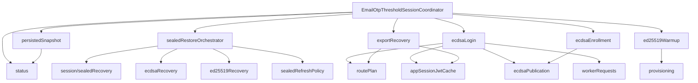

# Refactor 34: Email OTP Threshold Session Coordinator

Date created: 2026-05-07
Last refreshed: 2026-05-12
Status: implementation complete; closure cleanup landed; focused validation passed; full-suite blockers remain

## Purpose

This refactor shrinks the Email OTP threshold-session coordinator into a
facade over narrow session/email-OTP modules. The original coordinator was
3,285 lines and mixed route planning, app-session JWT refresh, worker request
assembly, warm-session accounting, sealed refresh restore, ECDSA
login/enrollment/export, Ed25519 provisioning, registration transport, and
low-level HTTP helpers.

The live path is now:

```text
client/src/core/signingEngine/session/emailOtp/
```

The earlier standalone `sessionEmailOtp/` target is obsolete and is now a
deleted path. The old `otpSessions/` and `sessionsEmailOtp/` paths are also
deleted paths covered by refactor-33 guards.

This remains a breaking internal refactor. Update imports directly and delete
old paths as each slice moves. Avoid compatibility barrels, deprecated aliases,
and duplicate coordinator implementations.

## Current Snapshot

Current line counts:

| File | Lines | Status |
| --- | ---: | --- |
| `session/emailOtp/EmailOtpThresholdSessionCoordinator.ts` | 178 | facade |
| `session/emailOtp/provisioning.ts` | 630 | extracted, needs helper split if it grows |
| `session/emailOtp/sealedRestoreOrchestrator.ts` | 570 | extracted |
| `session/emailOtp/exportRecovery.ts` | 475 | extracted, owns challenge and export flows |
| `session/emailOtp/coordinatorRuntime.ts` | 415 | internal runtime assembly |
| `stepUpConfirmation/walletAuthModeResolver.ts` | 302 | moved wallet-auth policy resolver |
| `session/emailOtp/ecdsaRecovery.ts` | 304 | extracted method adapter and rehydration port binder |
| `session/emailOtp/ecdsaPublication.ts` | 284 | extracted publication and sealed writeback |
| `session/emailOtp/ecdsaLogin.ts` | 361 | extracted login and signing-login orchestration |
| `session/emailOtp/ed25519Warmup.ts` | 268 | extracted warmup orchestration |
| `session/emailOtp/ecdsaEnrollment.ts` | 242 | extracted enrollment worker orchestration |
| `session/emailOtp/companionSessions.ts` | 205 | extracted |
| `session/emailOtp/ecdsaBootstrapCommit.ts` | 199 | extracted commit helper |
| `session/emailOtp/workerRequests.ts` | 190 | extracted worker RPC boundary |
| `session/emailOtp/persistedSnapshot.ts` | 171 | extracted read model |
| `session/emailOtp/status.ts` | 162 | extracted worker status/claim/consume calls |
| `session/emailOtp/warmSessionRuntime.ts` | 152 | extracted warm-session runtime glue |
| `session/emailOtp/exportRecoveryRuntime.ts` | 151 | extracted challenge/export runtime glue |
| `session/emailOtp/ed25519Recovery.ts` | 125 | extracted method adapter |
| `session/emailOtp/ed25519LocalMetadata.ts` | 119 | extracted |
| `session/emailOtp/sealedRefreshPolicy.ts` | 123 | extracted |
| `session/emailOtp/routePlan.ts` | 114 | extracted |
| `session/emailOtp/ecdsaLifecycleRuntime.ts` | 108 | extracted ECDSA lifecycle runtime glue |
| `session/emailOtp/ports.ts` | 98 | extracted coordinator port contract |
| `session/emailOtp/sealedSessionRegistry.ts` | 96 | extracted sealed-session write registry |
| `session/emailOtp/appSessionJwtCache.ts` | 95 | extracted |
| `session/emailOtp/provisioning.typecheck.ts` | 59 | extracted type guard |
| `session/emailOtp/runtimeConfig.ts` | 40 | extracted runtime config helper |

Important current facts:

- `session/sealedRecovery/*` now owns generic sealed-recovery contracts,
  restore commands, recovery-record normalization, and restore attempt caches.
- `session/emailOtp/*` owns Email OTP-specific restore adapters, worker
  requests, route planning, export recovery, provisioning, and companion
  sealed-record attachment.
- `stepUpConfirmation/requireStepUpAuth.ts`,
  `stepUpConfirmation/methodSelection.ts`, and
  `stepUpConfirmation/methodRunners.ts` exist.
- `webauthnAuth/*` exists and owns low-level WebAuthn/passkey browser
  primitives.
- `walletAuth/` is deleted. Wallet-auth policy resolution now lives in
  `stepUpConfirmation/walletAuthModeResolver.ts`.

## Completed Work

- Moved the Email OTP coordinator under the session domain:
  `client/src/core/signingEngine/session/emailOtp/`.
- Deleted and guarded legacy Email OTP coordinator paths:
  `otpSessions/`, `sessionsEmailOtp/`, and `sessionEmailOtp/`.
- Extracted app-session JWT caching and refresh to `appSessionJwtCache.ts`.
- Extracted route-plan construction and bootstrap identity helpers to
  `routePlan.ts`.
- Extracted Email OTP worker RPC wrappers to `workerRequests.ts`.
- Extracted warm-session status, claim, consume, and clear worker calls to
  `status.ts`.
- Extracted Ed25519 companion session lookup and sealed-record attachment to
  `companionSessions.ts`.
- Extracted ECDSA bootstrap commit helpers to `ecdsaBootstrapCommit.ts`.
- Extracted ECDSA and Ed25519 sealed-recovery method adapters to
  `ecdsaRecovery.ts` and `ed25519Recovery.ts`.
- Extracted export challenge, export authorization, and fresh export-lane logic
  to `exportRecovery.ts`.
- Extracted Ed25519 provisioning and local metadata persistence to
  `provisioning.ts` and `ed25519LocalMetadata.ts`.
- Extracted sealed refresh policy writeback, sealed restore orchestration,
  persisted lane snapshot reading, and ECDSA publication/sealed writeback to
  `sealedRefreshPolicy.ts`, `sealedRestoreOrchestrator.ts`,
  `persistedSnapshot.ts`, and `ecdsaPublication.ts`.
- Extracted ECDSA Email OTP login and enrollment worker orchestration to
  `ecdsaLogin.ts` and `ecdsaEnrollment.ts`.
- Extracted Ed25519 pending warmup state, scheduling, provisioning facade, and
  signing warmup orchestration to `ed25519Warmup.ts`.
- Split `EmailOtpThresholdSessionCoordinatorDeps` into runtime, ECDSA,
  Ed25519 persistence, and sealed-store port groups. Production assembly now
  supplies concrete sealed-store and session-record lookup ports instead of
  relying on coordinator fallbacks.
- Deleted `walletAuth/`; moved wallet-auth policy resolution to
  `stepUpConfirmation/walletAuthModeResolver.ts` and updated production
  imports plus guards.
- Extracted Email OTP runtime config checks to `runtimeConfig.ts`.
- Narrowed Email OTP runtime config to a `getRpId()` port so the session
  domain no longer imports broad `stepUpConfirmation/*` prompt modules.
- Moved the ECDSA sealed material rehydration port binder into
  `ecdsaRecovery.ts`; the coordinator now wires the sealed restore orchestrator
  directly to the method adapter.
- Moved coordinator port contracts to `ports.ts`.
- Removed stale optional Email OTP identity fields from `SigningEngine`
  internal login/enroll APIs by reusing the strict `emailOtpPublic.ts`
  argument types.
- Removed the coordinator runtime facade callback loop; the facade now
  instantiates runtime once and runtime submodules call direct runtime methods.
- Extracted warm-session worker client glue and sealed restore/policy
  coordination to `warmSessionRuntime.ts`.
- Moved ECDSA Email OTP signing-login orchestration into `ecdsaLogin.ts`.
- Extracted challenge/export runtime glue to `exportRecoveryRuntime.ts`, ECDSA
  lifecycle runtime glue to `ecdsaLifecycleRuntime.ts`, and sealed-session
  write/attach/publication-port assembly to `sealedSessionRegistry.ts`.
- Moved runtime assembly to `coordinatorRuntime.ts`; the public coordinator is
  now a facade under the 250-line target.
- Added the Email OTP coordinator facade guard for the 250-line size target and
  direct side-effect/work-payload exclusions.
- Added step-up adaptor primitives and started the WebAuthn split:
  `requireStepUpAuth`, `methodSelection`, `methodRunners`, and `webauthnAuth`.

## Remaining Hotspots

No blocking implementation hotspots remain for this refactor. Optional future
cleanup can split large extracted modules such as `provisioning.ts` and
`exportRecovery.ts` if they grow or start mixing new ownership boundaries.
Broad full-suite validation still has cross-domain failure clusters outside the
coordinator split and should be handled as follow-up validation triage.

## Current Target Shape

Keep the session-domain layout. Do not recreate `sessionEmailOtp/`.

```text
client/src/core/signingEngine/session/emailOtp/
  README.md
  EmailOtpThresholdSessionCoordinator.ts      # target: facade only
  appSessionJwtCache.ts                       # done
  routePlan.ts                               # done
  workerRequests.ts                          # done
  status.ts                                  # done, policy write still elsewhere
  companionSessions.ts                       # done
  ecdsaBootstrapCommit.ts                    # done
  ecdsaRecovery.ts                           # done method adapter
  ed25519Recovery.ts                         # done method adapter
  exportRecovery.ts                          # done, may split challengeRequests later
  provisioning.ts                            # done, may split registration HTTP later
  ed25519LocalMetadata.ts                    # done
  provisioning.typecheck.ts                  # done

  persistedSnapshot.ts                       # done
  sealedRestoreOrchestrator.ts               # done
  sealedRefreshPolicy.ts                     # done
  ecdsaPublication.ts                        # done
  ecdsaLogin.ts                              # done
  ecdsaEnrollment.ts                         # done
  ecdsaLifecycleRuntime.ts                   # done
  ed25519Warmup.ts                           # done
  runtimeConfig.ts                           # done
  ports.ts                                   # done
  warmSessionRuntime.ts                      # done
  exportRecoveryRuntime.ts                   # done
  sealedSessionRegistry.ts                   # done
  coordinatorRuntime.ts                      # done internal runtime assembly
```

Shared sealed-recovery code belongs under `session/sealedRecovery/*`. Email
OTP-specific recovery worker/bootstrap logic belongs under `session/emailOtp/*`.

## Target Call Graph



## State-Type Direction

The remaining extractions should tighten lifecycle inputs instead of moving the
same optional-heavy argument bags into new files.

Current public coordinator args still contain optional lifecycle fields such as
`sessionKind`, `routePlan`, `ttlMs`, `remainingUses`, `runtimePolicyScope`,
`participantIds`, `authSubjectId`, and progress callbacks. Keep those at the
facade boundary, then normalize into internal states before calling core
modules.

Recommended internal variants:

```ts
export type EmailOtpAppSessionRoute = {
  kind: 'app_session';
  accountId: AccountId;
  relayUrl: string;
  jwt: string;
  sessionKind: 'jwt';
};

export type EmailOtpSigningSessionRoute =
  | {
      kind: 'signing_session';
      accountId: AccountId;
      routeAuth: AppOrThresholdSessionAuth;
      thresholdSessionId: string;
      walletSigningSessionId: string;
      curve: 'ed25519';
    }
  | {
      kind: 'signing_session';
      accountId: AccountId;
      routeAuth: AppOrThresholdSessionAuth;
      thresholdSessionId: string;
      walletSigningSessionId: string;
      curve: 'ecdsa';
      chainTarget: ThresholdEcdsaChainTarget;
    };

export type EmailOtpSessionRetention =
  | {
      kind: 'single_use';
      reason: 'sign' | 'export';
      remainingUses: 1;
    }
  | {
      kind: 'session';
      reason: 'login';
      ttlMs: number;
      remainingUses: number;
    };
```

Rules:

- Required identity, auth, restore, budget, signing, and export state must be
  required in the normalized variant that uses it.
- Optionals stay limited to config, optional UI/progress callbacks, and
  intentionally absent features.
- Raw strings, raw sealed records, and raw worker responses should be
  normalized once at the module boundary.
- Avoid converters between two internal target shapes. Delete one shape when
  overlap appears.

## Phase Status

| Phase | Status | Notes |
| --- | --- | --- |
| 1. Characterize and guard | complete | Refactor-33 guards cover live/deleted paths. `emailOtpOperationSplit.guard.unit.test.ts` now guards coordinator size and direct worker-payload/side-effect exclusions. |
| 2. Extract pure boundary helpers | complete | App JWT helper moved. Registration HTTP helpers remain private in `provisioning.ts`; split only if that module grows. |
| 3. Normalize auth route state | complete | `routePlan.ts` owns route normalization before worker payload assembly. Broad coordinator args are limited to the facade boundary. |
| 4. Split challenge issuance | complete | `exportRecovery.ts` owns transaction and export challenge functions, with runtime wiring in `exportRecoveryRuntime.ts`. |
| 5. Extract warm-session runtime accounting | complete | `status.ts` owns pure status transitions, `warmSessionRuntime.ts` owns worker glue, and `sealedRefreshPolicy.ts` owns policy writeback and cleanup. |
| 6. Extract sealed refresh restore | complete | `sealedRestoreOrchestrator.ts` owns restore command wrappers, sealed-record dispatch, leases, diagnostics, restore caches, and attempt tracking. |
| 7. Extract ECDSA lifecycle | complete | Export, commit helpers, publication target selection, sealed persistence, login, enrollment, and facade runtime wiring moved out of the public coordinator. |
| 8. Extract Ed25519 lifecycle | complete | Provisioning, local metadata, pending warmup state, scheduling, and Ed25519 signing orchestration moved. |
| 9. Path cleanup | complete | Live path is `session/emailOtp/`; legacy Email OTP coordinator folders are deleted paths. |
| 10. Shrink facade | complete | Coordinator is 178 lines, under the 250-line target. |
| 11. Split wallet auth | complete | `webauthnAuth/` owns browser primitives, `stepUpConfirmation/walletAuthModeResolver.ts` owns wallet-auth policy resolution, and `walletAuth/` is deleted. |

## Next Implementation Order

1. Extract `sealedRefreshPolicy.ts`. Completed.
   Move `cleanupSigningSession`, `recordSessionPolicyResult`,
   `recordSessionMaterialClaimed`, `recordSessionUseConsumed`, and
   `recordSessionMaterialRestored`. Give it a required sealed-store policy port
   rather than reading optional dependency fallbacks.

2. Extract `sealedRestoreOrchestrator.ts`. Completed.
   Moved account-scoped and signing-scoped restore command wrappers, sealed
   restore dispatch, lease handling, diagnostics, restore cache, and ECDSA
   restore attempt tracking. Keep generic restore command code in
   `session/sealedRecovery/*`.

3. Extract `persistedSnapshot.ts`. Completed.
   Move `configuredEcdsaSnapshotChainTargets`, `readPersistedSessionSnapshot`,
   and runtime lane collection. Keep this read-only and dependent on `status.ts`
   for runtime claims.

4. Extract `ecdsaPublication.ts`. Completed.
   Move publication target selection, bootstrap commit sequencing, and sealed
   refresh persistence for session-retained ECDSA login.

5. Extract `ecdsaLogin.ts` and `ecdsaEnrollment.ts`. Completed.
   Normalize facade args into exact internal login/enrollment commands, then
   move the direct worker payload construction out of the coordinator.

6. Extract `ed25519Warmup.ts`. Completed.
   Move pending warmup state, schedule/wait helpers, and Ed25519 signing
   orchestration around `provisionEmailOtpEd25519Capability`.

7. Narrow `EmailOtpThresholdSessionCoordinatorDeps`. Completed.
   Split the broad dependency bag into config, worker, ECDSA commit, Ed25519
   persistence, sealed store, and app-session ports. Production assembly should
   provide concrete ports once.

8. Finish `walletAuth/` deletion. Completed.
   Move remaining method-selection behavior to `stepUpConfirmation`, keep
   WebAuthn primitives in `webauthnAuth`, update public exports, and add
   deleted-path guards.

## Guardrails To Add Or Keep

- Coordinator size guard: `EmailOtpThresholdSessionCoordinator.ts` should move
  below 250 lines by the final phase.
- Coordinator direct side-effect guard: no direct `fetch`, no direct
  `requestWorkerOperation`, and no direct `sealEmailOtpWarmSessionMaterial`
  request construction in the facade.
- Path guard: `otpSessions/`, `sessionsEmailOtp/`, and `sessionEmailOtp/` stay
  deleted paths.
- Import guard: `session/emailOtp/*` may import `session/sealedRecovery/*`,
  `session/warmCapabilities/*`, `session/persistence/*`, `session/identity/*`,
  `stepUpConfirmation/otpPrompt/*`, `threshold/*`, `workerManager/*`, and
  primitive interface or chain types.
- Step-up guard: `webauthnAuth/*` stays a browser primitive layer and cannot
  import step-up orchestration, flows, or session lifecycle modules.
- Wallet-auth cleanup guard: `walletAuth/` stays a deleted path with no
  compatibility exports.

## Tests and Verification

Run focused tests after each behavior-moving slice:

```bash
pnpm -C tests exec playwright test ./unit/emailOtpThresholdSessionCoordinator.unit.test.ts --reporter=line
pnpm -C tests exec playwright test ./unit/emailOtpOperationSplit.guard.unit.test.ts --reporter=line
pnpm -C tests exec playwright test ./unit/thresholdEd25519.nearSigningQueue.guard.unit.test.ts --reporter=line
pnpm -C tests exec playwright test ./unit/sealedRecovery.methodAdapters.unit.test.ts --reporter=line
pnpm -C tests exec playwright test ./unit/stepUpAdaptor.methodSelection.unit.test.ts --reporter=line
pnpm -C tests exec playwright test ./unit/signingEngine.refactor33.guard.unit.test.ts --reporter=line
pnpm -s type-check
pnpm -s check:signing-architecture
```

Run the full unit suite before marking the refactor complete:

```bash
pnpm test:unit
```

Focused validation on 2026-05-12 passed:

```bash
pnpm -C sdk exec tsc -p tsconfig.build.json --noEmit
pnpm -C sdk build:rolldown
pnpm -C tests exec playwright test -c playwright.lite.config.ts ./unit/emailOtpThresholdSessionCoordinator.unit.test.ts --reporter=line
pnpm -C tests exec playwright test -c playwright.lite.config.ts ./unit/emailOtpOperationSplit.guard.unit.test.ts --reporter=line
pnpm -C tests exec playwright test -c playwright.lite.config.ts ./unit/thresholdEd25519.nearSigningQueue.guard.unit.test.ts --reporter=line
pnpm -C tests exec playwright test -c playwright.lite.config.ts ./unit/sealedRecovery.methodAdapters.unit.test.ts --reporter=line
pnpm -C tests exec playwright test -c playwright.lite.config.ts ./unit/stepUpAdaptor.methodSelection.unit.test.ts --reporter=line
pnpm -C tests exec playwright test -c playwright.lite.config.ts ./unit/signingEngine.refactor33.guard.unit.test.ts:844 ./unit/signingEngine.refactor33.guard.unit.test.ts:943 ./unit/signingEngine.refactor33.guard.unit.test.ts:970 ./unit/signingEngine.refactor33.guard.unit.test.ts:1289 --reporter=line
pnpm -C tests exec playwright test -c playwright.lite.config.ts ./unit/signingEngine.refactor36.guard.unit.test.ts --reporter=line
pnpm -s check:signing-architecture
git diff --check
```

Current broad-suite status:

```text
The broad lite suite still has cross-domain failure clusters outside this
coordinator split. The latest triage run stopped after surfacing unrelated
dashboard failures, stale ECDSA Tempo bootstrap helper failures, and an
Ed25519 batch-signing stale runtime-policy-scope e2e failure. Keep those as
validation follow-up work rather than refactor-34 implementation blockers.
```

## Regression Checklist

- Transaction signing challenges never request export authorization.
- Export challenges never consume transaction signing budget.
- Per-operation ECDSA Email OTP login writes no sealed refresh record.
- Session-retained ECDSA Email OTP login writes a durably readable exact seal.
- EVM-family signing restores durable sealed ECDSA sessions before lane
  selection.
- Ed25519 status reads do not trigger ECDSA sealed restore.
- Account-scoped sealed restore deduplicates in-flight work and records
  completed restore keys.
- ECDSA restore rejects signing-root, wallet signing-session, threshold-session,
  and chain-target mismatches before worker rehydration.
- Ed25519 companion restore happens only when wallet signing-session identity
  matches the ECDSA seal.
- Fresh Ed25519 signing waits for pending warmup and provisions from an exact
  concrete Email OTP ECDSA lane.
- `session/emailOtp/*` follows the refactor-33 import direction contract.
- `otpSessions/`, `sessionsEmailOtp/`, and `sessionEmailOtp/` remain deleted
  paths.
- Step-up method selection owns generic auth-method routing.
- `webauthnAuth/*` contains WebAuthn/passkey browser primitives only.
- `walletAuth/*` has no compatibility path after Phase 11 finishes.

## Exit Criteria

- `EmailOtpThresholdSessionCoordinator.ts` is a thin facade under
  `client/src/core/signingEngine/session/emailOtp/`.
- The coordinator facade is under 250 lines.
- Each lifecycle module owns one boundary or operation cluster.
- Canonical Email OTP state uses discriminated unions for route, retention,
  ECDSA operation, and sealed restore state.
- Core modules receive normalized inputs instead of raw strings, partial
  records, optional lifecycle fields, or fallback dependency functions.
- Generic sealed recovery stays in `session/sealedRecovery/*`; Email
  OTP-specific worker/bootstrap behavior stays in `session/emailOtp/*`.
- Step-up method selection is separated from WebAuthn/passkey browser
  primitives, and `walletAuth/` is deleted.
- Focused Email OTP, sealed recovery, NEAR Ed25519, step-up adaptor,
  refactor-33, type-check, and signing architecture checks pass.
