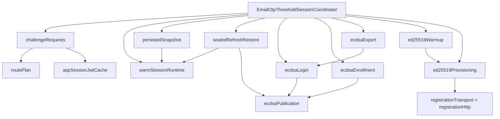
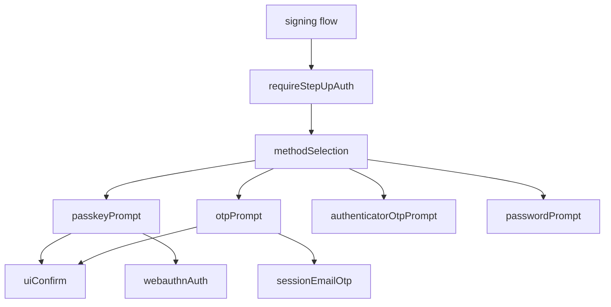

# Refactor 34: Email OTP Threshold Session Coordinator

Date created: 2026-05-07
Status: planned

## Purpose

`client/src/core/signingEngine/sessionEmailOtp/EmailOtpThresholdSessionCoordinator.ts`
is currently a 3,285-line coordinator. It owns route planning, app-session JWT
refresh, worker request assembly, warm-session policy accounting, sealed refresh
restore, ECDSA login/enrollment/export, Ed25519 provisioning, registration
transport, and low-level HTTP helpers.

That makes correctness depend on local ordering inside one large file. The
highest-risk paths are the ones that combine optional lifecycle fields with
worker side effects: sealed ECDSA restore, Ed25519 companion restore,
transaction versus export challenge routing, and session budget accounting.

This is a breaking internal refactor. Update imports directly and delete old
paths as each slice moves. Do not add compatibility barrels, deprecated aliases,
or duplicate coordinator implementations.

The user-facing path `client/src/core/signingEngine/otpSessions/...` is already
covered as a deleted path by refactor-33 guards. The old intermediate
`sessionsEmailOtp/` folder is also a deleted path. The live file is under
`sessionEmailOtp/`.

## Current Responsibility Map

| Current area | Approximate lines | Responsibility | Target owner |
| --- | ---: | --- | --- |
| Dependency bag and class state | 252-332 | Broad runtime ports, app JWT cache, warmup map, restore caches | Thin facade plus small required ports |
| Sealed refresh status and restore | 383-803, 903-1239, 2250-2747 | Exact sealed-session read/write, restore leases, policy updates, ECDSA/Ed25519 companion restore | `sessionEmailOtp/sealedRefresh*.ts` |
| Persisted lane snapshot | 803-1131 | ECDSA chain-target snapshot and available lane read model | `sessionEmailOtp/persistedSnapshot.ts` |
| Warm-session worker bridge | 1241-1403 | Status, claim, consume, clear, budget policy update | `sessionEmailOtp/warmSessionRuntime.ts` |
| App-session JWT and route planning | 1405-1681 | JWT cache/refresh, route auth, challenge worker request | `sessionEmailOtp/appSessionJwtCache.ts`, `routePlan.ts`, `challengeRequests.ts` |
| ECDSA reauth, export, login, enrollment | 1682-2747 | Transaction challenge, export challenge, fresh lane login, session login, enrollment, sealed persistence | `sessionEmailOtp/ecdsa*.ts` |
| Ed25519 provisioning and warmup | 1605-1681, 2749-3130 | Background warmup map, HSS registration, session mint, hydrate PRF cache | `sessionEmailOtp/ed25519*.ts` |
| Config and HTTP helpers | 3130-3285 | Relay/RP ID lookup, URL joining, JSON POST, managed registration grant | `runtimeConfig.ts`, `registrationTransport.ts`, `registrationHttp.ts` |

## Target Shape

```text
client/src/core/signingEngine/sessionEmailOtp/
  README.md
  EmailOtpThresholdSessionCoordinator.ts
  types.ts
  runtimeConfig.ts
  appSessionJwtCache.ts
  routePlan.ts
  challengeRequests.ts
  warmSessionRuntime.ts
  persistedSnapshot.ts
  sealedRefreshPolicy.ts
  sealedRefreshRestore.ts
  ecdsaPublication.ts
  ecdsaLogin.ts
  ecdsaEnrollment.ts
  ecdsaExport.ts
  ed25519Warmup.ts
  ed25519Provisioning.ts
  registrationTransport.ts
  registrationHttp.ts
```

`EmailOtpThresholdSessionCoordinator.ts` should become a facade that owns
construction and public method delegation only. It should contain no direct
`fetch`, no raw worker payload construction, no sealed-record metadata checks,
and no lifecycle option normalization.

`types.ts` is allowed only for canonical Email OTP lifecycle state shared by
sibling modules. It must not become a broad barrel. Import concrete modules
directly.

## Target Call Graph



## Step-Up Auth Primitive Ownership

The step-up adaptor in `docs/stepup-adaptor.md` changes the operation-facing
shape: signing flows call `requireStepUpAuth`, then method selection routes to
`passkeyPrompt`, `otpPrompt`, authenticator OTP, password, or future methods.

That call graph makes the current `walletAuth/` name too broad after its policy
and routing responsibilities move. Today it owns two separate concerns:

1. Wallet/account auth policy and method routing:
   `walletAuthModeResolver.ts`, EVM-family account-auth selection in
   `flows/signEvmFamily/accountAuth.ts`, Email OTP/passkey auth-plan types, and
   warm-session/passkey/Email OTP selection.
2. WebAuthn/passkey browser primitives:
   credential collection, credential normalization, Safari fallback behavior,
   signer-slot helpers, and COSE/P-256 decoding until the Rust/WASM move lands.

Target ownership:

```text
client/src/core/signingEngine/
  stepUpConfirmation/
    requireStepUpAuth.ts
    methodSelection.ts
    methodRunners.ts
    passkeyPrompt/
    otpPrompt/

  webauthnAuth/
    README.md
    credentials/
    device/
    fallbacks/
    cose/        # deleted after COSE moves to Rust/WASM

  sessionEmailOtp/
    ...
```

`stepUpConfirmation/methodSelection.ts` should absorb the generic auth-method
routing and policy currently represented by `walletAuthModeResolver.ts` and the
remaining account-auth helpers. `webauthnAuth/` should contain only reusable
WebAuthn/passkey browser primitives. After that split, `walletAuth/` should be
deleted.

Target step-up graph:



Naming rule:

- Use `webauthnAuth/` for low-level WebAuthn browser primitives.
- Keep passkey prompt and product/auth-method planning under
  `stepUpConfirmation/passkeyPrompt`.
- Keep generic method routing under `stepUpConfirmation/methodSelection.ts`.
- Delete `walletAuth/` once no mixed wallet-policy/WebAuthn ownership remains.
- If wallet/account policy grows beyond method selection, introduce a neutral
  policy module under `stepUpConfirmation/` or `session/`; do not keep a broad
  `walletAuth/` folder as a catch-all.

## Explicit State Types

Add precise internal types before moving behavior. Normalize raw SDK inputs,
config values, records, and worker responses at module boundaries.

Recommended canonical shapes:

```ts
export type EmailOtpAppSessionRoute = {
  kind: 'app_session';
  accountId: AccountId;
  relayUrl: string;
  jwt: string;
  sessionKind: 'jwt';
};

export type EmailOtpSigningSessionRoute =
  | {
      kind: 'signing_session';
      accountId: AccountId;
      routeAuth: AppOrThresholdSessionAuth;
      thresholdSessionId: string;
      walletSigningSessionId: string;
      curve: 'ed25519';
    }
  | {
      kind: 'signing_session';
      accountId: AccountId;
      routeAuth: AppOrThresholdSessionAuth;
      thresholdSessionId: string;
      walletSigningSessionId: string;
      curve: 'ecdsa';
      chainTarget: ThresholdEcdsaChainTarget;
    };

export type EmailOtpRouteContext =
  | EmailOtpAppSessionRoute
  | EmailOtpSigningSessionRoute;

export type EmailOtpSessionRetention =
  | {
      kind: 'single_use';
      reason: 'sign' | 'export';
      remainingUses: 1;
    }
  | {
      kind: 'session';
      reason: 'login';
      ttlMs: number;
      remainingUses: number;
    };

export type EmailOtpEcdsaOperation =
  | {
      kind: 'fresh_login';
      accountId: AccountId;
      subjectId: WalletSubjectId;
      chainTarget: ThresholdEcdsaChainTarget;
      route: EmailOtpAppSessionRoute;
      retention: EmailOtpSessionRetention;
    }
  | {
      kind: 'session_reauth';
      accountId: AccountId;
      record: ThresholdEcdsaSessionRecord;
      route: Extract<EmailOtpSigningSessionRoute, { curve: 'ecdsa' }>;
      retention: Extract<EmailOtpSessionRetention, { kind: 'single_use' }>;
    };
```

The exact type names can change during implementation. The important rule is
that signing identity, auth, restore metadata, budget, and export state must be
required in the state variant that needs them. Optional fields stay limited to
configuration and optional UI/progress callbacks.

## Dependency Ports

Replace the current broad `EmailOtpThresholdSessionCoordinatorDeps` bag with
smaller required ports passed to the modules that use them:

1. `EmailOtpConfigPort`: `configs`, relay URL, RP ID, session-seal config.
2. `EmailOtpWorkerPort`: typed email OTP worker request helpers.
3. `EmailOtpEcdsaCommitPort`: commits ECDSA bootstraps and reads ECDSA records.
4. `EmailOtpEd25519PersistencePort`: local metadata persistence, warm-session
   persistence, and PRF cache hydration.
5. `EmailOtpSealedStorePort`: read, write, list, delete, update policy, acquire
   restore lease, release restore lease.
6. `EmailOtpAppSessionPort`: refresh app-session JWT.

Production adapters should supply defaults once at construction. Tests can pass
explicit fake ports. The core modules should receive required functions, so
restore and auth paths never branch on missing dependency functions.

## Refactor Phases

### Phase 1: Characterize and Guard

Keep behavior fixed while adding guardrails that describe the split.

- Add a `tests/unit/emailOtpCoordinatorRefactor.guard.unit.test.ts` guard that
  checks the target folder name, blocks `otpSessions/` and `sessionsEmailOtp/`,
  and blocks broad `index.ts` barrels.
- Extend `tests/unit/emailOtpOperationSplit.guard.unit.test.ts` so transaction
  challenge issuance and export challenge issuance remain separate after the
  code moves.
- Keep `tests/unit/emailOtpThresholdSessionCoordinator.unit.test.ts` as the
  facade behavior suite until module-level tests replace individual clusters.
- Add source-shape assertions only for architectural boundaries, such as no
  direct `fetch` in the coordinator facade and no `sealEmailOtpWarmSessionMaterial`
  calls outside the sealed-refresh module.

### Phase 2: Extract Pure Boundary Helpers

Move the bottom helper functions first because they have small dependency
surfaces.

- `joinUrlPath`, `replaceUrlPathSuffix`, `postJsonExpectOk`, and
  `readJsonObjectResponse` move to `registrationHttp.ts`.
- `resolveRegistrationTransportFromConfig` and
  `requestManagedRegistrationBootstrapGrant` move to `registrationTransport.ts`.
- `requireRelayUrl`, `requireShamirPrimeB64u`, and `requireRpId` move to
  `runtimeConfig.ts`.

After this phase, the coordinator should import helpers from the new modules
and the old helper definitions should be deleted from the coordinator file.

### Phase 3: Normalize Auth Route State

Extract app-session and route planning with narrow inputs.

- Move `rememberAppSessionJwt`, `resolveAppSessionJwt`, and
  `refreshAppSessionJwt` to `appSessionJwtCache.ts`.
- Move `buildRoutePlan`, `buildSigningSessionRoutePlan`,
  `routeAuthFromPlan`, `appSessionJwtFromLane`,
  `appSessionSubjectFromLane`, and bootstrap session helpers to `routePlan.ts`.
- Make route construction consume `EmailOtpRouteContext` variants instead of
  partially filled objects.
- Preserve the existing failure behavior:
  transaction challenges with explicit app-session auth reject with
  `EMAIL_OTP_SIGNING_SESSION_AUTH_UNAVAILABLE`; fresh transaction challenge
  fallback can resolve an app-session JWT.

### Phase 4: Split Challenge Issuance

Move challenge worker calls into `challengeRequests.ts`.

- Keep `requestTransactionSigningChallenge` and `requestExportChallenge` as
  distinct exported functions.
- Keep operation constants fixed:
  `WALLET_EMAIL_OTP_TRANSACTION_SIGN_OPERATION` for transaction signing and
  `WALLET_EMAIL_OTP_EXPORT_OPERATION` for export.
- The module should accept normalized route context and return an
  `EmailOtpChallengeResult` variant. App-session JWT presence should be
  explicit in the variant instead of represented as an optional auth field.

### Phase 5: Extract Warm-Session Runtime Accounting

Move status, claim, consume, clear, and policy recording into
`warmSessionRuntime.ts` and `sealedRefreshPolicy.ts`.

- `readWarmSessionStatusOnly`, `claimWarmSessionMaterial`,
  `consumeWarmSessionUses`, and `clearWarmSessionMaterial` stay available
  through the coordinator facade.
- Policy updates for expiry, exhaustion, and remaining-use changes should live
  beside the sealed-refresh policy writer.
- Preserve the invariant from
  `tests/unit/thresholdEd25519.nearSigningQueue.guard.unit.test.ts`: Ed25519
  status reads must not probe the ECDSA sealed store.

### Phase 6: Extract Sealed Refresh Restore

Move sealed refresh code into `sealedRefreshRestore.ts`.

- Use one normalized `RestorableEmailOtpEcdsaSeal` type after reading and
  validating raw `SigningSessionSealedStoreRecord`.
- Separate three operations:
  `restorePersistedSessionsForAccount`, `restorePersistedSessionForSigning`,
  and `restoreEcdsaWarmSessionStatusFromSeal`.
- Keep restore lease acquisition inside the restore module.
- Keep completed/in-flight restore caches inside the restore module.
- Keep diagnostics throttling local to sealed restore.
- Make the Ed25519 companion state explicit:
  `absent`, `presentAndRestorable`, or `presentButInvalid`. The restore worker
  call should receive an Ed25519 companion only from the `presentAndRestorable`
  branch.

### Phase 7: Extract ECDSA Lifecycle

Split ECDSA behavior by operation.

- `ecdsaPublication.ts`: `configuredEcdsaSnapshotChainTargets`,
  `emailOtpEcdsaPublicationChainTargets`,
  `commitEmailOtpEcdsaPublicationBootstraps`, and
  `persistEmailOtpEcdsaSigningSessionSealForUnlock`.
- `ecdsaLogin.ts`: fresh login and session reauth for signing.
- `ecdsaEnrollment.ts`: email OTP enrollment plus initial login.
- `ecdsaExport.ts`: export with existing signing-session authorization and
  fresh one-use Email OTP lane export.

The ECDSA modules should construct worker payloads from normalized operation
types. They should not accept raw partial args with optional identity fields.

### Phase 8: Extract Ed25519 Lifecycle

Move warmup and provisioning into separate modules.

- `ed25519Warmup.ts`: pending warmup map, schedule/wait helpers, account-key
  normalization.
- `ed25519Provisioning.ts`: HSS registration, session mint, PRF cache hydrate,
  client-base reconstruction, and sealed ECDSA record attachment.
- `loginWithEd25519CapabilityForSigning` should become a small orchestration
  function that selects an exact Email OTP ECDSA lane and awaits Ed25519
  provisioning.

Keep secret-bearing data scoped tightly. `clientSecret32` and PRF material
should be copied only where needed and zeroized after worker/enrollment use.

### Phase 9: Rename Folder and Delete Legacy Paths

Finish the refactor-33 folder cleanup in the same change set that updates
imports.

- Keep `sessionEmailOtp/` as the live folder.
- Keep `client/src/core/signingEngine/SigningEngine.ts`, the signing-engine
  README, folder README, guard tests, and all unit tests on the live path.
- Keep deleted-path guards for `client/src/core/signingEngine/sessionsEmailOtp/`.
- Keep existing deleted-path guards for `otpSessions/`.
- Do not create re-export files from old folders.

### Phase 10: Shrink the Facade

After all slices move, the coordinator class should be small enough to audit.

Target responsibilities:

1. Construct module instances from required ports.
2. Preserve the public method names currently called by `SigningEngine`.
3. Delegate to operation modules.
4. Own no raw worker payloads, no raw sealed-record validation, no direct HTTP
   calls, and no cross-operation caches except module instances.

Target size: under 250 lines for the facade, with each extracted module under
500 lines. If a module grows beyond that during the split, split it by operation
or boundary before landing the phase.

### Phase 11: Split Wallet Auth Into Method Selection And WebAuthn Primitives

Coordinate this phase with `docs/stepup-adaptor.md`. The goal is to make the
step-up graph read as:
`flow -> requireStepUpAuth -> methodSelection -> method prompt -> method owner`.

- Move generic auth-method selection from `walletAuth/walletAuthModeResolver.ts`
  to `stepUpConfirmation/methodSelection.ts`.
- Move EVM-family account-auth resolution from `flows/signEvmFamily/accountAuth.ts` to
  the step-up adaptor layer or an operation-local helper if it remains
  EVM-family specific.
- Move runner interfaces for passkey and Email OTP to
  `stepUpConfirmation/methodRunners.ts`.
- Move reusable WebAuthn/passkey browser primitives from
  `walletAuth/webauthn/*` to `webauthnAuth/*`:
  credential collection, credential helpers, signer-slot helpers, and Safari
  fallback handling.
- Keep `walletAuth/webauthn/cose/*` only until the Rust/WASM COSE phase lands,
  then delete the TypeScript COSE parser instead of moving it again.
- Update `stepUpConfirmation/passkeyPrompt/*` imports to use `webauthnAuth/*`.
- Delete `walletAuth/` after both generic method-selection code and WebAuthn
  primitives have moved.
- Update ownership READMEs, the signing-engine README, and refactor guard tests.
- Add deleted-path guards for `walletAuth/` and blocked import guards for
  `stepUpConfirmation/* -> walletAuth/*`.

Exit criteria:

- `stepUpConfirmation/methodSelection.ts` owns auth-method routing and policy.
- `webauthnAuth/` owns only WebAuthn/passkey browser primitives.
- `passkeyPrompt/*` imports `webauthnAuth/*` for browser credential primitives.
- `otpPrompt/*` and `sessionEmailOtp/*` have no dependency on WebAuthn/passkey
  primitives.
- `walletAuth/` is deleted with no compatibility exports.
- Refactor 33, Refactor 34, step-up adaptor guard tests, type-check, and
  signing architecture checks pass.

## Tests and Verification

Run focused tests after each phase that moves behavior:

```bash
pnpm -C tests exec playwright test ./unit/emailOtpThresholdSessionCoordinator.unit.test.ts --reporter=line
pnpm -C tests exec playwright test ./unit/emailOtpOperationSplit.guard.unit.test.ts --reporter=line
pnpm -C tests exec playwright test ./unit/thresholdEd25519.nearSigningQueue.guard.unit.test.ts --reporter=line
pnpm -C tests exec playwright test ./unit/signingEngine.refactor33.guard.unit.test.ts --reporter=line
pnpm -s type-check
pnpm -s check:signing-architecture
```

Before the final phase, run the full unit suite:

```bash
pnpm test:unit
```

## Regression Checklist

- Transaction signing challenges never request export authorization.
- Export challenges never consume transaction signing budget.
- Per-operation ECDSA Email OTP login writes no sealed refresh record.
- Session-retained ECDSA Email OTP login writes a durably readable exact seal.
- EVM-family signing restores durable sealed ECDSA sessions before lane
  selection.
- Ed25519 status reads do not trigger ECDSA sealed restore.
- Account-scoped sealed restore deduplicates in-flight work and records
  completed restore keys.
- ECDSA restore rejects signing-root, wallet signing-session, threshold-session,
  and chain-target mismatches before worker rehydration.
- Ed25519 companion restore happens only when wallet signing-session identity
  matches the ECDSA seal.
- Fresh Ed25519 signing waits for pending warmup and provisions from an exact
  concrete Email OTP ECDSA lane.
- `sessionEmailOtp/*` follows the refactor-33 import direction contract.
- No `sessionsEmailOtp/*` or `otpSessions/*` compatibility path remains.
- `stepUpConfirmation/methodSelection.ts` owns generic step-up method routing.
- `webauthnAuth/*` contains WebAuthn/passkey browser primitives.
- No `walletAuth/*` compatibility path remains after Phase 11.

## Exit Criteria

- `EmailOtpThresholdSessionCoordinator.ts` is a thin facade under
  `client/src/core/signingEngine/sessionEmailOtp/`.
- The old `sessionsEmailOtp/` folder is deleted and guarded as a deleted path.
- Each lifecycle module owns one boundary or operation cluster.
- Canonical Email OTP state uses discriminated unions for route, retention,
  ECDSA operation, and sealed restore state.
- Core modules do not accept raw strings, partial records, optional lifecycle
  fields, or fallback dependency functions after their boundary normalization.
- Step-up method selection is separated from WebAuthn/passkey browser
  primitives, and the broad `walletAuth/` folder is deleted.
- Focused Email OTP, NEAR Ed25519, refactor-33, type-check, and signing
  architecture checks pass.
