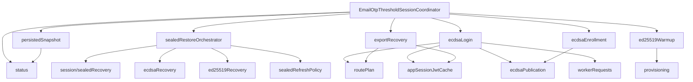

# Refactor 34: Email OTP Threshold Session Coordinator

Date created: 2026-05-07
Last refreshed: 2026-05-12
Status: in progress

## Purpose

This refactor shrinks the Email OTP threshold-session coordinator into a
facade over narrow session/email-OTP modules. The original coordinator was
3,285 lines and mixed route planning, app-session JWT refresh, worker request
assembly, warm-session accounting, sealed refresh restore, ECDSA
login/enrollment/export, Ed25519 provisioning, registration transport, and
low-level HTTP helpers.

The live path is now:

```text
client/src/core/signingEngine/session/emailOtp/
```

The earlier standalone `sessionEmailOtp/` target is obsolete and is now a
deleted path. The old `otpSessions/` and `sessionsEmailOtp/` paths are also
deleted paths covered by refactor-33 guards.

This remains a breaking internal refactor. Update imports directly and delete
old paths as each slice moves. Avoid compatibility barrels, deprecated aliases,
and duplicate coordinator implementations.

## Current Snapshot

Current line counts:

| File | Lines | Status |
| --- | ---: | --- |
| `session/emailOtp/EmailOtpThresholdSessionCoordinator.ts` | 2,105 | still too large |
| `session/emailOtp/provisioning.ts` | 630 | extracted, needs helper split if it grows |
| `session/emailOtp/exportRecovery.ts` | 475 | extracted, owns challenge and export flows |
| `session/emailOtp/ecdsaRecovery.ts` | 287 | extracted method adapter |
| `session/emailOtp/companionSessions.ts` | 205 | extracted |
| `session/emailOtp/ecdsaBootstrapCommit.ts` | 199 | extracted commit helper |
| `session/emailOtp/workerRequests.ts` | 190 | extracted worker RPC boundary |
| `session/emailOtp/status.ts` | 162 | extracted worker status/claim/consume calls |
| `session/emailOtp/ed25519Recovery.ts` | 125 | extracted method adapter |
| `session/emailOtp/ed25519LocalMetadata.ts` | 119 | extracted |
| `session/emailOtp/routePlan.ts` | 114 | extracted |
| `session/emailOtp/appSessionJwtCache.ts` | 95 | extracted |
| `session/emailOtp/provisioning.typecheck.ts` | 59 | extracted type guard |

Important current facts:

- `session/sealedRecovery/*` now owns generic sealed-recovery contracts,
  restore commands, recovery-record normalization, and restore attempt caches.
- `session/emailOtp/*` owns Email OTP-specific restore adapters, worker
  requests, route planning, export recovery, provisioning, and companion
  sealed-record attachment.
- `stepUpConfirmation/requireStepUpAuth.ts`,
  `stepUpConfirmation/methodSelection.ts`, and
  `stepUpConfirmation/methodRunners.ts` exist.
- `webauthnAuth/*` exists and owns low-level WebAuthn/passkey browser
  primitives.
- `walletAuth/` still exists with `index.ts`, `README.md`, and
  `walletAuthModeResolver.ts`.

## Completed Work

- Moved the Email OTP coordinator under the session domain:
  `client/src/core/signingEngine/session/emailOtp/`.
- Deleted and guarded legacy Email OTP coordinator paths:
  `otpSessions/`, `sessionsEmailOtp/`, and `sessionEmailOtp/`.
- Extracted app-session JWT caching and refresh to `appSessionJwtCache.ts`.
- Extracted route-plan construction and bootstrap identity helpers to
  `routePlan.ts`.
- Extracted Email OTP worker RPC wrappers to `workerRequests.ts`.
- Extracted warm-session status, claim, consume, and clear worker calls to
  `status.ts`.
- Extracted Ed25519 companion session lookup and sealed-record attachment to
  `companionSessions.ts`.
- Extracted ECDSA bootstrap commit helpers to `ecdsaBootstrapCommit.ts`.
- Extracted ECDSA and Ed25519 sealed-recovery method adapters to
  `ecdsaRecovery.ts` and `ed25519Recovery.ts`.
- Extracted export challenge, export authorization, and fresh export-lane logic
  to `exportRecovery.ts`.
- Extracted Ed25519 provisioning and local metadata persistence to
  `provisioning.ts` and `ed25519LocalMetadata.ts`.
- Added step-up adaptor primitives and started the WebAuthn split:
  `requireStepUpAuth`, `methodSelection`, `methodRunners`, and `webauthnAuth`.

## Remaining Hotspots

The coordinator still owns too much behavior. The highest-value remaining
slices are:

1. Sealed refresh orchestration.
   `tryRestoreEcdsaWarmSessionStatusFromSealedRecord`,
   `restorePersistedSessionsForAccount`, `restorePersistedSessionForSigning`,
   restore lease acquisition, diagnostics throttling, policy cleanup, and
   restore attempt cache wiring still live in the coordinator.

2. Persisted lane snapshot.
   `readPersistedSessionSnapshot`, configured ECDSA snapshot targets, runtime
   lane collection, and sealed-record listing logic still live in the
   coordinator.

3. ECDSA publication and sealed persistence.
   `emailOtpEcdsaPublicationChainTargets`,
   `commitEmailOtpEcdsaPublicationBootstraps`, and
   `persistEmailOtpEcdsaSigningSessionSealForUnlock` still live in the
   coordinator.

4. ECDSA login and enrollment.
   `loginWithEcdsaCapabilityInternal` and
   `enrollAndLoginWithEcdsaCapabilityInternal` still assemble direct worker
   payloads for `loginWithEmailOtpAndBootstrapEcdsaSession` and
   `enrollEmailOtpWalletAndBootstrapEcdsaSession`.

5. Ed25519 warmup orchestration.
   The pending warmup map, scheduling, `loginWithEd25519CapabilityForSigning`,
   and the coordinator wrapper around `provisionEmailOtpEd25519Capability`
   remain in the coordinator.

6. Runtime config helpers.
   `requireRelayUrl`, `requireShamirPrimeB64u`, and `requireRpId` remain
   private coordinator helpers and are passed down as callback ports.

7. Dependency shape.
   `EmailOtpThresholdSessionCoordinatorDeps` remains broad and still has
   fallback dependency functions for sealed-store operations.

8. Wallet auth cleanup.
   `walletAuth/` remains. The WebAuthn primitive split is partially complete,
   and `walletAuthModeResolver.ts` still needs removal or absorption into
   step-up method selection.

## Current Target Shape

Keep the session-domain layout. Do not recreate `sessionEmailOtp/`.

```text
client/src/core/signingEngine/session/emailOtp/
  README.md
  EmailOtpThresholdSessionCoordinator.ts      # target: facade only
  appSessionJwtCache.ts                       # done
  routePlan.ts                               # done
  workerRequests.ts                          # done
  status.ts                                  # done, policy write still elsewhere
  companionSessions.ts                       # done
  ecdsaBootstrapCommit.ts                    # done
  ecdsaRecovery.ts                           # done method adapter
  ed25519Recovery.ts                         # done method adapter
  exportRecovery.ts                          # done, may split challengeRequests later
  provisioning.ts                            # done, may split registration HTTP later
  ed25519LocalMetadata.ts                    # done
  provisioning.typecheck.ts                  # done

  persistedSnapshot.ts                       # remaining
  sealedRestoreOrchestrator.ts               # remaining
  sealedRefreshPolicy.ts                     # remaining
  ecdsaPublication.ts                        # remaining
  ecdsaLogin.ts                              # remaining
  ecdsaEnrollment.ts                         # remaining
  ed25519Warmup.ts                           # remaining
  runtimeConfig.ts                           # optional, if config helpers stay shared
```

Shared sealed-recovery code belongs under `session/sealedRecovery/*`. Email
OTP-specific recovery worker/bootstrap logic belongs under `session/emailOtp/*`.

## Target Call Graph



## State-Type Direction

The remaining extractions should tighten lifecycle inputs instead of moving the
same optional-heavy argument bags into new files.

Current public coordinator args still contain optional lifecycle fields such as
`sessionKind`, `routePlan`, `ttlMs`, `remainingUses`, `runtimePolicyScope`,
`participantIds`, `authSubjectId`, and progress callbacks. Keep those at the
facade boundary, then normalize into internal states before calling core
modules.

Recommended internal variants:

```ts
export type EmailOtpAppSessionRoute = {
  kind: 'app_session';
  accountId: AccountId;
  relayUrl: string;
  jwt: string;
  sessionKind: 'jwt';
};

export type EmailOtpSigningSessionRoute =
  | {
      kind: 'signing_session';
      accountId: AccountId;
      routeAuth: AppOrThresholdSessionAuth;
      thresholdSessionId: string;
      walletSigningSessionId: string;
      curve: 'ed25519';
    }
  | {
      kind: 'signing_session';
      accountId: AccountId;
      routeAuth: AppOrThresholdSessionAuth;
      thresholdSessionId: string;
      walletSigningSessionId: string;
      curve: 'ecdsa';
      chainTarget: ThresholdEcdsaChainTarget;
    };

export type EmailOtpSessionRetention =
  | {
      kind: 'single_use';
      reason: 'sign' | 'export';
      remainingUses: 1;
    }
  | {
      kind: 'session';
      reason: 'login';
      ttlMs: number;
      remainingUses: number;
    };
```

Rules:

- Required identity, auth, restore, budget, signing, and export state must be
  required in the normalized variant that uses it.
- Optionals stay limited to config, optional UI/progress callbacks, and
  intentionally absent features.
- Raw strings, raw sealed records, and raw worker responses should be
  normalized once at the module boundary.
- Avoid converters between two internal target shapes. Delete one shape when
  overlap appears.

## Phase Status

| Phase | Status | Notes |
| --- | --- | --- |
| 1. Characterize and guard | partial | Refactor-33 guards cover live/deleted paths. Dedicated refactor-34 guard is still useful for coordinator size and direct worker-payload checks. |
| 2. Extract pure boundary helpers | partial | App JWT helper moved. Registration HTTP helpers remain private in `provisioning.ts`; acceptable for now, split if provisioning grows. |
| 3. Normalize auth route state | partial | `routePlan.ts` exists. ECDSA login/enrollment still accept broad optional args before normalization. |
| 4. Split challenge issuance | mostly done | `exportRecovery.ts` owns transaction and export challenge functions. A separate `challengeRequests.ts` is optional if `exportRecovery.ts` grows. |
| 5. Extract warm-session runtime accounting | partial | `status.ts` owns worker calls. Policy writeback and cleanup remain in the coordinator. |
| 6. Extract sealed refresh restore | partial | Method adapters and shared sealed-recovery primitives exist. Orchestration, leases, diagnostics, and cache wiring remain in the coordinator. |
| 7. Extract ECDSA lifecycle | partial | Export and commit helpers moved. Login, enrollment, publication target selection, and sealed persistence remain in the coordinator. |
| 8. Extract Ed25519 lifecycle | partial | Provisioning moved. Warmup map, scheduling, and Ed25519 signing orchestration remain in the coordinator. |
| 9. Path cleanup | complete | Live path is `session/emailOtp/`; legacy Email OTP coordinator folders are deleted paths. |
| 10. Shrink facade | open | Coordinator is 2,105 lines. Target remains under 250 lines. |
| 11. Split wallet auth | partial | `webauthnAuth/` and step-up method modules exist. `walletAuth/` remains. |

## Next Implementation Order

1. Extract `sealedRefreshPolicy.ts`.
   Move `cleanupSigningSession`, `recordSessionPolicyResult`,
   `recordSessionMaterialClaimed`, `recordSessionUseConsumed`, and
   `recordSessionMaterialRestored`. Give it a required sealed-store policy port
   rather than reading optional dependency fallbacks.

2. Extract `sealedRestoreOrchestrator.ts`.
   Move `tryRestoreEcdsaWarmSessionStatusFromSealedRecord`,
   `restorePersistedSessionsForAccount`, `restorePersistedSessionForSigning`,
   `restoreEmailOtpSealedRecordForAccount`, and ECDSA restore attempt cache
   usage. Keep generic restore command code in `session/sealedRecovery/*`.

3. Extract `persistedSnapshot.ts`.
   Move `configuredEcdsaSnapshotChainTargets`, `readPersistedSessionSnapshot`,
   and runtime lane collection. Keep this read-only and dependent on `status.ts`
   for runtime claims.

4. Extract `ecdsaPublication.ts`.
   Move publication target selection, bootstrap commit sequencing, and sealed
   refresh persistence for session-retained ECDSA login.

5. Extract `ecdsaLogin.ts` and `ecdsaEnrollment.ts`.
   Normalize facade args into exact internal login/enrollment commands, then
   move the direct worker payload construction out of the coordinator.

6. Extract `ed25519Warmup.ts`.
   Move pending warmup state, schedule/wait helpers, and Ed25519 signing
   orchestration around `provisionEmailOtpEd25519Capability`.

7. Narrow `EmailOtpThresholdSessionCoordinatorDeps`.
   Split the broad dependency bag into config, worker, ECDSA commit, Ed25519
   persistence, sealed store, and app-session ports. Production assembly should
   provide concrete ports once.

8. Finish `walletAuth/` deletion.
   Move remaining method-selection behavior to `stepUpConfirmation`, keep
   WebAuthn primitives in `webauthnAuth`, update public exports, and add
   deleted-path guards.

## Guardrails To Add Or Keep

- Coordinator size guard: `EmailOtpThresholdSessionCoordinator.ts` should move
  below 250 lines by the final phase.
- Coordinator direct side-effect guard: no direct `fetch`, no direct
  `requestWorkerOperation`, and no direct `sealEmailOtpWarmSessionMaterial`
  request construction in the facade.
- Path guard: `otpSessions/`, `sessionsEmailOtp/`, and `sessionEmailOtp/` stay
  deleted paths.
- Import guard: `session/emailOtp/*` may import `session/sealedRecovery/*`,
  `session/warmCapabilities/*`, `session/persistence/*`, `session/identity/*`,
  `stepUpConfirmation/otpPrompt/*`, `threshold/*`, `workerManager/*`, and
  primitive interface or chain types.
- Step-up guard: `webauthnAuth/*` stays a browser primitive layer and cannot
  import step-up orchestration, flows, or session lifecycle modules.
- Wallet-auth cleanup guard: after the final split, `walletAuth/` becomes a
  deleted path with no compatibility exports.

## Tests and Verification

Run focused tests after each behavior-moving slice:

```bash
pnpm -C tests exec playwright test ./unit/emailOtpThresholdSessionCoordinator.unit.test.ts --reporter=line
pnpm -C tests exec playwright test ./unit/emailOtpOperationSplit.guard.unit.test.ts --reporter=line
pnpm -C tests exec playwright test ./unit/thresholdEd25519.nearSigningQueue.guard.unit.test.ts --reporter=line
pnpm -C tests exec playwright test ./unit/sealedRecovery.methodAdapters.unit.test.ts --reporter=line
pnpm -C tests exec playwright test ./unit/stepUpAdaptor.methodSelection.unit.test.ts --reporter=line
pnpm -C tests exec playwright test ./unit/signingEngine.refactor33.guard.unit.test.ts --reporter=line
pnpm -s type-check
pnpm -s check:signing-architecture
```

Run the full unit suite before marking the refactor complete:

```bash
pnpm test:unit
```

## Regression Checklist

- Transaction signing challenges never request export authorization.
- Export challenges never consume transaction signing budget.
- Per-operation ECDSA Email OTP login writes no sealed refresh record.
- Session-retained ECDSA Email OTP login writes a durably readable exact seal.
- EVM-family signing restores durable sealed ECDSA sessions before lane
  selection.
- Ed25519 status reads do not trigger ECDSA sealed restore.
- Account-scoped sealed restore deduplicates in-flight work and records
  completed restore keys.
- ECDSA restore rejects signing-root, wallet signing-session, threshold-session,
  and chain-target mismatches before worker rehydration.
- Ed25519 companion restore happens only when wallet signing-session identity
  matches the ECDSA seal.
- Fresh Ed25519 signing waits for pending warmup and provisions from an exact
  concrete Email OTP ECDSA lane.
- `session/emailOtp/*` follows the refactor-33 import direction contract.
- `otpSessions/`, `sessionsEmailOtp/`, and `sessionEmailOtp/` remain deleted
  paths.
- Step-up method selection owns generic auth-method routing.
- `webauthnAuth/*` contains WebAuthn/passkey browser primitives only.
- `walletAuth/*` has no compatibility path after Phase 11 finishes.

## Exit Criteria

- `EmailOtpThresholdSessionCoordinator.ts` is a thin facade under
  `client/src/core/signingEngine/session/emailOtp/`.
- The coordinator facade is under 250 lines.
- Each lifecycle module owns one boundary or operation cluster.
- Canonical Email OTP state uses discriminated unions for route, retention,
  ECDSA operation, and sealed restore state.
- Core modules receive normalized inputs instead of raw strings, partial
  records, optional lifecycle fields, or fallback dependency functions.
- Generic sealed recovery stays in `session/sealedRecovery/*`; Email
  OTP-specific worker/bootstrap behavior stays in `session/emailOtp/*`.
- Step-up method selection is separated from WebAuthn/passkey browser
  primitives, and `walletAuth/` is deleted.
- Focused Email OTP, sealed recovery, NEAR Ed25519, step-up adaptor,
  refactor-33, type-check, and signing architecture checks pass.
