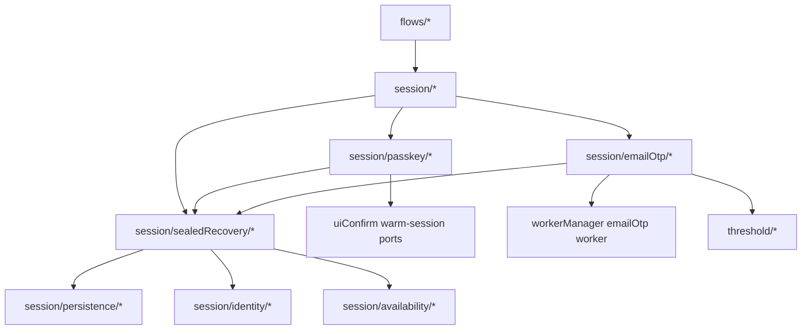

# Refactor 35: Unified Sealed Session Recovery

Date created: 2026-05-08
Status: planned

## Purpose

Unify passkey and Email OTP sealed-session recovery under
`client/src/core/signingEngine/session`.

The current code has two recovery architectures:

- `session/warmSigning/*` owns the passkey-origin warm-session and PRF recovery
  path.
- `sessionEmailOtp/*` owns a separate Email OTP lifecycle coordinator that also
  performs Shamir3Pass sealing, sealed restore, companion-session attachment,
  export PRF recovery, and warm-session status coordination.

The target architecture deletes the external `sessionEmailOtp/` folder. Generic
sealed recovery lives under `session/sealedRecovery/*`; auth-method-specific
recovery lives under `session/passkey/*` and `session/emailOtp/*`.
The refactor also cleans up session folder names so storage, restore,
operation-state, and warm-capability responsibilities are visible from the
folder tree.

## Goals

1. Make sealed recovery one session-domain concept with method-specific
   implementations.
2. Remove the historical split where passkey recovery is embedded in
   `session/warmSigning/*` while Email OTP recovery is isolated in
   `sessionEmailOtp/*`.
3. Keep generic session domains auth-method-neutral:
   `identity`, `availability`, `planning`, `budget`, `persistence`,
   `sealedRecovery`, `operationState`, and `warmCapabilities`.
4. Keep `session/persistence/*` as the storage boundary.
5. Move restore orchestration into `session/sealedRecovery/restoreCoordinator.ts`.
6. Keep method-specific crypto recovery details in method folders.
7. Delete `client/src/core/signingEngine/sessionEmailOtp/` after its
   responsibilities move.
8. Preserve strict lifecycle state types. Generic sealed recovery should accept
   normalized sealed records and exact method-specific restore contexts, never
   raw strings or partial lifecycle objects.

## Target Structure

```text
client/src/core/signingEngine/session/
  sealedRecovery/
    README.md
    types.ts
    policy.ts
    exactRecordLookup.ts
    companionSessions.ts
    restoreCoordinator.ts
    readback.ts

  passkey/
    README.md
    sealedRecovery.ts
    prfClaim.ts
    ecdsaRecovery.ts
    ed25519Recovery.ts
    ports.ts

  emailOtp/
    README.md
    sealedRecovery.ts
    workerRequests.ts
    ecdsaRecovery.ts
    ed25519Recovery.ts
    companionSessions.ts
    provisioning.ts
    status.ts
    exportRecovery.ts
    ports.ts

  identity/
  availability/
  persistence/
  planning/
  budget/
  operationState/
  warmCapabilities/
```

End state:

```text
client/src/core/signingEngine/sessionEmailOtp/          deleted
client/src/core/signingEngine/session/restore/          deleted
client/src/core/signingEngine/session/signingSession/   renamed to session/operationState/
client/src/core/signingEngine/session/warmSigning/      renamed/refactored to session/warmCapabilities/
```

`session/persistence/*` remains the storage and normalized-record boundary.
`session/sealedRecovery/restoreCoordinator.ts` owns restore orchestration over
persisted records. `session/operationState/*` owns per-operation signing state:
lanes, prepared operations, transaction state, trace events, and post-sign
policy state. `session/warmCapabilities/*` owns only the generic warm-material
read model, readiness checks, transitions, cleanup, and public facade. Passkey
PRF claim handling, passkey rehydration, and method-specific provisioning move
to `session/passkey/*`; Email OTP equivalents move to `session/emailOtp/*`.

## Call Graph



Generic recovery owns shared mechanics. Method folders own method-specific
proof material and worker/protocol details.

## Ownership Contract

| Folder | Owns | May import | Forbidden imports |
| --- | --- | --- | --- |
| `session/sealedRecovery/*` | Exact sealed-record recovery mechanics, generic restore policies, readback verification, companion-session coordination contracts | `session/persistence/*`, `session/identity/*`, `session/availability/*`, `interfaces/*`, primitive SDK/shared types | `flows/*`, `SigningEngine.ts`, `assembly/*`, `stepUpConfirmation/*`, concrete method folders |
| `session/passkey/*` | Passkey PRF claim, passkey-origin sealed recovery, passkey ECDSA/Ed25519 rehydration adapters | `session/sealedRecovery/*`, `session/persistence/*`, `session/warmCapabilities/*`, `uiConfirm` warm-session ports, `threshold/*`, `interfaces/*` | `flows/*`, `SigningEngine.ts`, `assembly/*`, `stepUpConfirmation/*`, `session/emailOtp/*` |
| `session/emailOtp/*` | Email OTP sealed recovery, Email OTP worker restore/seal requests, Email OTP provisioning/status/export recovery currently in `sessionEmailOtp/*` | `session/sealedRecovery/*`, `session/persistence/*`, `threshold/*`, `workerManager/*`, `interfaces/*`, `uiConfirm` status ports | `flows/*`, `SigningEngine.ts`, `assembly/*`, `stepUpConfirmation/*`, `session/passkey/*` |
| `session/persistence/*` | Sealed store and normalized persistence records | Primitive types and validation helpers | Method-specific lifecycle logic |
| `session/operationState/*` | Per-operation signing state: lanes, prepared operation state, transaction state, trace events, post-sign policy state | `session/identity/*`, `session/planning/*`, `session/budget/*`, primitive chain/signing types | `flows/*`, `SigningEngine.ts`, `assembly/*`, method recovery folders |
| `session/warmCapabilities/*` | Generic warm-material read model, readiness/status readers, transitions, cleanup, public facade | `session/operationState/*`, `session/persistence/*`, primitive session interfaces, narrow injected ports | `flows/*`, `SigningEngine.ts`, `assembly/*`, `stepUpConfirmation/*`, UI prompt construction, method-specific recovery/provisioning implementation |

## Canonical Data Shapes

Generic sealed recovery should use explicit discriminated states.

```ts
type SealedRecoveryMethod = 'passkey' | 'email_otp';

type SealedRecoveryCurve = 'ecdsa' | 'ed25519';

type SealedRecoveryRecord =
  | {
      method: 'passkey';
      curve: SealedRecoveryCurve;
      sealedRecord: SigningSessionSealedStoreRecord;
      restoreContext: PasskeySealedRecoveryContext;
    }
  | {
      method: 'email_otp';
      curve: SealedRecoveryCurve;
      sealedRecord: SigningSessionSealedStoreRecord;
      restoreContext: EmailOtpSealedRecoveryContext;
    };
```

Method-specific recovery should return monotonic states:

```ts
type SealedRecoveryResult =
  | {
      kind: 'ecdsa_recovered';
      method: SealedRecoveryMethod;
      recovered: RecoveredEcdsaSigningSession;
      companion?: RecoveredEd25519SigningSession;
    }
  | {
      kind: 'ed25519_recovered';
      method: SealedRecoveryMethod;
      recovered: RecoveredEd25519SigningSession;
    };
```

Avoid optional lifecycle fields in recovery inputs. If a restore branch requires
`thresholdSessionId`, `walletSigningSessionId`, `chainTarget`,
`shamirPrimeB64u`, `thresholdSessionAuthToken`, or `participantIds`, the branch
type should require those fields.

## What Moves

From `sessionEmailOtp/EmailOtpThresholdSessionCoordinator.ts`:

- Email OTP sealed ECDSA seal persistence moves to
  `session/emailOtp/sealedRecovery.ts` or `session/emailOtp/ecdsaRecovery.ts`.
- Email OTP sealed ECDSA rehydrate logic moves to
  `session/emailOtp/ecdsaRecovery.ts`.
- Email OTP Ed25519 companion attachment moves to
  `session/emailOtp/companionSessions.ts`, using generic companion contracts
  from `session/sealedRecovery/companionSessions.ts`.
- Email OTP Ed25519 export PRF recovery moves to
  `session/emailOtp/exportRecovery.ts`.
- Email OTP status/readiness helpers move to `session/emailOtp/status.ts`.
- Email OTP provisioning and registration helpers move to
  `session/emailOtp/provisioning.ts`.

From `session/warmSigning/*`:

- Passkey PRF claim logic moves to `session/passkey/prfClaim.ts`.
- Passkey sealed recovery and rehydration adapters move to
  `session/passkey/sealedRecovery.ts`, `session/passkey/ecdsaRecovery.ts`, and
  `session/passkey/ed25519Recovery.ts`.
- Generic warm-session read model, readiness/status readers, transitions,
  cleanup, and public facade move to `session/warmCapabilities/*`.
- Method-specific provisioning moves to `session/passkey/*` or
  `session/emailOtp/*`; `session/warmCapabilities/*` receives method entrypoints
  through narrow typed ports.

From `session/restore/*`:

- Restore orchestration moves to
  `session/sealedRecovery/restoreCoordinator.ts`.
- Restore input/output lifecycle types move to `session/sealedRecovery/types.ts`
  when they describe sealed recovery requests or results.
- `session/restore/*` is deleted after callers import from
  `session/sealedRecovery/*`.

From `session/signingSession/*`:

- Per-operation lane, prepared-operation, transaction-state, trace, and
  post-sign policy files move to `session/operationState/*`.
- Imports are updated directly to `session/operationState/*`.
- No compatibility re-export path is kept.

From `session/persistence/*`:

- Sealed-store read/write primitives remain in `session/persistence/*`.
- Generic exact-record lookup helpers that combine persistence access with
  recovery policy move to `session/sealedRecovery/exactRecordLookup.ts`.

## `warmCapabilities` Refactor

`session/warmCapabilities/*` should become a small read/status facade over warm
material and threshold-session capability records. It should expose normalized
capability state to operation flows and method folders, while method folders own
the work needed to create or restore that state.

Target contents:

```text
session/warmCapabilities/
  README.md
  types.ts
  store.ts
  readModel.ts
  capabilityReader.ts
  capabilityReaderCore.ts
  statusReader.ts
  thresholdSigningSessionReadiness.ts
  ecdsaCapabilityReadiness.ts
  materialCache.ts
  transitions.ts
  cleanup.ts
  public.ts
```

Files that should move out:

- `prfCache.ts` becomes `warmCapabilities/materialCache.ts` if it only writes,
  clears, or claims generic warm material through a narrow port.
- `runtime.ts` splits:
  - generic claim/read error handling moves to `warmCapabilities/materialCache.ts`
    or `warmCapabilities/claim.ts`;
  - ECDSA seal persistence moves to `session/sealedRecovery/*` or
    `session/passkey/ecdsaRecovery.ts`, depending on whether the logic is
    method-neutral.
- `ecdsaBootstrap*.ts`, `ecdsaProvisioner.ts`,
  `ecdsaSessionProvision.ts`, `ecdsaWarmCapabilityBootstrap.ts`, and
  `ecdsaLoginPrefill.ts` move to `session/passkey/*` when they depend on
  passkey/WebAuthn PRF material or passkey-origin provisioning.
- `ed25519Provisioner.ts` and `ed25519SessionProvision.ts` move to
  `session/passkey/*`.
- `persistence.ts` should be split. Pure record normalization/write helpers move
  to `session/persistence/*`; method-specific write policy stays with
  `session/passkey/*` or `session/emailOtp/*`.
- `postSignPolicyAdapter.ts` should move to `session/operationState/*` if it
  adapts operation policy state, or stay in `warmCapabilities/*` only if it
  reads warm capability state without mutating operation state.

Import rule:

- `warmCapabilities/*` may depend on persistence records and primitive session
  types.
- `warmCapabilities/*` receives material-store access and method operations as
  typed ports.
- `warmCapabilities/*` does not construct passkey prompts, call Email OTP
  workers, perform threshold activation, or perform method-specific sealed
  recovery.

## Phased Todo List

### Phase 0: Inventory Exact Recovery Paths

- [ ] List every `sessionEmailOtp/*` method that seals, reads, rehydrates, or
      attaches sealed recovery material.
- [ ] List every `session/warmSigning/*` method that claims PRF material,
      persists seals, reconnects, or rehydrates passkey-origin sessions.
- [ ] Identify which code is generic recovery mechanics and which code is
      method-specific passkey or Email OTP behavior.
- [ ] List all current callers of `EmailOtpThresholdSessionCoordinator`.

Exit criteria:

- [ ] Inventory maps each function to one target owner.
- [ ] No implementation changes in this phase.

### Phase 1: Add Generic Sealed Recovery Contracts

- [ ] Create `session/sealedRecovery/README.md`.
- [ ] Create `session/sealedRecovery/types.ts` with strict recovery request and
      result unions.
- [ ] Create generic helpers for:
      exact sealed-record lookup,
      policy checks,
      readback verification,
      companion session contracts,
      and restore in-flight coordination.
- [ ] Add guard tests that prevent `session/sealedRecovery/*` from importing
      method folders, `flows/*`, `assembly/*`, or `SigningEngine.ts`.

Exit criteria:

- [ ] Generic sealed recovery compiles without moving existing recovery paths.
- [ ] No compatibility barrels are introduced.

### Phase 2: Move Passkey Recovery Behind `session/passkey/*`

- [ ] Create `session/passkey/README.md`.
- [ ] Move PRF claim helpers from `session/warmSigning/*` to
      `session/passkey/prfClaim.ts`.
- [ ] Move passkey ECDSA sealed recovery/reconnect adapters to
      `session/passkey/ecdsaRecovery.ts`.
- [ ] Move passkey Ed25519 sealed recovery adapters to
      `session/passkey/ed25519Recovery.ts`.
- [ ] Keep `session/warmSigning/*` as a facade only where callers still need
      the warm-session read model.

Exit criteria:

- [ ] Passkey-specific Shamir3Pass rehydration code is owned by
      `session/passkey/*`.
- [ ] `session/warmSigning/*` no longer owns passkey-specific recovery logic.

### Phase 3: Move Email OTP Recovery Behind `session/emailOtp/*`

- [ ] Create `session/emailOtp/README.md`.
- [ ] Move Email OTP worker seal/rehydrate request construction to
      `session/emailOtp/workerRequests.ts`.
- [ ] Move ECDSA Email OTP sealed recovery into
      `session/emailOtp/ecdsaRecovery.ts`.
- [ ] Move Ed25519 Email OTP sealed recovery into
      `session/emailOtp/ed25519Recovery.ts`.
- [ ] Move Email OTP companion session handling into
      `session/emailOtp/companionSessions.ts`.
- [ ] Reuse generic recovery contracts from `session/sealedRecovery/*`.

Exit criteria:

- [ ] Email OTP sealed recovery no longer lives in
      `sessionEmailOtp/EmailOtpThresholdSessionCoordinator.ts`.
- [ ] Email OTP recovery uses the same generic sealed recovery contracts as
      passkey recovery.

### Phase 4: Move Remaining Email OTP Session Lifecycle

- [ ] Move Email OTP session provisioning to `session/emailOtp/provisioning.ts`.
- [ ] Move Email OTP warm-session status coordination to
      `session/emailOtp/status.ts`.
- [ ] Move Email OTP export PRF recovery to `session/emailOtp/exportRecovery.ts`.
- [ ] Replace direct `EmailOtpThresholdSessionCoordinator` construction with
      explicit `session/emailOtp/*` entrypoints.
- [ ] Keep step-up prompt and auth-plan construction under
      `stepUpConfirmation/otpPrompt/*`.

Exit criteria:

- [ ] `session/emailOtp/*` owns Email OTP session lifecycle.
- [ ] `stepUpConfirmation/*` owns prompts and auth-plan orchestration only.
- [ ] Operation flows import Email OTP session lifecycle through documented
      session entrypoints.

### Phase 5: Delete `sessionEmailOtp/`

- [ ] Delete `client/src/core/signingEngine/sessionEmailOtp/`.
- [ ] Update assembly ports and runtime construction to use
      `session/emailOtp/*`.
- [ ] Update all imports from `sessionEmailOtp/*`.
- [ ] Add deleted-path guard coverage for `sessionEmailOtp/`.
- [ ] Update `client/src/core/signingEngine/README.md`,
      `session/README.md`, `docs/refactor-33.md`, and
      `docs/stepup-adaptor.md`.

Exit criteria:

- [ ] `rg "sessionEmailOtp" client/src tests docs` returns only historical
      notes in completed plans or no results, depending on docs policy.
- [ ] No compatibility re-export path exists.

### Phase 6: Tighten Recovery Types And Guards

- [ ] Replace recovery inputs with method-specific required state branches.
- [ ] Delete duplicate Email OTP/passkey recovery helper shapes.
- [ ] Add guard tests:
      `session/passkey/*` cannot import `session/emailOtp/*`;
      `session/emailOtp/*` cannot import `session/passkey/*`;
      `session/sealedRecovery/*` cannot import either method folder.
- [ ] Add tests that cover:
      passkey ECDSA recovery,
      Email OTP ECDSA recovery,
      Email OTP Ed25519 companion recovery,
      expired/exhausted sealed record rejection,
      mismatched wallet signing-session rejection.

Exit criteria:

- [ ] `pnpm exec tsc -p client/tsconfig.json --noEmit --pretty false` passes.
- [ ] Focused sealed recovery unit tests pass.
- [ ] `pnpm build:sdk` passes.

### Phase 7: Rename Session Operation And Warm Capability Domains

- [ ] Rename `session/signingSession/` to `session/operationState/`.
- [ ] Update all imports from `session/signingSession/*` to
      `session/operationState/*`.
- [ ] Rename `session/warmSigning/` to `session/warmCapabilities/`.
- [ ] Move only generic warm-capability files into `session/warmCapabilities/*`:
      read model, capability readers, status/readiness readers, transitions,
      cleanup, public facade, runtime claim facade, and store types.
- [ ] Move passkey-specific PRF, sealed recovery, and provisioning files into
      `session/passkey/*`.
- [ ] Move Email OTP-specific warm-session status/provisioning files into
      `session/emailOtp/*`.
- [ ] Keep `session/persistence/*` unchanged as the storage and normalized-record
      boundary.
- [ ] Add deleted-path guard coverage for `session/signingSession/*` and
      `session/warmSigning/*`.

Exit criteria:

- [ ] `rg "session/signingSession|session/warmSigning" client/src tests`
      returns no production or test imports.
- [ ] `session/operationState/*` contains operation-state files only.
- [ ] `session/warmCapabilities/*` contains the generic warm-capability facade
      and no method-specific recovery/provisioning implementation.
- [ ] No compatibility re-export path exists.
- [ ] `pnpm exec tsc -p client/tsconfig.json --noEmit --pretty false` passes.
- [ ] `pnpm build:sdk` passes.

### Phase 8: Fold Restore Into Sealed Recovery

- [ ] Move `session/restore/restoreCoordinator.ts` to
      `session/sealedRecovery/restoreCoordinator.ts`.
- [ ] Move restore request/result types into `session/sealedRecovery/types.ts`
      when they are shared by passkey and Email OTP recovery.
- [ ] Update all imports from `session/restore/*` to
      `session/sealedRecovery/*`.
- [ ] Delete `session/restore/`.
- [ ] Add deleted-path guard coverage for `session/restore/*`.

Exit criteria:

- [ ] `rg "session/restore" client/src tests` returns no production or test
      imports.
- [ ] Restore orchestration imports `session/persistence/*` for storage access
      and method folders only through narrow typed ports.
- [ ] `session/persistence/*` remains in place and does not import restore,
      sealed recovery orchestration, or method folders.
- [ ] No compatibility re-export path exists.
- [ ] `pnpm exec tsc -p client/tsconfig.json --noEmit --pretty false` passes.
- [ ] `pnpm build:sdk` passes.

## Success Metrics

- `sessionEmailOtp/` is deleted.
- Passkey and Email OTP sealed recovery both pass through
  `session/sealedRecovery/*` contracts.
- Method-specific recovery lives in `session/passkey/*` and
  `session/emailOtp/*`.
- Generic session folders remain auth-method-neutral.
- `session/persistence/*` remains the storage boundary.
- Restore orchestration lives in `session/sealedRecovery/restoreCoordinator.ts`.
- Per-operation signing state lives in `session/operationState/*`.
- Generic warm-material readiness and facade code lives in
  `session/warmCapabilities/*`.
- No duplicate sealed-recovery structs remain between passkey and Email OTP.
- No broad internal barrels are added.

## Risks

- `EmailOtpThresholdSessionCoordinator.ts` currently owns multiple concerns.
  Splitting sealed recovery first reduces the blast radius.
- ECDSA and Ed25519 companion restore identity checks are fragile. Move them
  with focused tests before deleting old paths.
- Worker request payloads are method-specific. Keep them in method folders and
  pass normalized recovery results back to generic session code.
- Persistence schema changes are excluded from the first implementation pass.
  The plan should reuse existing sealed-store records until the recovery shape
  is stable.
