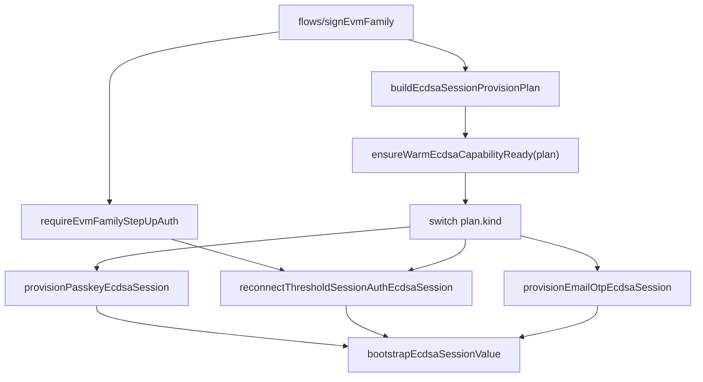

# Refactor 36: Narrow Lifecycle State Types

Date created: 2026-05-09
Status: draft

## Purpose

Eliminate wide optional argument bags from signing-engine lifecycle paths.

The recent passkey ECDSA regression came from one object shape representing
multiple incompatible lifecycle routes. Passkey reauthorization,
threshold-session auth reconnect, and Email OTP refresh all flowed through the
same optional fields:

- `sessionId?: string`
- `walletSigningSessionId?: string`
- `thresholdSessionAuth?: ...`
- `webauthnAuthentication?: ...`
- `clientRootShare32B64u?: string`
- `emailOtpAuthContext?: ...`

That let an invalid mixed state compile. The provisioner then had to infer route
semantics from field presence, which made stale threshold-session auth identity
look eligible for a new passkey-planned identity.

This refactor replaces those bags with discriminated lifecycle plans whose
required state is required by type.

## Execution Priorities

Treat this as two tracks:

1. Must-fix identity/auth safety.
2. Cleanup and broad state tightening.

The first implementation milestone should stay deliberately narrow:

- ECDSA provision plan union.
- EVM-family caller migration to the plan union.
- server signing-budget/status curve-bound request parsing.
- deletion of the ECDSA optional provision/bootstrap bags.

Lane candidate states, sealed recovery normalization, and broader budget cleanup
are important follow-up phases. They should not block the first safety
milestone.

## Goals

1. Make lifecycle route explicit before state enters `session/passkey/*` or
   `session/warmCapabilities/*`.
2. Remove optional lifecycle fields from internal provision, restore, budget,
   signing, and export state.
3. Keep optional fields only for real optional config: callbacks, UI text,
   diagnostics, cancellation hooks, feature knobs, and low-risk display data.
4. Validate raw inputs once at boundaries, then convert to exact internal
   identities and auth materials.
5. Make invalid lifecycle combinations fail at compile time.
6. Delete replaced optional-bag types after callers move.

## Lifecycle Field Rule

These fields are lifecycle state. Internal core types should require them on the
branch that uses them:

- `thresholdSessionId`
- `walletSigningSessionId`
- `thresholdSessionAuth`
- `thresholdSessionAuthToken`
- `clientRootShare32B64u`
- `webauthnAuthentication`
- `emailOtpAuthContext`
- `ecdsaThresholdKeyId`
- `signingRootId`
- `signingRootVersion`
- `participantIds`
- `chainTarget`
- `runtimePolicyScope`
- `remainingUses`
- `expiresAtMs`
- `sessionBudgetUses`
- `wallet budget status/auth`
- export/recovery identifiers and sealed-record restore metadata

If a branch cannot proceed without the value, the value must be required in that
branch type.

Optional fields remain acceptable for:

- callbacks such as `beforeReconnect` and `assertNotCancelled`
- UI labels, hints, and diagnostics
- override/config knobs whose absence has a real default
- raw persistence records at the storage boundary, before normalization

## Construction Rules

Lifecycle plans and verified auth/status request types must be created through
named constructors/builders. Direct object construction is allowed only inside
those builder modules and compile-time negative fixtures.

Required builders:

- `buildPasskeyEcdsaSessionProvision`
- `buildThresholdSessionAuthEcdsaReconnect`
- `buildEmailOtpEcdsaSessionProvision`
- `parseEcdsaWalletSigningBudgetStatusRequest`
- `parseEd25519WalletSigningBudgetStatusRequest`
- `parseWalletSigningBudgetStatusRequest`

Forbidden near lifecycle builders:

- `as EcdsaSessionProvisionPlan`
- `as WalletSigningBudgetStatusRequest`
- `as any`
- broad object spreads into lifecycle plans
- accepting `Record<string, unknown>` after boundary parsing

Use `satisfies` for local literals where direct construction is useful in tests.

## Field Layout Convention

Order lifecycle fields so reviewers can audit identity and shared state before
reading branch-specific material:

1. Discriminant: `kind`, then `curve` when present.
2. Subject/session identity: `subjectId`, `chainTarget`,
   `newSessionIdentity`, `existingSessionIdentity`, `identity`,
   `thresholdSessionId`, `walletSigningSessionId`.
3. Shared lifecycle fields: signing-key context, auth token, expiry, budget.
4. A comment line: `// Branch-specific fields.` or
   `// Curve-specific fields.`
5. Branch-only material and `never` exclusions.

## Current Hotspots

### ECDSA Provisioning

Primary files:

- `client/src/core/signingEngine/session/warmCapabilities/types.ts`
- `client/src/core/signingEngine/session/passkey/ecdsaProvisioner.ts`
- `client/src/core/signingEngine/session/passkey/ecdsaBootstrapRequest.ts`
- `client/src/core/signingEngine/session/passkey/ecdsaBootstrap.ts`
- `client/src/core/signingEngine/session/passkey/ecdsaSessionProvision.ts`
- `client/src/core/signingEngine/flows/signEvmFamily/ecdsaReadiness.ts`
- `client/src/core/signingEngine/flows/signEvmFamily/signingFlowRuntime.ts`

Current wide types to retire:

- `EnsureWarmEcdsaCapabilityReadyArgs`
- `ResolveWarmEcdsaBootstrapRequestArgs`
- `WarmEcdsaBootstrapRequest`
- `ProvisionWarmEcdsaCapabilityArgs`
- any helper input that forwards the same `sessionId?`,
  `walletSigningSessionId?`, `thresholdSessionAuth?`,
  `webauthnAuthentication?`, `clientRootShare32B64u?` shape

### ECDSA Lane Selection

Primary files:

- `client/src/core/signingEngine/flows/signEvmFamily/ecdsaLanes.ts`
- `client/src/core/signingEngine/flows/signEvmFamily/ecdsaSelection.ts`
- `client/src/core/signingEngine/session/identity/selectLane.ts`
- `client/src/core/signingEngine/session/availability/readiness.ts`
- `client/src/core/signingEngine/session/availability/persistedAvailableSigningLanes.ts`

Problem shape:

- candidate material appears as `{ record?: ..., keyRef?: ... }`
- readiness state is sometimes carried as optional `record`, optional `keyRef`,
  optional selected lane, and optional budget status

Target shape:

- candidate state is a discriminated union:
  `missing`, `record_only`, `key_ref_only`, `ready_material`,
  `ready_but_budget_blocked`, `expired`, `exhausted`
- selected signing lane carries exact identity and chain target

### Budget Admission

Primary files:

- `client/src/core/signingEngine/session/budget/budget.ts`
- `client/src/core/signingEngine/session/budget/BudgetCoordinator.ts`
- `client/src/core/signingEngine/session/budget/budgetStatusReader.ts`
- `client/src/core/signingEngine/session/budget/budgetFinalizer.ts`
- `client/src/core/signingEngine/flows/signEvmFamily/thresholdAdmission.ts`
- `client/src/core/signingEngine/flows/signEvmFamily/budgetSpending.ts`

Problem shape:

- budget inputs allow optional `walletSigningSessionId`, optional target
  threshold IDs, optional target backing-material IDs, and optional trusted auth
  on one object

Target shape:

- zero-spend, wallet-budget spend, and threshold-budget status checks are
  separate branch types
- wallet-budget spend requires wallet identity and target threshold session IDs
- trusted status auth is required on the branch that uses authenticated status

### Server Threshold Session Status

Primary files:

- `server/src/router/express/routes/sessions.ts`
- `server/src/router/cloudflare/routes/sessions.ts`
- `server/src/threshold/session/signingSessionSeal/policy/sessionPolicy.ts`
- `server/src/threshold/session/signingSessionSeal/types.ts`
- `server/src/threshold/session/signingSessionSeal/service.ts`

Problem shape:

- `/session/signing-budget/status` historically accepted a
  `thresholdSessionId` and looked up generic session status
- passkey login can create matching `threshold-login-*` IDs in Ed25519 and ECDSA
  session stores
- generic status lookup can select the wrong curve row unless the request carries
  curve-bound verified auth and curve-specific status expectations

Target shape:

- request-boundary threshold-session auth parsing returns a verified
  curve-specific auth branch
- ECDSA status requests require ECDSA auth claims and ECDSA store material
- Ed25519 status requests require Ed25519 auth claims and Ed25519 store material
- wrong-curve auth/status combinations are rejected with `never` fields before
  route code can call a generic lookup
- Express and Cloudflare routes share one parser module so curve/auth validation
  cannot drift between runtimes

### Sealed Recovery

Primary files:

- `client/src/core/signingEngine/session/sealedRecovery/types.ts`
- `client/src/core/signingEngine/session/sealedRecovery/restoreCoordinator.ts`
- `client/src/core/signingEngine/session/passkey/*Recovery.ts`
- `client/src/core/signingEngine/session/emailOtp/*Recovery.ts`
- `client/src/core/signingEngine/session/persistence/sealedSessionStore.ts`

Problem shape:

- persisted records are raw and partial by nature, which is fine at the storage
  boundary
- some restored internal states still preserve optional lifecycle fields after
  normalization

Target shape:

- persistence boundary returns normalized discriminated restore records
- passkey and Email OTP restore branches require their method-specific restore
  metadata before core restore logic runs

### Step-Up Results

Primary files:

- `client/src/core/signingEngine/stepUpConfirmation/requireStepUpAuth.ts`
- `client/src/core/signingEngine/stepUpConfirmation/types.ts`
- `client/src/core/signingEngine/flows/signEvmFamily/requireEvmFamilyStepUpAuth.ts`
- `client/src/core/signingEngine/flows/signNear/requireNearStepUpAuth.ts`

Problem shape:

- method result payloads can still be forwarded into lower session code as
  broad optional auth fields

Target shape:

- step-up returns exact method authorization branches
- ECDSA flow converts those branches into exact ECDSA provision plans

## Canonical Types

Create a small set of canonical lifecycle types under:

```text
client/src/core/signingEngine/session/identity/
  ecdsaSessionIdentity.ts

client/src/core/signingEngine/session/warmCapabilities/
  ecdsaProvisionPlan.ts
```

### ECDSA Session Identity

```ts
export type EcdsaSessionIdentity = {
  thresholdSessionId: string;
  walletSigningSessionId: string;
};
```

Construction should happen through a boundary helper:

```ts
export function toEcdsaSessionIdentity(input: {
  thresholdSessionId: unknown;
  walletSigningSessionId: unknown;
}): EcdsaSessionIdentity;
```

Internal code should accept `EcdsaSessionIdentity`, not sibling
`sessionId?: string` and `walletSigningSessionId?: string` fields.

### ECDSA Signing Key Context

```ts
export type EcdsaSigningKeyContext = {
  ecdsaThresholdKeyId: string;
  signingRootId: string;
  signingRootVersion: string;
  participantIds: readonly number[];
};
```

If some routes genuinely lack signing-root data today, model that as a separate
branch such as `registration_key_context` or `legacy_missing_signing_root` only
while migrating. Delete the branch before this refactor is complete.

### ECDSA Provision Plan

```ts
export type EcdsaSessionProvisionPlan =
  | PasskeyEcdsaSessionProvision
  | ThresholdSessionAuthEcdsaReconnect
  | EmailOtpEcdsaSessionProvision;
```

```ts
export type PasskeyEcdsaSessionProvision = {
  kind: 'passkey_ecdsa_session_provision';
  subjectId: WalletId;
  chainTarget: ThresholdEcdsaChainTarget;
  newSessionIdentity: EcdsaSessionIdentity;
  signingKeyContext: EcdsaSigningKeyContext;
  sessionBudgetUses: number;

  // Branch-specific fields.
  clientRootShare32B64u: string;
  webauthnAuthentication: WebAuthnAuthenticationCredential;
  runtimePolicyScope: ThresholdRuntimePolicyScope;
  thresholdSessionAuth?: never;
  emailOtpAuthContext?: never;
};
```

```ts
export type ThresholdSessionAuthEcdsaReconnect = {
  kind: 'threshold_session_auth_ecdsa_reconnect';
  subjectId: WalletId;
  chainTarget: ThresholdEcdsaChainTarget;
  existingSessionIdentity: EcdsaSessionIdentity;
  signingKeyContext: EcdsaSigningKeyContext;
  sessionBudgetUses: number;

  // Branch-specific fields.
  thresholdSessionAuth: VerifiedEcdsaThresholdSessionAuth;
  webauthnAuthentication?: never;
  emailOtpAuthContext?: never;
};
```

```ts
export type EmailOtpEcdsaSessionProvision = {
  kind: 'email_otp_ecdsa_session_provision';
  subjectId: WalletId;
  chainTarget: ThresholdEcdsaChainTarget;
  newSessionIdentity: EcdsaSessionIdentity;
  signingKeyContext: EcdsaSigningKeyContext;
  sessionBudgetUses: number;

  // Branch-specific fields.
  emailOtpAuthContext: ThresholdEcdsaEmailOtpAuthContext;
  clientRootShare32B64u: string;
  runtimePolicyScope: ThresholdRuntimePolicyScope;
  webauthnAuthentication?: never;
  thresholdSessionAuth?: never;
};
```

### Verified Threshold Auth

Decode threshold-session auth tokens at the boundary and carry the verified curve,
identity, and session-store expectations:

```ts
export type VerifiedThresholdSessionAuth =
  | VerifiedEcdsaThresholdSessionAuth
  | VerifiedEd25519ThresholdSessionAuth;

export type VerifiedEcdsaThresholdSessionAuth = {
  kind: 'threshold_session';
  curve: 'ecdsa';
  identity: EcdsaSessionIdentity;
  thresholdSessionAuthToken: string;
  expiresAtMs: number;

  // Curve-specific fields.
  ecdsaThresholdKeyId: string;
  relayerKeyId: string;
  ed25519RelayerKeyId?: never;
};

export type VerifiedEd25519ThresholdSessionAuth = {
  kind: 'threshold_session';
  curve: 'ed25519';
  thresholdSessionId: string;
  walletSigningSessionId: string;
  thresholdSessionAuthToken: string;
  expiresAtMs: number;

  // Curve-specific fields.
  ed25519RelayerKeyId: string;
  ecdsaThresholdKeyId?: never;
};
```

`threshold_session_auth_ecdsa_reconnect` should require
`VerifiedEcdsaThresholdSessionAuth`, and its constructor should only return the
plan when `auth.identity` equals `existingSessionIdentity`.

### Server Budget Status Request

The server budget-status route should parse raw request/auth state once and
convert it into a curve-bound request:

```ts
export type WalletSigningBudgetStatusRequest =
  | EcdsaWalletSigningBudgetStatusRequest
  | Ed25519WalletSigningBudgetStatusRequest;

export type EcdsaWalletSigningBudgetStatusRequest = {
  kind: 'ecdsa_wallet_budget_status';
  auth: VerifiedEcdsaThresholdSessionAuth;
  identity: EcdsaSessionIdentity;
  thresholdSessionId: string;
  walletSigningSessionId: string;

  // Curve-specific fields.
  ecdsaThresholdKeyId: string;
  ed25519RelayerKeyId?: never;
};

export type Ed25519WalletSigningBudgetStatusRequest = {
  kind: 'ed25519_wallet_budget_status';
  auth: VerifiedEd25519ThresholdSessionAuth;
  thresholdSessionId: string;
  walletSigningSessionId: string;

  // Curve-specific fields.
  ed25519RelayerKeyId: string;
  ecdsaThresholdKeyId?: never;
};
```

The route should switch on `request.kind` and call a curve-specific selector.
Do not use a route-level `getSessionStatus(thresholdSessionId)` for threshold
session curve resolution.

Split the policy API so the call site names the lookup intent:

```ts
type SigningSessionSealThresholdSessionPolicy = {
  getThresholdSessionStatuses(
    thresholdSessionId: string,
  ): Promise<SigningSessionSealThresholdSessionStatus[]>;

  getWalletBudgetStatus(
    walletSigningSessionId: string,
  ): Promise<SigningSessionSealThresholdSessionStatus | null>;
};
```

The current `getSessionStatuses` shape is an intermediate step. The target API
should make a wallet-budget lookup and a threshold-session curve lookup distinct
operations.

## Target Call Graph



Only `buildEcdsaSessionProvisionPlan` should translate from operation result
state into session provisioning state.

## Import Direction Contract

| From | May import | Must not import |
| --- | --- | --- |
| `flows/signEvmFamily/*` | `stepUpConfirmation` result types, `session/warmCapabilities/ecdsaProvisionPlan`, `session/SigningSessionCoordinator` | `session/passkey/ecdsaProvisioner` internals, raw bootstrap request helpers |
| `stepUpConfirmation/*` | method prompt/result types | `session/warmCapabilities/*`, `session/passkey/*`, `flows/*` |
| `session/warmCapabilities/*` | canonical identity/provision-plan types, generic warm read model, injected method ports | `flows/*`, `stepUpConfirmation/*`, raw operation prompt types |
| `session/passkey/*` | passkey provision branch types, WebAuthn auth material, sealed recovery ports | `flows/*`, Email OTP implementation |
| `session/emailOtp/*` | Email OTP provision branch types, Email OTP worker/session ports | `flows/*`, passkey implementation |
| `session/budget/*` | canonical wallet/threshold budget request branches | `flows/*`, raw selected-lane candidates |
| `server/src/router/*/routes/sessions.ts` | shared signing-budget/status parser and typed selectors | duplicated curve/auth parsing logic, bare threshold-session status lookup |

## Deletion Gates

Each phase must delete at least one old type, fallback path, or compatibility
adapter. A phase that only adds wrappers around the old optional bags is not
complete.

Minimum deletion gates:

- ECDSA provision plan phase deletes `EnsureWarmEcdsaCapabilityReadyArgs`.
- Bootstrap phase deletes `ResolveWarmEcdsaBootstrapRequestArgs`,
  `WarmEcdsaBootstrapRequest`, and `ProvisionWarmEcdsaCapabilityArgs`.
- Server budget/status phase deletes route-level threshold-session
  `getSessionStatus(thresholdSessionId)` fallback usage.
- Budget API phase replaces generic `getSessionStatus` call sites with
  `getThresholdSessionStatuses` or `getWalletBudgetStatus`.
- Final cleanup removes all temporary allowlist entries from the
  optional-lifecycle guard.

## Phased Implementation

### Phase 1: Inventory, Guardrails, and Negative Type Fixtures

- [x] Add an inventory section to this plan with every type that carries
  optional lifecycle fields.
- [x] Add a targeted architecture guard for new optional lifecycle fields in:
  - `session/warmCapabilities/types.ts`
  - `session/passkey/*`
  - `session/emailOtp/*`
  - `session/budget/*`
  - `flows/signEvmFamily/*`
- [x] Add a server architecture guard for route/request types under:
  - `server/src/router/*/routes/sessions.ts`
  - `server/src/threshold/session/signingSessionSeal/*`
- [x] Allowlisted optional fields must be config/UI/callback fields only.
- [x] Document every temporary allowlist entry with the phase that deletes it.
- [x] Add type-level negative fixtures using `@ts-expect-error` or `satisfies`
  for:
  - passkey provision with threshold-session auth
  - threshold-session auth reconnect with WebAuthn auth
  - ECDSA server status request with Ed25519 relayer material
  - Ed25519 server status request with ECDSA threshold-key material
- [x] Add a source guard forbidding `as EcdsaSessionProvisionPlan`,
  `as WalletSigningBudgetStatusRequest`, and broad object spreads into
  lifecycle plan builders.
- [x] Split guard rollout into ratchets:
  - provision-plan construction guard first
  - server status-request guard second
  - optional lifecycle-field guard after Phases 8-11 reduce remaining valid
    optionals
- [x] Create one finite allowlist file for transitional lifecycle optionals.
  Each entry must name the owning phase that deletes it.
- [x] Add fixtures that intentionally construct invalid branch combinations
  through public builders, not by importing private helper types.

Inventory of current transitional optional lifecycle carriers:

- `client/src/core/signingEngine/session/warmCapabilities/types.ts`
- `client/src/core/signingEngine/session/warmCapabilities/ecdsaProvisionPlan.ts`
- `client/src/core/signingEngine/session/warmCapabilities/persistence.ts`
- `client/src/core/signingEngine/session/warmCapabilities/readModel.ts`
- `client/src/core/signingEngine/session/warmCapabilities/sealedRefreshParity.ts`
- `client/src/core/signingEngine/session/passkey/ecdsaBootstrap.ts`
- `client/src/core/signingEngine/session/passkey/ed25519Recovery.ts`

Exit criteria:

- guard fails when a new `sessionId?: string`,
  `walletSigningSessionId?: string`, `thresholdSessionAuth?:`,
  `webauthnAuthentication?:`, or `clientRootShare32B64u?:` is added to an
  internal lifecycle type
- server guard fails when budget/status route code accepts a generic
  `thresholdSessionId` without a curve-bound auth branch
- negative type fixtures prove the invalid lifecycle mixes fail compilation
- current allowlist is explicit and finite

### Phase 2: Canonical Identity Types

- [x] Add `EcdsaSessionIdentity`.
- [x] Add boundary constructors for:
  - planned identity from policy/session creation
  - existing identity from selected key ref/record
  - verified identity from decoded threshold-session auth
- [x] Replace sibling identity fields in local ECDSA readiness/provisioning
  helpers with `EcdsaSessionIdentity`.
- [x] Keep raw string parsing only in constructors and request-boundary files.
- [x] Add an explicit raw-parse allowlist. Allowed files only:
  - `session/warmCapabilities/ecdsaProvisionPlan.ts`
  - route/request parsers
  - persistence normalization files
  - worker response normalization files
- [x] Replace internal `String(value || '').trim()` identity parsing in ECDSA
  flow/provision helpers with canonical constructors.
- [x] Close the mismatched identity construction gap by routing guarded
  internal ECDSA identity fields through canonical constructors and making the
  raw-identity parse allowlist empty.

Exit criteria:

- no internal ECDSA provision helper accepts separate optional
  `sessionId`/`walletSigningSessionId`
- mismatched single-field identity fails at construction

### Phase 3: ECDSA Provision Plan Union

- [x] Add `EcdsaSessionProvisionPlan`.
- [x] Add `PasskeyEcdsaSessionProvision`.
- [x] Add `ThresholdSessionAuthEcdsaReconnect`.
- [x] Add `EmailOtpEcdsaSessionProvision`.
- [x] Add named builders:
  - `buildPasskeyEcdsaSessionProvision`
  - `buildThresholdSessionAuthEcdsaReconnect`
  - `buildEmailOtpEcdsaSessionProvision`
- [x] Move route selection out of `ensureWarmEcdsaCapabilityReady` into
  `buildEcdsaSessionProvisionPlan`.
- [x] Make `ensureWarmEcdsaCapabilityReady` accept `EcdsaSessionProvisionPlan`.
- [x] Split narrow provision functions:
  - `provisionPasskeyEcdsaSession`
  - `reconnectThresholdSessionAuthEcdsaSession`
  - `provisionEmailOtpEcdsaSession`
- [x] Make provision-plan constructors the only exported construction path.
- [x] Add a source guard forbidding direct object-literal construction of
  `EcdsaSessionProvisionPlan` branches outside the builder module.
- [x] Use `satisfies` on internal builder return objects so branch-specific
  `never` fields stay enforced.
- [x] Audit callers for broad object spreads into provision-plan builders and
  replace them with explicit field mapping.

Exit criteria:

- passkey session provision cannot carry `thresholdSessionAuth`
- threshold-session auth reconnect plan cannot carry `webauthnAuthentication`
- Email OTP plan cannot carry passkey WebAuthn auth
- provisioner switches on `plan.kind`
- callers use builders rather than object-spread construction
- `EnsureWarmEcdsaCapabilityReadyArgs` is deleted

### Phase 4: Remove ECDSA Bootstrap Optional Bags

- [x] Replace `ResolveWarmEcdsaBootstrapRequestArgs` with branch-specific
  bootstrap inputs.
- [x] Replace `WarmEcdsaBootstrapRequest` with a normalized union.
- [x] Replace `ProvisionWarmEcdsaCapabilityArgs` with branch-specific
  provision inputs plus explicit config fields.
- [x] Delete helper logic that infers route from optional auth fields.
- [x] Remove compatibility forwarding of old optional shapes.
  - [x] Delete the EVM-family `warmSessionServices.ts` bootstrap re-normalization
    path so internal flow code no longer converts broad bootstrap args back into
    provision args.
- [x] Classify remaining adapters as either:
  - allowed public/request boundary normalizers
  - forbidden internal compatibility forwarding
- [x] Document each allowed boundary normalizer with its source raw shape and
  exact normalized output type.
- [x] Delete internal bootstrap adapters that only convert one normalized shape
  into another normalized shape.

Allowed boundary normalizers after the internal adapter cleanup:

- `client/src/core/signingEngine/session/passkey/ecdsaProvisionInput.ts`
  Source raw shape: `BootstrapEcdsaSessionArgs`
  Normalized output: `ProvisionWarmEcdsaCapabilityArgs`
- `client/src/core/signingEngine/session/passkey/ecdsaBootstrapRequest.ts`
  Source raw shape: `ProvisionWarmEcdsaCapabilityArgs` plus `WarmSessionEnvelope`
  Normalized output: `WarmEcdsaBootstrapRequest`
- `client/src/core/signingEngine/session/warmCapabilities/ecdsaProvisionPlan.ts`
  Source raw shape: decoded JWT claims, selected key refs, persisted ECDSA records
  Normalized output: `EcdsaSessionIdentity`, `EcdsaSigningKeyContext`, `EcdsaSessionProvisionPlan`

Exit criteria:

- `session/passkey/ecdsaBootstrapRequest.ts` either disappears or exports only
  branch-specific builders
- route selection uses discriminants instead of `Boolean(field)` checks
- old optional bootstrap types are deleted

### Phase 5: EVM-Family Must-Fix Vertical Slice

- [x] Convert `flows/signEvmFamily/signingFlowRuntime.ts` to build a
  `PasskeyEcdsaSessionProvision` after passkey step-up.
- [x] Convert Email OTP signing refresh to build `EmailOtpEcdsaSessionProvision`.
  - [x] Replace the keyRef-only Email OTP completion seam with exact
    `bootstrap + warmCapability` state and delete the fallback lane/record
    re-query path.
- [x] Convert exact reconnect path to build `ThresholdSessionAuthEcdsaReconnect`.
- [x] Update `ecdsaReadiness.ts`, `thresholdAdmission.ts`, and
  `budgetSpending.ts` to consume narrowed state.
  - [x] Normalize raw touch-confirm output into an auth-method-specific
    threshold-admission confirmation union before `thresholdAdmission.ts`
    consumes it.
  - [x] Replace the EVM-family budget finalizer input bag with exact admitted
    transaction state plus the finalized signing lane.
- [x] Delete optional-field bridge code after the EVM-family slice compiles.
  - [x] Delete the `ecdsaReadiness.ts` fallback path that rebuilt passkey
    reconnect plans from optional `clientRootShare32B64u` and
    `webauthnAuthentication` fields.
- [x] Define the final EVM-family selected-state type that operation execution
  consumes after Phase 8.
- [x] Add a type fixture proving EVM-family signing cannot call session
  readiness with raw passkey or Email OTP prompt payloads.
- [x] Add a focused manual/regression checklist for:
  - fresh passkey unlock then Tempo/EVM signing
  - passkey step-up after budget exhaustion
  - Email OTP direct signing
  - Email OTP step-up signing

Focused manual/regression checklist:

- fresh passkey unlock then Tempo signing
- fresh passkey unlock then EVM signing
- passkey step-up after exhausted wallet budget
- Email OTP direct signing
- Email OTP step-up signing

Exit criteria:

- Tempo and EVM signing use the same provision-plan union
- passkey, Email OTP, and threshold-session auth reconnect each have one
  typed path
- no EVM-family call site passes raw optional lifecycle fields into session code

### Phase 6: Server Budget Status Curve-Bound Requests

- [x] Add shared parser module used by both Express and Cloudflare routes.
- [x] Add `parseWalletSigningBudgetStatusRequest`.
- [x] Add `parseEcdsaWalletSigningBudgetStatusRequest`.
- [x] Add `parseEd25519WalletSigningBudgetStatusRequest`.
- [x] Require curve-bound verified auth on server budget-status branches.
- [x] Use `never` fields to reject ECDSA auth with Ed25519 status material and
  Ed25519 auth with ECDSA status material.
- [x] Replace duplicated route-local parsing with the shared parser.
- [x] Split policy lookup methods:
  - `getThresholdSessionStatuses`
  - `getWalletBudgetStatus`
- [x] Update Express and Cloudflare session routes to switch on
  `WalletSigningBudgetStatusRequest.kind`.
- [x] Delete route-level fallback to generic threshold
  `getSessionStatus(thresholdSessionId)`.
- [x] Add shared wrong-curve rejection fixtures used by both Express and
  Cloudflare route tests.
- [x] Add one parser-level fixture per budget-status branch proving required
  identity/auth fields are rejected when missing.
- [x] Add a source guard forbidding route-local budget-status body parsing in
  Express and Cloudflare session routes.

Exit criteria:

- server signing-budget status cannot compile with ambiguous curve lookup
- ECDSA status cannot compile with Ed25519 relayer material
- Ed25519 status cannot compile with ECDSA threshold-key material
- Express and Cloudflare import the same parser and request types
- threshold-session curve lookup and wallet-budget lookup are separate API calls

### Phase 7: Client Budget Branch Types

- [x] Define budget request branches:
  - `NoBudgetSpend`
  - `WalletBudgetSpend`
  - `ThresholdBudgetStatusCheck`
  - `BudgetFinalizationSpend`
- [x] Require wallet identity on wallet-budget branches.
- [x] Require target threshold IDs on branches that query scoped status.
- [x] Require trusted status auth on authenticated status branches.
- [x] Update `BudgetCoordinator` and `budget.ts` to accept the union.
- [x] Delete optional target-array inputs from internal budget APIs.
- [x] Reconcile checklist names with the implemented status-check union:
  `WalletBudgetStatusCheck`, `BackingMaterialBudgetStatusCheck`,
  `ThresholdBudgetStatusCheck`, and
  `AuthenticatedThresholdBudgetStatusCheck`.
- [x] Add a type fixture proving authenticated status checks cannot omit
  `trustedStatusAuth`.
- [x] Add a type fixture proving scoped status checks cannot compile without a
  non-empty target id tuple.

Exit criteria:

- wallet budget admission cannot compile without wallet signing-session identity
- scoped status check cannot compile without target IDs
- zero-spend cannot accidentally carry spend identity

### Phase 8: Lane Candidate States

Keep lane readiness, budget status, material presence, and diagnostics as
separate axes. The target is fewer valid internal shapes, not a larger union
that mixes unrelated states.

Implementation targets:

- Add `client/src/core/signingEngine/flows/signEvmFamily/ecdsaMaterialState.ts`.
  This file owns ECDSA material presence and exact record/key-ref matching.
- Edit `client/src/core/signingEngine/flows/signEvmFamily/ecdsaSelection.ts`.
  This file should only select a lane/result branch. It should stop carrying
  `warmRecord?`, `warmKeyRef?`, `reauthRecord?`, and `lane?` on one optional
  result object.
- Edit `client/src/core/signingEngine/flows/signEvmFamily/preparedSigning.ts`.
  `prepareEvmFamilyEcdsaSigningSession` must switch on the selection result
  and consume the `ready` branch only.
- Edit `client/src/core/signingEngine/flows/signEvmFamily/ecdsaLanes.ts`.
  Keep lane identity and store-read helpers here. Move record/key-ref material
  matching into `ecdsaMaterialState.ts` and delete duplicated match helpers
  after call sites move.
- Edit budget consumers in
  `client/src/core/signingEngine/session/budget/budget.ts`,
  `client/src/core/signingEngine/session/budget/BudgetCoordinator.ts`,
  `client/src/core/signingEngine/session/budget/budgetFinalizer.ts`,
  `client/src/core/signingEngine/flows/signEvmFamily/budgetSpending.ts`,
  `client/src/core/signingEngine/flows/signEvmFamily/signEvmFamily.ts`, and
  `client/src/core/signingEngine/flows/signNear/signTransactions.ts`.

#### Phase 8A: Material State

- [x] Add `EcdsaMaterialState`:
  - `missing`
  - `record_only`
  - `key_ref_only`
  - `ready_material`
- [x] Define these concrete exported types in `ecdsaMaterialState.ts`:
  - `MissingEcdsaMaterial`
  - `RecordOnlyEcdsaMaterial`
  - `KeyRefOnlyEcdsaMaterial`
  - `ReadyEcdsaMaterial`
  - `EcdsaMaterialState`
  - `EcdsaMaterialSummary`
- [x] Make `ready_material` the only branch that carries both
  `ThresholdEcdsaSessionRecord` and `ThresholdEcdsaSecp256k1KeyRef`.
- [x] Require `ready_material` to carry the canonical narrowed state:
  - `EcdsaSessionIdentity`
  - `EcdsaSigningKeyContext`
  - exact `ThresholdEcdsaChainTarget`
  - source/auth method
- [x] Add one builder that validates record/keyRef identity, chain target,
  signing root, wallet signing-session id, threshold session id, and threshold
  key id exactly once.
- [x] Name the builder
  `buildEcdsaMaterialStateForCandidate(args: BuildEcdsaMaterialStateForCandidateArgs)`.
  Inputs:
  - `candidate: EcdsaLaneCandidate`
  - `record: ThresholdEcdsaSessionRecord | undefined`
  - `keyRef: ThresholdEcdsaSecp256k1KeyRef | undefined`
  - `authMethod: EvmFamilyEcdsaAuthMethod`
  - `source: ThresholdEcdsaSessionStoreSource`
  - `chainTarget: ThresholdEcdsaChainTarget`
  Output: `EcdsaMaterialState`.
- [x] Add `requireReadyEcdsaMaterial(state, context)` and use it only at the
  operation boundary that actually requires hot material.
- [x] Add `summarizeEcdsaMaterialState(state)` and use it for logs instead of
  passing records/key refs into diagnostic objects.
- [x] Replace helper inputs shaped like `{ record?: ..., keyRef?: ... }` in
  `flows/signEvmFamily/ecdsaSelection.ts` with `EcdsaMaterialState`.
- [x] Delete duplicate record/keyRef match helpers after callers use the
  builder.
- [x] Delete or inline these functions from `ecdsaSelection.ts` after the
  builder is adopted:
  - `ecdsaMaterialMatchesLaneCandidate`
  - `requireExactEcdsaCandidateMaterial`
  - any local `{ record?: ThresholdEcdsaSessionRecord; keyRef?: ... }`
    return shape used for control flow
- [x] Keep these `ecdsaLanes.ts` functions as store readers until the store
  itself is narrowed:
  - `findExactEcdsaSessionRecordForSelectedLane`
  - `findExactEcdsaKeyRefForSelectedLane`
  - `tryGetPasskeyThresholdEcdsaSessionRecordForSigning`
  - `tryGetPasskeyThresholdEcdsaKeyRefForSigning`
  - `tryGetEmailOtpThresholdEcdsaSessionRecordForSigning`
  - `tryGetEmailOtpThresholdEcdsaKeyRefForSigning`

#### Phase 8B: Selection Result

- [x] Replace `EvmFamilyEcdsaSigningSelection` optional fields:
  - `warmRecord?`
  - `warmKeyRef?`
  - `reauthRecord?`
  - `lane?`
- [x] Replace the current `EvmFamilyEcdsaSigningSelection` type in
  `ecdsaSelection.ts` with `EvmFamilyEcdsaSigningSelectionResult`.
- [x] Add a discriminated selection result:
  - `ready`
  - `reauth_required`
  - `budget_blocked`
  - `missing_material`
- [x] Use this concrete branch shape:
  - `ReadyEvmFamilyEcdsaSigningSelection`
    - `kind: 'ready'`
    - `accountAuth: AccountAuthMetadata`
    - `authMethod: EvmFamilyEcdsaAuthMethod`
    - `source: ThresholdEcdsaSessionStoreSource`
    - `lane: ResolvedEvmFamilyEcdsaSigningLane`
    - `material: ReadyEcdsaMaterial`
  - `ReauthRequiredEvmFamilyEcdsaSigningSelection`
    - `kind: 'reauth_required'`
    - `accountAuth: AccountAuthMetadata`
    - `authMethod: EvmFamilyEcdsaAuthMethod`
    - `lane: ResolvedEvmFamilyEcdsaSigningLane`
    - `material: EcdsaMaterialState`
    - `reason: 'single_use_email_otp' | 'missing_hot_material' | 'expired' | 'exhausted'`
  - `BudgetBlockedEvmFamilyEcdsaSigningSelection`
    - `kind: 'budget_blocked'`
    - `accountAuth: AccountAuthMetadata`
    - `authMethod: EvmFamilyEcdsaAuthMethod`
    - `lane: ResolvedEvmFamilyEcdsaSigningLane`
    - `material: ReadyEcdsaMaterial`
    - `budget: WalletBudgetUnknown | { kind: 'exhausted'; remainingUses: 0 }`
  - `MissingMaterialEvmFamilyEcdsaSigningSelection`
    - `kind: 'missing_material'`
    - `accountAuth: AccountAuthMetadata`
    - `authMethod: EvmFamilyEcdsaAuthMethod`
    - `candidate: EcdsaLaneCandidate`
    - `material: EcdsaMaterialState`
- [x] Keep `expired`, `exhausted`, and `budget_unknown` on selection/readiness
  state, not on material state.
- [x] Require `ready` to carry:
  - `ResolvedEvmFamilyEcdsaSigningLane`
  - `ready_material`
  - selected `AccountAuthMetadata`
- [x] Require `reauth_required` to carry the selected lane and the precise
  reauth material state needed by the method.
- [x] Require `budget_blocked` to carry the selected lane and exact budget
  failure reason.
- [x] Require `missing_material` to carry the selected candidate and
  `EcdsaMaterialState`.
- [x] Update `resolveEvmFamilyEcdsaSigningSelection` to return only this union.
  It should never return a lane plus missing record/keyRef fields.
- [x] Update `preparedSigning.ts`:
  - `assertSelectionMatchesLaneCandidate` accepts only
    `ReadyEvmFamilyEcdsaSigningSelection`.
  - `prepareEvmFamilyEcdsaSigningSession` switches on `selection.kind`.
  - `ready` continues into signing.
  - `reauth_required` calls the existing step-up path.
  - `budget_blocked` throws the existing budget/session-not-ready error.
  - `missing_material` emits `ecdsa_selection.exact_material_missing`.
- [x] Update `requireEvmFamilyStepUpAuth.ts`,
  `thresholdAdmission.ts`, and `signingFlowRuntime.ts` so reauth call sites use
  `ReauthRequiredEvmFamilyEcdsaSigningSelection`, not ad hoc optional record
  fields.

#### Phase 8C: Diagnostics Cleanup

- [x] Add `EcdsaSelectionDiagnostics` for debug-only state:
  - exact candidate material summary
  - visible Email OTP material summary
  - visible passkey material summaries
  - selected candidate summary
- [x] Ensure diagnostics contain summaries only, not live record/keyRef objects
  used for control flow.
- [x] Update selection diagnostics to log material and selection union states.
- [x] Delete any codepath where diagnostic objects feed lifecycle decisions.
- [x] Replace `console.info('[SigningEngine][ecdsa][post-restore-inventory]', ...)`
  in `ecdsaSelection.ts` with a `buildEcdsaSelectionDiagnostics(...)` helper
  that returns `EcdsaSelectionDiagnostics`.
- [x] Ensure `EcdsaSelectionDiagnostics` contains only:
  - `selectedLaneCandidate`
  - `exactCandidateMaterial: EcdsaMaterialSummary`
  - `visibleEmailOtpMaterial: EcdsaMaterialSummary`
  - `visiblePasskeyMaterials: readonly EcdsaMaterialSummary[]`
  - `selectedPasskeyMaterial: EcdsaMaterialSummary | { present: false }`
- [x] Remove diagnostics parameters named `record`, `keyRef`, `selectedRecord`,
  and `selectedKeyRef` from `logMissingEcdsaSelectionLane`.

#### Phase 8D: Budget Spend and Finalization Branches

Run this after Phases 8A-8C so budget finalization consumes the narrowed
selected-lane/material state.

- [x] Add first-class `WalletBudgetSpend`.
- [x] Add first-class `BudgetFinalizationSpend`.
- [x] Add these exported branch types in
  `client/src/core/signingEngine/session/budget/budget.ts`:
  - `WalletBudgetSpend`
  - `ReservedWalletBudgetSpend`
  - `UnreservedWalletBudgetSpend`
  - `ExternallyConsumedWalletBudgetSpend`
  - `ZeroWalletBudgetSpend`
  - `BudgetFinalizationSpend`
  - `ReservedBudgetFinalizationSpend`
  - `UnreservedBudgetFinalizationSpend`
  - `ExternallyConsumedBudgetFinalizationSpend`
  - `ZeroBudgetFinalizationSpend`
- [x] Split success, reserved-success, unreserved-success, externally-consumed,
  and zero-spend finalization into explicit branches.
- [x] Make zero-spend release by operation/reservation identity without carrying
  full wallet spend identity.
- [x] Move `expectedBudgetProjectionVersion`, trusted status auth, and
  already-consumed material into the branch that actually needs each field.
- [x] Update `budgetFinalizer.ts`, `BudgetCoordinator.ts`, `signEvmFamily`, and
  `signNear` to consume the branch types.
- [x] Delete broad `SigningSessionBudgetRecordSuccessInput` optional fields
  after branch adoption.
- [x] Replace `SigningSessionBudgetRecordSuccessInput` with branches. Existing
  consumers should call:
  - `budget.recordSuccess({ kind: 'reserved_success', ... })`
  - `budget.recordSuccess({ kind: 'unreserved_success', ... })`
  - `budget.recordSuccess({ kind: 'externally_consumed_success', ... })`
- [x] Replace `SigningSessionBudgetRecordZeroSpendInput` with:
  - `budget.recordZeroSpend({ kind: 'zero_spend', operationId, lane, reason, error })`
- [x] Update `BudgetCoordinator.recordSuccess`, `BudgetCoordinator.recordZeroSpend`,
  and the private `recordSpend` helper to switch on `input.kind`.
- [x] Update `createSigningSessionBudgetFinalizer` in `budgetFinalizer.ts` so
  the finalizer stores one `BudgetFinalizationSpend` branch rather than a broad
  success input plus optional release data.
- [x] Update `createEvmFamilyTransactionBudgetFinalizer` in
  `flows/signEvmFamily/budgetSpending.ts` to construct one branch at creation
  time and pass that branch unchanged to finalization.

Exit criteria:

- signing selection cannot return a selected lane without canonical identity
- `ready` selection cannot compile without `ready_material`
- material presence cannot encode budget or readiness state
- readiness failure reasons are discriminated selection states
- diagnostics no longer double as lifecycle state
- success spend cannot compile without wallet budget identity
- zero-spend cannot compile with full spend identity
- externally consumed material is represented by a dedicated branch, not
  optional arrays on generic success input
- budget finalization switches on `finalization.kind`

### Phase 9: Sealed Recovery Normalization

Phase 9 defines strict restore-time shapes. It may reject raw records with
explicit reasons, but it must not add migration or compatibility behavior.
Phase 10 owns migration/rebuild/delete policy.

Implementation targets:

- Add `client/src/core/signingEngine/session/sealedRecovery/recoveryRecord.ts`.
  This file owns restore-time normalization from raw persisted records into
  strict method/curve branches.
- Edit `client/src/core/signingEngine/session/sealedRecovery/types.ts`.
  `RestorePersistedSessionWorkItem.record`,
  `SigningSessionRestoreCache.hasSuccessfulRestore`, and
  `SigningSessionRestoreCache.rememberSuccessfulRestore` should use
  `SealedRecoveryRecord`.
- Edit `client/src/core/signingEngine/session/sealedRecovery/exactRecordLookup.ts`.
  `buildRestoreWorkItemForRecord` and `buildRestoreWorkItemsForAccountRecord`
  should normalize raw records and return work items that contain
  `SealedRecoveryRecord`.
- Edit `client/src/core/signingEngine/session/sealedRecovery/restoreCoordinator.ts`.
  `knownMissingCacheKey`, `successfulRestoreCacheKey`, `purposeCacheKey`,
  `restorePersistedSessionForSigningCommand`, and
  `restorePersistedSessionsForAccountCommand` should read only normalized
  recovery-record fields.
- Edit method recovery files so raw store records cannot enter them:
  - `client/src/core/signingEngine/session/passkey/ecdsaRecovery.ts`
  - `client/src/core/signingEngine/session/passkey/ed25519Recovery.ts`
  - `client/src/core/signingEngine/session/emailOtp/ecdsaRecovery.ts`
  - `client/src/core/signingEngine/session/emailOtp/ed25519Recovery.ts`
  - `client/src/core/signingEngine/session/emailOtp/EmailOtpThresholdSessionCoordinator.ts`
- Edit `client/src/core/signingEngine/session/public.ts` so public restore
  exports expose the normalized recovery types and keep raw persistence types
  private to persistence.

- [x] Keep raw optional persistence records only inside `session/persistence/*`
  and sealed-recovery boundary normalizers.
- [x] Define `RawSigningSessionSealedStoreRecord` as the persistence/readback
  shape.
- [x] Define `SealedRecoveryRecord` as a strict restore-orchestration union:
  - `PasskeyEd25519SealedRecoveryRecord`
  - `PasskeyEcdsaSealedRecoveryRecord`
  - `EmailOtpEd25519SealedRecoveryRecord`
  - `EmailOtpEcdsaSealedRecoveryRecord`
- [x] In `recoveryRecord.ts`, define shared base structs in this order:
  - ids/common fields:
    - `storeKey`
    - `walletId`
    - `authMethod`
    - `curve`
    - `walletSigningSessionId`
    - `thresholdSessionId`
    - `issuedAtMs`
    - `expiresAtMs`
    - `remainingUses`
    - `updatedAtMs`
  - sealed material:
    - `sealedSecretB64u`
  - fields that differ by branch
- [x] Require every `SealedRecoveryRecord` branch to carry:
  - `storeKey`
  - `authMethod`
  - `curve`
  - `walletSigningSessionId`
  - exact curve-specific `thresholdSessionId`
  - `sealedSecretB64u`
  - `issuedAtMs`
  - `expiresAtMs`
  - `remainingUses`
  - `updatedAtMs`
- [x] Require ECDSA recovery branches to carry:
  - `chainTarget`
  - `subjectId`
  - `signingRootId`
  - `signingRootVersion`
  - `ecdsaThresholdKeyId`
  - `participantIds`
  - `sessionKind`
  - curve/method-specific auth material
- [x] Require Ed25519 recovery branches to carry:
  - `rpId` where passkey restore depends on it
  - `relayerKeyId`
  - `participantIds`
  - `sessionKind`
  - curve/method-specific auth material
- [x] Add `normalizeSealedRecoveryRecord(raw)` returning either
  `SealedRecoveryRecord` or `RejectedSealedRecoveryRecord`.
- [x] Use this return shape:
  - `{ kind: 'accepted'; record: SealedRecoveryRecord }`
  - `{ kind: 'rejected'; rejection: RejectedSealedRecoveryRecord }`
- [x] Define `RejectedSealedRecoveryRecord` with:
  - `kind: 'rejected_sealed_recovery_record'`
  - `storeKey: string | null`
  - `walletId: string | null`
  - `reason: SealedRecoveryRejectionReason`
  - `safeSummary: Record<string, unknown>`
- [x] Add rejection reasons:
  - `missing_identity`
  - `missing_restore_metadata`
  - `wrong_curve`
  - `wrong_chain_target`
  - `expired`
  - `exhausted`
  - `unsupported_legacy_record`
- [x] Make `restoreCoordinator.ts` consume only `SealedRecoveryRecord`.
- [x] Make `exactRecordLookup.ts` return normalized work items with no raw
  sealed record inside the work item.
- [x] Update method recovery files so passkey and Email OTP recovery never
  accept `SigningSessionSealedStoreRecord` directly.
- [x] Replace method inputs named `record: SigningSessionSealedStoreRecord` with
  branch-specific inputs:
  - passkey ECDSA accepts `PasskeyEcdsaSealedRecoveryRecord`
  - passkey Ed25519 accepts `PasskeyEd25519SealedRecoveryRecord`
  - Email OTP ECDSA accepts `EmailOtpEcdsaSealedRecoveryRecord`
  - Email OTP Ed25519 accepts `EmailOtpEd25519SealedRecoveryRecord`
- [x] In `EmailOtpThresholdSessionCoordinator.ts`, update:
  - `restorePersistedSessionsForAccount`
  - `restorePersistedSessionForSigning`
  - `restoreEcdsaSigningSessionMaterialFromSealedRecord`
  - any private wrapper that forwards a sealed record
- [x] Implement as vertical slices:
  - ECDSA passkey restore
  - ECDSA Email OTP restore
  - Ed25519 passkey restore
  - Ed25519 Email OTP restore
- [x] Remove optional lifecycle fields from restored internal session results.

Exit criteria:

- `restoreCoordinator.ts` consumes normalized branches
- method recovery files never receive partial sealed-record lifecycle state
- missing restore metadata fails at persistence-boundary normalization
- Phase 9 rejects incomplete records with explicit rejection reasons instead of
  migrating them
- raw sealed records cannot reach method-specific recovery functions

### Phase 10: Persisted Data Classification and Legacy Deletion

The preferred policy is to remove unsafe legacy records, not carry legacy state
forward. Phase 10 may understand old records only long enough to classify,
delete, or rebuild them. After this refactor, persisted state must be current
shape only.

Implementation targets:

- Edit `client/src/core/signingEngine/session/persistence/sealedSessionStore.ts`.
  This is the only client file that should classify IndexedDB sealed-session
  records.
- Edit `shared/src/utils/signingSessionSeal.ts` only if shared persisted record
  definitions need to be narrowed for new writes. Keep raw/readback tolerance
  out of shared core signing logic.
- Update callers of these persistence functions in
  `sealedSessionStore.ts`:
  - `normalizeSigningSessionSealedStoreRecord`
  - `readExactSealedSession`
  - `listExactSealedSessionsForAccount`
  - `writeExactSealedSession`
  - `updateExactSealedSessionPolicy`
  - `deleteExactSealedSession`
- Add focused tests or compile fixtures near the existing signing-engine test
  location for old IndexedDB records missing required fields.

- [x] Define `RawSealedSessionRecordV1` separately from
  `CurrentSealedSessionRecord`.
- [x] Define these types in `sealedSessionStore.ts`:
  - `RawSealedSessionRecordV1`
  - `CurrentSealedSessionRecord`
  - `SealedSessionRecordClassification`
  - `CurrentSealedSessionRecordClassification`
  - `DeleteRequiredSealedSessionRecordClassification`
  - `RebuildRequiredSealedSessionRecordClassification`
  - `UserActionRequiredSealedSessionRecordClassification`
  - `MalformedSealedSessionRecordClassification`
- [x] Audit existing IndexedDB records for fields that may be absent:
  - `signingRootId`
  - `signingRootVersion`
  - `participantIds`
  - restore metadata
  - threshold-session auth material
- [x] Add `classifyRawSealedSessionRecord(raw)` returning:
  - `current`
  - `delete_required`
  - `rebuild_required`
  - `user_action_required`
  - `malformed`
- [x] Give `classifyRawSealedSessionRecord(raw)` this exact input/output:
  - input: `raw: unknown`
  - output: `SealedSessionRecordClassification`
  - the `current` branch carries `record: CurrentSealedSessionRecord`
  - all non-current branches carry `storeKey`, `walletId`, `reason`, and
    `safeSummary`
- [x] Allow lossless migration only when every required current field can be
  deterministically derived from trusted current state.
- [x] Prefer deletion/rebuild for incomplete records. Do not invent lifecycle
  fields.
- [x] Add a deletion-first policy table:
  - `signingRootId`: keep only if derivable from trusted signing-root binding;
    otherwise delete/rebuild
  - `signingRootVersion`: default to `default` only when `signingRootId` is
    present and trusted
  - `participantIds`: delete/rebuild if missing
  - restore metadata: delete/rebuild if missing
  - threshold-session auth material: require token material for token-backed
    sessions; represent cookie-backed sessions with an explicit current branch
- [x] Add explicit classification/deletion code at `session/persistence/*`.
- [x] In `readExactSealedSession`, classify the raw record before returning:
  - return `classification.record` for `current`
  - delete and return `null` for `delete_required`
  - return `null` for `rebuild_required` and let higher-level fresh auth rebuild
  - throw or surface a typed error for `user_action_required`
  - delete and return `null` for `malformed`
- [x] In `listExactSealedSessionsForAccount`, classify every record before it
  leaves persistence. The returned array type must be
  `CurrentSealedSessionRecord[]`.
- [x] In `writeExactSealedSession`, accept only `CurrentSealedSessionRecord`.
  Remove any overload or caller path that writes raw records.
- [x] In `updateExactSealedSessionPolicy`, read/classify first, update only a
  current record, and rewrite as `CurrentSealedSessionRecord`.
- [x] Handle Phase 9 rejection reasons at the persistence boundary only:
  - rebuild where fresh auth can recreate the missing state
  - delete when the record is incomplete or unsafe
  - reject when user action is required
- [x] Ensure new writes always produce `CurrentSealedSessionRecord`.
- [x] Ensure reads either return current normalized records or delete/reject old
  records; no legacy record may be returned.
- [x] Keep compatibility branches out of `restoreCoordinator.ts` and
  method-specific recovery files.
- [x] Add metrics/logging for current, rebuilt, rejected, malformed, and deleted
  records.
- [x] Ensure classification logs never include sealed secrets,
  threshold-session auth tokens, PRF material, or client shares.
- [x] Add focused fixtures for old records missing:
  - `signingRootId`
  - `signingRootVersion`
  - `participantIds`
  - restore metadata
  - threshold-session auth material
- [x] Fixture expectations:
  - missing `participantIds` => `delete_required`
  - missing ECDSA `signingRootId` => `delete_required`
  - missing ECDSA `signingRootVersion` with trusted `signingRootId` =>
    `current` with `signingRootVersion: 'default'`
  - missing restore metadata => `rebuild_required`
  - missing token material for token-backed sessions => `delete_required`
- [x] Delete any temporary branch such as `legacy_missing_signing_root`.
- [x] Delete all legacy classification/migration code before this refactor is
  complete unless it is only used to delete old records.

Exit criteria:

- raw persisted records are never passed into provisioning, budget, or restore
  logic
- every normalized current record has required lifecycle fields
- old missing-field branches are deleted
- persisted state contains only current records after the cleanup path runs
- restore logic has no legacy/migration branches
- no compatibility path can restore or provision from legacy state

### Phase 10B: Postgres Schema and Record Reconciliation

Postgres should be treated as current-state-only after this refactor. Because
development state can be reset, do not carry legacy Postgres compatibility
forward. Audit the schema and JSONB records so fresh server writes match the
same narrowed lifecycle model as the TypeScript client.

Implementation targets:

- Edit `server/src/storage/postgres.ts` for schema/table and storage-boundary
  changes.
- Edit `server/src/threshold/session/signingSessionSeal/types.ts` for server
  lifecycle record types:
  - `SigningSessionSealThresholdSessionRecord`
  - `SigningSessionSealThresholdSessionStatus`
  - `SigningSessionSealThresholdSessionPolicy`
- Edit `server/src/threshold/session/signingSessionSeal/policy/sessionPolicy.ts`
  for wallet budget/status policy reads:
  - `getThresholdSessionStatuses`
  - `getWalletBudgetStatus`
  - record/status normalization helpers in that file
- Edit `server/src/router/signingBudgetStatus.ts` so every status request is
  curve-bound and wallet-session-bound.
- Edit server route wrappers that call signing-budget/status code:
  - `server/src/router/express/routes/sessions.ts`
  - `server/src/router/cloudflare/routes/sessions.ts`
- Edit `server/src/threshold/session/signingSessionSeal/idempotencyBackends.ts`
  for signing-session seal idempotency record shape.
- If strict JSONB parsers become large, add
  `server/src/threshold/session/signingSessionSeal/postgresRecords.ts` and keep
  all `record_json` parsing for this domain there.

- [x] Audit session/signing-related Postgres tables:
  - `threshold_ed25519_sessions`
  - `threshold_ecdsa_signing_sessions`
  - `threshold_ed25519_auth_consumptions`
  - `threshold_ecdsa_presign_sessions`
  - `threshold_ecdsa_presignatures`
  - `threshold_ed25519_keys`
  - `threshold_ecdsa_keys`
  - `signing_root_secret_shares`
  - signing-session seal idempotency records
  - Email OTP tables that store signing-session challenge/auth state
- [x] Define current server record shapes for every session/signing `record_json`
  payload.
- [x] Define branch-specific parser functions for each JSONB record family:
  - `parseCurrentThresholdEd25519SessionRecord`
  - `parseCurrentThresholdEcdsaSigningSessionRecord`
  - `parseCurrentThresholdEd25519KeyRecord`
  - `parseCurrentThresholdEcdsaKeyRecord`
  - `parseCurrentThresholdEcdsaPresignSessionRecord`
  - `parseCurrentThresholdEcdsaPresignatureRecord`
  - `parseCurrentSigningRootSecretShareRecord`
  - `parseCurrentSigningSessionSealIdempotencyRecord`
- [x] Add strict parsers for `record_json` reads at Postgres storage
  boundaries.
- [x] Ensure server writes only emit current shapes.
- [x] Update `postgres.ts` read helpers so JSONB payloads cross the storage
  boundary only after parser success. Return a typed rejection result or throw a
  domain error for malformed records; avoid returning raw `record_json`.
- [x] Reject or delete malformed/old Postgres records. Do not add a legacy
  restore/provision path.
- [x] Reconcile server record fields with client lifecycle types:
  - `walletSigningSessionId`
  - `thresholdSessionId`
  - curve
  - signing root id/version
  - participant ids
  - threshold-session auth material
  - relayer key ids
  - budget remaining uses / projection version
- [x] Ensure server budget/status policy never performs ambiguous lookup by
  generic `thresholdSessionId`.
- [x] In `signingBudgetStatus.ts`, keep separate request branches for ECDSA and
  Ed25519. The ECDSA branch must require `ecdsaThresholdKeyId` or the exact
  ECDSA session identity needed by policy. The Ed25519 branch must require the
  Ed25519 relayer/session identity. Use `never` fields to reject cross-curve
  request construction.
- [x] Add a server compile fixture or unit test for the previous bug class:
  an ECDSA budget-status request with an Ed25519-only field must fail to type
  check or fail parser validation.
- [x] Add fixtures for wrong or missing:
  - `walletSigningSessionId`
  - `thresholdSessionId`
  - curve
  - signing root id/version
  - participant ids
  - threshold-session auth material
- [x] Add cleanup guidance or scripts for local/dev Postgres reset after the
  refactor lands.
- [x] Ensure logs never include sealed secrets, threshold-session auth tokens,
  PRF material, client shares, or private key material.

Exit criteria:

- Postgres storage reads return current typed records or explicit rejection
  decisions
- Postgres writes cannot emit legacy/mixed lifecycle shapes
- server budget/status lookup remains curve-bound and wallet-session-bound
- no legacy Postgres state is required after the reset

### Phase 11: Step-Up Result Tightening

Implementation targets:

- Edit `client/src/core/signingEngine/stepUpConfirmation/types.ts`.
  Narrow shared step-up result and plan types:
  - `SigningAuthPlan`
  - `StepUpWarmSessionAuthorization`
  - `PasskeyStepUpConfirmation`
  - `EmailOtpStepUpConfirmation`
  - `StepUpAuthorizationResult`
- Edit `client/src/core/signingEngine/stepUpConfirmation/requireStepUpAuth.ts`.
  `RequireStepUpAuthRequest`, `PreparedStepUpAuth`, `prepareStepUpAuth`, and
  `requireStepUpAuth` should return strict method branches.
- Edit `client/src/core/signingEngine/stepUpConfirmation/methodSelection.ts`
  and `client/src/core/signingEngine/stepUpConfirmation/methodRunners.ts` so
  method selection and method execution return method-specific branches.
- Edit `client/src/core/signingEngine/flows/signEvmFamily/requireEvmFamilyStepUpAuth.ts`.
  Replace `EvmFamilyPreparedStepUpAuth` if it remains a mixed optional bag.
- Edit `client/src/core/signingEngine/flows/signNear/requireNearStepUpAuth.ts`.
  Replace `NearPreparedStepUpAuth` and `NearPasskeyReconnectPlan` optional
  wrappers with discriminated branches.
- Edit NEAR operation consumers:
  - `client/src/core/signingEngine/flows/signNear/signTransactions.ts`
  - `client/src/core/signingEngine/flows/signNear/signDelegate.ts`
  - `client/src/core/signingEngine/flows/signNear/signNep413.ts`
  - `client/src/core/signingEngine/flows/signNear/signNear.ts`
- Edit EVM-family consumers:
  - `client/src/core/signingEngine/flows/signEvmFamily/authPlanning.ts`
  - `client/src/core/signingEngine/flows/signEvmFamily/thresholdAdmission.ts`
  - `client/src/core/signingEngine/flows/signEvmFamily/emailOtpSigningSession.ts`
  - `client/src/core/signingEngine/flows/signEvmFamily/emailOtpRefresh.ts`
  - `client/src/core/signingEngine/flows/signEvmFamily/signingFlowRuntime.ts`
- Edit export/recovery step-up consumers:
  - `client/src/core/signingEngine/stepUpConfirmation/otpPrompt/exportAuthorization.ts`
  - `client/src/core/signingEngine/flows/recovery/*`

- [x] Audit `StepUpAuthorizationResult`, prepared step-up wrappers, and method
  runner results.
- [x] Replace operation wrappers shaped like optional bags with discriminated
  unions. Start with `NearPreparedStepUpAuth`.
- [x] Add these operation-specific result types:
  - `NearEd25519StepUpAuthorization`
  - `EvmFamilyEcdsaStepUpAuthorization`
  - `ExportStepUpAuthorization`
- [x] Each operation-specific result should have method branches:
  - `kind: 'warm_session'`
  - `kind: 'passkey'`
  - `kind: 'email_otp'`
  Future methods add branches when their concrete authorization data exists.
- [x] Ensure each method result contains only method-specific authorization.
- [x] Replace `PasskeyStepUpConfirmation.credential: unknown` with a typed
  WebAuthn credential at the confirmation boundary.
- [x] Use the existing WebAuthn credential type from
  `stepUpConfirmation/passkeyPrompt/touchIdPrompt.ts` if it is exported. If it
  is private, export `WebAuthnAuthenticationCredential` from the narrowest
  local file that owns the browser prompt boundary.
- [x] Make Email OTP completion carry challenge identity through a typed
  authorization branch.
- [x] Define `EmailOtpStepUpAuthorization` with required fields:
  - `challengeId`
  - `otpCode`
  - `emailHint` when known
  - operation-specific request identity required by the completer
- [x] Add operation-specific authorization builders:
  - `buildNearEd25519StepUpAuthorization`
  - `buildEvmFamilyEcdsaStepUpAuthorization`
  - `buildExportStepUpAuthorization`
- [x] Put the builders in operation-owned files:
  - `client/src/core/signingEngine/flows/signNear/stepUpAuthorization.ts`
  - `client/src/core/signingEngine/flows/signEvmFamily/stepUpAuthorization.ts`
  - `client/src/core/signingEngine/flows/recovery/stepUpAuthorization.ts`
- [x] Add ECDSA provision-plan builders from step-up authorization branches.
- [x] ECDSA builders must produce existing provision-plan branches only:
  - passkey step-up => passkey reconnect/provision branch
  - Email OTP step-up => threshold-session-auth reconnect/provision branch
  - warm session => warm-session reuse branch
- [x] Make operation flows depend on authorization/provision builders, not raw
  prompt/auth payloads.
- [ ] Keep future methods extensible by adding new result branches, not new
  optional auth fields.
- [ ] Add future methods such as authenticator OTP, password, and magic link
  only as explicit branches when their concrete authorization data exists.

Exit criteria:

- `requireStepUpAuth` result cannot be passed directly as a loose provision
  request
- operation-specific step-up wrappers cannot represent mixed passkey and Email
  OTP state
- every method-specific result maps through a typed builder
- operation flows never branch on prompt payload shape

### Phase 12: Delete Old Types and Guard Reintroduction

Phase 12 is the final ratchet. Run it only after Phases 8, 8D, 9, 10, 10B, and
11 have removed the remaining consumers of old lifecycle shapes.

Implementation targets:

- Search and delete old lifecycle types in:
  - `client/src/core/signingEngine/session/warmCapabilities/types.ts`
  - `client/src/core/signingEngine/session/passkey/ecdsaProvisioner.ts`
  - `client/src/core/signingEngine/session/passkey/ecdsaBootstrapRequest.ts`
  - `client/src/core/signingEngine/session/passkey/ecdsaProvisionInput.ts`
  - `client/src/core/signingEngine/session/passkey/ecdsaWarmCapabilityBootstrap.ts`
  - `client/src/core/signingEngine/session/passkey/public.ts`
  - `client/src/core/signingEngine/flows/signEvmFamily/warmSessionServices.ts`
  - `client/src/core/signingEngine/SigningEngine.ts`
- Add a source guard script. If the repo has an existing architecture-guard
  location, extend it. Otherwise create
  `scripts/architecture/check-signing-engine-lifecycle-types.mjs` and wire it
  into the existing check script used by CI/development.
- Add compile-only negative fixtures in the existing type-test location. If no
  type-test location exists, create
  `client/src/core/signingEngine/__typechecks__/lifecycle.invalid.ts` and wire
  it to a `tsc --noEmit` check that expects the marked errors.

#### Phase 12A: Prove No Internal Consumers Remain

- [x] Add `rg` gates for old type names and optional lifecycle fields.
- [x] The old-type gate must reject these symbols:
  - `EnsureWarmEcdsaCapabilityReadyArgs`
  - `ResolveWarmEcdsaBootstrapRequestArgs`
  - `WarmEcdsaBootstrapRequest`
  - `ProvisionWarmEcdsaCapabilityArgs`
  - `buildProvisionWarmEcdsaCapabilityArgs`
  - `BootstrapEcdsaSessionArgs` if it remains only as a forwarding adapter
- [x] The optional-lifecycle gate must reject these patterns under
  `client/src/core/signingEngine`:
  - `sessionId?:`
  - `walletSigningSessionId?:`
  - `thresholdSessionId?:`
  - `thresholdSessionAuth?:`
  - `webauthnAuthentication?:`
  - `clientRootShare32B64u?:`
  - `warmRecord?:`
  - `warmKeyRef?:`
  - `reauthRecord?:`
- [x] Prove remaining matches are approved boundary/config cases only.
  - [x] Audit `client/src/core/signingEngine/session/emailOtp/provisioning.ts`
    and split raw boundary input from strict internal provisioning state.
  - [x] Replace optional `walletSigningSessionId` /
    `ecdsaThresholdSessionId` lifecycle fields with explicit provisioning
    branches:
    - fresh Ed25519 provisioning
    - companion-to-ECDSA provisioning
  - [x] Normalize raw provisioning input once at the file boundary, then keep
    core provisioning logic on the strict internal union only.
  - [x] Require companion provisioning identity
    (`walletSigningSessionId`, `ecdsaThresholdSessionId`) and reject those
    fields on fresh-only branches with `?: never`.
  - Boundary audit result:
    `client/src/core/signingEngine/session/passkey/ecdsaBootstrap.ts` stays as
    the approved raw ECDSA bootstrap boundary. Its optional fields are request
    boundary/config fields and must not flow into warm capability lifecycle
    modules.
  - Remaining targeted allowlist entries to resolve or approve:
    - `client/src/core/signingEngine/session/warmCapabilities/types.ts`:
      resolved by requiring exact threshold-session identity on warm ECDSA
      policy/reference types, splitting record-backed ECDSA status from
      not-found status, and replacing `ClaimWarmSessionPrfArgs` with explicit
      threshold-only vs wallet-scoped PRF-claim branches plus compile-only
      invalid-branch fixtures.
    - `client/src/core/signingEngine/session/warmCapabilities/readModel.ts`:
      resolved by deriving Email OTP warm capability state from the stored
      record and building branch-specific missing vs Email OTP vs non-Email OTP
      capability unions.
    - `client/src/core/signingEngine/session/warmCapabilities/ecdsaProvisionPlan.ts`:
      resolved by replacing the mixed reconnect/provision input bag with
      explicit passkey, Email OTP, and reconnect builder branches plus a strict
      reconnect-material union.
    - `client/src/core/signingEngine/session/warmCapabilities/sealedRefreshParity.ts`:
      resolved by making startup parity requests branch-specific and requiring
      the account identity at the parity boundary.
    - `client/src/core/signingEngine/session/warmCapabilities/persistence.ts`:
      resolved by replacing the mixed Ed25519 persistence bag with explicit
      JWT Email OTP, JWT passkey, and cookie passkey branches and deleting
      stored-record carry-forward inside the writer.
    - `client/src/core/signingEngine/session/warmCapabilities/ecdsaLoginPrefill.ts`:
      resolved by replacing skipped/failed diagnostic bags with explicit
      result branches that carry required session identity or `null` when the
      branch has no threshold session id.
    - `client/src/core/signingEngine/session/passkey/ed25519Recovery.ts`:
      resolved for lifecycle-optionality purposes; the file remains an approved
      raw sealed-recovery boundary, but reconnect and restore paths now require
      exact session identity instead of optional lifecycle forwarding.
    - `client/src/core/signingEngine/session/passkey/prfCache.ts`: resolved by
      reusing the canonical warm-session cache transport contract instead of a
      local optional lifecycle bag.
    - `client/src/core/signingEngine/session/emailOtp/EmailOtpThresholdSessionCoordinator.ts`:
      resolved by deleting coordinator-local ECDSA session identity injection
      after helper modules owned the strict route and provisioning branches.
    - `client/src/core/signingEngine/session/budget/budgetStatusReader.ts`:
      resolved by switching internal auth parsing to explicit wallet-scoped vs
      threshold-scoped budget status auth branches.
    - `client/src/core/signingEngine/flows/signEvmFamily/emailOtpPublic.ts` and
      `client/src/core/signingEngine/flows/signEvmFamily/emailOtpSigningSession.ts`:
      resolved by deleting transitional ECDSA session identity optionals from
      the flow-facing Email OTP refresh/login APIs.
- [x] Add compile-only fixtures for invalid lifecycle combinations:
  - passkey provision with threshold-session auth
  - threshold-session auth reconnect with WebAuthn auth
  - Email OTP provision with passkey WebAuthn auth
  - zero-spend finalization with full spend identity
  - raw sealed record passed to method recovery
- [x] Add these concrete negative fixture snippets with `@ts-expect-error`:
  - construct a passkey ECDSA provision branch with
    `thresholdSessionAuth: VerifiedThresholdSessionAuth`
  - construct a threshold-session-auth ECDSA reconnect branch with
    `webauthnAuthentication`
  - construct an Email OTP ECDSA provision branch with a passkey credential
  - construct `ZeroBudgetFinalizationSpend` with `walletSigningSessionId`
  - call passkey ECDSA recovery with `SigningSessionSealedStoreRecord`

#### Phase 12B: Delete Old Types and Adapters

- [x] Delete `EnsureWarmEcdsaCapabilityReadyArgs`.
- [x] Delete `ResolveWarmEcdsaBootstrapRequestArgs`.
- [x] Delete `WarmEcdsaBootstrapRequest`.
- [x] Delete `ProvisionWarmEcdsaCapabilityArgs`.
- [x] Delete `buildProvisionWarmEcdsaCapabilityArgs`.
- [x] Delete broad `BootstrapEcdsaSessionArgs` forwarding when it only exists as
  a compatibility adapter. Remaining `BootstrapEcdsaSessionArgs` usage is
  bounded to public/bootstrap boundary files.
- [x] Delete public-boundary adapters after callers use branch builders
  directly.
- [x] After deletion, run bounded searches:
  - `rg -n "EnsureWarmEcdsaCapabilityReadyArgs|ResolveWarmEcdsaBootstrapRequestArgs|WarmEcdsaBootstrapRequest|ProvisionWarmEcdsaCapabilityArgs|buildProvisionWarmEcdsaCapabilityArgs" client/src/core/signingEngine`
  - `rg -n "warmRecord\\?|warmKeyRef\\?|reauthRecord\\?|thresholdSessionAuth\\?|webauthnAuthentication\\?" client/src/core/signingEngine`
- [x] Delete stale exports from:
  - `client/src/core/signingEngine/session/passkey/public.ts`
  - `client/src/core/signingEngine/session/public.ts`
  - any `index.ts` or internal barrel that still exports deleted adapters

#### Phase 12C: Enforce and Document

- [x] Delete temporary allowlist entries from the optional-lifecycle guard.
  - [x] Remove `client/src/core/signingEngine/session/emailOtp/provisioning.ts`
    from the transitional allowlist after the strict provisioning-union refactor
    lands.
  - [x] Remove `client/src/core/signingEngine/session/emailOtp/exportRecovery.ts`
    after splitting fresh export challenge handling from record-backed
    signing-session lane resolution.
  - [x] Remove
    `client/src/core/signingEngine/session/emailOtp/companionSessions.ts`
    after separating lookup from attach and requiring
    `ecdsaThresholdSessionId` on the attach path.
  - [x] Remove
    `client/src/core/signingEngine/session/emailOtp/EmailOtpThresholdSessionCoordinator.ts`
    after deleting coordinator-local ECDSA session identity forwarding.
  - [x] Remove `client/src/core/signingEngine/session/budget/budgetStatusReader.ts`
    after replacing internal optional identity helpers with explicit auth
    branches.
  - [x] Remove `client/src/core/signingEngine/flows/signEvmFamily/emailOtpPublic.ts`
    and
    `client/src/core/signingEngine/flows/signEvmFamily/emailOtpSigningSession.ts`
    after deleting transitional Email OTP ECDSA session identity optionals.
  - [x] Remove `client/src/core/signingEngine/session/passkey/prfCache.ts`
    after reusing the canonical warm-session cache transport contract.
  - [x] Remove `client/src/core/signingEngine/session/warmCapabilities/types.ts`
    from the transitional optional-lifecycle allowlist after the final type
    audit lands:
    - [x] Split `WarmSessionPrfClaim` into strict `warm`,
      `unavailable`, `missing`, `expired`, and `exhausted` branches.
    - [x] Split `ClaimWarmSessionPrfArgs` into explicit
      `threshold_only_claim`, `wallet_scoped_ed25519_claim`, and
      `wallet_scoped_ecdsa_claim` branches.
    - [x] Split `WarmSessionEd25519AuthMaterial` and
      `WarmSessionEcdsaAuthMaterial` into token-bearing vs tokenless branches.
    - [x] Decide whether `ProvisionWarmEd25519CapabilityCommonArgs.remainingUses?`
      is approved request/config defaulting, or split it into explicit
      provision-budget branches.
    - [x] Document the remaining `ProvisionWarmEd25519CapabilityCommonArgs`
      optionals as request/config/callback boundary fields, or replace the
      common input with stricter auth/bootstrap branches.
    - Decision:
      `remainingUses?` stays as approved request/config defaulting, and the
      remaining `ProvisionWarmEd25519CapabilityCommonArgs` optionals stay as
      boundary config/callback inputs into `connectEd25519Session(...)`
      (`appSessionJwt`, `useAppSessionCookie`, `localPrfCredential`,
      `runtimePolicyScope`, `runtimeScopeBootstrap`, `ttlMs`,
      `beforeProvision`, `assertNotCancelled`).
  - [x] Remove `client/src/core/signingEngine/session/passkey/ecdsaBootstrap.ts`
    from the temporary raw-boundary exception after Phase 13 introduced the
    public `EcdsaBootstrapRequest` union.
  - Add compile-only fixtures for invalid Email OTP provisioning combinations:
    - fresh provisioning branch with companion ECDSA ids
    - companion provisioning branch missing `walletSigningSessionId`
    - companion provisioning branch missing `ecdsaThresholdSessionId`
- [x] Add source guards banning:
  - `as SomeLifecycleType`
  - direct lifecycle branch object-literal construction outside builders
  - broad object spreads into lifecycle builders
- [x] Update docs and READMEs with the new provision-plan call graph.
- [x] Update folder ownership docs for touched folders:
  - `client/src/core/signingEngine/flows/README.md`
  - `client/src/core/signingEngine/session/README.md`
  - `client/src/core/signingEngine/stepUpConfirmation/README.md`
  - `client/src/core/signingEngine/webauthnAuth/README.md` if present
- [x] Document the final ECDSA path:
  - `SigningEngine`
  - `flows/signEvmFamily`
  - `stepUpConfirmation`
  - `session`
  - `threshold`
  - `chains`
  - `nonce`
- [x] Run final Phase 12 validation after each remaining allowlist deletion:
  - `pnpm -C sdk exec tsc -p tsconfig.build.json --noEmit`
  - `pnpm -C tests exec playwright test -c playwright.lite.config.ts ./unit/signingEngine.refactor36.guard.unit.test.ts --reporter=line`
- [x] Fix stale assertions in
  `tests/unit/seamsPasskey.loginThresholdWarm.unit.test.ts` around old
  fresh-Ed25519 caller-visible `sessionId` behavior before final Phase 12
  closure.
- [x] Fix the `signTransactionsWithActions` import/export mismatch blocking
  `tests/unit/thresholdEd25519.immediateSignFallback.unit.test.ts` before final
  Phase 12 closure.

Exit criteria:

- `rg "sessionId\\?:|walletSigningSessionId\\?:|thresholdSessionAuth\\?:|webauthnAuthentication\\?:|clientRootShare32B64u\\?:" client/src/core/signingEngine` returns only approved boundary/config cases
- TypeScript rejects mixed passkey/threshold-session auth/Email OTP provision
  states
- EVM-family passkey and Email OTP signing compile through branch-specific
  provision plans
- SDK typecheck passes with `pnpm -C sdk exec tsc -p tsconfig.build.json --noEmit`
- Refactor 36 guard passes with
  `pnpm -C tests exec playwright test ./unit/signingEngine.refactor36.guard.unit.test.ts --reporter=line`

### Phase 13: Public ECDSA Bootstrap Boundary Union

Phase 13 removes the final broad raw ECDSA bootstrap request bag from the public
SDK boundary. Start this only after Phase 12 closes and the current
`ecdsaBootstrap.ts` quarantine has been accepted as the final Phase 12 boundary.

Implementation targets:

- `client/src/core/signingEngine/session/passkey/ecdsaBootstrap.ts`
- `client/src/core/signingEngine/session/passkey/ecdsaWarmCapabilityBootstrap.ts`
- `client/src/core/signingEngine/session/passkey/ecdsaSessionProvision.ts`
- `client/src/core/signingEngine/session/passkey/public.ts`
- `client/src/core/signingEngine/SigningEngine.ts`
- public bootstrap callers in:
  - `client/src/core/SeamsPasskey/registration.ts`
  - `client/src/core/SeamsPasskey/login.ts`
  - `client/src/core/SeamsPasskey/evm/index.ts`
  - `client/src/core/SeamsPasskey/tempo/index.ts`
  - `client/src/core/SeamsPasskey/interfaces.ts`
- test helpers and unit callers that construct bootstrap requests, especially:
  - `tests/unit/helpers/warmSessionStore.fixtures.ts`
  - unit tests that call `bootstrapEcdsaSession(...)` or
    `bootstrapWarmEcdsaCapability(...)`

Non-goal unless explicitly promoted into scope:

- Do not propagate the public `EcdsaBootstrapRequest` union into
  `client/src/core/signingEngine/threshold/ecdsa/bootstrapSession.ts`. That file
  owns the lower threshold activation/bootstrap boundary and should stay on its
  current internal activation request unless this phase is deliberately expanded.

Tasks:

- [x] Add a public `EcdsaBootstrapRequest` discriminated union with branches:
  - `reuse_warm_ecdsa_bootstrap`
  - `passkey_fresh_ecdsa_bootstrap`
  - `passkey_cookie_reconnect_ecdsa_bootstrap`
  - `threshold_session_auth_reconnect_ecdsa_bootstrap`
  - `email_otp_ecdsa_bootstrap`
- [x] Move common public fields into a small required base:
  - `nearAccountId`
  - `subjectId`
  - `chainTarget`
  - explicit relayer/runtime config fields when they are genuine config
- [x] Use `never` fields on each branch to reject mixed auth/session material:
  - passkey fresh cannot carry threshold-session auth
  - cookie reconnect must carry exact session identity and no JWT auth
  - threshold-session-auth reconnect must carry exact identity and verified auth
  - Email OTP bootstrap must carry Email OTP auth context and reject WebAuthn auth
    unless a branch explicitly owns that combination
- [x] Skip `parseRawBootstrapEcdsaSessionArgs(...)`; short-term public
  compatibility is not required in development, and public callers now build
  `EcdsaBootstrapRequest` branches directly.
- [x] Change `bootstrapWarmEcdsaCapability(...)` internals to accept
  `EcdsaBootstrapRequest`, then switch on `request.kind`.
- [x] Delete route inference based on optional field presence from
  `ecdsaWarmCapabilityBootstrap.ts`.
- [x] Make `reuse_warm_ecdsa_bootstrap` fail when no reusable or reconnectable
  ECDSA lane exists. Fresh ECDSA material must use
  `passkey_fresh_ecdsa_bootstrap`.
- [x] Require explicit auth on JWT `passkey_fresh_ecdsa_bootstrap` branches:
  registration/app/bootstrap route auth or a WebAuthn authentication branch.
- [x] Align signing-budget wallet budget lookup with the shared wallet budget
  writer store while keeping threshold-session lookup curve-specific.
- [x] Convert each branch into the existing strict internal activation request:
  - reusable warm capability
  - passkey fresh provision
  - passkey cookie reconnect
  - threshold-session-auth reconnect
  - Email OTP provision
- [x] Update `bootstrapEcdsaSession(...)` public callers to construct explicit
  request branches.
- [x] Update test helpers and unit callers that construct the old broad
  `BootstrapEcdsaSessionArgs`, especially
  `tests/unit/helpers/warmSessionStore.fixtures.ts`.
- [x] Validate browser-runtime SDK worker emission after the union lands:
  - `pnpm -C sdk build` must emit `sdk/dist/workers/*`
  - wallet-iframe/browser suites must load `/sdk/workers/*` successfully after
    the public bootstrap boundary switch
- [x] Delete or rename `BootstrapEcdsaSessionArgs` to
  `RawBootstrapEcdsaSessionArgs` if a compatibility parser remains.
- [x] Move `client/src/core/signingEngine/session/passkey/ecdsaBootstrap.ts`
  out of the transitional optional-lifecycle allowlist after the public union
  fully replaces the broad bag.
- [x] Add compile-only fixtures proving invalid branch combinations fail:
  - passkey fresh with `thresholdSessionAuth`
  - cookie reconnect missing `walletSigningSessionId`
  - threshold-session-auth reconnect with `webauthnAuthentication`
  - Email OTP bootstrap without `emailOtpAuthContext`
  - threshold-only reuse branch carrying client root share material
- [x] Migrate stale browser Tempo bootstrap helpers to the current public login +
  unlock lifecycle:
  - `tests/helpers/thresholdEcdsaTempoFlow.ts`
  - `tests/unit/thresholdEcdsa.tempoHighLevel.unit.test.ts`
  - `tests/e2e/thresholdEcdsa.tempoSigning.test.ts`
- [x] Add a browser regression proving fresh ECDSA Tempo bootstrap followed by
  `/session/signing-budget/status` returns an active wallet budget for the exact
  `walletSigningSessionId`.

Completed Phase 13 browser Tempo helper cleanup:

- [x] Stop assuming generic post-registration `reuse_warm_ecdsa_bootstrap` is
  enough for fresh browser passkey flows.
- [x] Keep `reuse_warm_ecdsa_bootstrap` only for cases that intentionally prove
  an already-ready warm ECDSA lane can be reused.
- [x] Route fresh post-registration browser passkey flows through
  `passkey_fresh_ecdsa_bootstrap`.
- [x] Build the fresh branch from exact material:
  - app-session or registration-continuation route auth
  - exact wallet signing session id
  - exact ECDSA threshold session id for the requested chain target
  - `clientRootShare32B64u`
- [x] Use the Ed25519/app-session exchange as the shared policy anchor only.
  Helpers pass an ECDSA threshold session id only when they minted that id for
  the ECDSA session.
- [x] Add a helper-level regression assertion that fresh browser Tempo passkey
  bootstrap no longer reaches signing with `budget_unknown`.
- [x] Re-run the browser Tempo regression slice after the helper migration:
  - `pnpm -C tests exec playwright test -c playwright.lite.config.ts ./unit/thresholdEcdsa.tempoHighLevel.unit.test.ts --reporter=line`
  - `pnpm -C tests exec playwright test -c playwright.lite.config.ts tests/e2e/thresholdEcdsa.tempoSigning.test.ts -g "keygen -> connect session -> sign tempoTransaction" --reporter=line`
- [x] Re-run the full browser Tempo e2e file after migrating all `page.evaluate`
  callers that import the SDK as `any`:
  - `pnpm -C tests exec playwright test -c playwright.lite.config.ts ./e2e/thresholdEcdsa.tempoSigning.test.ts --reporter=line`

Exit criteria:

- Public ECDSA bootstrap cannot compile with mixed passkey, Email OTP, cookie,
  and threshold-session-auth state.
- `ecdsaWarmCapabilityBootstrap.ts` switches on `request.kind` instead of
  inferring route from optional field presence.
- `BootstrapEcdsaSessionArgs` is deleted or exists only as a named raw
  compatibility boundary with a deletion task.
- `client/src/core/signingEngine/session/passkey/ecdsaBootstrap.ts` is removed
  from the transitional optional-lifecycle allowlist.
- SDK typecheck passes with `pnpm -C sdk exec tsc -p tsconfig.build.json --noEmit`.
- Refactor 36 guard passes with
  `pnpm -C tests exec playwright test -c playwright.lite.config.ts ./unit/signingEngine.refactor36.guard.unit.test.ts --reporter=line`.

### Phase 14: Raw Identity Parsing Boundary Ratchet

Goal: remove raw `thresholdSessionId` / `walletSigningSessionId` parsing from
flow and read-model code, and keep raw identity normalization only in true
persistence, request, worker-response, and recovery boundaries.

Reason: Refactor 36’s type-safety goal depends on canonical identity objects
crossing internal module boundaries. Inline `String(...).trim()` construction of
session identity in flow/read-model modules is an escape hatch because it can
recreate broad raw state after earlier phases made lifecycle branches strict.

Targets:

- `client/src/core/signingEngine/session/warmCapabilities/ecdsaProvisionPlan.ts`
- `client/src/core/signingEngine/session/warmCapabilities/public.ts`
- `client/src/core/signingEngine/session/warmCapabilities/ecdsaLoginPrefill.ts`
- `client/src/core/signingEngine/session/warmCapabilities/capabilityReaderCore.ts`
- `client/src/core/signingEngine/session/warmCapabilities/statusReader.ts`
- `client/src/core/signingEngine/session/warmCapabilities/transitions.ts`
- `client/src/core/signingEngine/session/passkey/ecdsaProvisioner.ts`
- `client/src/core/signingEngine/flows/signEvmFamily/ecdsaLanes.ts`
- `client/src/core/signingEngine/flows/signEvmFamily/ecdsaSelection.ts`
- `client/src/core/signingEngine/flows/signEvmFamily/ecdsaMaterialState.ts`
- `client/src/core/signingEngine/flows/signEvmFamily/emailOtpRefresh.ts`
- `client/src/core/signingEngine/flows/signEvmFamily/warmSessionServices.ts`

Tasks:

- [x] Replace guarded internal object construction of
  `thresholdSessionId: String(...).trim()` and
  `walletSigningSessionId: String(...).trim()` with canonical identity builders
  or already-normalized identity locals.
- [x] Keep true persistence/request/recovery boundary normalization outside the
  guarded flow/read-model ratchet.
- [x] Shrink `refactor36RawIdentityParseAllowlist` to boundary files only.
- [x] Remove the remaining guarded allowlist entries after exact matches are
  gone.
- [x] Update the Refactor 36 guard so raw ECDSA identity parsing must stay out
  of guarded internals.
- [x] Run the SDK typecheck and Refactor 36 guard after the ratchet.

Outcome:

- `refactor36RawIdentityParseAllowlist` is empty.
- Guarded warm-capability and EVM-family flow internals receive canonical
  identity objects or already-normalized locals.
- The Refactor 36 guard rejects raw identity object fields, raw
  String-vs-String identity comparisons, and paired local
  `thresholdSessionId` / `walletSigningSessionId` parsing in guarded internals.
- `EcdsaSessionIdentity` now carries branded `ThresholdEcdsaSessionId` and
  `WalletSigningSessionId` fields.
- Future raw identity parsing must be added at a true boundary or the guard
  fails.

### Phase 15: Stable ECDSA HSS Key Context

Goal: fix the ECDSA HSS context regression by separating stable persistent key
derivation context from volatile session/request authorization context.

Reason: the current ECDSA HSS context includes `walletSigningSessionId` and
`thresholdSessionId`. Those fields change across unlocks and session refreshes.
Including them in persistent ECDSA key derivation makes the derived
`clientVerifyingShareB64u`, threshold public key, and Ethereum address change
for the same wallet/key/chain/root identity. That causes existing
`ecdsaThresholdKeyId` records to fail reconnect with errors such as:

```text
threshold-ecdsa bootstrap client verifying share does not match integrated key record
```

Target invariant:

```text
same wallet + same subject + same ecdsaThresholdKeyId + same signing root
+ same key purpose/version
=> same persistent ECDSA HSS key material
```

Session ids must authorize the lane and budget spend. They must not participate
in persistent ECDSA key material derivation.

Concrete `chainTarget` values belong to ECDSA lanes, sealed records, session
policy, budgets, nonce handling, and signing requests. They must not change the
underlying EVM-family threshold ECDSA address.

Funds-safety invariant: EVM SIGNERS MUST ALL SHARE THE SAME ADDRESS for the
same wallet, subject, RP, signing root, and key version. Tempo, Arc, Ethereum,
and future EVM-family targets must reuse the same `ecdsaThresholdKeyId` and
derive the same owner address. A concrete `chainTarget` may create a separate
session, budget, nonce lane, sealed record, or signing request; it must never
create a different persistent ECDSA signer address.

Canonical rule:
`docs/threshold-ecdsa/evm-family-address-invariant.md`.

Target stable key context:

```ts
type ThresholdEcdsaHssStableKeyContext = {
  walletSessionUserId: string;
  subjectId: WalletId;
  keyScope: 'evm-family';
  ecdsaThresholdKeyId: string;
  signingRootId: string;
  signingRootVersion: string;
  keyPurpose: 'evm-signing' | 'evm-export';
  keyVersion: string;
};
```

For v1, participant ids remain encoded as the fixed ECDSA HSS signer set
`[1, 2]` inside the Rust context encoder. They are stable derivation material,
but they are not caller-controlled session data.

Target session/request context:

```ts
type ThresholdEcdsaHssSessionContext = {
  sessionIdentity: EcdsaSessionIdentity;
  walletSigningSessionId: WalletSigningSessionId;
  thresholdSessionId: ThresholdEcdsaSessionId;
  ttlMs: number;
  remainingUses: number;
  routeAuth: AppOrThresholdSessionAuth;
};
```

Primary files:

- `crates/ecdsa-hss/src/shared/context.rs`
- `crates/ecdsa-hss/specs/protocol.md`
- `crates/threshold-prf/docs/threshold-prf-t-of-n-spec.md`
- `wasm/threshold_prf/src/lib.rs`
- `crates/ecdsa-hss/src/fixtures.rs`
- `crates/ecdsa-hss/tests/phase1_reference.rs`
- `wasm/eth_signer/src/ecdsa_hss.rs`
- `wasm/hss_client_signer/src/threshold_hss.rs`
- `client/src/core/signingEngine/threshold/crypto/hssClientSignerWasm.ts`
- `client/src/core/signingEngine/threshold/ecdsa/bootstrapSession.ts`
- `client/src/core/signingEngine/threshold/ecdsa/activation.ts`
- `server/src/core/ThresholdService/ethSignerWasm.ts`
- `server/src/core/ThresholdService/ecdsaSigningHandlers.ts`
- `server/src/router/express/routes/thresholdEcdsa.ts`
- `server/src/router/cloudflare/routes/thresholdEcdsa.ts`

Tasks:

- [x] Rename the Rust context type to make the invariant explicit:
  `EcdsaHssContextV1` -> `EcdsaHssStableKeyContextV1`.
- [x] Remove `wallet_signing_session_id` and `threshold_session_id` from
  `EcdsaHssStableKeyContextV1`, `encode_context_v1(...)`, fixtures, and
  protocol docs.
- [x] Keep stable context fields that describe the persistent ECDSA key:
  `wallet_session_user_id`, `subject_id`, EVM-family key scope,
  `ecdsa_threshold_key_id`, `signing_root_id`, `signing_root_version`,
  `key_purpose`, `key_version`, and participant ids.
- [x] Add a separate route/session policy type for volatile authorization
  fields. This type may carry `walletSigningSessionId`, `thresholdSessionId`,
  TTL, remaining uses, and route auth, and it must not feed the HSS stable-key
  derivation function.
- [x] Update `wasm/eth_signer/src/ecdsa_hss.rs` and
  `wasm/hss_client_signer/src/threshold_hss.rs` so client and server WASM
  receive only stable key context fields for HSS key/share derivation.
- [x] Update `wasm/threshold_prf/src/lib.rs` and
  `server/src/core/ThresholdService/thresholdPrfWasm.ts` so ECDSA `yRelayer`
  derivation uses the same stable key context.
- [x] Update TypeScript boundary types:
  `ThresholdEcdsaHssCanonicalContext` should become
  `ThresholdEcdsaHssStableKeyContext`, and should reject session ids with
  `never` fields in compile-only fixtures.
- [x] Update ECDSA bootstrap/session activation code to pass stable key context
  and session policy context as separate objects.
- [x] Delete any login/unlock stale-key rotation or fresh registration-bootstrap
  fallback. A verifier/share mismatch must fail closed with the original server
  error.
- [x] Add regression coverage proving session ids cannot enter stable ECDSA HSS
  derivation. The context types reject `walletSigningSessionId` and
  `thresholdSessionId` with `never`, and source guards reject concrete fields.
- [x] Add regression tests proving stable ECDSA HSS output changes when
  `ecdsaThresholdKeyId`, `signingRootId`, or `signingRootVersion` changes, and
  does not change when only the concrete EVM-family `chainTarget` changes.
- [x] Add client/server parity tests proving the browser WASM and server WASM
  derive the same `clientVerifyingShareB64u`, threshold public key, and
  Ethereum address from the same stable key context.
- [x] Add source guards that reject `walletSigningSessionId` and
  `thresholdSessionId` in ECDSA HSS stable-key context structs, payloads, and
  fixture records.
- [x] Decide the data reset policy for existing dev accounts whose integrated
  ECDSA keys were generated under the volatile context. Since this repo is still
  in development, prefer deleting incompatible IndexedDB/Postgres records and
  re-registering over adding compatibility derivation paths.

Follow-up: shared EVM-family ECDSA key ids

The 2026-05-15 fresh-registration manual test exposed a second Phase 15 issue:
post-registration ECDSA provisioning bootstrapped Tempo successfully, then
reused the Tempo `ecdsaThresholdKeyId` for the EVM target while the stable HSS
context still included concrete `chainTarget`. The product invariant is one
threshold ECDSA signer address for the EVM-family wallet, so the fix is to make
the key id and HSS context EVM-family scoped while leaving session/budget/record
state target-scoped.

This is a critical funds-safety invariant. Any future refactor that makes Tempo,
Arc, Ethereum, or another EVM-family target resolve a different displayed signer
address for the same wallet/subject/RP/signing root/key version must be treated
as a release blocker.

Observed failure:

```text
threshold-ecdsa bootstrap client verifying share does not match integrated key record
```

Fix tasks:

- [x] Keep one shared `ecdsaThresholdKeyId` across configured EVM-family targets
  in
  `client/src/core/SeamsPasskey/registration.ts::provisionThresholdEcdsaAfterRegistration(...)`.
  The first target may mint the key id; later targets must reuse it and assert
  that the returned signer address is identical.
- [x] Apply the same shared key-id rule to login ECDSA warmup in
  `client/src/core/SeamsPasskey/login.ts`. `bootstrapConfiguredTargets(...)`
  should use the same integrated key for Tempo and EVM while minting separate
  session identities.
- [x] Add `subjectId` and `chainTarget: ThresholdEcdsaChainTarget` to
  `ThresholdEcdsaIntegratedKeyRecord` in `server/src/core/types.ts` and to the
  server persistence/upsert path in
  `server/src/core/ThresholdService/ThresholdSigningService.ts`.
- [x] In `server/src/core/ThresholdService/ThresholdSigningService.ts`, scope a
  requested `ecdsaThresholdKeyId` by wallet id, RP id, subject id, and signing
  root. Concrete `chainTarget` checks remain on session policy and token claims,
  not integrated key identity.
- [x] Tighten registration-continuation integrated-key checks so reused keys
  must match wallet id, RP id, and subject id.
- [ ] Add regression coverage for a configured Tempo + EVM registration flow:
  Tempo and EVM must receive the same shared `ecdsaThresholdKeyId` and signer
  address, both finalize successfully, and both sealed records must be written
  under their exact target keys.
- [x] Add a server test proving that requesting an EVM bootstrap with an
  integrated key first created from Tempo succeeds and preserves the requested
  EVM lane target.
- [x] Allow threshold-session-auth reconnect across EVM-family targets only when
  the wallet/subject and shared `ecdsaThresholdKeyId` match. A Tempo
  threshold-session token may authorize an Arc session bootstrap for the same
  persistent EVM-family signer, while the new session policy still records the
  exact Arc `chainTarget`.
- [x] Fix the sealed persistence warning seen during registration:
  `UiConfirm cannot resolve ECDSA sealed refresh purpose without chain target`.
  The persistence path should receive the exact ECDSA `chainTarget` for
  registration bootstrap records instead of deriving purpose from incomplete
  session metadata.

Implemented coverage:

- `tests/unit/seamsPasskey.loginThresholdWarm.unit.test.ts` now asserts login
  warm-up resolves concrete ECDSA targets before bootstrapping.
- `tests/unit/thresholdEcdsa.hssBootstrapPolicy.unit.test.ts` now accepts an EVM
  bootstrap request using an integrated key first created from Tempo.
- The remaining unchecked item is the browser/full registration flow proving
  fresh post-registration Tempo and EVM both finalize and persist exact target
  sealed records in one pass.

Follow-up: target-scoped registration budgets and exhausted-lane refresh

The 2026-05-15 fresh-registration manual test confirmed the Phase 15 key-context
fix, but exposed a budget/refresh issue. A fresh passkey account can register,
sign NEAR, sign Tempo, and export Ed25519/ECDSA keys, while EVM signing can fail
with:

```text
[SigningEngine][ecdsa] selected ECDSA lane budget is exhausted
```

The diagnostic showed exact EVM material was present and target-scoped:

- `material.present: true`
- `hasRecord: true`
- `hasKeyRef: true`
- exact EVM `chainTarget`
- exact EVM `ecdsaThresholdKeyId`
- `budget.kind: "exhausted"`

This is no longer an HSS key-context mismatch. It is a wallet signing-session
budget and refresh problem.

Fix tasks:

- [x] Make post-registration ECDSA wallet budgets target-scoped in
  `client/src/core/SeamsPasskey/registration.ts`. Each configured ECDSA target
  must receive its own `walletSigningSessionId` instead of sharing the
  Ed25519/registration session budget or another target's ECDSA budget.
- [x] Apply target-specific ECDSA provisioning defaults in
  `client/src/core/SeamsPasskey/registration.ts` by reading
  `signing.thresholdEcdsa.provisioningDefaults` for each concrete target and
  passing target-specific `ttlMs` / `remainingUses` into
  `bootstrapEcdsaSession(...)`.
- [x] Change EVM-family ECDSA selection so
  `ready_material + exhausted budget` routes to the normal step-up refresh path
  instead of returning terminal `budget_blocked`. The current open target is
  `client/src/core/signingEngine/flows/signEvmFamily/ecdsaSelection.ts`.
- [x] Keep true `budget_unknown` as a failure unless the caller has a typed
  reauth path that can prove a fresh exact lane will be provisioned. Do not
  collapse unknown server state into exhausted-session refresh.
- [ ] Add a regression proving fresh passkey registration followed by Tempo
  signing and then EVM signing succeeds. If the EVM registration lane is
  exhausted, the flow should step up and refresh EVM before signing.
- [ ] Add a regression proving fresh passkey registration followed by ECDSA key
  export and then EVM signing succeeds. If export consumes the initial EVM
  budget, signing should step up and refresh EVM before signing.
- [ ] Add an assertion that the refreshed EVM lane keeps the same shared
  EVM-family `ecdsaThresholdKeyId` and exact EVM `chainTarget`, while minting a fresh
  signing-session identity/budget.

Current implementation check:

- `client/src/core/SeamsPasskey/registration.ts` already generates a fresh
  `walletSigningSessionId` per ECDSA target with
  `generateWalletSigningSessionId()`.
- `client/src/core/SeamsPasskey/registration.ts` already reads
  `listThresholdEcdsaProvisionTargets(...)` and applies per-target
  `signingSession.ttlMs` / `signingSession.remainingUses`.
- `client/src/core/signingEngine/flows/signEvmFamily/ecdsaSelection.ts` now
  returns `reauth_required` with reason `exhausted` when the selected lane is
  exhausted, even if exact hot material is present.
- `client/src/core/signingEngine/flows/signEvmFamily/ecdsaSelection.ts` keeps
  `budget_blocked` reserved for true unknown budget state, and
  `preparedSigning.ts` reports that branch as `budget_unknown`.
- `tests/unit/ecdsaSelection.restorable.unit.test.ts` covers the exhausted
  passkey lane with exact material and verifies it routes through reauth.
- `client/src/core/signingEngine/flows/signEvmFamily/ecdsaSelection.typecheck.ts`
  rejects an exhausted `budget_blocked` branch at compile time.

Follow-up: Email OTP HSS bootstrap identity and server-planned context

The 2026-05-15 Email OTP registration/unlock manual test exposed two boundary
mistakes in the Phase 15 HSS cleanup.

Confirmed failure modes:

1. Email OTP registration and unlock sent the provider/app-session subject
   (`google:...`) as ECDSA HSS `walletSessionUserId`. The ECDSA HSS request
   then used provider identity where the server expects the wallet-scoped audit
   identity (`<wallet>.w3a-relayer.testnet`). Server enrollment lookup could not
   attach `emailOtpEnrollmentClaims`, and HSS prepare failed with:

   ```text
   email_otp_bootstrap requires validated Email OTP enrollment metadata
   ```

2. After the identity split was fixed, fresh Email OTP registration reached the
   HSS client WASM with no `ecdsaThresholdKeyId`. Fresh bootstrap does not know
   the first key id before `/threshold-ecdsa/hss/prepare`; the server computes
   it and returns the canonical stable-key context in `prepare.hssContext`.
   The Email OTP worker was bypassing that returned context and rebuilding the
   HSS context from local request args, causing:

   ```text
   Invalid args: missing ecdsaThresholdKeyId
   ```

Root cause:

Email OTP has two valid identity roles that must stay separate:

- `emailOtpAuthSubjectId`: provider/app-session subject used for Email OTP
  enrollment lookup, escrow, and recovery wrapping. For Google-backed OTP this
  can be `google:<provider-user-id>`.
- `walletSessionUserId`: wallet-scoped HSS audit/session identity used by
  threshold ECDSA bootstrap, session policy, and server exact-lane validation.

The client collapsed those roles into one field and sent provider identity into
ECDSA HSS. The server also treated provider-scoped app-session JWTs as invalid
unless the token carried `walletId`, instead of validating the provider subject
against the active Email OTP enrollment for the requested wallet.

The second failure was a context-source bug: the server owns the canonical HSS
stable-key context for bootstrap, including the freshly computed
`ecdsaThresholdKeyId`, signing root, subject, and EVM-family key scope. Client
WASM must consume `prepare.hssContext` directly.

Fix tasks:

- [x] Split Email OTP ECDSA worker payloads so `walletSessionUserId` is the
  wallet id and `userId`/`emailOtpAuthSubjectId` remains the provider subject.
- [x] Keep enrollment/unlock escrow calls provider-scoped while passing
  wallet-scoped identity into ECDSA HSS prepare/session policy.
- [x] Update Express and Cloudflare threshold ECDSA routes to attach Email OTP
  enrollment claims for provider-scoped app-session JWTs by looking up the
  active enrollment with requested wallet id plus provider subject.
- [x] Update `ThresholdSigningService` so `email_otp_bootstrap` accepts a
  provider-scoped app session when the matched enrollment proves the wallet
  binding and verifier metadata.
- [x] Update the Email OTP worker to build the client HSS WASM session from
  server-returned `prepare.hssContext` for bootstrap and explicit export,
  rather than reconstructing stable-key context from local request args.

Regression prevention:

- Email OTP provider subject must never be used as ECDSA HSS
  `walletSessionUserId`.
- HSS stable-key context for any prepare/respond/finalize ceremony must come
  from the server's `prepare.hssContext`. Fresh registration/bootstrap clients
  must not independently invent or partially reconstruct `ecdsaThresholdKeyId`,
  signing root, key purpose, key version, or EVM-family key scope.
- Server routes should validate provider-scoped app-session auth through the
  active Email OTP enrollment row for the requested wallet, then pass narrow
  `emailOtpEnrollmentClaims` into the HSS service.
- Add a regression after the runtime path settles: fresh Email OTP registration
  and subsequent Email OTP unlock should both complete HSS prepare/respond/
  finalize with wallet-scoped `walletSessionUserId`, provider-scoped enrollment
  auth, and server-returned `hssContext`.

Follow-up: raw EIP-1559 sender address

The 2026-05-15 Arc manual test exposed an address-selection funds-safety issue.
Raw EIP-1559 signing must use the threshold ECDSA owner address end-to-end.
Demo funding/preflight code resolved the threshold owner address, while nonce
fallback could previously resolve a stored chain-account row, producing a
funded-address/sender-address split.

Confirmed failure mode:

1. Registration stored `ethereumAddress` as the threshold ECDSA owner/signer
   address.
2. Demo funding/preflight resolved the threshold owner address from
   `bootstrap.keygen.ethereumAddress` or the ECDSA key ref.
3. Restored ECDSA sealed records did not preserve `ethereumAddress`, so the
   prepared signing material could be exact enough to sign while still missing
   the owner address needed for raw EIP-1559 sender/nonce selection.
4. Raw EIP-1559 nonce preparation then fell back to profile/chain-account
   lookup.
5. The transaction was signed successfully, then broadcast failed with
   insufficient funds because sender selection and funding/preflight had used
   different addresses.

Root cause:

The code treated "EVM address" as a generic profile value. Raw EIP-1559
signing, raw nonce lanes, balance preflight, and funding UI must use
`thresholdOwnerAddress`.

The regression became visible after Phase 15 made key/session state more
target-scoped, because restored raw ECDSA signing material could lose the owner
address and silently fall back to account-row discovery.

Fix tasks:

- [x] Persist the threshold owner `ethereumAddress` in ECDSA sealed recovery
  metadata so restored passkey and Email OTP lanes can republish exact owner
  material.
- [x] Reject current ECDSA sealed records that lack a valid owner
  `ethereumAddress` at the persistence/recovery boundary.
- [x] Republish `ethereumAddress` and `thresholdEcdsaPublicKeyB64u` from
  passkey sealed recovery into the runtime ECDSA session record.
- [x] Make raw EIP-1559 nonce preparation require a prepared threshold ECDSA
  owner address. The path must fail closed instead of falling back to the
  profile/chain-account row.
- [x] Update sealed-session fixtures and request-boundary guards so new records
  include owner address metadata and raw EIP-1559 keeps the owner-address
  requirement.

Regression prevention:

- Raw EIP-1559 nonce preparation must require a prepared
  `thresholdOwnerAddress`; no profile/chain-account fallback is allowed in that
  path.
- Sealed ECDSA recovery records must carry `ethereumAddress`, and boundary
  parsers must reject current records that lack a valid owner address.
- Address-bearing APIs should use role-specific names:
  `thresholdOwnerAddress` and `chainAccountAddress`. Avoid generic `address` /
  `sender` in cross-boundary types unless the branch name defines the role.
- EVM-family tests should assert one shared threshold owner address across
  Tempo and Arc for the same wallet/subject/signing root/key version.
- Raw EIP-1559 tests should assert the managed nonce `sender` equals the
  displayed/funded threshold owner address.
- Guards should scan raw EIP-1559 paths for account-row fallback calls unless a
  typed non-raw branch is in scope.

Exit criteria:

- Persistent ECDSA HSS key derivation has no session-lifecycle fields.
- ECDSA HSS key ids are EVM-family scoped: one stable key identity per wallet,
  subject, signing root, purpose, and key version.
- ECDSA session ids appear only in session policy, budget, auth, and lane
  activation types.
- Reconnecting the same `ecdsaThresholdKeyId` across two fresh unlock sessions
  produces the same client verifying share and threshold public key.
- Existing verifier/share mismatch errors are surfaced directly and do not route
  to `registration_bootstrap`.
- SDK typecheck passes.
- Relay server typecheck passes.
- ECDSA HSS Rust fixture/reference tests pass.
- Browser/server WASM parity tests pass.
- Refactor 36 guard passes.

## Runtime Bug Retrospective

Manual wallet testing from 2026-05-14 through 2026-05-16 exposed these major
boundary bugs while the refactor was landing.

| Bug | Symptom | Root cause | Fix |
| --- | --- | --- | --- |
| Volatile fields in stable ECDSA HSS key context | Existing passkey accounts failed unlock with `threshold-ecdsa bootstrap client verifying share does not match integrated key record` | `walletSigningSessionId` and `thresholdSessionId` entered persistent ECDSA HSS key derivation, so reconnect derived different verifier material for the same stored key | Removed session lifecycle ids from stable ECDSA HSS key context across Rust, browser WASM, server wrappers, TS types, fixtures, and parity mirrors |
| Cross-target ECDSA key-id reuse | Fresh passkey Tempo could work while Arc/EVM had no exact lane or verifier mismatch | Registration/login warm-up reused a Tempo `ecdsaThresholdKeyId` for Arc/EVM while target-scoped HSS context expected exact chain binding | Provisioned configured EVM-family targets separately while preserving one shared EVM-family key identity; added server key/target scope checks and target-aware sealed persistence |
| Stale durable ECDSA records selected as authoritative | Signing selected `durable_sealed_record` lanes and then failed with missing exact runtime material | Available-lane discovery advertised stale records that could no longer restore into current exact runtime material | Hardened persistence/read boundaries so stale or incomplete ECDSA records are ignored/rejected, and selection requires exact target/session material |
| Raw Arc sender address role confusion | Arc signed successfully, then broadcast failed with insufficient funds while the funded address differed from the nonce sender | Raw EIP-1559 fallback read a profile/chain-account address when restored ECDSA material lost the threshold owner address | Persisted and republished `ethereumAddress`; raw EIP-1559 now requires the threshold owner address and fails closed without profile/account-row fallback |
| Email OTP provider identity sent into ECDSA HSS | OTP registration/unlock failed with `email_otp_bootstrap requires validated Email OTP enrollment metadata` | Provider subject (`google:...`) and wallet-scoped HSS session identity were collapsed into one field | Split Email OTP provider/auth subject from wallet-scoped `walletSessionUserId`; server routes now attach enrollment claims by wallet plus provider subject |
| Email OTP worker rebuilt server-owned HSS context | OTP registration advanced to `Invalid args: missing ecdsaThresholdKeyId` | Fresh Email OTP bootstrap tried to construct stable HSS context locally before the server returned the canonical key id/context | Worker now consumes the server `prepare.hssContext` for Email OTP HSS client WASM setup |
| OTP ECDSA export lane ambiguity | ECDSA key export failed with `exact lane selection failed: ambiguous_candidates` | OTP accounts could expose both stale passkey and Email OTP ECDSA lanes for the same target | ECDSA export selection now prefers selectable Email OTP lanes and collapses duplicate runtime/durable candidates by exact identity/source/recency |
| OTP post-exhaustion double prompt | Tempo/Arc after exhaustion showed two OTP step-up prompts for one operation | Generic budget-exhausted retry suppressed second prompts only for passkey reauth | Retry guard now suppresses fresh-auth retry after either Email OTP or passkey step-up has already occurred |
| OTP post-exhaustion `not_found` on budget consume | First OTP post-exhaustion signing failed after step-up with `email_otp_worker signing-session consume returned not_found` | Email OTP worker signing consumed the worker-backed session, then wallet budget finalization tried to consume the same worker session again | Email OTP ECDSA success finalization records the wallet spend as externally consumed and skips a second worker-session consume |
| OTP per-operation budget inherited exhausted session | First post-exhaustion OTP step-up failed with `wallet signing-session budget is exhausted`; second attempt succeeded and left spare budget | `loginWithEmailOtpEcdsaCapability` reused `routePlan.authLane.walletSigningSessionId` as the minted per-operation session id when route auth was a signing-session JWT | Per-operation Email OTP ECDSA minting now generates a fresh `walletSigningSessionId`; route auth remains authorization material only |

Final manual status on 2026-05-16:

- Passkey accounts: wallet unlock, NEAR signing, Tempo signing, Arc/EVM signing,
  Ed25519 export, ECDSA export, and post-exhaustion ECDSA signing passed.
- Email OTP accounts: wallet unlock, Ed25519 signing, Tempo signing, Arc/EVM
  signing, Ed25519 export, ECDSA export, and post-exhaustion Ed25519/Tempo/Arc
  signing passed with one step-up prompt per operation.

## Compile-Time Enforcement

Use these TypeScript patterns consistently:

1. Discriminated unions for lifecycle state.
2. `never` fields to reject invalid auth combinations.
3. Required identity objects instead of sibling optional strings.
4. Boundary constructors for raw inputs.
5. Exhaustive `switch` with `assertNever`.
6. Separate diagnostics objects from lifecycle objects.
7. `satisfies` for exact literals in tests and compile-time fixtures.
8. `@ts-expect-error` negative fixtures for invalid lifecycle mixes.

Example:

```ts
type InvalidMixedProvision = PasskeyEcdsaSessionProvision & {
  thresholdSessionAuth: VerifiedThresholdSessionAuth;
};
```

The above should be impossible because `thresholdSessionAuth?: never` exists on
the passkey session provision branch.

Server-side curve mismatch guard:

```ts
const invalidStatusRequest: EcdsaWalletSigningBudgetStatusRequest = {
  kind: 'ecdsa_wallet_budget_status',
  auth: verifiedEcdsaAuth,
  identity,
  walletSigningSessionId,
  thresholdSessionId,
  ecdsaThresholdKeyId,
  ed25519RelayerKeyId, // compile error
};
```

Client-side reconnect mismatch guard:

```ts
const invalidReconnect: ThresholdSessionAuthEcdsaReconnect = {
  kind: 'threshold_session_auth_ecdsa_reconnect',
  subjectId,
  chainTarget,
  existingSessionIdentity,
  signingKeyContext,
  thresholdSessionAuth: verifiedEcdsaAuth,
  sessionBudgetUses: 1,
  webauthnAuthentication, // compile error
};
```

## Success Metrics

- No internal lifecycle type uses optional identity, auth, restore, budget,
  signing, or export fields.
- ECDSA provisioning route is selected once and encoded as
  `EcdsaSessionProvisionPlan.kind`.
- `ensureWarmEcdsaCapabilityReady` has no route inference based on optional
  auth-field presence.
- Tempo and EVM share the same ECDSA provision-plan path.
- Passkey reauth cannot compile with threshold-session auth.
- Threshold-session auth reconnect cannot compile with WebAuthn auth.
- Email OTP provisioning cannot compile with passkey WebAuthn auth.
- Server budget-status requests cannot compile with wrong-curve auth/store
  material.
- Server budget-status route switches on a discriminated request instead of
  resolving status from a bare `thresholdSessionId`.
- Express and Cloudflare server routes share the same budget-status parser.
- Lifecycle plans are built only through named builders.
- Source guards block `as EcdsaSessionProvisionPlan`,
  `as WalletSigningBudgetStatusRequest`, and broad object-spread construction
  in lifecycle builder call sites.
- Raw optional persistence shapes remain isolated to `session/persistence/*`.
- Architecture guard blocks new internal lifecycle optional fields.

## Validation Strategy

Do not start with broad regression tests for behavior still moving. Validate each
phase with the cheapest check that catches the intended failure mode:

- TypeScript compile after every type migration phase.
- Architecture guard after each deletion phase.
- Targeted runtime manual checks after EVM-family slice:
  - passkey Tempo direct after unlock
  - passkey EVM direct after unlock
  - passkey Tempo after session exhaustion and step-up
  - passkey EVM after session exhaustion and step-up
  - Email OTP Tempo direct and after step-up
  - Email OTP EVM direct and after step-up
- Add regression tests only after the user confirms the typed path fixes the
  runtime behavior.
