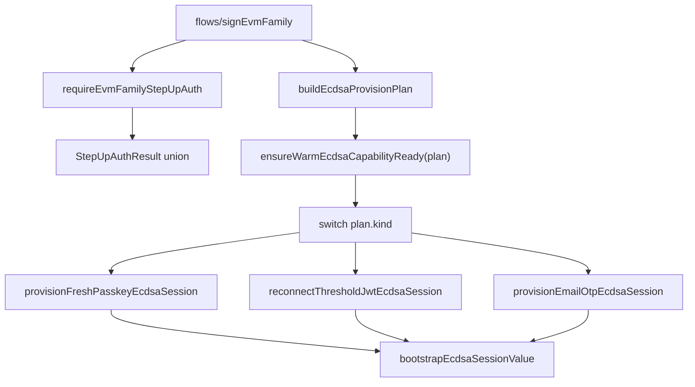

# Refactor 36: Narrow Lifecycle State Types

Date created: 2026-05-09
Status: draft

## Purpose

Eliminate wide optional argument bags from signing-engine lifecycle paths.

The recent passkey ECDSA regression came from one object shape representing
multiple incompatible lifecycle routes. Fresh WebAuthn reauthorization,
threshold-session JWT reconnect, and Email OTP refresh all flowed through the
same optional fields:

- `sessionId?: string`
- `walletSigningSessionId?: string`
- `thresholdSessionAuth?: ...`
- `webauthnAuthentication?: ...`
- `clientRootShare32B64u?: string`
- `emailOtpAuthContext?: ...`

That let an invalid mixed state compile. The provisioner then had to infer route
semantics from field presence, which made stale JWT identity look eligible for a
fresh planned WebAuthn identity.

This refactor replaces those bags with discriminated lifecycle plans whose
required state is required by type.

## Goals

1. Make lifecycle route explicit before state enters `session/passkey/*` or
   `session/warmCapabilities/*`.
2. Remove optional lifecycle fields from internal provision, restore, budget,
   signing, and export state.
3. Keep optional fields only for real optional config: callbacks, UI text,
   diagnostics, cancellation hooks, feature knobs, and low-risk display data.
4. Validate raw inputs once at boundaries, then convert to exact internal
   identities and auth materials.
5. Make invalid lifecycle combinations fail at compile time.
6. Delete replaced optional-bag types after callers move.

## Lifecycle Field Rule

These fields are lifecycle state. Internal core types should require them on the
branch that uses them:

- `thresholdSessionId`
- `walletSigningSessionId`
- `thresholdSessionAuth`
- `thresholdSessionAuthToken`
- `clientRootShare32B64u`
- `webauthnAuthentication`
- `emailOtpAuthContext`
- `ecdsaThresholdKeyId`
- `signingRootId`
- `signingRootVersion`
- `participantIds`
- `chainTarget`
- `runtimePolicyScope`
- `remainingUses`
- `expiresAtMs`
- `sessionBudgetUses`
- `wallet budget status/auth`
- export/recovery identifiers and sealed-record restore metadata

If a branch cannot proceed without the value, the value must be required in that
branch type.

Optional fields remain acceptable for:

- callbacks such as `beforeReconnect` and `assertNotCancelled`
- UI labels, hints, and diagnostics
- override/config knobs whose absence has a real default
- raw persistence records at the storage boundary, before normalization

## Current Hotspots

### ECDSA Provisioning

Primary files:

- `client/src/core/signingEngine/session/warmCapabilities/types.ts`
- `client/src/core/signingEngine/session/passkey/ecdsaProvisioner.ts`
- `client/src/core/signingEngine/session/passkey/ecdsaBootstrapRequest.ts`
- `client/src/core/signingEngine/session/passkey/ecdsaBootstrap.ts`
- `client/src/core/signingEngine/session/passkey/ecdsaSessionProvision.ts`
- `client/src/core/signingEngine/flows/signEvmFamily/ecdsaReadiness.ts`
- `client/src/core/signingEngine/flows/signEvmFamily/signingFlowRuntime.ts`

Current wide types to retire:

- `EnsureWarmEcdsaCapabilityReadyArgs`
- `ResolveWarmEcdsaBootstrapRequestArgs`
- `WarmEcdsaBootstrapRequest`
- `ProvisionWarmEcdsaCapabilityArgs`
- any helper input that forwards the same `sessionId?`,
  `walletSigningSessionId?`, `thresholdSessionAuth?`,
  `webauthnAuthentication?`, `clientRootShare32B64u?` shape

### ECDSA Lane Selection

Primary files:

- `client/src/core/signingEngine/flows/signEvmFamily/ecdsaLanes.ts`
- `client/src/core/signingEngine/flows/signEvmFamily/ecdsaSelection.ts`
- `client/src/core/signingEngine/session/identity/selectLane.ts`
- `client/src/core/signingEngine/session/availability/readiness.ts`
- `client/src/core/signingEngine/session/availability/persistedAvailableSigningLanes.ts`

Problem shape:

- candidate material appears as `{ record?: ..., keyRef?: ... }`
- readiness state is sometimes carried as optional `record`, optional `keyRef`,
  optional selected lane, and optional budget status

Target shape:

- candidate state is a discriminated union:
  `missing`, `record_only`, `key_ref_only`, `ready_material`,
  `ready_but_budget_blocked`, `expired`, `exhausted`
- selected signing lane carries exact identity and chain target

### Budget Admission

Primary files:

- `client/src/core/signingEngine/session/budget/budget.ts`
- `client/src/core/signingEngine/session/budget/BudgetCoordinator.ts`
- `client/src/core/signingEngine/session/budget/budgetStatusReader.ts`
- `client/src/core/signingEngine/session/budget/budgetFinalizer.ts`
- `client/src/core/signingEngine/flows/signEvmFamily/thresholdAdmission.ts`
- `client/src/core/signingEngine/flows/signEvmFamily/budgetSpending.ts`

Problem shape:

- budget inputs allow optional `walletSigningSessionId`, optional target
  threshold IDs, optional target backing-material IDs, and optional trusted auth
  on one object

Target shape:

- zero-spend, wallet-budget spend, and threshold-budget status checks are
  separate branch types
- wallet-budget spend requires wallet identity and target threshold session IDs
- trusted status auth is required on the branch that uses authenticated status

### Server Threshold Session Status

Primary files:

- `server/src/router/express/routes/sessions.ts`
- `server/src/router/cloudflare/routes/sessions.ts`
- `server/src/threshold/session/signingSessionSeal/policy/sessionPolicy.ts`
- `server/src/threshold/session/signingSessionSeal/types.ts`
- `server/src/threshold/session/signingSessionSeal/service.ts`

Problem shape:

- `/session/signing-budget/status` historically accepted a
  `thresholdSessionId` and looked up generic session status
- passkey login can create matching `threshold-login-*` IDs in Ed25519 and ECDSA
  session stores
- generic status lookup can select the wrong curve row unless the request carries
  curve-bound verified auth and curve-specific status expectations

Target shape:

- request-boundary JWT parsing returns a verified curve-specific auth branch
- ECDSA status requests require ECDSA auth claims and ECDSA store material
- Ed25519 status requests require Ed25519 auth claims and Ed25519 store material
- wrong-curve auth/status combinations are rejected with `never` fields before
  route code can call a generic lookup

### Sealed Recovery

Primary files:

- `client/src/core/signingEngine/session/sealedRecovery/types.ts`
- `client/src/core/signingEngine/session/sealedRecovery/restoreCoordinator.ts`
- `client/src/core/signingEngine/session/passkey/*Recovery.ts`
- `client/src/core/signingEngine/session/emailOtp/*Recovery.ts`
- `client/src/core/signingEngine/session/persistence/sealedSessionStore.ts`

Problem shape:

- persisted records are raw and partial by nature, which is fine at the storage
  boundary
- some restored internal states still preserve optional lifecycle fields after
  normalization

Target shape:

- persistence boundary returns normalized discriminated restore records
- passkey and Email OTP restore branches require their method-specific restore
  metadata before core restore logic runs

### Step-Up Results

Primary files:

- `client/src/core/signingEngine/stepUpConfirmation/requireStepUpAuth.ts`
- `client/src/core/signingEngine/stepUpConfirmation/types.ts`
- `client/src/core/signingEngine/flows/signEvmFamily/requireEvmFamilyStepUpAuth.ts`
- `client/src/core/signingEngine/flows/signNear/requireNearStepUpAuth.ts`

Problem shape:

- method result payloads can still be forwarded into lower session code as
  broad optional auth fields

Target shape:

- step-up returns exact method authorization branches
- ECDSA flow converts those branches into exact ECDSA provision plans

## Canonical Types

Create a small set of canonical lifecycle types under:

```text
client/src/core/signingEngine/session/identity/
  ecdsaSessionIdentity.ts

client/src/core/signingEngine/session/warmCapabilities/
  ecdsaProvisionPlan.ts
```

### ECDSA Session Identity

```ts
export type EcdsaSessionIdentity = {
  thresholdSessionId: string;
  walletSigningSessionId: string;
};
```

Construction should happen through a boundary helper:

```ts
export function toEcdsaSessionIdentity(input: {
  thresholdSessionId: unknown;
  walletSigningSessionId: unknown;
}): EcdsaSessionIdentity;
```

Internal code should accept `EcdsaSessionIdentity`, not sibling
`sessionId?: string` and `walletSigningSessionId?: string` fields.

### ECDSA Key Context

```ts
export type EcdsaKeyContext = {
  ecdsaThresholdKeyId: string;
  signingRootId: string;
  signingRootVersion: string;
  participantIds: readonly number[];
};
```

If some routes genuinely lack signing-root data today, model that as a separate
branch such as `registration_key_context` or `legacy_missing_signing_root` only
while migrating. Delete the branch before this refactor is complete.

### ECDSA Provision Plan

```ts
export type EcdsaProvisionPlan =
  | FreshPasskeyWebAuthnEcdsaProvision
  | ThresholdJwtEcdsaReconnect
  | EmailOtpEcdsaProvision;
```

```ts
export type FreshPasskeyWebAuthnEcdsaProvision = {
  kind: 'fresh_passkey_webauthn';
  subjectId: WalletSubjectId;
  chainTarget: ThresholdEcdsaChainTarget;
  plannedIdentity: EcdsaSessionIdentity;
  keyContext: EcdsaKeyContext;
  clientRootShare32B64u: string;
  webauthnAuthentication: WebAuthnAuthenticationCredential;
  runtimePolicyScope: ThresholdRuntimePolicyScope;
  sessionBudgetUses: number;
  thresholdSessionAuth?: never;
  emailOtpAuthContext?: never;
};
```

```ts
export type ThresholdJwtEcdsaReconnect = {
  kind: 'threshold_jwt_reconnect';
  subjectId: WalletSubjectId;
  chainTarget: ThresholdEcdsaChainTarget;
  existingIdentity: EcdsaSessionIdentity;
  keyContext: EcdsaKeyContext;
  thresholdSessionAuth: VerifiedThresholdSessionAuth;
  sessionBudgetUses: number;
  webauthnAuthentication?: never;
  emailOtpAuthContext?: never;
};
```

```ts
export type EmailOtpEcdsaProvision = {
  kind: 'email_otp';
  subjectId: WalletSubjectId;
  chainTarget: ThresholdEcdsaChainTarget;
  plannedIdentity: EcdsaSessionIdentity;
  keyContext: EcdsaKeyContext;
  emailOtpAuthContext: ThresholdEcdsaEmailOtpAuthContext;
  clientRootShare32B64u: string;
  runtimePolicyScope: ThresholdRuntimePolicyScope;
  sessionBudgetUses: number;
  webauthnAuthentication?: never;
  thresholdSessionAuth?: never;
};
```

### Verified Threshold Auth

Decode threshold-session JWTs at the boundary and carry the verified curve,
identity, and session-store expectations:

```ts
export type VerifiedThresholdSessionAuth =
  | VerifiedEcdsaThresholdSessionAuth
  | VerifiedEd25519ThresholdSessionAuth;

export type VerifiedEcdsaThresholdSessionAuth = {
  kind: 'threshold_session';
  curve: 'ecdsa';
  jwt: string;
  identity: EcdsaSessionIdentity;
  ecdsaThresholdKeyId: string;
  relayerKeyId: string;
  expiresAtMs: number;
  ed25519RelayerKeyId?: never;
};

export type VerifiedEd25519ThresholdSessionAuth = {
  kind: 'threshold_session';
  curve: 'ed25519';
  jwt: string;
  thresholdSessionId: string;
  walletSigningSessionId: string;
  ed25519RelayerKeyId: string;
  expiresAtMs: number;
  ecdsaThresholdKeyId?: never;
};
```

`threshold_jwt_reconnect` should require `VerifiedEcdsaThresholdSessionAuth`,
and its constructor should only return the plan when `auth.identity` equals
`existingIdentity`.

### Server Budget Status Request

The server budget-status route should parse raw request/JWT state once and
convert it into a curve-bound request:

```ts
export type SigningBudgetStatusRequest =
  | EcdsaSigningBudgetStatusRequest
  | Ed25519SigningBudgetStatusRequest;

export type EcdsaSigningBudgetStatusRequest = {
  kind: 'ecdsa_wallet_budget_status';
  auth: VerifiedEcdsaThresholdSessionAuth;
  identity: EcdsaSessionIdentity;
  walletSigningSessionId: string;
  thresholdSessionId: string;
  ecdsaThresholdKeyId: string;
  ed25519RelayerKeyId?: never;
};

export type Ed25519SigningBudgetStatusRequest = {
  kind: 'ed25519_wallet_budget_status';
  auth: VerifiedEd25519ThresholdSessionAuth;
  walletSigningSessionId: string;
  thresholdSessionId: string;
  ed25519RelayerKeyId: string;
  ecdsaThresholdKeyId?: never;
};
```

The route should switch on `request.kind` and call a curve-specific selector.
Generic `getSessionStatus(thresholdSessionId)` may remain as a low-level store
primitive, but route-level status resolution should consume a typed request that
cannot mix ECDSA JWT claims with Ed25519 session-store material.

## Target Call Graph



Only `buildEcdsaProvisionPlan` should translate from operation result state into
session provisioning state.

## Import Direction Contract

| From | May import | Must not import |
| --- | --- | --- |
| `flows/signEvmFamily/*` | `stepUpConfirmation` result types, `session/warmCapabilities/ecdsaProvisionPlan`, `session/SigningSessionCoordinator` | `session/passkey/ecdsaProvisioner` internals, raw bootstrap request helpers |
| `stepUpConfirmation/*` | method prompt/result types | `session/warmCapabilities/*`, `session/passkey/*`, `flows/*` |
| `session/warmCapabilities/*` | canonical identity/provision-plan types, generic warm read model, injected method ports | `flows/*`, `stepUpConfirmation/*`, raw operation prompt types |
| `session/passkey/*` | passkey provision branch types, WebAuthn auth material, sealed recovery ports | `flows/*`, Email OTP implementation |
| `session/emailOtp/*` | Email OTP provision branch types, Email OTP worker/session ports | `flows/*`, passkey implementation |
| `session/budget/*` | canonical wallet/threshold budget request branches | `flows/*`, raw selected-lane candidates |

## Phased Implementation

### Phase 1: Inventory and Guardrails

- [ ] Add an inventory section to this plan with every type that carries
  optional lifecycle fields.
- [ ] Add a targeted architecture guard for new optional lifecycle fields in:
  - `session/warmCapabilities/types.ts`
  - `session/passkey/*`
  - `session/emailOtp/*`
  - `session/budget/*`
  - `flows/signEvmFamily/*`
- [ ] Add a server architecture guard for route/request types under:
  - `server/src/router/*/routes/sessions.ts`
  - `server/src/threshold/session/signingSessionSeal/*`
- [ ] Allowlisted optional fields must be config/UI/callback fields only.
- [ ] Document every temporary allowlist entry with the phase that deletes it.

Exit criteria:

- guard fails when a new `sessionId?: string`,
  `walletSigningSessionId?: string`, `thresholdSessionAuth?:`,
  `webauthnAuthentication?:`, or `clientRootShare32B64u?:` is added to an
  internal lifecycle type
- server guard fails when budget/status route code accepts a generic
  `thresholdSessionId` without a curve-bound auth branch
- current allowlist is explicit and finite

### Phase 2: Canonical Identity Types

- [ ] Add `EcdsaSessionIdentity`.
- [ ] Add boundary constructors for:
  - planned identity from policy/session creation
  - existing identity from selected key ref/record
  - verified identity from decoded threshold-session JWT
- [ ] Replace sibling identity fields in local ECDSA readiness/provisioning
  helpers with `EcdsaSessionIdentity`.
- [ ] Keep raw string parsing only in constructors and request-boundary files.

Exit criteria:

- no internal ECDSA provision helper accepts separate optional
  `sessionId`/`walletSigningSessionId`
- mismatched single-field identity fails at construction

### Phase 3: ECDSA Provision Plan Union

- [ ] Add `EcdsaProvisionPlan`.
- [ ] Add `FreshPasskeyWebAuthnEcdsaProvision`.
- [ ] Add `ThresholdJwtEcdsaReconnect`.
- [ ] Add `EmailOtpEcdsaProvision`.
- [ ] Move route selection out of `ensureWarmEcdsaCapabilityReady` into
  `buildEcdsaProvisionPlan`.
- [ ] Make `ensureWarmEcdsaCapabilityReady` accept `EcdsaProvisionPlan`.
- [ ] Split narrow provision functions:
  - `provisionFreshPasskeyEcdsaSession`
  - `reconnectThresholdJwtEcdsaSession`
  - `provisionEmailOtpEcdsaSession`

Exit criteria:

- passkey fresh WebAuthn plan cannot carry `thresholdSessionAuth`
- threshold JWT reconnect plan cannot carry `webauthnAuthentication`
- Email OTP plan cannot carry passkey WebAuthn auth
- provisioner switches on `plan.kind`

### Phase 4: Remove ECDSA Bootstrap Optional Bags

- [ ] Replace `ResolveWarmEcdsaBootstrapRequestArgs` with branch-specific
  bootstrap inputs.
- [ ] Replace `WarmEcdsaBootstrapRequest` with a normalized union.
- [ ] Replace `ProvisionWarmEcdsaCapabilityArgs` with
  `EcdsaProvisionPlan` plus explicit config fields.
- [ ] Delete helper logic that infers route from optional auth fields.
- [ ] Remove compatibility forwarding of old optional shapes.

Exit criteria:

- `session/passkey/ecdsaBootstrapRequest.ts` either disappears or exports only
  branch-specific builders
- route selection uses discriminants instead of `Boolean(field)` checks
- old optional bootstrap types are deleted

### Phase 5: EVM-Family Vertical Slice

- [ ] Convert `flows/signEvmFamily/signingFlowRuntime.ts` to build a
  `FreshPasskeyWebAuthnEcdsaProvision` after passkey step-up.
- [ ] Convert Email OTP signing refresh to build `EmailOtpEcdsaProvision`.
- [ ] Convert exact reconnect path to build `ThresholdJwtEcdsaReconnect`.
- [ ] Update `ecdsaReadiness.ts`, `thresholdAdmission.ts`, and
  `budgetSpending.ts` to consume narrowed state.
- [ ] Delete optional-field bridge code after the EVM-family slice compiles.

Exit criteria:

- Tempo and EVM signing use the same provision-plan union
- fresh passkey, Email OTP, and threshold JWT reconnect each have one typed path
- no EVM-family call site passes raw optional lifecycle fields into session code

### Phase 6: Budget Branch Types

- [ ] Define budget request branches:
  - `NoBudgetSpend`
  - `WalletBudgetSpend`
  - `ThresholdBudgetStatusCheck`
  - `BudgetFinalizationSpend`
- [ ] Define server budget-status request branches:
  - `EcdsaSigningBudgetStatusRequest`
  - `Ed25519SigningBudgetStatusRequest`
- [ ] Require wallet identity on wallet-budget branches.
- [ ] Require target threshold IDs on branches that query scoped status.
- [ ] Require trusted status auth on authenticated status branches.
- [ ] Require curve-bound verified auth on server budget-status branches.
- [ ] Use `never` fields to reject ECDSA auth with Ed25519 status material and
  Ed25519 auth with ECDSA status material.
- [ ] Update `BudgetCoordinator` and `budget.ts` to accept the union.
- [ ] Update Express and Cloudflare session routes to switch on the typed server
  budget-status request.
- [ ] Delete optional target-array inputs from internal budget APIs.

Exit criteria:

- wallet budget admission cannot compile without wallet signing-session identity
- scoped status check cannot compile without target IDs
- zero-spend cannot accidentally carry spend identity
- server signing-budget status cannot compile with ambiguous curve lookup
- ECDSA status cannot compile with Ed25519 relayer material
- Ed25519 status cannot compile with ECDSA threshold-key material

### Phase 7: Lane Candidate States

- [ ] Replace `{ record?: ..., keyRef?: ... }` candidate material with a union:
  - `missing`
  - `record_only`
  - `key_ref_only`
  - `ready_material`
  - `ready_but_budget_blocked`
  - `expired`
  - `exhausted`
- [ ] Require exact identity and chain target on selected ready lanes.
- [ ] Move debug-only optional material into a separate diagnostics object.
- [ ] Update selection diagnostics to log the union state.

Exit criteria:

- signing selection cannot return a selected lane without identity
- readiness failure reasons are discriminated states
- diagnostics no longer double as lifecycle state

### Phase 8: Sealed Recovery Normalization

- [ ] Keep raw optional persistence records only inside
  `session/persistence/*`.
- [ ] Convert raw records to normalized `SealedRecoveryRecord` branches before
  restore orchestration.
- [ ] Require passkey restore metadata on passkey branches.
- [ ] Require Email OTP restore metadata on Email OTP branches.
- [ ] Remove optional lifecycle fields from restored internal session results.

Exit criteria:

- `restoreCoordinator.ts` consumes normalized branches
- method recovery files never receive partial sealed-record lifecycle state
- missing restore metadata fails at persistence-boundary normalization

### Phase 9: Step-Up Result Tightening

- [ ] Audit `StepUpAuthResult` and method runner results.
- [ ] Ensure each method result contains only method-specific authorization.
- [ ] Add ECDSA provision-plan builders from step-up result branches.
- [ ] Make operation flows depend on builders, not raw prompt/auth payloads.
- [ ] Keep future methods extensible by adding new result branches, not new
  optional auth fields.

Exit criteria:

- `requireStepUpAuth` result cannot be passed directly as a loose provision
  request
- every method-specific result maps through a typed builder

### Phase 10: Delete Old Types and Guards

- [ ] Delete `EnsureWarmEcdsaCapabilityReadyArgs`.
- [ ] Delete `ResolveWarmEcdsaBootstrapRequestArgs`.
- [ ] Delete `WarmEcdsaBootstrapRequest`.
- [ ] Delete `ProvisionWarmEcdsaCapabilityArgs`.
- [ ] Delete temporary allowlist entries from the optional-lifecycle guard.
- [ ] Update docs and READMEs with the new provision-plan call graph.

Exit criteria:

- `rg "sessionId\\?:|walletSigningSessionId\\?:|thresholdSessionAuth\\?:|webauthnAuthentication\\?:|clientRootShare32B64u\\?:" client/src/core/signingEngine` returns only approved boundary/config cases
- TypeScript rejects mixed passkey/JWT/Email OTP provision states
- EVM-family passkey and Email OTP signing compile through branch-specific
  provision plans

## Compile-Time Enforcement

Use these TypeScript patterns consistently:

1. Discriminated unions for lifecycle state.
2. `never` fields to reject invalid auth combinations.
3. Required identity objects instead of sibling optional strings.
4. Boundary constructors for raw inputs.
5. Exhaustive `switch` with `assertNever`.
6. Separate diagnostics objects from lifecycle objects.

Example:

```ts
type InvalidMixedProvision = FreshPasskeyWebAuthnEcdsaProvision & {
  thresholdSessionAuth: VerifiedThresholdSessionAuth;
};
```

The above should be impossible because `thresholdSessionAuth?: never` exists on
the fresh passkey branch.

Server-side curve mismatch guard:

```ts
const invalidStatusRequest: EcdsaSigningBudgetStatusRequest = {
  kind: 'ecdsa_wallet_budget_status',
  auth: verifiedEcdsaAuth,
  identity,
  walletSigningSessionId,
  thresholdSessionId,
  ecdsaThresholdKeyId,
  ed25519RelayerKeyId, // compile error
};
```

Client-side reconnect mismatch guard:

```ts
const invalidReconnect: ThresholdJwtEcdsaReconnect = {
  kind: 'threshold_jwt_reconnect',
  subjectId,
  chainTarget,
  existingIdentity,
  keyContext,
  thresholdSessionAuth: verifiedEcdsaAuth,
  sessionBudgetUses: 1,
  webauthnAuthentication, // compile error
};
```

## Success Metrics

- No internal lifecycle type uses optional identity, auth, restore, budget,
  signing, or export fields.
- ECDSA provisioning route is selected once and encoded as
  `EcdsaProvisionPlan.kind`.
- `ensureWarmEcdsaCapabilityReady` has no route inference based on optional
  auth-field presence.
- Tempo and EVM share the same ECDSA provision-plan path.
- Passkey fresh reauth cannot compile with threshold JWT auth.
- Threshold JWT reconnect cannot compile with WebAuthn auth.
- Email OTP provisioning cannot compile with passkey WebAuthn auth.
- Server budget-status requests cannot compile with wrong-curve auth/store
  material.
- Server budget-status route switches on a discriminated request instead of
  resolving status from a bare `thresholdSessionId`.
- Raw optional persistence shapes remain isolated to `session/persistence/*`.
- Architecture guard blocks new internal lifecycle optional fields.

## Validation Strategy

Do not start with broad regression tests for behavior still moving. Validate each
phase with the cheapest check that catches the intended failure mode:

- TypeScript compile after every type migration phase.
- Architecture guard after each deletion phase.
- Targeted runtime manual checks after EVM-family slice:
  - passkey Tempo direct after unlock
  - passkey EVM direct after unlock
  - passkey Tempo after session exhaustion and step-up
  - passkey EVM after session exhaustion and step-up
  - Email OTP Tempo direct and after step-up
  - Email OTP EVM direct and after step-up
- Add regression tests only after the user confirms the typed path fixes the
  runtime behavior.
