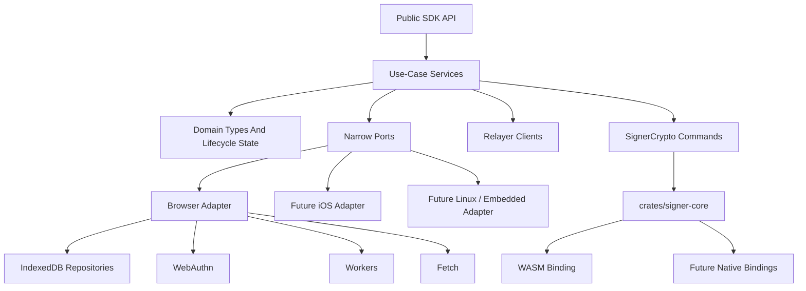

# Refactor 51: Correct Cross-Platform Architecture

Date created: 2026-05-31
Status: accepted canonical plan; implementation complete through Phase 10
Owner: SDK architecture

## Purpose

This plan defines the long-term architecture for cross-platform SDK readiness.
It supersedes `docs/refactor-50-cross-platform.md`. The original plan remains
useful as implementation history and live codebase context. This V2 plan starts
from the desired architecture and then defines a migration path that preserves
current browser behavior while moving toward that architecture.

The priority is long-term correctness, narrow domain contracts, and portable
cryptographic boundaries. Short-term compatibility is allowed only at explicit
persistence and request boundary parsers, with a deletion trigger attached to
each compatibility path.

This document is intended to be implementation-ready. If an engineer finds an
unresolved choice while implementing, the next action is to update this document
with the chosen contract before changing code.

`docs/intended-behaviours.md` is the source-of-truth UX and product-behavior
contract for passkey and Email OTP wallets. This architecture plan defines how
the SDK is structured; it does not override the intended behavior contract. When
a phase touches registration, unlock, signing, step-up, export, session restore,
lane selection, or budget handling, the phase must cite the affected
`docs/intended-behaviours.md` rows and preserve them with tests or an explicit
manual verification note.

## Status And Authority

- Draft: this file may change during architecture review.
- Accepted: this file is the canonical architecture plan for cross-platform SDK
  readiness. `docs/refactor-50-cross-platform.md` becomes historical context.
- Implementing: code phases are in progress against this file.
- Complete: all final target-state checks pass and compatibility branches listed
  in the compatibility register are deleted or converted into new accepted work.

Phase work must cite this document in PR descriptions. If code diverges from a
contract in this document, update this document first in the same commit series.

## Goals

- Make `crates/signer-core` the source of truth for signer command schemas,
  crypto validation, protocol state transitions, opaque blob encoding, and
  signer command error taxonomy.
- Keep TypeScript focused on SDK workflow orchestration, UI/session policy,
  relayer routing, persistence routing, and platform adapter selection.
- Keep platform APIs behind narrow adapter ports.
- Keep browser behavior stable during migration.
- Establish a current function, type, record, route, worker-message, and test
  inventory before code movement starts.
- Preserve the intended UX contract in `docs/intended-behaviours.md` throughout
  the migration.
- Make invalid lifecycle, identity, auth, session, signing, export, and restore
  states unrepresentable in TypeScript and Rust-facing schemas.
- Store versioned domain records and opaque signer state blobs. Core SDK logic
  must not read raw storage shapes or crypto-internal share fields.
- Add a conformance suite that the browser adapter passes now and future iOS or
  Linux adapters must pass before release.
- Delete obsolete compatibility paths after each replacement lands.

## Non-Goals

- Public iOS SDK, Android SDK, React Native SDK, Node-only SDK, Cloudflare Worker
  SDK, or embedded SDK release in this refactor.
- Broad IndexedDB schema redesign beyond records touched by signer/session
  migration.
- Rewriting current browser UI flows for their own sake.
- One-for-one wrapping of every existing worker message.
- Long-lived dual implementation paths.

## Relationship To Refactor 50

The existing plan is an incremental extraction plan for the current browser SDK.
This V2 plan keeps the useful pieces from that work:

- typed platform ports
- signer crypto command/result envelopes
- branded secret-source builders
- opaque ECDSA pending and ready blobs
- boundary parsers for raw persistence/request data
- guard tests for platform leakage and raw HSS fields

V2 changes the center of gravity:

- Rust command schemas become canonical before broad TypeScript call-site
  migration.
- The V1 inventory is treated as a seed and refreshed into an exact
  implementation inventory before code movement starts.
- Use-case services receive narrow ports rather than the full
  `PlatformRuntime`.
- Domain records and lifecycle unions are specified before storage adapter
  rewrites.
- Compatibility paths require deletion triggers and guard tests from the start.

Refactor 50 to 51 mapping:

| Refactor 50 area                                                      | Refactor 51 continuation                                                                                                                                                                     |
| --------------------------------------------------------------------- | -------------------------------------------------------------------------------------------------------------------------------------------------------------------------------------------- |
| Phases 0-2: inventory, platform contracts, browser adapter groundwork | Platform-contract groundwork is kept. Refactor 51 Phase -1 refreshes the inventory with exact functions, types, records, routes, worker messages, and regression tests before guard locking. |
| Phase 3: ECDSA persistence/key-ref cleanup                            | Continues as V2 Phases 3-4: exact domain records, lifecycle unions, and ECDSA persistence boundary normalization.                                                                            |
| Phase 4: prepare/finalize signer operation boundary                   | Formalized by V2 Phase 2 schema generation and V2 Phase 6 signer-core command migration.                                                                                                     |
| Phase 5: platform-neutral secret sources                              | Folded into V2 domain rules, secret-source builders, and `ProvisionEcdsaUseCase`.                                                                                                            |
| Phase 6: signer-core/WASM coarse ECDSA bootstrap command              | Becomes V2 Phase 6 with generated schemas, signer-core ownership, and parity/deletion gates.                                                                                                 |
| Phase 7-8: state-machine/native-readiness work                        | Moves after V2 conformance tests, use-case services, and compatibility deletion.                                                                                                             |

## Terminology

- Adapter: a module that calls browser, native, worker, storage, or network APIs.
- Boundary parser: the only function that accepts raw external data for a domain.
- Core domain logic: TypeScript or Rust code that receives parsed domain types and
  implements workflow or protocol decisions.
- Core-facing port: a dependency interface used by a use-case service or domain
  module.
- Compatibility branch: a parser branch that accepts a legacy storage, request,
  or worker shape during migration.
- Generated schema: a committed TypeScript type file produced from Rust command
  structs.
- Opaque blob: a versioned envelope TypeScript can store and route without
  decoding the internal payload.
- Public facts: non-secret identity and routing values extracted from validated
  signer state.
- Use-case service: an operation-oriented module that combines narrow ports,
  relayer clients, and lifecycle state transitions for one SDK workflow.

## Target Layering



## Canonical File Layout

Use these locations unless a phase updates this table first.

| Area                                      | Canonical location                                                           |
| ----------------------------------------- | ---------------------------------------------------------------------------- |
| Platform contracts                        | `client/src/core/platform/types.ts`                                          |
| Implementation inventory                  | `docs/refactor-50-cross-platform-inventory.md`                               |
| Generated signer-core TS command schemas  | `client/src/core/platform/generated/signerCoreCommands.ts`                   |
| Signer-core command adapters              | `client/src/core/platform/signerCoreCommandAdapters.ts`                      |
| Browser platform adapter                  | `client/src/core/platform/browser/createBrowserPlatformRuntime.ts`           |
| Browser adapter conformance tests         | `tests/unit/platformAdapter.conformance.unit.test.ts`                        |
| Cross-platform guard tests                | `tests/unit/refactor5xCrossPlatform.guard.unit.test.ts`                      |
| ECDSA persistence parser canonical target | `client/src/core/signingEngine/session/persistence/ecdsaRoleLocalRecords.ts` |
| ECDSA use case                            | `client/src/core/signingEngine/useCases/provisionEcdsa.ts`                   |
| Signing-session activation use case       | `client/src/core/signingEngine/useCases/activateSigningSession.ts`           |
| Export use case                           | `client/src/core/signingEngine/useCases/exportKeys.ts`                       |
| Signer-core command modules               | `crates/signer-core/src/commands/`                                           |
| Signer-core schema export test            | `crates/signer-core/tests/export_typescript_schemas.rs`                      |
| WASM signer command binding               | `wasm/hss_client_signer/src/commands.rs`                                     |

Rules:

- Generated files have a header saying they are generated and must not be edited
  by hand.
- Target files in this table may be absent before their owner phase starts. The
  owner phase creates them and updates the inventory row in the same commit.
- Use-case services live under `client/src/core/signingEngine/useCases/`.
- Existing flow modules may call use-case services during migration. New domain
  logic goes into use-case services or domain modules.
- A new directory requires a one-line entry in this table before implementation.
- The current ECDSA parser lives at
  `client/src/core/platform/ecdsaRoleLocalRecords.ts`. Phase 4 moves it to the
  canonical persistence parser target above. A temporary re-export is allowed only
  for the same Phase 4 commit series, with an owner comment and deletion trigger.

## Ownership Rules

### Rust Signer Core Owns

- signer command input and output schemas
- deterministic protocol validation
- derivation labels and salts
- threshold participant validation
- key-domain validation
- crypto/protocol error codes
- private share handling
- pending and ready opaque signer state encoding
- public fact extraction from validated signer state
- command parity vectors

### TypeScript Domain Owns

- public SDK workflow sequencing
- use-case lifecycle state
- relayer route selection and request auth
- UI prompt and retry policy
- platform adapter selection
- persistence routing
- public facts needed for indexes, routing, display, and export policy

### Platform Adapters Own

- IndexedDB, Keychain, SQLite, filesystem, or daemon storage calls
- WebAuthn, AuthenticationServices, FIDO2, TPM, or secure enclave calls
- Worker, native binding, or local daemon invocation mechanics
- fetch/native HTTPS/local daemon transport
- platform error normalization

### Boundary Parsers Own

- raw DB record normalization
- request/response compatibility shapes
- decoded token shapes
- worker frame parsing
- UI prompt result parsing

Compatibility code stays in these boundary parsers. Core domain logic receives
precise internal types only.

## Architectural Rules

1. `PlatformRuntime` is assembly-only.
   It is created only in browser SDK assembly code, then decomposed into narrow
   ports. Domain modules and use-case services receive only the specific ports
   they need.

2. Every core-facing function takes the narrowest valid state.
   Use-case functions accept typed lifecycle branches, branded identities, and
   exact secret-source branches.

3. Raw input crosses one boundary.
   DB records, route bodies, worker responses, credentials, decoded tokens, and
   UI prompt outputs are parsed once at their boundary and converted to internal
   types immediately.

4. Private and protocol-internal material stays opaque to TypeScript.
   TypeScript may store opaque blobs and route public facts. It must not inspect
   or construct private shares, mapped shares, protocol driver state, or signer
   root material.

5. Compatibility must expire.
   Every compatibility parser branch has an owner phase, a deletion trigger, and
   a guard test that fails once the branch is scheduled for deletion.

6. Schema drift is a build failure.
   Rust command schemas and TypeScript command types must be generated from a
   single source or verified by parity/type tests.

7. Unsupported platform capabilities fail explicitly.
   Future iOS/Linux branches are represented as typed unsupported errors in the
   browser adapter until implemented.

8. Guard tests protect architectural boundaries.
   A completed phase is incomplete if source guards cannot detect regression.

## Core Domain Model

### Identity Brands

Use branded or opaque types for all identity values:

- `WalletId`
- `RpId`
- `WalletSessionUserId`
- `EmailOtpAuthSubjectId`
- `SignerSlot`
- `ThresholdEcdsaChainTarget`
- `EcdsaThresholdKeyId`
- `EcdsaSigningRootId`
- `EcdsaSigningRootVersion`
- `ThresholdSessionId`
- `WalletSigningSessionId`
- `SigningOperationId`
- `RestoreAttemptId`
- `RelayerKeyId`
- `CredentialIdB64u`
- `EcdsaGroupPublicKey33B64u`

Boundary parsers create these values. Domain functions do not accept raw strings
for these identities.

Required parser behavior:

- Trim string identities exactly once at the boundary.
- Reject empty strings.
- Reject provider-scoped identities where a wallet-scoped identity is required.
- Preserve case only for values whose upstream protocol is case-sensitive.
- Return a `Result`-style parser result when the caller can recover.
- Throw only inside low-level parser helpers when callers immediately convert the
  exception into a typed result.

### Shared Utility Types

```ts
type NonEmptyReadonlyArray<T> = readonly [T, ...T[]];
type PositiveInt = number & { readonly __brand: 'PositiveInt' };
type UnixTimeMs = number & { readonly __brand: 'UnixTimeMs' };
type IdempotencyKey = string & { readonly __brand: 'IdempotencyKey' };
type RelayerKeyId = string & { readonly __brand: 'RelayerKeyId' };
type Ed25519RelayerKeyId = RelayerKeyId & { readonly __curve: 'ed25519' };
type EcdsaRelayerKeyId = RelayerKeyId & { readonly __curve: 'ecdsa' };
type WarmSessionRemainingUses = number & {
  readonly __brand: 'WarmSessionRemainingUses';
};

type WarmSessionBudgetSpend = {
  kind: 'warm_session_budget_spend_v1';
  walletSigningSessionId: WalletSigningSessionId;
  spentUses: PositiveInt;
  remainingUses: WarmSessionRemainingUses;
  finalizedAtMs: UnixTimeMs;
};
```

### Chain Target Normalization

`ThresholdEcdsaChainTarget` is a precise discriminated union:

```ts
type EvmThresholdEcdsaChainTarget = {
  kind: 'evm';
  namespace: 'eip155';
  chainId: number;
  networkSlug: string;
};

type TempoThresholdEcdsaChainTarget = {
  kind: 'tempo';
  chainId: number;
  networkSlug: string;
};

type ThresholdEcdsaChainTarget = EvmThresholdEcdsaChainTarget | TempoThresholdEcdsaChainTarget;
```

Parser and builder requirements:

- `thresholdEcdsaChainTargetFromRequest(...)` parses untrusted route, public SDK,
  and iframe inputs.
- `thresholdEcdsaChainTargetFromChainFamily(...)` builds targets from internal
  chain-family config.
- `kind` must be exactly `evm` or `tempo`.
- EVM targets must carry `namespace: 'eip155'`. Boundary parsers may default a
  missing EVM namespace to `eip155`, and must reject any other namespace.
- `chainId` must be a positive safe integer.
- `networkSlug` is display/config metadata. Boundary parsers trim it and fill the
  existing default slug when absent.
- Unsupported chain families return a typed parser failure before core logic sees
  the value.
- Core ECDSA code compares chain targets by `thresholdEcdsaChainTargetsEqual(...)`
  or `thresholdEcdsaChainTargetKey(...)`, never by raw user input or object
  identity.
- `thresholdEcdsaChainTargetKey(...)` is the canonical lane, storage, and budget
  identity. It emits `evm:eip155:<chainId>` for EVM targets and
  `tempo:<chainId>` for Tempo targets.

### Secret Sources

Secret sources are branch-specific capability values:

```ts
type ClientSecretSource =
  | WebAuthnPrfFirstSecretSource
  | EmailOtpWorkerSessionSecretSource
  | SecureEnclaveWrappedSecretSource
  | Fido2HmacSecretSource;
```

Rules:

- Each branch carries a private brand and comes from a builder or boundary parser.
- Browser ECDSA bootstrap accepts only `WebAuthnPrfFirstSecretSource` and
  `EmailOtpWorkerSessionSecretSource`.
- `EmailOtpWorkerSessionSecretSource` wraps a worker-issued session handle.
- For `threshold_ecdsa_bootstrap`, the handle requires `chainTarget`.
- For `threshold_ed25519_session`, the handle forbids `chainTarget`.
- Core functions never accept `clientRootShare32`, `clientRootShare32B64u`, or
  Email OTP root-share bytes.

Required builders and parsers:

```ts
function buildWebAuthnPrfFirstSecretSource(
  input: RequiredPrfAuthenticatorSuccess,
): WebAuthnPrfFirstSecretSource;

function parseEmailOtpWorkerIssuedSessionHandle(input: unknown): EmailOtpWorkerIssuedSessionHandle;

function buildEmailOtpWorkerIssuedSessionHandle(
  input: EmailOtpWorkerIssuedSessionHandleInput,
): EmailOtpWorkerIssuedSessionHandle;

function buildEmailOtpWorkerSessionSecretSource(
  handle: EmailOtpWorkerIssuedSessionHandle,
): EmailOtpWorkerSessionSecretSource;
```

`parseEmailOtpWorkerIssuedSessionHandle(...)` rejects:

- missing `sessionId`
- missing `walletId`
- missing `rpId`
- missing `authSubjectId`
- unsupported `action`
- unsupported `operation`
- missing `chainTarget` for `threshold_ecdsa_bootstrap`
- any present `chainTarget` key for `threshold_ed25519_session`

Type fixtures must prove direct object literals, broad spreads, and `as
ClientSecretSource` casts cannot create a secret source branch outside the
allowlisted typecheck file.

### ECDSA Role-Local State

Core signing/export code consumes ready records only. Load and restore code may
return reauth-required or malformed states, but ready-only functions reject those
branches at the type level.

```ts
type EcdsaRoleLocalAuthMethod =
  | {
      kind: 'passkey';
      credentialIdB64u: CredentialIdB64u;
      rpId: RpId;
    }
  | {
      kind: 'email_otp';
      authSubjectId: EmailOtpAuthSubjectId;
    };

type EcdsaRoleLocalReadyRecord =
  | {
      kind: 'ecdsa_role_local_ready_passkey_v1';
      stateBlob: EcdsaRoleLocalReadyStateBlob;
      publicFacts: EcdsaRoleLocalPublicFacts;
      authMethod: Extract<EcdsaRoleLocalAuthMethod, { kind: 'passkey' }>;
    }
  | {
      kind: 'ecdsa_role_local_ready_email_otp_v1';
      stateBlob: EcdsaRoleLocalReadyStateBlob;
      publicFacts: EcdsaRoleLocalPublicFacts;
      authMethod: Extract<EcdsaRoleLocalAuthMethod, { kind: 'email_otp' }>;
    };

type EcdsaRoleLocalMaterialState =
  | {
      kind: 'ready';
      record: EcdsaRoleLocalReadyRecord;
    }
  | {
      kind: 'reauth_required';
      walletId: WalletId;
      rpId: RpId;
      chainTarget: ThresholdEcdsaChainTarget;
      keyHandle: string;
      authMethod: EcdsaRoleLocalAuthMethod;
      reason: 'missing_session' | 'expired_session' | 'sealed_session_unavailable';
    }
  | {
      kind: 'invalid_cleanup_required';
      cleanup: CleanupMalformedEcdsaRoleLocalRecordInput;
      reason: string;
    };
```

Boundary-only records:

```ts
type EcdsaRoleLocalBoundaryRecord =
  | {
      kind: 'ready_blob_v1';
      stateBlob: EcdsaRoleLocalReadyStateBlob;
      publicFacts: EcdsaRoleLocalPublicFacts;
      authMethod: unknown;
    }
  | {
      kind: 'current_unbranched_ready_record_v1';
      rawKind: 'ecdsa_role_local_ready_record_v1';
      stateBlob: EcdsaRoleLocalReadyStateBlob;
      publicFacts: EcdsaRoleLocalPublicFacts;
    }
  | {
      kind: 'legacy_raw_role_local_v1';
      raw: unknown;
    }
  | {
      kind: 'malformed_record_v1';
      reason: string;
      raw: unknown;
    };
```

Only the persistence boundary parser accepts `EcdsaRoleLocalBoundaryRecord`.

The parser result is:

```ts
type EcdsaRoleLocalRecordParseResult =
  | {
      ok: true;
      source:
        | 'ready_record'
        | 'current_unbranched_ready_record'
        | 'legacy_threshold_ecdsa_session_record';
      state: Extract<EcdsaRoleLocalMaterialState, { kind: 'ready' | 'reauth_required' }>;
    }
  | {
      ok: false;
      code: 'malformed_record';
      message: string;
      cleanup: CleanupMalformedEcdsaRoleLocalRecordInput;
    };
```

Parser rules:

- `ready_blob_v1` parses into a ready record or a malformed cleanup result.
- `current_unbranched_ready_record_v1` parses only with the caller's typed
  `lookup.authMethod`; the raw record cannot define or infer its own auth method.
- `legacy_raw_role_local_v1` parses only inside
  `ecdsaRoleLocalRecords.ts`.
- Current unbranched ready records whose public facts disagree with the lookup
  parse to malformed cleanup results.
- Malformed legacy rows never become best-effort ready records.
- New writes never use `legacy_raw_role_local_v1` or
  `current_unbranched_ready_record_v1`.
- Core signing/export functions accept `EcdsaRoleLocalReadyRecord` only.

### ECDSA Role-Local Public Facts

`EcdsaRoleLocalPublicFacts` has this exact shape:

```ts
type EcdsaRoleLocalPublicFacts = {
  walletId: WalletId;
  rpId: RpId;
  chainTarget: ThresholdEcdsaChainTarget;
  keyHandle: string;
  ecdsaThresholdKeyId: EcdsaThresholdKeyId;
  signingRootId: EcdsaSigningRootId;
  signingRootVersion: EcdsaSigningRootVersion;
  clientParticipantId: 1;
  relayerParticipantId: 2;
  participantIds: readonly [1, 2];
  hssClientSharePublicKey33B64u: EcdsaHssClientSharePublicKey33B64u;
  relayerPublicKey33B64u: EcdsaRelayerHssPublicKey33B64u;
  groupPublicKey33B64u: EcdsaGroupPublicKey33B64u;
  ethereumAddress: `0x${string}`;
};
```

The parser rejects records where public scalar mirrors disagree.

Public fact validation rules:

- `participantIds` must equal `[1, 2]`.
- `clientParticipantId` must equal `1`.
- `relayerParticipantId` must equal `2`.
- `hssClientSharePublicKey33B64u` must decode to a compressed SEC1 secp256k1
  public key and must use the HSS client-share key domain.
- `relayerPublicKey33B64u` must decode to a compressed SEC1 secp256k1 public key
  and must use the relayer HSS key domain.
- `groupPublicKey33B64u` must decode to a compressed SEC1 secp256k1 public key.
- `relayerPublicKey33B64u` must not equal `hssClientSharePublicKey33B64u`.
- `ethereumAddress` must match `0x` plus 40 lowercase or uppercase hex
  characters. Normalized internal records store lowercase addresses.
- `chainTarget` must be the canonical chain target produced by
  `thresholdEcdsaChainTargetFromRequest(...)` or
  `thresholdEcdsaChainTargetFromChainFamily(...)`.

### Lifecycle State Contracts

Use discriminated unions for workflow states. ECDSA provisioning uses this exact
state contract:

```ts
type EcdsaProvisioningState =
  | {
      kind: 'needs_secret_source';
      walletId: WalletId;
      rpId: RpId;
      chainTarget: ThresholdEcdsaChainTarget;
      ecdsaThresholdKeyId: EcdsaThresholdKeyId;
      signingRootId: EcdsaSigningRootId;
      signingRootVersion: EcdsaSigningRootVersion;
      authMethod: EcdsaRoleLocalAuthMethod;
    }
  | {
      kind: 'preparing_client_bootstrap';
      input: PrepareEcdsaClientBootstrapInput;
      storageKeyFacts: LoadEcdsaRoleLocalReadyRecordInput;
    }
  | {
      kind: 'awaiting_relayer_identity';
      pendingStateBlob: EcdsaRoleLocalPendingStateBlob;
      clientBootstrap: EcdsaClientBootstrapFacts;
      preparePublicFacts: EcdsaPreparePublicFacts;
      storageKeyFacts: LoadEcdsaRoleLocalReadyRecordInput;
    }
  | {
      kind: 'finalizing_ready_state';
      pendingStateBlob: EcdsaRoleLocalPendingStateBlob;
      relayerPublicIdentity: EcdsaRelayerPublicIdentity;
      storageKeyFacts: LoadEcdsaRoleLocalReadyRecordInput;
    }
  | {
      kind: 'persisting_ready_record';
      record: EcdsaRoleLocalReadyRecord;
      storageKeyFacts: LoadEcdsaRoleLocalReadyRecordInput;
    }
  | {
      kind: 'ready';
      record: EcdsaRoleLocalReadyRecord;
    }
  | {
      kind: 'failed';
      code: EcdsaProvisioningFailureCode;
      message: string;
      retryable: boolean;
    };
```

Allowed transitions:

- `needs_secret_source` -> `preparing_client_bootstrap`
- `preparing_client_bootstrap` -> `awaiting_relayer_identity`
- `awaiting_relayer_identity` -> `finalizing_ready_state`
- `finalizing_ready_state` -> `persisting_ready_record`
- `persisting_ready_record` -> `ready`
- any non-ready state -> `failed`

Provisioning lifecycle states carry `storageKeyFacts` from the normalized input.
Implementations must not reconstruct persistence identity from diagnostics,
record public facts, or raw relayer output.

The implementation must add exact lifecycle unions before moving each workflow:

- registration
- wallet unlock
- signing-session activation
- EVM/Tempo signing
- NEAR signing
- export/recovery
- persisted session restore

Each lifecycle union must define allowed transitions, terminal states, failure
codes, retryability, and type fixtures in this document before code moves onto
it.

## Port Contracts

### Assembly Rule

`createBrowserPlatformRuntime(...)` may construct this aggregate:

```ts
type PlatformRuntime = {
  kind: 'browser';
  storage: DurableRecordStore;
  secrets: SecureSecretStore;
  authenticator: AuthenticatorPort;
  signerCrypto: SignerCryptoPort;
  http: HttpTransport;
  clock: ClockPort;
  random: RandomSource;
};
```

Use-case services receive destructured narrow deps:

```ts
type EcdsaProvisioningDeps = {
  authenticator: AuthenticatorPort;
  signerCrypto: Pick<
    SignerCryptoPort,
    'prepareEcdsaClientBootstrap' | 'finalizeEcdsaClientBootstrap'
  >;
  storage: Pick<
    DurableRecordStore,
    'loadEcdsaRoleLocalReadyRecord' | 'persistEcdsaRoleLocalReadyRecord'
  >;
  relayer: EcdsaRelayerClient;
  clock: ClockPort;
};
```

### SignerCryptoPort

Signer crypto commands use `Result`-style envelopes:

```ts
type SignerCryptoResult<Ok, CommandCode extends string> =
  | { ok: true; value: Ok; failure?: never; code?: never; message?: never }
  | { ok: false; failure: 'command'; code: CommandCode; message: string; value?: never }
  | {
      ok: false;
      failure: 'invocation';
      code: SignerCryptoInvocationErrorCode;
      message: string;
      value?: never;
    };
```

Rules:

- Transport, worker, timeout, native binding, and local daemon invocation failures
  use `failure: 'invocation'`.
- Crypto validation and protocol validation failures use `failure: 'command'`.
- Worker or native binding adapters preserve core error codes.
- Boolean success/failure responses are forbidden for operations that carry
  cryptographic material, signer state, or lifecycle state.

Invocation error codes are fixed:

```ts
type SignerCryptoInvocationErrorCode =
  | 'unavailable'
  | 'worker_transport_failure'
  | 'native_binding_failure'
  | 'timeout';
```

ECDSA prepare command errors are fixed:

```ts
type PrepareEcdsaClientBootstrapErrorCode =
  | 'unsupported_secret_source'
  | 'invalid_secret_source'
  | 'invalid_context'
  | 'invalid_threshold_parameters'
  | 'invalid_public_material'
  | 'crypto_failure';
```

ECDSA finalize command errors are fixed:

```ts
type FinalizeEcdsaClientBootstrapErrorCode =
  | 'invalid_pending_state'
  | 'invalid_relayer_public_identity'
  | 'public_identity_mismatch'
  | 'crypto_failure';
```

ECDSA export command errors are fixed:

```ts
type BuildEcdsaRoleLocalExportArtifactErrorCode =
  | 'invalid_ready_state'
  | 'invalid_public_identity'
  | 'export_not_authorized'
  | 'crypto_failure';
```

Mapping rules:

| Raw source failure                     | SignerCryptoResult branch                                 |
| -------------------------------------- | --------------------------------------------------------- |
| worker timeout                         | `failure: 'invocation', code: 'timeout'`                  |
| `postMessage` failure                  | `failure: 'invocation', code: 'worker_transport_failure'` |
| malformed worker frame                 | `failure: 'invocation', code: 'worker_transport_failure'` |
| worker runtime crash                   | `failure: 'invocation', code: 'worker_transport_failure'` |
| WASM init/import/instantiation failure | `failure: 'invocation', code: 'native_binding_failure'`   |
| signer-core validation error           | `failure: 'command', code: signer-core command code`      |
| unsupported platform branch            | `failure: 'command', code: 'unsupported_secret_source'`   |

Adapter tests must cover every row.

### DurableRecordStore

The durable store is a typed domain repository:

```ts
type DurableRecordStore = {
  loadEcdsaRoleLocalReadyRecord(
    input: LoadEcdsaRoleLocalReadyRecordInput,
  ): Promise<LoadEcdsaRoleLocalReadyRecordResult>;
  persistEcdsaRoleLocalReadyRecord(
    input: PersistEcdsaRoleLocalReadyRecordInput,
  ): Promise<PersistEcdsaRoleLocalReadyRecordResult>;
  cleanupMalformedEcdsaRoleLocalRecord(
    input: CleanupMalformedEcdsaRoleLocalRecordInput,
  ): Promise<CleanupMalformedEcdsaRoleLocalRecordResult>;
};
```

Rules:

- No generic collection/key/value methods in core-facing ports.
- Browser adapter may delegate to IndexedDB repositories.
- Core receives only normalized records.
- Malformed raw records return typed cleanup decisions.

Exact result shapes:

```ts
type LoadEcdsaRoleLocalReadyRecordResult = PlatformResult<
  | { kind: 'found'; record: EcdsaRoleLocalReadyRecord }
  | { kind: 'not_found' }
  | {
      kind: 'reauth_required';
      state: Extract<EcdsaRoleLocalMaterialState, { kind: 'reauth_required' }>;
    }
  | { kind: 'malformed'; cleanup: CleanupMalformedEcdsaRoleLocalRecordInput; message: string },
  'unavailable'
>;

type PersistEcdsaRoleLocalReadyRecordResult = PlatformResult<
  { kind: 'persisted' },
  'unavailable' | 'invalid_record'
>;

type CleanupMalformedEcdsaRoleLocalRecordResult = PlatformResult<
  { kind: 'deleted' } | { kind: 'not_found' },
  'unavailable'
>;
```

`persistEcdsaRoleLocalReadyRecord(...)` rejects:

- pending state blobs
- legacy raw role-local records
- current unbranched ready records
- records missing relayer public identity
- records with participant ids other than `[1, 2]`
- records whose `stateBlob` envelope is not
  `ecdsa_role_local_state_blob_v1`
- records whose public facts disagree with the blob's public facts
- records whose auth method branch lacks its required identity fields

`loadEcdsaRoleLocalReadyRecord(...)` lookup keys are exact:

```ts
type LoadEcdsaRoleLocalReadyRecordInput = {
  walletId: WalletId;
  rpId: RpId;
  chainTarget: ThresholdEcdsaChainTarget;
  keyHandle: string;
  ecdsaThresholdKeyId: EcdsaThresholdKeyId;
  signingRootId: EcdsaSigningRootId;
  signingRootVersion: EcdsaSigningRootVersion;
  participantIds: readonly [1, 2];
  authMethod: EcdsaRoleLocalAuthMethod;
};

type PersistEcdsaRoleLocalReadyRecordInput = {
  record: EcdsaRoleLocalReadyRecord;
  storageKeyFacts: LoadEcdsaRoleLocalReadyRecordInput;
};

type CleanupMalformedEcdsaRoleLocalRecordInput = LoadEcdsaRoleLocalReadyRecordInput & {
  reason: string;
};
```

Lookup and storage-key rules:

- `authMethod.kind === 'passkey'` requires `authMethod.rpId === rpId`.
- New ready-record storage keys include the auth branch identity:
  `passkey:<rpId>:<credentialIdB64u>` or `email_otp:<authSubjectId>`.
- The previous unbranched ready-record storage key is a compatibility lookup key
  for Phase 4 through Phase 8 only.
- If both a branch-specific ready record and an unbranched current record exist,
  the branch-specific record wins. The parser reports a cleanup decision for the
  unbranched duplicate when the public facts match the branch-specific record.
- Persist and cleanup inputs carry the same `authMethod` branch used by the load
  input so cleanup cannot delete a different credential or auth subject lane.

### AuthenticatorPort

Authenticator operations are branch-specific:

- create passkey with required PRF
- create passkey with optional PRF
- get passkey with required PRF
- get passkey with optional PRF

Rules:

- Raw browser credentials normalize inside the browser adapter.
- `requirePrfFirst: true` success always carries `prf.kind: 'required'`.
- Missing required PRF returns `prf_unavailable`.
- Core ECDSA provisioning accepts only the required PRF success branch.

Exact operation shape:

```ts
type AuthenticatorOptions = {
  userVerification?: 'required' | 'preferred' | 'discouraged';
  timeoutMs?: number;
};

type AuthenticatorOperation =
  | {
      kind: 'create_passkey';
      rpId: RpId;
      userHandleB64u: string;
      challengeB64u: string;
      requirePrfFirst: true;
      authenticatorOptions?: AuthenticatorOptions;
    }
  | {
      kind: 'create_passkey';
      rpId: RpId;
      userHandleB64u: string;
      challengeB64u: string;
      requirePrfFirst: false;
      authenticatorOptions?: AuthenticatorOptions;
    }
  | {
      kind: 'get_passkey';
      rpId: RpId;
      credentialIdB64u: CredentialIdB64u;
      challengeB64u: string;
      requirePrfFirst: true;
    }
  | {
      kind: 'get_passkey';
      rpId: RpId;
      credentialIdB64u: CredentialIdB64u;
      challengeB64u: string;
      requirePrfFirst: false;
    };
```

Exact failure codes:

```ts
type AuthenticatorFailureCode =
  | 'unavailable'
  | 'cancelled'
  | 'not_allowed'
  | 'prf_unavailable'
  | 'invalid_credential'
  | 'platform_error';
```

Normalization rules:

- `credentialIdB64u` is the base64url-encoded raw credential id.
- `rawIdB64u` is identical to `credentialIdB64u` for browser WebAuthn results.
- `rpId` is parsed into `RpId` before building a secret source.
- Required PRF output must be a non-empty base64url string that decodes to 32
  bytes.
- The browser adapter must not pass live `PublicKeyCredential` objects beyond the
  adapter boundary.

Exact success and failure shape:

```ts
type AuthenticatorOptionalPrfResult =
  | {
      kind: 'available_without_requirement';
      prfFirstB64u: string;
    }
  | {
      kind: 'not_requested_or_unavailable';
      prfFirstB64u?: never;
    };

type AuthenticatorResult =
  | {
      ok: true;
      operation: 'create_passkey';
      requirePrfFirst: true;
      credential: WebAuthnRegistrationCredential;
      credentialIdB64u: CredentialIdB64u;
      rawIdB64u: CredentialIdB64u;
      rpId: RpId;
      prf: { kind: 'required'; prfFirstB64u: string };
    }
  | {
      ok: true;
      operation: 'create_passkey';
      requirePrfFirst: false;
      credential: WebAuthnRegistrationCredential;
      credentialIdB64u: CredentialIdB64u;
      rawIdB64u: CredentialIdB64u;
      rpId: RpId;
      prf: AuthenticatorOptionalPrfResult;
    }
  | {
      ok: true;
      operation: 'get_passkey';
      requirePrfFirst: true;
      credential: WebAuthnAuthenticationCredential;
      credentialIdB64u: CredentialIdB64u;
      rawIdB64u: CredentialIdB64u;
      rpId: RpId;
      prf: { kind: 'required'; prfFirstB64u: string };
    }
  | {
      ok: true;
      operation: 'get_passkey';
      requirePrfFirst: false;
      credential: WebAuthnAuthenticationCredential;
      credentialIdB64u: CredentialIdB64u;
      rawIdB64u: CredentialIdB64u;
      rpId: RpId;
      prf: AuthenticatorOptionalPrfResult;
    }
  | {
      ok: false;
      code: AuthenticatorFailureCode;
      message: string;
    };

type RequiredPrfAuthenticatorSuccess = Extract<
  AuthenticatorResult,
  { ok: true; requirePrfFirst: true }
>;
```

Core ECDSA provisioning must narrow to a success branch whose `prf.kind` is
`required` and whose `prfFirstB64u` decodes to exactly 32 bytes before building a
`WebAuthnPrfFirstSecretSource`.

### HttpTransport

The HTTP port handles transport mechanics only. Relayer domain clients own route
shapes and auth decisions.

Rules:

- Request auth mode is explicit.
- Timeouts are explicit.
- Response parsers normalize raw route responses into domain results.
- Diagnostics do not influence control flow.

Exact request shape:

```ts
type HttpRequest = {
  method: 'GET' | 'POST';
  url: string;
  headers: Record<string, string>;
  body: { kind: 'json'; value: unknown } | { kind: 'empty' };
  auth: { kind: 'none' } | { kind: 'bearer'; token: string } | { kind: 'cookie' };
  timeoutMs: number;
};
```

Exact result shape:

```ts
type HttpTransportFailureCode = 'network_error' | 'timeout' | 'non_2xx' | 'malformed_response';

type HttpResponse = {
  status: number;
  headers: Record<string, string>;
  body: unknown;
};

type HttpTransportResult =
  | { ok: true; value: HttpResponse; code?: never; message?: never }
  | {
      ok: false;
      code: HttpTransportFailureCode;
      message: string;
      status?: number;
      body?: unknown;
      value?: never;
    };
```

The existing broad browser `fetch` wrapper must be adapted behind this shape
before any use-case service receives `HttpTransport`. Core-facing relayer clients
must receive typed route results, not raw `Response` objects or unparsed JSON.

### Relayer Clients

Relayer clients are domain adapters on top of `HttpTransport`. They own route
paths, request bodies, auth mode, response parsing, and route-specific failure
codes. Use-case services receive relayer clients, not `HttpTransport`, unless the
use case itself is a relayer-client implementation.

Common result envelope:

```ts
type RelayerResult<Ok, Code extends string> =
  | { ok: true; value: Ok; code?: never; message?: never; retryable?: never }
  | {
      ok: false;
      code: Code;
      message: string;
      retryable: boolean;
      status?: number;
      value?: never;
    };
```

Required relayer client contracts before their owning use case moves:

```ts
type EcdsaRelayerClient = {
  bootstrapEcdsaSession(
    input: BootstrapEcdsaSessionRouteInput,
  ): Promise<
    RelayerResult<BootstrapEcdsaSessionRouteOutput, BootstrapEcdsaSessionRouteFailureCode>
  >;
  exportEcdsaRoleLocalShare(
    input: ExportEcdsaRoleLocalShareRouteInput,
  ): Promise<
    RelayerResult<ExportEcdsaRoleLocalShareRouteOutput, ExportEcdsaRoleLocalShareRouteFailureCode>
  >;
  signEvmFamily(
    input: SignEvmFamilyRouteInput,
  ): Promise<RelayerResult<SignEvmFamilyRouteOutput, SignEvmFamilyRouteFailureCode>>;
};

type Ed25519RelayerClient = {
  createThresholdSession(
    input: CreateEd25519ThresholdSessionRouteInput,
  ): Promise<
    RelayerResult<
      CreateEd25519ThresholdSessionRouteOutput,
      CreateEd25519ThresholdSessionRouteFailureCode
    >
  >;
  signNear(
    input: SignNearRouteInput,
  ): Promise<RelayerResult<SignNearRouteOutput, SignNearRouteFailureCode>>;
};

type SigningSessionSealRelayerClient = {
  applyServerSeal(
    input: ApplyServerSealRouteInput,
  ): Promise<RelayerResult<ApplyServerSealRouteOutput, ApplyServerSealRouteFailureCode>>;
};

type EmailOtpRelayerClient = {
  requestChallenge(
    input: EmailOtpChallengeRouteInput,
  ): Promise<RelayerResult<EmailOtpChallengeRouteOutput, EmailOtpChallengeRouteFailureCode>>;
  verifyChallenge(
    input: EmailOtpVerifyRouteInput,
  ): Promise<RelayerResult<EmailOtpVerifyRouteOutput, EmailOtpVerifyRouteFailureCode>>;
};

type WalletRegistrationRelayerClient = {
  registerWallet(
    input: RegisterWalletRouteInput,
  ): Promise<RelayerResult<RegisterWalletRouteOutput, RegisterWalletRouteFailureCode>>;
};

type EcdsaBootstrapRouteAuth =
  | { kind: 'app_session'; jwt: string; token?: never }
  | { kind: 'threshold_session'; jwt: string; token?: never }
  | { kind: 'cookie'; jwt?: never; token?: never }
  | { kind: 'bootstrap_grant'; token: string; jwt?: never }
  | { kind: 'publishable_key'; token: string; jwt?: never };

type BootstrapEcdsaSessionRouteInput = {
  kind: 'bootstrap_ecdsa_session_route_v1';
  walletId: WalletId;
  rpId: RpId;
  chainTarget: ThresholdEcdsaChainTarget;
  keyScope: 'evm-family';
  ecdsaThresholdKeyId: EcdsaThresholdKeyId;
  signingRootId: SigningRootId;
  signingRootVersion: SigningRootVersion;
  relayerKeyId: RelayerKeyId;
  requestId: string;
  sessionId: string;
  walletSigningSessionId: string;
  ttlMs: number;
  remainingUses: number;
  sessionKind: 'jwt' | 'cookie';
  participantIds: readonly [1, 2];
  auth: EcdsaBootstrapRouteAuth;
  clientBootstrap: EcdsaClientBootstrapFacts;
  preparePublicFacts: EcdsaPreparePublicFacts;
  runtimePolicyScope?: ThresholdRuntimePolicyScope;
};

type BootstrapEcdsaSessionRouteOutput = {
  kind: 'bootstrap_ecdsa_session_route_output_v1';
  walletId: WalletId;
  rpId: RpId;
  ecdsaThresholdKeyId: EcdsaThresholdKeyId;
  signingRootId: SigningRootId;
  signingRootVersion: SigningRootVersion;
  keyHandle: string;
  relayerPublicIdentity: EcdsaRelayerPublicIdentity;
  participantIds: readonly [1, 2];
  sessionId: string;
  walletSigningSessionId: string;
  expiresAtMs: number;
  remainingUses: number;
  thresholdSessionAuthToken: string;
};

type BootstrapEcdsaSessionRouteFailureCode =
  | 'unavailable'
  | 'request_rejected'
  | 'malformed_response';
```

Before implementation, each `*RouteInput`, `*RouteOutput`, and
`*RouteFailureCode` type must be defined in the relayer client module that owns
the route. Route outputs cross into use cases only after boundary parsing.

## Rust Command Schema Ownership

### Canonical Schema Source

Signer command schemas live in Rust as structs/enums under `crates/signer-core`.
TypeScript command types are generated from Rust schemas with `ts-rs`.

Required implementation:

- Add `ts-rs` as an optional `crates/signer-core` dependency behind the
  `typescript-bindings` feature.
- Add `#[derive(TS)]` to signer command input, output, and error enums.
- Add `crates/signer-core/src/commands/mod.rs` and export it from
  `crates/signer-core/src/lib.rs` behind the feature set used by the command.
- Export generated bindings to
  `client/src/core/platform/generated/signerCoreCommands.ts`.
- Commit the generated file.
- Add `crates/signer-core/tests/export_typescript_schemas.rs` that regenerates
  the file and fails if the committed file differs.
- Add a root `package.json` script named `generate:signer-core-types`.

Manual TypeScript copies of signer-core command shapes are forbidden after Phase 2. TypeScript may wrap generated shapes with branded boundary types, but those
wrappers cannot add, remove, or rename command fields.

Phase 2 replacement rules:

- `PrepareEcdsaClientBootstrapInput`,
  `FinalizeEcdsaClientBootstrapInput`, their output types, and command error
  code unions in `client/src/core/platform/types.ts` become wrappers around the
  generated Rust schemas.
- The wrapper layer may narrow generated primitive strings into branded domain
  values only at boundary parser or builder functions.
- A type fixture must prove every wrapper is assignable to the generated command
  shape after unbranding.
- A type fixture must reject any wrapper field missing from the generated command
  shape and any generated command field missing from the wrapper.
- Guard tests reject hand-written command schema copies outside
  `client/src/core/platform/generated/`, the wrapper module, tests, and this
  document.

Required Phase 2 bootstrap schema wrapper functions:

```ts
function toGeneratedPrepareEcdsaClientBootstrapCommand(
  input: PrepareEcdsaClientBootstrapInput,
): GeneratedPrepareEcdsaClientBootstrapCommand;

function parseGeneratedPrepareEcdsaClientBootstrapOutput(
  input: GeneratedPrepareEcdsaClientBootstrapOutput,
): PrepareEcdsaClientBootstrapOutput;

function toGeneratedFinalizeEcdsaClientBootstrapCommand(
  input: FinalizeEcdsaClientBootstrapInput,
): GeneratedFinalizeEcdsaClientBootstrapCommand;

function parseGeneratedFinalizeEcdsaClientBootstrapOutput(
  input: GeneratedFinalizeEcdsaClientBootstrapOutput,
): FinalizeEcdsaClientBootstrapOutput;
```

Required Phase 7 export schema wrapper functions:

```ts
function toGeneratedBuildEcdsaRoleLocalExportArtifactCommand(
  input: BuildEcdsaRoleLocalExportArtifactInput,
): GeneratedBuildEcdsaRoleLocalExportArtifactCommand;

function parseGeneratedBuildEcdsaRoleLocalExportArtifactOutput(
  input: GeneratedBuildEcdsaRoleLocalExportArtifactOutput,
): BuildEcdsaRoleLocalExportArtifactOutput;
```

Wrapper functions live in
`client/src/core/platform/signerCoreCommandAdapters.ts`. Generated raw schemas
cross into core domain types only through these functions or through boundary
parsers that call these functions.

### First Canonical Commands

Rust modules:

```text
crates/signer-core/src/commands/mod.rs
crates/signer-core/src/commands/ecdsa_bootstrap.rs
crates/signer-core/src/commands/ecdsa_export.rs
```

Canonical Rust command names:

```rust
pub enum SignerCommandVersion {
    V1,
}

pub struct PrepareEcdsaClientBootstrapCommandV1;
pub struct PrepareEcdsaClientBootstrapOutputV1;
pub enum PrepareEcdsaClientBootstrapErrorCodeV1;

pub struct FinalizeEcdsaClientBootstrapCommandV1;
pub struct FinalizeEcdsaClientBootstrapOutputV1;
pub enum FinalizeEcdsaClientBootstrapErrorCodeV1;

pub struct BuildEcdsaRoleLocalExportArtifactCommandV1;
pub struct BuildEcdsaRoleLocalExportArtifactOutputV1;
pub enum BuildEcdsaRoleLocalExportArtifactErrorCodeV1;
```

WASM binding names:

```rust
pub fn prepare_ecdsa_client_bootstrap_v1(input_json: &str) -> Result<String, JsValue>;
pub fn finalize_ecdsa_client_bootstrap_v1(input_json: &str) -> Result<String, JsValue>;
pub fn build_ecdsa_role_local_export_artifact_v1(input_json: &str) -> Result<String, JsValue>;
```

Generated TypeScript export names must match the Rust command names without the
Rust `V1` suffix only if `ts-rs` already emits the version in the `kind` field.
Otherwise the generated names keep the `V1` suffix. The phase that first
generates each command must record the chosen generated names in this section
before implementing call-site migration.

Phase 2 generated bootstrap schema names:

| Area                                     | Phase 2 choice                                                                                                                                                                                                                                        |
| ---------------------------------------- | ----------------------------------------------------------------------------------------------------------------------------------------------------------------------------------------------------------------------------------------------------- |
| Rust schema module                       | `crates/signer-core/src/commands/ecdsa_bootstrap.rs`                                                                                                                                                                                                  |
| Rust prepare command                     | `PrepareEcdsaClientBootstrapCommandV1`                                                                                                                                                                                                                |
| Rust prepare output                      | `PrepareEcdsaClientBootstrapOutputV1`                                                                                                                                                                                                                 |
| Rust prepare error enum                  | `PrepareEcdsaClientBootstrapErrorCodeV1`                                                                                                                                                                                                              |
| Rust finalize command                    | `FinalizeEcdsaClientBootstrapCommandV1`                                                                                                                                                                                                               |
| Rust finalize output                     | `FinalizeEcdsaClientBootstrapOutputV1`                                                                                                                                                                                                                |
| Rust finalize error enum                 | `FinalizeEcdsaClientBootstrapErrorCodeV1`                                                                                                                                                                                                             |
| Generated TypeScript prepare command     | `PrepareEcdsaClientBootstrapCommand`                                                                                                                                                                                                                  |
| Generated TypeScript prepare output      | `PrepareEcdsaClientBootstrapOutput`                                                                                                                                                                                                                   |
| Generated TypeScript prepare error enum  | `PrepareEcdsaClientBootstrapErrorCode`                                                                                                                                                                                                                |
| Generated TypeScript finalize command    | `FinalizeEcdsaClientBootstrapCommand`                                                                                                                                                                                                                 |
| Generated TypeScript finalize output     | `FinalizeEcdsaClientBootstrapOutput`                                                                                                                                                                                                                  |
| Generated TypeScript finalize error enum | `FinalizeEcdsaClientBootstrapErrorCode`                                                                                                                                                                                                               |
| TypeScript wrapper aliases               | `GeneratedPrepareEcdsaClientBootstrapCommand`, `GeneratedPrepareEcdsaClientBootstrapOutput`, `GeneratedFinalizeEcdsaClientBootstrapCommand`, `GeneratedFinalizeEcdsaClientBootstrapOutput` in `client/src/core/platform/signerCoreCommandAdapters.ts` |
| Current browser WASM prepare binding     | `prepare_ecdsa_client_bootstrap_v1`; Email OTP worker-internal resolved-root adapter `prepare_ecdsa_client_bootstrap_from_resolved_email_otp_root_v1`                                                                                                |
| Current browser WASM finalize binding    | `threshold_ecdsa_hss_role_local_finalize_client_bootstrap`                                                                                                                                                                                            |

Regenerate committed schemas with `pnpm generate:signer-core-types`. The drift
test compares the committed file with Rust output when run without
`UPDATE_SIGNER_CORE_TYPES=1`.

Generated TypeScript types are adapter-facing raw command schemas. They are not
core-facing domain types. `client/src/core/platform/types.ts` owns branded
core-facing wrappers and boundary parsers.

Bootstrap command schemas land in Phase 2. Export command schemas land in Phase
7 before export call-site migration, unless Phase 2 explicitly implements and
tests the export command schema as an inert generated type.

```ts
type GeneratedThresholdEcdsaChainTarget =
  | {
      kind: 'evm';
      namespace: 'eip155';
      chainId: number;
      networkSlug: string;
    }
  | {
      kind: 'tempo';
      chainId: number;
      networkSlug: string;
    };

type PrepareEcdsaClientBootstrapCommand = {
  kind: 'prepare_ecdsa_client_bootstrap_v1';
  algorithm: 'ecdsa_hss_secp256k1_role_local_v1';
  context: {
    walletId: string;
    rpId: string;
    chainTarget: GeneratedThresholdEcdsaChainTarget;
    ecdsaThresholdKeyId: string;
    signingRootId: string;
    signingRootVersion: string;
    keyPurpose: 'evm-signing';
    keyVersion: 'v1';
  };
  participants: {
    clientParticipantId: number;
    relayerParticipantId: number;
    participantIds: number[];
  };
  secretSource:
    | {
        kind: 'webauthn_prf_first';
        prfFirstB64u: string;
        rpId: string;
        credentialIdB64u: string;
      }
    | {
        kind: 'email_otp_worker_session';
        handle: {
          kind: 'email_otp_worker_session_handle_v1';
          sessionId: string;
          walletId: string;
          rpId: string;
          authSubjectId: string;
          action: 'threshold_ecdsa_bootstrap';
          operation: 'registration' | 'wallet_unlock' | 'sign' | 'export';
          chainTarget: GeneratedThresholdEcdsaChainTarget;
        };
      };
};

type FinalizeEcdsaClientBootstrapCommand = {
  kind: 'finalize_ecdsa_client_bootstrap_v1';
  pendingStateBlob: {
    kind: string;
    curve: string;
    encoding: string;
    producer: string;
    stateBlobB64u: string;
  };
  relayerPublicIdentity: {
    relayerKeyId: string;
    relayerPublicKey33B64u: string;
    groupPublicKey33B64u: string;
    ethereumAddress: string;
  };
};

type BuildEcdsaRoleLocalExportArtifactCommand = {
  kind: 'build_ecdsa_role_local_export_artifact_v1';
  stateBlob: {
    kind: string;
    curve: string;
    encoding: string;
    producer: string;
    stateBlobB64u: string;
  };
  publicFacts: {
    walletId: string;
    rpId: string;
    chainTarget: GeneratedThresholdEcdsaChainTarget;
    keyHandle: string;
    ecdsaThresholdKeyId: string;
    signingRootId: string;
    signingRootVersion: string;
    clientParticipantId: number;
    relayerParticipantId: number;
    participantIds: number[];
    hssClientSharePublicKey33B64u: string;
    relayerPublicKey33B64u: string;
    groupPublicKey33B64u: string;
    ethereumAddress: string;
  };
  authorization:
    | {
        kind: 'passkey_export_authorized';
        walletId: string;
        credentialIdB64u: string;
      }
    | {
        kind: 'email_otp_export_authorized';
        walletId: string;
        authSubjectId: string;
      };
};
```

Rust generated schemas use unbranded primitive strings. TypeScript boundary
parsers convert generated raw strings into branded domain types before any
use-case service consumes them.

Generated command schema validation rules:

- The browser adapter may construct generated command objects only from
  core-facing branded inputs.
- `participants.clientParticipantId` must be `1`.
- `participants.relayerParticipantId` must be `2`.
- `participants.participantIds` must be `[1, 2]`.
- `stateBlob.kind`, `curve`, `encoding`, and `producer` must match the opaque
  blob envelope contract before the command is sent to Rust.
- Rust signer-core repeats these validations and returns command errors for
  violations.

The prepare command owns:

- secret-source validation
- client-root derivation
- HKDF labels
- additive share mapping
- HSS client-share public key validation
- pending state serialization
- prepare public facts

The finalize command owns:

- pending blob decoding
- relayer public identity validation
- public fact equality checks
- ready state serialization
- ready public facts

The export command owns:

- ready blob decoding
- export precondition validation
- key export artifact construction
- export-specific error codes

### Opaque Blob Envelopes

Signer-core owns internal blob payloads. TypeScript validates only the outer
envelope:

```ts
type EcdsaRoleLocalPendingStateBlob = {
  kind: 'ecdsa_role_local_pending_state_blob_v1';
  curve: 'secp256k1';
  encoding: 'base64url';
  producer: 'signer_core';
  stateBlobB64u: string;
};

type EcdsaRoleLocalReadyStateBlob = {
  kind: 'ecdsa_role_local_state_blob_v1';
  curve: 'secp256k1';
  encoding: 'base64url';
  producer: 'signer_core';
  stateBlobB64u: string;
};
```

TypeScript may decode a blob only in adapter or parity-test code before Phase 6
is complete. After Phase 6, production TypeScript must not decode
`stateBlobB64u`.

### Pre-Signer-Core Blob Compatibility

Current browser code has produced opaque envelopes with
`producer: 'signer_core'` while the inner payload was still TypeScript-owned
JSON. Known inner payload kinds:

- `browser_pending_ecdsa_role_local_state_v1`
- `browser_ready_ecdsa_role_local_state_v1`
- `legacy_threshold_ecdsa_role_local_ready_state_v1`

These payloads are compatibility data. Signer-core will not learn these
TypeScript JSON layouts.

Migration rules:

- Phase -1 inventories every production path that can create, read, or export one
  of the known TypeScript-owned payload kinds.
- Phase 4 parser tests include current ready records whose state blob contains
  each known TypeScript-owned ready payload kind.
- Phase 6 executes the in-development ECDSA role-local data reset before
  signer-core commands become the production path.
- The data reset clears TypeScript-owned ECDSA state blobs from browser durable
  storage and any in-memory persistence harnesses used by tests.
- After Phase 6, production TypeScript treats TypeScript-owned inner payload
  kinds as cleanup or reauth states. Parity tests may decode them until Phase 9.
- Phase 9 deletes all allowlists for the known TypeScript-owned payload kinds.

## Use-Case Services

Use-case services are explicit workflow boundaries. They are the only modules
that combine platform ports, relayer clients, and domain state transitions.

Initial services:

- `RegisterWalletUseCase`
- `UnlockWalletUseCase`
- `ProvisionEcdsaUseCase`
- `ActivateSigningSessionUseCase`
- `SignEvmFamilyUseCase`
- `SignNearUseCase`
- `ExportKeysUseCase`
- `RestorePersistedSessionsUseCase`

Rules:

- Each service has one dependency object with narrow ports.
- Each service exposes operation-shaped methods.
- Each method returns a `Result`-style union or a lifecycle state union.
- Services do not import browser adapters directly.
- Services do not import raw IndexedDB managers directly.
- Services do not construct raw worker requests.

### Spec Closure Before Implementation

The implementation phase that first touches an area must define every type in
that area's closure list before moving production code. If the current phase
discovers a missing contract, update this document and the inventory before
editing implementation files.

Required spec-closure areas:

| Area                           | Required exact specs before code movement                                                                                                                                                                                                         |
| ------------------------------ | ------------------------------------------------------------------------------------------------------------------------------------------------------------------------------------------------------------------------------------------------- |
| Lifecycle unions               | Exact union, allowed-transition table, terminal states, retryable failure states, and type fixtures for registration, wallet unlock, signing-session activation, EVM/Tempo signing, NEAR signing, export/recovery, and persisted session restore. |
| Shared ECDSA domain types      | `EcdsaClientBootstrapFacts`, `EcdsaPreparePublicFacts`, `EcdsaRelayerPublicIdentity`, `EcdsaProvisioningFailureCode`, and `EcdsaRelayerClient`.                                                                                                   |
| Use-case contracts             | `Deps`, `Input`, `Result`, failure-code union, idempotency/retry policy, persistence writes, relayer calls, and baseline tests for every use case moved in the phase.                                                                             |
| Export API                     | Exact `ExportKeysResult`, per-key artifact branches, all-or-nothing behavior, authorization branches, export-viewer handoff, and partial-failure rejection rules.                                                                                 |
| Session activation and sealing | Exact passkey vs Email OTP input branches, exact Ed25519 vs ECDSA material branches, exact sealed-session write input, restore result union, and stale-session cleanup behavior.                                                                  |
| Relayer clients                | Exact route input, route output, auth mode, route failure codes, parser location, and retryability for every relayer route used by the phase.                                                                                                     |
| Rust command structs           | Exact Rust module path, struct names, enum names, `ts-rs` export names, WASM binding names, and command error mapping for each signer-core command.                                                                                               |
| HTTP transport                 | Exact request/result shape, non-2xx behavior, timeout behavior, malformed response behavior, and transport failure mapping.                                                                                                                       |
| Authenticator results          | Exact create/get success branches, required vs optional PRF result branches, normalized credential id fields, and failure-code mapping.                                                                                                           |
| Chain target normalization     | Exact `ThresholdEcdsaChainTarget` union, parser names, accepted `evm`/`tempo` values, EVM `eip155` namespace rules, `chainId` rules, `networkSlug` metadata rules, canonical key format, and rejection rules.                                     |
| Storage serialization          | Exact persisted wire shape, storage-key format, auth-method identity fields, cleanup/delete semantics, and migration lookup order.                                                                                                                |
| Schema wrappers                | Exact generated-to-branded and branded-to-generated adapter functions, allowed parser locations, and type fixtures proving wrapper/generated parity.                                                                                              |

Shared ECDSA domain types:

```ts
type EcdsaClientBootstrapFacts = {
  contextBinding32B64u: string;
  hssClientSharePublicKey33B64u: EcdsaHssClientSharePublicKey33B64u;
  clientShareRetryCounter: number;
  participantId: 1;
};

type EcdsaPreparePublicFacts = {
  hssClientSharePublicKey33B64u: EcdsaHssClientSharePublicKey33B64u;
  clientVerifyingShareB64u: string;
};

type EcdsaRelayerPublicIdentity = {
  relayerKeyId: RelayerKeyId;
  relayerPublicKey33B64u: EcdsaRelayerHssPublicKey33B64u;
  groupPublicKey33B64u: EcdsaGroupPublicKey33B64u;
  ethereumAddress: `0x${string}`;
};

type EcdsaProvisioningFailureCode =
  | 'authenticator_failed'
  | 'signer_crypto_command_failed'
  | 'signer_crypto_invocation_failed'
  | 'relayer_failed'
  | 'storage_failed'
  | 'invalid_state';
```

Use-case result rules:

- Every use-case result is a discriminated union with `ok: true` and `ok: false`
  branches.
- Failure branches include `code`, `message`, and `retryable`.
- Failure branches that wrap a port or relayer failure include `source` with one
  of `authenticator`, `email_otp`, `signer_crypto`, `storage`, `relayer`,
  `http`, `budget`, `presign_pool`, `clock`, `random`, or `domain`.
- Use cases do not throw for recoverable failures.
- Use cases throw only for programmer errors that cannot be represented as a
  valid input branch.

Lifecycle closure rules:

- A lifecycle union must be added to this document before implementation moves
  a workflow onto that union.
- Every transition table must list all source states, allowed destination states,
  terminal states, and failure transitions.
- Every lifecycle union gets type fixtures that reject direct object-literal
  construction of invalid branches, broad-spread branch construction, and unsafe
  auth/session/identity field mixing.

### ProvisionEcdsaUseCase Contract

File: `client/src/core/signingEngine/useCases/provisionEcdsa.ts`

```ts
type ProvisionEcdsaDeps = {
  authenticator: Pick<AuthenticatorPort, 'run'>;
  signerCrypto: Pick<
    SignerCryptoPort,
    'prepareEcdsaClientBootstrap' | 'finalizeEcdsaClientBootstrap'
  >;
  storage: Pick<
    DurableRecordStore,
    'loadEcdsaRoleLocalReadyRecord' | 'persistEcdsaRoleLocalReadyRecord'
  >;
  relayer: Pick<EcdsaRelayerClient, 'bootstrapEcdsaSession'>;
  clock: Pick<ClockPort, 'nowMs'>;
};

type ProvisionEcdsaInput = {
  walletId: WalletId;
  rpId: RpId;
  chainTarget: ThresholdEcdsaChainTarget;
  keyHandle: string;
  ecdsaThresholdKeyId: EcdsaThresholdKeyId;
  signingRootId: SigningRootId;
  signingRootVersion: SigningRootVersion;
  participantIds: readonly [1, 2];
  authMethod:
    | { kind: 'passkey'; credentialIdB64u: CredentialIdB64u; challengeB64u: string }
    | {
        kind: 'email_otp';
        handle: Extract<EmailOtpWorkerIssuedSessionHandle, { action: 'threshold_ecdsa_bootstrap' }>;
      };
  route: {
    relayerKeyId: RelayerKeyId;
    requestId: string;
    sessionId: string;
    walletSigningSessionId: string;
    ttlMs: number;
    remainingUses: number;
    sessionKind: 'jwt' | 'cookie';
    auth: EcdsaBootstrapRouteAuth;
    runtimePolicyScope?: ThresholdRuntimePolicyScope;
  };
};

type ProvisionEcdsaResult =
  | { ok: true; record: EcdsaRoleLocalReadyRecord }
  | {
      ok: false;
      code:
        | 'authenticator_failed'
        | 'signer_crypto_command_failed'
        | 'signer_crypto_invocation_failed'
        | 'relayer_failed'
        | 'storage_failed'
        | 'invalid_state';
      source: UseCaseFailureSource;
      message: string;
      retryable: boolean;
    };
```

Implementation rules:

- Check durable storage for an existing matching ready record before preparing a
  new bootstrap.
- `keyHandle` is required because the storage lookup is keyed before any relayer
  call can return a new bootstrap response.
- Build the durable-storage `authMethod` lookup branch from
  `ProvisionEcdsaInput.authMethod` before any load or persist call.
- Build `WebAuthnPrfFirstSecretSource` only from an authenticator result with
  `requirePrfFirst: true` and `prf.kind === 'required'`.
- Build `EmailOtpWorkerSessionSecretSource` only from a branded
  `EmailOtpWorkerIssuedSessionHandle`.
- Call `prepareEcdsaClientBootstrap` once per provisioning attempt.
- Send only `clientBootstrap` and route/auth facts to the relayer.
- Call `finalizeEcdsaClientBootstrap` only after parsing relayer public identity.
- Persist only `EcdsaRoleLocalReadyRecord` as the record payload and pass the
  same `storageKeyFacts` branch used for the load attempt.
- Return `signer_crypto_command_failed` for signer command failures and
  `signer_crypto_invocation_failed` for invocation failures.

### ExportKeysUseCase Contract

File: `client/src/core/signingEngine/useCases/exportKeys.ts`

```ts
type ExportAuthorizationScope =
  | {
      kind: 'ed25519_export_scope';
      curve: 'ed25519';
      chain: 'near';
    }
  | {
      kind: 'ecdsa_export_scope';
      curve: 'ecdsa';
      chainTarget: ThresholdEcdsaChainTarget;
    };

type ExportKeysAuthorization =
  | {
      kind: 'passkey_export_authorized';
      walletId: WalletId;
      rpId: RpId;
      credentialIdB64u: CredentialIdB64u;
      scopes: NonEmptyReadonlyArray<ExportAuthorizationScope>;
      issuedAtMs: UnixTimeMs;
      expiresAtMs: UnixTimeMs;
    }
  | {
      kind: 'email_otp_export_authorized';
      walletId: WalletId;
      rpId: RpId;
      authSubjectId: EmailOtpAuthSubjectId;
      challengeId: EmailOtpChallengeId;
      scopes: NonEmptyReadonlyArray<ExportAuthorizationScope>;
      issuedAtMs: UnixTimeMs;
      expiresAtMs: UnixTimeMs;
    };

type ExportKeyRequest =
  | { kind: 'near_ed25519' }
  | { kind: 'ecdsa_secp256k1'; chainTarget: ThresholdEcdsaChainTarget };

type ExportKeysInput = {
  walletId: WalletId;
  rpId: RpId;
  requestedKeys: NonEmptyReadonlyArray<ExportKeyRequest>;
  authorization: ExportKeysAuthorization;
};

type ExportKeyArtifact =
  | {
      kind: 'near_ed25519_export_artifact_v1';
      walletId: WalletId;
      publicKey: string;
      privateKey: string;
      seed: { kind: 'available'; seedB64u: string } | { kind: 'not_available'; seedB64u?: never };
    }
  | {
      kind: 'ecdsa_secp256k1_export_artifact_v1';
      walletId: WalletId;
      chainTarget: ThresholdEcdsaChainTarget;
      ethereumAddress: `0x${string}`;
      exportPayloadB64u: string;
      publicFacts: EcdsaRoleLocalPublicFacts;
    };

type ExportKeysResult =
  | {
      ok: true;
      artifacts: readonly ExportKeyArtifact[];
      viewerSessionId: string;
    }
  | {
      ok: false;
      code:
        | 'authorization_failed'
        | 'missing_requested_material'
        | 'invalid_ready_state'
        | 'signer_crypto_command_failed'
        | 'signer_crypto_invocation_failed'
        | 'relayer_failed'
        | 'storage_failed'
        | 'invalid_state';
      message: string;
      retryable: boolean;
      partialArtifacts?: never;
    };
```

Rules:

- ECDSA export consumes `EcdsaRoleLocalReadyRecord`.
- ECDSA export never receives `clientRootShare32`, `clientRootShare32B64u`,
  `clientShare32B64u`, or `mappedPrivateShare32B64u`.
- Export precondition failures return typed results and do not partially write
  export artifacts.
- Export is all-or-nothing for all requested key entries. A failure for any
  requested key entry returns `ok: false` and no partial artifacts.
- `ExportKeysAuthorization` is created only by an export-scoped authorization
  flow. Wallet-unlock, transaction warm-session, and transaction step-up
  authorization values are different types and cannot satisfy this input.
- Authorization scopes must match every requested key entry and exact ECDSA
  `chainTarget`.
- Authorization `issuedAtMs` and `expiresAtMs` are parsed once at the export
  authorization boundary, and the use case rejects expired authorization before
  material loading.
- Transaction warm-session authorization and transaction step-up authorization do
  not satisfy export authorization.
- The export viewer opens only after authorization, material loading, signer-core
  export, and relayer export steps all succeed.

### ActivateSigningSessionUseCase Contract

File: `client/src/core/signingEngine/useCases/activateSigningSession.ts`

```ts
type SigningSessionActivationPasskeyAuth = {
  kind: 'passkey';
  walletId: WalletId;
  rpId: RpId;
  credentialIdB64u: CredentialIdB64u;
};

type SigningSessionActivationEmailOtpEd25519Auth = {
  kind: 'email_otp';
  walletId: WalletId;
  rpId: RpId;
  authSubjectId: EmailOtpAuthSubjectId;
  workerHandle: Extract<EmailOtpWorkerIssuedSessionHandle, { action: 'threshold_ed25519_session' }>;
};

type SigningSessionActivationEmailOtpEcdsaAuth = {
  kind: 'email_otp';
  walletId: WalletId;
  rpId: RpId;
  authSubjectId: EmailOtpAuthSubjectId;
  workerHandle: Extract<EmailOtpWorkerIssuedSessionHandle, { action: 'threshold_ecdsa_bootstrap' }>;
};

type SigningSessionActivationAuth =
  | SigningSessionActivationPasskeyAuth
  | SigningSessionActivationEmailOtpEd25519Auth
  | SigningSessionActivationEmailOtpEcdsaAuth;

type SigningSessionActivationMaterial =
  | {
      kind: 'ed25519_session';
      thresholdSessionId: ThresholdSessionId;
      walletSigningSessionId: WalletSigningSessionId;
      relayerKeyId: RelayerKeyId;
    }
  | {
      kind: 'ecdsa_session';
      thresholdSessionId: ThresholdSessionId;
      walletSigningSessionId: WalletSigningSessionId;
      record: EcdsaRoleLocalReadyRecord;
    };

type SigningSessionSealWriteInput =
  | {
      kind: 'passkey_ed25519_seal_write_v1';
      auth: SigningSessionActivationPasskeyAuth;
      material: Extract<SigningSessionActivationMaterial, { kind: 'ed25519_session' }>;
      expiresAtMs: number;
      remainingUses: number;
    }
  | {
      kind: 'passkey_ecdsa_seal_write_v1';
      auth: SigningSessionActivationPasskeyAuth;
      material: Extract<SigningSessionActivationMaterial, { kind: 'ecdsa_session' }>;
      expiresAtMs: number;
      remainingUses: number;
    }
  | {
      kind: 'email_otp_ed25519_seal_write_v1';
      auth: SigningSessionActivationEmailOtpEd25519Auth;
      material: Extract<SigningSessionActivationMaterial, { kind: 'ed25519_session' }>;
      expiresAtMs: number;
      remainingUses: number;
    }
  | {
      kind: 'email_otp_ecdsa_seal_write_v1';
      auth: SigningSessionActivationEmailOtpEcdsaAuth;
      material: Extract<SigningSessionActivationMaterial, { kind: 'ecdsa_session' }>;
      expiresAtMs: number;
      remainingUses: number;
    };

type ActivateSigningSessionInput = {
  walletId: WalletId;
  rpId: RpId;
  auth: SigningSessionActivationAuth;
  material: NonEmptyReadonlyArray<SigningSessionActivationMaterial>;
};

type ActivateSigningSessionResult =
  | {
      ok: true;
      sealedWrites: readonly SigningSessionSealWriteInput[];
      activatedMaterials: readonly SigningSessionActivationMaterial[];
    }
  | {
      ok: false;
      code:
        | 'auth_branch_mismatch'
        | 'material_branch_mismatch'
        | 'session_expired'
        | 'seal_failed'
        | 'storage_failed'
        | 'relayer_failed'
        | 'invalid_state';
      message: string;
      retryable: boolean;
    };
```

Rules:

- Passkey activation input and Email OTP activation input are separate branches.
- Ed25519 session state and ECDSA session state are separate branches.
- Session sealing persistence receives branch-specific typed inputs.
- Restore never accepts partial raw snapshots.
- Activation cannot consume diagnostics objects for control flow.
- `auth.kind` must match each sealed write branch exactly.
- Email OTP Ed25519 activation input cannot carry `chainTarget`.
- Email OTP ECDSA activation input must carry a branded ECDSA worker handle whose
  action is `threshold_ecdsa_bootstrap`.

### Remaining Use-Case Contract Requirements

This section is normative. These use cases are internal SDK contracts; public
SDK methods adapt the successful and failed results into the existing public
response shapes during the migration phase.

#### Shared Use-Case Types

All use cases return Result-style unions. Recoverable failures use explicit
codes. Untrusted DB records, route bodies, worker responses, WebAuthn responses,
and HTTP responses must be parsed before they reach these contracts.

```ts
type UseCaseFailureSource =
  | 'authenticator'
  | 'email_otp'
  | 'signer_crypto'
  | 'storage'
  | 'relayer'
  | 'http'
  | 'budget'
  | 'presign_pool'
  | 'domain';

type UseCaseFailure<Code extends string> = {
  ok: false;
  code: Code;
  source: UseCaseFailureSource;
  message: string;
  retryable: boolean;
  cause?: unknown;
  value?: never;
};

type ConfiguredEcdsaTargets = {
  kind: 'configured';
};

type ExplicitEcdsaTargets = {
  kind: 'explicit';
  targets: NonEmptyReadonlyArray<ThresholdEcdsaChainTarget>;
};

type EcdsaTargetSelection = ConfiguredEcdsaTargets | ExplicitEcdsaTargets;

type ReadyEd25519Lane = {
  kind: 'ed25519_ready_lane_v1';
  walletId: WalletId;
  rpId: RpId;
  thresholdSessionId: ThresholdSessionId;
  walletSigningSessionId: WalletSigningSessionId;
  relayerKeyId: Ed25519RelayerKeyId;
  remainingUses: WarmSessionRemainingUses;
  expiresAtMs: UnixTimeMs;
};

type ReadyEcdsaLane = {
  kind: 'ecdsa_ready_lane_v1';
  walletId: WalletId;
  rpId: RpId;
  chainTarget: ThresholdEcdsaChainTarget;
  readyRecord: EcdsaRoleLocalReadyRecord;
  relayerKeyId: EcdsaRelayerKeyId;
  thresholdSessionId: ThresholdSessionId;
  walletSigningSessionId: WalletSigningSessionId;
  remainingUses: WarmSessionRemainingUses;
  expiresAtMs: UnixTimeMs;
};

type ReauthRequiredLane =
  | {
      kind: 'ed25519_reauth_required_v1';
      walletId: WalletId;
      rpId: RpId;
      reason: 'missing_auth' | 'expired_session' | 'stale_sealed_session' | 'malformed_record';
    }
  | {
      kind: 'ecdsa_reauth_required_v1';
      walletId: WalletId;
      rpId: RpId;
      chainTarget: ThresholdEcdsaChainTarget;
      reason:
        | 'missing_auth'
        | 'expired_session'
        | 'stale_sealed_session'
        | 'malformed_record'
        | 'missing_ready_material';
    };

type UseCaseWalletSessionReadiness =
  | {
      kind: 'ready';
      walletId: WalletId;
      ed25519: NonEmptyReadonlyArray<ReadyEd25519Lane>;
      ecdsa: readonly ReadyEcdsaLane[];
      reauthRequired?: never;
    }
  | {
      kind: 'partial';
      walletId: WalletId;
      ed25519: readonly ReadyEd25519Lane[];
      ecdsa: readonly ReadyEcdsaLane[];
      reauthRequired: NonEmptyReadonlyArray<ReauthRequiredLane>;
    }
  | {
      kind: 'reauth_required';
      walletId: WalletId;
      ed25519: readonly [];
      ecdsa: readonly [];
      reauthRequired: NonEmptyReadonlyArray<ReauthRequiredLane>;
    };

type ReadyWalletSessionReadiness = Extract<UseCaseWalletSessionReadiness, { kind: 'ready' }>;
```

Rules:

- `EcdsaTargetSelection.kind === 'configured'` means the use case reads the
  configured SDK ECDSA target set from `SdkWalletPolicy`.
- `EcdsaTargetSelection.kind === 'explicit'` is allowed only for tests,
  diagnostics, and internal repair tools.
- A ready ECDSA lane is keyed by `walletId + rpId + chainTarget`.
- A ready Ed25519 lane is keyed by `walletId + rpId`.
- A use case that receives a diagnostics object may emit diagnostics. It cannot
  branch on diagnostics values.
- Every `switch` over these unions must end with `assertNever`.
- `retryable: true` is reserved for transport timeouts, unavailable storage,
  retry-safe relayer unavailability, and signer-worker invocation failures.
- Auth mismatch, digest mismatch, scope mismatch, malformed persistence,
  ambiguous selection, and invalid state failures use `retryable: false`.
- Registration and unlock require an `idempotencyKey`.
- Signing use cases require a `SigningOperationId` bound to the request digest.
- Restore uses a `RestoreAttemptId`; cleanup is idempotent by exact typed
  storage key.

#### RegisterWalletUseCase Contract

`RegisterWalletUseCase` owns wallet creation after identity proof. It receives
an already allocated `walletId`; Google SSO reroll and wallet-id candidate
selection stay in the registration UI/application orchestration layer.

```ts
type RegisterWalletDeps = {
  walletPolicy: SdkWalletPolicyPort;
  authenticator: AuthenticatorPort;
  emailOtp: EmailOtpPort;
  signerCrypto: SignerCoreCryptoPort;
  nearRelayer: NearRelayerPort;
  ecdsaRelayer: ThresholdEcdsaRelayerPort;
  storage: WalletStoragePort;
  sessionSealer: SigningSessionSealerPort;
  clock: ClockPort;
  idGenerator: IdGeneratorPort;
  events: WalletUseCaseEventSink;
};

type RegisterWalletAuth =
  | {
      kind: 'passkey_registration';
      credentialCreation: AuthenticatorCreateRequest;
      userHandle: WebAuthnUserHandle;
      email?: never;
      otp?: never;
    }
  | {
      kind: 'email_otp_registration';
      email: EmailAddress;
      challengeId: EmailOtpChallengeId;
      otp: EmailOtpCode;
      appSession: VerifiedAppSessionJwt;
      credentialCreation?: never;
      userHandle?: never;
    };

type RegisterWalletInput = {
  walletId: WalletId;
  rpId: RpId;
  auth: RegisterWalletAuth;
  ecdsaTargets: EcdsaTargetSelection;
  idempotencyKey: IdempotencyKey;
};

type RegistrationReadyLanes = {
  ed25519: ReadyEd25519Lane;
  ecdsa: readonly ReadyEcdsaLane[];
};

type RegisterWalletSuccess = {
  ok: true;
  walletId: WalletId;
  readiness: ReadyWalletSessionReadiness;
  lanes: RegistrationReadyLanes;
  sealedWrites: NonEmptyReadonlyArray<SigningSessionSealWriteInput>;
  walletPreferenceWrite: WalletPreferenceWrite;
  walletSignerWrites: NonEmptyReadonlyArray<WalletSignerWrite>;
};

type RegisterWalletFailureCode =
  | 'authenticator_failed'
  | 'email_otp_failed'
  | 'wallet_id_collision'
  | 'registration_incomplete'
  | 'stale_identity_mapping'
  | 'signer_crypto_command_failed'
  | 'signer_crypto_invocation_failed'
  | 'relayer_failed'
  | 'storage_failed'
  | 'invalid_state';

type RegisterWalletResult = RegisterWalletSuccess | UseCaseFailure<RegisterWalletFailureCode>;
```

Rules:

- Registration must provision the NEAR Ed25519 lane.
- Registration must provision every configured ECDSA target when
  `ecdsaTargets.kind === 'configured'`.
- Passkey registration persists authenticators by `walletId + rpId`.
- Email OTP registration cannot write passkey authenticator rows.
- Wallet preferences are written by canonical wallet profile id.
- Wallet signer rows are written once per concrete signing lane.
- A partial provisioning result returns `registration_incomplete`; successful
  registration never hides a missing configured lane.
- Relayer calls are limited to Ed25519 session creation, ECDSA HSS bootstrap per
  target, and server-seal application for the resulting warm sessions.
- Retrying with the same `idempotencyKey` must return the same committed wallet
  registration result or a terminal failure.

Required type fixtures:

- Passkey registration input with `email` is rejected.
- Email OTP registration input with `credentialCreation` is rejected.
- Register success without `ed25519` is rejected.
- Register success with an ECDSA lane lacking `chainTarget` is rejected.
- Register success without `sealedWrites` is rejected.

Required baseline tests:

- Passkey registration creates Ed25519 plus all configured ECDSA lanes.
- Email OTP registration creates Ed25519 plus all configured ECDSA lanes.
- A missing configured ECDSA lane returns `registration_incomplete`.
- Wallet preferences and wallet signer rows are wallet-id scoped.

#### UnlockWalletUseCase Contract

`UnlockWalletUseCase` restores usable signing material for an existing wallet.
It validates the same configured ECDSA target set as registration.

```ts
type UnlockWalletDeps = {
  walletPolicy: SdkWalletPolicyPort;
  authenticator: AuthenticatorPort;
  emailOtp: EmailOtpPort;
  signerCrypto: SignerCoreCryptoPort;
  nearRelayer: NearRelayerPort;
  ecdsaRelayer: ThresholdEcdsaRelayerPort;
  storage: WalletStoragePort;
  sessionSealer: SigningSessionSealerPort;
  budget: WarmSessionBudgetPort;
  clock: ClockPort;
  events: WalletUseCaseEventSink;
};

type UnlockWalletAuth =
  | {
      kind: 'passkey_unlock';
      credentialId: WebAuthnCredentialId;
      assertionRequest: AuthenticatorGetRequest;
      otp?: never;
      appSession?: never;
    }
  | {
      kind: 'email_otp_unlock';
      challengeId: EmailOtpChallengeId;
      otp: EmailOtpCode;
      appSession: VerifiedAppSessionJwt;
      credentialId?: never;
      assertionRequest?: never;
    };

type UnlockWalletInput = {
  walletId: WalletId;
  rpId: RpId;
  auth: UnlockWalletAuth;
  ecdsaTargets: EcdsaTargetSelection;
  idempotencyKey: IdempotencyKey;
};

type UnlockWalletSuccess = {
  ok: true;
  walletId: WalletId;
  readiness: UseCaseWalletSessionReadiness;
  restored: readonly (ReadyEd25519Lane | ReadyEcdsaLane)[];
  provisioned: readonly ReadyEcdsaLane[];
  sealedWrites: NonEmptyReadonlyArray<SigningSessionSealWriteInput>;
};

type UnlockWalletFailureCode =
  | 'missing_auth'
  | 'authenticator_failed'
  | 'email_otp_failed'
  | 'session_expired'
  | 'stale_sealed_session'
  | 'storage_cleanup_failed'
  | 'signer_crypto_command_failed'
  | 'signer_crypto_invocation_failed'
  | 'relayer_failed'
  | 'budget_exhausted'
  | 'invalid_state';

type UnlockWalletResult = UnlockWalletSuccess | UseCaseFailure<UnlockWalletFailureCode>;
```

Rules:

- Passkey unlock cannot consume Email OTP session handles.
- Email OTP unlock cannot consume passkey credential state.
- Ed25519 restore and ECDSA restore are separate material branches.
- Missing configured ECDSA target material is provisioned only through the
  current auth branch.
- Warm-session budget is finalized only after sealing succeeds.
- Stale sealed-session cleanup failures return `storage_cleanup_failed`.
- A successful unlock returns `partial` readiness when at least one requested
  lane is ready and another lane requires reauth.
- A successful unlock returns `ready` only when all required lanes are ready.
- Relayer calls are limited to Ed25519 session restore or creation, ECDSA
  reconnect or bootstrap per target, and server-seal application for resulting
  warm sessions.
- Retrying with the same `idempotencyKey` must not duplicate wallet signer
  rows, signing-session seals, or budget records.

Required type fixtures:

- Email OTP unlock input with `credentialId` is rejected.
- Passkey unlock input with `appSession` is rejected.
- Unlock success with an unsealed ready lane is rejected.
- Unlock success with `provisioned` Ed25519 material is rejected.

Required baseline tests:

- Passkey unlock restores or provisions Ed25519 plus all configured ECDSA lanes.
- Email OTP unlock restores or provisions Ed25519 plus all configured ECDSA
  lanes.
- Missing sibling ECDSA lanes after Email OTP unlock fail the postcondition.
- Expired sealed sessions return reauth readiness and schedule exact cleanup.

#### SignEvmFamilyUseCase Contract

`SignEvmFamilyUseCase` signs EVM-family requests through a ready ECDSA lane.
It owns nonce-sender lookup and same-method step-up policy.

```ts
type SignEvmFamilyDeps = {
  walletPolicy: SdkWalletPolicyPort;
  storage: WalletStoragePort;
  signerCrypto: SignerCoreCryptoPort;
  ecdsaRelayer: ThresholdEcdsaRelayerPort;
  nonceSender: EvmFamilyNonceSenderPort;
  activateSigningSession: ActivateSigningSessionUseCase;
  budget: WarmSessionBudgetPort;
  clock: ClockPort;
  events: WalletUseCaseEventSink;
};

type SignEvmFamilyAuthPolicy =
  | { kind: 'warm_session_only' }
  | { kind: 'warm_session_or_same_method_step_up'; auth: SigningSessionActivationAuth };

type SignEvmFamilyInput =
  | {
      kind: 'evm_transaction';
      operationId: SigningOperationId;
      walletId: WalletId;
      rpId: RpId;
      chainTarget: EvmThresholdEcdsaChainTarget;
      request: EvmTransactionSigningRequest;
      authPolicy: SignEvmFamilyAuthPolicy;
    }
  | {
      kind: 'tempo_transaction';
      operationId: SigningOperationId;
      walletId: WalletId;
      rpId: RpId;
      chainTarget: TempoThresholdEcdsaChainTarget;
      request: TempoTransactionSigningRequest;
      authPolicy: SignEvmFamilyAuthPolicy;
    };

type SignEvmFamilySuccessBase = {
  ok: true;
  walletId: WalletId;
  usedAuth: 'warm_session' | 'same_method_step_up';
  signerLane: ReadyEcdsaLane;
  budgetSpend: WarmSessionBudgetSpend;
};

type SignEvmFamilySuccess =
  | (SignEvmFamilySuccessBase & {
      kind: 'evm_transaction';
      chainTarget: EvmThresholdEcdsaChainTarget;
      result: {
        kind: 'evm_signature';
        signature: EvmSignature;
        nonceSender: EvmAddress;
      };
    })
  | (SignEvmFamilySuccessBase & {
      kind: 'tempo_transaction';
      chainTarget: TempoThresholdEcdsaChainTarget;
      result: {
        kind: 'tempo_submission';
        signature: EvmSignature;
        nonceSender: EvmAddress;
        transactionHash: TempoTransactionHash;
      };
    });

type SignEvmFamilyFailureCode =
  | 'missing_ready_ecdsa_material'
  | 'auth_mismatch'
  | 'budget_exhausted'
  | 'relayer_failed'
  | 'signer_failed'
  | 'ambiguous_signer_selection'
  | 'nonce_sender_unavailable'
  | 'chain_target_mismatch'
  | 'invalid_state';

type SignEvmFamilyResult = SignEvmFamilySuccess | UseCaseFailure<SignEvmFamilyFailureCode>;
```

Rules:

- The selected ready lane must match `walletId + rpId + chainTarget`.
- Multiple matching signer rows return `ambiguous_signer_selection`.
- Missing nonce-sender identity returns `nonce_sender_unavailable`.
- Same-method step-up must use the auth method associated with the stale or
  missing ready ECDSA lane.
- The EVM branch never accepts a Tempo chain target.
- The Tempo branch never accepts a generic EVM chain target.
- Budget spend is finalized after relayer signing succeeds.
- Relayer calls are limited to the threshold ECDSA signing route for the exact
  selected chain target.
- Retry after signer-worker invocation failure may reuse the same
  `operationId`; retry after relayer accepted a signing attempt must fail closed
  unless the relayer returns a replay-safe idempotent result.

Required type fixtures:

- EVM input with a Tempo target is rejected.
- Tempo input with an EVM target is rejected.
- Sign success without `budgetSpend` is rejected.
- Step-up policy without branch-specific auth is rejected.

Required baseline tests:

- Warm EVM signing selects the exact chain-target ECDSA lane.
- Warm Tempo signing selects the exact Tempo ECDSA lane.
- Ambiguous signer rows fail closed.
- Budget exhaustion occurs before a relayer signing request.

#### SignNearUseCase Contract

`SignNearUseCase` signs NEAR transactions, NEP-413 messages, and delegate-action
payloads through a ready Ed25519 lane. Refactor 52 presign-pool selection sits
behind the Ed25519 signing port.

```ts
type SignNearDeps = {
  walletPolicy: SdkWalletPolicyPort;
  storage: WalletStoragePort;
  signerCrypto: SignerCoreCryptoPort;
  nearRelayer: NearRelayerPort;
  ed25519Signing: Ed25519ThresholdSigningPort;
  activateSigningSession: ActivateSigningSessionUseCase;
  budget: WarmSessionBudgetPort;
  clock: ClockPort;
  events: WalletUseCaseEventSink;
};

type SignNearAuthPolicy =
  | { kind: 'warm_session_only' }
  | { kind: 'warm_session_or_same_method_step_up'; auth: SigningSessionActivationAuth };

type SignNearInput =
  | {
      kind: 'transactions_with_actions';
      operationId: SigningOperationId;
      walletId: WalletId;
      rpId: RpId;
      accountId: NearAccountId;
      request: NearTransactionsWithActionsPayload;
      transactionDigests: NonEmptyReadonlyArray<NearTransactionDigest>;
      requiredSignatureUses: PositiveInt;
      authPolicy: SignNearAuthPolicy;
    }
  | {
      kind: 'nep413_message';
      operationId: SigningOperationId;
      walletId: WalletId;
      rpId: RpId;
      accountId: NearAccountId;
      request: NearNep413Payload;
      digest: Nep413Digest;
      scope: Nep413Scope;
      authPolicy: SignNearAuthPolicy;
    }
  | {
      kind: 'delegate_action';
      operationId: SigningOperationId;
      walletId: WalletId;
      rpId: RpId;
      accountId: NearAccountId;
      request: NearDelegateActionPayload;
      digest: NearDelegateActionDigest;
      scope: NearDelegateActionScope;
      authPolicy: SignNearAuthPolicy;
    };

type SignNearSuccessBase = {
  ok: true;
  walletId: WalletId;
  accountId: NearAccountId;
  usedAuth: 'warm_session' | 'same_method_step_up';
  signerLane: ReadyEd25519Lane;
  signingPath: 'presign_pool' | 'two_rtt_fallback' | 'same_method_step_up';
  budgetSpend: WarmSessionBudgetSpend;
};

type SignNearSuccess =
  | (SignNearSuccessBase & {
      kind: 'transactions_with_actions';
      transactionDigests: NonEmptyReadonlyArray<NearTransactionDigest>;
      result: {
        kind: 'near_transactions_with_actions';
        signed: NearTransactionsWithActionsResult;
      };
    })
  | (SignNearSuccessBase & {
      kind: 'nep413_message';
      digest: Nep413Digest;
      scope: Nep413Scope;
      result: {
        kind: 'nep413_message';
        signedMessage: NearNep413Result;
      };
    })
  | (SignNearSuccessBase & {
      kind: 'delegate_action';
      digest: NearDelegateActionDigest;
      scope: NearDelegateActionScope;
      result: {
        kind: 'near_delegate_action';
        signedDelegate: NearDelegateActionResult;
      };
    });

type SignNearFailureCode =
  | 'missing_ready_ed25519_material'
  | 'budget_exhausted'
  | 'presign_pool_failed'
  | 'relayer_failed'
  | 'digest_mismatch'
  | 'scope_mismatch'
  | 'ambiguous_lane_selection'
  | 'step_up_required'
  | 'dispatch_ambiguous'
  | 'invalid_state';

type SignNearResult = SignNearSuccess | UseCaseFailure<SignNearFailureCode>;
```

Rules:

- The selected Ed25519 lane must match `walletId + rpId`.
- Multiple matching Ed25519 lanes return `ambiguous_lane_selection`.
- Transaction dispatch ambiguity returns `dispatch_ambiguous` before signing.
- Digest mismatch returns `digest_mismatch` before any signer-core command.
- Scope mismatch returns `scope_mismatch` before any signer-core command.
- Presign-pool failure may fall back to two-RTT signing only before the client
  share has been committed to a relayer signing attempt.
- NEP-413 and delegate-action branches return the existing public SDK signing
  result shapes.
- Refactor 52 may change the implementation behind `Ed25519ThresholdSigningPort`
  without changing this use-case contract.
- Relayer calls flow only through `Ed25519ThresholdSigningPort`; direct
  Ed25519 relayer route calls from the use case are forbidden.
- Retry after a presign-pool miss may use the same `operationId` on the two-RTT
  fallback path before client share commitment.
- Retry after client share commitment requires relayer-provided idempotent
  replay metadata.

Required type fixtures:

- NEP-413 input without `scope` is rejected.
- Delegate-action input without `scope` is rejected.
- Transaction success with `nep413_message` result is rejected.
- Success without `signingPath` is rejected.

Required baseline tests:

- Warm NEAR transaction signing consumes one signature use per transaction.
- NEP-413 signing rejects scope mismatch before signer-core execution.
- Delegate-action signing rejects digest mismatch before signer-core execution.
- Presign-pool fallback does not run after client share commitment.

#### RestorePersistedSessionsUseCase Contract

`RestorePersistedSessionsUseCase` reads durable state and reports readiness. It
does not prompt for WebAuthn, request Email OTP codes, or provision fresh
material.

```ts
type RestorePersistedSessionsDeps = {
  walletPolicy: SdkWalletPolicyPort;
  storage: WalletStoragePort;
  sessionSealer: SigningSessionSealerPort;
  signerCrypto: SignerCoreCryptoPort;
  budget: WarmSessionBudgetPort;
  clock: ClockPort;
  events: WalletUseCaseEventSink;
};

type RestorePersistedSessionAuth =
  | {
      kind: 'passkey';
      credentialId: WebAuthnCredentialId;
      authSubjectId?: never;
    }
  | {
      kind: 'email_otp';
      authSubjectId: EmailOtpAuthSubjectId;
      credentialId?: never;
    }
  | {
      kind: 'missing_auth';
      credentialId?: never;
      authSubjectId?: never;
    };

type RestorePersistedSessionRequest =
  | {
      kind: 'ed25519';
      chainTarget?: never;
    }
  | {
      kind: 'ecdsa';
      chainTarget: ThresholdEcdsaChainTarget;
    };

type RestorePersistedSessionsInput = {
  restoreAttemptId: RestoreAttemptId;
  walletId: WalletId;
  rpId: RpId;
  auth: RestorePersistedSessionAuth;
  requested: NonEmptyReadonlyArray<RestorePersistedSessionRequest>;
  ecdsaTargets: EcdsaTargetSelection;
  reason: 'page_load' | 'session_status' | 'pre_sign' | 'manual_refresh';
};

type RestorePersistedSessionCleanup = {
  kind: 'cleanup_required';
  walletId: WalletId;
  rpId: RpId;
  target: RestorePersistedSessionRequest;
  reason: 'malformed_record' | 'expired_record' | 'incompatible_record' | 'seal_mismatch';
};

type RestorePersistedSessionsSuccess = {
  ok: true;
  walletId: WalletId;
  readiness: UseCaseWalletSessionReadiness;
  restored: readonly (ReadyEd25519Lane | ReadyEcdsaLane)[];
  reauthRequired: readonly ReauthRequiredLane[];
  cleanup: readonly RestorePersistedSessionCleanup[];
};

type RestorePersistedSessionsFailureCode =
  | 'stale_persistence'
  | 'unavailable_storage'
  | 'seal_failed'
  | 'incompatible_record'
  | 'malformed_record'
  | 'cleanup_failed'
  | 'invalid_state';

type RestorePersistedSessionsResult =
  | RestorePersistedSessionsSuccess
  | UseCaseFailure<RestorePersistedSessionsFailureCode>;
```

Rules:

- Restore reads only records matching `walletId + rpId`.
- ECDSA restore reads records matching `walletId + rpId + chainTarget`.
- Passkey restore auth cannot restore Email OTP sealed sessions.
- Email OTP restore auth cannot restore passkey sealed sessions.
- Expired or malformed records are reported through `cleanup`.
- Cleanup failure returns `cleanup_failed`.
- Missing auth returns a successful `reauth_required` readiness state.
- Restore cannot create new wallet signer rows, new authenticators, or new
  threshold sessions.
- Restore cannot call relayer routes.
- Cleanup retry with the same `restoreAttemptId` may delete only the exact typed
  storage keys already listed in the cleanup set.

Required type fixtures:

- Ed25519 restore request with `chainTarget` is rejected.
- ECDSA restore request without `chainTarget` is rejected.
- Passkey restore auth with `authSubjectId` is rejected.
- Missing-auth restore input with `credentialId` is rejected.
- Restore success with a restored raw DB record is rejected.

Required baseline tests:

- Page-load restore reports ready lanes without prompting.
- Missing auth returns `reauth_required` readiness without provisioning.
- Malformed records produce exact cleanup entries.
- Cleanup cannot delete a sibling auth-method or chain-target record.

## Persistence Model

### Storage Boundary

The storage boundary has three layers:

1. Raw adapter records.
2. Boundary parsers.
3. Normalized domain records.

Only layer 2 may understand old storage shapes.

Canonical parser module:

```text
client/src/core/signingEngine/session/persistence/ecdsaRoleLocalRecords.ts
```

Required exports:

```ts
function parseRawEcdsaRoleLocalRecord(input: {
  raw: unknown;
  lookup: LoadEcdsaRoleLocalReadyRecordInput;
}): EcdsaRoleLocalRecordParseResult;

function buildEcdsaRoleLocalReadyBoundaryRecord(
  record: EcdsaRoleLocalReadyRecord,
): Extract<EcdsaRoleLocalBoundaryRecord, { kind: 'ready_blob_v1' }>;

function validateEcdsaRoleLocalReadyRecord(
  record: EcdsaRoleLocalReadyRecord,
): PlatformResult<{ kind: 'valid' }, 'invalid_record'>;
```

Forbidden exports:

- raw legacy record types for core modules
- current unbranched ready-record types for core modules
- helper functions that return `clientShare32B64u`
- helper functions that return `mappedPrivateShare32B64u`
- parser functions that accept a broad object and infer lookup identity from
  diagnostics

Lookup identity must come from the caller's typed lookup input. Raw records may
confirm that identity, but they cannot define it for core logic.

Current parser migration:

- Phase 4 moves the current parser from
  `client/src/core/platform/ecdsaRoleLocalRecords.ts` to
  `client/src/core/signingEngine/session/persistence/ecdsaRoleLocalRecords.ts`.
- Phase 4 updates all production imports to the canonical persistence path.
- `client/src/core/platform/ecdsaRoleLocalRecords.ts` may exist as a temporary
  re-export during the Phase 4 commit series. The file must contain an owner
  phase comment and a deletion trigger.
- Phase 5 starts only after production imports no longer depend on the temporary
  re-export.

### New Writes

New writes use versioned domain envelopes:

- `ecdsa_role_local_ready_passkey_v1`
- `ecdsa_role_local_ready_email_otp_v1`
- `ed25519_ready_v1`
- `warm_session_v1`
- `wallet_signing_budget_v1`

Each write must include enough public facts for indexing and cleanup decisions.

Exact ECDSA ready-record wire shape:

```ts
type PersistedEcdsaRoleLocalReadyRecordV1 =
  | {
      kind: 'ecdsa_role_local_ready_passkey_v1';
      storageKey: `ecdsa:${WalletId}:${ThresholdEcdsaChainTargetKey}:${EcdsaThresholdKeyId}:${EcdsaSigningRootId}:${EcdsaSigningRootVersion}:passkey:${RpId}:${CredentialIdB64u}`;
      walletId: WalletId;
      rpId: RpId;
      authMethod: Extract<EcdsaRoleLocalAuthMethod, { kind: 'passkey' }>;
      record: EcdsaRoleLocalReadyRecord;
      createdAtMs: number;
      updatedAtMs: number;
    }
  | {
      kind: 'ecdsa_role_local_ready_email_otp_v1';
      storageKey: `ecdsa:${WalletId}:${ThresholdEcdsaChainTargetKey}:${EcdsaThresholdKeyId}:${EcdsaSigningRootId}:${EcdsaSigningRootVersion}:email_otp:${EmailOtpAuthSubjectId}`;
      walletId: WalletId;
      rpId: RpId;
      authMethod: Extract<EcdsaRoleLocalAuthMethod, { kind: 'email_otp' }>;
      record: EcdsaRoleLocalReadyRecord;
      createdAtMs: number;
      updatedAtMs: number;
    };
```

`ThresholdEcdsaChainTargetKey` is the canonical stable serialization emitted by
`thresholdEcdsaChainTargetKey(...)`. It lives with the chain-target parser and
emits `evm:eip155:<chainId>` or `tempo:<chainId>`. `networkSlug` is display
metadata and must not affect storage-key, lane, or budget identity.

Write validation:

- `record.kind` must be one of the ready record branches.
- `stateBlob.kind` must be `ecdsa_role_local_state_blob_v1`.
- `stateBlob.producer` must be `signer_core`.
- `publicFacts.walletId`, `rpId`, `chainTarget`, `keyHandle`,
  `ecdsaThresholdKeyId`, `signingRootId`, `signingRootVersion`, and
  `participantIds` must equal the persistence key facts.
- `record.authMethod` must equal `storageKeyFacts.authMethod`.
- `authMethod.kind === 'passkey'` requires `credentialIdB64u` and `rpId`.
- `authMethod.kind === 'email_otp'` requires `authSubjectId`.
- The auth method identity must be part of the persistence key.
- New writes must never emit `ecdsa_role_local_ready_record_v1`.
- Public keys must pass compressed SEC1 length and prefix validation.

Cleanup/delete semantics:

- Cleanup uses the same `LoadEcdsaRoleLocalReadyRecordInput` used for the load
  that discovered the malformed row.
- Cleanup can delete only the exact storage key derived from that typed lookup.
- Cleanup returns `not_found` when another actor already deleted the row.
- Cleanup never deletes a different auth-method branch for the same wallet,
  chain, and signing-root facts.

### Current Ready-Record Compatibility

The current codebase may contain persisted ready records with:

```ts
type CurrentUnbranchedEcdsaRoleLocalReadyRecord = {
  kind: 'ecdsa_role_local_ready_record_v1';
  stateBlob: EcdsaRoleLocalReadyStateBlob;
  publicFacts: EcdsaRoleLocalPublicFacts;
};
```

This shape is compatibility-only. It lacks the `authMethod` branch required by
the target domain model.

Compatibility rules:

- Only `parseRawEcdsaRoleLocalRecord(...)` accepts this shape.
- The parser builds a branch-specific `EcdsaRoleLocalReadyRecord` only from
  `lookup.authMethod`.
- If `lookup.authMethod.kind === 'passkey'`, the resulting record kind is
  `ecdsa_role_local_ready_passkey_v1`.
- If `lookup.authMethod.kind === 'email_otp'`, the resulting record kind is
  `ecdsa_role_local_ready_email_otp_v1`.
- The parser rejects a passkey lookup whose auth-method `rpId` differs from the
  lookup `rpId`.
- Tests must cover reconnect, ECDSA signing, and ECDSA export from current
  unbranched ready records before Phase 4 changes production reads.
- Tests must cover same-wallet same-chain passkey and Email OTP records so the
  storage key cannot collide across auth branches.
- Phase 9 deletes the current unbranched parser branch after the data reset has
  removed all `ecdsa_role_local_ready_record_v1` rows.

### Legacy Reads

Legacy reads are allowed only during migration. Each branch has:

- parser function name
- owning phase
- deletion trigger
- guard test

Example:

```md
Compatibility branch: legacy_raw_role_local_v1
Parser: parseRawEcdsaRoleLocalRecord
Owner phase: V2 Phase 4
Deletion trigger: in-development data reset for ECDSA role-local rows
Guard: raw HSS field guard fails outside parser and legacy tests
```

Legacy normalization rules:

- Legacy raw rows with missing private/share fields parse to
  `malformed_record`.
- Legacy raw rows with mismatched public mirrors parse to `malformed_record`.
- Legacy raw rows with valid public mirrors and valid raw fields parse to
  `ready` only until Phase 9.
- The parser must include the current or legacy source in successful parse
  results.
- Every current or legacy parse test must name the deletion trigger in the test
  title.

## Regression Prevention

Regression prevention starts before implementation. Phase -1 refreshes
`docs/refactor-50-cross-platform-inventory.md` from a boundary overview into a
concrete implementation inventory and behavior baseline.

### Intended Behavior Contract

Every phase that touches user-visible workflow behavior must preserve
`docs/intended-behaviours.md`. The following invariants are especially relevant
to this cross-platform migration:

- Passkey and Email OTP are separate auth methods. An Email OTP-selected flow
  must not call WebAuthn credential lookup, passkey PRF derivation, or
  passkey/touch-confirm sealed restore. A passkey-selected flow must not send or
  verify Email OTP.
- Registration and unlock must hydrate equivalent usable lane inventory for the
  same wallet, auth method, and configured chains.
- Registration creates immediate warm signing lanes for NEAR Ed25519 and every
  configured ECDSA target. NEAR, Tempo, and EVM signing should work after
  registration without another prompt while warm-session budget is valid.
- Wallet unlock warms NEAR Ed25519 and configured ECDSA lanes and creates a
  multi-use transaction-signing session according to policy.
- Transaction signing must use warm-session budget. It must not ask for step-up
  while an exact valid warm session has enough signature uses.
- Step-up is same-method and operation-specific. A passkey step-up cannot
  authorize an Email OTP lane, and an Email OTP step-up cannot authorize a
  passkey lane.
- Key export always requires fresh export-scoped authorization. Wallet unlock
  and transaction step-up authority must not authorize export.
- ECDSA readiness, budget lookup, and persistence are exact to `chainTarget`,
  even when source material is shared across EVM-family targets.
- Page refresh may rehydrate only exact valid persisted/sealed session state. It
  must not create new authority or switch auth methods.
- Email OTP registration reroll must reuse the active registration OTP only when
  the provider subject, challenged email, challenge id, org, app-session version,
  and registration purpose match. Reroll must not send extra OTP codes solely
  because the wallet name changed.

Phase PRs that touch these surfaces must list the matching behavior rows from
`docs/intended-behaviours.md` in the inventory and PR description.

### Inventory Requirements

Every V2 phase must update inventory rows for the functions, structs, types,
records, routes, worker messages, and tests it touches.

Each inventory row must include:

- area and workflow
- current module path
- symbol or record name
- current owner
- target owner
- V2 owner phase
- action: `move`, `wrap`, `replace`, `delete`, or `leave`
- public behavior covered by the item
- intended-behavior rows affected from `docs/intended-behaviours.md`
- identity, auth, session, signing, export, restore, or protocol fields carried
- raw boundary involved, if any
- current tests that cover the item
- missing regression tests, if any
- guard or conformance suite that should catch reintroduction
- compatibility register row and deletion trigger, when applicable

Required inventory sections:

- public SDK entrypoints:
  `SeamsPasskey`, `SigningEngine`, wallet iframe router, registration, login,
  Email OTP, NEAR, EVM, Tempo, export, and recovery entrypoints
- platform contracts:
  `PlatformRuntime`, `SignerCryptoPort`, `AuthenticatorPort`,
  `DurableRecordStore`, `HttpTransport`, clock, random, and secret-store ports
- ECDSA provisioning:
  passkey, Email OTP, reconnect, warm capability bootstrap, key-ref builders,
  and relayer bootstrap calls
- ECDSA material records:
  ready, pending, malformed, legacy raw, sealed session, public facts, and
  backend binding records
- Ed25519 signing sessions:
  session creation, restore, budget, threshold auth, NEAR transaction signing,
  NEP-413 signing, delegate signing, and fallback behavior
- worker APIs:
  hss-client, near-signer, email-otp, passkey-confirm, worker transport frames,
  worker timeout behavior, and protocol/runtime failure mapping
- relayer routes:
  threshold ECDSA bootstrap, threshold ECDSA signing, threshold ECDSA export,
  threshold Ed25519 session/signing, signing-session seal, Email OTP challenge,
  and wallet registration routes
- Rust/WASM structs and commands:
  signer-core command structs, WASM command bindings, exported schema structs,
  parity vector structs, and worker request/response structs
- existing tests and gaps:
  unit, typecheck, e2e, relayer, Rust, WASM, parity, guard, and conformance
  coverage for each inventoried workflow
- intended-behavior validation mapping:
  the affected rows from `docs/intended-behaviours.md`, their current evidence,
  and any missing evidence needed before code movement

Inventory rules:

- A code phase may change an inventoried item only after the item has a target
  owner, owner phase, action, and regression coverage entry.
- A missing regression test becomes a blocking task for the phase that first
  changes the item.
- A `delete` action must name the guard that rejects reintroduction.
- A `wrap` action must name the phase that deletes the wrapper or converts it
  into the final implementation.
- A compatibility row must be added before any item accepts a legacy request,
  storage, worker, or persistence shape.

### Behavior Baseline Requirements

Before implementation changes a workflow, the inventory must name a baseline
test or exact missing-test task for that workflow.

Required behavior baselines:

- passkey registration creates the expected NEAR and ECDSA lanes
- Email OTP registration creates the expected Ed25519 and ECDSA lanes
- Email OTP registration sends one OTP for the active attempt and reroll reuses
  that OTP only with matching provider subject, challenged email, challenge id,
  org, app-session version, and registration purpose
- passkey registration never sends or verifies Email OTP
- Email OTP registration never creates passkey-owned runtime material and never
  calls passkey PRF or touch-confirm sealed restore
- passkey unlock restores warm signing and ECDSA availability
- Email OTP unlock restores warm signing and ECDSA availability
- passkey unlock requests the registered credential directly when credential id
  is known
- Email OTP unlock sends one wallet-unlock OTP and never calls WebAuthn,
  passkey PRF, or touch-confirm sealed restore
- registration and unlock produce equivalent lane inventory for the same wallet,
  auth method, and configured chains
- reconnect restores persisted passkey ECDSA material without credential-id
  ambiguity
- reconnect and export handle current unbranched ECDSA ready records through the
  Phase 4 compatibility parser
- page refresh restores only exact valid warm sessions and never creates new
  authority or switches auth method
- NEAR transaction signing succeeds on the warm Ed25519 path
- NEP-413 signing succeeds and preserves digest binding
- delegate signing succeeds and preserves scope binding
- EVM signing succeeds with the selected ECDSA target
- Tempo signing succeeds with the selected ECDSA target
- warm-session signing does not prompt for step-up while budget is valid
- NEAR signing consumes one signature use per transaction, not per action
- EVM and Tempo signing consume one signature use per transaction request
- wallet signing-session budget finalizes exactly once after successful signing
- no exact signing lane returns a typed lane-selection error
- exhausted or expired exact lanes plan same-method step-up
- ECDSA readiness, persistence, and budget checks remain exact to the requested
  `chainTarget`
- ECDSA export succeeds only from ready ECDSA material
- Ed25519 export succeeds only from authorized Ed25519 material
- passkey export and Email OTP export require fresh export-scoped authorization
- transaction warm sessions, transaction step-up authorization, wallet-unlock OTP,
  and registration OTP cannot authorize key export
- export viewer opens only after export authorization and material preparation
  succeed
- malformed legacy ECDSA records return cleanup decisions
- current unbranched ready records with mismatched lookup facts return cleanup
  decisions
- unsupported platform capability returns typed unsupported or invocation
  failure without raw browser exceptions crossing into core logic

### Phase Regression Gates

Every phase PR must include:

- inventory rows touched by the phase
- intended-behavior rows touched by the phase
- baseline tests that prove unchanged public behavior
- a validation mapping entry from `docs/intended-behaviours.md` for every
  registration, unlock, signing, step-up, export, session-restore, lane-selection,
  or budget behavior touched
- new type fixtures for invalid state combinations introduced by the phase
- guard coverage for every obsolete symbol or raw shape removed from core logic
- compatibility register updates in the same commit that adds compatibility code
- exact validation commands run for the phase

A phase is incomplete if it changes an inventoried item without updating the
inventory row and the matching regression coverage entry.

## Conformance Suite

Add adapter conformance tests before future platform work. The browser adapter is
the first implementation.

Test file:

```text
tests/unit/platformAdapter.conformance.unit.test.ts
```

The test file exports reusable test helpers:

```ts
function runAuthenticatorPortConformance(factory: () => AuthenticatorPort): void;
function runSignerCryptoPortConformance(factory: () => SignerCryptoPort): void;
function runDurableRecordStoreConformance(factory: () => DurableRecordStore): void;
function runHttpTransportConformance(factory: () => HttpTransport): void;
```

Future platform adapters must call the same helpers. Browser-specific setup may
be provided through factory fixtures.

Required suites:

1. `AuthenticatorPort` conformance:
   - required PRF success
   - missing required PRF
   - user cancel
   - invalid credential

2. `SignerCryptoPort` conformance:
   - command success
   - command validation failure
   - invocation timeout
   - invocation worker/native binding failure
   - unsupported secret-source branch

3. `DurableRecordStore` conformance:
   - load missing record
   - load valid ready record
   - reject deleted current unbranched ready-record shapes
   - keep same-wallet same-chain passkey and Email OTP ready records separated
   - reject malformed raw record
   - cleanup malformed record
   - persist ready record
   - reject pending/raw record writes

4. `HttpTransport` conformance:
   - success response
   - non-2xx response
   - timeout
   - auth mode propagation

5. `UseCase` conformance:
   - registration happy path
   - OTP unlock happy path
   - ECDSA provision happy path
   - EVM/Tempo signing happy path
   - warm-session signing without prompt while budget is valid
   - same-method step-up when budget is exhausted or expired
   - export precondition failure
   - export authorization rejects transaction warm-session and step-up authority
   - page refresh restores exact valid lanes or requires unlock/step-up

Required fixtures:

- valid WebAuthn required-PRF result
- missing PRF result
- valid Email OTP ECDSA worker handle
- invalid Email OTP Ed25519 worker handle with `chainTarget`
- valid ECDSA pending blob
- malformed ECDSA pending blob
- valid ECDSA ready blob
- malformed ready blob
- relayer public identity that matches client-share key and must fail
- relayer public identity that differs and must pass
- deleted current unbranched ready record that must be rejected after Phase 9
- branch-specific passkey and Email OTP records with the same wallet, chain, and
  key facts to prove storage-key separation
- TypeScript-owned ready blob payloads scheduled for data reset in Phase 6
- deleted legacy raw ECDSA record that must be rejected after Phase 9

## Guard Tests

Add or keep mechanical guards:

- platform leakage guard
- raw HSS field guard
- secret-source raw root-share guard
- worker transport guard
- direct `PlatformRuntime` use guard outside assembly
- raw DB record import guard outside persistence boundary parsers
- generated schema drift guard
- hand-written signer command schema guard
- ECDSA state-blob decode guard
- compatibility branch deletion guard

Guard file:

```text
tests/unit/refactor5xCrossPlatform.guard.unit.test.ts
```

Required guard scopes:

| Guard                        | Scan roots                                                                                                                                                          | Reject                                                                                                                                                           | Allowlist                                                           |
| ---------------------------- | ------------------------------------------------------------------------------------------------------------------------------------------------------------------- | ---------------------------------------------------------------------------------------------------------------------------------------------------------------- | ------------------------------------------------------------------- |
| platform leakage             | `client/src/core/signingEngine/session`, `client/src/core/signingEngine/flows`, `client/src/core/signingEngine/threshold`, `client/src/core/signingEngine/useCases` | `IndexedDBManager`, `UnifiedIndexedDBManager`, `IDB`, `navigator.credentials`, `Worker`, `MessageChannel`, `window`, `document`, `localStorage`, `crypto.subtle` | browser adapters, UI components, worker implementation files, tests |
| raw HSS fields               | same roots                                                                                                                                                          | `clientShare32B64u`, `clientAdditiveShare32B64u`, `mappedPrivateShare32B64u`, `verifyingShare33B64u`, `clientCaitSithInput`, HSS-meaning `clientPublicKey33B64u` | persistence parser, Rust/WASM binding, parity fixtures              |
| secret source raw root share | ECDSA provisioning/export/signing roots                                                                                                                             | `clientRootShare32`, `clientRootShare32B64u`                                                                                                                     | browser signer crypto adapter before Phase 6, parity tests          |
| worker transport             | domain and use-case roots                                                                                                                                           | direct `WorkerRequestType.BuildThresholdEcdsaHssRoleLocalClientBootstrap`, `executeWorkerOperation`, hss-client worker imports                                   | browser signer crypto adapter, worker implementation files, tests   |
| full platform runtime        | domain and use-case roots                                                                                                                                           | `PlatformRuntime` imports or function parameters                                                                                                                 | assembly, adapter setup, type fixtures                              |
| raw DB record                | domain and use-case roots                                                                                                                                           | `EcdsaRoleLocalBoundaryRecord`, current unbranched ready-record types, legacy raw record types                                                                   | persistence parser, legacy tests                                    |
| schema drift                 | generated schema file                                                                                                                                               | manual edits or stale generated content                                                                                                                          | schema export test only                                             |
| hand-written command schemas | platform, signer crypto, worker adapter roots                                                                                                                       | hand-written `PrepareEcdsaClientBootstrapCommand`, `FinalizeEcdsaClientBootstrapCommand`, or generated-field duplicate shapes                                    | generated file, branded wrapper module, type fixtures               |
| ECDSA state-blob decode      | production TypeScript after Phase 6                                                                                                                                 | `base64UrlDecode(...stateBlobB64u...)`, known TypeScript-owned payload kind strings, JSON decoding of signer state blobs                                         | persistence parser before Phase 6, parity tests                     |

Allowlist entries must include an owner phase and deletion trigger in a comment
near the allowlist entry.

## Resolved Architecture Decisions

These decisions are fixed for implementation. Reopen a decision only by editing
this table first.

| Decision                                       | Choice                                                                             |
| ---------------------------------------------- | ---------------------------------------------------------------------------------- |
| Schema generation                              | `ts-rs` generated TypeScript committed under `client/src/core/platform/generated/` |
| First use-case service                         | `ProvisionEcdsaUseCase`                                                            |
| First persistence parser                       | `ecdsaRoleLocalRecords.ts`                                                         |
| First signer-core command module               | `crates/signer-core/src/commands/ecdsa_bootstrap.rs`                               |
| Generated schema role                          | adapter-facing raw command shape                                                   |
| Core-facing TypeScript role                    | branded wrappers and boundary-parsed domain types                                  |
| Pre-implementation regression gate             | Phase -1 inventory and behavior baseline                                           |
| Spec closure gate                              | exact contracts must be documented before production code movement                 |
| Legacy ECDSA raw record lifetime               | Phase 4 through Phase 8 only                                                       |
| Current unbranched ECDSA ready-record lifetime | Phase 4 through Phase 8 only                                                       |
| TypeScript-owned ECDSA blob payload migration  | data reset before Phase 6 production cutover                                       |
| Full `PlatformRuntime` usage                   | assembly and adapter setup only                                                    |
| Browser adapter conformance file               | `tests/unit/platformAdapter.conformance.unit.test.ts`                              |
| Execution model                                | parallel work packets after Phase -1, Phase 0, and Phase 1 foundation gates        |

## Migration Plan

### Concurrent Implementation Model

The phase numbers are stable owner labels for review, inventory rows, guard
allowlists, and compatibility deletion triggers. They are not a global execution
order. After the foundation gates are accepted, independent work packets may run
concurrently as long as each packet respects its own start gate, merge gate, and
owned inventory rows.

Foundation gates:

- Phase -1 refreshes inventory, behavior baselines, compatibility rows, and
  spec-closure ownership.
- Phase 0 makes Refactor 51 canonical.
- Phase 1 locks architecture guards and explicit allowlists.

After Phase 1, teams may start parallel implementation against the frozen
contracts in this document. A PR may merge when its own dependencies,
acceptance criteria, guard updates, and baseline tests pass.

First practical slice:

- refresh the inventory into the required table format
- map registration, unlock, signing, step-up, export, page-refresh restore, and
  budget behavior to `docs/intended-behaviours.md`
- add compatibility rows for current unbranched ECDSA ready records, legacy raw
  ECDSA role-local records, TypeScript-owned ECDSA blob payloads, temporary
  parser re-exports, old HSS helper responses, and raw Email OTP root-share bytes
- record the exact baseline commands that currently pass for each covered
  behavior
- assign an owner phase to every missing baseline, missing exact contract, and
  compatibility deletion

Parallel workstream lanes:

| Lane                           | Work packets    | Primary files                                            | Can start after                                       | Merge gate                                                 |
| ------------------------------ | --------------- | -------------------------------------------------------- | ----------------------------------------------------- | ---------------------------------------------------------- |
| A. Foundation                  | Phases -1, 0, 1 | docs, inventory, guard tests                             | immediately                                           | accepted inventory and guards                              |
| B. Rust schema                 | Phase 2         | `crates/signer-core`, generated TS schemas               | Phase 1 guard allowlists                              | generated schema drift tests pass                          |
| C. Domain and persistence      | Phases 3, 4     | domain records, lifecycle unions, persistence parser     | Phase 1; Phase 4 waits for Phase 3 ECDSA record types | normalized parser tests and storage-key guards pass        |
| D. Use-case services           | Phase 5         | `client/src/core/signingEngine/useCases`                 | Phase 3 shared types and exact use-case contracts     | service tests pass and public adapters preserve API shapes |
| E. Signer-core ECDSA bootstrap | Phase 6         | Rust command logic, WASM adapter, browser signer adapter | Phase 2 bootstrap schemas and Phase 3 ECDSA facts     | parity tests pass and data-reset/cutover gate is satisfied |
| F. Export/recovery             | Phase 7         | export/recovery use case, Rust export command            | export contract and Phase 2 export schema ownership   | export all-or-nothing and fresh-auth tests pass            |
| G. Activation/restore          | Phase 8         | activation use case, sealed-session restore              | activation contract and Phase 3 lifecycle types       | restore and same-method activation tests pass              |
| H. Compatibility deletion      | Phase 9         | parser branches, allowlists, old worker helpers          | Phases 4, 6, 7, 8 and data reset                      | compatibility register rows removed by deletion commits    |
| I. Native readiness            | Phase 10        | conformance docs, vectors, future adapter requirements   | Phase 2 schema contracts and conformance harness      | native readiness review accepted                           |

Dependency matrix:

| Work packet                    | Start gate                                        | Independent from                                                                  | Integration gate                                              |
| ------------------------------ | ------------------------------------------------- | --------------------------------------------------------------------------------- | ------------------------------------------------------------- |
| Phase -1 inventory             | none                                              | all code work                                                                     | blocks production code movement                               |
| Phase 0 canonical docs         | Phase -1 accepted                                 | code implementation                                                               | documentation review                                          |
| Phase 1 guards                 | Phase -1 accepted                                 | Phase 0 doc pointer updates                                                       | guard suite passes                                            |
| Phase 2 schema generation      | Phase 1 allowlist discipline                      | Phase 4 persistence, Phase 5 services, Phase 8 activation                         | generated schema drift and wrapper parity                     |
| Phase 3 domain records         | Phase 1 guards                                    | Phase 2 Rust schema generation                                                    | type fixtures and lifecycle transition tests                  |
| Phase 4 persistence boundary   | Phase 3 ECDSA record types                        | Phase 2 schema generation, Phase 5 service scaffolding, Phase 6 Rust command work | production imports use canonical parser path                  |
| Phase 5 use-case services      | Phase 3 shared types and exact use-case contracts | Phase 2 schema work, Phase 4 parser migration, Phase 6 Rust internals             | public SDK adapters preserve current API behavior             |
| Phase 6 signer-core bootstrap  | Phase 2 bootstrap schemas and Phase 3 ECDSA facts | Phase 4 parser migration, Phase 5 service scaffolding                             | data reset plus parity and browser adapter tests              |
| Phase 7 export/recovery        | export contract and schema owner assigned         | Phase 5 non-export services, Phase 8 activation scaffolding                       | production ECDSA export cutover waits for Phase 4 and Phase 6 |
| Phase 8 activation/restore     | activation contract and Phase 3 lifecycle types   | Phase 2 schema work, Phase 5 non-activation services                              | restore integration waits for Phase 4 normalized persistence  |
| Phase 9 compatibility deletion | all compatibility-owner phases complete           | none                                                                              | full guard suite and data reset confirmation                  |
| Phase 10 native readiness      | Phase 2 schema contracts and conformance harness  | most TypeScript migration work                                                    | final review after major cutovers                             |

Parallel work rules:

- A PR owns only the inventory rows it changes.
- Parallel PRs that need the same symbol must split the symbol behind a typed
  port, builder, parser, or use-case boundary before both PRs proceed.
- Shared contract changes require a documentation PR first. Dependent branches
  rebase onto the updated contract before merging.
- A code PR may use test fakes or in-memory adapters for upstream work packets
  that are still in flight.
- Production paths cannot depend on temporary fakes.
- Compatibility code lives only at persistence, request, worker, and adapter
  boundaries.
- A PR that changes public SDK behavior must add an explicit behavior parity
  test.
- A PR that adds compatibility code must add a compatibility register row in the
  same commit.
- A PR that migrates a core path onto a new type must add a guard that blocks
  the old type from reappearing in that core path.
- A PR that changes an inventoried item must update that inventory row in the
  same commit series.
- A PR that touches a spec-closure area must define the exact types, structs,
  route shapes, lifecycle unions, and failure-code unions before moving
  production code.

### Phase -1: Inventory And Regression Baseline

Parallelization:

- Can start immediately.
- Blocks production code movement.
- Can be split by inventory section if one owner consolidates the final
  compatibility register and baseline command list.

Tasks:

- [x] Refresh `docs/refactor-50-cross-platform-inventory.md` into the required
      inventory format from the Regression Prevention section.
- [x] Inventory every affected public workflow:
      registration, passkey unlock, Email OTP unlock, reconnect restore, warm-session
      restore, NEAR signing, NEP-413 signing, delegate signing, EVM signing, Tempo
      signing, ECDSA export, Ed25519 export, recovery, and malformed-record cleanup.
- [x] Map every affected workflow to the relevant rows in
      `docs/intended-behaviours.md`.
- [x] Inventory every affected implementation surface:
      public SDK entrypoints, use-case candidates, platform ports, storage records,
      worker messages, relayer routes, Rust command structs, WASM bindings, opaque
      blob envelopes, parser modules, lifecycle unions, and guard tests.
- [x] Add spec-closure rows for every missing contract listed in the Spec Closure
      Before Implementation section.
- [x] Inventory current ECDSA compatibility data explicitly:
      `ecdsa_role_local_ready_record_v1`, legacy raw role-local rows, and every known
      TypeScript-owned ECDSA blob payload kind.
- [x] Classify each inventoried item as `move`, `wrap`, `replace`, `delete`, or
      `leave`.
- [x] Assign a V2 owner phase and target owner to every item classified as `move`,
      `wrap`, `replace`, or `delete`.
- [x] Link current test coverage to every critical behavior baseline.
- [x] Link current evidence from `docs/intended-behaviours.md` Validation Mapping
      to every touched intended-behavior row.
- [x] Add missing regression-test tasks for any baseline that lacks coverage.
- [x] Populate the compatibility register with every known live compatibility branch
      found during inventory.
- [x] Record exact validation commands for the baseline tests that will be used by
      later phases.

Status note, 2026-06-01: `docs/refactor-50-cross-platform-inventory.md` has
been refreshed into the Refactor 51 inventory format and accepted as the Phase
-1 regression baseline. It now covers public workflows, implementation
surfaces, spec-closure ownership, compatibility data, intended-behavior
evidence, and exact baseline validation commands.

Acceptance:

- The inventory includes every workflow and implementation surface listed above.
- Every item that V2 will change has an action, owner phase, target owner, and
  regression coverage entry.
- Every missing baseline test has a blocking task assigned to the phase that
  first changes the uncovered item.
- Every missing contract from the spec-closure table has an owner phase and
  blocking status.
- Every touched intended-behavior row has evidence or a blocking missing-test
  task.
- The compatibility register reflects all live compatibility branches found in
  the inventory.
- Current ECDSA ready-record, legacy raw-record, and TypeScript-owned blob
  compatibility rows have deletion triggers.
- Later phases can cite inventory rows instead of rediscovering affected call
  sites.

Validation:

- Documentation review of the refreshed inventory.
- Run the exact baseline test commands recorded in the inventory for all
  workflows that already have coverage.
- `rg -n "TODO|TBD|unknown|unassigned" docs/refactor-50-cross-platform-inventory.md`
  returns only intentional open questions with owner phase and blocking status.

### Phase 0: Adopt V2 As Canonical

Parallelization:

- Starts after Phase -1 acceptance.
- Documentation-only.
- Can run alongside Phase 1 guard implementation after the canonical pointer
  change is agreed.

Tasks:

- [x] Confirm Phase -1 inventory and regression baseline have been accepted.
- [x] Mark `docs/refactor-51-cross-platform-2.md` as accepted.
- [x] Update `docs/refactor-50-cross-platform.md` to point to Refactor 51 as the canonical
      architecture plan.
- [x] Keep the old plan as historical implementation context.
- [x] Add a checklist in V2 for current open compatibility branches.

Status note, 2026-06-01: Refactor 51 is accepted as the canonical
cross-platform architecture plan. Refactor 50 remains historical implementation
context, and the compatibility register is retained in this document with no
active compatibility branches.

Acceptance:

- Phase -1 inventory is accepted.
- Engineers know which plan is canonical.
- No code changes required.
- Compatibility register contains every known live compatibility branch.

Validation:

- Documentation review only.

### Phase 1: Lock Architecture Guards

Parallelization:

- Starts after Phase -1 acceptance.
- Blocks production behavior movement.
- Can be split by guard file section when allowlist owner comments stay in the
  same PR as each guard.

Tasks:

- [x] Add guard rejecting direct `PlatformRuntime` imports or parameters outside
      assembly and adapter setup.
- [x] Add guard rejecting raw DB record imports outside persistence boundary parsers.
- [x] Extend raw HSS field guard to cover every active core signing/session/export
      module.
- [x] Add guard rejecting direct hss-client worker request construction outside the
      browser signer crypto adapter, worker implementation files, and tests.

Acceptance:

- Current known violations are documented with explicit allowlists and owner
  phases.
- New violations fail tests.

Validation:

- `pnpm -C tests exec playwright test ./unit/refactor5xCrossPlatform.guard.unit.test.ts --reporter=line`

### Phase 2: Add Rust-To-TypeScript Schema Generation

Parallelization:

- Starts after Phase 1 guard allowlists are in place.
- Can run in parallel with Phase 3 domain work, Phase 4 persistence scaffolding,
  Phase 5 use-case scaffolding, and Phase 8 activation scaffolding.
- Phase 6 production cutover depends on the bootstrap schemas from this phase.

Tasks:

- [x] Add `ts-rs` to `crates/signer-core` behind `typescript-bindings`.
- [x] Add `TS` derives for
      `PrepareEcdsaClientBootstrapCommand` and
      `FinalizeEcdsaClientBootstrapCommand`.
- [x] Define exact Rust struct, enum, generated TypeScript export, and WASM
      binding names for every signer-core command touched in this phase.
- [x] Generate `client/src/core/platform/generated/signerCoreCommands.ts`.
- [x] Replace hand-written TypeScript command schemas with branded wrappers around
      the generated command schemas.
- [x] Add generated-to-branded and branded-to-generated bootstrap schema wrapper
      functions named in the Rust Command Schema Ownership section.
- [x] Add type fixtures that prove wrapper/generated command parity in both
      directions.
- [x] Add a guard rejecting new hand-written command schema copies.
- [x] Add a schema drift test.
- [x] Document how to regenerate schemas.
- [x] Add `generate:signer-core-types`.

Acceptance:

- New signer-core command schemas have one canonical Rust source.
- Rust command structs, error enums, generated TypeScript names, and WASM binding
  names are recorded in this document.
- TypeScript build fails on schema drift.
- Generated TypeScript command fields match Rust command fields exactly.
- Wrapper types cannot add, omit, or rename generated command fields.
- Existing `SignerCryptoPort` call sites consume wrapper types that convert to
  generated command objects only inside the adapter boundary.
- Generated files are committed and marked as generated.

Validation:

- `cargo test --manifest-path crates/signer-core/Cargo.toml --features secp256k1,threshold-ecdsa`
- `pnpm -C sdk exec tsc -p tsconfig.build.json --noEmit`
- `cargo test --manifest-path crates/signer-core/Cargo.toml --features threshold-ecdsa,typescript-bindings --test export_typescript_schemas`

### Phase 3: Define Domain Records And Lifecycle Unions

Parallelization:

- Starts after Phase 1 guards.
- Can run in parallel with Phase 2 schema generation.
- Phase 4 needs the ECDSA record branches from this phase.
- Phase 5, Phase 7, and Phase 8 may begin service/test scaffolding once their
  referenced shared types and lifecycle unions are merged.

Tasks:

- [x] Define exact `EcdsaRoleLocalReadyRecord` branches.
- [x] Define exact malformed/cleanup boundary record result.
- [x] Add `authMethod` to ECDSA role-local load, persist, cleanup, and storage-key
      domain inputs.
- [x] Add current unbranched ready-record compatibility types that are visible only
      to the persistence boundary parser.
- [x] Define lifecycle unions for ECDSA provisioning, signing-session activation,
      registration, wallet unlock, EVM/Tempo signing, NEAR signing, export/recovery,
      persisted session restore, and signing-session activation.
- [x] Add allowed-transition tables for every lifecycle union before moving code
      onto the union.
- [x] Define exact shared domain types referenced by the lifecycle unions,
      including `EcdsaClientBootstrapFacts`, `EcdsaPreparePublicFacts`,
      `EcdsaRelayerPublicIdentity`, and all lifecycle failure-code unions.
- [x] Replace `ThresholdEcdsaHssRoleLocalClientState` raw-share fields with an
      `EcdsaRoleLocalReadyStateBlob` envelope plus required public identity fields.
- [x] Define `ThresholdEcdsaBackendBinding` branches so signing material is
      represented by an opaque state blob or typed handle.
- [x] Add `EcdsaRoleLocalMaterialState`.
- [x] Add parser result types matching this document.
- [x] Add type fixtures rejecting invalid branch combinations.

Acceptance:

- Core functions can require ready ECDSA records with exact auth branch.
- Pending, malformed, legacy, and raw records cannot be passed to ready-only
  functions.
- ECDSA passkey and Email OTP material branches are structurally distinct.
- Same-wallet same-chain passkey and Email OTP ready records cannot collide in
  type-level storage-key inputs.
- All lifecycle unions have documented transition tables and type fixtures.
- Ready-only functions cannot be called with reauth-required or malformed states.

Validation:

- `pnpm -C sdk exec tsc -p tsconfig.build.json --noEmit`
- type fixture checks

### Phase 4: Normalize ECDSA Persistence Boundary

Parallelization:

- Starts after Phase 3 ECDSA record types and parser result types merge.
- Can run in parallel with Phase 2 schema generation, Phase 5 use-case
  scaffolding, and Phase 6 signer-core command implementation.
- Phase 5 production routing for ECDSA readiness and Phase 8 restore integration
  wait for this parser boundary.

Tasks:

- [x] Move raw ECDSA role-local storage parsing into one boundary module.
- [x] Move the current parser from `client/src/core/platform/ecdsaRoleLocalRecords.ts`
      to the canonical persistence parser path.
- [x] Normalize existing ready blob rows into `EcdsaRoleLocalReadyRecord`.
- [x] Normalize current unbranched `ecdsa_role_local_ready_record_v1` rows into
      branch-specific ready records using `lookup.authMethod`.
- [x] Normalize legacy raw rows only inside that parser.
- [x] Add cleanup decisions for malformed rows.
- [x] Make new writes produce ready domain envelopes only.
- [x] Ensure new ready domain envelopes never write `clientShare32B64u`,
      `clientAdditiveShare32B64u`, `mappedPrivateShare32B64u`, or
      `verifyingShare33B64u` as production-readable fields.
- [x] Make new ready-record storage keys include auth-method identity.
- [x] Use the existing `thresholdEcdsaChainTargetKey(...)` function for new ECDSA
      ready-record storage keys.
- [x] Define and test the exact persisted wire shape for branch-specific ECDSA
      ready records.
- [x] Update key-ref builders to consume normalized public facts.
- [x] Add deletion-trigger comments for legacy, current-unbranched, and temporary
      parser re-export branches.

Acceptance:

- Core ECDSA signing/session/export code receives normalized records only.
- New writes cannot create raw-share records or current unbranched ready records.
- Legacy raw and current unbranched branches have deletion triggers.
- Legacy raw branch is the only production code allowed to mention raw share
  fields.
- Production imports use the canonical persistence parser path.
- New persisted branch-specific rows match the documented wire shape exactly.
- Cleanup can delete only the exact branch-specific key derived from the typed
  lookup input.
- Current unbranched ready-record compatibility has reconnect, ECDSA signing, and
  ECDSA export coverage.
- Auth-method storage-key collision tests pass for same-wallet same-chain passkey
  and Email OTP records.

Validation:

- targeted persistence parser tests
- current unbranched ready-record compatibility tests
- malformed-record cleanup tests
- raw HSS field guard
- `pnpm -C sdk exec tsc -p tsconfig.build.json --noEmit`

### Phase 5: Introduce Narrow Use-Case Services

Parallelization:

- Starts after the exact use-case contract and shared domain types for the
  target service are merged.
- Can be split into independent service subtracks:
  `ProvisionEcdsaUseCase`, `RegisterWalletUseCase`, `UnlockWalletUseCase`,
  `SignEvmFamilyUseCase`, `SignNearUseCase`, and
  `RestorePersistedSessionsUseCase`.
- Service subtracks may use test fakes for Phase 4 persistence and Phase 6
  signer-core work while those workstreams are in flight.
- Production adapter routing for a service waits for the concrete dependencies
  named in that service's acceptance criteria.

Tasks:

- [x] Merge `ProvisionEcdsaUseCase` as the first production-routed service.
- [x] Allow other service subtracks to define contracts, lifecycle tests, and
      fake-backed implementations in parallel before their production routing PRs.
- [x] Define exact `Deps`, `Input`, `Result`, failure-code union, idempotency
      policy, retry policy, persistence writes, relayer calls, and baseline tests for
      every use case moved in this phase.
- [x] Define exact typed relayer client contracts used by every moved use case.
- [x] Define exact `HttpTransport` and `AuthenticatorPort` result shapes before
      injecting those ports into a moved use case.
- [x] Pass only `AuthenticatorPort`, `SignerCryptoPort`, `DurableRecordStore`,
      relayer client, and clock dependencies required by the use case.
- [x] Move ECDSA bootstrap/provisioning orchestration into the service.
- [x] Keep the public SDK API unchanged.
- [x] Add service-level lifecycle tests.
- [x] Add a guard that rejects `PlatformRuntime` in use-case modules.

Acceptance:

- Each accepted service subtrack has its own inventory rows, tests, and guard
  coverage.
- Production-routed ECDSA provisioning no longer depends on full
  `PlatformRuntime`.
- Production-routed ECDSA provisioning does not import browser adapters or raw
  IndexedDB managers.
- Existing registration/unlock/signing behavior remains unchanged.
- Existing public API calls for moved services route through the new service
  without changing request/response shapes.
- Every moved use case has exact contract types in this document and matching
  implementation types in code.
- Moved use cases receive typed relayer client results, not raw JSON or raw
  `Response` objects.
- Provisioning preserves the intended behavior contract: same-method auth,
  immediate configured ECDSA lane readiness after registration/unlock, and exact
  `chainTarget` readiness.
- Existing warm-session signing still proceeds without another prompt while the
  session has enough budget.

Validation:

- provisioning flow tests
- intended-behavior validation rows for registration, unlock, EVM signing, Tempo
  signing, and same-method auth separation
- guard tests
- `pnpm -C sdk exec tsc -p tsconfig.build.json --noEmit`

### Phase 6: Move ECDSA Bootstrap Internals Into Signer Core

Parallelization:

- Starts after Phase 2 bootstrap schemas and Phase 3 ECDSA facts merge.
- Can run in parallel with Phase 4 persistence normalization and Phase 5 service
  scaffolding.
- Production cutover waits for the Phase 4 normalized ready-record parser and
  the ECDSA role-local data-reset gate.

Tasks:

- [x] Reconcile the Refactor 50 prepare/finalize command implementation in
      `crates/signer-core` with generated schemas and the final V2 command contract.
- [x] Reconcile the Refactor 50 browser WASM prepare/finalize exports in
      `wasm/hss_client_signer` with generated schemas and the final V2 command
      contract.
- [x] Preserve command vs invocation failure taxonomy in the browser
      `SignerCryptoPort` adapter while routing prepare/finalize through the
      signer-core WASM commands.
- [x] Move passkey PRF client-root HKDF derivation behind
      `SignerCryptoPort.prepareEcdsaClientBootstrap`.
- [x] Route browser `SignerCryptoPort.prepareEcdsaClientBootstrap` and
      `finalizeEcdsaClientBootstrap` through the coarse hss-client prepare/finalize
      worker commands.
- [x] Replace remaining direct `hssClient` worker request/result contract usage
      for ECDSA bootstrap with coarse prepare/finalize commands.
- [x] Replace `buildThresholdEcdsaHssRoleLocalClientBootstrapWasm(...)` with
      `prepareEcdsaClientBootstrap(...)` and `finalizeEcdsaClientBootstrap(...)`
      wrappers.
- [x] Update wallet registration bootstrap and threshold ECDSA session bootstrap
      flows to send prepare output to the relayer, finalize with relayer public
      identity, then persist ready opaque state and public facts.
- [x] Update the Email OTP worker ECDSA bootstrap path to call the same coarse
      signer-core command shape.
- [x] Follow-up: delete the residual legacy
      `threshold_ecdsa_hss_role_local_prepare_client_bootstrap` bridge after the
      Email OTP worker owns handle resolution.
  - Add a versioned worker-internal resolved-root command for the Email OTP
    boundary.
  - Keep raw Email OTP root bytes confined to the worker boundary before calling
    signer-core bootstrap logic.
  - Add guards that reject the legacy prepare symbol in production WASM and
    TypeScript surfaces.
- [x] Stop returning `clientShare32B64u`, `mappedPrivateShare32B64u`, and
      `verifyingShare33B64u` to TypeScript from active bootstrap paths.
- [x] Replace TypeScript helper-level crypto assembly in production paths.
- [x] Execute the ECDSA role-local data reset for TypeScript-owned blob payloads
      before enabling signer-core commands in production paths.
- [x] Keep old helper path only in parity tests until deletion.
- [x] Add parity fixtures for current browser PRF and Email OTP worker-session inputs.
- [x] Update generated signer-core command schemas.
- [x] Remove production TypeScript decoding of signer-core ECDSA state blobs.
- [x] Record before/after browser JS, WASM, and lazy-flow asset sizes.

Phase 6 size checkpoint after cutover:

- `pnpm check:bundle-size`
- Wallet host boot path: 29.5 KiB raw / 9.9 KiB gzip.
- Worker/WASM total: 10.19 MiB raw / 3.22 MiB gzip.

Acceptance:

- TypeScript no longer owns HKDF labels, additive share mapping, secp256k1 public
  validation, or ECDSA role-local state layout.
- Ready state blobs are produced by signer-core finalize.
- Public facts match existing fixtures.
- Old TypeScript production helper path is deleted.
- Generated schemas and browser adapter command shapes match.
- No production path decodes `browser_pending_ecdsa_role_local_state_v1`,
  `browser_ready_ecdsa_role_local_state_v1`, or
  `legacy_threshold_ecdsa_role_local_ready_state_v1` payloads.
- The compatibility register records the exact data reset used for
  TypeScript-owned blob payloads.

Validation:

- `cargo test --manifest-path crates/signer-core/Cargo.toml --features secp256k1,threshold-ecdsa`
- `cargo test --manifest-path wasm/hss_client_signer/Cargo.toml`
- TypeScript ECDSA bootstrap tests
- parity fixture tests
- bundle-size check

### Phase 7: Move Export And Recovery Onto Ready Blobs

Parallelization:

- Starts after the export contract is merged and export schema ownership is
  assigned.
- Can split Ed25519 export, ECDSA export, recovery, and export-viewer handoff
  into separate PRs when each PR preserves all-or-nothing result behavior.
- Production ECDSA export cutover waits for Phase 4 normalized ready records and
  Phase 6 signer-core ready blobs.

Tasks:

- [x] Implement export command using `EcdsaRoleLocalReadyStateBlob`.
- [x] Define exact `ExportKeysResult`, `ExportKeyArtifact`, authorization
      branches, export-viewer handoff, and all-or-nothing failure behavior before
      moving production export call sites.
- [x] Update export/recovery flows to consume normalized ready records.
- [x] Delete export paths that rederive from root-share bytes.
- [x] Add export precondition lifecycle union.
- [x] Add signer-core export command schema and generated TypeScript binding.
- [x] Add export generated-to-branded and branded-to-generated schema wrapper
      functions named in the Rust Command Schema Ownership section.

Acceptance:

- Export flow cannot access raw ECDSA role-local shares in TypeScript.
- Export flow accepts ready blob plus public facts.
- Email OTP and passkey export branches are explicit.
- Export results are all-or-nothing for each requested key entry.
- Export failures never return partial artifacts.
- Export preserves intended UX: fresh export-scoped authorization is required,
  transaction warm sessions and transaction step-up results are rejected, and the
  export viewer opens only after authorization and material preparation succeed.

Validation:

- export flow tests
- intended-behavior validation rows for passkey and Email OTP Ed25519/ECDSA
  export
- raw HSS field guard
- signer-core export command tests

### Phase 8: Move Signing Session Activation Onto Use-Case Services

Parallelization:

- Starts after the activation contract and Phase 3 lifecycle types merge.
- Can run in parallel with Phase 5 non-activation services and Phase 7 export
  scaffolding.
- Restore integration waits for Phase 4 normalized persistence when it reads
  durable ECDSA ready records.

Tasks:

- [x] Create `ActivateSigningSessionUseCase`.
- [x] Define exact `SigningSessionActivationAuth`,
      `SigningSessionActivationMaterial`, `SigningSessionSealWriteInput`,
      `ActivateSigningSessionInput`, and `ActivateSigningSessionResult` types before
      moving activation call sites.
- [x] Move warm-session restore and activation branches to discriminated lifecycle
      state.
- [x] Require exact auth/session branch inputs.
- [x] Use normalized ECDSA ready records.
- [x] Add activation lifecycle transition table before implementation.

Acceptance:

- OTP and passkey activation branches cannot cross identity/auth fields.
- Warm-session restore does not accept partial raw snapshots.
- Session sealing writes receive precise branch-specific inputs.
- Email OTP Ed25519 activation cannot carry ECDSA `chainTarget` or ECDSA auth
  context.
- Email OTP ECDSA activation must carry an ECDSA worker-issued handle with
  `chainTarget`.
- OTP and passkey activation tests cover both Ed25519 and ECDSA lanes.
- Refresh restores only exact valid lanes for the same wallet, auth method, curve,
  chain target, session ids, and budget identity.
- Expired, exhausted, invalid, or missing restored sessions require unlock or
  operation-specific same-method step-up on the next privileged operation.
- Restored transaction-signing sessions cannot become export authority.

Validation:

- OTP unlock tests
- passkey reconnect tests
- signing-session persistence tests
- intended-behavior validation rows for page refresh, same-method auth
  separation, and warm-session restore

### Phase 9: Delete Compatibility Branches

Parallelization:

- Starts after the compatibility owner phases complete and the data reset is
  executed or confirmed.
- Can split deletions by compatibility register row.
- Each deletion PR removes the row, shrinks the allowlist, and runs the guard
  that proves reintroduction fails.

Tasks:

- [x] Execute or confirm the in-development data reset.
- [x] Delete `legacy_raw_role_local_v1` parser branch.
- [x] Delete `current_unbranched_ready_record_v1` parser branch.
- [x] Delete known TypeScript-owned ECDSA state-blob payload allowlists.
- [x] Delete the temporary `client/src/core/platform/ecdsaRoleLocalRecords.ts`
      parser re-export.
- [x] Delete allowlisted raw HSS fields in production TypeScript.
- [x] Delete old worker helper contracts that expose private/share fields,
      including `BuildThresholdEcdsaHssRoleLocalClientBootstrap`,
      `threshold_ecdsa_hss_role_local_client_bootstrap`, and
      `buildThresholdEcdsaHssRoleLocalClientBootstrapWasm(...)`.
- [x] Delete remaining production references to `clientShare32B64u`,
      `clientAdditiveShare32B64u`, `mappedPrivateShare32B64u`, and
      `verifyingShare33B64u` outside approved parity fixtures.
- [x] Tighten guards to reject all deleted symbols outside parity fixtures.
- [x] Remove compatibility register rows only after the corresponding deletion commit.

Status note, 2026-05-31: the legacy raw parser branch, current unbranched
ready-record branch, TypeScript-owned state-blob payload allowlists, and
temporary platform parser re-export are deleted. Canonical session records now
require `ecdsaRoleLocalReadyRecord` and reject persisted
`ecdsaHssRoleLocalClientState`.

Status note, 2026-06-01: ready-state blob key refs now remain signable by
opening signing material through the HSS client worker, and the old
single-call ECDSA HSS bootstrap worker/export surface is deleted from
production bindings. Guard and fixture coverage now assert the deleted helper
stays absent and use the prepare/finalize/open ready-state path instead.

Status note, 2026-06-01: the Phase 6 data reset is confirmed, production
TypeScript no longer references the deleted raw role-local HSS share fields,
the raw HSS guard allowlist is empty, and the compatibility register has no
remaining production compatibility rows for ECDSA role-local state.

Acceptance:

- No production TypeScript path references raw ECDSA role-local share fields.
- No production writer can create legacy raw records or current unbranched ready
  records.
- No production TypeScript path decodes TypeScript-owned ECDSA state-blob payloads.
- Guard allowlists shrink to tests only.
- Compatibility register contains no production compatibility branch for ECDSA
  role-local state.

Validation:

- full guard suite
- ECDSA provisioning/export/signing tests
- `pnpm -C sdk exec tsc -p tsconfig.build.json --noEmit`

### Phase 10: Native Readiness Review

Parallelization:

- Can start drafting after Phase 2 schema contracts and the conformance harness
  exist.
- Final review waits for major browser cutovers from Phase 6 and Phase 8.
- Native adapter requirements can be assigned by target platform.

Status:

- Phase 10 implementation artifacts are recorded in
  `docs/refactor-51-native-readiness.md`.
- Final native readiness acceptance is complete for the Refactor 51 scope after
  Phase 9 compatibility deletion and data reset cleanup.

Tasks:

- [x] Verify signer-core command schemas cover future native adapter needs.
- [x] Add vector replay fixtures for native bindings.
- [x] Define future iOS adapter conformance requirements.
- [x] Define future Linux/embedded adapter conformance requirements.
- [x] Record remaining platform-specific gaps.

Acceptance:

- A future platform engineer can implement an adapter against documented ports
  and conformance tests.
- Native binding requirements are grounded in signer-core command schemas.

Validation:

- signer-core tests
- generated schema tests
- vector replay tests when native binding code is touched

## Compatibility Register

Maintain this table while implementing.

| Compatibility path                                                                                                        | Parser/module                                | Owner phase | Deletion trigger                                                                          | Guard                                |
| ------------------------------------------------------------------------------------------------------------------------- | -------------------------------------------- | ----------- | ----------------------------------------------------------------------------------------- | ------------------------------------ |
| _No active compatibility branches._                                                                                        |                                              |             |                                                                                           |                                      |

Add a row before adding any new compatibility branch.

## Review Checklist

Before merging any phase:

- Are all changed symbols, records, routes, worker messages, and tests present in
  the inventory with an owner phase?
- Does every touched workflow have a baseline test or blocking missing-test task
  before code movement?
- Does every touched spec-closure area have exact types, structs, routes,
  lifecycle transitions, and failure-code unions in this document?
- Does every moved use case expose exact `Deps`, `Input`, `Result`, retry, and
  failure-code contracts?
- Do relayer clients return typed route results instead of raw JSON or raw
  `Response` objects?
- Do storage writes match the documented wire shape and branch-specific storage
  key format?
- Does every touched `docs/intended-behaviours.md` row have evidence or a
  blocking missing-test task?
- Does the change preserve same-method auth separation for passkey and Email OTP?
- Does transaction signing avoid prompts while exact warm-session budget is valid?
- Does export still require fresh export-scoped authorization?
- Are ECDSA readiness, persistence, and budget checks exact to `chainTarget`?
- Does page refresh avoid creating authority or switching auth methods?
- Does this change move raw input parsing closer to a boundary?
- Does this change reduce broad dependency passing?
- Does any core function accept raw strings for identity/auth/session state?
- Does any new branch need a discriminated union?
- Does any compatibility code have a deletion trigger?
- Does the source guard catch the regression this phase is meant to prevent?
- Does TypeScript inspect crypto-internal state that signer-core should own?
- Does any persisted ready-record lookup omit auth-method identity?
- Does any code decode a TypeScript-owned ECDSA state blob outside its allowed
  phase and boundary?
- Do tests prove command failure and invocation failure remain distinct?

## Final Target State

- Browser SDK behavior is unchanged from the public API perspective.
- The UX contract in `docs/intended-behaviours.md` is preserved with evidence for
  every touched behavior row.
- Core use cases receive narrow ports and normalized domain records.
- `PlatformRuntime` exists only in assembly and adapter setup.
- Signer-core owns ECDSA bootstrap, ready-state finalization, and export
  internals.
- TypeScript stores opaque signer state blobs plus public facts.
- IndexedDB raw records are parsed once at the persistence boundary.
- Legacy raw-share records and helper-level worker outputs are deleted from
  production paths.
- Current unbranched ready records and TypeScript-owned ECDSA blob payload
  decoders are deleted from production paths.
- Browser adapter passes the conformance suite that future platforms will reuse.
