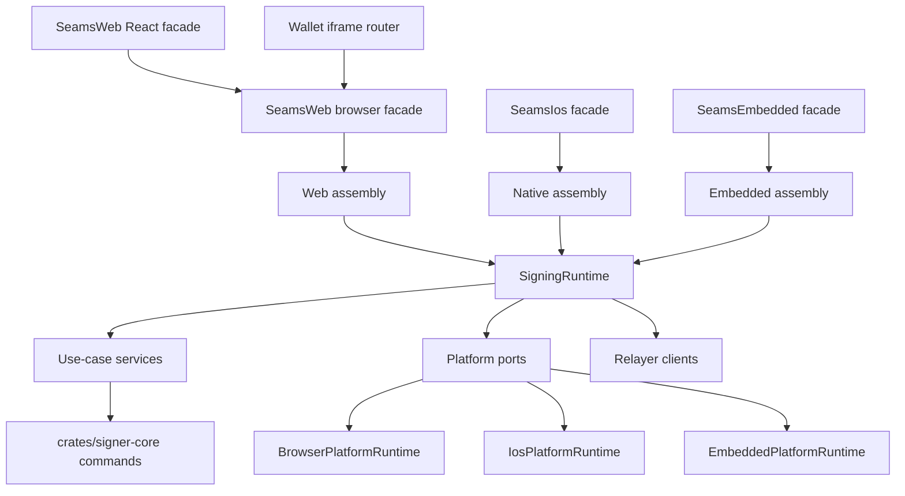

# Refactor 51b: Web Facade And Native Runtime Split

Date created: 2026-06-03
Status: proposed canonical follow-up
Owner: SDK architecture

## Purpose

Refactor 51 established the cross-platform port model, signer-core command
ownership, browser adapter conformance, and native-readiness handoff. This plan
turns that readiness into a concrete SDK shape:

- rename the browser public facade from `SeamsPasskey` to `SeamsWeb`;
- extract a platform-neutral signing runtime that receives platform ports;
- remove browser IndexedDB assumptions from shared signing assembly;
- add distinct web, iOS, and embedded facade boundaries;
- keep wallet iframe routing out of native packages;
- preserve the current `seams.sh` relying-party identity across web and iOS
  passkeys through native Associated Domains.

The intent is a breaking cleanup. No `SeamsPasskey` compatibility alias, legacy
flag, or dual facade should remain after the rename phase completes.

## Relationship To Existing Plans

This document extends:

- `docs/refactor-51-cross-platform-2.md`
- `docs/refactor-51-native-readiness.md`

Refactor 51 remains the source of truth for signer-core command schemas,
boundary parser rules, opaque ECDSA state blobs, platform adapter conformance,
and compatibility deletion policy. This plan owns the SDK facade split and the
native composition root.

## Current State

The lower SDK layers are already close to the target:

- `client/src/core/platform/types.ts` defines `PlatformRuntime`,
  `AuthenticatorPort`, `SignerCryptoPort`, `DurableRecordStore`,
  `HttpTransport`, `SecureSecretStore`, `ClockPort`, and `RandomSource`.
- `client/src/core/platform/browser/createBrowserPlatformRuntime.ts` wires the
  current browser adapter over IndexedDB, WebAuthn, workers, fetch, clock, and
  browser crypto.
- `tests/unit/platformAdapter.conformance.unit.test.ts` exports conformance
  helpers that browser and future native adapters must pass.
- `tests/unit/crossPlatformBoundaries.guard.unit.test.ts` protects
  `PlatformRuntime` and raw crypto material from leaking into use-case modules.

The remaining browser coupling is above and around those ports:

- `client/src/core/SeamsPasskey/index.ts` is the public browser SDK facade and
  owns `WalletIframeCoordinator`.
- `client/src/core/SeamsPasskey/walletIframeRoute.ts` chooses local browser
  execution or `WalletIframeRouter` execution.
- `client/src/core/signingEngine/SigningEngine.ts` constructs
  `createBrowserPlatformRuntime(...)` internally.
- `client/src/core/signingEngine/assembly/createPorts.ts` calls
  `getBrowserPlatformIndexedDB(...)`, so shared assembly still assumes browser
  IndexedDB for some paths.

## SDK Simplification Workstream

Treat the native/runtime split as a deletion and simplification pass. Each phase
should reduce the number of public concepts, dependency entrypoints, and
browser-shaped assumptions that future platforms must understand.

| Cleanup target | Owner phase | Expected simplification |
| --- | --- | --- |
| Browser facade naming | Phase 1 | `SeamsWeb` becomes the only browser public facade; old `SeamsPasskey` symbols, aliases, docs, and error prefixes are deleted. |
| `SigningEngine` composition surface | Phase 2 | `SigningRuntime` becomes the neutral composition root; `SigningEngine` becomes a temporary web wrapper or is deleted once `SeamsWeb` calls the runtime directly. |
| Browser IndexedDB coupling | Phase 3 | Shared assembly receives explicit store ports instead of recovering `IndexedDBManager` from a browser runtime. |
| Wallet iframe routing | Phase 4 | Iframe routing becomes a web facade decorator; core chain signers and runtime services receive direct operation dependencies. |
| Runtime and web config | Phase 3, Phase 7 | Platform-neutral runtime config is split from `SeamsWeb` browser config, including `iframeWallet`, DOM UI, browser WebAuthn, and React settings. |
| `client/src/core/platform/types.ts` size | Phase 8 | Ports, secret-source builders, ECDSA role-local record types, HTTP types, and runtime aggregate types move into focused modules. |
| Package exports and metadata | Phase 7 | `sdk/package.json`, `client/src/index.ts`, and React entrypoints expose web-named APIs and reserve native roots without pulling browser chunks. |

Simplification rules:

- Delete obsolete wrappers, aliases, and tests in the same phase that replaces
  the behavior.
- Convert broad dependency bags into named port groups only when the port group
  is consumed by more than one operation or platform.
- Prefer grouped runtime services over long public `Pick<SigningEngine, ...>`
  member lists.
- Keep compatibility handling at request and persistence boundaries with an
  owner phase and deletion trigger.
- Split large files after dependencies point at the new boundaries, so file
  movement does not hide behavior changes.

## Target Architecture



## Naming Contract

### Browser Names

`SeamsWeb` is the browser facade. It owns browser-only surfaces:

- DOM and React integration;
- WebAuthn through browser `navigator.credentials`;
- wallet iframe mode;
- wallet-origin deployment config;
- web-specific asset preconnect and embedded UI behavior;
- browser storage assembly.

Required renames:

| Current | Target |
| --- | --- |
| `SeamsPasskey` | `SeamsWeb` |
| `client/src/core/SeamsPasskey/` | `client/src/web/SeamsWeb/` or `client/src/core/SeamsWeb/` if the build cannot yet move the directory |
| `SeamsPasskeyProvider` | `SeamsWebProvider` |
| `SeamsPasskeyProviderProps` | `SeamsWebProviderProps` |
| `SeamsPasskeyProviderThemeProps` | `SeamsWebProviderThemeProps` |
| `PasskeyManagerContext` | `SeamsWebContext` |
| `SeamsPasskeyIframe` | `SeamsWebIframe` |
| `WalletIframeCoordinator.getSeamsPasskey` style names | `getSeamsWeb` |

Rules:

- The rename is hard. Do not export `SeamsPasskey` as an alias.
- Test names, docs, comments, and error prefixes move to `SeamsWeb`.
- Existing passkey/auth domain terms remain as domain vocabulary. Only the
  browser facade name changes.

### Platform-Neutral Names

Use `SigningRuntime` for the platform-neutral composition root. It owns:

- use-case construction;
- relayer clients;
- lifecycle orchestration;
- signing session restore and budget services once their dependencies are
  port-shaped;
- typed domain inputs and results.

`SigningRuntime` must not import:

- `WalletIframe`;
- React;
- DOM globals;
- `navigator`;
- `window`;
- `document`;
- `IndexedDBManager`;
- `createBrowserPlatformRuntime`;
- `getBrowserPlatformIndexedDB`.

## RP ID And iOS Passkey Contract

The current web wallet uses `seams.sh` as the relying-party identity. Native iOS
must keep that same relying-party identifier for passkey interoperability with
the web wallet.

Facts to encode in implementation docs and tests:

- iOS native passkeys use a domain string as the relying-party identifier.
- The app must prove authority for that domain through the Associated Domains
  entitlement and an `apple-app-site-association` file.
- The iOS app must use `webcredentials:seams.sh`.
- `https://seams.sh/.well-known/apple-app-site-association` must contain the
  app identifier under the `webcredentials` service.
- The iOS `AuthenticatorPort` uses `ASAuthorizationPlatformPublicKeyCredentialProvider`
  with `relyingPartyIdentifier: "seams.sh"`.
- The server verifies the same WebAuthn artifacts as the web path: challenge,
  credential id, signature, `rawClientDataJSON`, authenticator data, expected
  origin policy, and `rpIdHash` for `seams.sh`.
- A `WKWebView` or `ASWebAuthenticationSession` path is an integration fallback.
  Native `AuthenticationServices` is the SDK happy path.

External references:

- Apple `ASAuthorizationPlatformPublicKeyCredentialProvider.relyingPartyIdentifier`:
  https://developer.apple.com/documentation/authenticationservices/asauthorizationplatformpublickeycredentialprovider/relyingpartyidentifier
- Apple Associated Domains:
  https://developer.apple.com/documentation/Xcode/supporting-associated-domains
- Apple passkey sample:
  https://developer.apple.com/documentation/authenticationservices/connecting_to_a_service_with_passkeys
- WebAuthn Permissions Policy and RP ID rules:
  https://w3c.github.io/webauthn/

## Package Boundaries

### Web Package Boundary

The web build may import:

- `client/src/web/SeamsWeb/**`;
- `client/src/core/runtime/**`;
- `client/src/core/platform/browser/**`;
- `client/src/core/WalletIframe/**`;
- React packages through `client/src/react/**`.

The web build owns the default `@seams/sdk` export until native packages exist:

```ts
export { SeamsWeb } from './web/SeamsWeb';
```

React exports become:

```ts
export { SeamsWebProvider } from './react/context/SeamsWebProvider';
```

### Native Package Boundary

Future native packages may import:

- `client/src/core/runtime/**`;
- `client/src/core/platform/types.ts`;
- generated signer-core schemas;
- relayer route parsers and domain clients that have no browser imports;
- conformance fixtures that are explicitly platform-neutral.

Future native packages must not import:

- `client/src/web/SeamsWeb/**`;
- `client/src/core/WalletIframe/**`;
- `client/src/react/**`;
- `client/src/core/platform/browser/**`;
- browser plugins, browser asset paths, iframe host code, or DOM UI code.

### Embedded Package Boundary

The embedded package should prefer Rust-local code:

- signer-core through native Rust, C ABI, or authenticated local daemon;
- durable records in SQLite or atomic filesystem records;
- FIDO2 hmac-secret, TPM, kernel keyring, libsecret, or reviewed
  hardware-backed storage;
- bounded command payloads and no long-lived raw secret buffers.

Embedded packages must not depend on a browser iframe, `WKWebView`, React, or
browser storage semantics.

## Target File Layout

Use this layout unless a phase updates this table first.

| Area | Target location |
| --- | --- |
| Browser facade | `client/src/web/SeamsWeb/` |
| React provider | `client/src/react/context/SeamsWebProvider.tsx` |
| Wallet iframe browser modules | `client/src/web/SeamsWeb/walletIframe/` or existing `client/src/core/WalletIframe/` behind web-only guards |
| Platform-neutral runtime | `client/src/core/runtime/` |
| Runtime assembly entry | `client/src/core/runtime/createSigningRuntime.ts` |
| Runtime dependency types | `client/src/core/runtime/types.ts` |
| Browser runtime assembly | `client/src/core/runtime/browser/createBrowserSigningRuntime.ts` |
| Runtime config types | `client/src/core/runtime/config.ts` |
| Web config types | `client/src/web/SeamsWeb/config.ts` |
| Platform ports | `client/src/core/platform/ports.ts` |
| Platform secret sources | `client/src/core/platform/secretSources.ts` |
| ECDSA role-local record types | `client/src/core/platform/ecdsaRoleLocalRecords.ts` |
| Platform HTTP transport types | `client/src/core/platform/http.ts` |
| Platform runtime aggregate | `client/src/core/platform/runtime.ts` |
| iOS adapter contract | `client/src/core/platform/ios/README.md` until native package exists |
| Embedded adapter contract | `client/src/core/platform/embedded/README.md` until native package exists |
| Platform import guards | `tests/unit/refactor51bPlatformBoundaries.guard.unit.test.ts` |
| Public rename guards | `tests/unit/refactor51bSeamsWebRename.guard.unit.test.ts` |
| RP ID contract tests/docs | `tests/unit/refactor51bRpIdContract.unit.test.ts` and this file |

## Implementation Phases

### Phase 0: Inventory And Guard Lock

Goals:

- inventory every `SeamsPasskey`, `PasskeyManagerContext`, `WalletIframe`,
  `createBrowserPlatformRuntime`, `getBrowserPlatformIndexedDB`, and
  `IndexedDBManager` reference that sits on an intended shared path;
- add failing guards before moving code.

Tasks:

- [ ] Add `docs/refactor-51b-inventory.md` with rows for public exports, React
  exports, facade files, iframe files, signing assembly files, storage
  dependencies, and tests.
- [ ] Add simplification inventory rows for:
  - [ ] `client/src/core/SeamsPasskey/index.ts` public facade responsibilities;
  - [ ] `client/src/core/signingEngine/SigningEngine.ts` constructor ownership and
    public member list;
  - [ ] `client/src/core/signingEngine/assembly/createPorts.ts` browser storage
    assumptions;
  - [ ] `client/src/core/platform/types.ts` type groups that should split after the
    runtime boundary is stable;
  - [ ] `sdk/package.json`, `client/src/index.ts`, and `client/src/react/index.ts`
    export surfaces.
- [ ] Add a guard that rejects `WalletIframe`, `SeamsWeb`, React, DOM globals, and
  browser platform adapter imports inside `client/src/core/runtime/**`.
- [ ] Add a guard that rejects `SeamsPasskey` symbols after the rename phase.
- [ ] Add a guard that rejects `getBrowserPlatformIndexedDB(...)` outside browser
  assembly.
- [ ] Add a guard that rejects `client/src/core/WalletIframe/**` imports from
  future native or embedded package roots.

Acceptance:

- Inventory exists and includes all known current coupling points.
- Inventory identifies which cleanups are deletion-only, rename-only, or
  behavior-preserving extraction work.
- New guards fail against the current tree when run in strict mode or are staged
  with explicit TODO owner rows until the corresponding phase.

Validation:

- `pnpm -C tests run test:source-guards`
- targeted Playwright unit guard file

### Phase 1: Rename Browser Facade To SeamsWeb

Goals:

- make browser identity explicit before extracting native runtime;
- delete `SeamsPasskey` public symbols.

Tasks:

- [ ] Rename `client/src/core/SeamsPasskey` to the chosen web facade path.
- [ ] Rename exported class `SeamsPasskey` to `SeamsWeb`.
- [ ] Rename `PasskeyManagerContext` to `SeamsWebContext`.
- [ ] Rename React provider files and symbols from `SeamsPasskeyProvider` to
  `SeamsWebProvider`.
- [ ] Rename `SeamsPasskeyIframe` to `SeamsWebIframe`.
- [ ] Update `client/src/index.ts`, `client/src/react/index.ts`, `sdk/package.json`
  export descriptions, docs, README snippets, tests, and error prefixes.
- [ ] Delete all compatibility aliases and old symbol re-exports.
- [ ] Delete passkey-manager naming in comments, provider examples, type names, and
  package descriptions unless the text refers to passkey authentication as a
  domain concept.
- [ ] Rename or delete tests that only protect old `SeamsPasskey` public symbols.

Acceptance:

- `rg "SeamsPasskey|PasskeyManagerContext|SeamsPasskeyProvider|SeamsPasskeyIframe"`
  returns only this plan, historical docs explicitly marked as historical, and
  guard fixtures.
- Public import examples use `SeamsWeb`.
- Wallet iframe host creates a `SeamsWeb` instance.
- No public package entrypoint exports `SeamsPasskey`, `SeamsPasskeyProvider`,
  or `PasskeyManagerContext`.

Validation:

- `pnpm -C sdk type-check`
- `pnpm -C tests run test:unit -- ./unit/refactor51bSeamsWebRename.guard.unit.test.ts`
- existing wallet iframe unit tests that cover host/client routing

### Phase 2: Extract SigningRuntime

Goals:

- make `SigningRuntime` the platform-neutral composition root;
- stop constructing `createBrowserPlatformRuntime(...)` inside shared signing
  code.

Target contract:

```ts
type SigningRuntimeDeps = {
  platformRuntime: PlatformRuntime;
  relayers: SigningRuntimeRelayerClients;
  stores: SigningRuntimeStores;
  ui: SigningRuntimeUiPorts;
  config: SigningRuntimeConfig;
};

function createSigningRuntime(deps: SigningRuntimeDeps): SigningRuntime;
```

Rules:

- `SigningRuntime` receives `PlatformRuntime`.
- Browser code calls `createBrowserPlatformRuntime(...)` only in browser
  assembly.
- Use-case services receive only narrow dependencies.
- Runtime dependency objects use discriminated unions for platform-specific
  branches.
- Raw browser credentials, raw DB records, and native binding responses are
  parsed once at platform/request boundaries.

Tasks:

- [ ] Add `client/src/core/runtime/types.ts`.
- [ ] Add `client/src/core/runtime/createSigningRuntime.ts`.
- [ ] Move use-case construction from `SigningEngine` into `SigningRuntime`.
- [ ] Change `SigningEngine` into either a thin web wrapper around `SigningRuntime`
  or delete it once `SeamsWeb` calls the runtime directly.
- [ ] Move relayer-client assembly into runtime dependencies.
- [ ] Keep iframe routing in `SeamsWeb`, outside `SigningRuntime`.
- [ ] Replace the long `signingEnginePublicMembers` tuple with grouped runtime
  services, such as registration, auth/session, near signing, EVM-family
  signing, recovery/export, preferences, and diagnostics.
- [ ] Move `createBrowserPlatformRuntime(...)` construction into
  `createBrowserSigningRuntime(...)`.
- [ ] Move in-memory ECDSA session/export artifact maps into runtime stores or
  explicit runtime state ports.
- [ ] Delete `SigningEngine` public methods as soon as an equivalent runtime service
  owns the operation.

Acceptance:

- `client/src/core/runtime/**` imports no browser adapter, iframe, React, DOM, or
  IndexedDB modules.
- `SigningRuntime` can be constructed in tests with an in-memory
  `PlatformRuntime`.
- ECDSA provisioning uses the injected `SignerCryptoPort`,
  `AuthenticatorPort`, `DurableRecordStore`, and relayer client.
- `SigningEngine` is either gone or documented as a temporary web-only wrapper
  with no browser runtime construction.
- Runtime consumers call grouped services instead of a broad public member pick.

Validation:

- `pnpm -C tests run test:unit -- ./unit/provisionEcdsaUseCase.unit.test.ts`
- `pnpm -C tests run test:unit -- ./unit/platformAdapter.conformance.unit.test.ts`
- new runtime construction unit tests

### Phase 3: Replace Browser IndexedDB Assumptions With Store Ports

Goals:

- remove `getBrowserPlatformIndexedDB(...)` from shared signing assembly;
- make every durable store dependency an explicit port.

Tasks:

- [ ] Define store ports for remaining flows that currently require
  `UnifiedIndexedDBManager` directly.
- [ ] Move browser `IndexedDBManager` access into browser store adapters.
- [ ] Update `createSigningEnginePorts(...)` or its replacement runtime assembly to
  receive store ports instead of deriving IndexedDB from `PlatformRuntime`.
- [ ] Convert sealed-session, nonce, user-preference, registration, and recovery
  storage dependencies into typed ports as each path is touched.
- [ ] Define `SigningRuntimeStores` with required branch-specific ports for:
  - [ ] wallet profile and signer records;
  - [ ] ECDSA role-local ready records;
  - [ ] sealed signing-session records;
  - [ ] nonce lane coordination;
  - [ ] user preferences;
  - [ ] recovery and device-linking records.
- [ ] Split `SeamsConfigsReadonly` into a platform-neutral runtime config and
  `SeamsWeb` browser config. Keep `iframeWallet`, browser authenticator options,
  DOM UI, asset paths, and React-facing settings out of the runtime config.
- [ ] Keep raw DB parsing in persistence boundary modules.

Acceptance:

- `getBrowserPlatformIndexedDB(...)` is used only in browser assembly or deleted.
- `client/src/core/runtime/**` and use-case modules do not import
  `IndexedDBManager` or `UnifiedIndexedDBManager`.
- Browser tests still prove wallet-origin persistence behavior.
- Runtime config can be instantiated without iframe, DOM, React, or browser
  WebAuthn config fields.
- Store ports are required fields in runtime assembly; core functions do not
  accept partial persistence objects.

Validation:

- storage unit tests for each moved port
- `tests/unit/crossPlatformBoundaries.guard.unit.test.ts`
- new `refactor51bPlatformBoundaries.guard.unit.test.ts`

### Phase 4: Add Browser Assembly And Web Facade Boundary

Goals:

- make browser assembly the only place that combines `SeamsWeb`,
  `BrowserPlatformRuntime`, wallet iframe routing, React, and browser stores.

Tasks:

- [ ] Add `createBrowserSigningRuntime(...)`.
- [ ] Move browser-specific worker warmup, wallet-origin storage disabling, iframe
  readiness, asset preconnect, and UI overlay behavior into web assembly.
- [ ] Keep `WalletIframeCoordinator` under the web facade boundary.
- [ ] Keep direct browser mode and wallet iframe mode as `SeamsWeb` branches.
- [ ] Move `routeWalletIframeOrLocal(...)` usage up to the `SeamsWeb` capability
  layer. Chain signer modules should expose local runtime operations that can be
  called directly by web or native facades.
- [ ] Keep wallet iframe preference mirroring and login-status events in web-only
  modules.
- [ ] Delete iframe-aware dependency fields from chain signer constructors once the
  web facade owns routing.

Acceptance:

- `SeamsWeb` can construct the browser runtime in direct mode and iframe mode.
- `SigningRuntime` has no iframe branch.
- Wallet iframe tests still cover origin-isolated browser execution.
- Near, Tempo, and EVM-family core signing modules have no
  `WalletIframeCoordinator`, `WalletIframeRouter`, or `routeWalletIframeOrLocal`
  dependency.

Validation:

- wallet iframe unit tests
- selected e2e wallet iframe tests
- browser platform conformance tests

### Phase 5: Add iOS Adapter Contract And RP ID Fixtures

Goals:

- make the iOS platform path explicit without shipping a full iOS SDK yet;
- record how `seams.sh` passkeys are shared between web and iOS.

Tasks:

- [ ] Add `client/src/core/platform/ios/README.md` with:
  - [ ] `AuthenticationServices` mapping for `AuthenticatorPort`;
  - [ ] `ASAuthorizationPlatformPublicKeyCredentialProvider` usage with
    `relyingPartyIdentifier: "seams.sh"`;
  - [ ] Associated Domains entitlement example using `webcredentials:seams.sh`;
  - [ ] required `apple-app-site-association` `webcredentials` shape;
  - [ ] PRF extension expectations and typed unsupported fallback;
  - [ ] Keychain-backed `SecureSecretStore` requirements;
  - [ ] native signer-core binding requirements.
- [ ] Add `refactor51bRpIdContract.unit.test.ts` for config/domain constants that
  must stay stable in the repo.
- [ ] Add server-side verification notes for expected iOS/native origins if current
  WebAuthn verification distinguishes browser origins from native app origins.
- [ ] Add a native replay fixture task for every signer-core command the iOS adapter
  will call.

Acceptance:

- The plan for iOS passkey interoperability is implementable without a web
  iframe.
- `seams.sh` is the documented canonical RP ID for web/iOS interop unless a
  future plan explicitly changes it.
- iOS unsupported PRF behavior returns a typed failure before signer-core sees an
  invalid secret source.

Validation:

- `pnpm -C tests run test:unit -- ./unit/refactor51bRpIdContract.unit.test.ts`
- signer-core native readiness replay tests

### Phase 6: Add Embedded Adapter Contract

Goals:

- define the embedded path around Rust/local platform capabilities;
- keep web containers out of robot, device, and daemon deployments.

Tasks:

- [ ] Add `client/src/core/platform/embedded/README.md`.
- [ ] Define `EmbeddedPlatformRuntime` requirements:
  - [ ] FIDO2 hmac-secret, TPM, or reviewed platform secret source;
  - [ ] signer-core through Rust crate, C ABI, or authenticated local daemon;
  - [ ] SQLite or atomic filesystem durable records;
  - [ ] TLS transport with bounded timeouts;
  - [ ] resource limits and replay-vector expectations.
- [ ] Add guard tests proving embedded roots do not import `WalletIframe`, React, DOM
  UI, or browser storage modules.

Acceptance:

- Embedded implementation can be assigned without interpreting browser iframe
  concepts.
- The embedded plan reuses signer-core command schemas and conformance fixtures.

Validation:

- source guard tests
- signer-core replay tests on the lowest supported CPU class once hardware
  targets exist

### Phase 7: Public Export And Package Split

Goals:

- make public exports match the new architecture;
- keep native builds away from web-only files by construction.

Tasks:

- [ ] Update `sdk/package.json` exports:
  - [ ] `.` exports `SeamsWeb` for the browser package while this repo ships only
    the web SDK.
  - [ ] `./react` exports `SeamsWebProvider` and browser React hooks.
  - [ ] add `./runtime` only if it exposes platform-neutral types without browser
    dependencies.
  - [ ] reserve future `./ios` and `./embedded` entries for packages or generated
    bindings that do not bundle browser code.
- [ ] Update type declarations and build checks to prevent native packages from
  pulling browser chunks.
- [ ] Add bundle inspection tests for native-target package entries once they exist.
- [ ] Update package description and keywords so browser, runtime, server, and
  native-facing surfaces are described separately.
- [ ] Remove stale component exports that point at deleted or renamed browser-only
  WebAuthn manager paths.
- [ ] Add package export smoke tests for `.`, `./react`, `./runtime`, and any
  reserved native roots.

Acceptance:

- Browser imports are clear and web-named.
- Native package roots cannot import iframe/browser implementation files.
- No legacy `SeamsPasskey` export remains.
- `sdk/package.json` exports do not expose browser-only modules from
  platform-neutral or reserved native roots.

Validation:

- `pnpm -C sdk build`
- package export smoke tests
- bundle boundary checks

### Phase 8: Final Simplification Sweep

Goals:

- split oversized boundary files after runtime dependencies have stabilized;
- remove temporary wrappers introduced during the extraction;
- keep the final SDK surface small enough that native implementers can audit it.

Tasks:

- [ ] Split `client/src/core/platform/types.ts` into focused modules:
  - [ ] `ports.ts` for `AuthenticatorPort`, `SignerCryptoPort`,
    `DurableRecordStore`, `SecureSecretStore`, `HttpTransport`, `ClockPort`,
    and `RandomSource`;
  - [ ] `secretSources.ts` for client secret-source brands, builders, and parsers;
  - [ ] `ecdsaRoleLocalRecords.ts` for role-local ready/pending record shapes and
    parse results;
  - [ ] `http.ts` for HTTP transport request/result types;
  - [ ] `runtime.ts` for `PlatformRuntime` and platform-kind aggregates.
- [ ] Delete temporary `SigningEngine` wrappers once all public web capability
  methods call `SigningRuntime` services.
- [ ] Delete temporary inventory TODO rows and guard allow-list entries created for
  phases that have completed.
- [ ] Audit tests, fixtures, and snapshots for old facade names, iframe assumptions
  in shared runtime tests, and IndexedDB assumptions outside browser adapter
  tests.
- [ ] Update file-level README docs for `core/runtime`, `core/platform`, `web`, and
  React entrypoints.

Acceptance:

- `client/src/core/platform/types.ts` remains only as a barrel export or is
  deleted.
- No temporary wrapper exists solely to bridge old `SigningEngine` call sites.
- Guard allow-lists contain only intentional boundary files with owner and
  reason fields.
- Typecheck fixtures cover the split platform secret-source and runtime config
  modules.

Validation:

- `pnpm -C sdk type-check`
- `pnpm -C tests run test:source-guards`
- focused unit tests for split platform modules

## Guard Tests

Add or update guards for:

- no `SeamsPasskey` public symbols after Phase 1;
- no iframe imports from `client/src/core/runtime/**`;
- no React imports from `client/src/core/runtime/**`;
- no DOM global usage from `client/src/core/runtime/**`;
- no browser adapter imports from native or embedded roots;
- no `getBrowserPlatformIndexedDB(...)` outside browser assembly;
- no `WalletIframeRouter` in iOS or embedded files;
- no `WKWebView` as the primary iOS authenticator implementation;
- no `SigningEngine` public wrapper after Phase 8;
- no `client/src/core/platform/types.ts` implementation body after Phase 8 if it
  has become a barrel export;
- no runtime config fields named `iframeWallet`, `walletServicePath`,
  `sdkBasePath`, `walletHostVariant`, or React provider props.

## Compatibility Register

No compatibility branches are accepted for the facade rename.

| Compatibility path | Parser/module | Owner phase | Deletion trigger | Guard |
| --- | --- | --- | --- | --- |
| _No active compatibility branches._ | | | | |

## Review Checklist

Before merging any phase:

- Does this change move browser-only behavior toward `SeamsWeb` or browser
  assembly?
- Does `SigningRuntime` remain free of iframe, DOM, React, browser adapter, and
  IndexedDB imports?
- Are platform dependencies expressed as required ports?
- Did this phase delete the wrapper, alias, guard allow-list entry, fixture, or
  test that became obsolete?
- Did broad config or dependency bags shrink into runtime, web, or platform
  groups with clear ownership?
- Are any auth, identity, session, signing, restore, export, or lifecycle fields
  optional in core contracts?
- Do iOS passkey paths use `seams.sh` as a domain RP ID through Associated
  Domains?
- Does native PRF or secure-secret behavior normalize once at the platform
  boundary?
- Are unsupported platform capabilities typed failures?
- Do conformance tests cover each port touched by the phase?
- Are stale `SeamsPasskey` docs, tests, comments, and errors deleted?

## Final Target State

- `SeamsWeb` is the browser SDK facade.
- Browser iframe routing exists only under the web facade boundary.
- `SigningRuntime` is platform-neutral and receives all platform capabilities
  through typed ports.
- Shared runtime and use-case modules have no browser storage, DOM, React, or
  iframe imports.
- Store dependencies are explicit runtime ports rather than recovered
  IndexedDB managers.
- Platform types live in focused modules with barrel exports only where useful.
- Package exports expose web, React, server, and platform-neutral roots with
  clear boundaries.
- Browser direct mode and wallet iframe mode remain fully supported.
- iOS uses native `AuthenticationServices` with `seams.sh` as the RP ID through
  Associated Domains.
- Embedded uses Rust/native platform capabilities and never handles iframe
  abstractions.
- The source guards make these boundaries mechanically enforceable.
