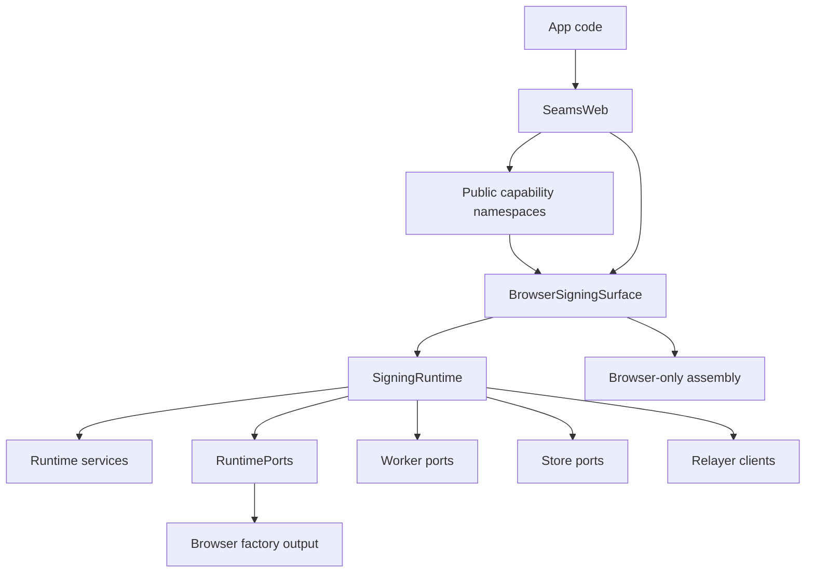

# Refactor 54: SDK Simplification

Date created: 2026-06-05
Status: implementation plan
Owner: SDK architecture

## Purpose

Refactor 51b created the right browser SDK shape: a browser facade,
browser-specific assembly, runtime services, and injected runtime ports.

This plan removes the extra forwarding and context leakage that accumulated
above that architecture. The target is a smaller web SDK callpath:

```text
App
  -> SeamsWeb public API
    -> BrowserSigningSurface
      -> SigningRuntime
        -> RuntimePorts / workers / stores
```

The goal is deletion and directness. Do not add a new abstraction to fix this
unless it deletes more existing wiring than it creates.

## Problem Statement

The current SDK has several useful layers:

1. `SeamsWeb` is the public browser SDK facade.
2. `BrowserSigningSurface` owns browser signing assembly.
3. `SigningRuntime` owns TypeScript runtime services.
4. `RuntimePorts` owns injected browser/test runtime dependencies.
5. `WalletIframeCoordinator` owns optional wallet-origin isolation.

Those layers should remain.

The overengineered part is the forwarding chain above the runtime. Web facade
code often receives a broad `SeamsWebContext`, then reaches through:

```ts
context.signingRuntime.services.someService.someOperation(...)
```

That leaks the runtime service graph into web feature modules, capability
factories, and route-style helpers. It also means `SeamsWebContext` exposes both
`signingEngine` and `signingRuntime`, so callers must understand two internal
signing layers.

## Current Smells

Examples to remove:

1. `SeamsWebContext` includes `signingRuntime`.
2. Web modules call `context.signingRuntime.services.*`.
3. Capability factories accept `getContext()` when they only need one or two
   operations.
4. Tempo and EVM nonce lifecycle helpers reach into runtime services directly.
5. Registration and login helpers pull registration account services from the
   runtime instead of a web-facing signing surface.
6. `BrowserSigningSurface` already has many useful methods, but callers still
   bypass it.

Current high-signal search patterns:

```bash
rg -n "signingRuntime\\.services|SeamsWebContext| getContext:" client/src/web/SeamsWeb client/src/core
```

## Target Architecture



Rules:

1. `SeamsWeb` and web capability modules call `BrowserSigningSurface`.
2. Only `BrowserSigningSurface`, browser assembly files, and core runtime code
   may touch `SigningRuntime.services`.
3. `SeamsWebContext` must not expose `signingRuntime`.
4. Capability factories receive narrow callable deps instead of `getContext()`
   when the operation only needs explicit methods.
5. Runtime service names remain internal implementation details.
6. Keep wallet iframe routing as a web-only concern.

## Non-Goals

1. Do not remove `SigningRuntime`.
2. Do not collapse platform ports back into browser IndexedDB or WebAuthn
   assumptions.
3. Do not rename public APIs unless the rename deletes an internal wrapper.
4. Do not split `BrowserSigningSurface.ts` first. Delete forwarding paths first,
   then split if the remaining file is still hard to audit.
5. Do not introduce compatibility aliases.

## Target Internal API

`BrowserSigningSurface` should be the internal API visible to `SeamsWeb`.

Keep or add methods in these groups:

```ts
type SeamsWebSigningSurface = {
  signNear(...): Promise<...>;
  signTempo(...): Promise<...>;
  reportTempoBroadcastAccepted(...): Promise<void>;
  reportTempoBroadcastRejected(...): Promise<void>;
  reportTempoFinalized(...): Promise<void>;
  reportTempoDroppedOrReplaced(...): Promise<void>;
  reconcileTempoNonceLane(...): Promise<...>;

  initializeCurrentUser(...): Promise<...>;
  hasPasskeyCredential(...): Promise<boolean>;
  storeWalletEd25519SignerRecord(...): Promise<...>;

  preparePasskeyEcdsaBootstrap(...): Promise<...>;
  prepareEmailOtpEcdsaBootstrap(...): Promise<...>;
  persistWalletRegistrationEcdsaSessions(...): Promise<...>;
  storeWalletEcdsaRegistrationData(...): Promise<...>;

  hydrateSigningSession(...): Promise<...>;
  restorePersistedSessionsForWallet(...): Promise<...>;
  readPersistedAvailableSigningLanes(...): Promise<...>;
};
```

Names should match existing domain names where possible. The point is not to
invent a giant new interface; the point is to give web modules the narrow
operations they already use without exposing the runtime graph.

## Phase 0: Inventory And Guardrails

- [x] Inventory every `context.signingRuntime.services.*` call under
      `client/src/web/SeamsWeb`.
- [x] Inventory every capability factory that accepts `getContext()`.
- [x] Inventory every core module importing `SeamsWebContext`.
- [x] Add or update a source guard that fails when web modules outside
      `client/src/web/SeamsWeb/assembly/BrowserSigningSurface.ts` and
      `client/src/web/SeamsWeb/assembly/**` call `signingRuntime.services`.
- [x] Add a guard that fails if `SeamsWebContext` has a `signingRuntime` field
      after the final removal phase.
- [x] Record intentional temporary exceptions in this plan with an owner phase.

Temporary exceptions: none for `signingRuntime.services` outside
`client/src/web/SeamsWeb/assembly/**`. Broad `getContext()` dependency narrowing
remains Phase 4 work.

## Phase 1: Flatten Signing And Tempo Calls

- [x] Replace `context.signingRuntime.services.nearSigning.signNear(...)` with
      `context.signingEngine.signNear(...)`.
- [x] Replace Tempo/EVM direct runtime calls with
      `context.signingEngine.signTempo(...)` and the matching report/reconcile
      methods.
- [x] Update `client/src/web/SeamsWeb/near/**` callers.
- [x] Update `client/src/web/SeamsWeb/tempo/**` callers.
- [x] Update `client/src/web/SeamsWeb/evm/**` callers.
- [x] Keep wallet-iframe routing behavior unchanged.
- [x] Add focused tests for direct `signingEngine` callpaths where existing
      tests currently pass by using runtime services directly.

Acceptance:

- [x] No NEAR, Tempo, or EVM web module calls
      `context.signingRuntime.services.*`.
- [x] Existing wallet iframe signing tests pass.
- [x] `signingEngine.signTempo(...)` is the only web-facing direct Tempo signing
      method.

## Phase 2: Flatten Registration And Account Services

- [x] Add `BrowserSigningSurface` methods for registration account operations
      currently reached through `registrationAccounts`.
- [x] Add methods for ECDSA bootstrap preparation currently reached through
      `ecdsaRegistrationBootstrap`.
- [x] Add methods for ECDSA registration-session persistence currently reached
      through `ecdsaRegistrationSessions`.
- [x] Add methods for ECDSA wallet record writes currently reached through
      `ecdsaWalletRecords`.
- [x] Update `client/src/web/SeamsWeb/registration.ts`.
- [x] Update `client/src/web/SeamsWeb/login.ts`.
- [x] Update `client/src/web/SeamsWeb/authSessions.ts`.
- [x] Update `client/src/web/SeamsWeb/near/linkDevice.ts`.
- [x] Update `client/src/web/SeamsWeb/near/emailRecovery.ts`.
- [x] Keep persistence boundary parsers unchanged.

Acceptance:

- [x] Registration and login web modules do not call
      `context.signingRuntime.services.*`.
- [x] Registration account initialization, signer record writes, and ECDSA
      bootstrap persistence still have typed method boundaries.
- [x] Existing registration, login, and wallet-iframe Email OTP tests pass.

## Phase 3: Flatten Warm Session And Restore Calls

- [x] Add `BrowserSigningSurface` methods for warm-session hydration currently
      reached through `warmSessions`.
- [x] Update `thresholdWarmSessionBootstrap.ts` to use `signingEngine` methods.
- [x] Update `restoreLocalLoginState.ts`.
- [x] Update wallet-iframe host handlers that reach into
      `ctx.signingRuntime.services`.
- [x] Preserve sealed-session restore leases and boundary validation.

Acceptance:

- [x] No warm-session web module reaches through `signingRuntime.services`.
- [x] Sealed refresh startup parity checks still run from browser assembly.
- [x] Warm session rehydration and Email OTP refresh tests pass.

## Phase 4: Narrow Capability Factory Dependencies

- [x] Replace `createNearSignerCapability({ getContext })` with explicit deps:
      `signNear`, wallet-iframe access, and any required config readers.
- [x] Replace `createTempoSignerCapability({ getContext })` with explicit deps:
      `signTempo`, nonce lifecycle methods, wallet-iframe access, and config
      readers.
- [x] Replace `createEvmSignerCapability({ getContext })` with explicit deps.
- [x] Replace `createRecoveryCapability({ getContext })` with explicit recovery
      and key-export deps.
- [x] Keep `getContext()` only where a module genuinely consumes broad SDK
      state and has an owner phase to remove it.
- [x] Delete dependency bags that become empty after narrowing.

Remaining context builder: `NearSigner`, `TempoSigner`, `EvmSigner`, and the
recovery domains still receive a locally constructed `SeamsWebContext` because
they consume signing surface, config, NEAR client, and theme together. Phase 6
owns reassessing whether those classes can be collapsed or split without adding
another forwarding facade.

Acceptance:

- [x] Capability modules no longer receive broad context when they only need
      callable operations.
- [x] Public namespace behavior stays unchanged:
      `seams.near`, `seams.tempo`, `seams.evm`, `seams.auth`,
      `seams.registration`, `seams.recovery`, and `seams.keys`.
- [x] Capability unit tests verify public calls still route through the same
      wallet-iframe/local split.

## Phase 5: Remove Runtime Escape Hatches From Web Surfaces

- [x] Change `SeamsWebContext` to expose `signingEngine`, `nearClient`,
      `configs`, and wallet/public state only.
- [x] Update `SeamsWeb.getContext()` accordingly.
- [x] Remove type references such as
      `SeamsWebContext['signingRuntime']['services']['registrationAccounts']`.
- [x] Remove `signingRuntime` from `SeamsWebSigningSurface`.
- [x] Make `BrowserSigningSurface.signingRuntime` private to browser assembly.
- [x] Delete temporary exceptions recorded in Phase 0.
- [x] Enable the final `SeamsWebContext` source guard.
- [x] Add guard coverage for `signingEngine.signingRuntime`,
      `readonly signingRuntime`, and `SigningRuntime` imports outside
      assembly/runtime-owned files.
- [x] Replace exported `SeamsWebSigningSurface` runtime-service type mirrors
      with direct domain input/result types.
- [x] Remove `SeamsWebContext` from `client/src/core/rpcClients/near/rpcCalls.ts`
      by passing narrow device-linking deps.
- [x] Add guard coverage so core RPC modules do not import the SeamsWeb facade.

Acceptance:

- [x] `SeamsWebContext` has no `signingRuntime` field.
- [x] `SeamsWebSigningSurface` has no `signingRuntime` field.
- [x] `SeamsWebSigningSurface` does not import or mirror runtime service
      interfaces such as `RegistrationAccountsService`.
- [x] `rg -n "signingRuntime\\.services" client/src/web/SeamsWeb client/src/core/WalletIframe`
      returns only allowed assembly/runtime references.
- [x] TypeScript rejects web modules that attempt to access runtime services
      through context.
- [x] TypeScript rejects web modules that attempt to access runtime services
      through `signingEngine.signingRuntime`.
- [x] Core RPC helpers do not import web facade context types.

## Phase 6: Delete Dead Wrappers And Reassess File Size

- [x] Delete one-hop functions that only forward from web modules into
      `SigningRuntime.services`.
- [x] Delete obsolete helper types created only to pass runtime service handles
      around.
- [x] Re-run source guards to remove stale allow-list entries.
- [x] Reassess `BrowserSigningSurface.ts` size after deletion.
- [x] If the file is still hard to audit, split it by construction concern:
      `BrowserSigningSurface.ts`, `browserSigningSurfaceAssembly.ts`, and
      `browserSigningSurfacePorts.ts`.
- [x] Keep method ownership in `BrowserSigningSurface`; do not create a new
      forwarding facade.

Acceptance:

- [x] Net wrapper count decreases.
- [x] New files, if any, separate construction concerns instead of adding
      callpath hops.
- [x] No public SDK behavior changes except removal of internal leaks.

## Phase 7: External API Surface Simplification

- [x] Remove `registerPasskeyInternal` from `RegistrationCapability`.
- [x] Remove public `SeamsWeb.registerPasskeyInternal`.
- [x] Remove public `SeamsWebIframe.registerPasskeyInternal`.
- [x] Route wallet-iframe registration confirmation overrides through
      `registerPasskey(..., { confirmationConfig })`.
- [x] Rename the private passkey-registration implementation helper away from
      the legacy `registerPasskeyInternal` symbol.
- [x] Update tests and helpers to use the public `registerPasskey` API with
      `confirmationConfig` in the options object.
- [x] Move auth/session calls to the canonical `seams.auth` namespace and
      remove top-level `SeamsWeb` duplicates for `unlock`, `lock`,
      `getWalletSession`, `getRecentUnlocks`, `hasPasskeyCredential`, and
      `prefillThresholdEcdsaPresignPool`.
- [x] Move registration calls to the canonical `seams.registration` namespace
      and remove top-level `SeamsWeb` duplicates for `registerWallet`,
      `addWalletSigner`, `registerWithEmailOtp`, and `registerPasskey`.
- [x] Place Email OTP operations under task namespaces:
  - registration challenge and enrollment APIs under `seams.registration`
  - login and signing-session refresh APIs under `seams.auth`
  - recovery-code management APIs under `seams.recovery`
- [x] Split device-linking and device-key operations out of `seams.recovery`
      and top-level `SeamsWeb` methods into the canonical `seams.devices`
      namespace.
- [x] Move confirmation preference calls to the canonical
      `seams.preferences` namespace and remove top-level `SeamsWeb`
      confirmation preference duplicates.
- [x] Make namespaces the canonical public SDK surface:
      `seams.auth`, `seams.registration`, `seams.near`, `seams.evm`,
      `seams.tempo`, `seams.recovery`, `seams.devices`, `seams.keys`, and
      `seams.preferences`.
- [x] Remove top-level `SeamsWeb` method duplicates once namespace parity tests
      cover the canonical API.
- [x] Add a public API fixture or type test that fails when internal methods
      return to public namespaces/classes.

Acceptance:

- [x] Public registration surfaces do not expose `registerPasskeyInternal`.
- [x] Source and test helpers do not call or export
      `registerPasskeyInternal`.
- [x] Auth/session tests and helpers use `seams.auth.*` instead of top-level
      auth/session methods.
- [x] Registration tests and helpers use `seams.registration.*` instead of
      top-level registration methods.
- [x] Email OTP tests, host handlers, and UI status reads use task namespaces:
      `seams.registration.*` for enrollment, `seams.auth.*` for login/session
      refresh, and `seams.recovery.*` for recovery-code management.
- [x] Device-linking handlers, React hooks, and access-key reads use
      `seams.devices.*` instead of `seams.recovery.*` or top-level device methods.
- [x] Confirmation preference tests, host handlers, and UI controls use
      `seams.preferences.*` instead of top-level preference methods.
- [x] `SeamsWeb` is mostly constructor/config/lifecycle plus capability
      namespaces.
- [x] Tests and examples use canonical namespaces instead of top-level
      duplicates.

## Phase 8: Collapse Capability Class And Factory Pairs

- [x] Collapse `createNearSignerCapability` and `NearSigner` into one
      namespace implementation.
- [x] Collapse `createTempoSignerCapability` and `TempoSigner` into one
      namespace implementation.
- [x] Collapse `createEvmSignerCapability` and `EvmSigner` into one namespace
      implementation.
- [x] Keep wallet-iframe routing and local signing split in the same namespace
      implementation.
- [x] Delete Tempo/EVM class/factory helper types that existed only to pass a
      reconstructed `SeamsWebContext`.
- [x] Delete remaining class/factory helper types that exist only to pass a reconstructed
      `SeamsWebContext`.

Acceptance:

- [x] Each public signing namespace has one implementation object.
- [x] No capability implementation reconstructs `SeamsWebContext` only to pass
      it into another local class.
- [x] Tempo/EVM wallet-iframe and local routing behavior remains covered by capability
      tests.
- [x] NEAR wallet-iframe and local routing behavior remains covered by capability
      tests after its class/factory collapse.

## Phase 9: Root Export Surface

- [x] Inventory current `client/src/index.ts` exports into public app SDK,
      advanced helpers, server/runtime helpers, native-looking exports, and
      internals.
- [x] Keep root exports small: `SeamsWeb`, public config, public app types, and
      event types.
- [x] Move low-level helpers to explicit advanced subpaths instead of root.
- [x] Keep existing explicit TypeScript subpaths such as `./runtime`,
      `./threshold`, and `./server`.
- [x] Remove npm-native-looking subpaths such as `./ios` and `./embedded`;
      standalone native SDKs must be installed through Swift Package Manager
      and Cargo, not npm.
- [x] Add an export-surface guard or API snapshot for root exports.

Acceptance:

- [x] Root package import reads as app SDK, not app SDK plus internals.
- [x] Advanced helpers remain available only through named subpaths.
- [x] Bundle checks still pass for browser and TypeScript runtime/server
      entries.
- [x] Package export checks reject npm-native-looking entries.

## Phase 10: User Task Namespace Design

- [x] Move Email OTP enrollment into `RegistrationCapability`:
      `requestEmailOtpEnrollmentChallenge(...)`, `enrollEmailOtp(...)`, and
      registration-time recovery-code backup acknowledgement.
- [x] Move Email OTP login and signing-session refresh into `AuthCapability`:
      `requestEmailOtpLoginChallenge(...)`, `unlockWithEmailOtp(...)`,
      `requestEmailOtpSigningSessionChallenge(...)`, and
      `refreshEmailOtpSigningSession(...)`.
- [x] Move Email OTP recovery-code status and future regeneration/download
      flows into `RecoveryCapability`.
- [x] Delete the public `EmailOtpCapability` / `seams.emailOtp` namespace after
      task namespaces cover every current call.
- [x] Split device-linking flows out of `RecoveryCapability` into
      `seams.devices`.
- [x] Keep `seams.auth` focused on unlock, lock, and session reads.
- [x] Keep `seams.recovery` focused on account/key recovery.
- [x] Keep `seams.near`, `seams.evm`, `seams.keys`, and `seams.preferences`
      aligned with user tasks.
- [x] Update examples, tests, and docs to the canonical namespace model.

Acceptance:

- [x] Namespace names match user tasks instead of implementation groupings.
- [x] Capability interfaces stop mixing unrelated lifecycle domains.
- [x] No compatibility aliases are added for old namespace placements.

## Phase 11: Browser Assembly Factory Reassessment

- [x] Inventory single-use `createBrowser*PublicDeps` helpers called only by
      `BrowserSigningSurface`.
- [x] Keep helpers that are real construction boundaries.
- [x] Fold helpers that only remap args into another dependency bag back into
      the construction site.
- [x] Re-run source guards after any folding.

Acceptance:

- [x] Browser assembly helpers either own a real boundary or are deleted.
- [x] No new forwarding facade is introduced.
- [x] Browser, iOS, and embedded assembly boundaries remain explainable.

## Phase 12: Split Browser Signing Surface Into Narrow Internal Slices

Problem:

`SeamsWebSigningSurface` is now the web assembly facade, but its current shape
mixes signing, Tempo/EVM nonce lifecycle, account registration persistence,
ECDSA registration ceremony, and warm-session lifecycle operations. The broad
surface is useful as an implementation target for `BrowserSigningSurface`, but
callers should depend on the narrow domain slice they actually use.

Rules:

1. Keep `BrowserSigningSurface` as the single browser implementation class.
2. Do not introduce another forwarding facade.
3. Split types and dependencies by lifecycle domain, then let
   `BrowserSigningSurface` implement the combined browser surface.
4. Prefer lifecycle names over persistence/store verbs outside assembly.
5. Preserve public namespace behavior. This phase is internal API cleanup.

Proposed internal slices:

```ts
type NearSigningSurface = {
  signNear(...): Promise<...>;
};

type EvmFamilySigningSurface = {
  signEvmFamily(...): Promise<...>;
};

type TempoNonceLifecycleSurface = {
  reportTempoBroadcastAccepted(...): Promise<void>;
  reportTempoBroadcastRejected(...): Promise<void>;
  reportTempoFinalized(...): Promise<void>;
  reportTempoDroppedOrReplaced(...): Promise<void>;
  reconcileTempoNonceLane(...): Promise<...>;
};

type RegistrationAccountSurface = {
  activateAuthenticatedWalletState(...): Promise<...>;
  hasPasskeyCredential(...): Promise<boolean>;
  finalizeWalletEd25519SignerRegistration(...): Promise<...>;
};

type EcdsaRegistrationSurface = {
  preparePasskeyEcdsaBootstrap(...): Promise<...>;
  prepareEmailOtpEcdsaBootstrap(...): Promise<...>;
  finalizeWalletRegistrationEcdsaSessions(...): Promise<...>;
  finalizeWalletEcdsaRegistration(...): Promise<...>;
};

type SigningSessionSurface = {
  hydrateSigningSession(...): Promise<...>;
  restorePersistedSessionsForWallet(...): Promise<...>;
  readPersistedAvailableSigningLanes(...): Promise<...>;
};

type BrowserSigningSurfaceApi =
  & NearSigningSurface
  & EvmFamilySigningSurface
  & TempoNonceLifecycleSurface
  & RegistrationAccountSurface
  & EcdsaRegistrationSurface
  & SigningSessionSurface;
```

Tasks:

- [x] Inventory every caller of `SeamsWebSigningSurface` and record which slice
      it actually needs.
- [x] Introduce internal slice types in `interfaces.ts` or a dedicated internal
      surface module, keeping public exports clean.
- [x] Replace broad `SeamsWebContext['signingEngine']` dependencies with the
      narrowest slice in auth, registration, recovery, NEAR, EVM, Tempo, and
      session helpers.
- [x] Tempo now depends on `TempoSigningSurface`; recovery and device-linking
      helpers now depend on task-specific signing surfaces.
- [x] Auth-session, login warm-up, login account lookup, and wallet-iframe
      warm-up helpers now use named slices instead of
      `SeamsWebContext['signingEngine']`.
- [x] Registration, EVM, NEAR, and threshold warm-session helpers now use named
      registration/signing/HSS slices instead of the full browser signing
      surface.
- [x] Rename internal `signTempo` usage to `signEvmFamily` if the method signs
      generic EVM-family requests. Keep public `seams.tempo.*` names when they are
      user-facing Tempo operations.
- [x] Rename `initializeCurrentUser` to a lifecycle name such as
      `activateAuthenticatedWalletState` once callers no longer treat it as a
      generic account-store helper.
- [x] Rename `storeWalletEd25519SignerRecord` to
      `finalizeWalletEd25519SignerRegistration`.
- [x] Rename `storeWalletEcdsaRegistrationData` to
      `finalizeWalletEcdsaRegistration`.
- [x] Rename `persistWalletRegistrationEcdsaSessions` to
      `finalizeWalletRegistrationEcdsaSessions`.
- [x] Keep `hasPasskeyCredential` on the registration/account slice; do not
      expose it as a generic signing operation.
- [x] Keep `hydrateSigningSession`, `restorePersistedSessionsForWallet`, and
      `readPersistedAvailableSigningLanes` together on the signing-session slice.
- [x] Add a source or type guard that catches new broad signing-surface
      dependencies in modules that only need one slice.
- [x] Re-run the refactor-54 source guards and targeted namespace/signing tests.

Caller inventory:

- `authSessions.ts`: account activation, passkey credential lookup, ECDSA login
  prefill, and ECDSA session record reads.
- `registration.ts`: RP ID, credential confirmation, registration enrollment,
  Ed25519/ECDSA registration finalization, and postcondition lane reads.
- `near/*`: NEAR signing, nonce coordination, credential confirmation, recovery
  registration, and device-link registration helpers.
- `capabilities/tempo.ts`: EVM-family signing, Tempo nonce lifecycle, and ECDSA
  bootstrap.
- `thresholdWarmSessionBootstrap.ts` and `login.ts`: warm-session hydration and
  persisted signing-lane reads.

Acceptance:

- [x] `BrowserSigningSurface` still owns the browser implementation.
- [x] No web helper depends on the full browser signing surface unless it uses
      multiple independent slices and documents why.
- [x] Internal method names describe lifecycle transitions instead of storage
      mechanics.
- [x] Public SDK namespace behavior is unchanged.
- [x] No `SigningRuntime.services` access leaks outside allowed assembly/runtime
      files.
- [x] The split decreases broad dependency bags without adding callpath hops.

## Phase 13: Facade Boundary Cleanup

Problem:

The public API now uses task namespaces, and the cross-platform split from
Refactor 51b is the right shape. The remaining risk is deleting intentional
platform boundaries while chasing wrapper count, or preserving same-layer
forwarders because they are named like facades.

Boundary rule:

Keep a facade when it owns platform separation, request routing, port
conformance, or browser/native assembly. Delete it when it only forwards calls
inside the same platform layer without validation, routing, lifecycle
normalization, or dependency narrowing.

Cross-platform boundaries to preserve:

- `SeamsWeb` remains the browser public facade and owns browser-only surfaces.
- `BrowserSigningSurface` remains the browser signing assembly implementation.
- `SigningRuntime` remains the TypeScript runtime composition root.
- `RuntimePorts` remains the injected dependency boundary below
  `SigningRuntime`.
- `WalletIframeCoordinator` remains a web-facade concern; native and embedded
  assembly must never understand iframe routing.
- Public user code continues to call the task namespaces:
  `seams.auth`, `seams.registration`, `seams.near`, `seams.evm`,
  `seams.tempo`, `seams.recovery`, `seams.devices`, `seams.keys`, and
  `seams.preferences`.

Tasks:

- [x] Delete pure same-layer forwarding factories:
      `createAuthCapability`, `createRegistrationCapability`, and
      `createKeyExportCapability`. Also delete the same-layer
      recovery/device capability factories; keep the recovery/device domain
      classes because they own wallet-iframe routing and local flow state.
- [x] Assign `auth`, `registration`, and `keys` namespace objects directly in
      `SeamsWeb` construction using `satisfies AuthCapability`,
      `satisfies RegistrationCapability`, and `satisfies KeyExportCapability`.
- [x] Keep the public namespace API unchanged while deleting those factories.
- [x] Collapse any remaining recovery/device same-layer domain wrapper that
      reconstructs `SeamsWebContext` only to forward into another local object.
- [x] Replace Tempo/EVM lifecycle helpers that receive the facade they help
      implement with narrow callable deps, such as `signEvmFamily`,
      `reportBroadcastAccepted`, `reportBroadcastRejected`, `reportFinalized`,
      `reportDroppedOrReplaced`, and `reconcileNonceLane`.
- [x] Audit every `SigningRuntime.services.*` consumer and classify it as one of:
      browser assembly, platform-neutral runtime service, test fixture, or stale
      web facade leak.
- [x] Keep `SigningRuntime.services` if it is the platform-neutral grouped
      service API for future iOS and embedded assembly; delete only stale web
      leaks and one-hop service aliases.
- [x] Add or update source guards so `SigningRuntime.services` access remains
      limited to browser assembly, runtime assembly, and explicit runtime tests.
- [x] Add a public API type fixture showing the canonical user-facing shape:
      `seams.registration.enrollEmailOtp(...)`,
      `seams.auth.unlock(...)`, `seams.near.*`, `seams.evm.*`,
      `seams.tempo.*`, `seams.recovery.*`, `seams.devices.*`,
      `seams.keys.*`, and `seams.preferences.*`.

Acceptance:

- [x] Net wrapper count decreases without removing cross-platform boundaries.
- [x] Same-layer forwarding factories are gone from the hot public callpath.
- [x] Browser direct mode and wallet iframe mode still route through the web
      facade boundary.
- [x] Native and embedded plans can use `SigningRuntime` and platform ports
      without importing browser, iframe, DOM, React, or IndexedDB modules.
- [x] Public API examples remain namespace-based and unchanged for app code.
- [x] The review checklist can explain every remaining facade by platform
      ownership, routing policy, port conformance, or lifecycle normalization.

## Phase 14: Linear File And Folder Layout

Problem:

The cross-platform refactor preserved the right runtime boundaries, but the
folder layout no longer makes the call graph obvious. A reader should be able to
infer direction from the path:

```text
app code
  -> web/SeamsWeb/SeamsWeb.ts
    -> web/SeamsWeb/publicApi
      -> web/SeamsWeb/operations
        -> web/SeamsWeb/signingSurface
          -> core/runtime
            -> core/platform
```

Naming decision:

Use `publicApi/` instead of `namespaces/`. The folder owns the concrete
user-facing task API objects exposed as `seams.auth`, `seams.registration`,
`seams.near`, `seams.evm`, `seams.tempo`, `seams.recovery`, `seams.devices`,
`seams.keys`, and `seams.preferences`. `namespaces/` describes the TypeScript
shape; `publicApi/` describes the product boundary.

Target layout:

```text
client/src/web/SeamsWeb/
  index.ts

  SeamsWeb.ts

  publicApi/
    createPublicApi.ts
    index.ts
    auth.ts
    near.ts
    evm.ts
    tempo.ts
    recovery.ts
    devices.ts
    preferences.ts

  operations/
    auth/
    registration/
    authMethods/
      passkey/
      emailOtp/
    near/
    evm/
    tempo/
    recovery/
    devices/
    keys/
    session/

  signingSurface/
    types.ts
    BrowserSigningSurface.ts

  assembly/
    createBrowserSigningRuntime.ts
    createBrowserSigningStores.ts
    browserSigningSurfaceAssembly.ts
    ...

  walletIframe/
    coordinator.ts
    router/
    host/
    client/
    shared/
```

Rules:

1. `index.ts` is a barrel only.
2. `SeamsWeb.ts` owns `new SeamsWeb(...)`, config normalization, and
   namespace construction.
3. `publicApi/` owns user-facing task API objects and direct-vs-wallet-iframe
   routing for those tasks.
4. `operations/` owns local browser operation implementations grouped by user
   task, not by incidental chain dependency.
5. `signingSurface/` owns the browser signing/session boundary implementation
   and internal signing-surface slice types.
6. `assembly/` owns browser runtime construction, store construction, worker
   warmup, preconnect, and browser-only dependency wiring.
7. `walletIframe/` is browser/web implementation code. Native and embedded code
   must never import it.
8. `core/**` must not import `web/**`.
9. `core/browser/walletIframe/` is the only allowed shared browser-platform
   primitive exception. It may contain DOM event constants, CSP stylesheet
   helpers, wallet iframe host-mode state, and host variant config used by core
   and web. It must not contain wallet iframe routing, overlay, host runtime, or
   facade code.

Tasks:

- [x] Keep `client/src/web/SeamsWeb/index.ts` as exports only and keep the
      facade implementation in `client/src/web/SeamsWeb/SeamsWeb.ts`.
- [x] Move direct public API object construction from the `SeamsWeb` constructor
      into `createPublicApi.ts` when doing so removes constructor noise
      without adding a per-call forwarding layer.
- [x] Rename `client/src/web/SeamsWeb/capabilities/` to
      `client/src/web/SeamsWeb/publicApi/`.
- [x] Keep the public API unchanged: app code still calls
      `seams.registration.enrollEmailOtp(...)`, `seams.auth.unlock(...)`, and the
      other task APIs.
- [x] Move root task helpers into `operations/*`:
      `authSessions.ts`, `login.ts`, `registration.ts`, `emailOtp*.ts`,
      `syncAccount.ts`, `scanDevice.ts`, `thresholdWarmSessionBootstrap.ts`,
      `thresholdWarmSessionDefaults.ts`, `thresholdEcdsaProvisioning.ts`,
      key-export helpers, and task-specific registration helpers.
- [x] Move auth-method-specific helpers under `operations/authMethods/*` so
      Email OTP and passkey are peers instead of treating Email OTP as a
      separate subsystem.
- [x] Move `near/emailRecovery.ts` into `operations/recovery/` because the user
      task is recovery, even though the implementation uses NEAR.
- [x] Move `near/linkDevice.ts` into `operations/devices/` because the user task
      is device linking, even though the implementation uses NEAR.
- [x] Move `tempo/executeEvmFamilyTransaction.ts` and `tempo/index.ts` into
      `operations/tempo/`.
- [x] Move `near/actions.ts`, `near/delegateAction.ts`, `near/signNEP413.ts`,
      `near/index.ts`, and `near/signingEventHelpers.ts` into
      `operations/near/`.
- [x] Move `evm/index.ts` into `operations/evm/`.
- [x] Move `BrowserSigningSurface.ts` and internal signing-surface slice types
      into `signingSurface/`.
- [x] Keep browser construction helpers under `assembly/`; do not move runtime
      construction into `SeamsWeb.ts` or `publicApi/`.
- [x] Move `client/src/core/WalletIframe/**` under
      `client/src/web/SeamsWeb/walletIframe/**`, or split any truly
      platform-neutral message types into `core` before moving the browser
      implementation.
- [x] Move shared web-leaked result types and Email OTP worker-facing operations
      out of `web/SeamsWeb` and into `core` so `core/**` no longer imports
      `web/**`.
- [x] Update import aliases, package exports, React imports, wallet-iframe host
      imports, and tests to the new paths.
- [x] Add source guards for call-graph direction:
      `core/**` must not import `web/**`;
      `operations/**` must not import the `SeamsWeb.ts` implementation;
      `signingSurface/**` must not import `publicApi/**`;
      `publicApi/**` must not import concrete assembly factories;
      `walletIframe/**` stays under `web/SeamsWeb`.
- [x] Add a small folder-layout README or update `web/SeamsWeb/README.md` with
      the allowed import direction and the reason for `publicApi/`.
- [x] Run `pnpm -C sdk type-check`, the refactor-54 source guard, targeted web
      facade tests, and `git diff --check`.

Acceptance:

- [x] The folder hierarchy mirrors the call graph from app API to browser
      surface to runtime to platform.
- [x] A reader can locate user-facing API code under `publicApi/` and local task
      implementations under `operations/`.
- [x] A reader can locate auth-method-specific web logic under
      `operations/authMethods/{passkey,emailOtp}/`.
- [x] `core/**` has no imports from `web/**`.
- [x] Wallet iframe code lives under the browser/web boundary.
- [x] Public `SeamsWeb` imports and app-facing method names are unchanged.
- [x] The refactor deletes or moves files without adding compatibility aliases.

## Phase 15: Validation

- [x] Run TypeScript build or SDK build after context shape changes.
- [x] Run targeted web facade tests:
  - [x] `seamsWeb.namespacedSigningSurface.unit.test.ts`
  - [x] wallet iframe signing tests
  - [x] Email OTP iframe tests
  - [x] registration flow tests touched by the refactor:
        `seamsWeb.passkeyIframe.flowEvents.unit.test.ts`
- [x] Run source guards for runtime service access.
- [x] Run `refactor54Simplify.guard.unit.test.ts` and
      `passkeyRegistrationRollback.guard.unit.test.ts`.
- [x] Run `seamsWeb.chainSigners.integration.test.ts` after Tempo/EVM
      capability collapse.
- [x] Rename WebAuthn assertion prompt identity from `nearAccountId` to
      `subjectId` so add-signer can authenticate non-NEAR wallet ids.
- [x] Re-run `addWalletSigner.orchestration.unit.test.ts` after add-signer
      wallet-id cleanup.
- [x] Confirm `registerPasskeyInternal` has no remaining `tests/` or
      `client/src/` TypeScript hits.
- [x] Run `git diff --check`.
- [x] Update this plan with completed checkboxes and any remaining explicit
      exceptions.

## Final Acceptance

- [x] `SigningRuntime` remains platform-neutral and reusable by web, iOS, and
      embedded assembly.
- [x] `BrowserSigningSurface` is the only web-facing signing-engine abstraction
      above `SigningRuntime`.
- [x] `SeamsWebContext` does not expose `SigningRuntime`.
- [x] Capability modules receive narrow callable deps instead of `getContext()`
      where practical.
- [x] Runtime service names do not leak into public web modules.
- [x] Wallet iframe mode still routes sensitive operations to the wallet origin.
- [x] Browser SDK code is clearly separated from standalone native SDK plans,
      and the TypeScript package does not expose npm subpaths that look like
      iOS or embedded SDK install targets.

## Phase 15: Core/Web Ownership Follow-Up

Problem:

The Phase 12/13 simplification removed browser signing-surface leaks from web
helpers, but the repository still has older core-to-web imports. That violates
the ideal linear call graph even though it is broader than the facade-forwarding
cleanup above.

Known residual imports:

- `client/src/core/types/sdkSentEvents.ts` imports public result types from
  `@/web/SeamsWeb`.
- `client/src/core/signingEngine/session/emailOtp/walletEnrollment.ts` and
  `client/src/core/signingEngine/session/emailOtp/ecdsaEnrollment.ts` import
  Email OTP enrollment result types from `@/web/SeamsWeb/emailOtp`.
- `client/src/core/signingEngine/flows/signEvmFamily/emailOtpPublic.ts` imports
  Email OTP worker-facing operations from `@/web/SeamsWeb/emailOtp`.
- `client/src/core/WalletIframe/**` is effectively browser/web infrastructure,
  but it still lives under `client/src/core`.

Tasks:

- [x] Move shared public result types such as `SyncAccountResult` and
      `SignNEP413MessageResult` into core/public type modules.
- [x] Move Email OTP worker-facing operations and result types out of
      `client/src/web/SeamsWeb/emailOtp.ts` into a core-owned Email OTP module,
      leaving web only as facade wiring.
- [x] Move or re-home `client/src/core/WalletIframe/**` under a web-owned
      boundary so core no longer imports `@/web/SeamsWeb`.
- [x] Add a source guard that rejects `client/src/core/**` imports from
      `@/web/SeamsWeb` after the ownership move lands.
- [x] The `web/SeamsWeb` folder hierarchy expresses the linear call graph:
      `SeamsWeb.ts -> publicApi -> operations -> signingSurface -> runtime -> platform`.
- [x] `core/**` does not import `web/**`.

## Phase 16: Symmetric Auth Method Operations

Problem:

The web operation layout still reflects history instead of the product model.
Passkey was the original auth path, so passkey-specific collection, local
unlock, and bootstrap code is embedded inside task folders such as
`operations/auth/`, `operations/registration/`, `operations/recovery/`, and
`operations/devices/`. Email OTP arrived later with route helpers, worker
enrollment, recovery-code backup UI, and device escrow flows, so it has its own
`operations/emailOtp/` folder. That makes Email OTP look like a subsystem while
passkey looks like ambient SDK behavior.

Target model:

Email OTP and passkey are both auth methods. They should sit under the same
`operations/authMethods/` boundary with symmetric lifecycle roles. Task folders
such as `auth/`, `registration/`, `recovery/`, and `devices/` should orchestrate
user tasks and call method-specific helpers through narrow inputs.

Target layout:

```text
client/src/web/SeamsWeb/operations/
  auth/
    login.ts
    authSessions.ts

  registration/
    registration.ts
    createAccountRelayServer.ts
    registrationSignerSelection.ts

  authMethods/
    passkey/
      registrationAuthority.ts
      loginAssertion.ts
      localUnlock.ts
      ecdsaBootstrap.ts

    emailOtp/
      challenge.ts
      registrationAuthority.ts
      enrollment.ts
      recoveryCodeBackup.ts
      deviceEscrow.ts
```

Rules:

1. `authMethods/passkey/` and `authMethods/emailOtp/` own browser/web
   auth-method mechanics.
2. `operations/auth/` owns login orchestration and session task behavior.
3. `operations/registration/` owns account/wallet registration orchestration.
4. `operations/recovery/` and `operations/devices/` own their user tasks and
   call auth-method helpers for method-specific proof or recovery material.
5. Public APIs remain task-oriented: `seams.auth.*`, `seams.registration.*`,
   `seams.recovery.*`, and `seams.devices.*`.
6. Do not add `seams.emailOtp` or `seams.passkey` namespaces as part of this
   cleanup unless a separate user-facing product reason exists.
7. New auth methods such as OTP 2FA, magic links, VoiceID, or hardware-wallet
   auth should be able to land as new `operations/authMethods/<method>/`
   folders without changing task-folder ownership.

Tasks:

- [x] Create `client/src/web/SeamsWeb/operations/authMethods/passkey/`.
- [x] Move `operations/registration/passkeyRegistrationAuthority.ts` to
      `operations/authMethods/passkey/registrationAuthority.ts`.
- [x] Extract passkey assertion collection from `operations/auth/login.ts` into
      `operations/authMethods/passkey/loginAssertion.ts` with narrow inputs for
      challenge, subject, allow credentials, and event callbacks.
- [x] Extract local passkey unlock helper behavior from `operations/auth/login.ts`
      into `operations/authMethods/passkey/localUnlock.ts`.
- [x] Move or extract passkey ECDSA bootstrap helpers used by registration,
      login, recovery, and device linking into
      `operations/authMethods/passkey/ecdsaBootstrap.ts`.
- [x] Create `client/src/web/SeamsWeb/operations/authMethods/emailOtp/`.
- [x] Split `operations/emailOtp/emailOtp.ts` into method-role modules:
      `challenge.ts`, `enrollment.ts`, and `deviceEscrow.ts`.
- [x] Move `operations/registration/emailOtpRegistrationAuthority.ts` to
      `operations/authMethods/emailOtp/registrationAuthority.ts`.
- [x] Move `operations/emailOtp/emailOtpRecoveryCodeBackup.ts` to
      `operations/authMethods/emailOtp/recoveryCodeBackup.ts`.
- [x] Delete `operations/emailOtp/` after its contents are moved.
- [x] Update imports in `SeamsWeb.ts`, `createPublicApi.ts`, wallet iframe
      handlers, React account menu flows, and tests.
- [x] Keep all public API method names unchanged.
- [x] Add or update a source guard that rejects auth-method-specific files at
      `operations/emailOtp/*` or `operations/registration/*Authority.ts`.
- [x] Add a source guard or type fixture showing future auth methods belong
      under `operations/authMethods/<method>/`.
- [x] Run `pnpm -C sdk type-check`, the refactor-54 guard, Email OTP tests,
      passkey registration/login tests, wallet iframe auth tests, and
      `git diff --check`.

Acceptance:

- [x] `operations/authMethods/passkey/` and `operations/authMethods/emailOtp/`
      are peers with method-specific browser logic isolated there.
- [x] Task folders orchestrate user tasks and import auth-method helpers through
      narrow function inputs.
- [x] Email OTP backup, ACK, worker challenge, enrollment, and device escrow
      behavior are unchanged.
- [x] Passkey registration, login assertion, local unlock, and ECDSA bootstrap
      behavior are unchanged.
- [x] Public APIs remain task-oriented and unchanged.
- [x] Adding another auth method does not require placing method-specific logic
      directly under `auth/`, `registration/`, `recovery/`, or `devices/`.

## Phase 17: Native SDK Contract Exports

Problem:

The TypeScript package now has a clear browser facade under
`client/src/web/SeamsWeb`, but it still exposes native-looking npm package
entries at `./ios` and `./embedded` through `client/src/ios.ts` and
`client/src/embedded.ts`. That distribution shape is misleading. iOS developers
will not install an iOS SDK through npm, and embedded Rust developers will not
install an embedded SDK through npm. The real iOS SDK should be a Swift package,
and the real embedded SDK should be a Rust crate. Both should bind to Rust
signer-core and share language-neutral server/protocol contracts with the web
SDK.

Target model:

The TypeScript SDK should not publish native SDK subpaths. Native app-facing
SDKs live outside the npm package:

- iOS Swift SDK: owns `SeamsIOS`, AuthenticationServices, Keychain, native
  origin policy, native transport, and Swift bindings to Rust signer-core.
- Embedded Rust SDK: owns `SeamsEmbedded`, FIDO2/TPM or device-local auth,
  durable storage, native transport, resource limits, and direct Rust
  signer-core integration.

The TS package keeps:

- browser `SeamsWeb`;
- shared public protocol/result types;
- generated signer-core command schemas only when they are needed by TypeScript
  web/server tests or conformance fixtures.

Language-neutral material needed by Swift and Rust should live in Rust crates,
IDL/schema files, server route contracts, or generated fixtures that those SDKs
can consume without depending on npm.

Target layout:

```text
client/src/core/platform/ios/
  README.md
  rpIdContract.ts

client/src/core/platform/embedded/
  README.md
  index.ts

crates/signer-core/
  Rust signer-core library consumed by web WASM, Swift bindings, and embedded
  Rust SDKs
```

Rules:

1. Do not create TypeScript `SeamsIOS`, `IoSSigningSurface`,
   `SeamsEmbedded`, or `EmbeddedSigningSurface` classes in `client/src`.
2. Do not publish `@seams/sdk/ios` or `@seams/sdk/embedded` npm subpaths as
   native SDK contract packages.
3. Remove `client/src/ios.ts` and `client/src/embedded.ts` package-entry files
   unless they are repurposed as internal build-only fixtures outside the
   published package surface.
4. The Swift iOS SDK owns the app-facing iOS facade and calls Rust signer-core
   through native bindings.
5. The embedded Rust SDK owns the app-facing embedded facade and calls Rust
   signer-core directly.
6. Shared contracts for native SDKs must come from Rust signer-core, generated
   schemas, server route contracts, or language-neutral fixture artifacts.
7. Generated schemas and shared public types may remain in the TS package only
   when they serve TypeScript web/server behavior or tests.

Tasks:

- [x] Remove `./ios` and `./embedded` from `sdk/package.json` exports and
      `typesVersions`.
- [x] Delete `client/src/ios.ts` and `client/src/embedded.ts` if no remaining
      TypeScript package entry needs them.
- [x] Update `client/src/core/platform/ios/README.md` to state that the real
      iOS SDK is a separate Swift package whose `SeamsIOS` facade binds to Rust
      signer-core.
- [x] Update `client/src/core/platform/embedded/README.md` to state that the
      real embedded SDK is a separate Rust crate whose `SeamsEmbedded` facade
      uses Rust signer-core directly.
- [x] Update `sdk/package.json` description and keywords so the npm package
      reads as web/server/TypeScript tooling, not a native SDK distribution.
- [x] Add a source guard that rejects `client/src/ios/`, `client/src/embedded/`,
      `client/src/**/SeamsIOS*`, `client/src/**/IoSSigningSurface*`,
      `client/src/**/SeamsEmbedded*`, and
      `client/src/**/EmbeddedSigningSurface*` implementation scaffolds.
- [x] Update package export guards to reject `@seams/sdk/ios` and
      `@seams/sdk/embedded` npm entry points.
- [x] Add a short external-native-SDK note to the plan or platform READMEs
      describing the intended package split:
      npm `@seams/sdk` for web/server TypeScript, Swift Package Manager for
      iOS, Cargo for embedded Rust.
- [x] Run `pnpm -C sdk type-check`, native package export guards,
      platform-boundary guards, refactor-54 guard, and `git diff --check`.

Acceptance:

- [x] There are no TypeScript native facade folders or placeholder native
      signing surfaces in `client/src`.
- [x] `@seams/sdk/ios` and `@seams/sdk/embedded` are not npm package entry
      points.
- [x] No npm package docs imply that Swift or embedded Rust SDKs are installed
      through npm.
- [x] Platform READMEs name the real implementation homes: Swift iOS SDK and
      Rust embedded SDK.
- [x] The architecture avoids fake symmetry while keeping shared
      server/signer-core contracts reviewable.

## Phase 18: TypeScript SDK Layer Reduction After Native Split

Problem:

Once iOS and embedded SDKs are standalone Swift and Rust packages, the
TypeScript SDK should stop preserving wrapper layers that only existed to make
the web package look symmetric with future native facades. The browser SDK still
needs dependency-injected runtime ports so core signing code does not import
WebAuthn, IndexedDB, workers, WebCrypto, or browser globals directly. It does
not need fake native platform branches, pure public API forwarding factories, or
an oversized browser signing surface that exposes store/session internals to
web facade code.

Target model:

```text
SeamsWeb
  -> publicApi or direct namespace objects
    -> browser operations
      -> BrowserSigningSurface
        -> SigningRuntime
          -> RuntimePorts
```

`BrowserSigningSurface` remains the single browser signing boundary above the
runtime. Runtime ports remain the boundary below `SigningRuntime`, but their TS
surface should describe browser/runtime-test dependency injection rather than
pretending to be the implementation path for Swift iOS or embedded Rust SDKs.
Prefer the generic name `RuntimePorts` while the type contains generic injected
ports such as storage, secrets, authenticator, crypto, HTTP, clock, and random.
Keep browser-specific naming on browser factories such as
`createBrowserPlatformRuntime`.

Tasks:

- [x] Remove `ios` and `linux_embedded` from the TypeScript `RuntimePortsKind`
      union if no TypeScript runtime code still needs those branches.
- [x] Remove `EmbeddedPlatformRuntime` from TypeScript public/runtime exports
      after `./embedded` is deleted.
- [x] Replace the old `PlatformRuntime` name with `RuntimePorts`. Use
      `BrowserRuntimePorts` only if browser-only methods are added to the type
      itself; otherwise keep browser specificity on factory names such as
      `createBrowserPlatformRuntime`.
- [x] Update `core/runtime/README.md`, `core/platform/README.md`, and
      `web/SeamsWeb/README.md` so they describe TypeScript browser/runtime
      ports without implying that Swift or embedded Rust import this package.
- [x] Update platform/runtime guards and package export guards to reject fake
      native TypeScript platform branches and stale `EmbeddedPlatformRuntime`
      exports.
- [x] Inline or delete pure public API forwarding factories whose only behavior
      is assigning methods from dependencies to an object. Do this as a
      deletion-first cleanup: do not replace removed factories with renamed
      one-hop wrappers. Initial candidates: `publicApi/keys.ts`,
      `publicApi/registration.ts`, and `publicApi/walletIframe.ts`.
- [x] Keep public API modules that own real browser routing, task orchestration,
      or wallet-iframe branching. Initial keep-list: `near.ts`, `tempo.ts`,
      `evm.ts`, `auth.ts`, `recovery.ts`, and `devices.ts`.
- [x] Move `createPublicApi.ts` under `publicApi/createPublicApi.ts` or inline
      it into `SeamsWeb.ts` only if doing so removes a real construction hop
      without making `SeamsWeb.ts` harder to review.
- [x] Audit any new or moved public API assembly modules after cleanup. Keep
      only modules that route, validate, orchestrate, branch between wallet
      iframe/local behavior, or stabilize a public type boundary.
- [x] Shrink `SeamsWebSigningSurface` by moving registration/store/session
      methods into narrower operation-specific port types where practical.
- [x] Keep `BrowserSigningSurface` as the browser signing boundary, but reduce
      its public TypeScript interface so web operations cannot depend on broad
      store/session internals.
- [x] Add or update type fixtures/guards proving web operations receive narrow
      signing-surface slices instead of the full `SeamsWebSigningSurface` when
      a narrower slice is enough.
- [x] Run `pnpm -C sdk type-check`, package export guards, platform-boundary
      guards, refactor-54 guard, targeted SeamsWeb namespace tests, and
      `git diff --check`.

Acceptance:

- [x] The TypeScript SDK no longer exposes fake native runtime branches or
      native-looking npm package entries.
- [x] Runtime ports still protect core signing code from browser implementation
      imports.
- [x] Pure public API forwarding factories are deleted or justified by real
      routing/orchestration behavior.
- [x] No deleted forwarding facade is replaced by a renamed one-hop facade.
- [x] `SeamsWebSigningSurface` exposes narrower operation ports instead of a
      broad internal store/session surface where practical.
- [x] Public app-facing `SeamsWeb` namespace method names remain unchanged.

## Reviewer Checklist

- [x] Did this phase delete at least one wrapper, broad context dependency, or
      runtime-service leak?
- [x] Did any new helper add a callpath hop? If yes, what existing hop did it
      remove?
- [x] Can this function be called with a narrower dependency than
      `SeamsWebContext`?
- [x] Can invalid lifecycle or auth states still cross more than one boundary?
- [x] Are browser-only concerns still isolated under `client/src/web/SeamsWeb`
      and browser platform adapters?
- [x] Are tests protecting current behavior rather than preserving an obsolete
      wrapper?

## Phase 19: Opportunistic Follow-On Simplification

Problem:

The web SDK callpath is now linear enough for implementation work, but a few
file-size and type-location smells remain. These should be handled as smaller
cleanup passes when the touched area is already under review, rather than as one
large architecture rewrite.

Tasks:

- [x] Reassess `publicApi/createPublicApi.ts` after future namespace cleanup.
      Inline it into `SeamsWeb.ts` only if it stops owning real namespace
      assembly, wallet-iframe routing, or public boundary stabilization. Current
      state: keep it because it still owns namespace assembly and wallet-iframe
      routing.
- [x] Continue replacing broad `SeamsWebContext` usage with task-specific
      context builders such as Email Recovery, Device Linking, NEAR signing, and
      login/session contexts.
- [x] Reduce `BrowserSigningSurface` editing pressure by extracting private
      collaborators only where a collaborator removes real complexity. Candidate
      groups: registration store port, session port, WebAuthn port, and key
      export port. Current state: no new collaborator was added because the
      useful cleanup was extracting the operation port/context type layer.
- [x] Split public capability/result types, operation port types, and browser
      signing-surface implementation types out of `signingSurface/types.ts`
      when the next touched change makes that file harder to review.
- [x] Keep deleting one-hop wrappers when touched. A module should remain only
      if it routes, validates, orchestrates lifecycle, branches wallet
      iframe/local behavior, or stabilizes a public type boundary.

Acceptance:

- [x] No new facade layer is added unless it removes a broader dependency or
      makes an invalid state unrepresentable.
- [x] Public namespace behavior remains unchanged unless the change is an
      intentional breaking API cleanup.
- [x] New guards or type fixtures cover any newly narrowed context or port
      boundary.
