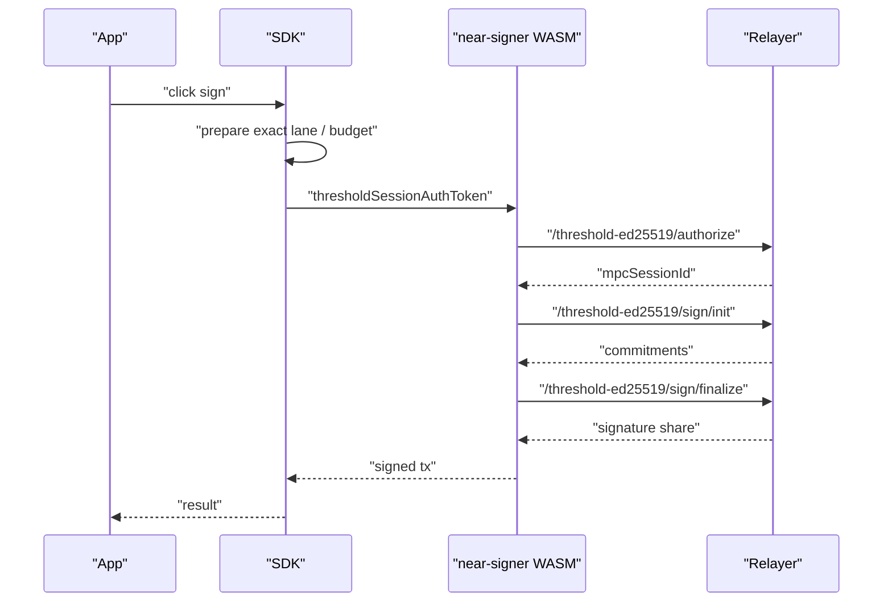

# Threshold Signing Latency Optimization Plan

Date updated: May 7, 2026

Status: implementation plan.

## Goal

Reduce click-to-sign latency for threshold signing while preserving the exact
signing-session architecture:

- one concrete signing intent
- one selected signing lane
- exact restore only on command paths
- threshold-session auth separate from app-session auth
- budget admission before signing
- no passive polling that mutates signing-session state

The primary user-visible target is the extra warm-path
`/threshold-ed25519/authorize` round trip before Ed25519 signing. The same SDK
surface should also support ECDSA transaction signing, where the useful work may
include ECDSA session readiness and presign-pool prefill.

## Current Latency Shape

### Warm Ed25519 Signing



The warm-path overhead is one lightweight authorization request before the
threshold signing rounds.

### Cold Or Exhausted Signing

Cold, expired, missing, or exhausted sessions add:

- user step-up authentication
- threshold-session minting
- restore/HSS reconstruction when needed
- budget admission for the fresh operation

This plan focuses on moving safe warm-up work earlier in the user interaction.

## SDK Design

Expose intent-driven prefetch APIs. App developers should never pass or inspect
`thresholdSessionAuthToken`, `mpcSessionId`, lane ids, restore ids, or budget
receipts.

### New Public Capability

Add a new top-level capability:

```ts
export interface SigningPrefetchCapability {
  preconnectThresholdSigning(args?: ThresholdSigningPreconnectArgs): Promise<void>;

  prepareThresholdSigningIntent(
    args: ThresholdSigningPrefetchIntent,
  ): Promise<ThresholdSigningPrefetchHandle>;

  cancelThresholdSigningPrefetch(args: {
    prefetchId: string;
  }): Promise<void>;
}
```

Expose it as:

```ts
const seams = new SeamsWeb(config);

await seams.signing.preconnectThresholdSigning();

const prefetch = await seams.signing.prepareThresholdSigningIntent({
  kind: 'near_transaction',
  nearAccountId,
  transactions,
});

await seams.near.signAndSendTransactions({
  nearAccountId,
  transactions,
  options: {
    signingPrefetchId: prefetch.prefetchId,
  },
});
```

### Public Input Types

```ts
export type ThresholdSigningPrefetchIntent =
  | {
      kind: 'near_transaction';
      nearAccountId: string;
      transactions: TransactionInput[];
      options?: {
        signerSlot?: number;
      };
    }
  | {
      kind: 'near_delegate_action';
      nearAccountId: string;
      delegate: DelegateActionInput;
      options?: {
        signerSlot?: number;
      };
    }
  | {
      kind: 'near_nep413';
      nearAccountId: string;
      params: SignNEP413MessageParams;
      options?: {
        signerSlot?: number;
      };
    }
  | {
      kind: 'evm_family_transaction';
      nearAccountId: string;
      subjectId: WalletId;
      chainTarget: ThresholdEcdsaChainTarget;
      request: MultichainSigningRequest;
    };

export type ThresholdSigningPrefetchHandle = {
  prefetchId: string;
  kind: ThresholdSigningPrefetchIntent['kind'];
  status: 'ready' | 'deferred' | 'requires_step_up' | 'expired' | 'cancelled';
  expiresAtMs: number;
  laneDigest: string;
};

export type ThresholdSigningPreconnectArgs = {
  relayerUrl?: string;
  includeWasm?: boolean;
};
```

The handle is opaque. `laneDigest` is diagnostic only and must not become an app
selection authority.

### Signing Options

Extend existing signing options with one field:

```ts
export type ThresholdSigningPrefetchOption = {
  signingPrefetchId?: string;
};
```

Apply it to:

- `SignTransactionHooksOptions`
- `SignAndSendTransactionHooksOptions`
- `DelegateActionHooksOptions`
- `SignNEP413HooksOptions`
- `SignTempoArgs` / EVM-family execution args

The signing command must verify that the prefetch handle matches the exact
current intent. If it does not match, discard it and continue through the normal
prepare path.

## React Convenience API

Add a small hook that wires hover/focus/touchstart ergonomics without exposing
internal state:

```ts
export function useThresholdSigningPrefetch(
  intent: ThresholdSigningPrefetchIntent | null,
): {
  prefetchId: string | null;
  status: ThresholdSigningPrefetchHandle['status'] | 'idle' | 'loading' | 'error';
  prefetch: () => void;
  cancel: () => void;
  eventHandlers: {
    onPointerEnter: () => void;
    onFocus: () => void;
    onTouchStart: () => void;
    onPointerLeave: () => void;
  };
};
```

Typical usage:

```tsx
const signingPrefetch = useThresholdSigningPrefetch({
  kind: 'near_transaction',
  nearAccountId,
  transactions,
});

return (
  <button
    {...signingPrefetch.eventHandlers}
    onClick={() =>
      seams.near.signAndSendTransactions({
        nearAccountId,
        transactions,
        options: {
          signingPrefetchId: signingPrefetch.prefetchId ?? undefined,
        },
      })
    }
  >
    Sign
  </button>
);
```

The hook should debounce repeated pointer events and cancel stale handles when
the intent object changes.

## Internal Model

### Prefetch State

Add a small in-memory prefetch registry:

```ts
type ThresholdSigningPrefetchEntry =
  | {
      tag: 'prepared';
      prefetchId: string;
      intentKey: string;
      preparedOperation: PreparedTransactionOperation;
      authorizedOperation?: AuthorizedThresholdSigningOperation;
      expiresAtMs: number;
      createdAtMs: number;
    }
  | {
      tag: 'requires_step_up';
      prefetchId: string;
      intentKey: string;
      authPlan: TransactionAuthPlan;
      expiresAtMs: number;
      createdAtMs: number;
    };
```

`AuthorizedThresholdSigningOperation` should be a monotonic extension of the
prepared operation:

```ts
type AuthorizedThresholdSigningOperation = PreparedTransactionOperation & {
  phase: 'threshold_authorized';
  mpcSessionId: string;
  authorizationExpiresAtMs: number;
};
```

For ECDSA, use the existing admitted transaction operation as the required
signing boundary:

```ts
type PrefetchedEcdsaSigningOperation = BudgetAdmittedTransactionOperation & {
  phase: 'threshold_authorized';
};
```

### Intent Key

Compute a canonical `intentKey` from normalized command inputs:

- command kind
- near account or wallet
- exact chain target
- transaction/message/delegate digest
- selected signer slot when present
- runtime policy scope

Signing may consume a prefetch only when the current command recomputes the same
`intentKey`.

## Implementation Phases

### Phased Todo List

Use this checklist as the progress tracker. The phase sections below keep the
file ownership and detailed implementation notes.

- [ ] Phase 1: Add threshold-signing preconnect and WASM resource warm-up.
- [ ] Phase 2: Add Ed25519 intent keys and the in-memory prefetch registry.
- [ ] Phase 3: Prefetch Ed25519 authorization and reuse matching `mpcSessionId`s.
- [ ] Phase 4: Expose SDK and iframe prefetch APIs with boundary validation.
- [ ] Phase 5: Add the React prefetch hook and stale-handle cancellation.
- [ ] Phase 6: Extend exact-intent prefetch to EVM-family signing.
- [ ] Phase 7: Keep server authorization on the bounded fast path and add timing diagnostics.

### Phase 1: Preconnect Fast Path

Files:

- `client/src/react/hooks/usePreconnectWalletAssets.ts`
- `client/src/SeamsWeb/authSessions.ts`
- `client/src/SeamsWeb/interfaces.ts`
- `client/src/SeamsWeb/index.ts`

Tasks:

- Add `seams.signing.preconnectThresholdSigning(...)`.
- Preconnect to the configured relayer origin.
- Prefetch signer WASM assets when `includeWasm !== false`.
- Keep this side-effect limited to network/resource warm-up.
- Do not read, restore, mint, or consume signing sessions.

### Phase 2: Ed25519 Intent Key And Prefetch Registry

Files:

- `client/src/core/signingEngine/session/signingSession/`
- `client/src/core/signingEngine/orchestration/near/transactionsFlow.ts`
- `client/src/core/signingEngine/orchestration/near/delegateFlow.ts`
- `client/src/core/signingEngine/orchestration/near/nep413Flow.ts`
- `client/src/core/signingEngine/SigningEngine.ts`

Tasks:

- Add `thresholdSigningPrefetchRegistry.ts`.
- Add `computeNearThresholdSigningIntentKey(...)`.
- Add exact prepared-operation storage keyed by `prefetchId`.
- Add TTL cleanup and cancellation.
- Keep registry process-local and memory-only.

### Phase 3: Ed25519 Authorize Prefetch

Files:

- `client/src/core/signingEngine/orchestration/near/shared/workerRequestAssembly.ts`
- `client/src/core/signingEngine/orchestration/near/shared/thresholdSessionAuth.ts`
- `client/src/core/signingEngine/threshold/session/ed25519AuthSession.ts`
- `wasm/near_signer/src/threshold/signer_backend.rs`
- `wasm/near_signer/src/types/signing.rs`

Tasks:

- Add an internal TS path that calls `/threshold-ed25519/authorize` once the
  exact signing digest is known.
- Store the returned `mpcSessionId` inside
  `AuthorizedThresholdSigningOperation`.
- Extend worker request assembly to prefer `mpcSessionId` from a matching
  prefetch.
- Keep `thresholdSessionAuthToken` as the fallback session capability when a
  matching prefetch is unavailable.
- Expire prefetched `mpcSessionId` aggressively.

### Phase 4: SDK And Iframe API

Files:

- `client/src/SeamsWeb/interfaces.ts`
- `client/src/SeamsWeb/index.ts`
- `client/src/index.ts`
- `client/src/react/index.ts`
- `client/src/core/WalletIframe/shared/messages.ts`
- `client/src/core/WalletIframe/client/router.ts`
- `client/src/core/WalletIframe/host/wallet-iframe-handlers.ts`

Tasks:

- Add `SigningPrefetchCapability`.
- Add iframe messages:
  - `PM_PRECONNECT_THRESHOLD_SIGNING`
  - `PM_PREPARE_THRESHOLD_SIGNING_INTENT`
  - `PM_CANCEL_THRESHOLD_SIGNING_PREFETCH`
- Thread `signingPrefetchId` through existing sign messages.
- Validate all raw iframe payloads at the iframe boundary.
- Convert payloads into typed internal intents immediately.

### Phase 5: React Hook

Files:

- `client/src/react/hooks/useThresholdSigningPrefetch.ts`
- `client/src/react/index.ts`

Tasks:

- Implement hover/focus/touchstart prefetch.
- Debounce duplicate triggers.
- Cancel on unmount or intent change.
- Return `signingPrefetchId` for the final sign call.
- Keep UI components free of threshold-session auth-token details.

### Phase 6: EVM-Family Integration

Files:

- `client/src/core/signingEngine/api/evmFamily/preparedSigning.ts`
- `client/src/core/signingEngine/api/evmSigning.ts`
- `client/src/core/signingEngine/api/tempoSigning.ts`
- `client/src/core/signingEngine/orchestration/walletOrigin/thresholdEcdsaCoordinator.ts`
- `client/src/SeamsWeb/tempo/index.ts`
- `client/src/SeamsWeb/evm/index.ts`

Tasks:

- Reuse the SDK prefetch surface for EVM-family transaction intents.
- Prefetch only exact target readiness:
  - concrete `subjectId`
  - concrete `chainTarget`
  - selected lane identity
  - budget-admitted operation when possible
- For ECDSA, trigger presign-pool refill when the selected lane has enough
  session budget and a matching prefetch intent.
- Return `requires_step_up` when fresh auth is needed.

### Phase 7: Server Fast Path

Files:

- `server/src/router/express/routes/thresholdEd25519.ts`
- `server/src/router/cloudflare/routes/thresholdEd25519.ts`
- `server/src/core/ThresholdService/ThresholdSigningService.ts`
- `server/src/core/ThresholdService/validation.ts`

Tasks:

- Keep `/threshold-ed25519/authorize` as a pure fast path:
  - validate token claims
  - check exact session id and wallet signing-session id
  - check expiration and remaining budget
  - bind purpose and digest
  - return `mpcSessionId`
- Avoid restore, HSS reconstruction, durable sealed reads, broad lookup, or
  prompt behavior in this route.
- Add lightweight timing diagnostics for authorize latency.

## Acceptance Criteria

- Warm Ed25519 click-to-sign path can skip `/authorize` when a matching
  prefetched `mpcSessionId` exists.
- Prefetch never signs, broadcasts, consumes finalization budget, or prompts the
  user.
- Status reads never restore, mint sessions, consume budget, or prompt.
- Signing commands reject or discard stale prefetch handles.
- App developers use `signingPrefetchId`; they never handle
  `thresholdSessionAuthToken` or `mpcSessionId`.
- Wallet iframe and local SDK paths share the same typed intent model.
- `/threshold-ed25519/authorize` remains a bounded server fast path.
- ECDSA prefetch only uses concrete `subjectId` and `chainTarget`.

## Focused Tests

Add targeted tests for:

- prefetch handle matches exact NEAR transaction intent and is consumed
- changed transaction digest discards the prefetched operation
- expired prefetch falls back to normal signing
- hover prefetch performs no signing and no broadcast
- status polling does not mint or restore threshold sessions
- iframe payload validation rejects partial prefetch intents
- ECDSA prefetch rejects missing `subjectId` or `chainTarget`
- ECDSA prefetch cannot cross chain targets

## Metrics

Add timing marks for:

- preconnect start/end
- prefetch prepare duration
- `/threshold-ed25519/authorize` duration
- click-to-sign duration with prefetch hit
- click-to-sign duration with prefetch miss
- stale-prefetch discard count

Report metrics as debug diagnostics first. Product analytics can be added after
the behavior is stable.
