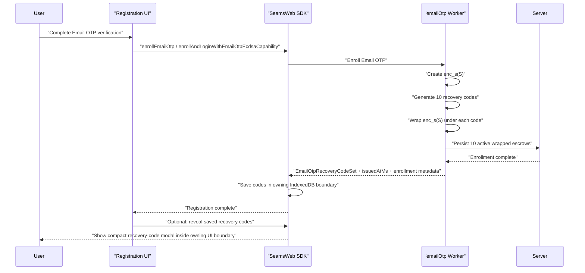

# Email OTP Recovery Codes UI Plan

Status: implemented; broad cleanup and commit pending.

This plan adds the product UI for backing up the 10 Email OTP recovery codes
generated during Email OTP enrollment. The cryptographic recovery mechanism
already exists in the worker/server model; this plan makes the backup step
available through an explicit wallet-owned UI, retained for redisplay, and
testable.

## Recovery Mechanism

Email OTP enrollment creates device-local enrollment escrow:

```text
enc_s(S)
```

`S` is the Email OTP client secret. `enc_s(S)` is stored in wallet-iframe
IndexedDB for same-device login. If local IndexedDB is lost, the user needs one
recovery code to restore `enc_s(S)`.

During enrollment, the Email OTP worker generates 10 one-time recovery keys:

```text
recovery_key_1 ... recovery_key_10
```

For each recovery key, the worker derives a recovery wrapping key and encrypts
the same device-local escrow:

```text
C_i = ChaCha20-Poly1305_Encrypt(K_recovery_i, enc_s(S))
```

With this UI lifecycle, the server stores 10 recovery-wrapped enrollment escrow
records:

```ts
type EmailOtpRecoveryWrappedEnrollmentEscrowRecord = {
  walletId: string;
  userId: string;
  authSubjectId: string;
  authMethod: 'google_sso_email_otp';
  enrollmentId: string;
  enrollmentVersion: string;
  enrollmentSealKeyVersion: string;
  signingRootId: string;
  signingRootVersion: string;
  recoveryKeyId: string;
  recoveryKeyStatus: 'active' | 'consumed' | 'revoked';
  nonceB64u: string;
  wrappedDeviceEnrollmentEscrowB64u: string;
  aadHashB64u: string;
  issuedAtMs: number;
  updatedAtMs: number;
};
```

Implement the lifecycle as a discriminated union in TypeScript. Avoid optional
timestamp bags in core logic. Boundary parsers may accept raw persistence rows,
then must normalize them into one of these valid lifecycle branches:

```ts
type EmailOtpRecoveryWrappedEnrollmentEscrowLifecycle =
  | {
      recoveryKeyStatus: 'active';
      consumedAtMs?: never;
      revokedAtMs?: never;
    }
  | {
      recoveryKeyStatus: 'consumed';
      consumedAtMs: number;
      revokedAtMs?: never;
    }
  | {
      recoveryKeyStatus: 'revoked';
      consumedAtMs?: never;
      revokedAtMs: number;
    };
```

Enrollment persists active recovery-wrapped escrow records immediately. The
wallet-owned IndexedDB backup record controls whether the user can redisplay the
plaintext codes on the same device; it does not gate server-side recovery-code
activation.

The server never stores the plaintext recovery keys, plaintext `enc_s(S)`,
plaintext `S`, recovery KEKs, or derived signing material.

Relevant implementation surfaces:

1. SDK enrollment result recovery-code field in
   `client/src/SeamsWeb/interfaces.ts`.
2. recovery key generation and wrapping in
   `client/src/core/signingEngine/workerManager/workers/email-otp.worker.ts`.
3. formatting/normalization helpers in
   `shared/src/utils/emailOtpRecoveryKey.ts`.
4. server-side consume and failure routes:
   - `POST /wallet/email-otp/recovery-key/consume`
   - `POST /wallet/email-otp/recovery-key/attempt-failed`
5. recovery unwrap prompt support in `SeamsAuthMenu` for entering one recovery
   key on a new device or after local storage loss.

## Product Goal

After Email OTP enrollment succeeds, save the 10 generated recovery codes in the
owning UI boundary's IndexedDB and let registration complete. The frontend may
then call the SDK to briefly reveal those saved recovery codes in a compact
modal. In wallet-iframe mode, the modal is rendered by the wallet iframe and the
host page never receives the plaintext codes.

User-facing term:

```text
recovery code
```

Internal term:

```text
recovery key
```

The UI should never call them "secrets" in user-facing copy. "Recovery code" is
clearer and matches account-recovery expectations.

## Non-Goals

1. Do not store plaintext recovery codes in localStorage, sessionStorage,
   analytics, logs, or server state.
2. Store generated plaintext recovery codes in IndexedDB only in the dedicated
   wallet-owned recovery-code backup store defined in Phase 6.
3. Do not email recovery codes to the user.
4. Do not allow server-side recovery without one user-held recovery code.
5. Do not use recovery codes for transaction signing or key export.
6. Do not couple recovery-code backup to passkey recovery or NEAR account
   recovery.
7. Do not automatically delete saved recovery codes because the modal is closed
   or a download succeeds. Deletion must be an explicit user action or a scoped
   wallet/account cleanup policy.

## UX Flow



## Recovery-Code Modal Requirements

Create a dedicated recovery-code modal that can be shown after Email OTP
enrollment by an explicit frontend SDK call. Registration should not be blocked
on this modal.

Screen content:

1. Title: `Email OTP recovery codes`
2. Explanation: these codes restore Email OTP access if this browser/device is
   lost.
3. Warning: each code can be used once.
4. Warning: losing all codes may prevent restoring Email OTP on a new device.
5. The 10 codes in a scannable numbered list.
6. Primary `Download recovery codes` action.
7. Close button matching the existing export-key modal pattern.

Suggested copy:

```text
Email OTP recovery codes

These codes restore Email OTP access if this browser or device is lost.
Each code can be used once. Store them somewhere private, like a password
manager.
```

Recovery code display:

```text
01  008J-4CT4-ANK7-F24S-NAXW-SQFE-ZW83-4N3P
02  ...
...
10  ...
```

Use the existing formatting from `formatEmailOtpRecoveryKey(...)`. Codes are
8 groups of 4 Crockford Base32 characters.

## Confirmation Policy

First implementation:

1. `Download recovery codes` is the only required action in the modal.
2. Closing the modal does not delete the saved IndexedDB recovery-code record.
3. Downloading the codes does not delete the saved IndexedDB recovery-code
   record.
4. Registration completion is not gated on displaying, downloading, or
   acknowledging recovery codes.
5. The server does not receive modal completion metadata for the registration
   modal.
6. React state may drop plaintext codes when the modal closes because the owning
   IndexedDB boundary remains the source of truth for redisplay.
7. If the wallet iframe reloads, the recovery-code menu can redisplay saved codes
   from the wallet iframe's IndexedDB for the matching logged-in OTP account.

Download semantics:

1. Download succeeds after the component builds the file from the saved
   recovery-code record, creates a Blob URL, dispatches the download click
   without throwing, and schedules URL revocation.
2. A thrown browser error keeps the codes visible and reports a local UI error.
3. The modal records only the non-secret fact that a download was attempted or
   completed.

## State Ownership

Plaintext recovery codes may exist only in:

1. worker memory during generation.
2. the direct SDK enrollment result returned to a trusted same-origin
   registration UI.
3. wallet-iframe internal messages and wallet-iframe UI memory while the
   recovery-code modal is displayed.
4. the dedicated wallet-owned recovery-code IndexedDB store after enrollment,
   until explicit deletion or scoped wallet/account cleanup.
5. downloaded file or password manager after explicit user action.

Plaintext recovery codes must not exist in:

1. server storage.
2. IndexedDB outside the dedicated wallet-owned recovery-code store.
3. localStorage or sessionStorage.
4. logs.
5. analytics or telemetry events.
6. SDK progress events.
7. crash reports.
8. wallet-iframe host RPC payloads.

Wallet-iframe mode has a stricter presentation boundary than direct SDK mode.
The wallet iframe owns the recovery-code modal and returns only non-secret modal
status metadata to the host page. The host page must never receive generated
`recoveryKeys` through iframe RPC, logs, progress events, or registration result
payloads.

IndexedDB may store generated plaintext recovery codes only in the owning wallet
boundary for the matching OTP account. It must never store recovery wrapping
keys, recovery KEKs, `enc_s(S)` for backup display, or a serialized modal
payload.

Allowed backup metadata and retained plaintext state:

```ts
type StoredEmailOtpRecoveryCodeBackupLifecycle =
  {
    status: 'stored';
    walletId: string;
    enrollmentId: string;
    recoveryCodeCount: 10;
    issuedAtMs: number;
    createdAtMs: number;
    lastDisplayedAtMs: number | null;
    lastDownloadedAtMs: number | null;
  };

type StoredEmailOtpRecoveryCodeBackupRecord = {
  v: 1;
  secretKind: 'email_otp_recovery_codes_backup';
  storageScope: 'iframe_origin_indexeddb' | 'host_origin_indexeddb';
  walletId: string;
  enrollmentId: string;
  enrollmentSealKeyVersion: string;
  recoveryCodesIssuedAtMs: number;
  recoveryKeys: EmailOtpRecoveryCodeSet;
  createdAtMs: number;
  lastDisplayedAtMs: number | null;
  lastDownloadedAtMs: number | null;
};
```

The stored backup record is the wallet-owned plaintext copy used for redisplay
and download. Closing the modal or downloading the file updates non-secret local
metadata only; it does not delete the record. The server-side wrapped recovery
escrows are active after enrollment and remain the source of truth for recovery
consumption, active counts, revocation, and rotation.

## UI Integration Points

### SDK Result

Internal enrollment handling must carry a normalized fixed-size recovery-code set
and the issuance timestamp used for the backup file:

```ts
declare const emailOtpRecoveryCodeBrand: unique symbol;

type EmailOtpRecoveryCode = string & {
  readonly [emailOtpRecoveryCodeBrand]: true;
};

type EmailOtpRecoveryCodeSet = readonly [
  EmailOtpRecoveryCode,
  EmailOtpRecoveryCode,
  EmailOtpRecoveryCode,
  EmailOtpRecoveryCode,
  EmailOtpRecoveryCode,
  EmailOtpRecoveryCode,
  EmailOtpRecoveryCode,
  EmailOtpRecoveryCode,
  EmailOtpRecoveryCode,
  EmailOtpRecoveryCode,
];

type EmailOtpEnrollmentResult = {
  challengeId: string;
  otpChannel: WalletEmailOtpChannel;
  enrollmentSealKeyVersion: string;
  clientUnlockPublicKeyB64u: string;
  unlockKeyVersion: string;
  thresholdEcdsaClientVerifyingShareB64u: string;
};
```

Enrollment must generate exactly 10 normalized recovery codes with an issuance
timestamp or fail. The public enrollment result should not expose plaintext
codes in wallet-iframe mode. The SDK stores the generated code set in the owning
IndexedDB boundary and exposes a separate frontend-triggered recovery-code modal
operation for logged-in OTP accounts.

Direct same-origin SDK integrations may receive the generated code set only when
the calling UI is the trusted owner of the IndexedDB store and can immediately
persist it. Wallet-iframe integrations must keep the generated codes inside the
iframe boundary.

Validate and normalize raw worker output once at the worker/SDK boundary with
`normalizeEmailOtpRecoveryKey(...)`, then pass `EmailOtpRecoveryCodeSet` through
internal UI code.

Add a named parser/builder for this boundary. Existing raw `string[]` enrollment
results must be replaced at the public SDK surface. Add static type fixtures that
reject:

1. arbitrary `string[]` recovery-code sets.
2. missing `recoveryCodesIssuedAtMs`.
3. iframe host result payloads containing `recoveryKeys`.
4. broad object spreads that bypass the builder.
5. direct casts from raw worker output to `EmailOtpRecoveryCodeSet`.

### React Component

Add a component:

```text
client/src/react/components/EmailOtpRecoveryCodesModal/
```

Suggested files:

```text
EmailOtpRecoveryCodesModal.tsx
EmailOtpRecoveryCodesModal.css
index.ts
```

Props:

```ts
type EmailOtpRecoveryCodesModalBaseProps = {
  walletId: string;
  recoveryCodes: EmailOtpRecoveryCodeSet;
  recoveryCodesIssuedAtMs: number;
  onClose(): void;
};

type EmailOtpRecoveryCodesModalProps = EmailOtpRecoveryCodesModalBaseProps;
```

Rules:

1. `recoveryCodes` is already a normalized `EmailOtpRecoveryCodeSet`.
2. The boundary normalizer enforces exactly 10 codes.
3. The component formats with `formatEmailOtpRecoveryKey(...)`.
4. Download is visually primary.
5. The component reads and writes generated codes only through the wallet-owned
   recovery-code repository from Phase 6.
6. The component clears any local downloaded text buffer after action completion
   where the browser API permits it.
7. The component clears React plaintext code state on unmount.
8. The component reloads codes from the recovery-code repository only for the
   logged-in OTP account and matching wallet identifiers.
9. The component records successful download as non-secret local metadata.
10. Closing the modal does not delete the stored recovery-code record.

### Registration Flow

Wire recovery-code storage after successful Email OTP enrollment:

1. `SeamsWeb.auth.enrollEmailOtp(...)`
2. `SeamsWeb.auth.enrollAndLoginWithEmailOtpEcdsaCapability(...)`
3. wallet-iframe registration flows inside the iframe UI boundary.

Registration completes after enrollment. Showing recovery codes after
registration is optional and must be triggered by frontend code calling the SDK
to open the recovery-code modal.

Direct SDK mode boundary:

```text
worker returns EmailOtpRecoveryCodeSet
  -> SDK validates EmailOtpRecoveryCodeSet
  -> trusted same-origin UI stores StoredEmailOtpRecoveryCodeBackupRecord
  -> registration completes
  -> frontend may call SDK to display the compact modal
```

Wallet-iframe mode boundary:

```text
worker returns EmailOtpRecoveryCodeSet inside wallet iframe
  -> wallet iframe stores StoredEmailOtpRecoveryCodeBackupRecord
  -> registration completes
  -> host may request the iframe-owned modal through SDK API
  -> wallet iframe displays/downloads without sending codes to host
```

Iframe RPC payloads to host code must carry only non-secret lifecycle metadata.
They must never carry generated `recoveryKeys`.

This is a breaking iframe contract change. The iframe-owned routes
`PM_ENROLL_EMAIL_OTP` and `PM_ENROLL_LOGIN_EMAIL_OTP_ECDSA_CAPABILITY` must stop
returning generated recovery-code arrays to the host. In wallet-iframe mode, the
iframe renders the modal, keeps the saved codes in its IndexedDB, and returns
only non-secret modal status metadata to host code.

Server lifecycle and local-code cleanup:

1. Enrollment persists the 10 recovery-wrapped escrows with
   `recoveryKeyStatus: 'active'`.
2. Active records are included in recovery-code status and may be consumed by
   recovery use immediately after enrollment.
3. The local stored recovery-code record is retained after modal close and after
   download.
4. Account reset, wallet reset, future explicit deletion, or rotation replacement
   may remove the local stored recovery-code record according to product policy.
5. Rotation creates a fresh stored recovery-code record and replaces the old
   active server-side recovery-wrapped escrow set.

## Download Format

Downloaded file name:

```text
seams-email-otp-recovery-codes-<walletId>.txt
```

Build `<walletId>` from a filename-safe wallet label by allowing ASCII letters,
digits, `_`, `.`, and `-`, and replacing every other character with `_`.

File body:

```text
Seams Email OTP recovery codes

Wallet: <walletId>
Created: <ISO timestamp>

Store these codes somewhere private. Each code can be used once.

01  <code>
02  <code>
...
10  <code>
```

`Created` is derived from `recoveryCodesIssuedAtMs`, formatted as an ISO
timestamp at render/download time.

The file must not include `enc_s(S)`, `S`, recoveryKeyId values, session ids,
threshold key ids, or signing roots.

Download implementation rules:

1. Build the file contents from the stored recovery-code record loaded into
   modal memory.
2. Use a Blob URL and revoke it immediately after triggering the download.
3. Do not store the generated text in component state after the click handler
   returns.
4. Record only the non-secret fact that a download action completed.
5. If download fails, keep the codes visible and show a local error.

## Account Settings Follow-Up

Add an account-settings section reachable from the profile menu:

```text
Email OTP recovery codes
```

Profile-menu entrypoint:

1. Add `PROFILE_MENU_ITEM_IDS.RECOVERY_CODES`.
2. Add a menu item with label `Recovery Codes`.
3. Render the compact recovery-code modal from `AccountMenuButton` using the
   same portal pattern as linked devices and key export.
4. Show the item only for logged-in OTP accounts with saved recovery codes in the
   owning IndexedDB boundary.
5. In wallet-iframe mode, the menu action asks the iframe to open the modal; the
   host page never receives the saved codes.
6. Fetch server status on open only to verify the account still has Email OTP
   recovery enabled and to show supporting active/consumed counts.
7. Redisplay plaintext recovery codes from the matching wallet-owned IndexedDB
   record regardless of whether the modal was previously dismissed or the codes
   were previously downloaded.

Files:

1. `client/src/react/components/AccountMenuButton/types.ts`
2. `client/src/react/components/AccountMenuButton/index.tsx`
3. recovery-code modal component files

Modal display:

1. the 10 saved recovery codes.
2. primary `Download recovery codes` action.
3. close button matching the export-key modal.
4. optional supporting active/consumed/revoked counts from server status.
5. optional explicit delete action only if product decides to expose deletion.

Required server routes for full lifecycle:

1. `POST /wallet/email-otp/recovery-key/status`
2. `POST /wallet/email-otp/recovery-key/consume`
3. `POST /wallet/email-otp/recovery-key/attempt-failed`
4. `POST /wallet/email-otp/recovery-key/rotate`

Do not add a standalone user-facing revoke route in the first implementation.
Revocation is an internal lifecycle transition used by rotation, account reset,
and wallet reset. A dedicated revoke route can be added later only if a product
flow needs it.

Rotation behavior:

1. Requires fresh Email OTP or equivalent account auth.
2. Rewraps current `enc_s(S)` under 10 newly generated recovery codes.
3. Atomically replaces the active server-side recovery-wrapped escrow set.
4. Displays the new 10 codes in the same compact recovery-code modal.
5. Marks old active codes revoked and keeps consumed/revoked records for
   non-secret audit and status counts.

Successful device recovery currently returns
`activeRecoveryWrappedEnrollmentEscrowCount`. If the count drops below 10, prompt
the user to rotate and restore the set to 10 active recovery codes.

## Error Handling

Recovery-code modal errors:

1. Missing local recovery-code record: show a local-device unavailable state and
   offer rotation when server status says Email OTP recovery is active.
2. Download failure: keep the codes visible and show a local retry error.
3. User closes the modal: drop React plaintext state and keep the saved
   IndexedDB record for future redisplay.

Recovery use errors:

1. Invalid format: validate locally before server interaction.
2. Wrong code: report failure through
   `/wallet/email-otp/recovery-key/attempt-failed`.
3. Consumed/revoked code: show a clear recovery-code error.
4. Active count below 10 after successful recovery: show rotation prompt.

## Security Requirements

1. Never log plaintext recovery codes.
2. Never include plaintext recovery codes in SDK events.
3. Never include plaintext recovery codes in server route payloads. A
   user-entered recovery code may travel only in the local worker unwrap request.
4. Never send generated recovery codes back to the server during enrollment.
5. Redact `recoveryKeys` in debug output and error serialization.
6. Add static/architecture tests that fail if `recoveryKeys` appears in
   telemetry, analytics, or progress event payloads.
7. Browser autocomplete should be disabled for recovery-code display and entry
   fields.
8. Recovery-code entry should accept paste and normalize spaces/dashes.
9. Store generated recovery codes in IndexedDB only in the dedicated
   wallet-owned recovery-code store for the matching OTP wallet.
10. Wallet-iframe host RPC payloads must never include generated `recoveryKeys`.
11. Modal open/download status payloads must contain only non-secret metadata.

## Regression Warnings

1. Do not reintroduce a required backup-completion gate. New enrollment records
   are active immediately after enrollment.
2. Do not preserve old iframe result payloads that expose generated
   `recoveryKeys` to host pages. Wallet-iframe backup is iframe-owned.
3. Do not keep public recovery-code types as raw `string[]`. Normalize once at
   the worker/SDK boundary into a fixed-size `EmailOtpRecoveryCodeSet`.
4. Do not make `recoveryKeys`, identity fields, or lifecycle timestamps optional
   in core types.
5. Do not persist plaintext recovery codes outside the dedicated wallet-owned
   recovery-code store. Modal close and download must not delete that store.
6. Do not patch tests around obsolete behavior. Delete or rewrite fixtures that
   encode mandatory backup completion, raw recovery-code arrays, or iframe host
   `recoveryKeys` payloads unless they are intentionally testing request or
   persistence boundary rejection.

## Implementation Steps

### Phase 1: Current Surface Audit

- [x] Confirm every Email OTP enrollment path generates an `EmailOtpRecoveryCodeSet`
   with exactly 10 normalized `recoveryKeys` and `recoveryCodesIssuedAtMs`.
- [x] Confirm generated codes are written to the owning recovery-code IndexedDB
   store before registration completes.
- [x] Confirm wallet-iframe host RPC payloads never expose generated
   `recoveryKeys`; the iframe owns modal display and returns only non-secret
   modal status metadata.
- [x] Confirm SDK progress events do not include `recoveryKeys`.
- [x] Confirm logs redact `recoveryKeys`.
- [x] Confirm IndexedDB persists `recoveryKeys` only in the dedicated
   wallet-owned recovery-code store, and confirm localStorage/sessionStorage
   never persist `recoveryKeys` or generated recovery-code text.
- [x] Identify tests, helpers, and fixtures that assume mandatory backup completion
   or delayed server activation.
- [x] Identify iframe host message types and handlers that currently return
   `recoveryKeys` to host code.

Files:

1. `client/src/SeamsWeb/interfaces.ts`
2. `client/src/SeamsWeb/emailOtp.ts`
3. `client/src/SeamsWeb/index.ts`
4. `client/src/core/WalletIframe/shared/messages.ts`
5. `client/src/core/WalletIframe/router.ts`
6. `client/src/core/WalletIframe/host/wallet-iframe-handlers.ts`
7. `client/src/core/signingEngine/workerManager/workers/email-otp.worker.ts`

### Phase 2: Server Lifecycle Hardening

- [x] Keep enrollment output as active recovery-wrapped escrows.
- [x] Remove backup-completion lifecycle requirements from recovery-code
   registration.
- [x] Remove obsolete backup-acknowledgement public API, iframe RPC, and server
   route surfaces.
- [x] Rename local-backup enrollment metadata and iframe host helper code away
   from obsolete backup-acknowledgement terminology.
- [x] Model recovery-wrapped escrow lifecycle as a discriminated union with
   branch-specific timestamps and `never` fields for invalid timestamps.
- [x] Ensure active records are included in
   `activeRecoveryWrappedEnrollmentEscrowCount`.
- [x] Ensure consumed and revoked records cannot be consumed again.
- [x] Update Postgres and in-memory stores together.
- [x] Delete or rewrite delayed-activation fixtures that only protect obsolete
   behavior.

Files:

1. `client/src/core/signingEngine/workerManager/workers/email-otp.worker.ts`
2. `server/src/core/EmailOtpStores.ts`
3. `server/src/core/EmailOtpPostgresRecords.ts`
4. `server/src/router/routeDefinitions.ts`
5. `server/src/router/express/routes/sessions.ts`
6. `server/src/router/cloudflare/routes/sessions.ts`
7. `server/src/router/emailOtpRouteHandlers.ts`
8. `tests/unit/emailOtpRecoveryWrappedEnrollmentEscrowStore.unit.test.ts`
9. `tests/relayer/email-otp.routes.test.ts`
10. `tests/relayer/helpers.ts`

### Phase 3: SDK And Iframe Boundary Contracts

- [x] Add an `EmailOtpRecoveryCode` brand and fixed-size
   `EmailOtpRecoveryCodeSet`.
- [x] Add a boundary parser/builder that validates exactly 10 normalized recovery
   codes and `recoveryCodesIssuedAtMs`.
- [x] Replace raw `string[]` recovery-code public result types.
- [x] Add public SDK type fixtures rejecting raw recovery-code arrays and optional
   recovery-code fields.
- [x] Add type/source fixtures rejecting broad spreads and direct casts from
   worker output into core recovery-code domain types.
- [x] Change wallet-iframe enrollment routes so generated recovery codes remain
   inside the iframe boundary.
- [x] Add an SDK operation that lets frontend code ask the owning boundary to open
   the recovery-code modal for the logged-in OTP account.
- [x] Return only non-secret modal status metadata to host code.
- [x] Add architecture/static tests that fail if iframe host RPC payloads include
   generated `recoveryKeys`.

Files:

1. `client/src/SeamsWeb/interfaces.ts`
2. `client/src/SeamsWeb/emailOtp.ts`
3. `client/src/core/signingEngine/workerManager/workerTypes.ts`
4. `client/src/core/WalletIframe/shared/messages.ts`
5. `client/src/core/WalletIframe/host/handlers/emailOtp.ts`
6. `client/src/core/WalletIframe/client/router.ts`
7. SDK/public typecheck fixtures

### Phase 4: Backup Component

- [x] Add `EmailOtpRecoveryCodesModal`.
- [x] Accept `EmailOtpRecoveryCodeSet` and `recoveryCodesIssuedAtMs` props.
- [x] Use existing recovery-key formatting helpers.
- [x] Add primary download action.
- [x] Add close button matching the export-key modal.
- [x] Keep the layout compact enough for account-menu use.
- [x] Record download metadata without deleting the stored recovery-code record.
- [x] Add redaction-safe component tests.

Files:

1. `client/src/react/components/EmailOtpRecoveryCodesModal/**`
2. `shared/src/utils/emailOtpRecoveryKey.ts`
3. `tests/unit/emailOtpRecoveryCodesModal.unit.test.ts`

### Phase 5: Registration UI Integration

- [x] Store generated recovery codes after `enrollEmailOtp`.
- [x] Store generated recovery codes after
   `enrollAndLoginWithEmailOtpEcdsaCapability`.
- [x] Render wallet-iframe recovery-code modal inside the iframe boundary when the
   frontend requests it through the SDK.
- [x] Let registration complete without showing the recovery-code modal.
- [x] Drop React plaintext state after modal close while retaining the IndexedDB
   recovery-code record.
- [x] Persist non-secret display/download metadata if the product needs a
   last-shown or last-downloaded indicator.

Likely integration points:

1. `client/src/react/components/SeamsAuthMenu/**`
2. demo registration/login containers that call `seams.auth.enrollEmailOtp`
3. wallet-iframe registration UI surfaces
4. wallet-iframe host handlers that receive non-secret modal status metadata

### Phase 6: Wallet-Owned Recovery-Code IndexedDB Store

Goal: keep generated recovery codes available to the owning wallet UI after
registration, after modal dismissal, after download, and after wallet-iframe
reloads. The store is scoped to the origin that owns the recovery-code modal. In
wallet-iframe mode, that origin is the wallet iframe.

State model:

```ts
type StoredEmailOtpRecoveryCodeBackupLifecycle =
  {
    status: 'stored';
  };

type StoredEmailOtpRecoveryCodeBackupRecord =
  StoredEmailOtpRecoveryCodeBackupLifecycle & {
    v: 1;
    secretKind: 'email_otp_recovery_codes_backup';
    storageScope: 'iframe_origin_indexeddb' | 'host_origin_indexeddb';
    walletId: string;
    enrollmentId: string;
    enrollmentSealKeyVersion: string;
    recoveryCodesIssuedAtMs: number;
    recoveryKeys: EmailOtpRecoveryCodeSet;
    createdAtMs: number;
    lastDisplayedAtMs: number | null;
    lastDownloadedAtMs: number | null;
  };
```

Implementation steps:

- [x] Add a new `seams_wallet` object store for Email OTP recovery-code backups.
- [x] Bump `SEAMS_WALLET_DB_VERSION` and add the store to
   `SEAMS_WALLET_SCHEMA_MANIFEST`.
- [x] Use a composite key of `[wallet_id, enrollment_id]`.
- [x] Add indexes for `wallet_id`, `enrollment_id`, `status`, and
   `recovery_codes_issued_at_ms`.
- [x] Add a repository module:

   ```text
   client/src/core/indexedDB/seamsWalletDB/emailOtpRecoveryCodeBackups.ts
   ```

- [x] Normalize raw rows at the repository boundary into
   `StoredEmailOtpRecoveryCodeBackupRecord`.
- [x] Require `recoveryKeys` to parse through the fixed-size
   `EmailOtpRecoveryCodeSet` builder. Reject raw `string[]` in core helpers.
- [x] Reject records with missing wallet identity, enrollment identifiers,
   timestamps, or invalid lifecycle branch timestamps.
- [x] Reject records whose `secretKind` is anything other than
   `email_otp_recovery_codes_backup`.
- [x] Write the record immediately after enrollment returns generated codes.
- [x] In wallet-iframe mode, write the record inside the wallet iframe origin. The
    host page must never receive the record or `recoveryKeys`.
- [x] In direct SDK mode, write the record in the SDK origin that owns the
    same-origin registration UI.
- [x] On opening the `Recovery Codes` menu item, read the matching record by
    `walletId`, `enrollmentId`, and `enrollmentSealKeyVersion`.
- [x] If a matching stored record exists, show the compact recovery-code modal with
    the stored codes and a `Download` button.
- [x] If no matching stored record exists, show a local-device unavailable state
    and offer rotation when server status says Email OTP recovery is active.
- [x] After a successful download, update `lastDownloadedAtMs`; do not delete the
    record.
- [x] After the modal is displayed, update `lastDisplayedAtMs`; do not delete the
    record.
- [x] Delete records only for explicit user deletion, wallet reset, account reset,
    or rotation replacement. Deletion removes the row instead of keeping a
    plaintext tombstone.
- [x] Never sync this store, export it, include it in diagnostics, or expose it
    through public API payloads.

Files:

1. `client/src/core/indexedDB/schemaNames.ts`
2. `client/src/core/indexedDB/seamsWalletDB/schema.ts`
3. `client/src/core/indexedDB/seamsWalletDB/emailOtpRecoveryCodeBackups.ts`
4. `client/src/web/SeamsWeb/operations/authMethods/emailOtp/recoveryCodeBackup.ts`
5. `client/src/web/SeamsWeb/operations/registration/registration.ts`
6. `client/src/web/SeamsWeb/walletIframe/host/handlers/emailOtp.ts`
7. `client/src/react/components/AccountMenuButton/RecoveryCodesModal.tsx`
8. `tests/unit/emailOtpRecoveryCodeBackups.unit.test.ts`
9. `tests/unit/seamsWeb.emailOtpRecoveryCodeBackup.unit.test.ts`
10. `tests/unit/walletIframeHost.emailOtpRecoveryCodes.unit.test.ts`

Static guard updates:

1. Keep the existing escrow-store guard that rejects `recoveryKeys` in
   `email_otp_escrows`.
2. Add an allowlist guard so `recoveryKeys` may appear only in:
   - worker generation output.
   - enrollment result boundary parsers.
   - recovery-code backup repository.
   - recovery-code modal rendering/download code.
   - boundary rejection tests.
3. Add a guard that fails if `StoredEmailOtpRecoveryCodeBackupRecord` appears
   in server code, iframe host-to-parent message payloads, progress events, logs,
   telemetry, or public non-registration APIs.

Validation:

- [x] Repository unit tests prove invalid branch combinations are rejected.
- [x] Repository unit tests prove raw `string[]` recovery-code arrays are rejected.
- [x] Repository unit tests prove modal close and download update metadata without
   deleting recovery codes.
- [x] Recovery-code modal tests prove codes can be restored from wallet-owned
   IndexedDB after reload.
- [x] Account menu tests prove stored codes are displayed only for the matching
   Email OTP wallet/enrollment.
- [x] Account menu tests prove missing local records show the unavailable state
   without attempting to recover plaintext codes from the server.
- [x] Iframe tests prove host responses still contain no generated `recoveryKeys`.
- [x] Static guards prove generated recovery codes are not written to localStorage,
   sessionStorage, logs, telemetry, or server route payloads.

### Phase 7: Settings And Rotation

- [x] Add recovery-code status route.
- [x] Harden existing status, consume, and attempt-failed routes against the
   Phase 10 route contracts and boundary parsers.
- [x] Derive `recoveryKeyId` from the normalized recovery code and enrollment
   binding, then remove `recoveryKeyId` from recovery challenge payloads.
- [x] Add internal revoke transition for rotation.
- [x] Add rotate route.
- [x] Add `PROFILE_MENU_ITEM_IDS.RECOVERY_CODES`.
- [x] Add a `Recovery Codes` menu item in `AccountMenuButton`.
- [x] Add compact recovery-code modal UI reachable from that menu item.
- [x] Add rotate flow using the same modal component.
- [x] Prompt rotation after recovery when active count is below 10.

Server files:

1. `server/src/router/routeDefinitions.ts`
2. `server/src/router/express/routes/sessions.ts`
3. `server/src/router/cloudflare/routes/sessions.ts`
4. `server/src/core/AuthService.ts`
5. `server/src/core/EmailOtpStores.ts`

Client files:

1. `client/src/SeamsWeb/emailOtp.ts`
2. `client/src/core/WalletIframe/shared/messages.ts`
3. `client/src/react/components/AccountMenuButton/types.ts`
4. `client/src/react/components/AccountMenuButton/index.tsx`
5. account settings recovery-code UI modules

### Phase 8: Tests

Add tests for:

- [x] enrollment result contains an `EmailOtpRecoveryCodeSet` with exactly 10
   formatted recovery codes.
- [x] frontend-triggered recovery-code modal renders all 10 saved codes.
- [x] Download recovery codes is the primary action.
- [x] modal close does not delete the IndexedDB recovery-code record.
- [x] download does not delete the IndexedDB recovery-code record.
- [x] download output contains only wallet id, timestamp, and recovery codes.
- [x] download timestamp comes from `recoveryCodesIssuedAtMs`.
- [x] Blob URL is revoked after download.
- [x] UI clears recovery codes from React component state after modal close.
- [x] saved codes can be redisplayed after reload from wallet-owned IndexedDB.
- [x] SDK progress events never include `recoveryKeys`.
- [x] logs and error objects redact `recoveryKeys`.
- [x] wallet-iframe host RPC payloads never include generated `recoveryKeys`.
- [x] recovery-code entry normalizes lowercase, spaces, and dashes.
- [x] recovery challenge payloads do not expose `recoveryKeyId`.
- [x] worker derives the same `recoveryKeyId` during enrollment, recovery consume,
    and rotation for a normalized recovery code plus binding.
- [x] used recovery code consumes exactly one active server record.
- [x] post-recovery active count below 10 triggers rotation prompt.
- [x] rotate replaces active recovery codes with 10 new active records and marks
    old active records revoked.
- [x] status counts active, consumed, and revoked records after multiple
    recoveries and rotations.
- [x] IndexedDB receives generated recovery codes only through the dedicated
    wallet-owned recovery-code store.
- [x] localStorage and sessionStorage never receive generated recovery codes.
- [x] backup-completion fixtures are gone or limited to boundary rejection
    coverage.
- [x] public SDK type fixtures reject raw recovery-code arrays and optional
    recovery-code fields.
- [x] wallet-iframe enrollment host responses contain no generated `recoveryKeys`.
- [x] route-backed enrollment/bootstrap tests keep plaintext recovery codes inside
    the worker/mock-worker boundary and out of relayer route payloads.
- [x] `AccountMenuButton` exposes the `Recovery Codes` menu item for logged-in
    OTP accounts.
- [x] profile-menu recovery-code modal renders plaintext codes only from a
    matching stored recovery-code backup record.

### Phase 9: Narrow Recovery-Wrapped Escrow Shape

The current `EmailOtpRecoveryWrappedEnrollmentEscrowRecord` is a flat
persistence and wire shape. It repeats every identifier needed to locate the
wallet, bind the wrapped escrow to the Email OTP enrollment, and prove the AAD
used at encryption time. Keep that complete binding at the request and
persistence boundaries, then convert it into a narrower internal domain type
before core recovery logic sees it.

Essential field groups:

1. Recovery locator and lifecycle:
   `walletId`, `recoveryKeyId`, `recoveryKeyStatus`.
2. Email OTP subject binding:
   the canonical Email OTP subject identifier, plus `userId` only if it is a
   distinct account boundary from the auth subject.
3. Enrollment binding:
   `enrollmentId`, `enrollmentVersion`, and `enrollmentSealKeyVersion` only
   when those versions represent distinct protocol and sealing-key rotations.
4. Signing-root binding:
   `signingRootId` and `signingRootVersion` only if recovery must reject an
   escrow after signing-root rotation.
5. Wrapped escrow payload:
   `nonceB64u`, `wrappedDeviceEnrollmentEscrowB64u`, and `aadHashB64u`.
6. Lifecycle timestamps:
   `issuedAtMs` and `updatedAtMs`.

Refactor steps:

- [x] Introduce a boundary parser for raw recovery-wrapped escrow rows returned by
   server stores, route bodies, and iframe messages.
- [x] Replace flat core inputs with a discriminated internal type whose branches
   make the auth method and lifecycle state explicit.
- [x] Move `authMethod: 'google_sso_email_otp'` into the Email OTP branch
   discriminant for core logic while preserving the value in AAD construction.
- [x] Audit whether `userId` and `authSubjectId` are distinct security boundaries.
   Collapse them to one canonical subject field only when the server model proves
   they cannot diverge.
- [x] Audit `enrollmentVersion` versus `enrollmentSealKeyVersion`. Keep both only
   if one is the enrollment protocol version and the other is the sealing-key
   version.
- [x] Audit `signingRootVersion`. Keep it only if signing-root rotation can make an
   otherwise matching recovery escrow stale.
- [x] Update AAD and HKDF helpers to accept a single narrowed binding object instead
   of the raw record.
- [x] Keep compatibility or schema-normalization code at the store and request
   boundary only, then delete obsolete helper paths after the narrower shape is
   adopted.

Acceptance:

1. Core recovery-code and wrapped-escrow functions cannot be called with the raw
   flat record type.
2. Raw server, IndexedDB, iframe, and route payloads are parsed once at the
   boundary into a precise internal type.
3. The narrowed type still carries every field needed to recompute the exact
   AAD and HKDF inputs for existing recovery escrows.
4. The type model rejects missing enrollment, signing-root, recovery-key, and
   Email OTP subject bindings at compile time.
5. Tests prove no broad object spread or `as EmailOtpRecovery...` cast can bypass
   the boundary parser.

Validation:

- [x] Add or update targeted unit tests for Email OTP recovery-key AAD and HKDF
   derivation.
- [x] Add store-boundary tests for parsing valid raw escrow rows and rejecting
   incomplete rows.
- [x] Add type fixtures with `@ts-expect-error` for invalid branch combinations,
   missing required IDs, and raw flat record construction in core functions.
- [x] Run the narrowest affected unit tests first, then run SDK/client type checks
   once unrelated auth API draft changes in the worktree are passing.

### Phase 10: Recovery And Rotation Spec

Status: implemented; targeted recovery-code and OTP registration validation is
passing.

The account-menu redisplay, recovery, and rotation paths follow this contract.

#### Trust Model

Recovery has two independent factors:

1. Fresh Email OTP verification for the enrolled mailbox.
2. One user-held recovery code.

The server never sees the plaintext recovery code. The worker is the only runtime
that handles a typed recovery code. The server may consume a recovery code only
after the worker locally unwraps `enc_s(S)` and sends the derived
`recoveryKeyId` with a single-use `recoveryConsumeGrant`.

Rotation is an authenticated maintenance operation for an already unlocked Email
OTP account. Rotation requires current local `enc_s(S)` and fresh account auth.
Fresh Email OTP verification is sufficient for OTP-only accounts. Fresh passkey
authorization is an equivalent stronger path when the wallet has an active
passkey auth method. A successful post-recovery flow also counts as fresh auth
for a short rotation window.

#### Recovery-Key Identifier

`recoveryKeyId` must be derived from the normalized recovery code and the active
Email OTP recovery binding. The recovery challenge payload must not expose stored
`recoveryKeyId` values.

```ts
type EmailOtpRecoveryKeyIdBinding = {
  walletId: string;
  userId: string;
  authSubjectId: string;
  authMethod: 'google_sso_email_otp';
  enrollmentId: string;
  enrollmentVersion: string;
  enrollmentSealKeyVersion: string;
  signingRootId: string;
  signingRootVersion: string;
};

type DerivedEmailOtpRecoveryKeyId = string & {
  readonly __brand: 'DerivedEmailOtpRecoveryKeyId';
};
```

Derivation:

1. Normalize the typed code with `normalizeEmailOtpRecoveryKey(...)`.
2. Decode the normalized code to 20 bytes.
3. Hash a domain-separated tuple:
   `seams/email-otp/recovery-key-id/v1`, the decoded code bytes, and
   `EmailOtpRecoveryKeyIdBinding`.
4. Encode the hash as base64url with a stable prefix, for example
   `email-otp-rkid-v1-<b64u>`.

Enrollment, recovery consume, and rotation must use the same derivation. Stored
server records keep `recoveryKeyId`; recovery challenge responses omit it. The
worker recomputes the candidate `recoveryKeyId` from the typed code and uses
that value in AAD construction for every returned wrapped escrow. Only the
matching wrapped escrow can pass the AAD hash check and AEAD decrypt.

#### Recovery Challenge Payload

After fresh Email OTP verification for device recovery, the server returns a
single-use `recoveryConsumeGrant`, the active enrollment binding, and active
recovery-wrapped escrows with secret-adjacent fields redacted:

```ts
type EmailOtpRecoveryChallengeEscrow = {
  version: 'email_otp_recovery_wrapped_enrollment_escrow_v1';
  alg: typeof EMAIL_OTP_RECOVERY_WRAP_ALG;
  secretKind: typeof EMAIL_OTP_RECOVERY_WRAPPED_ENROLLMENT_SECRET_KIND;
  escrowKind: typeof EMAIL_OTP_RECOVERY_WRAPPED_ENROLLMENT_ESCROW_KIND;
  walletId: string;
  userId: string;
  authSubjectId: string;
  authMethod: 'google_sso_email_otp';
  enrollmentId: string;
  enrollmentVersion: string;
  enrollmentSealKeyVersion: string;
  signingRootId: string;
  signingRootVersion: string;
  nonceB64u: string;
  wrappedDeviceEnrollmentEscrowB64u: string;
  aadHashB64u: string;
};
```

The challenge payload excludes `recoveryKeyId`, plaintext recovery codes,
recovery KEKs, `enc_s(S)`, `S`, signing-session secrets, and lifecycle mutation
timestamps.

#### Consume Route

Route:

```text
POST /wallet/email-otp/recovery-key/consume
```

Auth:

1. Valid app-session JWT.
2. `recoveryConsumeGrant` bound to the same app-session hash and app-session
   version.
3. Grant action is `deviceRecovery`.
4. Grant is single-use and expires by the existing Email OTP grant TTL.

Request:

```ts
type EmailOtpRecoveryKeyConsumeRequest = {
  walletId: string;
  recoveryConsumeGrant: string;
  recoveryKeyId: DerivedEmailOtpRecoveryKeyId;
};
```

Server behavior:

1. Parse the request once at the route boundary.
2. Resolve `userId`, `orgId`, `sessionHash`, and `appSessionVersion` from the
   authenticated app session.
3. Consume the recovery grant before mutating recovery-key state.
4. Read the active Email OTP enrollment for `(walletId, orgId, userId)`.
5. Find exactly one active recovery-wrapped escrow matching the enrollment and
   `recoveryKeyId`.
6. Mark that record `consumed` with server-issued `consumedAtMs` and
   `updatedAtMs`.
7. Record fresh auth for immediate post-recovery rotation.
8. Return the remaining active count for the same enrollment.

Response:

```ts
type EmailOtpRecoveryKeyConsumeResponse =
  | {
      ok: true;
      walletId: string;
      recoveryKeyId: DerivedEmailOtpRecoveryKeyId;
      consumedAtMs: number;
      activeRecoveryWrappedEnrollmentEscrowCount: number;
    }
  | {
      ok: false;
      code:
        | 'invalid_body'
        | 'rate_limited'
        | 'recovery_consume_grant_invalid_or_expired'
        | 'recovery_grant_binding_mismatch'
        | 'recovery_key_invalid_or_consumed'
        | 'internal';
      message: string;
      retryAfterMs?: number;
      resetAtMs?: number;
    };
```

The route must reject any body field named `recoveryKey`, `recoveryKeys`,
`recoveryKeyB64u`, `recoveryKek`, `encS`, `encSB64u`, `S`, or
`emailOtpSecretS`.

#### Attempt-Failed Route

Route:

```text
POST /wallet/email-otp/recovery-key/attempt-failed
```

Request:

```ts
type EmailOtpRecoveryKeyAttemptFailedRequest = {
  walletId: string;
  recoveryConsumeGrant: string;
};
```

This route records a failed local unwrap attempt for rate limiting. It never
receives `recoveryKeyId`, plaintext recovery-code material, wrapped escrow
plaintext, or derived KEKs. It verifies the recovery grant binding and increments
the same Email OTP grant-failure limiter used by consume.

#### Status Route

Route:

```text
POST /wallet/email-otp/recovery-key/status
```

Request:

```ts
type EmailOtpRecoveryKeyStatusRequest = {
  walletId: string;
};
```

Response:

```ts
type EmailOtpRecoveryKeyStatusResponse =
  | {
      ok: true;
      status: 'ready' | 'incomplete' | 'not_enrolled';
      walletId: string;
      enrollmentId: string;
      enrollmentSealKeyVersion: string;
      expectedRecoveryCodeCount: 10;
      activeRecoveryCodeCount: number;
      consumedRecoveryCodeCount: number;
      revokedRecoveryCodeCount: number;
      totalRecoveryCodeCount: number;
      issuedAtMs: number | null;
    }
  | { ok: false; code: string; message: string };
```

`issuedAtMs` is the server-accepted issuance timestamp shared by the current
active recovery-code set. When active records exist, use the minimum
`issuedAtMs` across active records for the current enrollment. When no active
records exist, return `null`. The account-menu modal may display a local
plaintext backup only when `walletId`, `enrollmentId`, `enrollmentSealKeyVersion`,
and `recoveryCodesIssuedAtMs === issuedAtMs` all match.

#### Rotate Route

Route:

```text
POST /wallet/email-otp/recovery-key/rotate
```

Auth:

```ts
type EmailOtpRecoveryRotationAuthorization =
  | {
      kind: 'fresh_email_otp';
      walletId: string;
      authSubjectId: string;
      verifiedAtMs: number;
      expiresAtMs: number;
    }
  | {
      kind: 'fresh_passkey';
      walletId: string;
      credentialId: string;
      verifiedAtMs: number;
      expiresAtMs: number;
    }
  | {
      kind: 'post_recovery';
      walletId: string;
      recoveryKeyId: DerivedEmailOtpRecoveryKeyId;
      consumedAtMs: number;
      expiresAtMs: number;
    };
```

Request:

```ts
type EmailOtpRecoveryRotateEscrowInput = {
  recoveryKeyId: DerivedEmailOtpRecoveryKeyId;
  nonceB64u: string;
  wrappedDeviceEnrollmentEscrowB64u: string;
  aadHashB64u: string;
};

type EmailOtpRecoveryRotateRequest = {
  walletId: string;
  enrollmentId: string;
  enrollmentSealKeyVersion: string;
  recoveryWrappedEnrollmentEscrows: readonly [
    EmailOtpRecoveryRotateEscrowInput,
    EmailOtpRecoveryRotateEscrowInput,
    EmailOtpRecoveryRotateEscrowInput,
    EmailOtpRecoveryRotateEscrowInput,
    EmailOtpRecoveryRotateEscrowInput,
    EmailOtpRecoveryRotateEscrowInput,
    EmailOtpRecoveryRotateEscrowInput,
    EmailOtpRecoveryRotateEscrowInput,
    EmailOtpRecoveryRotateEscrowInput,
    EmailOtpRecoveryRotateEscrowInput,
  ];
};
```

The rotate request contains no plaintext recovery codes. The worker generates 10
new codes, derives 10 `recoveryKeyId` values, reads current local `enc_s(S)`,
wraps that same encrypted enrollment escrow under each new code, and sends only
the wrapped escrow payloads above. The server fills all enrollment, auth subject,
signing-root, status, and lifecycle timestamp fields from the current active
enrollment.

Server transaction:

1. Parse the route body once into `EmailOtpRecoveryRotateRequest`.
2. Verify fresh rotation authorization for the wallet.
3. Read the active Email OTP enrollment and reject stale `enrollmentId` or
   `enrollmentSealKeyVersion`.
4. Validate exactly 10 rotate escrow inputs.
5. Reject duplicate `recoveryKeyId`, duplicate nonce, unsupported base64url, and
   AAD hashes that do not match the current enrollment binding.
6. Create one server-issued `issuedAtMs` for the new set.
7. In one transaction, mark all old active records for the current enrollment
   `revoked` with `revokedAtMs = issuedAtMs`, leave existing `consumed` and
   `revoked` records unchanged, and insert the 10 new `active` records with the
   shared `issuedAtMs`.
8. Commit only if the resulting active count for the current enrollment is 10.

Response:

```ts
type EmailOtpRecoveryRotateResponse =
  | {
      ok: true;
      walletId: string;
      enrollmentId: string;
      enrollmentSealKeyVersion: string;
      issuedAtMs: number;
      activeRecoveryCodeCount: 10;
      revokedRecoveryCodeCount: number;
      totalRecoveryCodeCount: number;
    }
  | {
      ok: false;
      code:
        | 'invalid_body'
        | 'unauthorized'
        | 'fresh_auth_required'
        | 'email_otp_enrollment_not_found'
        | 'recovery_rotation_stale_enrollment'
        | 'recovery_rotation_invalid_set'
        | 'internal';
      message: string;
    };
```

Client commit sequence:

1. Keep the new plaintext recovery-code set in worker/UI memory during rotation.
2. Call rotate with wrapped escrow inputs only.
3. After a successful rotate response, write the new
   `StoredEmailOtpRecoveryCodeBackupRecord` with
   `recoveryCodesIssuedAtMs = response.issuedAtMs`.
4. Replace the previous local backup record for the same wallet/enrollment.
5. If the local IndexedDB write fails after server rotation succeeds, keep the
   new codes visible, show a blocking local-save error, and keep Download
   available. The UI must not close automatically in that state.

#### Old-Code Lifecycle

Rotation keeps non-secret audit state:

1. Old active records become `revoked`.
2. Old consumed records remain `consumed`.
3. Old revoked records remain `revoked`.
4. New records are inserted as the only active set.
5. Status counts all records for the current enrollment, while readiness depends
   only on the active count.

#### Local Deletion Policy

The first implementation does not expose a delete button for saved recovery
codes. Local plaintext backup deletion is allowed only for:

1. rotation replacement after the new backup record is written.
2. wallet reset.
3. account reset.
4. a future explicit deletion UI with confirmation copy that states the local
   device will lose redisplay access to the saved codes.

Logout must not delete the recovery-code backup record. Modal close and Download
must not delete it.

#### UX States

Account-menu recovery-code UI derives its display state from server status plus
the matching local backup record:

1. `ready`: server status is `ready`, a matching local backup exists, and
   `recoveryCodesIssuedAtMs === status.issuedAtMs`. Show codes and Download.
2. `rotation_needed`: server status is `incomplete`. Show counts and offer
   Rotate. Show any matching local codes as historical only when their
   `recoveryCodesIssuedAtMs` does not match `status.issuedAtMs`.
3. `local_codes_unavailable`: server has active recovery records, but no matching
   local plaintext backup exists. Explain that codes cannot be redisplayed on
   this device and offer Rotate after fresh auth.
4. `not_enrolled`: no active Email OTP enrollment. Hide the menu item for logged
   in non-OTP accounts; show this state only when opened from a stale UI.
5. `recovery_recently_used`: recovery consume returned an active count below 10.
   Prompt Rotate using the post-recovery freshness window.
6. `load_failed`: status or local backup load failed. Show Retry.

Post-recovery rotation prompting is non-blocking for wallet use, but persistent
until active count returns to 10. The prompt should appear immediately after
successful recovery and again in the account menu.

#### Boundary Parsers

Add current-only parsers/builders for:

1. `EmailOtpRecoveryKeyConsumeRequest`.
2. `EmailOtpRecoveryKeyAttemptFailedRequest`.
3. `EmailOtpRecoveryKeyStatusRequest`.
4. `EmailOtpRecoveryRotateRequest`.
5. redacted `EmailOtpRecoveryChallengeEscrow`.
6. `EmailOtpRecoveryRotationAuthorization`.

Raw route bodies, worker responses, iframe messages, and IndexedDB rows must
normalize into these types at the boundary. Core AuthService and worker recovery
logic must not accept raw strings, broad object spreads, optional identity
fields, or raw recovery-wrapped escrow records.

Design/spec tasks:

- [x] Write the recovery-code consume spec, including local input normalization,
   worker-only plaintext handling, server request shape, recovery-key matching,
   single-use consumption, failure counting, and returned active-count metadata.
- [x] Write the rotation spec, including auth freshness requirements, whether
   fresh Email OTP is sufficient, how the current `enc_s(S)` is obtained, how 10
   new wrapped escrows are generated, and the exact atomic replacement semantics.
- [x] Decide old-code lifecycle on rotation: revoke old active records, delete
   old records, or keep revoked audit records. Define how consumed and revoked
   records affect status counts.
- [x] Write the explicit local deletion spec for wallet-owned IndexedDB recovery
   codes, including whether the UI exposes deletion now, confirmation copy, and
   which reset flows may delete without a separate prompt.
- [x] Define account-settings UX states for `ready`, `rotation_needed`,
   `local_codes_unavailable`, `not_enrolled`, `recovery_recently_used`, and
   route/load failures.
- [x] Define post-recovery UX: what screen prompts rotation when active count is
   below 10, whether rotation is blocking, and how the user can defer it.
- [x] Define route contracts for status, consume, attempt-failed, rotate, and the
   internal revoke transition, including auth/session kind requirements, request
   and response discriminated unions, and redaction rules.
- [x] Define persistence boundary parsers for rotate requests, internal revoke
   transitions, and responses so raw route bodies, worker responses, and
   IndexedDB rows normalize once before core logic.
- [x] Define validation and tests for recovery entry normalization, one-record
   consumption, active-count reporting, rotation replacement, stale-code
   rejection, host/iframe secrecy, and public SDK type fixtures.
- [x] Update this plan's Phase 7, Phase 8, and Acceptance Criteria from the
   completed spec before starting implementation.

Acceptance:

1. Recovery and rotation have precise route contracts with no optional identity,
   auth, session, enrollment, or lifecycle fields in core inputs.
2. The spec states exactly who may cause a recovery code to be consumed or
   rotated, and what fresh user authorization is required.
3. The rotation policy states what happens to every old active, consumed, and
   revoked recovery-wrapped escrow record.
4. The wallet-owned IndexedDB deletion policy is explicit and avoids accidental
   loss of the only locally retained plaintext recovery-code copy.
5. Tests listed in Phase 8 map to concrete implementation tasks with no legacy
   pending-backup or acknowledgement behavior.

## Next Steps

Audit notes:

- `userId` and `authSubjectId` are not distinct recovery-wrap security
  boundaries for Google Email OTP. Enrollment generation writes both from the
  same provider subject, and server boundary parsers now reject records where
  they diverge. The raw record still carries both values because the current AAD
  tuple includes both.
- `enrollmentVersion` identifies the Email OTP device-enrollment protocol shape.
  `enrollmentSealKeyVersion` identifies the sealing-key epoch for the wrapped
  device-enrollment escrow. Recovery matching must bind both so a protocol or
  seal-key rotation makes stale recovery escrows unusable.
- `signingRootVersion` stays in the binding with `signingRootId` because ECDSA
  role-local identities and recovery restore validate signing-root scope. A
  signing-root rotation must reject otherwise matching recovery escrows.

1. [x] Implement the Phase 10 consume hardening first: deterministic
   `recoveryKeyId` derivation, redacted recovery challenge payloads, and consume
   route rejection for recovery-code material.
2. [x] Add rotation client plumbing: worker-generated replacement escrows,
   wallet-iframe/public SDK method, and local backup replacement.
3. [x] Add the post-recovery rotation prompt.
4. [x] Add route-level rotation coverage for Express and Cloudflare dispatch,
   plus the remaining active/consumed/revoked status-count regression.
5. [x] Run the narrowest affected unit tests for the server/client plumbing, then
   run `pnpm run build` from `sdk` after shared SDK or server lifecycle changes.
6. [x] Resolve the remaining "account settings" acceptance as the existing
   account-menu recovery-code surface instead of a separate settings screen.
7. [x] Add the remaining broad-spread/direct-cast type fixtures around
   recovery-code domain objects.
8. [x] Add an explicit local deletion/reset policy test for wallet-owned
   recovery-code backup records, then wire any visible delete action only if the
   product still wants one.

## Acceptance Criteria

- [x] New Email OTP enrollment saves the 10 generated recovery codes in the owning
   wallet IndexedDB boundary.
- [x] Registration can complete without showing the recovery-code modal.
- [x] Frontend code can call the SDK after registration to show the compact
   recovery-code modal.
- [x] The user can download the 10 recovery codes with one prominent button.
- [x] The UI clearly says each code can be used once.
- [x] Closing the modal does not delete the saved recovery-code record.
- [x] Downloading the codes does not delete the saved recovery-code record.
- [x] The server never receives generated plaintext recovery codes.
- [x] Wallet-iframe host code never receives generated recovery codes.
- [x] Server-side recovery-wrapped escrows are active after enrollment.
- [x] The account menu can redisplay saved codes from the wallet-owned IndexedDB
    store for logged-in OTP accounts.
- [x] Existing device-recovery prompt normalizes one formatted recovery code and
   derives `recoveryKeyId` without sending plaintext code material to the server.
- [x] Recovery challenge payloads do not expose stored `recoveryKeyId` values.
- [x] Successful recovery consumes exactly one active code and surfaces the
   remaining active count.
- [x] The account-menu recovery-code surface can show recovery-code status, detect
   stale local backups, and rotate back to 10 active codes.
- [x] Rotation marks old active records revoked and keeps consumed/revoked records
   for status counts.
- [x] Tests prove recovery codes are redacted from events, logs, server state, and
   every persistent store outside the dedicated wallet-owned recovery-code store.

## Related Docs

1. Email OTP architecture:
   [email-otp.md](email-otp.md).
2. Signing-session architecture:
   [../signing-session-architecture/](../signing-session-architecture/).
