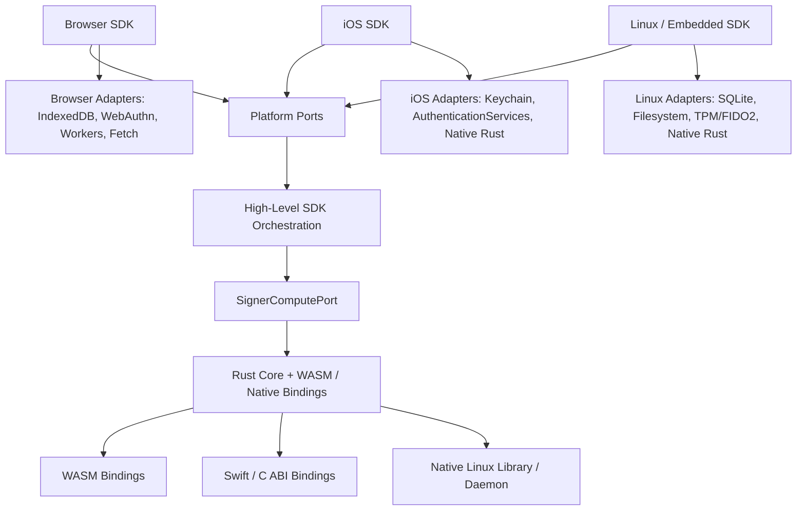

# Refactor 5x: Cross-Platform SDK Readiness

Date created: 2026-05-27
Status: planned

## Scope

This refactor prepares the SDK for future iOS and embedded/Linux targets while
keeping the current browser SDK as the only active product target.

The main goal is to isolate browser-only dependencies behind explicit platform
ports and make the existing Rust/WASM cryptography boundary coarser, more
opaque, and easier to reuse from native SDKs. The current TypeScript SDK should
remain the public web surface. The current browser behavior should stay
unchanged during this refactor.

Future target examples:

- iOS SDK using Swift, Keychain, AuthenticationServices passkeys, and native
  Rust bindings.
- Embedded/Linux SDK for Raspberry Pi-class devices using SQLite or filesystem
  storage, optional TPM/FIDO2 hardware, and native Rust libraries or a local
  daemon.
- Browser SDK using IndexedDB, WebAuthn, iframe isolation, Web Workers, and
  WASM packages.

## Current Crypto Baseline

Most cryptographic implementation work is already in Rust/WASM. The existing
codebase has dedicated Rust/WASM packages for NEAR signing, EVM signing, Tempo
signing, Ed25519 HSS client work, threshold PRF work, email OTP runtime, and
Shamir 3-pass runtime. The existing `crates/signer-core`,
`crates/signer-platform-web`, and `crates/signer-platform-ios` structure is also
already pointed toward shared Rust core plus platform-specific bindings.

This refactor is therefore a boundary-tightening pass across the existing
Rust/WASM crypto surfaces:

- TypeScript should call coarse signer commands instead of composing crypto
  helper steps.
- Rust/WASM should own derivation labels, salts, participant validation,
  threshold parameters, share mapping, internal protocol serialization, and
  lifecycle-sensitive crypto state.
- TypeScript should hold public routing/display facts, opaque state blobs,
  typed handles, and high-level workflow decisions.
- Platform-specific SDKs should call the same Rust core through native bindings
  or a local service without reimplementing crypto internals.

## Problem

The SDK already has a solid browser architecture, but browser APIs still leak
into central runtime construction and signing flows:

- `createSigningEnginePorts(...)` injects `IndexedDBManager` directly from
  `client/src/core/signingEngine/assembly/createPorts.ts`.
- WebAuthn PRF-derived client secret material is modeled as a browser-specific
  path in modules such as
  `client/src/core/signingEngine/session/passkey/ecdsaClientRoot.ts`.
- Worker operation contracts mix portable signer commands with browser Worker
  transport details in
  `client/src/core/signingEngine/workerManager/workerTypes.ts`.
- Persistence modules mix durable domain records with IndexedDB-specific
  managers, key ranges, and browser storage availability checks.
- Some TypeScript modules still know more about crypto-internal parameters than
  a future platform SDK should know: derivation source shape, role-local state
  layout, worker command granularity, protocol state blobs, and relayer payload
  assembly.
- `crates/signer-platform-ios` exists, but its early C ABI helpers still expose
  a narrow vector-replay style surface.

These are manageable for the browser SDK. They will create unnecessary churn
when adding native iOS or Linux SDKs unless the seams are made explicit first.

## Verified Codebase Impact

Verified on 2026-05-27 against the current codebase.

The most important finding is that the ECDSA HSS role-local bootstrap already
runs in Rust/WASM through `wasm/hss_client_signer/src/threshold_hss.rs` and the
`hssClient` worker. The current TypeScript boundary still exposes helper-level
crypto details and persists raw role-local state fields. The MVP should reshape
that boundary rather than move a large amount of crypto implementation.

Concrete browser-platform extraction points:

- `client/src/core/signingEngine/assembly/createPorts.ts` imports
  `IndexedDBManager` and returns it directly from `createSigningEnginePorts`.
- `client/src/core/signingEngine/assembly/createManagers.ts`,
  `assembly/ports/shared.ts`, `assembly/ports/registration.ts`,
  `assembly/ports/recovery.ts`, `assembly/ports/evmFamily.ts`, and
  `assembly/ports/near.ts` still wire IndexedDB through signing-engine ports.
- `client/src/core/signingEngine/workerManager/SignerWorkerManager.ts`
  constructs `IndexedDBManager`, `TouchIdPrompt`, and Worker transport directly.
- `client/src/core/signingEngine/interfaces/runtime.ts` and
  `interfaces/operationDeps.ts` expose `UnifiedIndexedDBManager` as a core
  runtime dependency.

Concrete signer-compute boundary points:

- `client/src/core/signingEngine/threshold/crypto/hssClientSignerWasm.ts`
  exposes `buildThresholdEcdsaHssRoleLocalClientBootstrapWasm` as a helper-level
  wrapper with `clientRootShare32B64u`, `clientShare32B64u`,
  `mappedPrivateShare32B64u`, and `verifyingShare33B64u`.
- `client/src/core/types/signer-worker.ts` mirrors those helper-level fields in
  the worker request/result contract.
- `client/src/core/signingEngine/interfaces/signing.ts` models
  `ThresholdEcdsaHssRoleLocalClientState` with raw share fields and
  `clientCaitSithInput`.
- `client/src/core/signingEngine/SigningEngine.ts` and
  `client/src/core/signingEngine/threshold/ecdsa/bootstrapSession.ts` construct
  persisted key refs from those raw fields.
- `client/src/core/signingEngine/workerManager/workers/email-otp.worker.ts`
  directly calls `threshold_ecdsa_hss_role_local_client_bootstrap` and rebuilds
  the same TypeScript role-local state shape.

Concrete client-secret source points:

- `client/src/core/signingEngine/session/passkey/ecdsaClientRoot.ts` owns the
  WebCrypto HKDF label for passkey PRF to ECDSA client root derivation.
- `client/src/core/signingEngine/threshold/ecdsa/clientSecretSource.ts` already
  acts as the natural boundary for converting credential results and provided
  root shares into a normalized secret source.
- Current provisioning and recovery paths pass `clientRootShare32B64u` through
  several layers, including `SigningEngine.ts`,
  `session/passkey/ecdsaProvisioner.ts`, `session/passkey/ecdsaWarmCapabilityBootstrap.ts`,
  `flows/signEvmFamily/provisionPlan.ts`, and `flows/recovery/ecdsaExportFlow.ts`.

Concrete persistence impact:

- `client/src/core/signingEngine/session/persistence/records.ts` normalizes and
  persists `ecdsaHssRoleLocalClientState` with raw role-local fields.
- `client/src/core/signingEngine/session/identity/evmFamilyEcdsaIdentity.ts`
  rebuilds key refs from `clientAdditiveShare32B64u` and
  `ecdsaHssRoleLocalClientState`.
- Opaque state migration affects warm-session stores, key-ref builders, export
  flows, and tests that currently assert raw share availability.

MVP code changes from this verification:

1. Add a browser `PlatformRuntime` adapter and pass it into signing-engine
   assembly instead of importing `IndexedDBManager` inside core signing modules.
2. Add `SignerComputePort.prepareEcdsaClientBootstrap` as the first coarse
   compute command, backed by the existing `hssClient` worker/WASM path.
3. Convert the ECDSA bootstrap output from raw share fields to public facts plus
   an opaque role-local state blob.
4. Move passkey PRF to client-root derivation behind the secret-source boundary,
   preferably into Rust/WASM for the ECDSA HSS slice so TypeScript no longer
   owns the HKDF label.
5. Update persistence records and key-ref builders to store the opaque state
   blob plus public routing facts.
6. Update ECDSA export to consume the opaque role-local state blob rather than
   re-deriving from `clientRootShare32B64u` and public identity fields.
7. Replace tests that assert raw internal shares with tests that assert public
   facts, relayer payloads, opaque-state presence, and parity against current
   fixtures.

## Target Architecture

The long-term shape should be:



Ownership rules:

- Platform adapters own browser, iOS, and Linux API calls.
- Portable TypeScript owns SDK-facing orchestration, platform dispatch,
  persistence routing, and UI/session workflow decisions while it remains
  web-first.
- Rust core and WASM/native bindings own crypto internals, deterministic
  protocol logic, codecs, signer command execution, and formally checkable
  invariants.
- Persistence/request compatibility code stays at the boundary parser layer.
- Obsolete paths are deleted after replacement.

## Design Principles

1. Keep the browser SDK behavior stable while changing dependency shape.
2. Make platform APIs injectable through narrow required ports.
3. Normalize raw platform records once, then pass precise internal types.
4. Model device secret sources as discriminated unions.
5. Separate signer operations from worker/thread/native transport.
6. Prefer coarse Rust/WASM signer commands over exposing crypto helper
   pipelines to TypeScript.
7. Avoid permanent dual paths. Each migration phase should end with one active
   implementation path.

## Platform Port Targets

Add a platform layer under `client/src/core/platform/`.

Initial contracts:

```ts
export type PlatformKind = 'browser' | 'ios' | 'linux_embedded';

export type PlatformRuntime = {
  kind: PlatformKind;
  storage: DurableRecordStore;
  secrets: SecureSecretStore;
  authenticator: AuthenticatorPort;
  signerCompute: SignerComputePort;
  http: HttpTransport;
  clock: ClockPort;
  random: RandomSource;
};
```

Suggested ports:

- `DurableRecordStore`: versioned records, list/query by typed keys,
  compare-and-set where required, cleanup, and transactional batches.
- `SecureSecretStore`: seal, unseal, rotate, delete, and inspect secret handles.
- `AuthenticatorPort`: passkey/WebAuthn/native credential registration and
  assertion flows.
- `UserPresencePort`: local biometric/touch/PIN confirmation when separate from
  credential assertion.
- `SignerComputePort`: hash, encode, derive, presign, sign, and open/export
  commands. The first pass should wrap existing worker/WASM commands; later
  passes should combine helper-shaped commands into protocol-level commands
  where that reduces TypeScript knowledge of crypto internals.
- `HttpTransport`: relayer requests with explicit auth mode and timeout.
- `ClockPort`: `nowMs`, deadline helpers, and test overrides.
- `RandomSource`: cryptographic randomness.
- `BackgroundRuntime`: optional worker/thread/local-daemon execution.

The first implementation should be `createBrowserPlatformRuntime(...)`, which
wraps the existing IndexedDB, WebAuthn, Worker, Fetch, WebCrypto, and timer
paths.

## Client Secret Source Model

Browser passkey PRF should become one branch of a platform-neutral secret-source
union.

Target internal shape:

```ts
type ClientSecretSource =
  | {
      kind: 'webauthn_prf_first';
      prfFirstB64u: string;
      rpId: string;
      credentialIdB64u: string;
    }
  | {
      kind: 'secure_enclave_wrapped_secret';
      keyId: string;
      accessGroup: string;
    }
  | {
      kind: 'fido2_hmac_secret';
      credentialIdB64u: string;
      rpId: string;
    }
  | {
      kind: 'email_otp_worker_session';
      sessionId: string;
    };
```

Rules:

- Browser WebAuthn code builds `webauthn_prf_first`.
- iOS can later build `secure_enclave_wrapped_secret` or a passkey-backed
  branch.
- Linux/embedded can later build `fido2_hmac_secret`, TPM-backed, or
  local-daemon-backed branches.
- Core provisioning functions accept the narrow branch they support.
- Unsupported branches fail at boundary dispatch with typed errors.

## MVP Boundary Target

The minimum useful version of this refactor should not attempt to create the
iOS or embedded SDKs. It should make the current browser SDK consume a platform
runtime and a coarse signer-compute boundary that a future native SDK can
implement.

MVP target command:

```ts
type SignerComputePort = {
  prepareEcdsaClientBootstrap(
    input: PrepareEcdsaClientBootstrapInput,
  ): Promise<PrepareEcdsaClientBootstrapResult>;
};
```

MVP Rust/WASM ownership:

- validate `ClientSecretSource` branch inputs after TypeScript boundary parsing
- own HKDF labels and derivation constants
- derive client root share material
- map additive shares to threshold-signatures shares
- validate secp256k1 public material
- construct role-local client state as an opaque state blob
- return public facts needed by TypeScript routing and persistence
- return typed crypto/protocol error codes

MVP TypeScript ownership:

- collect WebAuthn or platform credential results
- build the `ClientSecretSource`
- call the signer compute command
- store opaque state blobs
- route public facts and relayer payloads
- run user-visible workflow, retries, UI, and persistence policy

MVP output shape:

```ts
type PrepareEcdsaClientBootstrapOutput = {
  stateBlobB64u: string;
  publicFacts: {
    clientPublicKey33B64u: string;
    clientVerifyingShareB64u: string;
    ethereumAddress: string;
  };
  relayerPayload: {
    clientBootstrapB64u: string;
  };
};
```

This MVP proves the future iOS/Linux seam because native adapters only need to
provide a secret source, storage, signer compute, and relayer transport.

## Phase 0: Boundary Inventory

Create an inventory document or checked script that lists platform-boundary
usage.

Tasks:

- [ ] Inventory direct `IndexedDBManager`, `IDB*`, and `idb` imports outside
      storage adapters.
- [ ] Inventory direct `navigator.credentials`, `window`, `document`,
      `MessageChannel`, `Worker`, `localStorage`, and `crypto.subtle` use in
      signing paths.
- [ ] Inventory signer operation calls that are conceptually portable:
      hashing, tx encoding, key derivation, signature verification, HSS
      ceremony commands, and presignature commands.
- [ ] Inventory TypeScript modules that still assemble crypto-internal
      parameter sets or relayer payloads from helper-level crypto outputs.
- [ ] Inventory persistence record types that combine raw storage records,
      normalized domain records, public identity, and hot signer material.
- [ ] Inventory current Rust core coverage in `crates/signer-core`,
      `crates/signer-platform-web`, `crates/signer-platform-ios`, and
      `wasm/*`, with emphasis on which high-level workflows already have Rust
      coverage.

Deliverable:

- `docs/refactor-5x-cross-platform-inventory.md`, or a section appended to this
  document, containing the boundary map and recommended first extraction
  targets.

Validation:

- Type-check only if inventory work adds exported types or scripts.

## Phase 1: Add Neutral Platform Contracts

Add platform contracts without changing runtime behavior.

Tasks:

- [ ] Add `client/src/core/platform/types.ts`.
- [ ] Define `PlatformRuntime` and the first port interfaces.
- [ ] Use discriminated unions for platform kind, secret source kind, auth
      operation kind, storage result, and signer compute result.
- [ ] Add `assertNever` exhaustiveness checks for platform-kind dispatch.
- [ ] Add type fixtures for invalid port and secret-source combinations.
- [ ] Keep all existing browser managers as implementation details.

Acceptance criteria:

- No current signing, registration, recovery, or export flow changes behavior.
- New contracts compile under `sdk/tsconfig.build.json`.
- No direct platform runtime dependency is introduced into Rust or server code.

Validation:

- `npx tsc --noEmit -p sdk/tsconfig.build.json`

## Phase 2: Wrap Current Browser Implementations

Build the browser platform runtime as a pass-through adapter over existing code.

Tasks:

- [ ] Add `client/src/core/platform/browser/createBrowserPlatformRuntime.ts`.
- [ ] Wrap `IndexedDBManager` behind `DurableRecordStore`.
- [ ] Wrap WebAuthn credential collection behind `AuthenticatorPort`.
- [ ] Wrap existing worker/WASM operation dispatch behind `SignerComputePort`.
- [ ] Wrap `fetch`, timers, and WebCrypto randomness behind `HttpTransport`,
      `ClockPort`, and `RandomSource`.
- [ ] Update `createSigningEnginePorts(...)` to receive a platform runtime
      instead of importing `IndexedDBManager` directly.
- [ ] Keep browser adapter construction in the existing assembly layer.

Acceptance criteria:

- `client/src/core/signingEngine/assembly/createPorts.ts` no longer imports
  `IndexedDBManager` directly.
- Current SDK browser flows still use the same underlying IndexedDB and
  Rust/WASM Worker code through the adapter.
- The platform adapter is the only place where the signing runtime constructs
  browser storage and browser compute primitives.

Validation:

- `npx tsc --noEmit -p sdk/tsconfig.build.json`
- Run the cheapest affected unit tests for signing-engine assembly and worker
  dispatch.

## Phase 3: Split Persistence Records From IndexedDB Drivers

Move durable record definitions and parsers into browser-neutral modules.

Tasks:

- [ ] Split raw storage shapes from normalized internal records.
- [ ] Move record parsing, version normalization, and cleanup decisions into
      `client/src/core/signingEngine/session/persistence/records.ts` or a new
      neutral persistence module.
- [ ] Keep IndexedDB schema, indexes, key ranges, and transactions inside
      `client/src/core/indexedDB/*`.
- [ ] Add strict internal unions for ECDSA and Ed25519 session records:
      public identity, ready passkey material, ready Email OTP material,
      reauth-required material, invalid or cleanup-only raw records.
- [ ] Remove repeated compatibility parsing from core signing modules after the
      neutral parser exists.

Acceptance criteria:

- Core signing/session logic accepts normalized records only.
- IndexedDB raw shapes do not leak beyond the storage adapter and parser.
- Compatibility branches are concentrated in boundary parser modules.

Validation:

- `npx tsc --noEmit -p sdk/tsconfig.build.json`
- Targeted persistence record tests and existing malformed-record cleanup tests.

## Phase 4: Split Signer Operations From Transport

Separate portable signer commands from browser Worker mechanics while preserving
the current Rust/WASM implementations.

Tasks:

- [ ] Define a `SignerComputePort` operation map that is independent of Web
      Worker transport.
- [ ] Start by wrapping existing worker/WASM operations one-for-one.
- [ ] Identify helper-level command sequences that can become a single coarse
      Rust/WASM command.
- [ ] Keep command payloads narrow, structured, and operation-specific.
- [ ] Map browser Worker requests to `SignerComputePort` in one adapter.
- [ ] Keep direct-call and native-call adapters possible for future iOS/Linux.
- [ ] Convert boolean-success worker results to `Result`-style unions where the
      operation carries cryptographic material or lifecycle state.

Acceptance criteria:

- Core signing code calls `SignerComputePort`.
- Browser Worker request/response envelopes live in the browser compute adapter.
- Existing Rust/WASM crypto remains the implementation behind the browser
  compute adapter.
- Future native bindings can implement the same compute port without importing
  browser Worker types.

Validation:

- `npx tsc --noEmit -p sdk/tsconfig.build.json`
- Existing worker operation unit tests and HSS active-path smoke tests when HSS
  wrappers are touched.

## Phase 5: Make Authenticator And Secret Sources Platform-Neutral

Replace passkey-specific secret derivation entrypoints in core provisioning with
strict secret-source branches.

Tasks:

- [ ] Add `ClientSecretSource` and branch-specific builders.
- [ ] Convert browser WebAuthn credential parsing into a boundary builder that
      returns `webauthn_prf_first`.
- [ ] Make ECDSA and Ed25519 provisioning functions accept exact supported
      secret-source branches.
- [ ] Keep unsupported future branches as explicit dispatch failures, not broad
      optional bags.
- [ ] Add type fixtures rejecting missing identity fields for every concrete
      branch.

Acceptance criteria:

- WebAuthn PRF is no longer assumed by core provisioning signatures.
- Browser behavior remains unchanged because the browser adapter builds the same
  PRF-derived material.
- Future iOS/Linux branches can be added without changing current browser
  provisioning call sites.

Validation:

- `npx tsc --noEmit -p sdk/tsconfig.build.json`
- Targeted tests around
  `derivePasskeyThresholdEcdsaClientRootShare32B64uFromPrfFirst` and current
  registration/login bootstrap flows.

## Phase 6: Internalize One Crypto Boundary Slice

Use the existing Rust/WASM crypto baseline to move one helper-shaped TypeScript
workflow behind a coarse signer command. This is the MVP of the cryptographic
abstraction work.

Recommended pilot:

- ECDSA client bootstrap and role-local client state construction.

Why this slice:

- It is security-sensitive and already depends on Rust/WASM crypto helpers.
- It has a concrete future-platform seam: browser WebAuthn PRF today, iOS or
  embedded secret source later.
- It can return a small set of public facts plus an opaque state blob.
- It reduces TypeScript knowledge of derivation labels, share mapping,
  secp256k1 validation, and role-local state layout.

Rust/WASM should own:

- HKDF labels and derivation constants.
- Client-root derivation from the accepted secret-source branch.
- Additive share mapping.
- secp256k1 public key validation and address derivation.
- Role-local state construction and internal serialization.
- Crypto/protocol error codes.

TypeScript should own:

- Building a normalized `ClientSecretSource` from platform credential results.
- Passing account, chain, signing-root, and policy identities.
- Storing opaque `stateBlobB64u`.
- Routing public facts and relayer payloads.
- User workflow, retries, and UI.

Tasks:

- [ ] Define `prepareEcdsaClientBootstrap` on `SignerComputePort`.
- [ ] Add or extend the Rust/WASM command that implements the full bootstrap
      slice.
- [ ] Return `{ stateBlobB64u, publicFacts, relayerPayload }` rather than
      helper-by-helper crypto outputs.
- [ ] Replace the TypeScript helper pipeline with the coarse command.
- [ ] Delete the replaced TypeScript crypto-internal assembly path.
- [ ] Add parity fixtures for current browser PRF inputs and expected public
      facts / relayer payload.
- [ ] Add native-binding vector replay coverage if the command lands in
      `crates/signer-platform-ios`.
- [ ] Record before/after browser JS, WASM, and lazy-flow asset sizes.

Acceptance criteria:

- ECDSA client bootstrap no longer exposes derivation internals or role-local
  state layout to TypeScript.
- Browser behavior remains equivalent under parity fixtures and current flow
  tests.
- Future native SDKs can call the same Rust core command with a platform-built
  secret source.
- The old TypeScript assembly path is removed.

Validation:

- `cargo test --manifest-path crates/signer-core/Cargo.toml`
- Relevant `cargo test` for the WASM package that exposes the command.
- `npx tsc --noEmit -p sdk/tsconfig.build.json`
- Targeted ECDSA bootstrap/provisioning tests.
- Bundle-size check for affected SDK assets.

## Phase 7: Optional Portable State-Machine Pilot

After Phase 6 proves the coarse signer-command boundary, consider moving one
pure state machine into `crates/signer-core` if it clearly improves
cross-platform reuse or formal-verification coverage.

Good candidates:

- Signing operation planning and operation-id binding.
- ECDSA lane material readiness transitions.
- Budget admission and spend finalization projection.
- Threshold session lifecycle transitions.

Selection criteria:

- No browser API dependency.
- Small input and output surface.
- Clear invariants suitable for parity fixtures or Verus.
- Enough shared-platform value to justify Rust/WASM or native binding exposure.

Acceptance criteria:

- One portable core state machine exists in Rust with parity coverage.
- The browser uses the Rust path only when size and complexity remain acceptable.
- The old TypeScript implementation is removed after replacement.

Validation:

- `cargo test --manifest-path crates/signer-core/Cargo.toml`
- Relevant `cargo test` for a WASM package only if browser code calls it.
- `npx tsc --noEmit -p sdk/tsconfig.build.json`
- Relevant formal-verification or anti-drift target if added.

## Phase 8: Harden Native Binding Strategy

Prepare `crates/signer-platform-ios` and future Linux bindings for real SDK
surfaces.

Tasks:

- [ ] Replace null-pointer-only failure surfaces with a stable result envelope
      for C ABI functions that remain.
- [ ] Evaluate UniFFI for Swift bindings once the first real iOS API surface is
      known.
- [ ] Keep native bindings generated from or wrapping `signer-core`; do not copy
      protocol logic into Swift or C.
- [ ] Add vector replay scripts for any newly exposed binding operation.
- [ ] Define a future Linux native binding shape: Rust crate, C ABI, or local
      signer daemon.

Acceptance criteria:

- Native binding surfaces return typed status and error information.
- iOS vector replay can compare native output with committed signer-core
  fixtures.
- The Rust core remains the single implementation of shared protocol logic.

Validation:

- `cargo test --manifest-path crates/signer-platform-ios/Cargo.toml`
- `crates/signer-platform-ios/scripts/run-swift-vector-replay.sh` when Swift
  coverage is touched.

## Suggested Implementation Order

1. Phase 0: boundary inventory.
2. Phase 1: neutral platform contracts.
3. Phase 2: browser runtime adapter.
4. Phase 3: persistence record split.
5. Phase 4: signer operation versus transport split.
6. Phase 5: platform-neutral secret sources.
7. Phase 6: one coarse crypto-boundary slice.
8. Phase 7: optional portable state-machine pilot.
9. Phase 8: native binding hardening.

## TODO Checklist

Use this as the concrete execution checklist for the MVP. Keep each item scoped
to a single PR where practical.

### Inventory And Contracts

- [ ] Add a checked boundary inventory for direct `IndexedDBManager`,
      `UnifiedIndexedDBManager`, WebAuthn, Worker, `crypto.subtle`, and
      browser-global usage in signing/session paths.
- [ ] Add `client/src/core/platform/types.ts` with `PlatformRuntime`,
      `PlatformKind`, `DurableRecordStore`, `AuthenticatorPort`,
      `SignerComputePort`, `HttpTransport`, `ClockPort`, and `RandomSource`.
- [ ] Add discriminated-union type fixtures for `PlatformKind`,
      `ClientSecretSource`, and `SignerComputePort` result branches.
- [ ] Add an `assertNever` helper or reuse the existing project helper for
      platform dispatch exhaustiveness.

### Browser Platform Adapter

- [ ] Add
      `client/src/core/platform/browser/createBrowserPlatformRuntime.ts`.
- [ ] Wrap the existing `IndexedDBManager` as the browser `DurableRecordStore`
      implementation.
- [ ] Wrap existing WebAuthn credential collection as the browser
      `AuthenticatorPort`.
- [ ] Wrap existing worker dispatch as the browser `SignerComputePort`.
- [ ] Wrap `fetch`, `Date.now`, timers, and WebCrypto randomness behind the
      browser runtime ports where current signing flows need them.
- [ ] Update `createSigningEnginePorts(...)` so it receives a browser
      `PlatformRuntime`.
- [ ] Remove direct `IndexedDBManager` imports from signing-engine assembly
      files after the platform runtime is wired.
- [ ] Update `SignerWorkerManager` so storage, authenticator, and worker
      transport dependencies are injected through runtime construction.

### ECDSA Secret Source Boundary

- [ ] Promote the existing ECDSA client-secret source helper into the canonical
      `ClientSecretSource` boundary.
- [ ] Add branch-specific builders for `webauthn_prf_first`,
      `email_otp_worker_session`, `secure_enclave_wrapped_secret`, and
      `fido2_hmac_secret`.
- [ ] Keep iOS and embedded branches as typed unsupported dispatch failures in
      the browser adapter.
- [ ] Move passkey PRF to client-root HKDF derivation behind
      `SignerComputePort.prepareEcdsaClientBootstrap`.
- [ ] Decide whether the HKDF implementation lands directly in
      `wasm/hss_client_signer` first or in a shared Rust crate consumed by that
      WASM package.

### Coarse ECDSA Bootstrap Command

- [ ] Add `prepareEcdsaClientBootstrap` to `SignerComputePort`.
- [ ] Update the `hssClient` worker request/result contract to expose the new
      coarse command.
- [ ] Update `wasm/hss_client_signer` to return public facts and an opaque
      role-local state blob.
- [ ] Stop returning `clientShare32B64u`, `mappedPrivateShare32B64u`, and
      `verifyingShare33B64u` to TypeScript from the active bootstrap path.
- [ ] Update `buildThresholdEcdsaHssRoleLocalClientBootstrapWasm(...)` or
      replace it with a `prepareEcdsaClientBootstrap(...)` wrapper.
- [ ] Update wallet registration bootstrap and threshold ECDSA session
      bootstrap flows to persist opaque state and public facts.
- [ ] Update the Email OTP worker ECDSA bootstrap path to call the same coarse
      Rust/WASM command shape.

### Persistence And Key Refs

- [ ] Replace `ThresholdEcdsaHssRoleLocalClientState` raw share fields with an
      opaque `stateBlobB64u` and required public identity fields.
- [ ] Update `ThresholdEcdsaBackendBinding` so signing material is represented
      by an opaque state blob or typed handle.
- [ ] Update persistence record parsers to normalize old raw boundary data only
      at the persistence boundary while this in-development data exists.
- [ ] Update EVM-family key-ref builders to consume the new opaque role-local
      state shape.
- [ ] Remove `clientAdditiveShare32B64u` from active core signing paths after
      the opaque state path is complete.

### Export And Recovery

- [ ] Update ECDSA HSS export to consume the opaque role-local state blob.
- [ ] Stop re-deriving export material from `clientRootShare32B64u` in the
      active export path.
- [ ] Update passkey recovery export flow to collect a `ClientSecretSource`
      only when the platform adapter needs to unlock or refresh state.
- [ ] Update Email OTP recovery/export flow to use worker-owned handles or
      opaque state rather than exposing root-share bytes to core TypeScript.

### Tests And Verification

- [ ] Update parser and guard tests that currently assert raw HSS fields.
- [ ] Add parity fixtures for current WebAuthn PRF inputs and expected public
      facts.
- [ ] Add tests proving TypeScript cannot construct invalid
      `ClientSecretSource` branches or incomplete platform runtimes.
- [ ] Add persistence tests for the opaque role-local state record shape.
- [ ] Add export tests that use opaque state and reject missing public identity.
- [ ] Run `npx tsc --noEmit -p sdk/tsconfig.build.json`.
- [ ] Run targeted ECDSA HSS unit tests.
- [ ] Run relevant `cargo test` commands for the Rust crate/WASM package touched
      by the coarse command.
- [ ] Record before/after browser JS, WASM, and lazy-flow asset sizes.

### Deferred Follow-Ups

- [ ] Evaluate moving one deterministic state machine into
      `crates/signer-core` after the coarse ECDSA bootstrap command lands.
- [ ] Define the first real `crates/signer-platform-ios` API around the same
      `SignerComputePort` command.
- [ ] Define the Linux/embedded binding shape: native crate, C ABI, or local
      daemon.
- [ ] Add Verus or LEAN-facing invariants only after the Rust state-machine or
      protocol boundary has stabilized.

## Risks

1. Over-abstracting before another platform exists.
   Keep ports narrow and based on active browser call sites.

2. Carrying duplicate browser and neutral paths.
   End each phase by deleting the replaced browser-specific path from core
   modules.

3. Moving orchestration into Rust too early.
   Keep UI, prompts, browser storage, retry policy, and network orchestration in
   platform adapters. Move crypto-internal assembly and pure state machines only
   when the boundary becomes simpler.

4. Weak boundary parsing.
   Raw platform records, request bodies, worker responses, and credential
   results must normalize once at the boundary.

5. Package-size regression.
   Measure WASM artifacts after any new coarse Rust/WASM command used by the
   browser SDK.

## Refactor Guardrails

- Do not add legacy flags or compatibility paths inside core logic.
- Do not introduce broad optional bags for auth, identity, session, signing,
  restore, export, or lifecycle state.
- Do not pass raw IndexedDB records, raw WebAuthn credentials, raw worker
  payloads, or raw native binding payloads into core modules.
- Do not keep both TypeScript helper pipelines and coarse Rust/WASM commands
  active after a slice lands.
- Do not make iOS or embedded SDK public APIs in this refactor.
- Do not move React, iframe UI, browser prompt UX, or DOM code into Rust.

## Completion Definition

This refactor is complete when:

- The signing runtime is constructed from a `PlatformRuntime`.
- Browser APIs are isolated to browser adapters and UI/browser folders.
- Core signing/session modules consume normalized records and strict secret
  source branches.
- Signer compute operations can be implemented by a browser Worker, direct WASM
  call, native binding, or local service through the same command port.
- At least one crypto-boundary slice has been internalized behind a coarse
  Rust/WASM signer command with parity coverage.
- Existing browser registration, signing, recovery, HSS rebuild, and export
  flows remain green.
