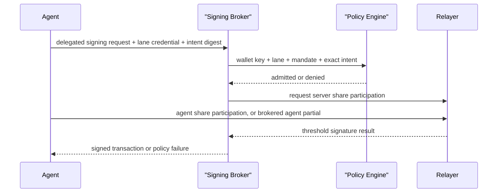

# Signing Lane Foundation For Delegated Wallets

Date created: June 15, 2026

Status: design plan. This plan introduces `WalletKey` and `SigningLane` as
first-class domain concepts under one stable wallet key. Full delegated agent
and linked-device product behavior moved to
[refactor-84-delegated-agent-linked-device-behavior.md](./refactor-84-delegated-agent-linked-device-behavior.md).
This foundation depends on the passkey account refactor in
[refactor-81-passkey-account-refactor.md](./refactor-81-passkey-account-refactor.md)
and feeds the rotation model in
[refactor-83-share-rotation.md](./refactor-83-share-rotation.md).

## Goal

Add lane identity, owner-lane normalization, lane policy types, and raw-boundary
parsers so delegated-agent and linked-device behavior can be added without
optional identity fields or compatibility branches in core signing paths.

This plan also supersedes the lane-identity parts that the old
[refactor-34b-stepup-adaptor.md](./refactor-34b-stepup-adaptor.md)
recovery/export wrapper would have needed. Export and recovery auth should carry
explicit `walletKeyId`, `laneId`, and `laneShareEpoch` once those concepts exist
instead of using a broad transaction-signing step-up request shape.

The future behavior target, implemented in
[refactor-84-delegated-agent-linked-device-behavior.md](./refactor-84-delegated-agent-linked-device-behavior.md),
is:

```text
User approves a bounded mandate.
System creates a delegated agent signing lane.
Agent receives a lane-scoped MPC holder share.
Agent can request signatures only through policy-admitted flows.
Revocation disables that lane without changing the wallet address.
Owner lanes and unrelated agent lanes continue to work.
```

The same lane machinery should eventually replace the old link-device flow:

```text
New device shows a QR code with a link-session public key.
Existing owner device scans the QR code.
User approves full or scoped device permissions.
System creates a linked-device signing lane.
New device receives a lane-scoped MPC holder share.
Revocation disables that device without affecting other lanes.
```

The product value is:

- users keep one wallet address
- agents can act without a live browser session
- linked devices become independently revocable signers
- every agent has a separate principal, mandate, budget, expiry, and audit trail
- a stolen agent or linked-device share cannot sign without the matching server
  share and policy admission
- revocation can retire a delegated lane while preserving access through other
  lanes

## Architecture Decision

Model signing authority as lanes under a stable wallet key.

```text
WalletKey
  wallet_key_id
  public identity / address
  key material version

SigningLane
  owner_passkey lane
  owner_email_otp lane
  linked_device lane A
  linked_device lane B
  delegated_agent lane A
  delegated_agent lane B
```

For a two-party additive lane:

```text
holder_share_lane + server_share_lane = wallet_private_scalar
```

For FROST or another threshold scheme:

```text
participant set signs for the same wallet public key
participant set is lane-specific
threshold policy is lane-specific
```

Each lane has its own share epoch, participant set, budget, policy, expiry, and
revocation state. A delegated agent lane is a signing authority for a mandate. A
linked-device lane is a signing authority for a specific device. Both preserve
the wallet address.

## Current State

Relevant existing pieces:

- Warm signing sessions already model short-lived signing capability with TTL
  and remaining uses.
- ECDSA key identity has been separated from concrete session identity in recent
  refactors.
- Email OTP already uses server-side recovery-wrapped escrow records and
  user-held recovery codes.
- Router A/B currently focuses on server-side signing-root and relayer-output
  derivation.
- Passkey paths still use PRF-derived material as the client signing input in
  several ECDSA and Ed25519 flows.
- The existing QR link-device flow already has QR display, scanner, relay
  session, and progress-event surfaces that can be reused.

Main gap:

```text
The current model lacks first-class delegated principals with lane-scoped MPC
shares, permission policy, revocation epoch, and audit identity.
```

## Domain Model

Use strict domain types and discriminated unions. Normalize raw DB rows, route
bodies, worker payloads, and agent requests once at the boundary.

```ts
type WalletKeyRecord = {
  kind: 'wallet_key_record_v1';
  walletId: WalletId;
  walletKeyId: WalletKeyId;
  walletKeyVersion: WalletKeyVersion;
  keyFamily: 'ecdsa_secp256k1' | 'ed25519';
  publicIdentity: WalletPublicIdentity;
  status: 'active' | 'retired';
};

type SigningLaneKind =
  | 'owner_passkey'
  | 'owner_email_otp'
  | 'linked_device'
  | 'delegated_agent'
  | 'recovery'
  | 'break_glass';

type SigningLaneRecord =
  | OwnerPasskeySigningLaneRecord
  | OwnerEmailOtpSigningLaneRecord
  | LinkedDeviceSigningLaneRecord
  | DelegatedAgentSigningLaneRecord
  | RecoverySigningLaneRecord
  | BreakGlassSigningLaneRecord;
```

Owner passkey lane:

```ts
type OwnerPasskeySigningLaneRecord = {
  kind: 'signing_lane_record_v1';
  laneKind: 'owner_passkey';
  walletId: WalletId;
  walletKeyId: WalletKeyId;
  laneId: SigningLaneId;
  laneShareEpoch: LaneShareEpoch;
  holderPrincipal: {
    kind: 'passkey_credential';
    rpId: string;
    credentialIdB64u: string;
  };
  delegatePrincipal?: never;
  mandatePolicy?: never;
  revocation: ActiveLaneRevocationState;
};
```

Linked device lane:

```ts
type LinkedDeviceSigningLaneRecord = {
  kind: 'signing_lane_record_v1';
  laneKind: 'linked_device';
  walletId: WalletId;
  walletKeyId: WalletKeyId;
  laneId: SigningLaneId;
  laneShareEpoch: LaneShareEpoch;
  holderPrincipal: {
    kind: 'linked_device_passkey';
    deviceId: LinkedDeviceId;
    rpId: string;
    credentialIdB64u: string;
    devicePublicKeyB64u: string;
  };
  devicePrincipal: {
    deviceId: LinkedDeviceId;
    displayName: string;
    platform: 'ios' | 'android' | 'macos' | 'windows' | 'linux' | 'web' | 'unknown';
  };
  permissionPolicy: LinkedDevicePermissionPolicy;
  delegatePrincipal?: never;
  revocation: ActiveLaneRevocationState | RevokedLaneRevocationState;
};
```

Delegated agent lane:

```ts
type DelegatedAgentSigningLaneRecord = {
  kind: 'signing_lane_record_v1';
  laneKind: 'delegated_agent';
  walletId: WalletId;
  walletKeyId: WalletKeyId;
  laneId: SigningLaneId;
  laneShareEpoch: LaneShareEpoch;
  holderPrincipal: {
    kind: 'agent_custody_boundary';
    agentId: AgentPrincipalId;
    custodyKeyId: string;
    custodyRuntime: 'managed_service' | 'tee' | 'hsm' | 'customer_runtime';
  };
  delegatePrincipal: {
    agentId: AgentPrincipalId;
    displayName?: string;
    operatorId?: string;
  };
  mandatePolicy: DelegatedMandatePolicy;
  revocation: ActiveLaneRevocationState | RevokedLaneRevocationState;
};
```

Linked-device permission policy:

```ts
type LinkedDevicePermissionPolicy =
  | {
      kind: 'owner_equivalent_device_permission_v1';
      requiresLocalUserPresence: true;
      signingScope: 'full_wallet_signing';
      administrationScope: LinkedDeviceAdministrationScope;
      mandatePolicy?: never;
    }
  | {
      kind: 'scoped_device_permission_v1';
      requiresLocalUserPresence: boolean;
      administrationScope: 'no_account_admin';
      mandatePolicy: DelegatedMandatePolicy;
    };

type LinkedDeviceAdministrationScope =
  | 'signing_only'
  | 'device_management'
  | 'delegation_management'
  | 'full_owner_admin';
```

Owner-equivalent linked devices can perform the same signing actions as the
primary owner lane after local device authentication. Scoped linked devices use
the delegated mandate policy and admission pipeline.

Signing authority and account administration are separate permission planes.
Account administration includes linking more devices, creating agent lanes,
changing recovery policy, exporting keys, rotating owner lanes, and revoking
other lanes. A linked device with full wallet signing can still have
`administrationScope: 'signing_only'`. Granting `full_owner_admin` should require
fresh owner approval, local user presence on the linked device, step-up
confirmation for high-risk actions, and explicit audit evidence.

Revocation state:

```ts
type ActiveLaneRevocationState = {
  status: 'active';
  revocationEpoch: number;
  revokedAtMs?: never;
  revokedReason?: never;
};

type RevokedLaneRevocationState = {
  status: 'revoked';
  revocationEpoch: number;
  revokedAtMs: number;
  revokedReason: 'user_revoked' | 'policy_revoked' | 'agent_compromise' | 'rotation';
};
```

## Mandate Policy

A delegated lane must carry a concrete mandate. TTL and use count alone are too
weak for agent payments.

Minimum mandate shape:

```ts
type DelegatedMandatePolicy = {
  kind: 'delegated_mandate_policy_v1';
  policyId: MandatePolicyId;
  policyVersion: string;
  allowedIntents: readonly DelegatedIntentKind[];
  chainScope: ChainScope;
  assetScope: AssetScope;
  counterpartyScope: CounterpartyScope;
  perOperationLimit: ValueLimit;
  aggregateBudget: ValueLimit;
  expiresAtMs: number;
  requiredIntentDigest: 'exact_payment_intent_v1';
  replayPolicy: DelegatedReplayPolicy;
  feePolicy: DelegatedFeePolicy;
  outOfPolicyAction: 'deny' | 'require_owner_approval';
};
```

Payment-intent binding must include:

- chain and chain id
- token or native asset
- amount and decimals
- destination address
- merchant or counterparty identity when available
- payment protocol, such as x402 or app-specific checkout
- resource, order id, or invoice id
- nonce and expiry
- user-visible purpose

## Intent Admission Spec

Delegated signing needs a canonical intent layer before chain-specific
transaction construction. The policy engine should admit the intent first, then
validate the final unsigned transaction against the admitted intent.

Minimum request shape:

```ts
type DelegatedSigningRequest = {
  kind: 'delegated_signing_request_v1';
  walletId: WalletId;
  walletKeyId: WalletKeyId;
  laneId: SigningLaneId;
  laneShareEpoch: LaneShareEpoch;
  revocationEpoch: number;
  delegatePrincipalId: AgentPrincipalId;
  idempotencyKey: IdempotencyKey;
  intent: DelegatedSigningIntent;
  intentDigest: ExactIntentDigest;
  requestedAtMs: number;
};
```

The first supported intent should be specific purchase payment:

```ts
type DelegatedSigningIntent =
  | {
      kind: 'specific_purchase_payment_v1';
      paymentProtocol: 'x402' | 'merchant_checkout' | 'app_invoice';
      chainScope: ChainScope;
      asset: AssetDescriptor;
      amount: AtomicAmount;
      destination: AddressDescriptor;
      counterparty: CounterpartyDescriptor;
      orderId: string;
      invoiceId: string;
      resourceId: string;
      expiresAtMs: number;
      nonce: string;
      purpose: string;
    }
  | {
      kind: 'allowance_grant_v1';
      chainScope: ChainScope;
      asset: AssetDescriptor;
      spender: AddressDescriptor;
      allowanceLimit: AtomicAmount;
      expiresAtMs: number;
      nonce: string;
      purpose: string;
    };
```

Policy admission must check:

- lane identity and share epoch
- revocation epoch
- delegate principal
- mandate policy version and digest
- budget availability
- counterparty and destination scope
- asset and chain scope
- amount, fee, and expiry
- idempotency key uniqueness
- exact intent digest

Final transaction validation must check:

- chain id and transaction domain
- recipient, token contract, amount, and decimals
- calldata function selector and decoded arguments
- gas payer, max fee, and fee sponsorship policy
- nonce freshness and replay domain
- allowance or approval semantics
- protocol-specific expiry or block-height limits

The policy engine must reject a final transaction that signs a broader authority
than the admitted intent. For EVM, that includes `approve`,
`setApprovalForAll`, Permit2, session-key installation, and arbitrary contract
calls. For NEAR, that includes delegated actions whose receiver, method names,
deposit, gas, nonce, or block-height bounds exceed the mandate.

## Policy Lifecycle Features

The user-facing product should support these mandate operations:

- create agent wallet
- link device as owner-equivalent signer
- link device as scoped signer
- list active, expired, suspended, and revoked agent wallets
- list linked devices and their permission profile
- view mandate policy, budget, expiry, and recent activity
- pause and resume an agent wallet
- pause and resume a linked device
- revoke an agent wallet
- revoke a linked device
- extend expiry with owner approval
- replenish aggregate budget with owner approval
- rotate agent custody key
- rotate linked-device custody key
- replace an agent wallet after suspected compromise
- replace a linked device after local compromise
- require owner approval for an out-of-policy request

Policy updates should create a new policy version. High-risk updates, such as
expanded counterparty scope, higher budget, new chain scope, or new allowance
authority, should require fresh owner approval and an audit event.

## QR Linked-Device Flow

The old scan-to-link UX should be preserved as the product shell for
linked-device lane creation.

Device 2 prepares the link:

1. Generate `linkSessionId`.
2. Generate an ephemeral link encryption key.
3. Optionally create or preflight a passkey credential.
4. Register the pending link session with the relay.
5. Render a QR payload containing `linkSessionId`, link public key, expiry,
   requested permission profile, and protocol version.

Device 1 authorizes the link:

1. Scan and parse the QR payload.
2. Authenticate the current owner lane.
3. Show Device 2 identity, requested permission profile, expiry, and revocation
   path.
4. User approves owner-equivalent or scoped device permissions.
5. Run linked-device lane creation through the additive reshare protocol in
   [refactor-83-share-rotation.md](./refactor-83-share-rotation.md).
6. Encrypt the new holder share to Device 2's link public key.
7. Store the matching server share under the new linked-device lane.
8. Relay the encrypted holder-share package to Device 2.

Device 2 completes activation:

1. Receive the encrypted holder-share package from the relay.
2. Open it with the ephemeral link secret inside the wallet worker.
3. Seal the holder share under the local passkey KEK or device custody KEK.
4. Return a holder-share delivery receipt.
5. The server marks the linked-device lane active.

The QR payload must expire quickly and must never contain holder-share material,
server-share material, passkey PRF output, or recovery-code material.

## Agent Custody Binding

The lane holder share must be encrypted to a named custody boundary. A bare
agent id is insufficient.

```ts
type AgentCustodyBindingRecord = {
  kind: 'agent_custody_binding_v1';
  agentId: AgentPrincipalId;
  custodyKeyId: string;
  custodyRuntime: 'managed_service' | 'tee' | 'hsm' | 'customer_runtime';
  encryptionPublicKeyB64u: string;
  attestationDigestB64u: string;
  attestationKind:
    | 'managed_service_policy'
    | 'tee_attestation'
    | 'hsm_attestation'
    | 'customer_runtime_registration';
  status: 'active' | 'retired' | 'revoked';
  createdAtMs: number;
  updatedAtMs: number;
};
```

Activation should require an agent custody receipt proving that the encrypted
holder-share package was accepted by the expected custody key. The receipt must
bind `walletKeyId`, `laneId`, `laneShareEpoch`, `mandatePolicyDigest`, and
`custodyKeyId`.

## Lane Lifecycle

Delegated lanes and linked-device lanes need lifecycle states beyond active and
revoked.

```ts
type DelegatedLaneLifecycleState =
  | {
      state: 'provisioning';
      activationDeadlineMs: number;
      activatedAtMs?: never;
      suspendedAtMs?: never;
      revokedAtMs?: never;
    }
  | {
      state: 'pending_agent_receipt';
      activationDeadlineMs: number;
      activatedAtMs?: never;
      suspendedAtMs?: never;
      revokedAtMs?: never;
    }
  | {
      state: 'active';
      activatedAtMs: number;
      suspendedAtMs?: never;
      revokedAtMs?: never;
    }
  | {
      state: 'suspended';
      activatedAtMs: number;
      suspendedAtMs: number;
      suspendReason: 'user_paused' | 'risk_engine' | 'budget_exhausted';
      revokedAtMs?: never;
    }
  | {
      state: 'expired';
      activatedAtMs: number;
      expiredAtMs: number;
      suspendedAtMs?: never;
      revokedAtMs?: never;
    }
  | {
      state: 'revoked_before_activation';
      revokedAtMs: number;
      revokedReason: 'user_revoked' | 'policy_revoked' | 'agent_compromise' | 'rotation';
      activatedAtMs?: never;
      suspendedAtMs?: never;
    }
  | {
      state: 'revoked_after_activation';
      revokedAtMs: number;
      revokedReason: 'user_revoked' | 'policy_revoked' | 'agent_compromise' | 'rotation';
      activatedAtMs: number;
      suspendedAtMs?: never;
    };
```

Only active lanes can enter signing admission. Suspended and expired lanes keep
their evidence and server-share records unavailable for signing.

## Replay And Idempotency

Every delegated request should carry an idempotency key scoped to
`walletKeyId`, `laneId`, `laneShareEpoch`, and `delegatePrincipalId`.

The signing broker should persist:

- request digest
- intent digest
- final transaction digest
- admitted or denied result
- budget reservation id
- produced signature digest, when signing succeeds

Repeated requests with the same idempotency key must return the original result
when the request digest matches. A reused idempotency key with a different
digest must fail before budget reservation or signing.

## Signing Flow

Delegated signing should reuse the normal signing execution machinery after lane
admission.



The signing request must resolve to a concrete lane before any signing material
is touched.

## Delegation Creation

Delegation creates a new agent lane for the same wallet key.

Required steps:

1. User authenticates through an active owner lane or recovery path.
2. Wallet UI shows the agent principal, mandate, expiry, budget, and revocation
   path.
3. User approves the delegation.
4. System runs the address-preserving additive lane creation protocol defined in
   [refactor-83-share-rotation.md](./refactor-83-share-rotation.md).
5. Agent holder share is encrypted to the named agent custody boundary.
6. Matching server share is sealed for the relayer or server custody boundary.
7. `SigningLaneRecord`, holder-share delivery receipt, and server-share record
   are written atomically.
8. A delegated-lane audit event is emitted.

Creation requires participation from a party that can authorize the existing
wallet key. The server cannot independently mint an agent lane for the same
address when it lacks the holder side of the wallet key.

## Delegation Revocation

Revocation disables the delegated lane.

Required steps:

1. Mark the lane as `revoked` with a new revocation epoch.
2. Stop queued and in-flight agent operations for that lane.
3. Disable or destroy the matching server share.
4. Retire the old agent holder-share delivery record.
5. Emit revocation evidence.
6. Require fresh user authorization before issuing a replacement delegated lane.

Revocation should be immediate at the policy and server-share boundary. A stale
agent share must be unable to combine with any active server share.

## Storage Surfaces

New or revised records:

- `WalletKeyRecord`
- `SigningLaneRecord`
- `LaneHolderShareEnvelope`
- `LaneServerShareRecord`
- `DelegatedMandatePolicyRecord`
- `DelegatedSigningAuditEvent`
- `LaneRevocationEvent`
- `AgentCustodyBindingRecord`
- `LinkedDeviceBindingRecord`
- `DelegatedSigningRequestRecord`
- `DelegatedBudgetReservationRecord`

Existing threshold-session, signing-grant, and budget-status records should gain:

- `walletKeyId`
- `laneId`
- `laneKind`
- `laneShareEpoch`
- `mandatePolicyDigest` for delegated lanes
- `revocationEpoch`
- `delegatePrincipalId` for delegated lanes

## API Surface

Proposed public SDK namespace:

```ts
seams.delegation.createAgentWallet(...)
seams.delegation.listAgentWallets(...)
seams.delegation.revokeAgentWallet(...)
seams.delegation.getAgentWalletPolicy(...)
seams.devices.startLinkDevice(...)
seams.devices.linkDeviceWithScannedQRData(...)
seams.devices.listLinkedDevices(...)
seams.devices.revokeLinkedDevice(...)
```

Proposed server or broker routes:

```text
POST /wallet/delegations/agent-lanes
GET  /wallet/delegations/agent-lanes
POST /wallet/delegations/agent-lanes/{lane_id}/pause
POST /wallet/delegations/agent-lanes/{lane_id}/resume
POST /wallet/delegations/agent-lanes/{lane_id}/revoke
POST /wallet/delegations/agent-lanes/{lane_id}/budgets
POST /wallet/delegations/agent-lanes/{lane_id}/policies
POST /wallet/delegations/agent-lanes/{lane_id}/sign
POST /wallet/devices/link-sessions
POST /wallet/devices/link-sessions/{link_session_id}/authorize
POST /wallet/devices/link-sessions/{link_session_id}/complete
GET  /wallet/devices/linked-device-lanes
POST /wallet/devices/linked-device-lanes/{lane_id}/revoke
```

Every request body parser must normalize raw identity strings into branded
internal types before core logic.

## Security Boundaries

### Agent Compromise

Impact:

- exposes one delegated lane holder share or custody key
- does not expose owner lanes
- does not expose unrelated delegated lanes
- requires matching server share and policy admission for signing

Response:

- revoke the delegated lane
- disable matching server share
- inspect all requests admitted under that lane
- issue a replacement lane only after fresh owner approval

### Linked Device Compromise

Impact:

- exposes one linked-device holder share or local custody key
- owner lanes and unrelated linked devices remain distinct authorities
- matching server share and admission policy are still required for signing

Response:

- revoke the linked-device lane
- disable matching server share
- clear warm sessions for that lane
- issue a replacement device lane only after fresh owner approval
- require wallet rekey only when both sides of a lane may be compromised

### Relayer Compromise

Impact:

- exposes lane server shares held by that relayer
- requires holder-side lane shares for signing
- can deny service or attempt policy bypass

Response:

- disable affected relayer
- revoke or refresh affected lane server shares
- preserve owner access through unaffected lanes

### Owner Lane Compromise

Impact:

- exposes one owner lane holder share
- delegated lanes remain distinct authorities
- matching server share is still required for signing

Response:

- suspend affected owner lane
- recover through another owner lane or recovery path
- refresh the affected lane shares
- migrate wallet key only when both sides of a lane may be compromised

## Prep Phase: Narrow The Refactor Surface

This phase is additive. It should introduce stable names, folders, parsers, and
type fixtures before any signing behavior changes.

### Folder Layout To Prepare

Shared types:

```text
packages/shared-ts/src/signing-lanes/
  ids.ts
  records.ts
  policies.ts
  intents.ts
  rotation.ts
  index.ts
  signingLanes.typecheck.ts
```

SDK web internals:

```text
packages/sdk-web/src/core/signingEngine/session/lanes/
  laneReference.ts
  laneRecords.ts
  lanePolicy.ts
  laneAvailability.ts
  laneWarmSessionBinding.ts
  laneRecords.typecheck.ts

packages/sdk-web/src/SeamsWeb/operations/delegation/
  agentWallets.ts
  mandatePolicy.ts
  intentDigest.ts

packages/sdk-web/src/SeamsWeb/operations/devices/
  qrLinkSession.ts
  linkedDeviceLane.ts
```

Server internals:

```text
packages/sdk-server-ts/src/core/signingLanes/
  SigningLaneStore.ts
  SigningLaneRotationStore.ts
  DelegatedBudgetReservationStore.ts
  LinkedDeviceLaneStore.ts

packages/sdk-server-ts/src/router/delegation/
  agentLanes.ts
  delegatedSigning.ts
  linkedDeviceLanes.ts
```

These folders can start with type-only modules, boundary parsers, and store
interfaces. Route wiring and behavior changes should wait until the lane model
is represented consistently.

### Domain IDs To Add First

Add branded IDs using the same pattern as
`packages/shared-ts/src/utils/domainIds.ts`:

```ts
type WalletKeyId = DomainId<'WalletKeyId'>;
type SigningLaneId = DomainId<'SigningLaneId'>;
type LaneShareEpoch = DomainId<'LaneShareEpoch'>;
type AgentPrincipalId = DomainId<'AgentPrincipalId'>;
type LinkedDeviceId = DomainId<'LinkedDeviceId'>;
type MandatePolicyId = DomainId<'MandatePolicyId'>;
type RotationOperationId = DomainId<'RotationOperationId'>;
type DelegatedIntentDigest = DomainId<'DelegatedIntentDigest'>;
type DelegatedIdempotencyKey = DomainId<'DelegatedIdempotencyKey'>;
type LinkDeviceSessionId = DomainId<'LinkDeviceSessionId'>;
```

Add matching parsers and `@ts-expect-error` fixtures proving these ids are not
interchangeable with `WalletId`, `SigningGrantId`, or `ThresholdSessionId`.

### Structs To Introduce Without Behavior Changes

Add strict records as shared types:

- `WalletKeyRecord`
- `SigningLaneRecord`
- `SigningLaneReference`
- `LinkedDeviceSigningLaneRecord`
- `DelegatedAgentSigningLaneRecord`
- `LinkedDevicePermissionPolicy`
- `DelegatedMandatePolicy`
- `DelegatedSigningIntent`
- `DelegatedSigningRequest`
- `AgentCustodyBindingRecord`
- `LinkedDeviceBindingRecord`
- `DelegatedSigningAuditEvent`
- `SigningLaneCreationJob`
- `ShareRotationJob`

The most useful prep struct is `SigningLaneReference`:

```ts
type SigningLaneReference = {
  kind: 'signing_lane_reference_v1';
  walletId: WalletId;
  walletKeyId: WalletKeyId;
  laneId: SigningLaneId;
  laneKind: SigningLaneKind;
  laneShareEpoch: LaneShareEpoch;
};
```

This can be threaded through new helper APIs and tests before existing session
policies are changed.

### Boundary Parsers To Add First

Add parsers that normalize raw inputs into the new domain types:

- QR link-session payload parser for the future v4 payload
- linked-device permission-policy parser
- delegated mandate-policy parser
- specific-purchase intent parser
- allowance-grant intent parser
- signing-lane record parser
- signing-lane creation-job parser
- rotation-job parser

The current QR scanner can keep accepting the existing payload. The new parser
should exist in parallel and should be unused by default until the linked-device
lane flow is implemented.

### Existing Files To Touch Early

Safe prep edits:

- add domain ids and type fixtures in `packages/shared-ts/src/utils/domainIds.ts`
  and `packages/shared-ts/src/utils/domainIds.typecheck.ts`
- add shared lane modules under `packages/shared-ts/src/signing-lanes/`
- add SDK-only lane reference modules under
  `packages/sdk-web/src/core/signingEngine/session/lanes/`
- add QR payload v4 parser under
  `packages/sdk-web/src/SeamsWeb/operations/devices/qrLinkSession.ts`
- add intent digest helpers under
  `packages/sdk-web/src/SeamsWeb/operations/delegation/intentDigest.ts`
- add server store interfaces under
  `packages/sdk-server-ts/src/core/signingLanes/`
- add route module shells under
  `packages/sdk-server-ts/src/router/delegation/`

Files to avoid changing in prep:

- current signing execution flows
- current passkey PRF share derivation behavior
- current Email OTP enrollment and recovery behavior
- current QR link-device AddKey behavior
- current budget admission behavior
- current persistence schemas used by production routes

### Non-Breaking Work Available Today

- add new branded ids and type fixtures
- add new shared discriminated unions with no call sites
- add QR link-session v4 parser and tests
- add exact-intent canonicalization helpers and tests
- add lane permission-policy builders and tests
- add store interfaces with no concrete adapters
- add event names for delegated signer lifecycle as additive constants
- add source guards for forbidden raw fields in new routes and parsers
- add docs and README files under the new folders
- add type-only exports from package indexes when the package already supports
  type exports

This prep work should avoid optional lane identity fields in core structs. When
old records need to coexist with new lane records, keep that shape in explicit
boundary parser results.

### Prep Progress

- [x] Added shared `packages/shared-ts/src/signing-lanes/` modules and package
      exports.
- [x] Added branded IDs and parser functions for wallet keys, lanes, epochs,
      agents, linked devices, mandate policies, rotation operations, delegated
      intent digests, idempotency keys, and link-device sessions.
- [x] Added shared lane records, linked-device permission policy, mandate
      policy, delegated intent, audit event, and rotation job types.
- [x] Added type fixtures rejecting invalid owner, linked-device, policy, and
      lane-creation shapes.
- [x] Added SDK lane-reference and lane-policy shell modules under
      `packages/sdk-web/src/core/signingEngine/session/lanes/`.
- [x] Added QR linked-device v4 parser beside the current device-link flow.
- [x] Added server-side store and route-shell interfaces without registering
      routes or changing persistence.

## Implementation Phases

### Phase 0: Boundary Agreement

- [ ] Adopt `WalletKey` and `SigningLane` as first-class concepts.
- [ ] Use `signingGrantId` as the user-approved signing grant and budget
      identity.
- [ ] Add `walletKeyId`, `laneId`, and `laneShareEpoch` to the planning model.
- [ ] Define delegated-lane mandate policy fields.
- [ ] Define revocation epoch semantics.
- [ ] Define exact-intent canonicalization and final-transaction validation.
- [ ] Define idempotency and replay handling.
- [ ] Define QR linked-device lane creation as a delegation flow.
- [ ] Complete the additive prep phase before changing signing behavior.

### Phase 1: Data Model

- [ ] Add branded IDs for `WalletKeyId`, `SigningLaneId`, `AgentPrincipalId`,
      and `MandatePolicyId`.
- [ ] Define strict lane unions with `never` fields for invalid branch mixes.
- [ ] Add type fixtures rejecting delegated lanes without agent principal,
      mandate policy, revocation epoch, or holder custody target.
- [ ] Add parsers for raw lane records.
- [ ] Add source guards for raw holder-share fields at route and worker
      boundaries.
- [ ] Add custody binding records and delivery receipt records.
- [ ] Add lifecycle states for provisioning, receipt, suspension, expiry, and
      revocation.
- [ ] Add linked-device lane records and permission-policy fixtures.

### Phase 2: Owner Lanes

- [ ] Normalize existing passkey lanes into owner-passkey lane records.
- [ ] Normalize Email OTP lanes into owner-Email-OTP lane records.
- [ ] Keep signing behavior unchanged except for explicit lane identity.
- [ ] Add lane-aware budget admission and finalization.
- [ ] Add lane-aware audit events.
- [ ] Define the lane-aware export/recovery auth context that replaces the stale
      refactor-34b `requireExportStepUpAuth` target shape.

### Phase 3: Handoff To Full Delegation Behavior

- [ ] Keep delegated-agent lane creation, linked-device lane creation, delegated
      signing admission, linked-device signing admission, revocation behavior,
      and product/operations surfaces in
      [refactor-84-delegated-agent-linked-device-behavior.md](./refactor-84-delegated-agent-linked-device-behavior.md).
- [ ] Do not register delegation routes from this foundation plan.
- [ ] Do not change the current QR link-device signing behavior from this
      foundation plan.
- [ ] Do not change production signing behavior beyond explicit owner-lane
      identity and lane-aware budget/audit plumbing.

## Validation

Static checks:

- delegated lane without `delegatePrincipal` fails
- delegated lane without `mandatePolicy` fails
- owner lane with `delegatePrincipal` fails
- linked-device lane without `devicePrincipal` fails
- owner-equivalent linked-device policy with `mandatePolicy` fails
- scoped linked-device policy without `mandatePolicy` fails
- scoped linked-device policy with account-administration scope fails
- revoked lane with active-only fields fails
- active lane with revoked-only fields fails

Unit tests:

- QR link session rejects expired payload
- QR link session rejects mismatched link public key
- lane record parsers reject missing `walletKeyId`, `laneId`, or
  `laneShareEpoch`
- owner lane normalization preserves current signing behavior
- owner lane budget/audit plumbing carries lane identity
- route shells and store interfaces remain unregistered until refactor-84

Integration tests:

- owner passkey lane signs through explicit lane identity
- owner Email OTP lane signs through explicit lane identity
- existing QR link-device behavior remains unchanged until refactor-84

## Non-Goals

- implementing delegated-agent or linked-device behavior; that work lives in
  [refactor-84-delegated-agent-linked-device-behavior.md](./refactor-84-delegated-agent-linked-device-behavior.md)
- giving agents wallet private keys
- treating agent lanes as owner lanes
- letting delegated lanes change recovery factors
- letting delegated lanes export wallet keys
- relying on ambient warm user sessions for agent autonomy
- supporting unbounded agent mandates
- full malicious-secure MPC proof work in the first implementation

## Open Questions

- Which lane branches must be current foundation types versus deferred
  refactor-84 product branches?
- Which existing persistence records should become owner-lane records first?
- Which source guards should prevent delegated behavior routes from being
  registered before refactor-84 starts?
