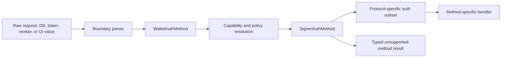

# Canonical Auth Method Domains

Date created: July 22, 2026

Status: implemented; intended-behaviour E2E validation blocked by the local site prerequisite

## Objective

Make wallet and signer authentication methods explicit, canonical, and
compiler-enforced across the SDK, server, persistence, and UI.

Adding a wallet authentication method such as Voice ID must produce compile
errors at every generic auth-method decision that requires an implementation.
Protocol surfaces that intentionally support fewer methods must reject
unsupported methods at a typed boundary instead of silently treating them as
passkeys.

## Scope

This refactor owns:

1. canonical auth-method constants and derived unions;
2. exhaustive wallet-auth and signer-auth control flow;
3. removal of duplicate broad string unions and ambiguous aliases;
4. explicit conversion from wallet auth methods into narrower protocol auth
   methods;
5. boundary parsing for persisted, requested, and worker-provided auth-method
   values;
6. static guards that make future auth-method additions compiler-visible.

This refactor does not implement Voice ID, enterprise SSO, a new signing
protocol, or a new recovery protocol. Those features consume the canonical
auth-method model after this work lands.

## Dependencies

- [Refactor 90](./refactor-90-modular-auth-capabilities-plan.md) owns modular
  auth capabilities and capability resolution.
- [Refactor 101](./refactor-101-enterprise-sso.md) owns enterprise operator
  identity. Enterprise SSO does not automatically become a wallet signing
  method.

Refactor 91 may land before the remaining Refactor 90 phases. It should reduce
their type ambiguity without changing current passkey or Email OTP behavior.

## Current State

The repository has the correct canonical pattern in
`packages/shared-ts/src/utils/signerDomain.ts`:

```ts
export const WALLET_AUTH_METHODS = {
  passkey: 'passkey',
  emailOtp: EMAIL_OTP_CHANNEL,
} as const;

export type WalletAuthMethod =
  (typeof WALLET_AUTH_METHODS)[keyof typeof WALLET_AUTH_METHODS];
```

`SIGNER_AUTH_METHODS` and `WALLET_AUTH_PROOF_METHODS` use the same enum-like
`as const` pattern. This pattern remains the standard. Native TypeScript enums
are not required.

The July 22 sweep found:

- 26 production source files using `WALLET_AUTH_METHODS` or
  `SIGNER_AUTH_METHODS`;
- 31 files independently declaring `'passkey' | 'email_otp'` unions;
- 14 files containing binary auth-method fallbacks or equivalent two-way
  assumptions;
- raw string comparisons throughout boundary parsers, core control flow, UI,
  persistence, and test fixtures.

Raw string checks are valid while parsing untrusted wire or persistence data.
They are unsafe when core logic uses an `else` branch to mean passkey.

For example:

```ts
return option.authMethod === 'email_otp' ? 'email_otp' : 'passkey';
```

A new wallet auth method would silently enter the passkey path.

## Domain Taxonomy

Auth-related values must use the narrowest applicable domain.

### Wallet Auth Method

`WalletAuthMethod` identifies a method enrolled on a wallet and available for
wallet authentication. It is the extensible product-level domain.

Current members:

- `passkey`
- `email_otp`

Future methods, including Voice ID, are added here only after their wallet
authentication lifecycle exists.

### Signer Auth Method

`SignerAuthMethod` identifies an auth method supported by signer capability,
session, and lane policy. It remains distinct from `WalletAuthMethod` even
while both domains contain the same values.

Conversion from `WalletAuthMethod` to `SignerAuthMethod` must be explicit and
exhaustive. A newly enrolled wallet method does not automatically gain signing
authority.

### Wallet Auth Proof Method

`WalletAuthProofMethod` describes evidence accepted by an authorization
boundary. It may contain non-enrollment evidence such as `session`.

Session and warm-session states must not be represented as wallet auth
methods.

### Protocol-Specific Auth Method

Protocols may intentionally support a strict subset. Examples include signing
session seals, threshold Ed25519 sessions, ECDSA role-local material, and
registration ceremonies.

Each subset must have a domain-specific name and derive its members from
canonical constants:

```ts
export type SigningSessionSealAuthMethod = Extract<
  SignerAuthMethod,
  | typeof SIGNER_AUTH_METHODS.passkey
  | typeof SIGNER_AUTH_METHODS.emailOtp
>;
```

The boundary that converts a broader method into this subset must use an
exhaustive switch and return a typed unsupported result for methods outside the
protocol.

### Auth Method Records And Authorities

Method-specific records remain discriminated unions because their required
identity fields differ:

- passkey requires RP and credential identity;
- Email OTP requires provider-subject and email identity;
- future methods require their own branch and authority fields.

Their `kind` fields must reference canonical constants. Branch construction
must use method-specific builders.

## Required Invariants

1. There is one canonical runtime constant and one derived union for each auth
   domain.
2. Core functions do not accept raw strings when a canonical auth-method type
   exists.
3. Generic control flow over `WalletAuthMethod` and `SignerAuthMethod` is
   exhaustive.
4. No conditional, ternary, default branch, or negative comparison maps every
   non-Email-OTP method to passkey.
5. Protocol-specific subsets are named for the protocol and derived from a
   canonical domain.
6. Conversion between wallet, signer, proof, registration, lane, and transport
   auth domains is explicit.
7. Untrusted values are normalized once at request, persistence, token, worker,
   or UI-storage boundaries.
8. Parsed core objects contain canonical typed values and are not repeatedly
   revalidated.
9. `warm_session` and `session` remain evidence or lifecycle states. They are
   not wallet enrollment methods.
10. Adding a member to `WALLET_AUTH_METHODS` fails static checks until every
    generic wallet-auth decision handles it.
11. Adding a member to `SIGNER_AUTH_METHODS` fails static checks until signer
    policy, lane selection, step-up, persistence, and diagnostics handle it.
12. Unsupported protocol methods fail closed with a typed result or explicit
    error. They never fall through to passkey behavior.

## Target Architecture



Core modules operate on the typed nodes to the right of the boundary parser.
Only boundary parsers inspect unknown strings.

## Implementation Phases

### Phase 0: Inventory And Classification

- [x] Generate an inventory of auth-method types, constants, comparisons,
      object construction, parsers, and persistence fields.
- [x] Classify every occurrence as wallet domain, signer domain, proof method,
      protocol subset, lifecycle/diagnostic state, or raw boundary value.
- [x] Identify ambiguous names such as the generic `AuthMethod` alias.
- [x] Identify every binary fallback that treats a non-Email-OTP method as
      passkey.
- [x] Record intentional wire values that cannot change without a protocol
      version.

Deliverable: a checked-in inventory and source guard allowlist that gives each
remaining raw literal an owner and category.

### Phase 1: Canonical Shared Domains

- [x] Keep `WALLET_AUTH_METHODS`, `SIGNER_AUTH_METHODS`, and
      `WALLET_AUTH_PROOF_METHODS` as canonical enum-like constants.
- [x] Remove the ambiguous `AuthMethod = SignerAuthMethod` alias.
- [x] Document the semantic difference between wallet enrollment, signer
      authorization, and proof methods in the shared module.
- [x] Add named conversion functions between wallet and signer auth domains.
- [x] Return a discriminated unsupported result when a wallet method cannot
      authorize a signer protocol.
- [x] Export canonical value arrays and boundary predicates from the shared
      module only.

### Phase 2: Eliminate Unsafe Binary Fallbacks

Prioritize behavior that could silently grant passkey treatment to a new
method.

- [x] Replace login-account classification in
      `useSeamsAuthMenuController.ts` with an exhaustive method switch.
- [x] Replace `record.source === 'email_otp' ? 'email_otp' : 'passkey'`
      patterns in session public APIs, NEAR signing, readiness, persisted lane
      projection, ECDSA identity, and warm-capability status.
- [x] Replace negative checks such as `authMethod !== 'email_otp'` when the
      branch means passkey.
- [x] Remove default branches that produce passkey values.
- [x] Use `assertNever` for impossible canonical auth-method branches.

This phase must preserve current behavior for passkey and Email OTP.

### Phase 3: Consolidate Core Auth Method Types

- [x] Replace broad local `'passkey' | 'email_otp'` aliases with
      `WalletAuthMethod` or `SignerAuthMethod` where the complete domain is
      intended.
- [x] Retain narrow protocol aliases only when the protocol genuinely supports
      a subset.
- [x] Rename retained subsets by protocol, such as
      `ThresholdEd25519SessionAuthMethod` or
      `SigningSessionSealAuthMethod`.
- [x] Derive retained subsets with `Extract` and canonical constant values.
- [x] Consolidate duplicate `SigningSessionSealAuthMethod` definitions between
      shared transport code and the secure-confirm worker.
- [x] Replace repeated return signatures such as
      `'passkey' | 'email_otp'` with named types.
- [x] Keep discriminated unions for `SigningLaneAuthBinding`,
      `EcdsaRoleLocalAuthMethod`, wallet authorities, and registration records.

### Phase 4: Boundary Normalization

- [x] Audit request parsers, D1 record parsers, IndexedDB parsers, token
      decoders, worker messages, and stored account options.
- [x] Parse unknown values with canonical predicates or branch-specific
      parsers.
- [x] Convert compatibility or versioned wire records into precise current
      types at the boundary.
- [x] Remove repeated normalization from core call paths.
- [x] Ensure invalid or unsupported values return typed parse failures.
- [x] Keep raw literal comparisons only inside approved boundary parsers and
      versioned serializers.

### Phase 5: UI And Account Selection

- [x] Make `StoredAccountOption.authMethod` a required canonical value once a
      stored option has passed its storage boundary.
- [x] Represent unknown or incomplete stored options as a separate parsed
      result branch instead of an optional auth method.
- [x] Use exhaustive wallet-auth rendering and login routing.
- [x] Ensure account filters select passkey, Email OTP, and future methods by
      exact method.
- [x] Keep display labels and icons in a
      `satisfies Record<WalletAuthMethod, ...>` registry.
- [x] Fail closed when an account refers to a method unsupported by the current
      UI build.

### Phase 6: Signing And Session Policy

- [x] Use `SignerAuthMethod` in generic signing policy, budget, readiness,
      step-up, and lane-selection APIs.
- [x] Make wallet-to-signer method resolution an explicit policy decision.
- [x] Use exhaustive `SigningLaneAuthBinding` switches for method-specific
      identity fields.
- [x] Separate lifecycle diagnostics such as `warm_session` from signer auth
      methods.
- [x] Audit NEAR delegate, transaction, EVM-family, export, and recovery flows
      for implicit passkey defaults.
- [x] Ensure unsupported methods cannot enter WebAuthn or Email OTP
      authenticators through fallback behavior.

### Phase 7: Server And Registration Boundaries

- [x] Tie registration input, target, record, and authority discriminants to
      canonical wallet-auth constants.
- [x] Keep method-specific registration records as strict discriminated
      unions.
- [x] Make route and D1 parsers the only server layers that inspect raw method
      strings.
- [x] Replace broad server `kind: 'passkey' | 'email_otp'` fields with a named
      canonical or protocol-specific type.
- [x] Add exhaustive handling to wallet auth-method services and registration
      ceremony transitions.
- [x] Version wire contracts before adding a method that changes persisted or
      request schemas.

### Phase 8: Static Enforcement

- [x] Add `satisfies Record<WalletAuthMethod, ...>` registries for generic UI,
      account selection, and wallet-auth policy decisions.
- [x] Add `satisfies Record<SignerAuthMethod, ...>` registries for signer
      policy and protocol admission.
- [x] Add type fixtures proving unsupported methods cannot construct passkey,
      Email OTP, lane, seal, or authority branches.
- [x] Add type fixtures proving protocol-subset conversions require explicit
      handling.
- [x] Add a source guard rejecting binary passkey fallback patterns in core
      code.
- [x] Add a source guard rejecting new ad hoc `'passkey' | 'email_otp'` aliases
      outside an approved protocol-definition allowlist.
- [x] Keep raw-string parser tests at persistence and request boundaries.

### Phase 9: Cleanup And Validation

- [x] Delete duplicate aliases, helpers, parsers, and compatibility branches
      replaced by canonical domains.
- [x] Delete tests and fixtures that encode implicit passkey fallback behavior.
- [x] Run shared, SDK, and server type checks.
- [x] Run focused EVM-family auth resolution, shared auth-domain fixtures, and
      static boundary checks.
- [ ] Run focused account-selection, wallet unlock, signing, step-up, export,
      registration, and persistence tests.
- [ ] Run intended-behaviour E2E tests for passkey and Email OTP (blocked: local
      site prerequisite returned HTTP 502).
- [ ] Verify current passkey and Email OTP registration, unlock, refresh,
      signing, step-up, and key export behavior remains unchanged.

## Migration Order

Use a leaf-to-root migration to keep changes reviewable:

1. canonical shared domains and conversions;
2. unsafe fallback branches;
3. duplicate transport and persistence types;
4. signing and session policy;
5. UI and account selection;
6. server registration and D1 boundaries;
7. static guards and obsolete-code deletion.

Do not add compatibility aliases to preserve old internal type names. Versioned
request and persistence parsers may temporarily accept old wire records, then
must produce only the canonical current types.

## Acceptance Criteria

1. Production core control flow contains no binary expression that maps every
   non-Email-OTP method to passkey.
2. `WalletAuthMethod`, `SignerAuthMethod`, and `WalletAuthProofMethod` are the
   only broad auth-method domains.
3. Every retained narrower auth-method type names its protocol and derives
   from a canonical domain.
4. Duplicate `SigningSessionSealAuthMethod` and generic `AuthMethod` aliases
   are removed.
5. Generic wallet and signer decisions are exhaustive or use complete
   `satisfies Record<...>` registries.
6. Raw auth-method strings exist only in type definitions, approved boundary
   parsers, versioned serializers, and tests for those boundaries.
7. Adding a temporary third member to `WALLET_AUTH_METHODS` causes compilation
   failures in all generic wallet-auth handlers until explicitly addressed.
8. Adding a temporary third member to `SIGNER_AUTH_METHODS` causes compilation
   failures in signer policy, lane, step-up, persistence, and diagnostics
   handlers until explicitly addressed.
9. A method unsupported by a protocol returns an explicit unsupported result
   and never invokes a passkey or Email OTP implementation.
10. Passkey and Email OTP intended-behaviour E2E tests pass without behavior
    changes.

## Explicit Non-Goals

- implementing Voice ID;
- treating enterprise SSO as signing authority;
- changing cryptographic protocols or key material;
- changing session budgets or step-up policy;
- renaming stable wire values without a protocol version;
- replacing discriminated unions with broad enums;
- retaining legacy aliases solely to avoid internal compile errors.

## Risks And Controls

### Accidental Protocol Expansion

Reusing `WalletAuthMethod` directly in a protocol may make a newly enrolled
method appear supported. Protocol subsets and explicit conversion functions
prevent that expansion.

### Persistence Compatibility

Persisted records contain stable string discriminants. Boundary parsers retain
version-specific knowledge and emit canonical current records. Core modules do
not carry compatibility unions.

### Large Mechanical Diff

The repository has many auth literals. Migrate by domain and behavior, with
focused type checks after each phase. Avoid a repository-wide search-and-replace
that erases semantic distinctions.

### False Confidence From Constants

Using constants alone does not guarantee exhaustiveness. Every generic method
decision also needs an exhaustive switch, `assertNever`, or a complete
`satisfies Record<...>` registry.

## Completion Evidence

The implementation checks currently produce:

- `pnpm -C packages/shared-ts type-check`: passed;
- `pnpm type-check`: passed;
- `pnpm -C tests type-check:intended`: passed;
- `node tests/scripts/check-auth-method-domain-boundaries.mjs`: passed;
- `node tests/scripts/check-account-signer-lifecycle-boundaries.mjs`: passed;
- focused `evmFamilyAccountAuth.unit.test.ts`: 2 passed;
- `git diff --check`: passed.

`pnpm test:intended` completed its token setup but all ten browser cases stopped
at the harness prerequisite because `https://localhost/` returned HTTP 502.
No intended auth flow reached its assertions. Re-run that suite after the local
site is serving successfully.

The final completion record should also include:

- final auth-method inventory and approved boundary allowlist;
- static fixture output for temporary third-method compilation failures;
- source-guard output for forbidden binary fallbacks and duplicate unions;
- shared, SDK, and server type-check results;
- focused auth/session test results;
- intended-behaviour E2E results for passkey and Email OTP;
- net deleted duplicate aliases, helpers, and parsers.
