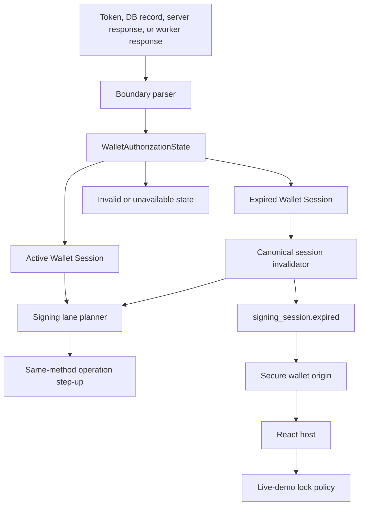

# Refactor 92: Signing Session Expiry Handling

Date created: July 22, 2026

Status: implementation and local acceptance verification complete. Network
trace and deployment-policy verification remain open.

## Objective

Handle signing-session expiry as an explicit lifecycle state across the SDK,
secure wallet origin, server, and live demo.

The generic SDK must continue to support signing when no reusable signing
session exists. It should require same-method step-up authorization for the
requested operation. The `seams.sh` live demo uses a stricter product policy:
an expired reusable Wallet Session transitions the wallet UI to its locked
state and asks the user to unlock again.

This refactor also changes the default reusable Wallet Session lifetime from
five minutes to 24 hours. Session lifetime and remaining-use budget stay
independent. A session can expire with remaining uses or exhaust its uses
before its expiry.

## Product Decisions

1. A reusable Wallet Session has a default lifetime of 24 hours.
2. The default remaining-use budget stays at three unless separately changed.
3. Expiry is a normal lifecycle outcome, represented by a typed state and a
   public event.
4. The generic SDK treats an expired or absent Wallet Session as requiring
   same-method step-up authorization for each operation.
5. The SDK does not silently mint a new reusable Wallet Session during
   step-up. Explicit wallet unlock owns reusable-session creation.
6. The live demo defines `wallet unlocked` as having an active reusable Wallet
   Session. Authoritative expiry therefore locks the demo wallet UI.
7. Locking the demo wallet does not sign the user out of their Google, app, or
   tenant identity session.
8. Session exhaustion requires step-up and does not automatically lock the
   live demo.
9. Network failures, server unavailability, malformed state, scope mismatch,
   and missing local key material are distinct from expiry.
10. Expiry never invokes Yao recovery. Existing locally sealed Ed25519 and
    ECDSA material remains available for rehydration after authorization.

## Scope

This refactor owns:

- reusable Wallet Session expiry classification;
- persisted-session boundary parsing;
- server response codes for authoritative expiry;
- in-memory, worker, and persisted-session invalidation;
- explicit public lifecycle events;
- step-up fallback for NEAR, Tempo, EVM, delegate signing, and key export;
- iframe-to-host propagation of canonical session state;
- live-demo auto-lock behavior;
- the 24-hour default Wallet Session lifetime;
- expiry race handling between preflight and operation admission;
- removal of duplicate expiry detection and message matching.

This refactor does not:

- change the three-use default signing budget;
- change app-session, Google SSO, or tenant-session lifetime;
- delete local sealed signing material when a Wallet Session expires;
- implement device linking or account recovery;
- create a reusable Wallet Session from transaction step-up;
- treat an exhausted budget as an expired Wallet Session;
- redesign the auth capability model owned by Refactor 90.

## Terminology

The implementation must keep these domains separate.

### App Identity Session

Authenticates the user to the application or Gateway. Examples include an app
JWT, cookie, Google identity, or tenant session. Its expiry is outside this
plan unless it prevents the user from completing step-up.

### Reusable Wallet Session

The signed Wallet Session authorization used by the signing system. It binds
the wallet, auth authority, runtime policy scope, signing grant, threshold
session identity, expiry, and budget. Wallet unlock creates this authority.

This plan uses `Wallet Session` for this domain.

### Signing Lane

A chain- and key-qualified Ed25519 or ECDSA signing capability. A lane can be
ready, expired, exhausted, unavailable, or invalid. Lane readiness does not by
itself define whether the live-demo wallet appears unlocked.

### Local Sealed Material

Same-device encrypted Ed25519 or ECDSA client material stored under
`seams_wallet`. Wallet Session expiry does not delete or cryptographically
recover this material. A later unlock or step-up can authorize rehydration.

## Current State And Failure Mode

The codebase already models useful lane-level readiness states in the signing
planner, including `ready`, `expired`, and `exhausted`. Those states are not yet
the sole source of truth for the full lifecycle.

Current gaps include:

1. A page can retain unlocked UI state after its Wallet Session expires.
2. Some persisted records are parsed structurally before expiry is classified,
   allowing downstream code to reconstruct apparently ready state.
3. NEAR, EVM-family signing, delegate signing, and exports perform separate
   expiry checks and repairs.
4. Some server paths collapse expiry into generic `unauthorized` responses or
   messages such as `Expired or incomplete Wallet Session claims`.
5. Client code can depend on message matching to infer expiry.
6. A request can pass client preflight, expire before server admission, and
   fail as an internal signing error.
7. UI confirmation or key export can remain open until a generic timeout even
   though the underlying Wallet Session has already expired.
8. The secure wallet iframe and React host can independently infer whether a
   wallet is unlocked from partial or optional session fields.
9. Five-minute and 24-hour defaults have existed in different configuration
   paths, making effective lifetime dependent on the entry point.

## Required Invariants

1. Untrusted token, route, worker, and persistence data is parsed once at its
   boundary into a precise session-state union.
2. An expired Wallet Session cannot construct active or signable core state.
3. `expiresAtMs <= nowMs` always classifies as expired.
4. `remainingUses <= 0` classifies as exhausted only when the Wallet Session
   itself remains temporally valid.
5. Missing, expired, exhausted, unavailable, and invalid are separate states.
6. Network or service failure never locks the wallet or becomes expiry.
7. Signature failure, scope mismatch, malformed claims, and authority mismatch
   are security errors. They do not become user-friendly expiry results.
8. Expiry invalidation removes stale JWTs, active worker bindings, volatile
   handles, cached readiness, and active persisted-session projections.
9. Expiry invalidation preserves wallet profiles, auth-method enrollment,
   chain-qualified public capabilities, and local sealed key material.
10. Every signing surface uses the same classifier and invalidation service.
11. The SDK emits one expiry event for a given wallet and Wallet Session,
    regardless of how many concurrent lanes observe it.
12. The live demo reacts to that canonical event and does not independently
    parse JWTs or inspect optional expiry fields.
13. Generic SDK signing continues through a same-method step-up plan after
    expiry when the requested operation supports step-up.
14. Step-up authorizes only the current operation unless the caller explicitly
    invokes wallet unlock.
15. A server-side expiry race may retry once through step-up. It cannot loop.
16. Expiry does not call Deriver A, Deriver B, Yao recovery, or device linking.
17. The 24-hour TTL is configured once and cannot exceed a server-owned maximum.
18. Public events and errors contain no JWT, OTP, PRF output, sealed plaintext,
    private key material, or other secret.

## Domain Model

### Wallet Authorization State

Core code should consume a required, discriminated state rather than an object
with optional session fields.

```ts
export type WalletAuthorizationState =
  | {
      readonly kind: 'active';
      readonly walletId: WalletId;
      readonly walletSessionId: WalletSessionId;
      readonly authMethod: WalletAuthMethod;
      readonly expiresAtMs: number;
    }
  | {
      readonly kind: 'expired';
      readonly walletId: WalletId;
      readonly walletSessionId: WalletSessionId;
      readonly authMethod: WalletAuthMethod;
      readonly expiresAtMs: number;
      readonly detectedAtMs: number;
    }
  | {
      readonly kind: 'missing';
      readonly walletId: WalletId;
    }
  | {
      readonly kind: 'unavailable';
      readonly walletId: WalletId;
      readonly reason: 'network' | 'server_unavailable';
    }
  | {
      readonly kind: 'invalid';
      readonly walletId: WalletId;
      readonly reason:
        | 'malformed'
        | 'signature_invalid'
        | 'scope_mismatch'
        | 'authority_mismatch';
    };
```

The final names should follow existing branded IDs and auth-method constants.
Raw strings must be converted by boundary parsers before constructing this
union.

### Signing Lane Readiness

Lane readiness remains a separate discriminated union. It should retain at
least:

- `ready`
- `expired`
- `exhausted`
- `missing_session`
- `auth_unavailable`
- `status_unavailable`
- `budget_unknown`

The wallet authorization classifier feeds the lane planner. It does not merge
wallet-level expiry with lane-level exhaustion.

### Expiry Detection Source

The source is observability data and must not influence core policy.

```ts
export type SigningSessionExpiryDetectionSource =
  | 'restore'
  | 'visibility'
  | 'focus'
  | 'operation_preflight'
  | 'server_rejection';
```

## Public Event Contract

Add a dedicated signing-session lifecycle event rather than forcing expiry
into an in-progress transaction step.

The minimum public event is:

```ts
export type SigningSessionExpiredEvent = {
  readonly event: 'signing_session.expired';
  readonly walletId: WalletId;
  readonly walletSessionId: WalletSessionId;
  readonly authMethod: WalletAuthMethod;
  readonly expiresAtMs: number;
  readonly detectedAtMs: number;
  readonly source: SigningSessionExpiryDetectionSource;
};
```

Add corresponding typed events for `signing_session.exhausted` and
`signing_session.invalidated` only when a consumer needs those transitions.
They must remain distinct from expiry.

The event transport must:

- preserve the exact discriminant through the wallet iframe boundary;
- deduplicate by wallet ID and Wallet Session ID;
- emit before a pending operation requests step-up or the demo locks;
- avoid exposing authorization tokens or raw claims;
- version the public event contract if the current event envelope cannot add
  this event compatibly.

## Target Architecture



## Canonical Expiry Flow

### Generic SDK

1. Parse or query Wallet Session state before an operation.
2. If active, continue through ordinary budget and lane planning.
3. If expired, invalidate the exact Wallet Session and emit
   `signing_session.expired` once.
4. Preserve enrolled auth authority and local sealed material.
5. Plan same-method step-up for the current operation.
6. Complete that operation without minting a reusable Wallet Session.
7. Return a typed step-up cancellation or failure if the user declines or the
   authorization fails.

### Live Demo

1. Receive the canonical expiry event from the secure wallet boundary.
2. Confirm that the event refers to the currently displayed wallet and Wallet
   Session.
3. Invoke the existing wallet-lock action once.
4. Transition to the locked or unlock view.
5. Show: `Your signing session expired. Unlock your wallet to continue.`
6. Preserve app identity and account-picker context.

The demo must not wait for a transaction failure to discover expiry.

### Admission Race

A Wallet Session can expire after local preflight and before server admission.
The operation handles this race as follows:

1. The server returns a structured `wallet_session_expired` code.
2. The SDK parses that code at the RPC boundary.
3. The canonical invalidator clears the stale session and emits the event.
4. The generic SDK retries the operation once through same-method step-up.
5. A second expiry response returns a typed terminal failure.

No flow retries based on matching error-message text.

## Implementation Phases

### Phase 0: Inventory And Freeze Semantics

- [x] Inventory Wallet Session construction, parsing, persistence, restoration,
      budget status, invalidation, and event paths.
- [x] Identify every direct comparison against expiry timestamps.
- [x] Identify every message matcher for expired or incomplete Wallet Session
      claims.
- [x] Classify each occurrence as boundary validation, core policy, UI policy,
      diagnostics, or obsolete duplicate logic.
- [x] Record the current effective TTL and server maximum for passkey and Email
      OTP registration, unlock, refresh, signing, delegate signing, and export.
- [x] Freeze the product distinctions between expiry, exhaustion, missing
      session, invalid session, unavailable status, and missing local material.

Deliverable: a deletion ledger and an owner for every retained expiry check.

### Phase 1: Unify Lifetime Configuration

- [x] Define one shared `DEFAULT_THRESHOLD_SESSION_TTL_MS` value of 24 hours.
- [x] Use the shared default for passkey and Email OTP Wallet Session creation.
- [x] Use the same default for Ed25519, Tempo ECDSA, and EVM ECDSA lanes.
- [x] Retain explicit test-only TTL overrides where expiry behavior is under
      test.
- [x] Define and enforce a server-owned maximum TTL.
- [x] Audit deployment variables and generated GitHub environment manifests so
      staging and production do not silently retain a five-minute override.
- [x] Keep remaining-use defaults independent from TTL configuration.

Acceptance: every ordinary unlock path mints the same 24-hour policy, subject
to the server maximum.

### Phase 2: Parse Persisted And Runtime State Once

- [x] Add one boundary parser for persisted Wallet Session records.
- [x] Add one boundary parser for decoded Wallet Session claims.
- [x] Parse into `active`, `expired`, `missing`, `unavailable`, or `invalid`.
- [x] Reject direct construction of active state from a positive timestamp
      without comparing it to `nowMs`.
- [x] Require `nowMs` as an explicit parser input so tests are deterministic.
- [x] Preserve restore metadata on expired records without exposing them as
      active lanes.
- [x] Project exact parsed state into the existing signing-lane readiness union.
- [x] Remove downstream revalidation of the same raw record.

Static fixtures must prove that expired and invalid branches cannot be passed
to functions requiring active state.

### Phase 3: Canonical Session Invalidation

- [x] Add one application service that accepts only a typed expired Wallet
      Session.
- [x] Clear the exact cached Wallet Session JWT or authorization handle.
- [x] Remove exact volatile Ed25519 and ECDSA bindings associated with that
      Wallet Session.
- [x] Mark persisted active-session projections inactive or expired.
- [x] Clear cached budget and readiness state for the exact session.
- [x] Preserve wallet identity, auth enrollment, public capabilities, and local
      sealed material.
- [x] Make invalidation idempotent for concurrent expiry observations.
- [x] Emit one typed lifecycle event after local invalidation succeeds.

The service must not accept a generic string reason or a partially populated
session object.

### Phase 4: Structured Server Expiry Results

- [x] Return `wallet_session_expired` from Wallet Session validation when
      temporal expiry is the exact failure.
- [x] Return separate codes for exhausted budget, missing session, invalid
      signature, scope mismatch, and malformed claims.
- [x] Update budget-status routes to preserve those distinctions.
- [x] Update Ed25519 and ECDSA admission routes to use the same error taxonomy.
- [x] Parse server errors once into a typed SDK error union.
- [x] Remove client message matching after every production route emits the
      structured code.

Do not map `Expired or incomplete Wallet Session claims` to expiry. Incomplete
claims are invalid state and must fail closed.

### Phase 5: Unify Signing And Export Behavior

- [x] Route NEAR transaction signing through the canonical classifier.
- [x] Route Tempo and EVM transaction signing through the same classifier.
- [x] Route delegate signing through the same classifier.
- [x] Route Ed25519 and ECDSA export through the same classifier.
- [x] Detect expiry before opening confirmation UI when local state already
      proves expiry.
- [x] Cancel pending confirmation requests when authoritative expiry arrives.
- [x] Replace generic 60-second export timeout behavior with immediate typed
      expiry handling.
- [x] Plan same-method step-up for the current operation.
- [x] Retry at most once after an authoritative server expiry race.
- [x] Keep operation cancellation distinct from expiry.

Each operation should consume a narrow plan branch rather than reimplementing
expiry checks.

### Phase 6: Secure Wallet Boundary Ownership

- [x] Make the secure wallet origin the canonical owner of the active Wallet
      Session state.
- [x] Return or mirror the exact session state from iframe initialization.
- [x] Forward typed expiry events through the existing host bridge.
- [x] Prevent React from reconstructing login state from optional session IDs,
      expiry timestamps, or diagnostics.
- [x] Ensure iframe initialization completes before the host loads a wallet as
      unlocked.
- [x] Clear pending host requests for the expired session with a typed result.
- [x] Deduplicate session-expired events before forwarding them to consumers.

### Phase 7: Live-Demo Auto-Lock Policy

- [x] Subscribe the demo controller to `signing_session.expired`.
- [x] Lock only when the event matches the currently active wallet and Wallet
      Session.
- [x] Show the user-facing expiry message once.
- [x] Preserve the app identity session and recent-wallet picker state.
- [x] Check canonical status on initial restore and page refresh.
- [x] Recheck on `visibilitychange` when the document becomes visible.
- [x] Recheck on window focus.
- [x] Retain low-frequency polling as a backup, not the primary source of truth.
- [x] Do not lock for exhaustion, network errors, status unavailability, or a
      failed background poll.
- [x] Avoid duplicate toasts when focus, polling, and an operation discover the
      same expiry concurrently.

### Phase 8: Remove Obsolete Paths

- [x] Remove per-flow expiry message matchers.
- [x] Remove duplicated session invalidation in NEAR, EVM-family, delegate, and
      export flows.
- [x] Remove UI-level JWT expiry parsing.
- [x] Remove optional-field inference used to decide whether the wallet is
      unlocked.
- [x] Remove persisted-state paths that can classify an expired record as
      runtime-ready.
- [x] Remove tests and fixtures that expect an expired session to remain
      unlocked or signable.
- [x] Keep compatibility parsing only at request and persistence boundaries,
      then delete it when the old shape is no longer stored or accepted.

### Phase 9: Validation

- [x] Add type fixtures rejecting expired state where active state is required.
- [x] Add deterministic boundary-parser tests using an injected `nowMs`.
- [x] Add invalidation idempotency tests for concurrent expiry detection.
- [x] Add server route tests for each structured error code.
- [x] Add planner tests proving expiry and exhaustion produce different plans.
- [x] Add iframe bridge tests for exact event propagation and deduplication.
- [x] Add demo-controller tests for lock policy and single-toast behavior.
- [x] Add focused tests for the preflight/admission expiry race and one-retry
      limit.
- [x] Run intended-behaviour E2E coverage across passkey and Email OTP.

### Focused Verification Evidence

Evidence recorded July 23, 2026:

- `packages/sdk-web/src/core/signingEngine/session/identity/clientSessionPersistenceState.typecheck.ts`
  rejects expired, missing, unavailable, and invalid authorization at the
  active-only boundary through the SDK build typecheck.
- `tests/unit/refactor92.boundaryAndServer.unit.test.ts` covers deterministic
  persistence-boundary parsing at equality and elapsed time, active-state
  admission, distinct missing/unavailable/invalid states, JWT temporal
  validation, and the shared parse-reason-to-server-code mapping.
- `tests/unit/signingBudgetStatus.parser.unit.test.ts` directly exercises the
  budget-status route parser for missing, signature-invalid, claims-invalid,
  expired, scope-mismatched, unavailable, and exhausted Wallet Sessions. All
  16 parser checks pass and assert the exact structured code and HTTP status.
- `tests/unit/refactor92.invalidationIdempotency.unit.test.ts` proves concurrent
  observations produce one invalidation event and two deduplicated results.
- `tests/unit/refactor92.surfacePlanning.audit.unit.test.ts` covers passkey and
  Email OTP step-up planning for the three distinct signing lanes: NEAR
  Ed25519, Tempo ECDSA, and EVM ECDSA. It asserts that expiry and exhaustion
  return the correct typed reauthentication branch for each lane.
- `tests/unit/refactor92.structuredFailureRetry.audit.unit.test.ts` covers exact
  structured failure parsing, rejects prose matching, permits one EVM-family
  fresh-auth retry, and blocks a second retry.
- `tests/unit/seamsSite.walletSessionExpiry.unit.test.ts` covers the public
  event parser, secret-field stripping, exact wallet/session deduplication,
  demo lock behavior, restore/focus/visibility sources, and non-locking
  exhausted or unavailable states.
- The consolidated Refactor 92 Playwright run executed 48 checks and all 48
  passed. An adjacent session-authorization and local-material run executed 18
  checks and all 18 passed, for 66 passing focused checks. The temporal
  precedence regression is covered across budget status, warm record-policy
  claims, and durable record-policy advisories: elapsed time wins when a
  session is both expired and depleted.
- SDK web, shared types, SDK server, and the Refactor 92 static fixture project
  all pass TypeScript type-checking.
- The runtime event path was audited end to end: the signing-session
  coordinator emits after exact invalidation, `SeamsWeb` forwards the typed
  event, the wallet host posts it through `SDK_LIFECYCLE_EVENT`, and the iframe
  client rejects exact-session pending requests before deduplicated consumer
  delivery.
- `tests/wallet-iframe/router.sessionExpiryLifecycle.test.ts` proves runtime
  forwarding and deduplication for exact expiry events. It also proves that a
  stale-session event neither changes the active-session mirror nor cancels an
  unrelated pending request, while the matching event immediately transitions
  the mirror and rejects the exact-session request.
- `pnpm test:intended` passed all nine passkey and Email OTP scenarios in 2.9
  minutes. The run covered registration, immediate signing, unlock, page
  refresh, warm allowance continuity, budget exhaustion, same-method step-up,
  concurrent Tempo and Arc signing, and Ed25519 and ECDSA export.

The following deployment validation remains open:

- [ ] Capture network-trace proof that expiry never calls Yao or Deriver
  services. The
  current evidence is planner-level only;
- [ ] Verify the effective 24-hour default in staging.
- [ ] Verify the effective 24-hour default in production.

## Intended-Behaviour Matrix

| Scenario | Generic SDK | Live demo |
|---|---|---|
| Active session, uses remaining | Sign with warm session | Remain unlocked |
| Active session, final use consumed | Complete operation, next operation requires step-up | Remain unlocked |
| Budget exhausted before operation | Require same-method step-up | Remain unlocked |
| Wallet Session expired before operation | Emit expiry, invalidate, require step-up | Lock and show unlock message |
| Session expires while page is hidden | Detect on visibility/focus | Lock once |
| Session expires between preflight and admission | Invalidate and retry once through step-up | Lock; user unlocks before retrying |
| Wallet Session missing | Require same-method step-up | Show locked state |
| Local sealed material missing | Return device-link or recovery state | Show device-link or recovery UI |
| Budget status network failure | Return unavailable or continue under existing fail-closed policy | Do not lock |
| Invalid signature or scope | Return security error | Do not describe as expiry |
| User cancels step-up | Return typed cancellation | Preserve locked state |

### Contract Stage Names

The intended-behaviour contracts use these stage names for the lifecycle matrix:

- `post_registration` and `post_unlock` mean the newly minted session is active
  and still has reusable allowance. The operation should use the warm session.
- `after_refresh_recovery` means the browser rehydrated the exact local sealed
  material and rebound it to the restored session. It does not imply a fresh
  Yao or Deriver recovery.
- `step_up_required` means the reusable session is absent, exhausted, or
  expired for the requested operation. The SDK performs the same-method
  step-up required by the caller and does not silently mint a reusable session.
- `after_step_up` is used only for a follow-up operation when the contract
  intentionally verifies the allowance created by that step-up.

These labels describe observable contract stages. They do not change the
session state machine or select a signing path.

## E2E Acceptance Scenarios

### Passkey

- [x] Unlock creates a 24-hour Wallet Session with the configured use budget.
- [x] Page refresh restores an unexpired Wallet Session.
- [x] Exhausting the budget requires passkey step-up without locking the demo.
- [x] Advancing beyond expiry emits one event and locks the demo.
- [x] Generic SDK signing after expiry completes through passkey step-up.
- [x] NEAR, Tempo, EVM, delegate signing, Ed25519 export, and ECDSA export use
      the same expiry behavior.
- [ ] Expiry does not invoke Deriver A or Deriver B.

### Email OTP

- [x] Unlock creates a 24-hour Wallet Session with the configured use budget.
- [x] Page refresh restores an unexpired Wallet Session.
- [x] Exhausting the budget requires Email OTP step-up without locking the demo.
- [x] Advancing beyond expiry emits one event and locks the demo.
- [x] Generic SDK signing after expiry completes through Email OTP step-up.
- [x] NEAR, Tempo, EVM, delegate signing, Ed25519 export, and ECDSA export use
      the same expiry behavior.
- [ ] Expiry does not invoke Yao recovery when local sealed material exists.

### Failure And Race Coverage

- [x] Concurrent NEAR and EVM requests observe one invalidation and one event.
- [x] A server-side expiry after preflight causes at most one retry.
- [x] Network failure does not emit `signing_session.expired`.
- [x] Invalid claims do not emit `signing_session.expired`.
- [x] A stale background response for an old wallet does not lock the current
      wallet.
- [x] No confirmation or export request waits for a generic timeout after
      authoritative expiry is known.

## Observability

Record non-secret structured fields for:

- expiry detection source;
- wallet and Wallet Session identifiers;
- auth method;
- configured TTL and absolute expiry;
- local versus server-authoritative detection;
- invalidation duration and result;
- event deduplication;
- step-up plan selection;
- retry count;
- live-demo lock transition.

Diagnostics must observe control flow after the typed decision. They must not
select the decision.

Recommended metrics:

- `wallet_session_expired_total{source,auth_method}`
- `wallet_session_invalidation_total{result}`
- `wallet_session_expiry_step_up_total{operation,auth_method}`
- `wallet_session_expiry_retry_total{operation,result}`
- `wallet_session_demo_lock_total{source}`
- `wallet_session_expiry_event_deduplicated_total`

## Rollout Order

1. Land the shared TTL and structured server error taxonomy.
2. Land boundary parsers and canonical invalidation behind existing behavior.
3. Migrate NEAR, EVM-family, delegate, and export flows one at a time.
4. Add and expose the public lifecycle event.
5. Move iframe and React state ownership to the canonical session state.
6. Enable the live-demo auto-lock policy.
7. Run the intended-behaviour matrix.
8. Delete old message matching, duplicated invalidation, and UI inference.
9. Deploy staging and verify expiry using a short explicit test TTL.
10. Deploy production with the 24-hour default and verify effective policy from
    emitted session metadata.

## Completion Criteria

Refactor 92 is complete when:

1. every Wallet Session enters core logic through one typed classifier;
2. expired state cannot be used as active state at compile time or runtime;
3. every signing and export surface shares one expiry path;
4. the server returns structured, exact expiry errors;
5. the SDK emits a typed, deduplicated expiry event;
6. the generic SDK uses same-method operation step-up after expiry;
7. the live demo locks exactly once for authoritative Wallet Session expiry;
8. exhaustion, network failure, invalid state, and missing material remain
   distinct;
9. expiry preserves local sealed material and never triggers Yao recovery;
10. obsolete expiry checks, message matchers, and UI inference paths are
    removed;
11. passkey and Email OTP intended-behaviour tests cover the complete matrix;
12. staging and production mint the intended 24-hour default Wallet Session.
